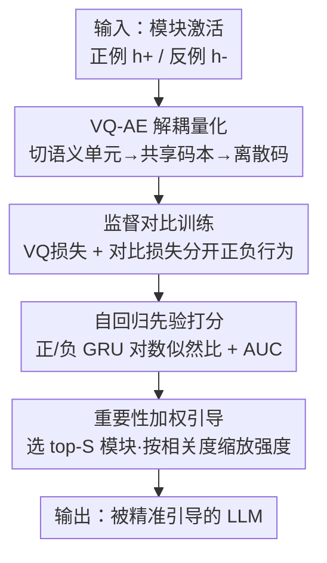

# REAL: Reading Out Transformer Activations for Precise Localization in Language Model Steering

**会议**: ICLR 2026  
**OpenReview**: [https://openreview.net/forum?id=P38RYdkFLI](https://openreview.net/forum?id=P38RYdkFLI)  
**代码**: https://github.com/liam0949/REAL_ICLR  
**领域**: 可解释性 / 激活定位 / 推理期干预  
**关键词**: 激活引导, 模块定位, 向量量化自编码器, 注意力头选择, 真实性

## 一句话总结
REAL 给 Transformer 的每个注意力头（或层）训练一个向量量化自编码器（VQ-AE），把高度纠缠的隐藏激活映射到一个可分离的离散码空间，再用两个自回归先验的对数似然比 + AUC 打分来判断"这个模块到底跟目标行为多相关"，从而精准选出要干预的模块并按相关度自适应调节引导强度，在真实性引导上相对 ITI 平均提升 20%（最高 81.5%）。

## 研究背景与动机

**领域现状**：推理期激活引导（activation steering）是当下做 LLM 对齐与安全的一条热门路线——不动模型参数，只在解码时往某些中间激活里加一个"引导向量"，就能把模型行为往真实性、拒答、长期推理等目标上拨。整个流程通常分两步：先**选模块**（决定在哪些注意力头/层上动手），再**造向量**（构造引导向量并加进去）。

**现有痛点**：学界绝大部分精力都花在"怎么造更好的引导向量"上（TruthFlow、SpARE、LoFiT 等），而"在哪里干预"和"用多大力度干预"这两件同样关键的事却被严重低估。现有的模块选择方法要么用简单的**线性探针**（如 ITI 训一个逻辑回归探针给每个头打分），要么靠**经验启发式**，要么靠**昂贵的交叉验证 + 人工选层**。问题在于：注意力头是多义的（既管归纳又管长程事实检索），它们的行为相关特征往往**纠缠**在隐藏激活里、并非线性可分，线性探针根本拎不出来。

**核心矛盾**：论文用一张对比图点出了要害——ITI 用线性探针选出的 top-48 头，和 REAL 选出的 top-48 头几乎没有重叠；而用这两套头去引导同一个模型，结果天差地别。ITI 选错头会带来不稳定的生成、无依据的断言、甚至更多幻觉；而真实性本身又卡在"信息量 vs 真实性"的张力上，选错模块就会在这个 trade-off 里翻车。换句话说，**选模块的精度直接决定了引导的成败**，但现有工具的分辨率不够。

**本文目标**：提出一个原理清晰、有效且高效的模块（头或层）选择方法，既能精准定位与目标行为最相关的模块，又能顺带给出每个模块的干预强度。

**切入角度**：既然激活是纠缠的、线性不可分的，那就用一个**非线性、可解耦**的表示来"读出"激活里的行为信号。作者借用了视觉/多模态里成熟的 VQ-AE 离散编码思路，把它搬到激活分析上——把激活压进一个被显式切分成行为相关/无关子空间的离散码空间。

**核心 idea**：给每个模块训一个 VQ-AE 学解耦的离散码，再用"正/负行为各一个自回归先验的对数似然比 + AUC"来量化模块的行为判别力，这个分数同时指导**选哪些模块**和**每个模块用多大力度**。

## 方法详解

### 整体框架

REAL（REading out transformer Activations for precise Localization）的目标是：给定一个目标行为（如真实性）和一份"正例/反例"对比数据集，对模型的每一个候选模块打一个"行为相关度分数" $s^{(l,i)}$，然后选出分数最高的若干模块去做引导，并让引导强度跟分数挂钩。流程是一条清晰的串行管线：

对单个注意力头 $(l,i)$，取其最后一个 token 的激活 $h_T^{(l,i)}$，先送进一个 VQ-AE：编码器把它投到低维嵌入，切成若干"语义单元"，每个单元在一个**共享可学码本**里做最近邻量化，得到一串离散码；VQ-AE 用重构损失 + 监督对比损失训练，让正/负行为的码尽量分开。训完后，对每个头收集到的离散码序列，分别在正例集和反例集上拟合两个轻量 GRU 自回归先验；用两者的对数似然比作为打分，再用这些分数在验证集上算 AUC-ROC，得到该头的行为相关度 $s^{(l,i)}$。最后按分数排序选 top-$S$ 个头组成干预集 $G$，并把每个头的引导向量按归一化后的相关度缩放后加回激活。整套流程在头级和层级通用（层级只是把单元换成层）。

### 关键设计

**1. VQ-AE 解耦量化：把纠缠激活读成可分离的离散码**

这一步直接对准"激活纠缠、线性探针拎不出行为特征"的痛点。对头 $(l,i)$ 的激活 $h_T^{(l,i)}\in\mathbb{R}^{d_h}$，编码器先投到低维嵌入 $z^{(l,i)}=E(h_T^{(l,i)})\in\mathbb{R}^{d_e}$，然后把它**切成 $U$ 个"语义单元"** $z^{(l,i)}=[z_1^{(l,i)};\dots;z_U^{(l,i)}]$，每个单元长度 $d_u=d_e/U$。每个语义单元在一个**所有单元共享的可学码本** $\mathcal{C}=\{c_k\in\mathbb{R}^{d_u}\}_{k=1}^K$ 里做最近邻量化：$\kappa_u^{(l,i)}=\arg\min_k\lVert z_u^{(l,i)}-c_k\rVert_2^2$，得到一串离散码 $\kappa_{1:U}^{(l,i)}$。解码器再用对应码字重构激活。VQ 损失就是标准三件套：

$$\mathcal{L}_{VQ}=\underbrace{\lVert h_T^{(l,i)}-D(\hat z)\rVert_2^2}_{\text{重构}}+\underbrace{\lVert \mathrm{sg}[z]-\hat z\rVert_2^2}_{\text{码本}}+\beta\underbrace{\lVert z-\mathrm{sg}[\hat z]\rVert_2^2}_{\text{承诺}}$$

把激活切成语义单元 + 共享码本的好处是：不同单元可以分别捕获行为"促进/抑制"两个侧面，天然把行为相关因子和无关因子隔开，得到一个比线性探针解耦得多的表示空间，为后面判别"哪个头相关"打地基。

**2. 监督对比损失：让离散码显式地"按行为分类"**

光有重构还不够——重构只保证"码能还原激活"，不保证"码能区分正负行为"。于是作者在 VQ 损失之上加一个作用在量化嵌入 $\hat z$ 上的**监督对比损失** $\mathcal{L}_{SC}$，把同一行为标签（$y_i$ 相同）的样本在码空间里拉近、不同标签的推远：

$$\mathcal{L}_{SC}=-\frac{1}{N}\sum_{i=1}^{N}\frac{1}{|P(i)|}\sum_{j\in P(i)}\log\frac{\exp(s_{ij})}{\sum_{k\neq i}\exp(s_{ik})},\quad s_{ij}=\frac{\hat z_i^\top\hat z_j}{\tau}$$

其中 $P(i)$ 是与 $i$ 同标签的正样本集合，$\tau$ 是温度。总目标是 $\mathcal{L}=\mathcal{L}_{VQ}+\alpha\mathcal{L}_{SC}$，$\alpha$ 平衡重构与对比。这一项是 REAL 能"读出行为"的关键：它逼着模型自动把"行为相关 / 无关"特征落到不同码字上，使得后续仅凭离散码就能判别行为，而不必依赖脆弱的线性可分假设。

**3. 自回归先验打分：用对数似然比 + AUC 量化模块相关度**

有了离散码序列后，怎么把它变成一个"这个头多相关"的标量分数？作者给正例集 $D_+$ 和反例集 $D_-$ **各拟合一个类条件自回归先验**（用轻量 GRU，交叉熵训练）：$p_{\theta_c}(\kappa_{1:U}^{(l,i)})=\prod_u p_{\theta_c}(\kappa_u\mid\kappa_{1:u-1})$。对验证样本 $x$，先用 VQ-AE 拿到它在头 $(l,i)$ 上的码序列，再算正负先验的**对数似然比**作为打分：$r(x)^{(l,i)}=\log p_{\theta_+}(x)-\log p_{\theta_-}(x)$。最后把这个分数当成正类得分，用它在验证集上算 ROC-AUC，得到头的相关度分数：

$$s^{(l,i)}=\mathrm{AUC}\big(\{(r(x)^{(l,i)},y)\mid(x,y)\in D_{val}\}\big)$$

用自回归先验是因为它天然契合离散码序列——逐码建模能抓住码之间的组合依赖，给出良定义的似然；正负似然比则提供了"行为相关"的校准证据。AUC 越大，说明这个头越能把正负行为分开，也就越值得干预。这把"模块选择"问题转成了一个干净的二分类判别力度量，比线性探针的权重、LoFiT 的标量幅度都更原理化。

**4. 重要性加权引导：让干预强度跟着相关度走**

分数 $s^{(l,i)}$ 不只用来选模块，还用来定力度。先按分数排序选 top-$S$ 个头组成干预集 $G$；引导时不再像标准 ITI 那样对每个头加同样强度的向量，而是按**归一化相关度**缩放：

$$\hat h_t^{(l,i)}=h_t^{(l,i)}+\frac{s^{(l,i)}}{s^{(l,i)}_{\max}}\,\epsilon\, v^{(l,i)},\quad (l,i)\in G$$

其中 $v^{(l,i)}$ 是引导向量（可由 ITI 的均值差、或 LoFiT 的偏好微调向量给出），$s^{(l,i)}_{\max}$ 是所有头里的最高分。这一步呼应了 LITO 的观察——恒定强度抓不住多义动态；REAL 让越相关的头被推得越用力、边缘头被轻推，从而在"信息量 vs 真实性"的张力里更稳地落点。注意 REAL 只管"选哪里 + 多大力"，引导向量本身复用现有方法，所以它能即插即用地接到 ITI、LoFiT 这些已有引导框架上。

### 损失函数 / 训练策略
VQ-AE 总目标 $\mathcal{L}=\mathcal{L}_{VQ}+\alpha\mathcal{L}_{SC}$；自回归先验用交叉熵单独训。训练极轻量：训一个头约 50 秒、758 MB 显存，可并行批训；层级（如 Llama3-8B 的 32 层）训一层约 3 分钟、1614 MB，一批并行训 20 层。关键超参为语义单元数 $U$、码本大小 $K$、对比损失权重 $\alpha$，均在消融中扫过。

## 实验关键数据

评测覆盖 **8 个 LLM**（LLAMA 与 QWEN 两大家族，含标准多头注意力与 GQA）和 **9 个数据集**，任务横跨真实性增强、知识冲突下的开放域 QA、通用对齐三类。

### 主实验

真实性引导（TRUTHFULQA，MC1/MC2，相对 IT/LoFiT 的提升）：

| 模型 | 指标 | No Steer | ITI | REAL_ITI | 相对提升 |
|------|------|----------|-----|----------|----------|
| Qwen2.5-7B-Instruct | MC1 | 28.52 | 24.48 | 44.43 | +81.5% |
| Qwen2.5-7B-Instruct | MC2 | 43.40 | 40.51 | 64.21 | +58.5% |
| Llama-7B | MC1 | 25.46 | 27.42 | 34.27 | +25.0% |
| Llama2-7B | MC1 | 26.89 | 32.90 | 39.29 | +19.4% |
| Llama2-7B-Chat | MC1 | 28.52 | 32.80 | 36.97 | +12.7% |

接到 LoFiT 上时 REAL_LoFiT 也能再涨（Llama2-7B：MC1 58.14→59.61，MC2 75.83→77.48）。LLM-as-judge（gpt-5-mini）评测里，Llama2-7B-Chat 上 REAL_ITI 把真实率 54.59→77.64、信息量 6.23→27.55、Truth×Info 3.40→21.39。

知识冲突 QA（NQSWAP / MACNOISE，Llama3-8B，EM）：

| 数据集 | 维度 | SPARE | REAL | 提升 |
|--------|------|-------|------|------|
| NQSWAP | Contextual | 77.69 | 80.17 | +3.19% |
| NQSWAP | Parametric | 47.51 | 49.33 | +3.83% |
| MACNOISE | Parametric | 30.72 | 32.57 | +6.02% |

REAL 还发现了比 SPARE 更广的有用层集合（5、11、12、13–16，而非仅 13–16），说明层定位更准。

### 消融实验

| 配置 | 关键发现 | 说明 |
|------|---------|------|
| 语义单元数 $U$ | $U=1$ 会让码本坍缩（Llama3.1-8B 上无法干预） | 切分成多单元是解耦的前提 |
| 码本大小 $K$ | MC1/MC2 随 $K$ 变化，存在最优区间 | 码字太少表达不足 |
| 对比权重 $\alpha$ | 影响正负码分离度 | $\alpha=0$ 退化为纯 VQ |
| REAL Adaptive vs Fixed | 头数 ≥50 后自适应明显更稳（如 1024 头：31.38 vs 17.82） | 重要性加权抗"过度干预" |
| 训练数据 50% | REAL(50%) 40.27 仍超过 ITI(100%) 30.72 | 对数据量远比 ITI 鲁棒 |

### 关键发现
- **选模块的精度是胜负手**：REAL 与 ITI 选出的 top-48 头几乎不重叠，而前者带来更忠实、更校准的输出，后者常引入幻觉与无依据断言。
- **重要性加权防"用力过猛"**：当干预头数加到很大（如全部 1024 头）时，固定强度会崩到 17.82，自适应缩放还能稳在 31.38，说明按相关度调强度是抗噪声头干扰的关键。
- **强零样本跨域迁移**：在 TRUTHFULQA 上选出的头，不调参直接用到 MQUAKE / CLUTRR 知识检索任务上，EM 仍优于基线。
- **ITI 在 GQA 上易失效**：Qwen、Llama3.1 上 ITI 单独使用会失败，疑因分组查询注意力（GQA）破坏了线性探针假设，而 REAL 仍稳。

## 亮点与洞察
- 把"模块选择"从启发式/线性探针升级成一个有原理的二分类判别力度量（对数似然比 + AUC），思路干净且可解释——分数高低直接对应"码空间能不能分开正负行为"。
- VQ 离散码 + 自回归先验的组合很巧：离散化天然适配序列先验，正负两个 GRU 的似然比给出校准证据，比"训个探针看权重"扎实得多。
- "同一个分数既选模块又定强度"是个省事又自洽的设计——把定位与强度调度统一进一个量，避免了额外的强度调参。
- 即插即用：REAL 只负责"在哪、多大力"，引导向量沿用 ITI/LoFiT/SAE，所以能无缝增强一整排现有引导方法，迁移成本低。

## 局限与展望
- 层级知识冲突实验只在 Llama3-8B 上做，因为公开 SAE 权重仅此一家，跨模型的层级结论尚待验证。
- 每个模块都要单独训一个 VQ-AE + 两个 GRU，虽轻量但模块数大时（上千头 × 多层）总成本仍可观，可探索共享/摊销训练。
- 行为相关度依赖正/负对比数据集的质量与标注，目标行为难以二元划分时（如开放式价值对齐）打分可能失真。
- 自适应强度的缩放是线性归一化，是否最优的强度调度函数仍是开放问题。

## 相关工作与启发
- **vs ITI**：ITI 用线性逻辑回归探针选头、恒定强度干预；REAL 用非线性解耦的 VQ 码 + AUC 选头、按相关度自适应调强度，在纠缠/GQA 场景下定位更准，真实性平均 +20%。
- **vs LoFiT**：LoFiT 靠每头一个偏好微调标量的幅度估相关度，缺鲁棒性；REAL 提供更原理化的判别力分数，且能反过来增强 LoFiT（REAL_LoFiT 再涨）。
- **vs SpARE**：SpARE 用稀疏自编码器抽解耦方向、主要管"造向量"；REAL 聚焦"选模块/选层"，二者互补——REAL 找到的层集合比 SpARE 更广更准。
- **vs LITO**：LITO 指出恒定强度抓不住多义动态、主张动态调强度；REAL 把"强度"直接绑定到模块相关度分数上，给出了一种具体的调度依据。

## 评分
- 新颖性: ⭐⭐⭐⭐⭐ 把 VQ-AE + 自回归先验引入"模块选择"这个被忽视的环节，视角新颖且原理清晰
- 实验充分度: ⭐⭐⭐⭐⭐ 8 模型 × 9 数据集 × 三类任务，含跨域迁移、数据量、强度、码本等多维消融
- 写作质量: ⭐⭐⭐⭐ 方法与动机叙述清楚，图表丰富；部分细节（噪声-OR 聚合、SAE 接法）压到附录
- 价值: ⭐⭐⭐⭐⭐ 给推理期引导补上"在哪干预、多大力度"的关键拼图，且即插即用，实用性强

<!-- RELATED:START -->

## 相关论文

- [\[ICLR 2026\] Fresh in Memory: Training-order Recency is Linearly Encoded in Language Model Activations](fresh_in_memory_training-order_recency_is_linearly_encoded_in_language_model_act.md)
- [\[ICLR 2026\] Precise and Interpretable Editing of Code Knowledge in Large Language Models](precise_and_interpretable_editing_of_code_knowledge_in_large_language_models.md)
- [\[ICLR 2026\] LatentQA: Teaching LLMs to Decode Activations Into Natural Language](latentqa_teaching_llms_to_decode_activations_into_natural_language.md)
- [\[ICML 2026\] Prototype Transformer: Towards Language Model Architectures Interpretable by Design](../../ICML2026/interpretability/prototype_transformer_towards_language_model_architectures_interpretable_by_desi.md)
- [\[ACL 2026\] From Weights to Activations: Is Steering the Next Frontier of Adaptation?](../../ACL2026/interpretability/from_weights_to_activations_is_steering_the_next_frontier_of_adaptation.md)

<!-- RELATED:END -->
