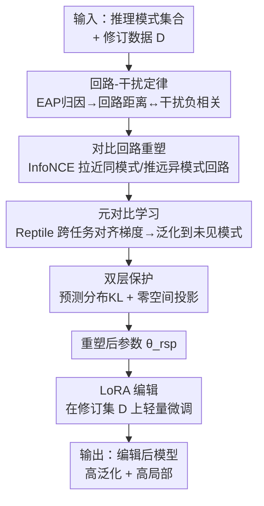

# Reforming the Mechanism: Editing Reasoning Patterns in LLMs with Circuit Reshaping

**会议**: ICLR 2026  
**OpenReview**: [https://openreview.net/forum?id=Af16P0ODP6](https://openreview.net/forum?id=Af16P0ODP6)  
**代码**: https://github.com/LzyFischer/REdit  
**领域**: 可解释性 / 模型编辑 / LLM推理  
**关键词**: 推理编辑, 神经回路, 对比学习, 模型编辑, 命题逻辑

## 一句话总结
本文提出"推理编辑"这一新范式——只修改 LLM 某一类推理模式而不动其他推理能力，发现了"回路-干扰定律"（两种推理模式的神经回路重叠越多、编辑相互干扰越强），并据此提出 REdit：在编辑前先用对比学习主动"重塑回路"把重叠的回路解耦，从而同时改善泛化性（Generality）与局部性（Locality），在 Qwen2.5-3B 的命题逻辑任务上全面超过 LoRA/ROME/AlphaEdit 等编辑基线。

## 研究背景与动机
**领域现状**：要增强 LLM 的推理能力，主流做法是把推理当成"一个笼统的、整体的技能"来训练——在大规模推理语料上微调、用 RLHF 对齐、或者靠精巧的 test-time prompting。这些方法都是"广撒网式"的整体增强。

**现有痛点**：把推理当作单一能力有两个硬伤。第一，整体增强又贵又难，要海量人工标注和算力。第二，越来越多证据表明 LLM 的推理并不是铁板一块，而是可以拆成一个个**可分离的推理模式**（如三段论、传递律、modus tollens）。不加区分地在所有模式上一起训练，既无法区分模型已经掌握得好的模式和它真正欠缺的模式，又会造成资源浪费、对具体推理错误的纠正也不到位。

**核心矛盾**：作者把"只改一类推理模式"形式化为**推理编辑**任务后，立刻撞上一个根本的 trade-off——**泛化性 vs 局部性**。泛化性要求：对某条规则（如传递律 $A\to B, B\to C \Rightarrow A\to C$）的编辑要能跨领域推广到该模式的所有实例（数学里成立、医学里也得成立）；局部性要求：编辑要"窄"，纠正目标规则时不能误伤模型本来就答对的其他推理模式。预实验（Figure 1b）显示，单纯调大学习率会提升泛化性、却把局部性拉低，二者按下葫芦浮起瓢。

**切入角度**：作者把问题归因到机制层面——既然机制可解释性研究表明不同推理模式由不同**神经回路**实现、且不同任务会复用共享的模块化回路，那么"回路重叠程度"很可能就是决定编辑能否泛化、能否保持局部的关键变量。

**核心 idea**：先用归因实验验证一条"回路-干扰定律"（回路距离越小、跨模式干扰越大），再反其道而行之——**不被动分析回路，而是在编辑前主动重塑回路**，把同模式的回路拉近、不同模式的回路推远，从源头上化解泛化-局部 trade-off，之后只需一个轻量 LoRA 编辑即可。

## 方法详解

### 整体框架
REdit 的核心洞察是：与其在"已经纠缠在一起"的回路上做编辑、被迫在泛化和局部之间二选一，不如**先把回路结构梳理好再编辑**。整条 pipeline 分两步走：先用一个带双层保护的对比元学习目标把模型参数 $\theta$ 重塑成 $\theta_{rsp}$（让同一推理模式的回路更紧凑、不同模式的回路更分离），再在重塑后的模型上做标准的 LoRA 编辑得到 $\theta_{edit}$。而支撑整个设计的前提，是作者先通过四步归因实验确立的**回路-干扰定律**。

### 关键设计

**1. 回路-干扰定律：把"编辑为什么会相互干扰"量化成回路距离**

这是全文的理论基石，针对的痛点是"泛化-局部 trade-off 到底从哪来"。作者设计四步实验来验证"回路相似度预测跨模式编辑效应"这一假设：(i) 用 **Edge Attribution Patching (EAP)** 给每个推理模式 $\pi$ 抽取归因回路——对每条计算图边 $e$，用其激活在 clean 输入与 corrupted 输入间的差，配合梯度做一阶近似 $\mathrm{EAP}_k(e)=\langle \nabla_{v_e} s_\theta(d^{clean}_k),\, v_e(d^{patch}_k)-v_e(d^{clean}_k)\rangle$，跨 $K$ 个实例平均得到边权 $w_\pi(e)$，再取 top-$\tau$ 边构成回路 $C^{(\tau)}_\pi$；(ii) 用三种距离（加权编辑距离、Jaccard、最优传输 OT）度量两个回路的结构差异；(iii) 对源模式 $i$ 做单点编辑后，测它对目标模式 $j$ 的准确率扰动 $\Delta_{i\to j}=|\mathrm{Acc}_j(\theta_{edit(i)})-\mathrm{Acc}_j(\theta)|$；(iv) 拟合 $\Delta_{i\to j}\approx\alpha+\beta\, d(i,j)+\epsilon$。结果在所有距离度量、编辑预算、随机种子下都稳定得到 $\beta<0$、Pearson 相关为负——**回路距离越小，干扰越大**。这条定律直接告诉我们：要同时拿到泛化和局部，就得让同模式回路靠得近、异模式回路离得远。

**2. 对比回路重塑：用可微的归因向量代替离散回路做 InfoNCE**

这一步直面泛化-局部 trade-off 本身。难点在于回路结构是离散的、也没有闭式表达，没法直接对"回路"求梯度。作者的做法是把 3.1 节的**归因权重当成回路的可微替身**：在每个 minibatch 里对每个模式采多个实例算出 $w_\pi$ 并归一化 $\tilde w_\pi=w_\pi/\|w_\pi\|_2$，然后以归因向量为对象做对比学习——锚点 $i$ 的正样本 $i^+$ 取自同一模式的另一组实例，负样本 $N(i)$ 取自其他模式：

$$\mathcal{L}_{ctr}(\theta) = -\sum_i \log \frac{\exp(\langle \tilde w_i, \tilde w_{i^+}\rangle/\tau_t)}{\exp(\langle \tilde w_i, \tilde w_{i^+}\rangle/\tau_t) + \sum_{j\in N(i)} \exp(\langle \tilde w_i, \tilde w_j\rangle/\tau_t)}$$

优化这个目标会**提升模式内归因相似度、压低模式间归因相似度**，等价于隐式地把回路按模式聚拢、按模式分开。这正是把"回路-干扰定律"指出的理想结构落地的手段。

**3. 元对比学习：让重塑能迁移到训练时没见过的推理模式**

只在观测到的推理模式上做对比，容易过拟合到"这几对模式之间的特定对比关系"，对稀有或未见模式迁移差。作者借 Reptile 式一阶元学习来缓解：把每个对比元组 batch $B$ 当一个任务，先做 $s$ 步内循环适配得到任务参数 $\phi_i=\theta^s_i$，再让外循环把权重朝这些任务参数的均值移动：

$$\text{内: } \theta^{t+1}_i = \theta^t_i - \alpha \nabla_\theta \mathcal{L}^{(i)}_{ctr}(\theta^t_i), \qquad \text{外: } \theta \leftarrow \theta + \eta\cdot\frac{1}{|B|}\sum_{i\in B}(\phi_i-\theta)$$

通过跨任务对齐梯度，这个过程会**放大共享方向上的更新、抑制实例特异方向**，从而避开对"特定模式对"之间虚假对比关系的过拟合，让重塑出来的回路结构能泛化到训练之外的模式。

**4. 双层保护：在预测层和优化层双管齐下防止"重塑误伤原能力"**

重塑回路有可能把模型本来答对的推理也带歪，作者从两个层面加约束。**(a) 预测分布保持**：取一个冻结的参考模型 $f_{\theta_{ref}}$（重塑前的快照）和模型已答对的集合 $C$，用 KL 惩罚重塑后在 $C$ 上的预测漂移 $\mathcal{L}_{pred}(\theta)=\mathbb{E}_{(P,G)\in C}\,\mathrm{KL}(f_{\theta_{ref}}(\cdot|P,G)\,\|\,f_\theta(\cdot|P,G))$。**(b) 零空间保护**：在每个内循环步对锚点组算预测损失梯度 $g_{i,t}$，构造秩-1 投影 $\Pi_g(u)=\frac{\langle u,g\rangle}{\langle g,g\rangle+\varepsilon}g$ 和软零空间算子 $P^{(i,t)}=I-\rho\,\Pi_{g_{i,t}}$，把对比梯度投影到（近似）锚点损失的零空间里再更新：$\tilde\nabla_\theta\mathcal{L}^{(i)}_{ctr}=P^{(i,t)}\nabla_\theta\mathcal{L}^{(i)}_{ctr}$。当 $\rho=1$ 时更新被严格限制在 $g_{i,t}$ 的零空间，一阶意义下不改变锚点损失。前者保证输出一致性，后者约束内部参数更新方向，二者合力防止灾难性漂移。

### 损失函数 / 训练策略
重塑阶段的目标由对比损失 $\mathcal{L}_{ctr}$ + 预测保持 $\mathcal{L}_{pred}$ 组成，并在元学习内循环里施加零空间投影约束。重塑得到 $\theta_{rsp}$ 后，编辑阶段只在修订集 $D$ 上做标准 LoRA 微调，最小化交叉熵 $\theta_{edit}=\min_{\theta_{rsp}}\frac{1}{|D|}\sum_{(P,G,y^*)\in D}\mathrm{CE}(f_{\theta_{rsp}}(\cdot|P,G), y^*)$。关键在于：正因为前面已经把回路结构理顺，这个"轻量级"的 LoRA 编辑就足以同时拿到好的泛化性和局部性。

## 实验关键数据

### 主实验
backbone 为 Qwen2.5-3B-Instruct，数据集为命题逻辑基准 ContextHub，分三个难度等级，用 Generality / Locality 两个指标评估（Locality 对未编辑的 Raw 模型无定义）。

| 难度 | 指标 | Raw | LoRA | ROME | AlphaEdit | REdit (Ours) |
|------|------|-----|------|------|-----------|------|
| Level 1 | Generality | 60.7 | 63.8 | 67.8 | 67.9 | **74.1** |
| Level 1 | Locality | N/A | 84.9 | 89.8 | 87.0 | **94.3** |
| Level 2 | Generality | 53.2 | 58.4 | 61.3 | 58.8 | **64.8** |
| Level 2 | Locality | N/A | 91.5 | 93.1 | 93.3 | **94.3** |
| Level 3 | Generality | 45.1 | 50.1 | 51.5 | 54.2 | **55.0** |
| Level 3 | Locality | N/A | 92.3 | 94.6 | 92.2 | **94.4** |

REdit 在所有难度、两个指标上都拿到最好或并列最好：相比不做重塑的 LoRA，泛化性最高提升 16.1%、局部性最高提升 12.2%，相比 SOTA 平均再涨约 2.0%。

### 消融实验

| 配置 | Level 1 Gen / Loc | Level 3 Gen / Loc | 说明 |
|------|------|------|------|
| Full (Ours) | 74.1 / 94.3 | 55.0 / 94.4 | 完整模型 |
| w/o MCL | 72.9 / 90.7 | 53.8 / 93.7 | 去元对比学习，泛化与局部都掉 |
| w/o NSP | 73.3 / 89.5 | 50.9 / 92.8 | 去零空间保护，局部性受损最明显 |
| w/o PDP | 73.4 / 90.1 | 51.8 / 92.8 | 去预测分布保持，局部性下滑 |

### 关键发现
- 三个组件去掉任意一个都会掉点：MCL 主要撑泛化性与跨模式迁移，NSP/PDP 主要撑局部性（去掉后 Locality 从 94 降到 89~90 区间），印证"双层保护"确实在守护原有能力。
- REdit 的优势随任务变简单而变大——简单任务的回路结构更"可塑"，更适合做有针对性的重塑。
- BIMT 泛化性不错但局部性很差（它会破坏内部机制）；ROME 把编辑集中在中层 MLP，编辑成功率显著偏低，说明推理能力是分布在多个架构组件上的、不能只动中层 MLP。

## 亮点与洞察
- **"先重塑回路、再编辑"是个很漂亮的思路反转**：以往机制可解释性多是"被动分析"回路，本文把它变成"主动塑形"的优化目标——回路从观测对象变成可操控的变量，这个视角可迁移到知识编辑、去偏、安全对齐等任何"想精准改一处不动其他"的场景。
- **用 EAP 归因向量当回路的可微替身**很巧：回路本身离散、不可导，但归因权重连续可导，对它做 InfoNCE 就相当于隐式地在塑造离散回路结构，绕开了"直接优化离散结构"的难题。
- **把模型编辑从"知识纠正"推广到"推理模式纠正"**，并第一次形式化泛化-局部 trade-off，是概念层面的新贡献——它把命题逻辑这种可精确定义的设定当试验田，让"编辑某条推理规则"变得可度量、可评测。

## 局限与展望
- 验证主要落在命题逻辑（ContextHub）这一受控、结构简单的设定上，数学域只是"额外验证显示更广潜力"，对开放式自然语言推理、多步链式推理的有效性还需更多证据。
- 只在 Qwen2.5-3B 单一 backbone、单一规模上做了主实验，回路-干扰定律和重塑收益在更大模型、不同架构上是否稳定成立尚未充分检验。
- EAP 归因 + 三种距离 + 元学习内外循环 + 双层保护，整套流程组件多、超参（如 $\tau_t$、$\rho$、$\tau$ 阈值、内循环步数）也多，工程复现成本和调参敏感性值得关注。
- 改进方向：把"回路-干扰定律"扩展到连续/层级化的推理模式划分，或探索免归因的轻量回路重塑，以降低对 EAP 计算的依赖。

## 相关工作与启发
- **vs LoRA（朴素编辑）**：LoRA 直接在原始（纠缠的）回路上做低秩微调，被迫在泛化和局部之间妥协；REdit 先把回路解耦再做同样的 LoRA，因此能两头都拿好，证明瓶颈不在编辑器本身而在回路结构。
- **vs ROME**：ROME 把编辑定位到中层 MLP，但推理能力分布在多个组件上，导致它泛化性差、编辑成功率也低；REdit 不预设"推理住在哪一层"，而是按回路重叠度全局重塑。
- **vs AlphaEdit**：AlphaEdit 也用零空间保护来减少附带损伤，局部性不错但泛化性受限（约束了编辑方向）；REdit 把零空间保护只用在"重塑阶段"保护原能力，而把泛化交给对比+元学习，二者分工因此能突破 AlphaEdit 的天花板。
- **vs BIMT**：BIMT 在预训练阶段鼓励 MLP 模块化，本文将其适配到 LLM 后发现它虽提升泛化但严重损伤局部性，反衬出 REdit"重塑+双层保护"组合的必要性。

## 评分
- 新颖性: ⭐⭐⭐⭐⭐ 首次提出推理编辑范式 + 回路-干扰定律 + 主动重塑回路，概念和方法都新。
- 实验充分度: ⭐⭐⭐⭐ 三难度 + 多基线 + 消融 + 回路分析较完整，但 backbone/域单一。
- 写作质量: ⭐⭐⭐⭐⭐ 从定律到方法逻辑链清晰，形式化定义严谨。
- 价值: ⭐⭐⭐⭐ "精准改一处推理而不伤其他"对可靠性/安全很有意义，可迁移性强。

<!-- RELATED:START -->

## 相关论文

- [\[ICLR 2026\] LLMs are Single-threaded Reasoners: Demystifying the Working Mechanism of Soft Thinking](llms_are_single-threaded_reasoners_demystifying_the_working_mechanism_of_soft_th.md)
- [\[ICLR 2026\] RADAR: Reasoning-Ability and Difficulty-Aware Routing for Reasoning LLMs](radar_reasoning-ability_and_difficulty-aware_routing_for_reasoning_llms.md)
- [\[ICLR 2026\] Can LLMs Reason Soundly in Law? Auditing Inference Patterns for Legal Judgment](can_llms_reason_soundly_in_law_auditing_inference_patterns_for_legal_judgment.md)
- [\[ICLR 2026\] Precise and Interpretable Editing of Code Knowledge in Large Language Models](precise_and_interpretable_editing_of_code_knowledge_in_large_language_models.md)
- [\[ICLR 2026\] CoT Vectors: Transferring and Probing the Reasoning Mechanisms of LLMs](cot_vectors_transferring_and_probing_the_reasoning_mechanisms_of_llms.md)

<!-- RELATED:END -->
