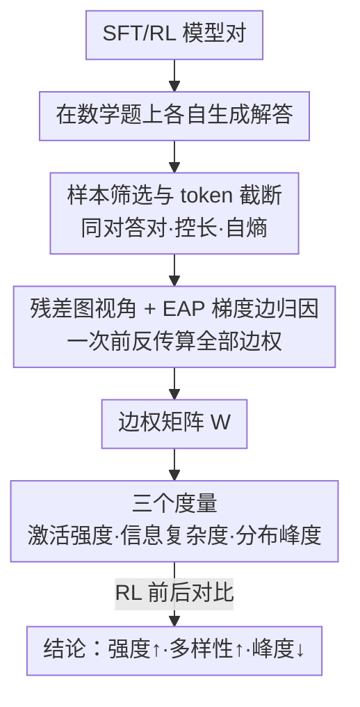

# Reinforcement Learning Fine-Tuning Enhances Activation Intensity and Diversity in the Internal Circuitry of LLMs

**会议**: ICLR2026  
**OpenReview**: [https://openreview.net/forum?id=tzS9roOTdj](https://openreview.net/forum?id=tzS9roOTdj)  
**代码**: https://github.com/tsinghua-fib-lab/llm_rl_probing_analysis  
**领域**: 可解释性 / 机制分析 / 强化学习后训练  
**关键词**: 边归因（EAP）、内部电路、激活强度、激活多样性、在线 RL vs DPO

## 一句话总结
作者把 LLM 的残差计算抽象成有向图，用边归因（Edge Attribution Patching, EAP）在单次前反传里给所有内部边打重要性分，对比 RL 微调前后的边权分布，发现在线 RL（PPO/GRPO）会系统性地**抬高内部激活强度、增加激活多样性**（熵升、峰度降），而 DPO 则几乎没有这种变化——从而第一次把"RL 后训练为什么更强"和"模型内部信息通路怎么变"这两条平行的研究线接到了一起。

## 研究背景与动机
**领域现状**：LLM 的研发重心已经从预训练转向后训练，RL 微调（PPO、GRPO、各种 reward model）被反复验证能在数学推理、写作、代码上把能力推到 SFT 之上。与此同时，机制可解释性一侧也发展出 ACDC、EAP 这类把 LLM 残差通路看成"电路"、给边/子模块打重要性分的工具。

**现有痛点**：这两条线几乎是平行跑的。研究 RL 效果的人只看**外部行为**（准确率涨了多少），研究内部机制的人只盯**给定的某个 LLM**，却不把"这个模型是用什么后训练方法得到的"纳入分析。结果是：大家都知道 RL 后训练更强，但**没人说得清它到底把模型内部改成了什么样**。

**核心矛盾**：把可解释性工具直接搬到 RL 研究上并不容易——EAP/ACDC 这类方法原本是为了"发现电路"、常在 toy 任务上做，而 RL 后训练针对的是真实、长链条的数学推理任务，分析策略不能直接迁移。再加上 ACDC 式的逐边消融需要对每条边各跑一遍前向，规模一大就算不动。

**本文目标**：构建一个能在 7B 级真实 LLM 上跑得动的分析框架，系统刻画 RL 微调"改变了内部电路的哪些统计性质"，并解释**为什么**在线 RL 和 SFT/DPO 会不同。

**切入角度**：借鉴 EAP 的梯度化思想——既然逐边消融太贵，那就用一阶泰勒近似，把"删掉某条边后 loss 的变化"近似成"梯度和激活的内积"，这样**一次前反传就能同时算出所有边的重要性**，从而把电路分析做到 7B 规模、做到真实数学题上。

**核心 idea**：用 EAP 把 RL 前后两个模型的内部边权矩阵都算出来，再用三个互补的统计量（强度/多样性/分布形状）去量化差异，最后用一个统一的后训练梯度框架解释这些差异的来源是"采样分布"。

## 方法详解

### 整体框架
方法本质是一条**测量管线**：拿到同一基座的"SFT 版 vs RL 版"模型对，让它们在数学题上各自生成解答，经过严格的样本筛选与 token 截断保证可比，再用 EAP 在残差图上给每条边打重要性分得到边权矩阵，最后用三个统计度量去刻画 RL 前后边权分布的变化。整套流程不训练任何东西，纯属对已有模型做"内窥镜"式的对比分析。

得到结论之后，作者再额外套一层"统一梯度框架"去解释这些数值变化为什么会发生（见关键设计 4），这一层是对结果的机制性诠释，不属于测量管线本身。

### 关键设计

**1. 把 Transformer 残差流抽象成 DAG，再用 EAP 做梯度化边归因**

要"测内部电路"，先得定义什么是边。作者利用残差连接的性质：任意子模块（注意力块 $A_\ell$ 或 FFN 块 $F_\ell$）的输入，等于它之前所有子模块输出加上原始嵌入之和，即 $H^{(2\ell)} = H^{(0)} + \sum_{i\le\ell} O^i_{\text{attn}} + \sum_{j\le\ell} O^j_{\text{ffn}}$。于是每个子模块是一个节点，残差信息流是有向边，整个 LLM 就是一张有向无环图 $G=(V,E)$。

怎么给边打分？最朴素的 ACDC 是把边删掉看 loss 涨多少：$I_{\text{ACDC}}(O,H) = \mathcal{L}(y; f_{\backslash(O,H)}(x)) - \mathcal{L}(y; f(x))$，但每条边都要额外跑一次前向，大模型上彻底算不动。EAP 的关键是做一阶泰勒近似：把消融看成 $H \mapsto H - O$，于是

$$I_{\text{EAP}}(O,H) \approx -\big\langle \nabla_H \mathcal{L}(y; f(x)),\, O \big\rangle$$

其中前向激活 $O$ 和反向梯度 $\nabla_H\mathcal{L}$ 在**一次前向 + 一次反向**里就都有了，因此所有边的重要性可以一把算完，不必逐边消融。这正是把电路分析做到 7B 规模、做到真实数学推理任务上的可行性来源。

**2. 公平对比的样本筛选与 token 截断**

直接拿两个模型的生成去比边权是不公平的：答错的题、过长或过短的回答都会污染统计。作者先只保留**两个模型都答对**的题集 $Q$；再算该模型对在该数据集上的平均长度 $\bar T$，设上下界 $T_{\min}=\beta\bar T,\ T_{\max}=\gamma\bar T$ 过滤掉极端长度；还要求两模型答案长度足够接近：$\frac{|T^q_{\text{base}}-T^q_{\text{RL}}|}{(T^q_{\text{base}}+T^q_{\text{RL}})/2} < \delta$。最后统一只取前 $T_{\text{cut}}=\alpha\bar T$ 个 token，并在这段截断序列上计算模型对自身输出的自熵（cross-entropy）$\mathcal{L}_{\text{trunc}} = -\frac{1}{T_{\text{cut}}}\sum_{t=1}^{T_{\text{cut}}} \log \frac{\exp(L_t[s_t])}{\sum_v \exp(L_t[v])}$ 作为归因所用的 loss。这套筛选把"长度/正确性差异"从对比里剥离，让边权差异真正反映 RL 带来的内部变化；缩放系数 $\alpha$ 也成了后面验证结论鲁棒性的旋钮。

**3. 用三个互补度量刻画"强度 / 多样性 / 分布形状"**

拿到每个样本的边权矩阵 $W^{(k)}\in\mathbb{R}^{n_o\times n_i}$ 后，作者定义三个度量，分别回答三个不同问题：

- **激活强度（Act.Intens.）**：所有边权绝对值的平均幅度，$\text{Act.Intens.}=\frac{1}{n\,n_o n_i}\sum_k\sum_o\sum_i |W^{(k)}_{oi}|$，衡量"有多少通路被点亮、信号有多强"。
- **信息复杂度（Info.Complex.）**：把所有 $|W^{(k)}_{oi}|$ 拍平做直方图，算香农熵 $\text{Info.Complex.}=-\sum_b p_b\log(p_b+\epsilon)$，衡量激活模式的**多样性/不可预测性**——熵高说明通路分布更杂、更不集中。
- **分布峰度（Dist.Kurt.）**：先算每个样本边权分布的峰度再平均（公式见原文 Eq.15，越接近 0 越接近正态）。峰度高 = 重尾、激活集中在少数离群边；峰度降 = 激活更分散均匀。

三者互补：强度看"量级"，复杂度看"是否分散到多条路"，峰度看"分布尾巴形状"，合起来才能区分"信号变强"和"信号变杂"这两件事。

**4. 用统一后训练梯度框架解释 online RL / SFT / DPO 的差异**

光观察到"RL 让强度和多样性上升"还不够，作者要解释**为什么**。他们套用统一的后训练梯度形式 $\nabla_\theta J_A(\theta)=\mathbb{E}_{(q,o)\sim D}\big[\frac{1}{|o|}\sum_t GC_A(\cdot)\,\nabla_\theta\log\pi_\theta(o_t|q,o_{<t})\big]$，把差异归结到两处：采样分布 $D$ 的支撑集，和梯度系数 $GC_A$。

- **SFT**：数据来自固定人工标注分布、梯度系数恒为 1，模型被压向一个低熵模式去模仿"正确解"，于是激活集中在少数离群边（高峰度）、冗余通路少被调用（低强度）。
- **在线 RL（PPO/GRPO）**：用 on-policy 采样 $D_{\text{RL}}=\{(q,\{o_i\})\mid o_i\sim\pi_\theta(\cdot|q)\}$，把训练分布的随机支撑集**扩到 SFT 子空间之外**，逼着网络去激活那些 SFT 阶段"休眠"的潜在电路；而且梯度系数随 reward 动态变化（如 GRPO 的 $GC_{\text{GRPO}}=\hat A_{i,t}+\beta(\frac{\pi_{\text{ref}}}{\pi_\theta}-1)$），更难的题给更大梯度，进一步动员低活跃电路——这就解释了强度上升、峰度下降、熵增。
- **DPO**：虽然数学上由 RL 目标推出，但它是离线的，数据贴近静态分布、每个 query 只保留两个可能过时的对比样本，缺了 on-policy 探索那股"逼模型扩容"的压力，所以强度/复杂度**不稳定上升**；但它的软间隔目标 $GC_{\text{DPO}}=\sigma(\beta\log\frac{\pi_\theta(o^-|q)}{\pi_{\text{ref}}(o^-|q)}-\beta\log\frac{\pi_\theta(o^+|q)}{\pi_{\text{ref}}(o^+|q)})$ 放松了 SFT 的硬 token 匹配，反而抑制了高强度离群边的出现，于是**峰度照样会降**（可理解为缓解死记硬背）。

一句话：作者把"采样过程"指认为驱动 SFT / DPO / 在线 RL 内部差异的核心变量，并在附录 B 用调训练温度的实验佐证了这个假设。

## 实验关键数据

### 主实验
四对约 7B 模型 × 三个数学数据集（GSM8K / MATH / College Math）× 四个截断系数 $\alpha\in\{0.03,0.1,0.3,0.5\}$。四对模型覆盖了不同后训练范式：Deepseek-Math（GRPO）、Mistral（Math-Shepherd PPO）、Distilled-Qwen（蒸馏，GRPO 系）、Qwen2.5（DPO）。

| 模型对 / 数据集 | 后训练 | Act.Intens.↑ | Info.Complex.↑ | Dist.Kurt.↓ |
|--------|------|------|------|------|
| Deepseek-Math / MATH (α=0.1) | SFT→GRPO | 1.10e-3 → 1.31e-3 | 1.72e-1 → 2.47e-1 | 357 → 223 |
| Mistral / MATH (α=0.3) | SFT→PPO | 4.49e-4 → 4.92e-4 | 4.13e-2 → 2.86e-1 | 335 → 265 |
| Distilled-Qwen / GSM8K (α=0.1) | SFT→GRPO | 6.71e-4 → 7.72e-4 | 1.60e-1 → 2.64e-1 | 766 → 560 |
| Qwen2.5 / College Math (α=0.3) | SFT→**DPO** | 4.76e-4 → 4.69e-4 | 1.23e-1 → **9.95e-2** | 751 → 651 |

前三个家族（在线 RL/蒸馏）一致呈现"强度升、复杂度升、峰度降"；而 DPO 的 Qwen2.5 强度无明显上升、College Math 上复杂度甚至**低于** SFT 起点——只有峰度照常下降，与机制解释完全吻合。

### 多样性与鲁棒性分析

| 分析 | 关键数字 | 说明 |
|------|---------|------|
| 样本间多样性（Fig.3a，$1-$ 边权矩阵平均相关）| 41 组实验，平均提升 **7.6%**，**95.1%** 的实验都在提升 | RL 后内部激活结构跨样本变异更大 |
| 输出边熵（Fig.3b）| 多个 model-dataset-α 组合上升，最高 **+1246% / +656%** | 输出侧边模式更分散 |
| 截断系数 $\alpha$ 增大 | 个别反例（Deepseek/Mistral）随 α↑ 消失 | 结论随 α 增大趋于一致，说明现象鲁棒 |
| 训练温度操控（附录 B）| 现象与预期一致 | 直接验证"采样过程是核心变量"的假设 |

### 关键发现
- **三个家族高度一致**：Act.Intens 与 Info.Complex 升、Dist.Kurt 降，是跨模型/数据集/超参的稳健现象，少数反例随截断长度增大而消失。
- **DPO 是显著例外**：它复现不出在线 RL 的"强度+多样性"上升，但峰度仍降——精准对应"离线、无 on-policy 探索 → 缺扩容压力；但软间隔仍抑制高强度离群边"的机制预测。
- **多样性提升几乎普适**：95.1% 的实验里 RL 模型样本间多样性更高，平均 +7.6%，给"RL 让信息流更冗余更灵活"提供了直接证据。

## 亮点与洞察
- **把 EAP 从"发现电路"改造成"对比两个模型"**：原 EAP 用来找 toy 任务里的功能电路，本文转而用它的梯度归因去量化 RL 前后的统计差异，一次前反传算全部边权，使 7B 真实推理任务上的电路分析变得可行——这是个很巧的工具复用。
- **三度量分工清晰**：强度（量级）+ 复杂度（熵/分散度）+ 峰度（尾形）三者正交，能把"信号变强"和"信号变杂"区分开，避免单一指标的误读。
- **机制解释落到"采样分布"上**：用统一梯度框架把 SFT / 在线 RL / DPO 的内部差异归因到采样支撑集与梯度系数，再用温度实验佐证，把"现象观察"升级成"可证伪的假设"，这是全文最让人信服的一跳。
- **可迁移的分析范式**：这套"成对模型 + EAP + 分布度量"的流程，原则上可以搬去分析任何后训练干预（不同 RL 算法、不同 reward、甚至对齐方法）对内部电路的影响。

## 局限与展望
- **只在数学推理上验证**：作者自己承认结论目前局限于数学题，代码生成、创意写作、开放对话等开放式输出是否同样成立尚待验证。
- **模型规模卡在 7B**：细粒度内部状态分析显存开销大，没能扩到 7B 以上，结论在更大模型上的可外推性未知。
- **EAP 是一阶近似**：梯度化边归因本质是泰勒一阶项，在强非线性/大扰动下与真实消融的偏差有多大，文中未量化，"激活强度差异"在边界情形下可能被近似误差放大。⚠️ 度量是相对趋势分析而非绝对因果，下结论时要按"前后对比"读，不宜跨家族直接比数值大小。
- **DPO 样本"过时"的程度未量化**：把 DPO 偏弱归因于"离线、样本可能 stale"是合理叙事，但缺一个直接控制变量（如刷新频率）的对照实验来钉死因果。

## 相关工作与启发
- **vs ACDC（Conmy et al., 2023）**：ACDC 靠逐边消融测 loss 变化，精确但每条边一次前向，大模型上不可行；本文改用 EAP 一阶近似，一次前反传算全部边，牺牲一点精度换来 7B 规模可跑。
- **vs 表示探针类工作（Kim et al., 2025；Zheng et al., 2025）**：那一脉训练外部 linear/graph probe 去解码中间层"编码了什么知识"；本文走机制可解释路线，直接分析"信息怎么在残差图里流动"，且把后训练方法本身纳入对比。
- **vs 外部行为评估的 RL 研究（如 Chu et al., 2025 "SFT memorizes, RL generalizes"）**：前人从准确率/泛化角度论证 RL 更强，本文补上"内部为什么强"的一层——RL 通过 on-policy 采样动员休眠电路、增加冗余与灵活性，把外部增益和内部通路变化对接起来。
- **启发**：如果"在线采样扩容内部电路"是 RL 优于 SFT/DPO 的内因，那么后训练算法设计或许可以显式地把"鼓励冗余通路激活/提高激活多样性"当成正则目标，而不只是优化外部 reward。

## 评分
- 新颖性: ⭐⭐⭐⭐ 首次把 EAP 改造成"成对模型对比"，并把后训练方法纳入机制分析，视角新。
- 实验充分度: ⭐⭐⭐⭐ 4 模型对 × 3 数据集 × 4 超参 + 温度对照，覆盖到位；但卡在 7B、仅数学域。
- 写作质量: ⭐⭐⭐⭐ 现象—度量—机制三段递进清晰，公式与图表配合好。
- 价值: ⭐⭐⭐⭐ 给"RL 后训练为什么更强"提供了可检验的内部机制解释，对后训练算法设计有启发。

<!-- RELATED:START -->

## 相关论文

- [\[ICLR 2026\] Comparing the learning dynamics of in-context learning and fine-tuning in language models](comparing_the_learning_dynamics_of_in-context_learning_and_fine-tuning_in_langua.md)
- [\[ICLR 2026\] Learning Nonlinear Causal Reductions to Explain Reinforcement Learning Policies](learning_nonlinear_causal_reductions_to_explain_reinforcement_learning_policies.md)
- [\[ICLR 2026\] TokenSeek: Memory Efficient Fine Tuning via Instance-Aware Token Ditching](tokenseek_memory_efficient_fine_tuning_via_instance-aware_token_ditching.md)
- [\[ICLR 2026\] GEPA: Reflective Prompt Evolution Can Outperform Reinforcement Learning](gepa_reflective_prompt_evolution_can_outperform_reinforcement_learning.md)
- [\[ICLR 2026\] Watch the Weights: Unsupervised Monitoring and Control of Fine-tuned LLMs](watch_the_weights_unsupervised_monitoring_and_control_of_fine-tuned_llms.md)

<!-- RELATED:END -->
