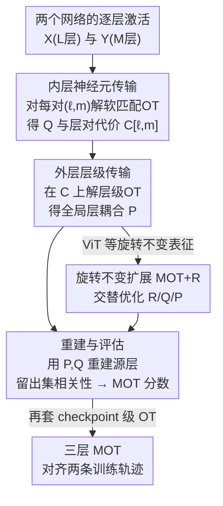

# Representational Alignment Across Model Layers and Brain Regions with Multi-Level Optimal Transport

**会议**: ICLR 2026  
**OpenReview**: [https://openreview.net/forum?id=xz3hPommuG](https://openreview.net/forum?id=xz3hPommuG)  
**代码**: 待确认  
**领域**: 可解释性 / 表征相似性 / 最优传输  
**关键词**: 表征对齐, 最优传输, 层级对应, 脑-模型比较, 旋转不变性

## 一句话总结
本文提出 Multi-Level Optimal Transport (MOT)，用「内层神经元传输 + 外层层级传输」的双层最优传输框架，把两个网络（或脑区）之间的表征对齐从「逐层贪心匹配」升级为「全局一致的软耦合」，既给出单一的网络级对齐分数，又能自然处理深度不一致，并自发地恢复出早层对早层、深层对深层的层级结构。

## 研究背景与动机
**领域现状**：在神经科学和 AI 里，比较两套高维神经表征是共同的核心问题——比较不同个体的脑响应能揭示哪些计算是共享的，比较不同模型的内部表征能揭示架构/目标如何塑造特征、是否存在「普适表征」。主流做法是**逐层匹配（layer-wise matching）**：给定某种相似度 $S(\cdot,\cdot)$（RSA、CKA、Procrustes、线性可预测性或 Soft Matching），让源网络的每一层 $\ell$ 去贪心地选目标网络里得分最高的那一层 $m^*(\ell)=\arg\max_m S(X_\ell, Y_m)$，然后报告这个逐层得分。

**现有痛点**：这种「各层独立、一对一硬匹配」有几个结构性缺陷。其一，当两个网络层数不同（$L\neq M$）、或源网络某一层的特征实际上分散在目标网络多层里时，强行一对一会匹配错。其二，匹配是**非对称**的——从 A 到 B 和从 B 到 A 选出的对应关系不一致。其三，它只能给逐层分数，**没有单一的全局对齐分**。其四，每层独立优化时会忽略全局激活结构，容易过拟合到单层响应里的噪声。

**核心矛盾**：根本原因在于贪心逐层匹配**忽略了全局激活结构**，并把映射强行限制成刚性的一对一层对应。基于最优传输（OT）的 Soft Matching 虽然在神经元层面能放松硬置换、处理不等宽的层，但它仍然停留在**成对的两层比较**，没有捕捉跨网络的全局层级结构。

**本文目标**：设计一个对齐框架，同时满足——全局一致（对称、不会让某些层被过度加权而另一些被完全忽略）、能处理深度不一致、能给出单一网络级分数、并且对旋转等价的表征也能识别。

**切入角度**：作者注意到，OT 天然就是「在边缘约束下分配质量」的工具，而「一层把表征分散到多层」恰好就是一种质量分配。于是把对齐分成两个层级的 OT 嵌套：内层在神经元上做软匹配，外层在层与层之间做软耦合。

**核心 idea**：用「层级化的双层最优传输」代替「逐层贪心一对一匹配」，让源层在边缘约束下把表征质量软分配到多个目标层，从而得到全局一致、对称、可处理深度差异的对齐。

## 方法详解

### 整体框架
设两个网络分别有 $L$ 层和 $M$ 层，用 $T$ 个刺激（图像/文本）探测，第 $\ell$ 层激活为 $X_\ell\in\mathbb{R}^{T\times n_\ell}$，第 $m$ 层为 $Y_m\in\mathbb{R}^{T\times n_m}$（行是刺激、列是单元）。MOT 在两个层级上同时求解 OT：**内层**对每一对候选层 $(\ell,m)$ 在神经元粒度上算一个软传输计划 $Q_{\ell m}$ 及对应的对齐代价 $C_{\ell m}$；这些代价拼成层对层的代价矩阵 $C\in\mathbb{R}^{L\times M}$，**外层**再在这个矩阵上解一个层级 OT 得到层耦合 $P$。拿到 $(P, \{Q_{\ell m}\})$ 后，用它们去**重建**源层并在留出数据上算相关性，得到单一的网络级 MOT 分数。

整条管线是「神经元传输 → 层级传输 → 重建评估」的串行结构，外层 OT 还可叠加旋转优化（MOT+R）或再套一层 checkpoint 级 OT（三层 MOT），框架清晰，因此配框架图：

### 关键设计

**1. 双层嵌套最优传输：把「神经元匹配」和「层级匹配」一起解**

针对「逐层贪心只看两层、忽略全局结构」的痛点，MOT 把对齐拆成内外两层 OT。**内层**对每对层 $(\ell,m)$ 先用基于调谐曲线的相关距离构造神经元间的不相似矩阵 $C^{\text{inner}}_{\ell m}[i,j]=c(X_\ell[:,i], Y_m[:,j])$，再解软匹配 OT

$$C_{\ell m}=\min_{Q_{\ell m}\in T(n_\ell, n'_m)}\langle C^{\text{inner}}_{\ell m}, Q_{\ell m}\rangle,$$

得到的 $Q_{\ell m}$ 说明 $\ell$ 层每个神经元有多强地对应到 $m$ 层的神经元；当两层等宽时由 Birkhoff–von Neumann 定理 $Q$ 退化为一个置换，宽度不同则自然出现软分配。**外层**把所有内层代价 $C_{\ell m}$ 拼成 $C\in\mathbb{R}^{L\times M}$，再解一个层级 OT $P=\arg\min_{P\in T(L,M)}\langle C, P\rangle$，其中 $P_{\ell m}$ 表示「$\ell$ 层表征中有多少比例由 $m$ 层解释」。这种嵌套让对齐既精细到神经元、又在层级上保持全局一致，是整个方法的骨架。

**2. 边缘约束下的质量守恒：保证对称、平衡、可处理深度差异**

针对「贪心匹配非对称、会让个别层霸占全部映射而其余层闲置」的痛点，外层 OT 的传输多面体施加了两条守恒约束：

$$\sum_\ell P_{\ell m}=\tfrac{1}{M},\qquad \sum_m P_{\ell m}=\tfrac{1}{L},\qquad P_{\ell m}\ge 0.$$

即每个源层必须把自己 100% 的质量分配出去（不丢信息），每个目标层接收到的总质量也被均衡限定（不被过度使用或忽略）。这两条「守恒律」直接带来三个好处：对齐是**对称**的、每一层都**有意义地参与**全局对应、而且当 $L\neq M$ 时软耦合允许一个源层把质量分散到多个目标层，从而**自然处理深度不一致**——这正是浅层网络一个阶段被深层网络拆成多步的那种「多对多」对应。值得注意的是，当 $L=M$ 时由于目标线性、约束多面体顶点是（缩放的）置换矩阵，线性规划的最优解落在顶点上，于是又**自动退化成一对一匹配**，兼顾了两种情形。拿到 $P$ 和 $Q$ 后，源层重建为 $\hat X_\ell=L\sum_m P_{\ell m} Y_m Q_{\ell m}^\top$，对齐质量用留出集上原始与重建神经元的平均相关 $\text{Score}_\ell=\frac{1}{n_\ell}\sum_i \rho(X_\ell[:,i], \hat X_\ell[:,i])$ 衡量，全局分数 $\text{MOT}=\frac{1}{L}\sum_\ell \text{Score}_\ell$。

**3. 旋转不变扩展 MOT+R：识别「同几何、不同坐标基」的等价表征**

针对 OT 类方法对旋转敏感、而 RSA/CKA/Procrustes 等主流度量都设计成旋转不变的痛点（很多时候我们关心的是表征空间的几何——距离、夹角、相对位置，而非单个神经元的调谐；两个网络可以用互为旋转的坐标基编码同一几何），作者给每对层引入正交旋转矩阵 $R_{\ell m}\in O(n_\ell)$，把内层代价改成最小化重建误差 $C_{\ell m}=\min_{Q_{\ell m}, R_{\ell m}}\|X_\ell R_{\ell m}-Y_m Q_{\ell m}^\top\|_F^2$，并用**交替最小化**求解：固定 $R$ 在旋转后特征上解 OT 更新 $Q$，固定 $Q$ 用 $X_\ell^\top(Y_m Q_{\ell m}^\top)$ 的 SVD 解正交 Procrustes 更新 $R$，再用 Frobenius 重建代价刷新外层 $P$；预测时也带上学到的旋转 $\hat X_\ell=L\sum_m P_{\ell m} Y_m Q_{\ell m}^\top R_{\ell m}^\top$。在残差流缺乏特权轴、表征旋转不变的 Vision Transformer 上，这一扩展把对齐质量和可解释性都大幅拉高。

**4. 三层 MOT：把对齐再抬一层，对齐两条完整的训练轨迹**

作者把双层 MOT 当作可递归的积木，再叠一层 checkpoint 级 OT。给两个模型各自的 checkpoint 序列 $c=1,\dots,C_A$ 和 $d=1,\dots,C_B$，对每对 checkpoint $(c,d)$ 把它们的激活当成两个网络跑一遍双层 MOT，得到一个标量代价 $C^{\text{chkpt}}_{cd}=\text{MOT}(X^{(c)}_\ell; Y^{(d)}_m)$，拼成 checkpoint 级代价矩阵后再解第三个 OT $R=\arg\min_{R\in T(C_A,C_B)}\langle C^{\text{chkpt}}, R\rangle$，$R_{cd}$ 即两条训练轨迹间 checkpoint 的软对应。这是一个 proof-of-concept，说明 MOT 框架原则上可推广到任意层数，按对齐设定的需要堆叠。

### 损失函数 / 训练策略
MOT 本身不训练模型参数，而是一个**推断对齐计划**的优化过程：内层、外层都是标准 OT（线性规划/Sinkhorn 类求解），MOT+R 用交替最小化在 OT 与正交 Procrustes 之间迭代。所有评估都在 20% 留出刺激上重建表征、报告与真值激活的相关性，并在脑数据上跨 5 个随机训练/验证划分重复以保证稳健。计算复杂度上，内层 OT 对 $n$ 个神经元约为 $O(n^3\log n)$，整体为 $O(L^2 n^3\log n)$。

## 实验关键数据

作者在四个设定上评估：不同家族/规模的 LLM、4 名被试的视觉皮层 fMRI、不同家族/规模的 ViT 视觉模型，以及脑-模型跨域比较；评估指标统一为「用学到的传输图在留出集上重建表征、报告与真值的相关性」。

### 主实验

LLM 对齐（重建相关性，越高越好）：

| Model 1 | Model 2 | MOT | Random (Perm-P) | Single-Best OT | Pairwise Best OT |
|---------|---------|------|------|------|------|
| Llama-3.2 1B | Llama-3.2 3B | **0.558** | 0.510 | 0.502 | 0.505 |
| Qwen-2.5 0.5B | Qwen-2.5 3B | **0.510** | 0.494 | 0.467 | 0.477 |
| Qwen-2.5 0.5B | Llama-3.2 3B | **0.531** | 0.513 | 0.498 | 0.524 |
| Llama-3.2 1B | Qwen-2.5 3B | **0.432** | 0.411 | 0.345 | 0.380 |
| Llama-3.2 3B | Qwen-2.5 3B | **0.383** | 0.374 | 0.338 | 0.346 |

在 LLM 上 MOT 在所有对比里都拿到最高重建相关，且传输图呈现清晰的对角结构（早层对早层、深层对深层），而 pairwise OT 的映射更噪。

视觉模型对齐（标准设定 vs 旋转增强 MOT+R）：

| Model 1 | Model 2 | MOT | Pairwise Best OT | MOT+R | Pairwise Best+R |
|---------|---------|------|------|------|------|
| DINOv2 Small | DINOv2 Large | 0.353 | 0.340 | **0.778** | 0.394 |
| DINOv2 Small | DINOv2 Giant | 0.466 | 0.433 | **0.790** | 0.418 |
| ViT-MAE Base | DINOv2 Giant | 0.202 | 0.180 | **0.580** | 0.293 |
| ViT-MAE Base | ViT-MAE Large | 0.588 | 0.598 | **0.850** | 0.596 |
| ViT-MAE Base | ViT-MAE Huge | 0.149 | 0.417 | **0.788** | 0.571 |

在视觉模型上，**裸 MOT 并不稳定优于 pairwise OT**（有时还更低，如 ViT-MAE Base↔Huge 的 0.149 vs 0.417），但叠加旋转增强后的 MOT+R 大幅领先所有基线，并稳定恢复出清晰的层级对应——印证了 ViT 表征旋转不变、必须显式建模旋转。

### 消融实验

作者用一组基线把 MOT 各组件的贡献剥离开（脑 fMRI 设定，重建相关性）：

| 配置 | 含义 | Subject A↔B | Subject A↔C |
|------|------|------|------|
| MOT | 完整双层 OT | 0.244 | 0.199 |
| Random (Perm-P) | 打乱外层 $P$ 的行、保留神经元 OT | 0.135 | 0.110 |
| Single-Best OT | 把软层耦合硬化成 top-1 一对一 | 0.244 | 0.199 |
| Pairwise Best OT | 标准贪心逐层匹配 | 0.245 | 0.202 |

### 关键发现
- **层级耦合 $P$ 是关键**：随机打乱 $P$（Perm-P）后重建相关从 0.24 掉到 0.11–0.14，说明外层层级对齐承担了主要信息；而只破坏「匹配哪些层」、不破坏「神经元怎么匹配」就大幅掉点，证明全局层耦合不可或缺。
- **MOT 的价值在结构而非纯分数**：在脑数据上 MOT 的重建相关与 pairwise OT 几乎持平（仅略低），但**只有 MOT 能恢复跨被试的区域对区域对应**（V1→V1、V4→V4），pairwise OT 在任何被试对上都给不出这种结构——这是「分数相近但可解释性天差地别」的典型例子。
- **深度不一致被自然处理**：比较浅模型与深模型时，MOT 揭示浅模型单层把质量分散到深模型多个相邻层，反映「深度把计算摊开」的组织原则，贪心基线完全看不到。
- **旋转在 ViT 上至关重要**：裸 MOT 在视觉模型上时好时坏，MOT+R 才稳定且大幅提升，对应「ViT 残差流无特权轴、旋转不变」的已知性质。

## 亮点与洞察
- **把「一层对多层」重新理解为「质量分配」**：这是全文最漂亮的视角转换——深度不一致不再是需要特判的麻烦，而是 OT 边缘约束下的自然产物，框架的简洁性由此而来。
- **嵌套 OT 的可递归性**：双层 → 三层（加 checkpoint）几乎是零额外设计就实现了，暗示这套框架能按对齐粒度任意堆叠（神经元/层/checkpoint/…），是很有想象空间的「积木」。
- **分数持平也能赢**：脑数据上重建分数与基线持平却揭示出基线给不出的区域对应，提醒大家评估表征对齐不能只看一个标量分数，传输计划的结构本身就是产物。
- **可迁移**：这套「内层细粒度匹配 + 外层全局结构约束」的双层 OT 思路，可迁移到任何需要在两个分层系统间做软对应的场景（如跨模态对齐、知识蒸馏的层映射）。

## 局限与展望
- 作者承认 MOT **计算昂贵**：内层 OT 为 $O(n^3\log n)$，整体 $O(L^2 n^3\log n)$，难以直接扩展到很宽或很深的模型；MOT+R 因要额外优化旋转，在 LLM 和 fMRI 上「计算上不可行」，只在视觉模型上做了。
- 评估只覆盖了有限的模型与脑数据子集，普适性结论需在更多模型、更多样的神经数据上验证。
- 本文只解决「如何度量对齐」，不解释「为什么不同系统会收敛到相似表征」——后者（如 contravariance principle、Platonic representation hypothesis）是更难的理论问题，本文提供的是测量基础。
- 改进思路：给传输计划加平滑性等先验以得到更可解释的解，或更深入研究训练超参（数据顺序、学习率）如何塑造对齐计划。

## 相关工作与启发
- **vs 逐层贪心匹配（RSA / CKA / Procrustes / 线性可预测性）**：它们都把每个源层硬匹配到单个目标层，非对称、无全局分、无法处理深度差异；MOT 用全局 OT 给出对称、单一分数且能软分配的对齐。这些旋转不变度量还无法捕捉神经元级的调谐对应。
- **vs Soft Matching distance（Khosla & Williams, 2024）**：Soft Matching 是 OT 类方法、在神经元层面能处理不等宽，但仍停留在**成对两层比较**、不捕捉跨网络全局结构；MOT 把它当作内层模块，外层再加一层层级 OT 补上全局一致性。
- **vs RSA/CKA 的旋转不变动机**：MOT+R 吸收了「关心几何而非坐标基」的思想，但在保持旋转不变的同时仍强制层级与神经元的全局一致耦合，比纯几何度量给出更结构化的对应。

## 评分
- 新颖性: ⭐⭐⭐⭐⭐ 把表征对齐从逐层贪心升级为嵌套 OT，并自然统一了深度不一致、对称性、全局分数与旋转不变，视角很新。
- 实验充分度: ⭐⭐⭐⭐ 覆盖 LLM/视觉/脑三域 + 跨域 + 训练轨迹，基线剥离清晰；但视觉上裸 MOT 不稳、脑上分数仅持平，规模也受限于计算成本。
- 写作质量: ⭐⭐⭐⭐⭐ 动机、公式与传输图配合清楚，把「为什么这么做」讲得很透。
- 价值: ⭐⭐⭐⭐ 为脑-模型比较与表征普适性研究提供了更可解释的测量工具，方法可递归扩展，潜在迁移面广。

<!-- RELATED:START -->

## 相关论文

- [\[ACL 2026\] Dual Alignment Between Language Model Layers and Human Sentence Processing](../../ACL2026/interpretability/dual_alignment_between_language_model_layers_and_human_sentence_processing.md)
- [\[ICLR 2026\] Partial Soft-Matching Distance for Neural Representational Comparison with Partial Unit Correspondence](partial_soft-matching_distance_for_neural_representational_comparison_with_parti.md)
- [\[ICLR 2026\] Mixture of Cognitive Reasoners: Modular Reasoning with Brain-Like Specialization](mixture_of_cognitive_reasoners_modular_reasoning_with_brain-like_specialization.md)
- [\[ICLR 2026\] Certified Evaluation of Model-Level Explanations for Graph Neural Networks](certified_evaluation_of_model-level_explanations_for_graph_neural_networks.md)
- [\[ICLR 2026\] Diagnosing Generalization Failures from Representational Geometry Markers](diagnosing_generalization_failures_from_representational_geometry_markers.md)

<!-- RELATED:END -->
