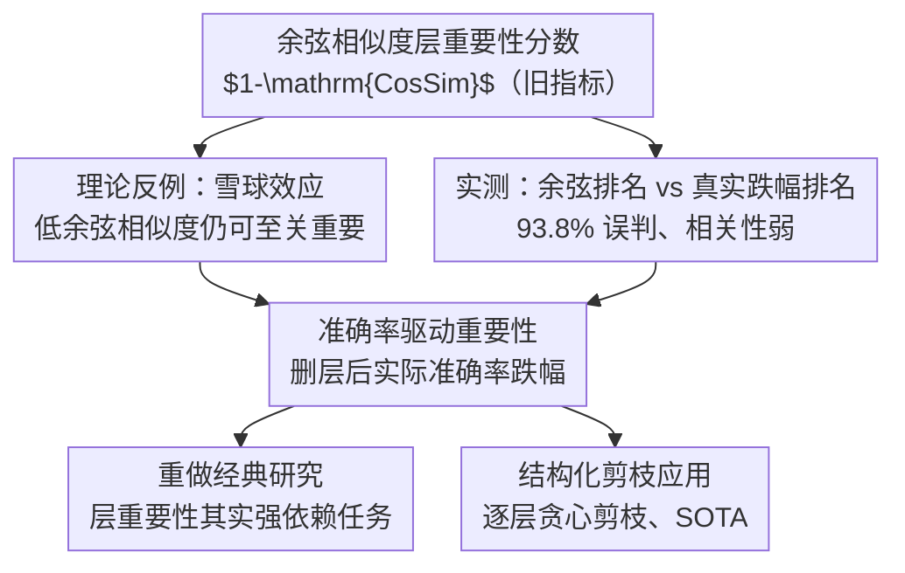

# Rethinking Layer Relevance in Large Language Models Beyond Cosine Similarity

**会议**: ICLR 2026  
**OpenReview**: [https://openreview.net/forum?id=mRLnS8jQWt](https://openreview.net/forum?id=mRLnS8jQWt)  
**代码**: 待确认  
**领域**: 可解释性 / 机制可解释性 / LLM 层重要性 / 结构化剪枝  
**关键词**: 层重要性、余弦相似度、机制可解释性、雪球效应、准确率驱动剪枝

## 一句话总结
这篇论文从理论和实验两方面证明「余弦相似度」并不是衡量 Transformer 层重要性的可靠代理指标——一个层可以余弦相似度极低却对模型性能至关重要——并主张改用「删掉该层后模型准确率的实际跌幅」作为更忠实的层重要性度量，从而修正了过去基于余弦相似度得出的若干可解释性结论，也带来了更强的结构化剪枝效果。

## 研究背景与动机
**领域现状**：机制可解释性（mechanistic interpretability）想搞清楚预训练 LLM 内部「哪一层在干什么、哪一层重要」。一个被广泛采用的工具是**余弦相似度**：把某一层的输入向量和输出向量做对比，如果二者几乎一致（余弦相似度接近 1），就认为这层「几乎没改变表示」，因而「不重要」。具体定义层重要性为 $1 - \mathrm{CosineSim}(\text{input}, \text{output})$，在所有 token 和样本上取平均。很多工作（Sajjad、He、Men、Gromov、Zhang 等）都基于这个分数来做层分析和剪枝。

**现有痛点**：这个分数有一个未经检验的隐含假设——「层对输入改动小」就等于「层不重要」。作者直接质疑这个假设。一个直观的反例：OLMo 的第 16 层按余弦相似度看几乎「不重要」（输出和输入很像），但把它删掉后在十个数据集上平均准确率暴跌 66%，单删这一层就能把 OLMo 在 ARC-C 上打到随机水平。也就是说，余弦相似度会**严重误判**层的真实重要性。

**核心矛盾**：余弦相似度衡量的是「表示空间里的几何变化幅度」，而我们真正在乎的是「删层后下游任务性能的变化」。二者之间没有可靠对应关系，因为 Transformer 各层之间存在复杂的相互依赖：一层做出的一个微小改动，可能被后续层逐级放大（雪球效应），最终彻底改变模型输出；反过来，一层在「与预测无关的表示维度」上做了很大改动，会让它的余弦相似度看起来很大却对性能毫无贡献。

**本文目标**：(1) 在理论上严格证明「低余弦相似度 ≠ 低重要性」；(2) 在多个真实 LLM 上量化余弦相似度与真实性能跌幅之间到底有多弱的相关性；(3) 提出一个更忠实的替代指标并验证它能修正旧结论、并在结构化剪枝上更强。

**切入角度**：与其用代理指标，不如**直接度量我们真正关心的东西**——删掉一层后模型在某任务上的准确率究竟掉了多少。代价是要逐层删除、逐次重新评测（计算昂贵），但它天然捕捉了层间依赖。

**核心 idea**：用「删层导致的实际准确率跌幅」（accuracy-based relevance）取代「输入输出余弦相似度」，作为衡量层重要性的金标准。

## 方法详解
本文不是提出一个新模型，而是提出一个新的**度量与评测范式**：先拆穿旧指标（余弦相似度），再立一个新指标（准确率驱动重要性），最后用新指标重做旧实验、并落地到剪枝。下面分三块讲清「为什么旧指标不行」「新指标怎么定义」「怎么用它得出不同结论」。

### 整体框架
整条工作的逻辑链是：**定义旧指标 → 构造反例证明旧指标会失效 → 在真实模型上实测旧指标到底有多不靠谱 → 提出新指标 → 用新指标重做两个经典可解释性研究 → 把新指标用于结构化剪枝**。它不是一个串行的数据处理管线，而是「拆旧立新再验证」的论证结构，整体可如下图示意。

### 关键设计

**1. 雪球效应：用一个可构造的 Transformer 证明「低余弦相似度也能性能至关重要」**

这是全文的理论基石，针对的痛点是「余弦相似度小就当层不重要」这一假设本身。作者证明了 **Theorem 1**：对任意数据集 $D$ 和任意 $\epsilon>0$，都能构造一个 $L\ge 3$ 层的 decoder-only Transformer，使得存在某中间层 $l$，它的余弦相似度分数恰好等于 $\epsilon$（即在所有层里余弦相似度最低、最像「无关层」），但整模型在 $D$ 上准确率为满分，而一旦删掉这一层 $l$，准确率直接掉到零。换句话说，最「该被剪掉」的层其实是最不能动的层。

构造要成立靠两个机制。其一是**雪球效应（snowball effect）**：目标层只对输入向量做一个极小的扰动（所以余弦相似度接近 1、分数接近 0），但这个扰动被后续层逐级放大，最终主导了输出——小输入、大后果。其二是**存在与预测无关的嵌入维度**：模型预测只依赖部分维度，于是其他层可以在「无关维度」上大幅改写表示，把自己的余弦相似度分数撑得很高，看起来「很重要」，实则对性能毫无贡献。两者叠加就制造出「余弦相似度排名」与「真实重要性排名」完全相反的最坏情况。作者指出这两种现象在真实预训练 LLM 里都会自然出现，尤其在任务相关的设定下——OLMo 第 16 层就是一个实测到的雪球效应例子。

**2. 实证审计：在三个真实 LLM 上量化余弦相似度有多不可靠**

理论说的是「最坏情况存在」，这一设计回答「现实中到底有多糟」。作者在 Pythia、Mistral、OLMo 三个模型、十个数据集（C4、CodeAlpaca、LIMA、MathInstruct、BoolQ、ARC-C/E、HellaSwag、PIQA、Winogrande）上，逐层计算余弦相似度分数，并逐层删除测量真实准确率跌幅，然后看二者的对应关系（剔除头尾两层这类显然重要的离群层）。

结论是相关性又弱又随模型而异：Pythia 为中等（$R=-0.46$），Mistral 偏弱（$R=-0.23$），OLMo 极弱（$R=-0.15$）。更直接的证据是**排名混淆矩阵**：把余弦相似度给出的「第 $j$ 不重要」排名和真实跌幅的「第 $i$ 不重要」排名对照，对角线代表完全一致。结果余弦相似度在 **93.8%** 的情形里误判了层的相对重要性；即便只看偏差很大的严重误判，也仍有 **53.6%** 出错。这把「余弦相似度是噪声很大的代理」从个案上升为统计事实，提醒所有用它做机制可解释性的工作都可能得出错误结论。

**3. 准确率驱动的层重要性分数：直接度量我们真正在乎的东西**

立新指标。给定数据集 $D$ 和 $L$ 层模型 $f^L$，层 $l$ 的重要性定义为

$$\mathrm{AccBasedRelevance}(f^L, l, D) = 1 - \frac{\max(\mathrm{Accuracy}(f^L_{-l}, D) - r(D),\, 0)}{\max(\mathrm{Accuracy}(f^L, D) - r(D),\, 0)},$$

其中 $f^L_{-l}$ 是删掉层 $l$ 后的模型，$r(D)$ 是随机预测器在该数据集上的期望准确率（用来扣除「瞎猜也能得的分」做归一化）。这个分数取值在 $-\infty$ 到 $+1$ 之间：**正值表示删层后性能下降（层重要）**，零表示无变化，**负值表示删掉它反而变好**（层有害）。注意这个范围只有在「整模型表现好于随机」时才有意义，若模型本身低于随机基线，分数就没有定义、不应套用。

它好在哪：直接用「删层后的真实准确率跌幅」打分，绕过了余弦相似度作为几何代理的所有缺陷，并且天然吸收了层间相互依赖（雪球效应、无关维度都被实际跑出来的准确率反映出来）。代价是计算昂贵——余弦相似度只需 $T$ 次前向（$T$ 为标定样本数），而本指标需要 $N\times T$ 次前向（$N$ 为层数），因为要逐层删除再重测。这个分数还能用在任意粒度的组件上（单个权重、注意力头、MLP、整个 Transformer block 乃至多个 block），本文聚焦于对 Transformer block 打分。

### 一个完整示例
拿 Gromov 等人的经典结论「越深的层对推理任务越不可或缺、对事实检索任务则不那么重要」来走一遍。他们用基于余弦相似度的剪枝策略在 LLaMA 2-70B 上观察到：随剪枝比例上升，MMLU（世界知识）保持稳定，而 GSM8K、HellaSwag（推理类）立刻掉分且持续恶化，于是推断「推理任务需要所有层」。

作者在 LLaMA 3-8B 上换成准确率驱动指标重做：先按训练集上「删层导致的真实准确率跌幅」给层排名，再据此逐层剪枝。结果出现了不同图景——用更有信息量的指标后，HellaSwag 在删掉好几个 block 后仍保持强性能，GSM8K 在剪掉两个 block 后也几乎不掉。换句话说，「保持 75% 以上准确率的同时仍能砍掉 22% 的层」是可行的，这直接挑战了「推理任务每一层都不可或缺」的旧结论。根因是余弦相似度低估了某些对推理关键的 block（过早剪掉它们才造成原研究里的急剧掉分），同时又分不清哪些层对推理其实无关；而准确率驱动指标能把「真关键」和「可删」的层区分开。

## 实验关键数据

### 主实验：任务相关结构化剪枝（LLaMA3-8B，删 25%）
每种方法都用对应任务的训练集做标定、删掉 25% 的模型，再在测试集上评测。准确率驱动指标（Ours）在几乎所有任务上都超过全部基线，平均分逼近未剪枝的原模型。

| 方法 | ARC-C | ARC-E | BoolQ | HS | OBQA | PIQA | WG | MMLU | 平均 |
|------|-------|-------|-------|-----|------|------|-----|------|------|
| Original（未剪枝） | 53.16 | 81.02 | 82.02 | 78.94 | 44.8 | 81.28 | 73.56 | 65.11 | 69.99 |
| Taylor | 31.48 | 67.97 | 61.31 | 62.73 | 38.4 | 76.55 | 55.64 | 25.03 | 52.39 |
| Cosine Similarity | 45.73 | 67.8 | 66.33 | 69.52 | 38.6 | 72.91 | 71.35 | 44.05 | 59.54 |
| Perplexity | 38.14 | 53.11 | 62.14 | 58.92 | 38.4 | 67.19 | 62.12 | 59.04 | 54.88 |
| Slice-GPT | 41.64 | 73.27 | 75.75 | 67.35 | 39.6 | 77.15 | 70.56 | 48.74 | 61.76 |
| **Accuracy (Ours)** | **49.57** | **74.96** | **84.04** | **71.53** | **44** | **79.06** | **73.8** | **62.97** | **67.49** |

值得注意的是，在 BoolQ、WG 等任务上剪枝后的准确率甚至**略高于原模型**——因为删掉的是对该任务有害或无关的层。

### 任务无关剪枝与标定集敏感性（LLaMA3-8B，删 25%）
任务无关设定要求剪一次、在所有任务上都还能用。用「从八个 benchmark 各取 10% 训练数据混合」做标定集时，Ours 平均分最高（65.04）；但若把标定集限制到单一 benchmark，性能波动很大，而余弦相似度无论用什么标定集都稳定在约 60%。

| 配置 | 平均分 | 说明 |
|------|--------|------|
| Original | 69.99 | 未剪枝 |
| Cosine Similarity | 60.1 | 对标定集不敏感、稳定但偏低 |
| **Accuracy (Ours，混合 10%)** | **65.04** | 多样标定集下最优 |
| Accuracy (ARC-E 标定) | 63.18 | 单任务标定也能较好泛化 |
| Accuracy (C4 标定) | 50.23 | 标定集选错则严重退化 |

### 关键发现
- **余弦相似度误判率 93.8%**：是全文最有冲击力的数字，把「余弦相似度不可靠」从个案变成统计结论；即便只算严重误判也有 53.6%。
- **层重要性强依赖任务**：用准确率驱动指标做 z-score 归一化后，各 block 跨数据集的方差显著大于余弦相似度（Wilcoxon 检验显著）；例如删 OLMo 的 block 14 在 MathInstruct 上掉约 41%，在 CodeAlpaca 上只掉约 1%；Mistral 的 block 23 删掉后 MathInstruct 反升约 25%、CodeAlpaca 却降约 6%。这推翻了「层重要性与任务无关」的旧观点。
- **计算代价是主要短板**：余弦相似度剪 25% 的 LLaMA3-8B 只需几分钟，本方法平均约 4.6 小时（与 Taylor、output-based 等基线同量级，但效果更好）；估算剪 50% 的 LLaMA3-70B 在两张 H100 上需 1.1～8.5 天（取决于标定集）。
- **贪心剪枝是次优的**：当前逐层贪心（算重要性→删最不重要的层→重算）并非全局最优，理论上需要 A* 这类可回溯搜索才能找到最优层组合，但代价过高。

## 亮点与洞察
- **「指标即结论」的方法论警示**：论文最「啊哈」的地方是——很多关于 Transformer 内部机制的结论（哪层重要、推理 vs 事实任务的层依赖差异）其实是被所选指标「制造」出来的；换个更忠实的指标，结论可能反转。这提醒可解释性研究要先审计度量本身。
- **理论 + 实证双重打击**：不只给个反例（Theorem 1 的雪球效应构造），还在三个真实模型上量化了误判率，证明最坏情况确实会在现实中部分发生，论证闭环。
- **简单却 SOTA 的剪枝**：准确率驱动指标实现极其朴素（删层、测准确率），却在结构化剪枝上超过 Taylor、各种 output-based 相似度、perplexity 和 Slice-GPT，说明「直接优化你真正在乎的目标」往往胜过精巧的代理。
- **可迁移思路**：这个「用下游性能跌幅而非表示几何变化来定义重要性」的思想可推广到注意力头、MLP、神经元等任意粒度的归因分析，给机制可解释性提供了一把更可靠的尺子。

## 局限与展望
- **计算昂贵**：$N\times T$ 次前向使其难以直接用于超大模型；作者把「加速准确率重要性的计算/估计」列为关键未来方向，也指出未充分利用并行化。
- **贪心次优**：逐层贪心无法保证最优剪枝组合，理想需要带回溯的搜索（如 A*），但当前代价已让穷举不可行。
- **标定集敏感**：任务无关设定下，剪枝效果对标定集选择高度敏感（C4 标定就崩到 50.23）；「一个好的任务无关标定集应具备什么性质」尚不清楚，BoolQ、MMLU 这类任务的层重要性模式与其他任务差异很大，难以泛化。
- **指标下界问题**：准确率驱动分数在「模型表现低于随机基线」时无定义，对极弱模型或极难任务不适用。

## 相关工作与启发
- **vs 余弦相似度（局部指标）**：He、Men、Gromov 等用 $1-\mathrm{CosSim}$ 衡量层是否「改变表示」，本文证明它与真实性能跌幅相关性弱、93.8% 误判；本文优势是忠实、劣势是慢。
- **vs 一致性型全局指标**（Sieberling、Zhang 等的 output 分布对比）：它们看「删层后输出分布是否变化」，但关注的是输出不变性而非预测准确率，会漏掉对性能有微妙影响的层；本文直接盯准确率。
- **vs 性能型全局指标**（Taylor 近似 / perplexity 型，Ma、Kim、Zhong 等）：这些与本文动机最接近，都用某种 ground-truth 信号估重要性（Taylor 用损失的泰勒展开、perplexity 看删层后困惑度涨幅），但实验中本文准确率驱动分数在结构化剪枝上持续优于它们。
- **启发**：本文相当于给一大批基于余弦相似度的可解释性结论打了个问号，后续工作可以用准确率驱动指标重审「特定注意力层/MLP 的功能归因」这类研究，可能得到与旧文献不同的新结论。

## 评分
- 新颖性: ⭐⭐⭐⭐⭐ 首个从理论+实证系统证伪「余弦相似度衡量层重要性」的工作，并给出可落地替代。
- 实验充分度: ⭐⭐⭐⭐ 覆盖三模型十数据集、两个经典研究复现、八 benchmark 剪枝对比，但超大模型仅靠估算。
- 写作质量: ⭐⭐⭐⭐⭐ 论证链条清晰（拆旧→立新→验证），反例与统计证据互相印证。
- 价值: ⭐⭐⭐⭐⭐ 既修正机制可解释性的方法论，又带来更强的结构化剪枝，影响面广。

<!-- RELATED:START -->

## 相关论文

- [\[ICLR 2026\] Beyond Linear Probes: Dynamic Safety Monitoring for Language Models](beyond_linear_probes_dynamic_safety_monitoring_for_language_models.md)
- [\[ICLR 2026\] Medical Interpretability and Knowledge Maps of Large Language Models](medical_interpretability_and_knowledge_maps_of_large_language_models.md)
- [\[ICLR 2026\] Spilled Energy in Large Language Models](spilled_energy_in_large_language_models.md)
- [\[ICLR 2026\] What Do Large Language Models Know About Opinions?](what_do_large_language_models_know_about_opinions.md)
- [\[ICLR 2026\] Precise and Interpretable Editing of Code Knowledge in Large Language Models](precise_and_interpretable_editing_of_code_knowledge_in_large_language_models.md)

<!-- RELATED:END -->
