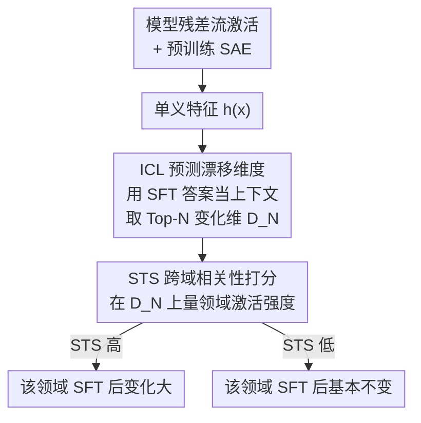

# SAE as a Crystal Ball: Interpretable Features Predict Cross-domain Transferability of LLMs without Training

**会议**: ICLR 2026  
**OpenReview**: [https://openreview.net/forum?id=KQYnfeBNjl](https://openreview.net/forum?id=KQYnfeBNjl)  
**代码**: https://github.com/PKU-ML/STS  
**领域**: 可解释性 / 后训练分析  
**关键词**: 稀疏自编码器, 单义特征, 后训练迁移性, 监督微调, 上下文学习

## 一句话总结
这篇论文提出 STS（SAE-based Transferability Score）：先用上下文学习（ICL）在**不微调**的前提下预测出监督微调（SFT）会改动哪些稀疏自编码器（SAE）维度，再衡量这些维度与下游各领域的相关性，从而在训练前就预测出 SFT 会对哪个领域涨/掉多少分，Pearson 相关系数普遍超过 0.7。

## 研究背景与动机
**领域现状**：预训练大模型要在具体任务上发挥威力，几乎都要经过后训练（post-training），主要是监督微调（SFT）和强化学习（RL）。后训练把通用模型对齐到特定任务和目标上，是从"会一点"到"很能打"的关键一步。

**现有痛点**：后训练有个广为人知的副作用——在目标任务上涨分，往往以其他领域掉分为代价（比如把数学推理练强了，鲁棒性或别的能力反而退化）。但"哪个领域会受益、哪个会退化、退多少"，目前完全没法**事先**预测。现有研究几乎都是 post-hoc 的：等模型训完了再去分析迁移效果，这在实践中价值有限——你已经花了算力训完才知道结果好不好。

**核心矛盾**：模型内部特征在后训练中如何关联、如何迁移，机制上仍是黑箱。raw 激活空间里特征是高度**多义且纠缠**的（一个能力分散在很多维度上、一个维度又混了多个概念），所以根本看不清"SFT 到底动了什么"，也就无从预测。

**本文目标**：建立一个**不需要真的微调**就能预测跨领域迁移性的方法，并且要可解释——能说清"为什么这个领域会受影响"。

**切入角度**：作者借助稀疏自编码器（SAE）带来的**单义性**（monosemanticity）——SAE 编码后的每一维只被某个自然概念（如某个数学定义、某种语言模式）激活。作者观察到一个关键现象：SFT 其实只改动了 SAE 表示里**一小撮**维度（前 100 维就占了总变化量的 25%），且这些维度恰好对应被训练的能力（把这些维度置零，数学能力暴跌；置零随机维度则几乎无影响）。

**核心 idea**：既然 SFT 只动一小撮可解释维度，那就"识别出这些被改动的维度 + 衡量它们与各下游领域的相关性"来预测迁移性；而识别工作可以在训练前用 ICL 来替代，因为 ICL 和 SFT 改动的维度高度重叠。

## 方法详解

### 整体框架
STS 把"预测后训练迁移性"拆成两步走，全程**不碰微调后的模型**，所以是纯预测而非事后分析。输入是一份 SFT 训练集（如数学数据 LIMO）和若干个待评估的下游领域数据集（如 MMLU-Pro 的工程/物理/法律等子领域）；输出是每个领域的一个标量分数 STS，分数越高代表 SFT 后该领域性能变化越大。

整条流水线是：先把模型某一层的残差流激活喂进一个预训练好的 SAE 得到单义特征；第一步用 ICL（把 SFT 的标准答案当作上下文示例）找出"会被 SFT 改动"的 Top-N 维度；第二步在这些维度上，衡量某个下游领域的数据能把它们激活/调制到多强，得到该领域的 STS 分数；最后把分数和真实性能变化做相关性分析，验证预测可靠。

### 关键设计

**1. 用 ICL 在训练前预测 SFT 的漂移维度：把 post-hoc 变成预测**

要预测迁移性，前提是知道 SFT 会动哪些维度，但常规做法必须等模型训完才能比较前后特征——这就把分析锁死在事后视角了。作者抓住一个已知现象：ICL 和 SFT 在大模型上能取得相似的效果、行为也相似。于是把 SFT 用的标准答案（如 LIMO 的 chain-of-thought）原封不动当作 ICL 的上下文示例喂给**未微调**的模型，比较"有/无上下文"时 SAE 特征的变化，取变化最大的 N 维作为预测的漂移维度：

$$D_N = \text{Top}_N\left(\mathbb{E}_{x_i}\lVert h_j(x_i;\Theta) - h_j(x_0,y_0,\cdots,x_t,y_t,x_i;\Theta)\rVert^2\right)$$

其中 $h_j$ 是 SAE 特征的第 $j$ 维，$\Theta$ 是预训练模型参数。实验显示这个预测相当准：ICL 预测的 Top-100 维与 SFT 实际漂移的 Top-100 维有 57% 重叠（code 任务 62%、health 任务 57%）。这一步是整个方法能"免训练"的根基。

**2. SAE 单义空间是预测能成立的必要条件：raw 维度做不到**

为什么非得套 SAE？因为 raw 激活空间里特征多义纠缠，一个能力被摊在大量维度上，SFT 的影响也就**均匀地**散在很多维度，根本挑不出"关键的那一小撮"。作者在 raw 特征上重复同样的"按 SFT/ICL 变化排序"流程，发现两点：raw 维度的漂移分布远比 SAE 平坦（Figure 2b），且 ICL 与 SFT 漂移维度的重叠率大幅下降（Figure 2a）。换句话说，是 SAE 带来的单义性让"漂移集中在少数维"这个现象浮现出来，方法才得以成立——这也是后面消融里"SAE 打败了 probe"的根源。

**3. STS 分数：在漂移维度上量领域相关性，给出两种估计**

拿到漂移维度集合 $D_N$ 后，需要量化"某个下游领域和这些维度有多相关"——相关越强，SFT 对该领域的冲击越大。作者给了两种打分。第一种直接看领域数据在这些维度上的平均激活值：

$$\text{STS}_{\text{act}}(\tilde{T}) = \mathbb{E}_{\tilde{x}_i}\sum_{j\in D_N} h_j(\tilde{x}_i;\Theta)$$

第二种再次借力 ICL：用领域内的真实问答对当上下文，比较"有/无领域示例"时漂移维度上特征的变化，从而隔离出领域知识对这些维度的调制强度：

$$\text{STS}_{\text{ICL}}(\tilde{T}) = \mathbb{E}_{\tilde{x}_i}\sum_{j\in D_N}\lVert h_j(\tilde{x}_0,\tilde{y}_0,\cdots,\tilde{x}_m,\tilde{y}_m,\tilde{x}_i;\Theta) - h_j(\tilde{x}_i;\Theta)\rVert^2$$

实验显示 $\text{STS}_{\text{ICL}}$ 比 $\text{STS}_{\text{act}}$ 更稳（相关系数稳定在 0.75 以上），因为 ICL 把领域信号主动注入表示、比单纯看静态激活值更能反映真实相关性。整个估计**全程不用微调后的模型**，这正是 STS 作为"预测指标"而非"事后指标"的核心价值。

### 一个完整示例
以 Qwen2.5-7B-Instruct 在数学数据 LIMO 上做 SFT、评估它在 MMLU-Pro 上的迁移为例：① 把 LIMO 的两条标准 CoT 当作 ICL 上下文，在 Qwen 第 25 层残差流的 SAE 特征上找出变化最大的 Top-100 维 $D_N$（这些维大致对应"数学推理"概念）；② 对 MMLU-Pro 的某个领域（如工程），取该领域 5 条 CoT 当上下文算出 $\text{STS}_{\text{ICL}}$；③ 工程领域的 STS 偏高 → 预测它在 SFT 后变化大，法律领域 STS 偏低 → 预测基本不变。事后真去跑一遍 SFT，性能变化的实际排序与 STS 排序高度吻合（Qwen 上 $\text{STS}_{\text{act}}$ 的 $\rho=0.90$）。

## 实验关键数据

### 主实验
在 LIMO（817 条高质量数学样本）上微调三个模型，评估 STS 与 MMLU-Pro 各领域真实性能变化的 Pearson 相关系数 $\rho$（重复 3 次取均值±标准差）：

| 模型 | $\text{STS}_{\text{act}}$ | $\text{STS}_{\text{ICL}}$ |
|------|------|------|
| Llama3-8B-Instruct | 0.71 ± 0.01 | 0.81 ± 0.01 |
| Qwen2.5-7B-Instruct | 0.90 ± 0.02 | 0.78 ± 0.01 |
| Gemma2-9B-Instruct | 0.60 ± 0.03 | 0.77 ± 0.01 |

跨训练领域的进一步验证（Qwen2.5-7B-Instruct，$\text{STS}_{\text{ICL}}$）：

| 训练领域 | STS 与真实性能变化相关性 | Top-100 估计/实际漂移维重叠 |
|----------|------|------|
| Code（编程数据集） | 0.77 ± 0.01 | 62 |
| Health（临床对话） | 0.71 ± 0.02 | 57 |

### 消融实验

| 配置 | 关键指标趋势 | 说明 |
|------|---------|------|
| Full（SAE 单义特征） | 相关性最高 | 完整方法 |
| SAE 隐藏维 16k → 131k | 相关性明显下降 | 单义性变弱，预测变差 |
| 选低漂移维度 | 相关性下降 | 选到没被 SFT 影响的维度引入噪声 |
| raw 激活 / SAE 激活直接打分 | 几乎无相关 | 不挑漂移维、单纯探针不行 |
| 不同层 (15/20/25) | 相关性都稳 | 跨层鲁棒 |

### 关键发现
- **漂移高度集中**：SFT 只改动一小撮 SAE 维度，Top-100 维占总变化 25%；置零这些维度数学能力暴跌，置零随机维度几乎无影响——这是整个方法的立足点。
- **单义性是命门**：把 SAE 隐藏维从 16k 增到 131k（单义性减弱）后预测精度明显下降；更高稀疏度（更强单义性）则预测更准。
- **SAE 打败 probe**：直接拿 raw 激活或 SAE 激活训一个优化过的探针去预测性能变化，几乎得不到有意义的相关性——必须"识别 SFT 漂移维度"这一步，光探针不够。
- **数据混合应用**：按各领域 STS 比例分配额外训练数据，能让掉分最多的工程领域和几乎不掉的法律领域取得平衡（工程多给数据涨得多，法律多给数据几乎没用）。

## 亮点与洞察
- **用 ICL 当 SFT 的"水晶球"**：核心 trick 是把"必须训完才能看的漂移维度"用免训练的 ICL 提前预测出来，57%~62% 的 Top-100 重叠率就足以撑起 0.7+ 的迁移预测——把 post-hoc 分析变成事前预测，这是最"啊哈"的地方。
- **单义性的实用价值落地**：以往 SAE 多停留在"看懂某一维是什么概念"，这里把单义性变成了一个能指导后训练数据配比的可操作指标，给可解释性研究找了个真实抓手。
- **可迁移的思路**："先定位被改动的少数关键维度，再衡量它们与目标的相关性"这套两步法，可以推广到别的后训练干预（如剪枝、模型编辑、不同对齐方法）的影响预测上。

## 局限与展望
- **RL 上失灵**：直接把 STS 套到 RL（GRPO 在 Math-LightEval 上训 Qwen）相关性很低。作者诊断出根因——RL 没有 ground-truth 答案，难以挑选合适的 ICL 示例，导致漂移维度估计不准；若换成 RL 后的**真实**漂移维度，STS 相关性立刻变强。所以瓶颈在"训练前如何准确估计 RL 漂移维度"，这被列为未来方向。
- **依赖现成 SAE**：方法需要一个在目标模型上训好、单义性足够强的 SAE；SAE 质量（隐藏维、稀疏度、层）直接决定预测好坏，换个没有好 SAE 的模型就难办。
- **领域评测偏窄**：主实验集中在 MMLU-Pro 子领域 + 数学/代码/健康几个训练域，跨更多样的能力组合、更大模型上的泛化性还需验证。
- **预测的是"变化幅度"**：STS 衡量的是性能变化的**绝对幅度**（用绝对值相关性），区分"涨还是掉"以及量化具体涨跌方向上还有进一步细化空间。

## 相关工作与启发
- **vs 后训练迁移性的 post-hoc 研究（Huan et al. 2025 / Chu et al. 2025）**：他们都是训完后再分析能力迁移或 SFT/RL 泛化差异，本文最大区别是**训练前预测**，实用性更强（不用先烧算力训）。
- **vs 直接探针（probing）**：探针在 raw 或 SAE 激活上直接预测性能变化几乎无效；本文证明"先识别 SFT 漂移维度"这一中间步骤不可或缺，是少数 SAE 明确优于 probe 的任务。
- **vs 普通 SAE 可解释性工作（Cunningham et al. 2023 / Gao et al. 2024）**：它们建立单义性这一基础，本文把单义性从"解释单个特征"推进到"预测后训练迁移 + 指导数据混合"的下游可操作应用。

## 评分
- 新颖性: ⭐⭐⭐⭐⭐ 用 ICL 免训练预测 SFT 漂移维度、再做迁移性预测，视角新颖且抓住了 SAE 单义性的真实用途。
- 实验充分度: ⭐⭐⭐⭐ 三模型多领域 + 跨训练域验证 + 充分消融 + 数据混合应用，扎实；但 RL 仅初步探索、未真正解决。
- 写作质量: ⭐⭐⭐⭐ 逻辑链清晰（现象→预测→打分→应用），公式与图表对得上。
- 价值: ⭐⭐⭐⭐ 给后训练数据配比提供了可解释、免训练的指导工具，实用潜力大。

<!-- RELATED:START -->

## 相关论文

- [\[ICLR 2026\] Evaluating SAE Interpretability Without Generating Explanations](evaluating_sae_interpretability_without_generating_explanations.md)
- [\[ICLR 2026\] Understanding Cross-Layer Contributions to Mixture-of-Experts Routing in LLMs](understanding_cross-layer_contributions_to_mixture-of-experts_routing_in_llms.md)
- [\[ICLR 2026\] Cross-Modal Redundancy and the Geometry of Vision-Language Embeddings](cross-modal_redundancy_and_the_geometry_of_vision-language_embeddings.md)
- [\[ICLR 2026\] ZeroTuning: Unlocking the Initial Token's Power to Enhance Large Language Models Without Training](zerotuning_unlocking_the_initial_tokens_power_to_enhance_large_language_models_w.md)
- [\[ICLR 2026\] Persona Features Control Emergent Misalignment](persona_features_control_emergent_misalignment.md)

<!-- RELATED:END -->
