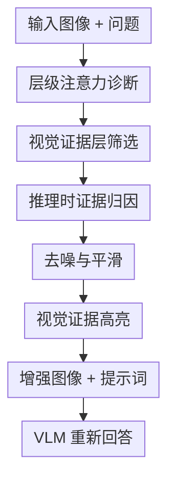

# Seeing but Not Believing: Probing the Disconnect Between Visual Attention and Answer Correctness in VLMs

**会议**: ICLR 2026  
**OpenReview**: [https://openreview.net/forum?id=JAI7afWA9e](https://openreview.net/forum?id=JAI7afWA9e)  
**论文**: [OpenReview](https://openreview.net/forum?id=JAI7afWA9e)  
**代码**: 待确认  
**领域**: 多模态VLM可解释性 / 视觉证据利用  
**关键词**: VLM可解释性, 视觉注意力, 视觉证据增强, VQA, 推理时干预

## 一句话总结

这篇论文系统分析 VLM 在 VQA 中“看见证据却答错”的现象，发现深层 attention 往往已经定位到正确视觉证据但生成阶段没有充分使用，并据此提出无需训练的 VEA 推理时视觉证据高亮方法，在 LLaVA、Qwen、Gemma、InternVL 等多类模型和多个证据型 VQA 任务上稳定提升准确率。

## 研究背景与动机

**领域现状**：VLM 已经能在 VQA、文档理解、场景文字问答等任务上取得很强结果，但这些任务背后的核心能力不是“看过图片”这么简单，而是要把问题中的语言约束和图片里的局部证据对齐起来，再把证据真正用于答案生成。许多 recent VLM failure case 都显示：图片里明明有答案，模型却会拒答、幻觉，或者给出只部分正确的回答。

**现有痛点**：过去很多解释把这类错误归因于 VLM 对图像 token 的整体关注不足，或者说模型更依赖语言先验。但“图像 attention 少”并不等价于“模型没有看到证据”。如果模型内部某些层其实已经把 attention 聚到正确证据区域，那么错误就不再只是感知失败，而是证据从内部表示传到最终生成时被语言先验、上下文噪声或解码过程压过去了。

**核心矛盾**：本文抓住的矛盾是视觉感知和答案正确性之间并不总是一致。VLM 的深层可能已经形成局部视觉 grounding，却没有把这个 grounding 转化为可信的答案依据；换句话说，模型内部“看见”的东西没有被最终生成“相信”。这个矛盾比单纯比较 text token 和 image token 的 attention 总量更细，因为它要求回答两个问题：attention 什么时候转向图像，以及转向图像后是否真的服务于答案。

**本文目标**：作者把问题拆成四个诊断问题：第一，模型跨层如何在文本和图像之间切换注意力；第二，不同层到底看向哪些图像区域；第三，模型答错时是否仍然会看向正确视觉证据；第四，如果确实存在“看见但不相信”，能否把内部证据信号显式化，帮助模型更好利用图像。

**切入角度**：论文选择 layer-wise attention 作为切入点，因为 Transformer VLM 在生成第一个答案 token 时会同时访问问题 token 和图像 token，这给了一个观察模型内部证据分配的窗口。作者没有只看最后输出，而是把 attention 按层拆开，再用 VisualCoT 的人工证据框把视觉 token 分成 evidence / non-evidence，从而能量化某层 attention 是否真的对准了答案所需区域。

**核心 idea**：如果深层 attention 已经能可靠标出视觉证据，那么可以把这些区域在输入图像上高亮出来，让模型第二次推理时更难忽略自己已经“看见”的证据。

## 方法详解

### 整体框架

本文的方法可以分成两个紧密相连的部分：先用 attention probing 证明 VLM 中存在“深层视觉证据定位但答案仍错误”的断裂，再把这种深层证据定位变成 Visual Evidence Augmentation (VEA)。VEA 不训练模型，也不改权重，而是在推理时先用模型内部 attention 生成证据 mask，然后把原图中高证据区域保留、低证据区域压暗，最后让 VLM 基于增强后的图像回答问题。

诊断部分回答“模型有没有看见”：作者计算每层对文本 token、图像 token、证据图像 token 的 attention，并和人工标注证据区域对齐。干预部分回答“能不能让模型相信”：作者选择视觉 grounding 能力最强的层，聚合这些层的图像 attention，经过 sink token 去噪和 Gaussian smoothing 后得到可视化 mask，再把 mask 叠回原图作为新的输入。

### 关键设计

**1. 层级注意力诊断：把“是否看图”拆成跨层转移和局部证据定位**

论文首先定义 Relative Attention per Token (RAPT)，用某一输入区段的平均每 token attention 与全输入平均值之比来观察 text token 和 image token 的相对关注程度。RAPT 的意义是避免被 token 数量直接误导：图像 token 很多，整体 attention mass 可能不小，但每个图像 token 分到的注意力仍可能低于文本 token。作者在 LLaVA-1.5-7B 等模型上看到一个稳定趋势：浅层强烈偏向问题文本，深层逐渐提高对图像 token 的关注，说明模型并不是从头到尾并行处理两种模态，而更像先读问题、再转向图像。

更关键的是，作者没有停在“深层更看图”这个粗结论，而是把图像 attention 映射回 patch 空间，看它是否落在人工证据框内。浅层通常是弱而散的全局扫描，中后层则出现稀疏、集中的局部 attention，并且这些热点常与 ground-truth evidence 对齐。这个观察把 VLM error 的讨论从“模型看不看图”推进到“模型在哪一层、以什么粒度看到了什么”。

**2. Seeing but Not Believing：用正确/错误样本对照证明证据感知不等于答案正确**

本文最有价值的发现是：即使模型最终答错，深层 attention 也常常仍然更关注正确证据区域。作者在 VisualCoT 上把样本按答案正确与否分组，再比较 evidence token 与 non-evidence token 的 attention。结果显示，错误回答中的深层 attention 依然偏向 evidence，只是强度通常弱于正确回答。这说明错误并不总是来自“没看到”，也可能来自“看到后没有把证据压过语言先验”。

这个发现解释了几类典型错误：模型可能已经看到了题目需要的文字区域，却因为过强语言先验产生幻觉；也可能看到了图中存在证据，却在生成时拒绝回答；还可能定位到局部证据但答案只用了一部分信息。论文把这种现象命名为 “seeing but not believing”，强调 VLM 的瓶颈不仅是视觉编码器是否捕获信息，还包括解码阶段是否愿意把视觉证据当作最终答案的依据。

**3. 视觉证据层筛选：用小诊断集找出最适合做 grounding 的层**

VEA 的第一步不是随便拿最后一层 attention，而是为每个模型做一次轻量 profiling。给定 VisualCoT 中带 evidence bounding boxes 的小诊断集，作者把图像划成 $m$ 个 patch，并得到二值证据标签 $y_I \in \{0,1\}^m$。对第 $\ell$ 层，取对应图像 patch 的 attention 向量 $\bar{a}^{(\ell)}_I$，用 $\mathrm{AUROC}(y_I, \bar{a}^{(\ell)}_I)$ 衡量这一层把证据排在非证据前面的能力。最后选择平均 AUROC 最高的 top 10% 层作为视觉证据层 $L_{VG}$。

这个设计针对的是不同模型 grounding 层位置不一致的问题。固定用最后一层很容易混入解码偏置或 attention sink，而固定用后半层又会错过某些模型里更早出现的证据层。论文报告的 profiling 结果也支持这一点：例如 LLaVA-1.5-7B 选中层为 14、15、17、19，Qwen2.5-VL-7B 选中 18、22、24，Gemma3-27B 的选中层更分散。也就是说，VEA 把“哪层最像视觉证据定位器”变成一个可量化选择，而不是手工假设。

**4. 推理时视觉证据增强：把内部 attention 变成输入级证据高亮**

在真正推理时，VEA 只需要做一次单 token forward 来抽取生成首个答案 token 时的 attention，而不必先生成完整答案。对每个 patch $p_i$，它聚合视觉证据层中的归一化 attention：

$$
e_i = \frac{1}{|L_{VG}|}\sum_{\ell \in L_{VG}} \bar{a}^{(\ell)}_i, \quad i=1,\ldots,m.
$$

得到 patch 级证据分数后，作者先做邻域去噪，处理 attention sink 造成的孤立高值点。如果某个 patch 分数比 3×3 邻域内所有邻居都高出一个数量级以上，即 $e_{i,j} > \lambda \cdot \max_{(p,q)\in N(i,j)} e_{p,q}$ 且实验中 $\lambda=10$，就把它替换为邻域平均值。这样做背后的直觉很具体：真正证据通常是空间连续的一小片区域，而 sink token 往往是孤零零的异常热点。

随后 VEA 对去噪后的 mask 做 Gaussian smoothing，避免 token 级 mask 直接叠到像素上时形成马赛克伪影。最后用平滑 mask $\tilde{e}$ 调制原图像素：

$$
\hat{I}_{i,j,c}=\bigl(\alpha+(1-\alpha)\tilde{e}_{i,j}\bigr)I_{i,j,c}.
$$

高证据区域因 $\tilde{e}_{i,j}$ 大而接近原图，低证据区域被压暗到由 $\alpha$ 控制的背景强度。作者默认 $\alpha=0.5$、smooth strength $\sigma=0.5$，并在提示词中要求模型尤其关注高亮区域。这个方法的重点不是创造新信息，而是把模型内部已经浮现的证据以视觉输入的形式返还给模型，降低解码阶段忽略证据的概率。

### 一个完整示例

可以把一个 TextVQA 问题想成“图片中收据右上角的 invoice number 是多少”。第一次前向时，VLM 读入整张图片和问题，浅层主要处理 “invoice number” 这样的文本约束，中后层开始把 attention 聚到图像中包含编号的局部文字区域。但如果语言先验或上下文噪声更强，模型可能仍然输出一个常见编号格式，甚至说图片里没有相关信息。

VEA 的处理是先从视觉证据层抽出这个局部区域的 patch attention，把孤立异常点去掉，再把编号附近的连续区域平滑高亮。增强后的图片保留原始编号区域，其他无关文字、边框和背景被适度压暗。第二次回答时，模型看到的不是全图均匀竞争，而是“问题相关区域”更显眼的图像；如果原本错误来自证据未被充分使用，这种输入级强调就能把答案拉回到真实视觉内容上。

### 损失函数 / 训练策略

VEA 是纯推理时方法，没有额外训练损失，也不更新 VLM 参数。唯一需要预先完成的是每个模型一次性的视觉证据层 profiling：用约 100 个 TextVQA 诊断样本计算各层 attention 与人工证据标签的 AUROC，选择 top 10% 层作为 $L_{VG}$。正式推理阶段只包含单 token attention 抽取、mask 后处理、图像高亮和二次 VQA 生成。

实验中的关键超参包括 attention sink 去噪阈值 $\lambda=10$、高亮强度 $\alpha=0.5$、平滑强度 $\sigma=0.5$。作者的参数分析显示，过强高亮会丢掉太多全局上下文，不做 smoothing 又会让图像产生不自然局部伪影，因此中等强度的压暗和自适应平滑更稳。

## 实验关键数据

### 主实验

论文在 VisualCoT 的四个证据型 VQA 数据集上评估：InfoVQA、DocVQA、SROIE 和 TextVQA。这些任务都要求模型从图像中的局部文字或证据区域抽取答案，因此很适合检验“看见证据但没有用好”的问题。模型覆盖四个系列八个规模：LLaVA-NeXT 7B/13B、Qwen2.5-VL 7B/32B、Gemma3 4B/27B、InternVL3.5 8B/14B。指标包括 QA 的 Exact Match、Token F1，以及证据归因的 AUROC、NDCG@all。

| 方法 | Exact Match 平均排名 | Token F1 平均排名 | 相对 Base 的平均提升 | 结论 |
|------|----------------------|-------------------|-----------------------|------|
| BASE | 5.38 | 5.53 | 0 | 原始模型仍有明显证据利用不足 |
| INST | 5.47 | 5.28 | EM 常接近 0，F1 小幅变化 | 只靠提示“关注视觉证据”不稳定 |
| CGR | 3.09 | 3.44 | 多数模型提升 | 先描述再回答有用，但依赖中间文本质量 |
| VAR | 3.44 | 3.22 | 多数模型提升 | 最后一层 attention 有帮助，但噪声较大 |
| AGLA | 2.50 | 2.31 | 稳定强 baseline | GradCAM + ensemble 竞争力强 |
| VEA | **1.12** | **1.22** | **EM 平均 +5.67，最高 +11.1；F1 平均 +6.83，最高 +17.3** | 最稳定的推理时视觉证据增强 |

从具体模型看，VEA 对小模型的提升特别明显。LLaVA-NeXT-7B 的平均 EM 从 38.5 提到 49.6，Token F1 从 33.3 提到 50.6；Gemma3-4B 的 EM 从 56.6 到 61.2，Token F1 从 50.5 到 57.8。大模型也有一致收益，例如 InternVL3.5-8B 的 EM 从 79.3 到 83.2，Token F1 从 79.6 到 85.8。这个趋势支持作者的解释：VEA 尤其能补偿较弱 VLM 的视觉证据利用能力，但不是只对小模型有效。

| 模型 / 任务示例 | Base | VEA | 提升 | 指标 |
|-----------------|------|-----|------|------|
| LLaVA-NeXT-7B / TextVQA | 48.44 | 75.32 | +26.88 | EM |
| LLaVA-NeXT-7B / TextVQA | 27.78 | 69.36 | +41.58 | Token F1 |
| Qwen2.5-VL-7B / TextVQA | 85.94 | 90.33 | +4.39 | EM |
| Qwen2.5-VL-7B / SROIE | 92.53 | 94.38 | +1.85 | Token F1 |
| Gemma3-4B / DocVQA | 54.34 | 63.24 | +8.90 | Token F1 |
| InternVL3.5-14B / DocVQA | 88.28 | 90.24 | +1.96 | EM |

### 消融实验

作者还评估了 VEA 证据归因的质量。相较固定层范围和其他 attribution 方法，VEA 在六个代表模型上取得最高 AUROC 和 NDCG 平均排名。表中的数字越高表示 attention 分数越能把人工证据 patch 排在非证据 patch 前面。

| 证据归因方法 | LLaVA-7B AUROC / NDCG | Qwen-7B AUROC / NDCG | Gemma-4B AUROC / NDCG | 平均排名 | 说明 |
|--------------|------------------------|-----------------------|------------------------|----------|------|
| L0%-100% | 75.9 / 47.2 | 68.5 / 41.7 | 59.5 / 35.5 | 4.33 / 4.42 | 所有层平均会稀释证据层 |
| L0%-50% | 68.2 / 43.2 | 59.4 / 34.2 | 56.5 / 34.3 | 5.67 / 5.67 | 早层多是文本解析或粗扫描 |
| L50%-100% | 78.0 / 54.5 | 79.5 / 58.1 | 65.9 / 43.7 | 2.88 / 2.83 | 后半层更接近视觉 grounding |
| VAR | 70.8 / 45.1 | 75.2 / 54.1 | 51.2 / 33.3 | 4.92 / 4.88 | 最后一层 attention 不够稳 |
| AGLA | 80.2 / 57.2 | 77.7 / 55.4 | 68.3 / 44.5 | 2.21 / 2.21 | 强 GradCAM baseline |
| VEA | **83.6 / 63.5** | **85.2 / 68.6** | **80.0 / 59.9** | **1.00 / 1.00** | profiling + 后处理最稳 |

组件消融显示，VEA 不是单靠一个 trick 起作用。完整 VEA 的 EM / Token F1 为 73.4 / 68.1；去掉 denoising 后降到 70.9 / 64.9；去掉 profiling 后为 71.0 / 65.3；去掉 smoothing 后为 68.3 / 62.8。最大下降来自不做 smoothing，说明高亮图像的自然性和空间连续性对 VLM 理解很重要。

| 配置 | Exact Match | Token F1 | 相对完整 VEA 的变化 | 解释 |
|------|-------------|----------|----------------------|------|
| VEA | 73.4 | 68.1 | 0 | 完整流程 |
| w/o Denoise | 70.9 | 64.9 | -2.52 / -3.12 | sink token 噪声会误导高亮 |
| w/o Profiling | 71.0 | 65.3 | -2.42 / -2.78 | 固定层不如模型自适应选层 |
| w/o Smoothing | 68.3 | 62.8 | -5.12 / -5.27 | 马赛克式 mask 破坏图像可读性 |

### 关键发现

- 深层 attention 的证据定位能力确实存在，而且不是只在正确样本里存在；错误样本中的 evidence attention 仍高于 non-evidence attention，只是信号较弱。
- 显式提示模型关注视觉证据不够，INST 的提升最不稳定，说明“使用视觉证据”不是简单 prompt 就能解决的问题。
- VEA 的优势来自两件事的组合：选对 evidence-grounding 层，以及把 attention map 变成空间连续、图像自然的高亮输入。
- 鲁棒性实验显示，在 TextVQA 上加入 Gaussian noise、低分辨率和随机 mask 后，VEA 仍能明显提升 LLaVA-NeXT-7B；在 60% noise 和 30% random masking 下分别有 +16.4 和 +25.8 EM 的提升。
- 附录里的多轮 VisDial 和多图 BLINK 实验也有收益，例如 VisDial 上 Qwen2.5-VL-7B 的 F1 从 27.5 到 47.8，BLINK 上从 61.4 到 68.9，说明证据高亮不只适用于单图单轮 VQA。
- 对 AI2D 和 MMStar 这类更偏全局上下文或科学推理的 benchmark，VEA 仍有小幅提升；保留原图和高亮图的 VEA* 版本通常更强，说明高亮不一定破坏全局理解，但在全局任务中保留原图更保险。

## 亮点与洞察

- 论文最好的地方是把“VLM 看不懂图”这个泛化说法拆细了。它显示模型可能已经把 attention 聚到正确证据，却在生成时没有采纳，这让 failure analysis 从感知问题扩展到证据利用问题。
- RAPT + evidence AUROC 的组合很清楚：前者看模态级 attention 转移，后者看 patch 级证据定位。这样既能解释浅层到深层的处理顺序，又能避免只看注意力总量得出过粗结论。
- VEA 的干预非常克制。它不训练新模块，不要求外部 detector，也不让模型生成长链式解释，而是把模型自己的内部证据信号可视化后返还给输入，这种“自举式 grounding”思路可以迁移到 crop、zoom、局部超分、文档区域重读等 agentic multimodal pipeline。
- 注意力并非永远可靠，但作者没有回避这一点。附录专门看 AUROC < 0.5 的低对齐样本，发现比例大约在 1.42% 到 7.34% 之间，且很多所谓失败来自人工标注不完整；这让结论比单纯展示漂亮 heatmap 更可信。
- 这篇工作也提醒评测者：答案正确率和 grounding 质量应该同时看。一个模型可能答对但证据不稳，也可能看对证据但答错；只看 final answer 会错过很多内部机制差异。

## 局限与展望

- VEA 需要访问 Transformer 中间 attention，因此很难直接用于只提供 API 的闭源 VLM。如果模型不暴露 attention map，就需要替代信号，例如 gradient-based saliency、外部 probe，或者用开源 delegate model 生成高亮图。
- 论文主要在 evidence-based VQA 和文档/场景文字问答上验证，这些任务的正确证据通常是局部区域。对开放式图像描述、复杂空间关系、需要全局布局理解的任务，高亮局部证据可能不总是最合适，虽然 AI2D / MMStar 结果说明中等强度高亮不太会伤害全局理解。
- attention 作为解释信号仍有争议。本文用人工 evidence label 和 AUROC 缓解了这个问题，但 attention 与因果贡献并不完全等价；后续可以结合 activation patching、causal tracing 或对比干预来验证被高亮区域是否真是答案生成的因果依据。
- VEA 的 profiling 需要一个带证据标注的小诊断集。作者说约 100 个样本足够稳定，但换到医学、遥感、机器人等领域时，证据标注成本和跨域迁移仍需要评估。
- 多轮 self-validation 的收益很小，VEA-cascade 平均轮数接近 1，说明当前 VLM 即使看到高亮证据，也不太会主动推翻第一次答案。未来更值得探索的是把 VEA 和显式不确定性估计、局部重读、工具调用结合，而不是只让模型“反思一下”。

## 相关工作与启发

- **vs Tong et al. / Eyes Wide Shut**: 相关工作强调 VLM 会忽视视觉细节，本文进一步指出“忽视”不一定发生在内部感知阶段，也可能发生在从深层证据到最终生成的传递阶段。
- **vs Liu et al. / Seeing Clearly, Answering Incorrectly**: 两者都关注看清但答错的现象，本文的区别是从 layer-wise attention 和人工证据区域对齐出发，并把诊断结果直接转成 VEA 推理时高亮方法。
- **vs VAR**: VAR 用最后层 attention 做二值 mask，简单但容易受到最后层噪声和 attention sink 影响；VEA 通过证据层 profiling、邻域去噪和平滑，让 mask 更接近连续视觉证据。
- **vs AGLA**: AGLA 使用 GradCAM 风格的全局/局部 attention 组装并 ensemble 输出，效果很强；VEA 的优势是机制更贴近本文发现的深层视觉 grounding，并且不需要复杂 ensemble。
- **vs RAG context under-utilization**: 本文把图像视为 VQA 中的视觉上下文，和 RAG 中“检索到了但没用好”的问题很像。启发是 multimodal 系统也可以做 context highlighting，把关键视觉区域显式放大，而不是只寄希望于模型自动利用全部输入。

## 评分

- 新颖性: ⭐⭐⭐⭐☆ 从“答错是否因为没看到”切入，并用 seeing but not believing 概念连接 attention 解释和推理时干预，问题定义很有辨识度。
- 实验充分度: ⭐⭐⭐⭐⭐ 覆盖四个 VLM 家族、八个模型、四个主数据集，并补充证据归因、鲁棒性、参数、消融、多轮、多图和全局上下文分析。
- 写作质量: ⭐⭐⭐⭐☆ 论文主线清楚，RQ 组织有利于阅读；少量地方把 attention 解释为感知能力时仍需记住 attention 不等于因果机制。
- 价值: ⭐⭐⭐⭐⭐ 对 VLM 可解释性、视觉 grounding 评测和训练-free 推理增强都有直接价值，尤其适合启发更主动的多模态 agent 证据收集流程。

<!-- RELATED:START -->

## 相关论文

- [\[ICLR 2026\] Learning to See Before Seeing: Demystifying LLM Visual Priors from Language Pre-training](learning_to_see_before_seeing_demystifying_llm_visual_priors_from_language_pre-t.md)
- [\[ICLR 2026\] Attention, Please! Revisiting Attentive Probing Through the Lens of Efficiency](attention_please_revisiting_attentive_probing_through_the_lens_of_efficiency.md)
- [\[ICLR 2026\] To Sink or Not to Sink: Visual Information Pathways in Large Vision-Language Models](to_sink_or_not_to_sink_visual_information_pathways_in_large_vision-language_mode.md)
- [\[ICLR 2026\] An Information-Theoretic Parameter-Free Bayesian Framework for Probing Labeled Dependency Trees from Attention Score](an_information-theoretic_parameter-free_bayesian_framework_for_probing_labeled_d.md)
- [\[ICLR 2026\] Probing Rotary Position Embeddings through Frequency Entropy](probing_rotary_position_embeddings_through_frequency_entropy.md)

<!-- RELATED:END -->
