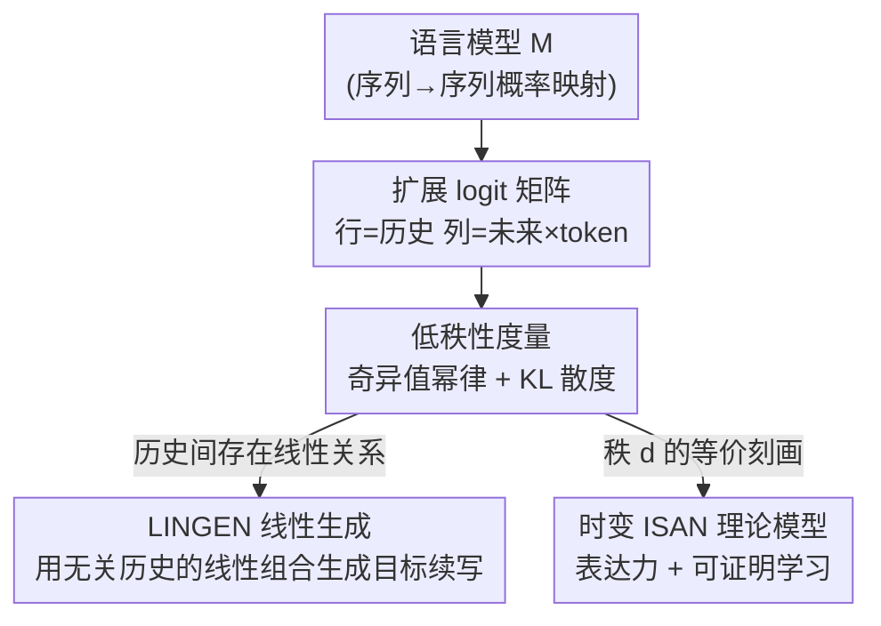

# Sequences of Logits Reveal the Low Rank Structure of Language Models

**会议**: ICLR 2026  
**OpenReview**: [https://openreview.net/forum?id=gdZ6J5hZzF](https://openreview.net/forum?id=gdZ6J5hZzF)  
**代码**: 待确认  
**领域**: 可解释性 / 语言模型理论  
**关键词**: 低秩结构, 扩展 logit 矩阵, 线性表示, ISAN, 模型可解释性

## 一句话总结
本文提出以「扩展 logit 矩阵」作为模型无关的研究对象，实证发现现代自回归 LLM 的 logit 矩阵在长序列尺度上仍近似低秩（奇异值幂律指数 $\alpha$ 略大于 $1/2$），并据此设计了只用无关/无意义历史的线性组合就能生成目标续写的 LINGEN 程序，最后用「时变 ISAN」给出了与该低秩性等价的可证明学习理论。

## 研究背景与动机

**领域现状**：理解语言的内在结构是计算机科学的长期目标，从 HMM、有限状态自动机到形式文法都在尝试给语言建立数学抽象。LLM 时代，研究者希望找到既能对真实部署模型做可检验预测、又数学上可处理的「简单通用抽象」，已有的尝试包括各种简化 Transformer、低深度电路等。

**现有痛点**：这些抽象大多受限于它能表示的模型类型（如某个深度的 Transformer）或某类任务（如 RL 微调），很难对现代 LLM 的结构与行为做精确预测。与此同时，业界关于「LLM 内在低维结构」的信念长期停留在 folklore 层面，缺乏一个统一、可度量、能跨架构验证的载体。

**核心矛盾**：以往关于低维性的硬证据主要来自 **softmax bottleneck**——由于 unembedding 矩阵的结构，给定历史 $h$ 后单个下一个 token $y$ 的概率正比于 $\exp(\langle\phi(h),\psi(y)\rangle)$，因而单 token logit 矩阵低秩。但这只能推理「未来一个 token」，无法说明模型在**更长序列**上是否仍保有低维结构。

**本文目标**：把低维性从单 token 推广到任意长序列，得到一个①模型无关、②可在真实 LLM 上度量、③能支撑可证明保证的统一框架，并验证它能否带来可观测的新现象与新理论。

**切入角度**：作者把语言模型纯粹看作「序列到序列的概率映射」，绕开架构细节，定义一个以「历史」为行、「未来×token」为列的矩阵，把 $\log\Pr_M[f\mid h]$ 是否能写成 $\langle\phi(h),\psi(f)\rangle$ 这个问题，等价转化为「该矩阵是否近似低秩」。

**核心 idea**：用**扩展 logit 矩阵的近似秩**作为度量语言模型低维结构的通用工具——既可在真实模型上实测，又能反过来被利用于生成，还等价于一个可学习的生成模型。

## 方法详解

### 整体框架

本文不是训练某个新模型，而是围绕一个**新的研究对象**展开「定义 → 实证 → 利用 → 理论」四步闭环。先把语言模型 $M$ 抽象成序列概率映射，构造扩展 logit 矩阵 $L_M(H,F)$；再实测它在不断放大 $H,F$ 时的低秩程度（奇异值衰减 + KL 散度两种度量）；接着利用低秩带来的「历史之间的线性关系」设计 LINGEN 生成程序；最后证明「低 logit 秩」与「时变 ISAN 生成模型」等价，并给出可证明的学习算法。

### 关键设计

**1. 扩展 logit 矩阵：把单 token 的低维性推广到长序列**

softmax bottleneck 只刻画了「下一个 token」的低维性，作者的核心洞察是这种低维性在**更长 token 序列**上依然存在。为此定义扩展 logit 矩阵 $L_M(H,F)$：行由历史集合 $H\subset\Sigma^\star$ 索引，列由 $F\times\Sigma$ 索引（$F$ 是未来集合，$\Sigma$ 是 token 表）。对历史 $h$ 与 $(f,z)$，矩阵元为均值中心化 logit

$$L_M(H,F)_{(h,(f,z))} = L_M[z\mid h\circ f] = \log\Pr_M[z\mid h\circ f] - \frac{1}{|\Sigma|}\sum_{z'\in\Sigma}\log\Pr_M[z'\mid h\circ f],$$

其中 $\circ$ 表示拼接。直观上，取 $F=\Sigma^{\le T}$ 时，单行 $L_M(\{h\},F)$ 就包含了从 $h$ 采样长度至多 $T$ 的任意续写所需的全部信息（因为 $\log\Pr[f\mid h]$ 可拆成逐 token 条件 log 概率之和）。关键命题在于：$\log\Pr_M[f\mid h]\approx\langle\phi(h),\psi(f)\rangle$ **等价于**「扩展 logit 矩阵近似低秩」。完整矩阵指数级大无法构造，但可以采子矩阵 $L_{M,k}(H,F)$——对每个未来 $f$ 只保留其后概率最高的 $k$ 个 token 对应列（实验取 $k=50$），从而把可观测的低秩性放到可计算的尺度上。

**2. 双重低秩度量：奇异值幂律与 KL 散度，并锚定 $\alpha=1/2$ 相变**

为了把「近似低秩」量化，作者用两种互补度量。**度量一**直接看奇异值衰减：矩阵第 $i$ 个奇异值近似满足幂律 $\sigma_i\approx C\cdot i^{-\alpha}$。实测多数模型的指数 $\alpha$ 略大于 $1/2$。$\alpha=1/2$ 是一个**相变点**：若 $\alpha>1/2$，则对任意常数 $\varepsilon$ 存在只依赖 $\varepsilon$ 的常数秩 $r_\varepsilon$ 即可 $\varepsilon$-逼近；若 $\alpha<1/2$，则需要与维度线性的秩。由于全矩阵维度随序列长度指数增长，$\alpha>1/2$ 意味着**常数秩**就够，这是低秩成立的关键。**度量二**给出概率解释：任意矩阵都能对每个 $(h,f)$ 通过 softmax 诱导一个下一 token 分布，于是定义平均 KL 散度

$$D^{\mathrm{avg}}_{\mathrm{KL}}(L,A) = \frac{1}{|H||F|}\sum_{h\in H,\,f\in F} D_{\mathrm{KL}}\big(\mathrm{softmax}(L_{h,f})\,\|\,\mathrm{softmax}(A_{h,f})\big),$$

并有界 $D^{\mathrm{avg}}_{\mathrm{KL}}(L_M(H,F),A)\le \frac{1}{|H||F|}\|L_M(H,F)-A\|_F^2$。把它与奇异值幂律相结合，可预测「秩 $r$ 逼近的平均 KL 至少按幂律衰减」，实验吻合，且幂律在矩阵放大（甚至外推到指数大）时保持一致。一个有趣发现：低秩并非天生——OLMo-1b 的「Step 0」未训练 checkpoint 反而 $\alpha\approx0.374$（不低秩），低秩结构在预训练**早期迅速涌现**，随后缓慢演化到最终值。

**3. LINGEN：用无关/无意义历史的线性组合生成目标续写**

低秩矩阵必有非平凡的行核——存在大量 $v\in\mathbb{R}^H$ 使 $v^\top L_M(H,F)\approx 0$，这些 $v$ 编码了**历史之间的线性关系**（类似 $\text{boy}-\text{girl}\approx\text{king}-\text{queen}$ 的推广）。作者实证这种关系会**跨未来集合**乃至**跨模型**迁移：把 $F$ 的 token 随机置换得到「无意义未来」$F_{\text{nonsense}}$，再取各自的秩 $r$ 最优逼近 $A,A_{\text{nonsense}}$，二者列空间的主夹角余弦大量接近 1（远高于随机子空间基线），说明线性关系内蕴于历史本身、与未来无关。基于此，LINGEN 把目标历史 $h_{\text{targ}}$ 近似写成历史集合 $H$ 的线性组合 $L_M(h_{\text{targ}},F)\approx v^\top L_M(H,F)$，然后**只查询 $H$ 中的历史**来生成续写：每步 $t$ 已生成 $z_{1:t-1}$ 后，对每个 $h$ 算 $L_{h,t}=L_M[\cdot\mid h\circ z_{1:t-1}]$，再按

$$z_t \sim \mathrm{softmax}\Big(\sum_{h\in H} v_h\cdot L_{h,t}\Big)$$

采样。系数 $v$ 通过把 $L_M(H,F)$ 的行回归到 $L_M(\{h_{\text{targ}}\},F)$ 得到。两种设定下它都跑通：In-distribution 目标（$H$、$h_{\text{targ}}$ 均来自 wiki）和 OOD 目标（用 $H_{\text{nonsense}}$、$F_{\text{nonsense}}$）。与只用单 token（空未来 $L_M(H,\{\emptyset\})$）的变体相比，后者只在首 token 表现好、后续 token 明显变差——这正凸显了**扩展** logit 矩阵相对单 token 矩阵的价值。作者指出该程序有绕过输入过滤器、制造越狱的潜在安全含义。

**4. 时变 ISAN：低 logit 秩的等价生成模型与可证明学习**

为给实证发现一个可处理的理论底座，作者定义**低 logit 秩**：若对任意 $H,F$ 都有 $\operatorname{rank}L_M(H,F)\le d$，则称模型 logit 秩为 $d$。并引入 **时变 ISAN**——一个带 softmax 非线性的线性动力系统：由矩阵 $A_{z,t}\in\mathbb{R}^{d\times d}$、$B_t\in\mathbb{R}^{\Sigma\times d}$ 与初始状态 $x_0$ 指定，$z_t\sim\mathrm{softmax}(B_t x_{t-1})$，再按当前采样 token 更新隐状态 $x_t=A_{z_t,t}x_{t-1}$。它把 Foerster 等人的 ISAN 推广为每步动态可变。核心定理（Thm 4.3）：$M$ 可表示为隐维 $d$ 的时变 ISAN **当且仅当** 对所有 $t\le T$ 有 $\operatorname{rank}L_M(\Sigma^t,\Sigma^{\le T-t})\le d$——即低 logit 秩与时变 ISAN 严格等价。表达力上，ISAN 能表示线性 SSM 层、copying、noisy parity。由于 noisy parity 在样本学习意义下计算困难，从样本学 ISAN 最坏情形不可行；但作者证明在 **logit 查询模型**下（可查任意历史的下一 token logit，贴近真实模型窃取场景），存在 $\mathrm{poly}(d,|\Sigma|,T,1/\epsilon)$ 时间与查询的算法，学到一个在 TV 距离上 $\mathbb{E}[D_{\mathrm{TV}}(M,M')]\le\epsilon$ 的时变 ISAN（Thm 4.4）。

## 实验关键数据

### 主实验

| 实验 | 模型/设置 | 关键量 | 结果 |
|------|-----------|--------|------|
| 奇异值衰减 | OLMo-7b，wiki | 幂律指数 $\alpha$ | $\alpha\approx0.536$（$>1/2$，常数秩可逼近）|
| KL 低秩逼近 | OLMo-7b，秩 5–500 | 平均 KL 随秩衰减 | 幂律，且 $\{2,4,8,16\}$ 倍子矩阵幂律一致 |
| 训练演化 | OLMo-1b，Step 0 ckpt | $\alpha$ | $\approx0.374$（未训练时**不**低秩）|
| LINGEN（in-dist）| OLMo-1b，50 目标×5 序列 | 15 位累计 KL | LINGEN total $=2.85$ |

### LINGEN 与基线对比（按累计 KL，越小越好）

| 方法 | In-distribution（Fig 6） | OOD/nonsense（Fig 1b） | 说明 |
|------|--------------------------|-------------------------|------|
| **LINGEN** | **2.85** | **4.95** | 用历史线性组合生成 |
| 单 token 变体 | 10.79 | 14.41 | 只用空未来 $L_M(H,\{\emptyset\})$，首 token 好、后续差 |
| 短历史（长度 5）| 17.77 | 17.56 | 限制上下文窗口 |
| Stage-1 末 ckpt | 6.46 | 6.55 | 较早训练 checkpoint |

### 关键发现
- **低秩是涌现的，不是初始的**：未训练 checkpoint 的 logit 矩阵不低秩（$\alpha<1/2$）且幂律不随尺度保持一致；低秩在预训练早期 KL 显著下降后涌现，再缓升至终值——「为什么早期就涌现」是作者抛出的核心开放问题。
- **幂律对尺度极稳健**：把 $H,F$ 放大（甚至子矩阵差 16 倍）幂律指数几乎不变，支撑「外推到指数大的 $H,F$ 仍低秩」的论断。这种低秩对同维随机矩阵是反常的，也不是单 token 低秩的简单推论。
- **线性关系可迁移**：历史间的线性关系在「真实未来 ↔ 无意义未来」「不同模型之间」都保持（主夹角余弦接近 1），是 LINGEN 能用无关历史生成的根本原因。
- **扩展 vs 单 token**：单 token 变体只在首 token 与 LINGEN 持平，后续 token 大幅落后，证明长序列 logit 矩阵承载了单 token 矩阵没有的信息。

## 亮点与洞察
- **把「低维信念」变成可度量对象**：扩展 logit 矩阵是模型无关的，任何能给出 logit 的自回归 LM 都能上秤，且 $\alpha=1/2$ 相变把「常数秩 vs 线性秩」这一定性差异锚到一个可测指数上，非常干净。
- **同一低秩性贯穿实证与理论**：低 logit 秩既是可实测的现象，又恰好等价于时变 ISAN 这个可学习生成模型（Thm 4.3），让「观察」和「可证明保证」共用一个数学对象，这是本文最「啊哈」之处。
- **用无关历史生成是反直觉的强证据**：LINGEN 只查询与目标无关甚至无意义的序列就能生成连贯且贴近真分布的续写，把抽象的「行核/线性关系」落到了可感知的生成行为上。
- **可迁移的 trick**：把模型当序列概率映射、用 logit 子矩阵 + 奇异值/KL 双度量探测低维结构，这套探针可直接迁移到任意 LM 的可解释性、模型窃取、安全审计研究。

## 局限与展望
- **LINGEN 仍是 proof-of-concept**：作者自承生成质量、效率离实用尚远，OOD 设定的 KL 明显高于 in-distribution；系数 $v$ 的计算目前仍需查询 $L_M(h_{\text{targ}},F)$（即用到目标），用更弱模型 $M'$ 替代算 $v$ 只是设想，留待未来工作。
- **理论与实证之间有缝**：时变 ISAN 等价的是**精确**低 logit 秩，而真实模型只是**近似**低秩（幂律尾），可证明学习保证针对 ISAN 本身、并非直接保证对真实 LLM 的逼近误差。
- **安全含义未充分验证**：「绕过输入过滤、制造越狱」仅作为潜在含义讨论，没有在真实防御上做端到端攻击评估，存在被夸大的风险（应谨慎看待）。
- **改进方向**：进一步解释「低秩为何在预训练早期涌现」、把跨模型迁移用于真正的弱模型→强模型攻击/对齐探测、以及把低秩外推假设在更大 $H,F$ 上做直接验证。

## 相关工作与启发
- **vs softmax bottleneck（Yang et al., 2017）**：他们刻画的是单 token logit 矩阵的低秩，只能推理一个未来 token；本文把同样的低维性推广到任意长序列的扩展 logit 矩阵，实验也证明扩展矩阵承载了单 token 矩阵缺失的信息。
- **vs 受限架构抽象（简化 Transformer / 低深度电路，Sanford et al. 2024；Merrill & Sabharwal 2023）**：那些框架受限于特定深度或任务、难对真实 LLM 做精确预测；本文的框架模型无关、可在真实模型上实测并外推。
- **vs ISAN（Foerster et al., 2017）**：原 ISAN 被当作可解释的循环架构来研究；本文把它推广为**时变** ISAN，并改用「生成模型/理论代理」视角，证明其与低 logit 秩等价，赋予新的理论动机。
- **vs 模型窃取（Carlini et al., 2024）**：本文的 logit 查询学习设定与实际 API 模型窃取场景同构，把可解释性问题与窃取攻击理论联系起来。

## 评分
- 新颖性: ⭐⭐⭐⭐⭐ 把 softmax bottleneck 干净地推广到长序列，并用一个统一对象贯通实证、生成与可证明理论。
- 实验充分度: ⭐⭐⭐⭐ 多模型/多数据的低秩验证扎实、训练演化分析有洞察，但 LINGEN 与安全含义仍偏概念验证。
- 写作质量: ⭐⭐⭐⭐⭐ 定义清晰、实证与理论衔接自然、相变点的论证简洁有力。
- 价值: ⭐⭐⭐⭐⭐ 为理解、探测、操控 LM 提供了模型无关的低秩通用底座，开放问题指向丰富后续。

<!-- RELATED:START -->

## 相关论文

- [\[ICLR 2026\] Towards Understanding the Nature of Attention with Low-Rank Sparse Decomposition](towards_understanding_the_nature_of_attention_with_low-rank_sparse_decomposition.md)
- [\[ICLR 2026\] Escaping Low-Rank Traps: Interpretable Visual Concept Learning via Implicit Vector Quantization](escaping_low-rank_traps_interpretable_visual_concept_learning_via_implicit_vecto.md)
- [\[ICLR 2026\] Low-Pass Filtering Improves Behavioral Alignment of Vision Models](low-pass_filtering_improves_behavioral_alignment_of_vision_models.md)
- [\[ICLR 2026\] LORE: Jointly Learning the Intrinsic Dimensionality and Relative Similarity Structure from Ordinal Data](lore_jointly_learning_the_intrinsic_dimensionality_and_relative_similarity_struc.md)
- [\[ICLR 2026\] Language Models are Injective and Hence Invertible](language_models_are_injective_and_hence_invertible.md)

<!-- RELATED:END -->
