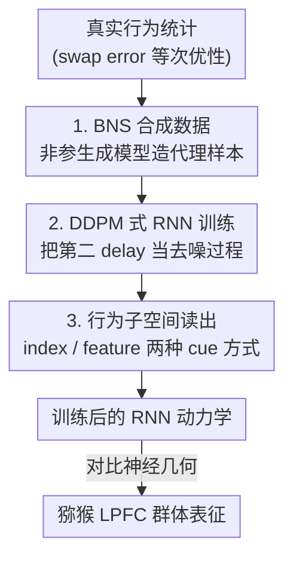

# Setting Up for Failure: Automatic Discovery of the Neural Mechanisms of Cognitive Errors

**会议**: ICLR 2026  
**OpenReview**: [https://openreview.net/forum?id=NGThArVrD3](https://openreview.net/forum?id=NGThArVrD3)  
**领域**: 计算神经科学 / 可解释性  
**关键词**: 循环神经网络, 工作记忆, 扩散模型, swap error, 神经机制发现

## 一句话总结
这篇论文不再训练 RNN 去把认知任务"做对"，而是反过来训练它"犯人类会犯的错"——用一个非参生成模型 BNS 造出带 swap error 的合成行为数据，再用扩散模型（DDPM）式的目标把第二个延迟期当作去噪过程来训练 RNN，从而自动发现支撑视觉工作记忆的神经动力学机制，且其神经几何与猕猴前额叶皮层记录高度吻合。

## 研究背景与动机

**领域现状**：计算神经科学想用行为数据反推支撑认知的神经网络机制。理想做法是把假设写成 RNN（这样能研究动力学）、定量拟合行为（因为关键机制往往藏在响应的细节变异里而非均值里）、并且让拟合过程自动化（避免人工拍脑袋反复改架构）。

**现有痛点**：现有方法没一个三者兼顾。抽象认知模型（drift-diffusion、贝叶斯、符号、LLM 模型）拟合行为很准，但架构太抽象、和 RNN 脱节，没法当作神经动力学假设；神经群体编码模型能把行为和神经响应挂钩，却闭口不谈这些响应背后的网络动力学，而且很少定量拟合、构造也不自动；而 RNN 模型要么手工搭、要么按"任务最优"来训，能给出可测的动力学假设，但几乎只能复现"大体上能干活"的表现，捕捉不到行为的精细模式——一旦想让它复现非平凡行为，往往得塞进各种专门设计或消融，本质又退回成手工搭网络。

**核心矛盾**：要让 RNN 复现人类/动物**带错误的真实行为**，有两个绕不开的障碍。其一，RNN 是数据饥渴的，而行为数据采集极贵，量根本不够训网络。其二，训练目标不对——任务最优训练用 MSE / 交叉熵，只会逼出单峰、近正态的响应；即便显式训练特定分布，moment-matching / score-matching 也只能抓有限几个手挑的低阶矩，扩展不到复杂分布，而且"挑哪些矩重要"本身就很主观。

**本文目标**：造一个**自动**流程，让生物合理的 RNN 直接复现实验里观察到的行为次优性（尤其是多峰响应分布），并以此发现其神经机制。

**切入角度**：作者选视觉工作记忆（VWM）的多物体延迟估计任务做试验台。这个任务的标志性错误是 **swap error**——被试在提示（cue）后错误回忆出干扰物（distractor）的颜色而非目标颜色，从而让响应分布呈现强烈多峰。现有 RNN 完全抓不到 swap error，而能抓到的群体编码模型又不谈电路机制，正好是个理想的缺口。

**核心 idea**：与其优化任务表现，不如把"生成一次行为响应"看成"在欧氏空间里采一个样本"，于是借扩散模型的去噪目标来训练 RNN 复现完整的（含 swap error 的）多峰行为分布；数据不够就用生成模型 BNS 造代理数据补上。

## 方法详解

### 整体框架

整篇方法可以概括为一句话：**用合成行为数据 + 扩散式训练，把一个生物合理的 RNN 训练成"会犯 swap error 的被试"，再去检验它内部长出的神经几何是否和真实大脑一致。**

具体地，先用非参生成模型 BNS 按设定的 swap 规律采出合成行为样本（含目标颜色与干扰物颜色构成的多峰分布）；把试次内"提示之后的第二个延迟期"等同于 DDPM 的去噪步序列，让 RNN 在这段时间里一步步把噪声去掉、最终在二维行为子空间里采出一个颜色估计；训练完成后，把网络在行为零空间里的记忆表征和猕猴外侧前额叶皮层（LPFC）的群体几何作对比。整个流程是单向串行的 pipeline：

### 关键设计

**1. BNS 合成数据：用非参生成模型补上行为数据稀缺的窟窿**

RNN 数据饥渴，但人类/动物行为数据采集成本高得离谱，规模远不够训网络——这是直接拟合行为的第一道坎。作者的解法是不直接拟合真实数据集，而是用 **BNS（Bayesian Non-parametric model of Swap errors）** 这个描述性生成模型来批量制造合成行为数据。BNS 把 swap error 的概率建模成"干扰物的探测特征（probe feature，可视化为位置）与被提示物体在特征空间里距离"的函数：距离越近、越容易发生 swap。关键在于，只要生成模型足够灵活，合成数据就能精确刻画研究者想要的统计特征和次优性，再喂给 RNN 当训练数据。作者特意手调 BNS，造出三类对照训练数据：i) 不产生 swap error，ii) 对任意干扰物都产生相同频率的 swap，iii) probe 越相似 swap 越频繁（与大量实验证据一致）。后面会看到，只有第三类——最贴近真实行为的合成数据——才能让 RNN 长出和猕猴一致的神经几何，哪怕在非 swap 试次上也是如此。这一步是整个"自动发现"的前提：把生成模型的灵活性转化成训练信号的丰富度。

**2. DDPM 式 RNN 训练：把第二延迟期当作去噪过程，从而生成多峰行为分布**

任务最优的 MSE 训练只会逼出单峰响应，moment-matching 又只抓有限几个矩、扩展不到复杂分布——这是第二道坎。作者把"产生一次行为响应"重新框定为"在 $\mathbb{R}^2$ 里生成一个样本"，于是引入扩散模型 DDPM 的训练目标。DDPM 通过让网络学习撤销一个固定加噪过程来生成样本，前向加噪为 $q(x_{\tau-1}\mid x_\tau)=\mathcal{N}(x_\tau;\sqrt{1-\beta_\tau}\,x_\tau,\beta_\tau I)$，训练时最大化逐步去噪的层级 ELBO，并可化简成一串平方距离而非 KL 散度。本文的巧妙之处是**把试次内的时间步等同于 DDPM 去噪的时间步**：只在提示偏移（cue offset）之后的 $T$ 个时间步（即第二个延迟期）施加 DDPM 准则，且只作用在行为子空间输出 $x$ 上、而不是完整活动向量 $r$。每个试次的目标分布是 $\mathbb{R}^2$ 里两个高斯的混合，模态均值由刺激颜色（在颜色圆上）决定、权重由 BNS 预测给出；把这个最终行为样本反复加噪就得到第二延迟期的目标轨迹。转移核的均值直接由离散化的连续无噪 RNN 动力学投影到行为子空间得到：

$$\hat{\mu}_{\theta_r}(r_t,t)=W_x\left[\left(1-\frac{dt}{\lambda}\right)r_t+\frac{dt}{\lambda}F(r_t,s_t;\theta_r)\right]$$

由于去噪只发生在第二延迟期、此时感官输入 $s_t$ 为空，关于全部刺激（也就是目标分布）的信息只能存在行为零空间活动 $m_t$ 里——这正是后面分析记忆表征的着力点。因为去噪依赖前面时间步、训练必须按序模拟整条试次轨迹，作者用 **teacher forcing** 保证加噪样本 $x_\tau$ 始终落在加噪过程的边际分布 $q(x_\tau\mid x_T)$ 内。和过去把扩散模型塞进皮层 RNN 的工作相比，"只在 cue 之后施加、且只作用在输出子空间、目标还是逐试次特定"这几点是关键差异。

**3. 行为子空间读出与两种 cue 方式：既读得出颜色估计，又能对记忆几何做预测**

要把 RNN 内部活动解读成"它回忆出的颜色"，并进一步和神经数据对齐，就需要一套固定的读出结构。RNN 模拟 $n$ 个稠密连接的皮层锥体神经元，每个神经元通过树突树（dendritic tree）架构整合感官群体和其它神经元的输入，整体服从带泄漏的连续动力学 $\Lambda\dot{r}=-r+F(r,s,\eta;\theta_r)$。网络发放率经一个固定正交投影 $x=G(r)=W_x r,\ W_x\in\mathbb{R}^{2\times n}$（满足 $W_x^\top W_x=I$）投到二维平面，于是活动被劈成两个固定正交子空间：**行为子空间** $x=W_x r$（网络输出）和**行为零空间** $m=W_x^\perp r$（携带记忆但不直接输出）。最终时间步输出的辐角 $\arctan([W_x r_T]_1/[W_x r_T]_2)$ 被解读为该试次回忆的颜色。在 cue 方式上作者设计了两种网络：**index-cued** 网络只把刺激颜色作为有序标量、用索引提示，是最贴近猕猴真实任务的版本，用来匹配行为统计、复现生物现象；**feature-cued** 网络则把刺激编码成位置与颜色的合取、用连续位置来加载与提示物体，物体顺序不变，迫使网络存储两个特征间的合取关系，从而能对"可变 probe feature 的神经表征"做出可实验检验的预测。两种 cue 共用同一套子空间读出，是把"行为复现"延伸到"机制预测"的桥梁。

### 损失函数 / 训练策略

核心训练目标是正则化后的 DDPM 准则（仅施于行为子空间 $x$，作用于 cue offset 后的 $T$ 个去噪步）。训练循环（算法 1）为：生成刺激集并选定被提示物体 → 用 BNS 从目标行为分布采出 $x^*_T$ 并加噪得到 $x^*_{0:T-1}$ → 从 $\mathcal{N}(0,\sigma_r^2 I)$ 初始化活动 → 用带噪离散泄漏动力学跑完前刺激/刺激/延迟/提示各阶段到 cue offset 的 $r_0$ → 在第二延迟期每一步施加 teacher forcing、按式 (3) 算转移核均值并加调度噪声 → 在正则 DDPM 准则上更新，直至收敛。作为对照，若要训练任务最优网络，则只需对二维估计与目标颜色之间的差异施加 MSE 损失即可。

## 实验关键数据

### 主实验

试验台是两物体延迟估计任务（产生 swap error 的最小 VWM 任务），并与 Panichello & Buschman (2021) 的两只猕猴 LPFC 数据对比（约 4,769 / 3,943 个回溯提示试次，swap 率约 10%）。

| 对比项 | 任务最优 RNN | 本文 DDPM 式 RNN（含距离依赖 swap） | 结论 |
|--------|--------------|-------------------------------------|------|
| 响应分布 | 单峰，无 swap | 多峰，能复现目标 swap 率随 probe 距离变化 | 仅本文方法产生多峰 swap |
| 提示前后平面对齐（cosine 相似度） | 提示期不出现快速对齐 | 提示期急升并在第二延迟期持续高位 | 匹配猕猴几何 |
| 事后强行诱发 swap（缩小 probe 间距 / 加大过程噪声） | 诱不出第二个模态 | 直接训练即自带 swap | 任务最优网络只能靠主观消融 |

### 消融实验

| 训练数据/方式 | 神经几何是否匹配生物 | 说明 |
|---------------|----------------------|------|
| DDPM 式 + 距离依赖 swap（5–10%） | 匹配 | index-cued 网络复现提示期平面对齐的急升与维持 |
| DDPM 式 + 无 swap 目标分布 | 不匹配 | 缺失提示期表征的快速对齐 |
| DDPM 式 + probe 无关的平坦 swap 率 | 不匹配 | feature-cued 下抓不到正确的对齐模式 |
| 任务最优（MSE） | 不匹配 | 无法复现刺激表征在提示前后的完整对齐 |

### 关键发现

- **"犯对错误"才长出对的机制**：只有当训练数据带有与真实一致的、随 probe 距离变化的 swap 率时，RNN 的记忆表征才匹配猕猴 LPFC；无 swap 或平坦 swap 都不行。这说明行为的次优性细节本身携带了关于神经机制的信息。
- **新机制预测**：作者预测物理上更近、更易 swap 的干扰物，会在提示前带来更高的颜色表征对齐——即逐试次分析应发现 swap error 更常发生在提示前颜色表征对齐更高时。
- **misselection 几何**：复用 Alleman et al. (2024) 的线性解码分析，网络中 swap error 同样发生在第二延迟期（item misselection），而非记忆编码阶段的误绑定；feature-cued 网络还呈现把颜色绑定到角色（target/distractor）的"report 子空间"双环几何，疑似一种环面结构。

## 亮点与洞察

- **反转范式**：经典做法是训练网络把任务做到最优，本文反过来训练网络复现完整行为分布（含错误），从而绕开人工迭代消融——这是从"setting up for success"到"setting up for failure"的范式反转，标题点睛。
- **DDPM 与 RNN 的时间对齐**：把试次内时间步等同于扩散去噪步、且只在 cue 后施加、只作用于输出子空间，是一个非常干净的工程映射，把"生成多峰分布"这件难事直接交给成熟的扩散框架。
- **子空间分工**：固定正交投影把活动劈成行为子空间（输出）与行为零空间（记忆），让"输出去噪"和"记忆维持"互不干扰，又使记忆几何可被直接拿来和神经数据比对，这个表示设计可迁移到其它需要"边维持边读出"的认知任务。
- **合成数据闭环**：用描述性生成模型造代理数据训练机制模型，再把机制模型的行为反过来用同一生成模型拟合来量化成功度，形成自洽闭环。

## 局限与展望

- **依赖生成模型**：方法需要一个能产生训练数据的行为生成模型，并非所有任务都有；不过作者指出许多成熟范式已有此类模型，且描述性建模的进展使"抓住行为的统计结构"日益可行。
- **预测待验证**：关于"提示前对齐更高 → 更易 swap"等神经预测目前只是模型推断，尚需实验检验。
- **试验台单一**：核心结论建立在两物体 VWM 任务上；作者已在多感觉整合（cue combination）任务上演示了方法的灵活性，但尚未据此生成机制假设，留待后续。
- **架构选择的生物合理性**：树突树架构与固定正交输出投影是出于"够表达 + 生物合理"的折中，其具体选择对结论的稳健性影响未充分展开。

## 相关工作与启发

- **vs 任务最优 RNN（Yang et al. 2019; Driscoll et al. 2022）**：它们训练网络把多物体 VWM 做对，但抓不到多物体特有的行为模式、更产生不了 swap error 的多峰分布；本文直接训练网络犯 swap，且事后证明任务最优网络靠加噪/缩间距等主观消融也诱不出真正的 swap 几何。
- **vs 群体编码模型（Schneegans & Bays 2017）**：它们能刻画 swap error，却不对神经电路动力学作预测；本文产出的是可研究动力学的 RNN，补上了"机制"这一环。
- **vs moment/score-matching 训练（Echeveste et al. 2020; Chen et al. 2023）**：它们只能匹配有限个手挑的矩、扩展不到复杂分布，且"挑哪些矩"很主观；本文用 DDPM 目标整体拟合连续分布。
- **vs tiny RNN 拟合行为（Ji-An et al. 2025; Xue et al. 2024）**：理念最接近（直接拟合行为），但那些小网络只处理离散/类别选择、用简单极大似然就够；本文给出对所有连续维度整体拟合的原则化方法。

## 评分
- 新颖性: ⭐⭐⭐⭐⭐ 把"训练网络复现错误"与扩散式训练结合，开辟自动机制发现的新范式
- 实验充分度: ⭐⭐⭐⭐ 与真实猕猴数据多角度对照、对照组完整，但仅单一 VWM 试验台
- 写作质量: ⭐⭐⭐⭐ 动机与机制叙述清晰，部分神经几何分析较依赖附录
- 价值: ⭐⭐⭐⭐⭐ 为"用行为反推神经机制"提供了可扩展、可验证的通用方法论

<!-- RELATED:START -->

## 相关论文

- [\[ACL 2025\] Position-aware Automatic Circuit Discovery](../../ACL2025/interpretability/position-aware_automatic_circuit_discovery.md)
- [\[ICLR 2026\] Linear Mechanisms for Spatiotemporal Reasoning in Vision Language Models](linear_mechanisms_for_spatiotemporal_reasoning_in_vision_language_models.md)
- [\[ICLR 2026\] Mixture of Cognitive Reasoners: Modular Reasoning with Brain-Like Specialization](mixture_of_cognitive_reasoners_modular_reasoning_with_brain-like_specialization.md)
- [\[ICLR 2026\] Mixing Mechanisms: How Language Models Retrieve Bound Entities In-Context](mixing_mechanisms_how_language_models_retrieve_bound_entities_in-context.md)
- [\[ICLR 2026\] Provably Explaining Neural Additive Models](provably_explaining_neural_additive_models.md)

<!-- RELATED:END -->
