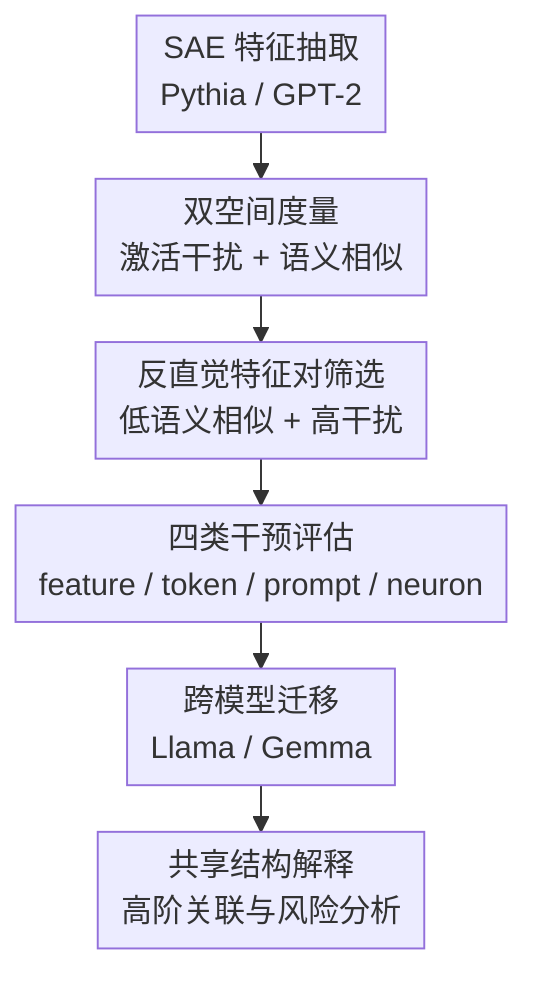

# Signal in the Noise: Polysemantic Interference Transfers and Predicts Cross-Model Influence

**会议**: ICLR 2026  
**OpenReview**: [https://openreview.net/forum?id=tYeuz2LwVU](https://openreview.net/forum?id=tYeuz2LwVU)  
**代码**: 作者称已公开代码与数据，仓库链接以论文页面为准  
**领域**: 可解释性 / 机制解释  
**关键词**: 多义性干扰、稀疏自编码器、表示空间、模型干预、跨模型迁移  

## 一句话总结
本文用 SAE 描出小语言模型中的多义性干扰结构，发现一些语义上看似无关但在激活空间相互干扰的特征可以稳定改变目标语义的 next-token 分布，并且这些干预信号还能迁移到更大的指令模型上，说明 polysemanticity 不是纯随机噪声，而可能包含跨模型共享的潜在结构。

## 研究背景与动机

**领域现状**：机制解释里一个核心问题是，语言模型内部的神经元和方向往往不是“一 neuron 一概念”，而是在有限维激活空间里叠加编码大量特征。Anthropic 的 superposition 和后续 SAE 工作给出了一个常用视角：模型用过完备稀疏特征来解释激活，单个神经元或激活方向可以同时承载多个语义，SAE 则尝试把这些叠加的特征拆成更接近人类可读的 feature。

**现有痛点**：已有工作多把 polysemanticity 当作解释困难：它让人很难说清某个神经元到底代表什么，也让特征编辑、unlearning、steering 等操作更容易串扰。但这篇论文关注另一个更少被系统研究的问题：如果多个语义无关的特征在模型激活空间里共享方向或神经元，那么这种“串扰”本身是否会变成可利用的行为控制入口？

**核心矛盾**：人类语义空间里的“不相关”并不等于模型激活空间里的“独立”。两个 SAE 特征的自然语言解释可能几乎正交，比如一个像地点、另一个像编程数据类型；但只要它们在模型的某层 decoder direction 或相关神经元上相互接近，操纵其中一个就可能把模型输出推向另一个目标语义。也就是说，模型的内部几何可能保留着一套不完全符合人类直觉的高阶关联结构。

**本文目标**：作者想回答三个问题：第一，操纵一个与目标语义无关但激活空间中有干扰的特征，是否真的能让输出更接近目标特征；第二，神经元的多义程度是否会预测它被干预时造成的行为变化；第三，小模型中发现的干扰结构，能否迁移到 Llama、Gemma 这类更大的黑盒或半黑盒指令模型。

**切入角度**：论文选择 Pythia-70M 和 GPT-2-Small 作为结构测量对象，因为 Neuronpedia 为它们提供了比较完整的 SAE。作者先在这两个小模型里建立“语义相似度低、激活干扰高”的特征对，再把这些特征对蒸馏成 feature steering、token-gradient steering、prompt injection 和 neuron manipulation 四类干预。

**核心 idea**：不要只把 polysemanticity 看作解释噪声，而是把“语义不相关但激活相互干扰”的特征对当作信号；这些信号既能预测小模型内部干预效果，也能转化为跨模型、甚至黑盒场景下的行为影响线索。

## 方法详解

### 整体框架

本文的方法不是提出一个新模型，而是构建一套从 SAE 特征拓扑到模型行为干预的分析 pipeline。它先在 Pythia-70M 和 GPT-2-Small 中抽取 SAE 特征，分别估计特征之间的激活空间干扰 $I_\ell(i,j)$ 与自然语言语义相似度 $S(i,j)$；随后筛选出“语义相似度低但干扰高”的特征对，并用不同干预方式测量模型 next-token 分布是否朝目标特征移动；最后把两个小模型中共享的干扰模式转化为 token 或 prompt 信号，测试其在 Llama-3.1 和 Gemma-2 上的可迁移性。

整套流程的关键在于同时测两个空间：一个是模型自己的 activation space，另一个是用特征解释文本近似的人类 symbolic manifold。只有当一对特征在后者中不相近、在前者中却相互接近时，它才成为本文真正关心的 polysemantic interference 信号。

### 关键设计

**1. 双空间度量：把“语义无关”和“激活干扰”分开量化**

论文首先用 Neuronpedia 的 SAE 表征小模型的激活结构。对第 $\ell$ 层的 SAE 特征 $f_{i,\ell}$，作者把 SAE decoder 投影回模型激活空间得到方向 $d_{i,\ell}\in A_\ell$，再归一化为 $\hat d_{i,\ell}$。两个特征的激活干扰定义为它们在激活空间方向上的余弦相似度：$I_\ell(i,j)=\cos(\hat d_{i,\ell},\hat d_{j,\ell})$。这个值越大，说明两个 SAE 特征虽然可被解释成不同概念，但在模型内部使用了更相近的方向。

为了避免把“本来就语义相近”的特征误判为干扰，作者又用 GPT-4o-mini 生成的 SAE feature gloss，并用 text-embedding-3-large 编码这些 gloss，近似人类符号语义空间 $M$。两个特征的表层语义相似度定义为 $S(i,j)=\cos(m_i,m_j)$。后续筛选会要求 $S(i,j)$ 低于阈值，同时 $I_\ell(i,j)$ 落入不同干扰区间。这样做的价值在于把“看起来相关”与“内部耦合”拆开：真正有意思的不是地点特征影响地点特征，而是地点特征和编程、法律、统计这类表层无关特征之间出现可复现的内部耦合。

**2. 语义粒度对齐：用聚类避免 SAE 特征过细带来的假差异**

SAE 特征并不总是在同一语义粒度上分解。有的神经元可能被拆成“狗、猫、汽车”这样的粗粒度概念，有的则被拆成不同狗品种或某个词缀模式。如果直接逐 feature 比较，很多“无关”其实只是解释粒度不一致造成的。为缓解这个问题，作者对每层 SAE 特征的解释文本做 agglomerative clustering，并在 $0.40,0.30,0.20,0.15$ 四个语义相似度阈值下重复实验。

这个设计让后续干预更像是在比较“高层语义簇之间的干扰”，而不是被 SAE 的任意切分方式牵着走。论文还报告了支持性统计：在代表层中，大多数特征对的激活干扰都很低，例如 Pythia 示例层中 $99.8\%$ 的干扰值低于 $0.4$；因此，高干扰低语义相似的特征对不是普通噪声中的随机样本，而是从稀有但结构化的耦合关系里筛出来的。

**3. 四类干预：从白盒 feature steering 到黑盒 prompt injection 逐步降低访问要求**

作者设计了四种干预焦点。第一种是 feature-direction steering：直接沿干扰特征的 SAE decoder direction 加入 steering vector，看目标特征相关 token 的预测概率是否上升。第二种是 token-gradient steering：取干扰特征 top-activating text 中最强激活 token，计算该 token 对某层激活的梯度方向，再用这个方向进行 steering。第三种是 prompt injection：把干扰特征的高激活文本片段放到 prompt 前面，不直接访问模型内部。第四种是 neuron intervention：按神经元连接到多少个聚合特征来定义多义程度，对不同多义度神经元做放大或抑制。

这四种干预形成了一个访问权限梯度。feature steering 最依赖目标模型的 SAE，解释性最强但可扩展性弱；token-gradient steering 效果更强，但仍需要内部梯度或激活访问；prompt injection 最接近黑盒使用场景，效果弱一些却更现实；neuron intervention 则用来回答“哪些内部部位更脆弱”。这种设计让论文不仅证明 polysemantic interference 能影响输出，还能区分它在不同干预接口下的强弱和可迁移性。

**4. 统一行为指标：用 next-token 分布朝目标特征的移动衡量干预效果**

为了量化“输出是否更接近目标特征”，作者没有只看某个单词是否进入 top-k，而是为目标 SAE 特征 $f$ 构造一个相关 token 集 $T_f$，其中包含激活值超过最高激活值 $0.8$ 倍的 tokens。给定干预前后的输出分布 $O$ 和 $\tilde O$，主指标是 weighted cosine similarity：

$$
c(O,T_f)=\sum_{t\in V}O(t)\cdot \max_{\bar t\in T_f}\cos(E_t,E_{\bar t}).
$$

干预效果写成相对变化 $\Delta c=\frac{c(\tilde O,T_f)-c(O,T_f)}{c(O,T_f)}$。它衡量整个 next-token 分布是否语义上更靠近目标特征，而不只看完全命中的 token。作者还用 weighted overlap $w(O,T_f)=\sum_{t\in T_f}O(t)$ 做替代指标，专门捕捉概率质量是否直接落到目标 token 集上。两套指标配合使用很重要：prompt injection 在 weighted cosine 上变化较温和，但在 weighted overlap 上可出现 $10\times$ 到 $1000\times$ 的增长，说明它可能把概率集中到少数最相关 token 上。

### 一个完整示例

可以把论文的逻辑想成一个“用无关词暗中推动地点词”的例子。假设目标特征是“地点”，测试句是 “In the next weekend we will go to”。在小模型 SAE 中，作者可能发现某个看似与地点无关的干扰特征，例如“数据类型 / 编程定义”或“placement 相关表达”，与地点特征在激活空间中有较高干扰，但它们的 gloss embedding 相似度很低。

在 feature steering 版本里，作者沿这个干扰特征的 SAE 方向加一个缩放后的向量，观察 Paris、Tokyo、London 等地点 token 的概率是否上升。在 prompt injection 版本里，则把干扰特征的高激活片段，比如类似 “placement from placement” 的文本，前置到原 prompt 前面。论文表格中的案例显示，这类片段可以让 Paris 等地点 token 进入或提高 top prediction，而下降的往往是 another、H、K 等原本更普通或无关的候选。关键点在于，干预文本本身不需要直接写“Paris”或“location”，它只是利用了模型内部已经存在的多义干扰通道。

### 损失函数 / 训练策略

本文没有训练新的语言模型，主要使用已有 SAE、已有小模型和已有大模型做测量与干预。SAE 的基本形式是把某层激活 $a\in\mathbb{R}^{d_{embed}}$ 编码到稀疏高维特征 $f\in\mathbb{R}^{d_{sae}}$，再重构为 $\bar a$：$f=Act(W_{enc}a+b_{enc})$，$\bar a=W_{dec}f+b_{dec}$。训练目标由重构误差和稀疏正则组成：

$$
L=\|a-\bar a\|_2^2+\lambda\sum_i f_i\|W_{dec[:,i]}\|_2.
$$

干预时，作者对 steering scale 做粗搜索，范围大致在 $[-20,20]$ 或一组正向缩放值中选择，目标是在不明显破坏整体输出分布连贯性的前提下最大化目标特征指标。token-gradient steering 的梯度方向来自 top-activating token 对中间层激活的导数；prompt injection 则不需要训练，只需要从高激活文本里截取片段并前置到输入。

## 实验关键数据

### 主实验

论文的主实验可以分成小模型内部干预和跨模型迁移两部分。第一部分证明：只要干扰特征与目标特征在激活空间中耦合，即使二者语义解释相距很远，沿干扰特征做干预也会把输出分布推向目标特征。第二部分证明：从 Pythia-70M 和 GPT-2-Small 中共同识别出的干扰 token 或 prompt 片段，在 Llama-3.1 与 Gemma-2 上也能产生高于随机基线的控制效果。

| 实验设置 | 访问要求 | 主要对象 | 结果趋势 | 解释 |
|----------|----------|----------|----------|------|
| SAE feature-direction steering | 需要目标模型 SAE / 激活访问 | Pythia-70M、GPT-2-Small，补充 Gemma-2-2B | 高干扰、低语义相似的特征能显著提高目标特征相关输出；回归系数为正且 $p<0.001$ | 语义无关不代表激活独立，SAE 方向中的干扰可被行为指标捕捉 |
| Token-gradient steering | 需要梯度或内部激活 | Pythia-70M、GPT-2-Small，迁移到 Llama-3.1-8B | 效果约比 SAE feature steering 大一个数量级，部分情况下原始目标梯度反而弱于干扰梯度 | top-activating token 的梯度比 SAE decoder direction 更贴近可操作的行为方向 |
| Prompt injection | 近似黑盒，仅改输入 | 小模型 + Llama-3.1-8B/70B + Gemma-2-9B | weighted cosine 变化较温和，但 weighted overlap 可放大 $10\times$ 到 $1000\times$ | prompt 片段更容易集中推高少数目标 token，而非整体平滑移动分布 |
| Neuron manipulation | 白盒激活访问 | Pythia-70M、GPT-2-Small | 神经元多义度越高，放大或抑制后输出语义偏移越大；super-neuron 放大效应特别强 | 多义 hub 集中了承载多个特征的干扰风险 |

跨模型 prompt injection 的定量结果显示，部分目标类型确实具有共享干扰结构。下表摘取论文 Table 1 中三个泛化较明显的目标类别，数值表示把目标类型 token 推入 top-30 的成功率；带星号表示相对随机基线显著。

| 目标类型 | 模型 | 原目标提示 | 高干扰 token | 低干扰 token | 随机基线 |
|----------|------|------------|--------------|--------------|----------|
| Locations | Pythia-70M | 65.08%*** | 36.93%** | 32.53% | 35.06% |
| Locations | GPT-2-Small | 44.68%*** | 18.42%*** | 19.08%*** | 16.42% |
| Locations | Llama-3.1-8B-Instruct | 33.84%*** | 20.78%*** | 19.63%* | 18.24% |
| Locations | Llama-3.1-70B-Instruct | 37.23%*** | 28.21%*** | 23.09%** | 24.48% |
| Number | Llama-3.1-8B-Instruct | 55.97%*** | 31.87%* | 32.90%*** | 30.57% |
| Number | Gemma-2-9B-Instruct | 48.42%*** | 29.93%*** | 30.64%*** | 27.16% |
| Science | Llama-3.1-70B-Instruct | 67.26%*** | 48.22%*** | 43.57% | 42.24% |

### 消融实验

| 配置 / 分析项 | 关键指标 | 说明 |
|---------------|----------|------|
| Feature-pair interference 回归 | feature steering 中干扰值系数约 $0.05$ 或 $0.003$，均 $p<0.001$ | 控制语义相似度、baseline 指标和 layer type 后，激活干扰仍能预测干预成功 |
| Token-gradient steering vs feature steering | token-gradient 效果约 $10\times$ 更强 | 梯度方向更接近实际会改变输出概率的方向，也弱化了 SAE feature 任意性的影响 |
| Prompt injection 的替代指标 | weighted overlap 在 GPT-2-Small 上约 $10\times$ 到 $100\times$，在 Pythia-70M 上约 $100\times$ 到 $1000\times$ | prompt 片段不一定让整体语义分布大幅移动，但会显著增加目标 token 集上的概率质量 |
| 高阶语义关联标注 | 459,229 对共享干扰 feature pair 中，仅 27.7% 被至少一个模型标注为有可解释关联 | 大多数共享干扰结构仍不符合显式人类语义直觉 |
| feature-pair paired-choice test | GPT-5-mini 在 3,800 个匹配样本中 64.3% 选择高干扰 pair 更相关，Wilson 95% CI 为 [0.628, 0.658] | 干扰高的 pair 可能确有微弱潜在关联，但效应不强，仍保留反直觉性 |
| HellaSwag 小规模测试 | Llama-3.1-8B baseline accuracy 77.2%，174 个 location 干扰向量中平均准确率下降 2.77% | 一些干预可以保留大体任务性能，同时改变目标场景的 token 倾向 |
| Super-neuron 操纵 | 连接超过 500 个聚合特征的神经元，放大比抑制更容易造成巨大语义偏移 | 多义 hub 可能像语义交通枢纽，放大会沿多条关联边扩散，mask 反而被网络冗余吸收 |

### 关键发现

- 干扰强度在多个设置下都是有效预测因子。即使控制 feature gloss 的语义相似度，高激活干扰仍会带来更强的目标语义移动，说明论文测到的不是“语义相似导致的普通泛化”。
- token-gradient steering 是最强的干预接口。它不直接依赖 SAE decoder direction，而是从高激活 token 的梯度提取可操作方向，因此对输出分布的影响更大。
- prompt injection 虽然较弱，却最值得安全角度关注。它不需要访问模型内部，且一些由小模型抽出的高干扰 token 集在 Llama 与 Gemma 上仍高于随机基线。
- 不是所有语义类别都有强泛化。locations、number、science 的跨模型效果较明显，person、animal、emotion、color、time 的高干扰 token 并不总是明显优于随机，说明可迁移结构是局部存在而不是全局万能钥匙。
- 神经元多义度与脆弱性相关。连接更多聚合特征的神经元被操纵后更容易改变输出语义，尤其 super-neuron 的放大效应揭示了 polysemantic hub 的非对称风险。

## 亮点与洞察

- 这篇论文最有意思的地方，是把“解释噪声”翻转成“可预测信号”。很多 SAE 工作把 polysemanticity 当作需要消除的困难，而本文证明其中的干扰拓扑本身可以预测模型行为变化。
- 双空间测量设计很关键。作者没有只看 SAE direction cosine，也没有只看 feature gloss 相似度，而是专门寻找 $S(i,j)$ 低、$I_\ell(i,j)$ 高的 pair。这让论文能够抓住“人看不相关，模型内部却相关”的核心现象。
- 跨模型迁移的结论很有启发。小模型中的干扰结构能在大模型上部分复现，意味着不同模型可能学到某些共享的表示拓扑，而这些拓扑不完全随架构、规模或 instruction tuning 消失。
- prompt injection 的结果提醒我们，黑盒攻击未必需要显式语义触发词。一个看似无关的片段如果命中内部多义干扰通道，也可能改变目标类别 token 的相对概率。
- neuron-level 分析补上了“干扰集中在哪里”的视角。super-neuron 的非对称现象说明，放大一个多义 hub 与删除它不是镜像操作；模型可能能绕过缺失的 hub，却难以抵消被放大的 hub 信号。

## 局限与展望

- SAE 特征本身不稳定。不同 SAE 维度、训练超参或数据可能学到不同 feature，论文也承认 SAE 是当前 de-facto 工具但不是完美真相源，因此干扰拓扑的可复现性还需要更多 SAE 设置验证。
- 实验主要操纵单层、单个干扰特征。真实攻击或控制可能使用多特征、多层组合，这既可能增强效果，也可能造成更难解释的副作用；本文只是证明结构脆弱性存在。
- 行为指标集中在 immediate next-token probability。next-token 分布移动并不等于复杂任务行为一定改变，虽然 HellaSwag 小实验给出初步信号，但更完整的 downstream evaluation 仍然缺失。
- 跨模型迁移并不均匀。某些类别高干扰 token 与随机基线差距不明显，说明“共享 polysemantic topology”可能只在部分语义类型或模型层级上稳定存在。
- 安全披露需要平衡。作者释放代码和评估脚本，但不释放两小模型共享 polysemantic direction 的完整矩阵，这会降低复现便利性，同时也减少直接武器化风险。

## 相关工作与启发

- **vs Toy Models of Superposition**: Elhage 等工作从理论和 toy model 角度解释为什么模型会把更多特征叠加到有限维空间里；本文把这个问题推进到真实 LLM，并直接测量这种叠加是否带来可利用的行为干预通道。
- **vs Anthropic / Neuronpedia SAE 系列**: SAE 主要用于把模型内部激活拆成可解释特征；本文则进一步使用 SAE feature direction 和 feature gloss 构造干扰拓扑，把解释工具转成行为预测工具。
- **vs activation steering / CAA**: 传统 activation steering 往往用语义对比方向直接推动目标行为；本文的特殊之处在于用“语义不相关但激活干扰”的方向来推动目标语义，控制路径更隐蔽，也更能揭示内部结构。
- **vs jailbreak / prompt injection 工作**: 许多黑盒攻击直接优化或枚举触发 prompt；本文给出一种机制解释来源，说明某些看似无关的 prompt 片段可能通过 polysemantic interference 影响输出，而不是单纯依赖表面语义欺骗。
- **对后续研究的启发**: 防御方可以反过来寻找高多义 hub、跨模型共享干扰 pair 和 prompt 触发片段，把它们作为模型审计指标；解释性研究也可以用这些反直觉 pair 生成关于潜在知识结构的新假设。

## 评分

- 新颖性: ⭐⭐⭐⭐⭐ 论文把 polysemanticity 从解释困难变成可迁移干预信号，问题设定和实验视角都很有辨识度。
- 实验充分度: ⭐⭐⭐⭐☆ 实验覆盖 feature、token、prompt、neuron 四个层级，并做了跨模型验证；但 downstream task 评估还偏小，SAE 稳定性也需要更系统测试。
- 写作质量: ⭐⭐⭐⭐☆ 主线清楚，图和表能支撑核心结论；不足是部分实验细节分散在附录，读者需要来回跳转才能完全复现流程。
- 价值: ⭐⭐⭐⭐⭐ 对机制解释、模型安全和黑盒行为控制都有启发，尤其提醒研究者关注语义直觉之外的共享表示拓扑。

<!-- RELATED:START -->

## 相关论文

- [\[ICLR 2026\] Noise Stability of Transformer Models](noise_stability_of_transformer_models.md)
- [\[ICLR 2026\] Cross-Modal Redundancy and the Geometry of Vision-Language Embeddings](cross-modal_redundancy_and_the_geometry_of_vision-language_embeddings.md)
- [\[ICLR 2026\] Influence Dynamics and Stagewise Data Attribution](influence_dynamics_and_stagewise_data_attribution.md)
- [\[ICLR 2026\] SAE as a Crystal Ball: Interpretable Features Predict Cross-domain Transferability of LLMs without Training](sae_as_a_crystal_ball_interpretable_features_predict_cross-domain_transferabilit.md)
- [\[ICLR 2026\] Exploring Interpretability for Visual Prompt Tuning with Cross-layer Concepts](exploring_interpretability_for_visual_prompt_tuning_with_cross-layer_concepts.md)

<!-- RELATED:END -->
