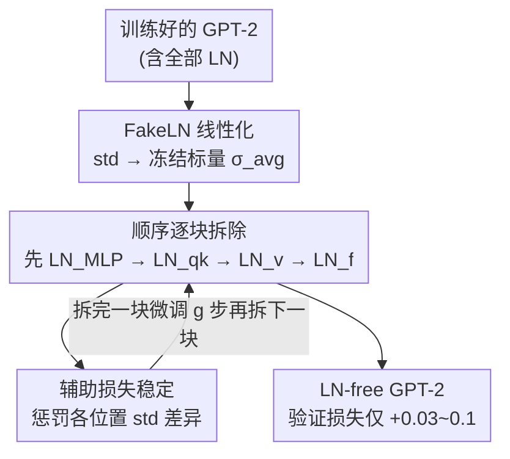

# Small Transformers Don't Need LayerNorm at Inference Time: Scaling LayerNorm Removal to GPT-2 XL and Implications for Mechanistic Interpretability

**会议**: ICLR 2026  
**OpenReview**: [https://openreview.net/forum?id=VPtHqcafIY](https://openreview.net/forum?id=VPtHqcafIY)  
**代码**: 模型已发布在 Hugging Face（LN-free GPT-2 全家桶）  
**领域**: 机制可解释性 / Transformer 架构分析  
**关键词**: LayerNorm 移除, 机制可解释性, GPT-2, Direct Logit Attribution, 置信度神经元

## 一句话总结
通过逐层微调把 GPT-2 全家桶（直到 15 亿参数的 GPT-2 XL）里所有 LayerNorm 替换成纯线性变换，验证损失只升高约 $+0.03 \sim 0.1$ 交叉熵，证明推理阶段 LN 并非必需，且去掉 LN 后 Direct Logit Attribution 误差从 50% 降到 0%，让机制可解释性分析变得精确。

## 研究背景与动机
**领域现状**：LayerNorm（LN）几乎是所有 Transformer 大模型的标配组件。它最初是为训练稳定性引入的（类似 CNN 里的 BatchNorm），定义为对残差流先减均值、再除以标准差、最后乘以可学习的 $\gamma$ 并加偏置 $\beta$。它在训练期的作用研究得很透，但在**推理期到底起什么作用、是不是非要不可**，几乎没人说清。

**现有痛点**：与 BatchNorm 不同，LN 在推理时**无法折叠成一个线性变换**。均值中心化、$\gamma$、$\beta$ 都能折进相邻层（`fold_ln`），但「除以残差流标准差」这个非线性除法必须在推理时实时执行。这给机制可解释性带来两个硬伤：（1）单个组件的输出效果取决于整个残差流的激活，无法干净地归因；（2）LN 的缩放让每个组件几乎影响下游所有组件，组件间交互纠缠成一团。研究者通常只能把 LN 近似成常数缩放（"freezing LayerNorm"），但这是一种会引入误差的妥协。

**核心矛盾**：要做精确的机制可解释性，就得把模型拆成可独立分析的组件；但 LN 的非线性恰恰把组件粘在一起。要么忍受近似误差，要么从头训练一个无 LN 的玩具模型——可后者只在小模型上可行，SOTA 模型仍离不开 LN 来稳定训练。

**本文目标**：能不能在**已经训练好**的大模型上，把 LN 这个非线性彻底拿掉，同时性能基本不掉？如果能，就得到一批「与原模型内部高度相似、但没有 LN 非线性」的代理模型，专供可解释性研究。

**切入角度**：训练期需要 LN 来稳定优化，但推理期残差流的标准差其实在不同 token 上分布相对集中。既然如此，能不能在微调末期用一个**固定标量**去近似那个标准差，把非线性除法换成线性缩放？

**核心 idea**：用一个冻结的平均标准差 $\sigma_{\text{avg}}$ 代替 LN 里逐 token 的实时标准差，把每个 LN 一个一个换成线性的「FakeLN」，配合辅助损失逐步微调，把模型"断奶"——从依赖 LN 平滑过渡到完全不需要 LN。

## 方法详解

### 整体框架
方法要解决的是：**怎么在不重训的前提下，把一个训练好的 GPT-2 里所有 LN 拆掉而不让它崩**。核心是「线性化 + 顺序拆除 + 辅助稳定」三件事。先把每个 LN 替换为一个数学上接近原 LN、但用固定标量缩放的线性块 FakeLN；因为同时拆掉所有 LN 会不可逆地把模型搞坏，所以一次只拆一个 LN 块，拆完微调若干步让损失重新稳定，再拆下一个，像给婴儿逐步断奶；整个过程额外加一个鼓励各 token 标准差一致的辅助损失，吸收拆除带来的梯度冲击。

### 关键设计

**1. FakeLN：用一个冻结标量替掉 LN 里的非线性除法**

LN 的非线性全在「除以逐 token 标准差」这一步。本文把它换成除以一个**固定标量** $\sigma_{\text{avg}}$，得到 FakeLN：

$$\text{FakeLN}(x) = \frac{x - \mu}{\sigma_{\text{avg}}} \odot \gamma + \beta$$

其中 $\sigma_{b,s}$ 是 batch 索引 $b$、序列位置 $s$ 处沿模型维度算出的标准差，$\sigma_{\text{avg}} = \frac{1}{BS}\sum_{b}\sum_{s}\sigma_{b,s}$ 是一个 batch 里所有 token 标准差的平均。替换的瞬间把这个标量**冻结**下来不再更新。这样一来减均值、乘 $\gamma$、加 $\beta$ 都是线性的，整个 FakeLN 就是一个纯线性变换，推理时可直接折进相邻权重。微调过程中 $\sigma_{\text{avg}}$ 会漂移，所以每个 batch 都重算，并在拆除那一刻锁定；Large 和 XL 模型 batch 不够大，改用指数滑动平均来估计 $\sigma_{\text{avg}}$ 以保证稳定。这一步是整篇方法的根基——把"无法线性化的 LN"硬变成"可线性化的 FakeLN"。

**2. 细粒度顺序拆除：一次只拆一个 LN，且按路径拆得更细**

直接把所有 LN 一起换成 FakeLN 会让模型不可逆地崩掉，因为模型的每个组件都是在"输入被归一化过"的前提下训练出来的，一次性撤掉这个前提会造成激活尺度全面失配。所以本文采用**顺序拆除**：拆掉一个 LN 块 → 固定步数微调让尖峰损失回落 → 再拆下一个。更关键的是，作者把 LN 按所在路径拆成四类——$\text{LN}^l_{qk}$（query/key 路径）、$\text{LN}^l_v$（value 路径）、$\text{LN}^l_{\text{MLP}}$（MLP 输入）、$\text{LN}_f$（最终 unembedding 前）——比常规"整层一个 LN"更细，因为细粒度拆除让每次扰动更小、微调更稳。拆除顺序也有讲究：先拆所有层的 $\text{LN}_{\text{MLP}}$，再拆 $\text{LN}_{qk}$ 和 $\text{LN}_v$，最后拆 $\text{LN}_f$。作者发现先拆 $\text{LN}_{\text{MLP}}$ 比先拆 $\text{LN}_{qk}$ 更稳，原因是序列起始 token 的残差范数方差若先动注意力路径的归一化，会对注意力机制冲击更大。每两次拆除之间的微调步数 $g_{\text{mlp}}/g_{qk}/g_v$ 是需要仔细调的超参：太小会不稳，太大则白白浪费算力。

**3. 辅助损失：逼模型自己抹平各位置的标准差差异**

LN 存在时，残差流向量被各自的标准差缩放；LN 一旦拿掉，不同位置之间巨大的范数差异会引发梯度尖峰，让微调失稳（最常见的失败是 $\text{LN}_v$ 拆除时的梯度爆炸）。为此作者加了一个辅助损失，鼓励各 token 位置的标准差趋于一致：

$$\mathcal{L}_{\text{aux}} = \lambda \cdot \mathbb{E}_{b,s}\big[(\sigma_{b,s} - \hat\sigma)^2\big], \quad \hat\sigma = \frac{1}{|M|}\sum_{(b,s)\in M}\sigma_{b,s}$$

目标值 $\hat\sigma$ 取自子集 $M$ 上的平均标准差，$M$ **刻意排除**第一个 token（位置 0）和所有含 end-of-text token（ID 50256）的位置——因为 GPT-2 里这些位置天生方差畸高，把它们算进目标会带偏。损失本身在所有位置计算，但目标只用"正常"位置。辅助损失只施加在 $\text{LN}_f$ 上，因为所有残差流最终都经过这个归一化层，是一个天然的全局范数正则锚点。实验显示：加了辅助损失后微调曲线明显更平滑，且它在微调初期迅速下降，说明模型确实学会了让各位置标准差保持一致——这也是为什么后面会观察到"首位置 token 不再特殊"。

### 损失函数 / 训练策略
总损失 = 标准语言建模交叉熵 + $\lambda \cdot \mathcal{L}_{\text{aux}}$。整个流程先做一段标准微调，再进入顺序拆除阶段。微调数据用 OpenWebText，**所需数据量随模型规模亚线性增长**——这是"能扩展到更大模型"的关键证据。GPT-2 Small/Medium/Large/XL 分别微调 300/500/600/800 步。作者还在 Pythia-70M 上复现成功，说明方法不局限于 GPT-2 家族。

## 实验关键数据

### 主实验
在 OpenWebText 验证集、The Pile、The Pile-filtered 上用平均交叉熵衡量。LN-free 模型与原模型差距普遍在 $+0.03 \sim 0.1$，语言理解 benchmark 上准确率也只差 1–2 个百分点。

| 模型 | OWT (val) | The Pile | The Pile-filtered |
|------|-----------|----------|-------------------|
| GPT-2 Small original | 3.1006 | 2.8450 | 2.7899 |
| GPT-2 Small LN-free | 3.0797 [+0.0671] | 2.8852 [+0.0402] | 2.8757 [+0.0858] |
| GPT-2 Medium original | 2.8145 | 2.5163 | 2.5390 |
| GPT-2 Medium LN-free | 2.7642 [+0.0252] | 2.6579 [+0.1416] | 2.6352 [+0.0962] |
| GPT-2 XL original | 2.5567 | 2.4436 | 2.3739 |
| GPT-2 XL LN-free | 2.5052 [+0.0253] | 130.22 ⚠️ | 2.3992 [+0.0253] |

> ⚠️ GPT-2 XL LN-free 在 The Pile 上的均值 130.22 是被极少数样本拉爆的（模型对这些 The Pile 独有、Pile-filtered 中被过滤掉的序列严重过自信）；其 99.9 百分位区间与原模型几乎一致，说明绝大多数序列处理无异。

### 可解释性分析

| 分析 | 原模型 | LN-free | 结论 |
|------|--------|---------|------|
| DLA vs DE 的 NMAE | 49.07% | **0.00%** | 去 LN 后 DLA 等于精确直接效应 |
| Attribution patching 误差改善 | — | $\mu=-0.026,\sigma=0.082$ | 几乎无改善（甚至略负） |
| 注意力 sink rate | 55.3% | 45.3% | 下降但非成比例 |
| 输出熵（Medium） | 2.86 | 2.53 | LN-free 更过自信 |
| 置信度神经元消融 ΔCE | 显著 | ≈0 | 完全失效 |

### 关键发现
- **DLA 变精确**：原模型里 Direct Logit Attribution 与真实 Direct Effect 的归一化平均绝对误差高达 49%，因为它依赖对 LN 的线性化近似；去掉 LN 后两者数学上等价，误差降到 0%。这是本文最直接的可解释性收益。
- **Attribution patching 没变好（反直觉）**：文献一直认为 LN 是 attribution patching 误差的主因，但去掉 LN 后误差几乎没改善（平均改善 $-0.026$）。这反过来说明误差的真正来源是 Transformer 里**更根本的非线性**——注意力 SoftMax 和 MLP 激活函数。
- **首位置 token 不再特殊**：原模型首 token 的 L2 范数比其他位置高近一个数量级（"attention sink"的机制基础），LN-free 模型把首 token 范数压到与其他位置相当（约 300–500），attention sink rate 也随之下降。
- **置信度神经元被废掉**：GPT-2 Medium 原模型里 top-3 置信度神经元（1083/1108/3144）一被消融就显著抬高 CE 损失，LN-free 里这个效应**完全消失**——证实 LN 的非线性正是这些"熵神经元"赖以工作的机制；代价是 LN-free 模型整体更过自信（期望校准误差从 0.019 升到 0.034）。
- **性能差距持久存在**：延长微调并不能抹平 LN-free 与 vanilla 微调之间的差距，差距大致恒定，说明 LN 贡献了一点"小而持久"的性能收益，无法靠多训补回。

## 亮点与洞察
- **把"不可线性化"硬变成"可线性化"**：核心洞察是 LN 的非线性只在"除以标准差"，只要敢用一个冻结标量近似它，整个 LN 就坍缩成线性变换——简单却直击要害。
- **顺序断奶 + 细粒度拆分**：把"一次拆一个"做到按 qk/v/MLP/final 四路细分，并用经验确定拆除次序（先 MLP 后注意力），是让大模型也能稳定拆 LN 的工程关键。
- **亚线性数据增长是 scaling 的底气**：拆 LN 所需微调数据随参数量亚线性增长，意味着这套方法理论上能往更大模型推。
- **负结果同样有价值**：attribution patching 不改善这个反直觉发现，把可解释性社区对误差来源的归因从"LN"修正到"SoftMax/MLP 激活"，方向性意义很大。
- **可迁移**：这套"线性化关键非线性 + 顺序微调 + 辅助稳定"的思路，可推广到想拆除其他非线性组件（如某些归一化/门控）以服务可解释性的场景。

## 局限与展望
- **微调更不稳**：LN 部分拆除时训练损失会尖峰，偶尔会不可逆崩溃；最常见是 $\text{LN}_v$ 拆除时梯度爆炸。Small/Medium 的协议迁移到 Large/XL 需大量重调超参，早期无辅助损失的协议在小模型行、却扩展不到大模型。
- **过自信**：所有 LN-free 模型都比原版更过自信，且其幅度超出"置信度神经元失效"能解释的范围，暗示还有其他因素（去掉归一化后注意力/MLP 要处理更大的输入波动）。
- **不易量化**：开源的 LN-free 模型不易量化，不过作者认为可解释性研究本就少用量化，影响有限。
- **范围**：实验集中在 GPT-2（外加 Pythia-70M），是否能推到更现代的大模型仍待验证。
- **改进方向**：参数高效微调（目前是全量微调）、进一步优化拆除时间表（部分 $\text{LN}_{qk}/\text{LN}_{\text{MLP}}$ 或可全层同时拆）、把 LN-free 模型用于电路级（circuits）可解释性。

## 相关工作与启发
- **vs Dynamic Tanh (DyT, Zhu et al. 2025)**：DyT 用逐元素 $\tanh(\alpha x)$ 代替归一化，同样证明语言模型能不用 LN；但 DyT 仍是一个我们不理解、且影响可解释性的非线性函数。本文更进一步，把 LN 换成**纯线性**变换，对可解释性更友好。
- **vs 从头训练无归一化模型 (Nabeshima 2024)**：从头训只在小玩具模型上可行，SOTA 模型仍靠归一化训练。本文选择从**已训练好**的模型上拆 LN，因此能覆盖到 GPT-2 XL 这种规模。
- **vs "freezing LayerNorm"近似 (Bricken et al. 2023 等)**：以往可解释性工作把 LN scale 近似成常数来勉强分析，这是带误差的妥协；本文直接产出真正无 LN 的模型，让 DLA 等方法从"近似"变"精确"。

## 评分
- 新颖性: ⭐⭐⭐⭐ 首次把 LN 移除扩展到 15 亿参数并系统验证对可解释性的影响，思路简洁但贡献扎实。
- 实验充分度: ⭐⭐⭐⭐⭐ 覆盖 4 个 GPT-2 规模 + Pythia，含多个数据集、DLA/attribution patching/attention sink/置信度神经元的细致分析。
- 写作质量: ⭐⭐⭐⭐ 逻辑清晰，公式与机制解释到位，负结果也诚实呈现。
- 价值: ⭐⭐⭐⭐⭐ 开源 LN-free GPT-2 全家桶，为机制可解释性社区提供了精确分析的现成 testbed。

<!-- RELATED:START -->

## 相关论文

- [\[ICLR 2026\] Formal Mechanistic Interpretability: Automated Circuit Discovery with Provable Guarantees](formal_mechanistic_interpretability_automated_circuit_discovery_with_provable_gu.md)
- [\[ACL 2025\] Mechanistic Interpretability of Emotion Inference in Large Language Models](../../ACL2025/interpretability/mechanistic_interpretability_of_emotion_inference_in_large_language_models.md)
- [\[ICLR 2026\] PERSONA: Dynamic and Compositional Inference-Time Personality Control via Activation Vector Algebra](persona_dynamic_and_compositional_inference-time_personality_control_via_activat.md)
- [\[ICLR 2026\] Priors in Time: Missing Inductive Biases for Language Model Interpretability](priors_in_time_missing_inductive_biases_for_language_model_interpretability.md)
- [\[NeurIPS 2025\] nnterp: A Standardized Interface for Mechanistic Interpretability of Transformers](../../NeurIPS2025/interpretability/nnterp_a_standardized_interface_for_mechanistic_interpretability_of_transformers.md)

<!-- RELATED:END -->
