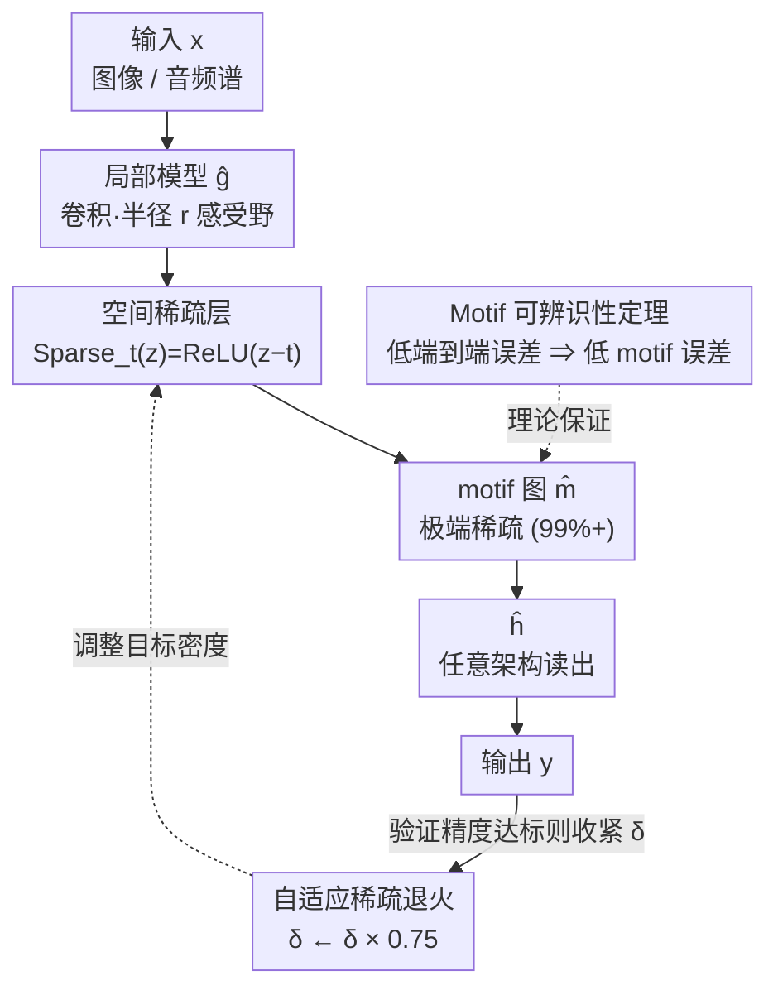

# Sparling: End-to-End Spatial Concept Learning via Extremely Sparse Activations

**会议**: ICLR 2026  
**OpenReview**: [https://openreview.net/forum?id=yfBs0GQxx9](https://openreview.net/forum?id=yfBs0GQxx9)  
**代码**: `sparling` PyPI 包（论文提及，仓库待确认）  
**领域**: 可解释性 / 概念瓶颈 / 表示学习  
**关键词**: motif、空间概念、极端稀疏、可辨识性、概念瓶颈

## 一句话总结
本文证明了一个「Motif 可辨识性定理」——只要中间概念是局部的、稀疏的、且对输出充分必要，就能仅靠端到端监督（无任何中间概念标注）把它精确还原；并给出 SPARLING 算法，用一个把激活强制压到 99% 以上稀疏的「空间稀疏层」+ 退火式自适应稀疏调度来逼近这个最优解，在三个合成域上以 >90% 的精度定位出中间空间概念。

## 研究背景与动机
**领域现状**：深度学习的招牌能力之一是从端到端监督里自动学出有用的中间表示，但这些表示通常是「黑箱」——中间向量的数值不对应任何人类能读懂的概念。为了把中间层拉回到有意义的概念上，概念瓶颈模型（concept bottleneck models）应运而生，让中间层显式对齐到一组概念。

**现有痛点**：训练概念瓶颈模型要么需要对中间概念直接打标签，要么需要设计能从端到端信号里自学概念的算法。前者只在「概念已知」的领域可行，恰恰违背了深度学习「学出超越手工知识的表示」的初衷；后者则极其困难——能产生同一组输入/输出映射的潜在概念空间巨大，理论上有无穷多种「解释」都能拟合数据，凭什么端到端训练就会收敛到「真实」的那一个？

**核心矛盾**：从端到端数据 $D=\{(x, f^*(x))\}$ 还原中间变量 $m^*$ 听起来近乎不可能：中间变量天然非唯一（可以换通道、可以挪位置、可以把信息搬到 $\hat h$ 里）。问题的根本在于——在什么条件下，「低端到端误差」能**强制蕴含**「低中间概念误差」。一个相关的基因组学工作（Gupta et al., 2024）经验上观察到端到端训练竟能让 RNA 蛋白结合位点（motif）的预测更贴近独立实验测量，但它依赖一个近似的初始 motif 模型当先验。

**本文目标**：（1）刻画一组假设，使得「仅靠端到端监督还原中间空间概念」在统计上可行；（2）抛掉基因组学工作里的近似先验，给出一个真能在实践中达到该条件的算法。

**切入角度**：作者观察到空间概念（论文统称 **motif**）通常有两个关键性质——**局部性**（motif $m[i,j,c]$ 只依赖空间位置 $(i,j)$ 邻域内的输入）和**稀疏性**（概念数远少于像素数，绝大多数 motif 激活为零）。这两条性质恰好是把「无穷多种解释」收窄到唯一解的杠杆。

**核心 idea**：把局部性 + 极端稀疏性 + 三条可满足的分布假设拧在一起，就能证明「端到端误差小 ⇒ motif 误差小」；再用一个能逼到 99%+ 稀疏的信息瓶颈层去实际优化这个目标。

## 方法详解

### 整体框架
本文要解决的是：给定一个真实过程 $f^* = h^* \circ g^*$，其中 $g^*: X \to M$ 把输入映射到稀疏的 motif 空间 $M$，$h^*: M \to Y$ 再把 motif 映射到输出标签；训练时**只能看到** $(x, y^*)$，看不到任何 $m^*$。目标是训练 $\hat g, \hat h$ 使得 $\hat g$ 精确还原 $g^*$（在通道置换、位置微移意义下）。

整体管线很直接：输入 $x$ 先经过一个**局部模型 $\hat g$**（卷积式、半径 $r$ 的感受野）得到稠密激活，再经过**空间稀疏层**把激活压到极端稀疏、产生 motif 图 $\hat m$，最后由任意架构的 $\hat h$（可以是 LSTM + Transformer）读出序列输出 $\hat y$。整套网络只用端到端误差训练。让这套朴素管线「碰巧」收敛到正确 motif 的，是三件事：理论上由 **Motif 可辨识性定理**保证「只要端到端误差小且密度等于 $\delta^*$，motif 误差必然小」；算法上由**空间稀疏层**把密度真正钉死在目标值、由**自适应稀疏退火**把目标密度从高到低慢慢逼到 $\delta^*$（否则一上来就极端稀疏会因缺乏学习信号卡在局部最优）。

### 关键设计

**1. Motif 可辨识性定理：把「端到端误差小」翻译成「中间概念还原准」**

这条定理是全文地基，回答「凭什么端到端监督能逼出唯一正确的中间概念」。作者先列出中间变量为什么会非唯一的几种情形，再给出三条假设把它们逐一排除：**NON-OVERLAPPING**（任意两个 motif 的 $p_2(i)$ 感受野细胞不重叠，保证可以把输入各部分当独立实体处理）、**MOTIF-SUFFICIENCY**（表示 motif 的像素与 motif 的整体空间布局 $P_m(m)$ 独立，且背景平移不变——这保证 motif 是独立实体而非某张大图的相关子特征，是本文主假设）、**$\alpha$-MOTIF-NECESSITY**（没有哪类 motif 被 $h^*$ 完全忽略，在概率和 $\ge \alpha$ 的情形里删/改单个 motif 必然改变输出）。在这三条成立时，定理给出

$$\forall \hat g \in G, \hat h.\ \delta(\hat g)=\delta^* \Rightarrow \big(\forall \epsilon>0,\ E(\hat h\circ\hat g)<\epsilon \Rightarrow E_m(\hat g)<k\epsilon\big)$$

其中 $E$ 是端到端误差、$E_m$ 是 motif 误差、$k=O\!\left(\#_{\max}^2|p_2|n^2 / (\#^* \alpha^2)\right)$。值得强调的是定理**不假设参数可辨识**，只要求 $\hat g$ 的输入/输出行为可辨识，因此允许 motif 是输入的任意复杂函数；$h^*$ 也不受层数等任何结构约束。$E_m$ 用一个 IoU 风格的指标定义：「交」是 $g^*(x)$ 中被 $\hat g(x)$ 唯一覆盖的真 motif 细胞数 $u(\hat m, m^*)$，「并」取 $\max(\#(\hat g),\#(g^*))$，再 $E_m=1-\mathbb{E}[u]/\max(\cdot)$。证明走反证法：假设 motif 误差高，用计数论证（因 $\delta(\hat g)=\delta^*$）把误差归结为假阴性或通道混淆，再经 MOTIF-SUFFICIENCY 与 $\alpha$-MOTIF-NECESSITY 传导成端到端误差，矛盾。这条定理之所以有用，是因为端到端误差在测试集上**平凡可验证**——你不需要真知道 $m^*$ 就能确认自己达到了可辨识性。

**2. 空间稀疏层：把信息瓶颈钉在「极端稀疏」上的可微机制**

定理要求密度严格等于 $\delta^*$，而 $\delta^*$ 极小（DIGITCIRCLE 里平均 4.5 个数字、$100\times100$ 图、10 类 motif，$\delta^*=4.5\times10^{-5}$，即 99.99%+ 稀疏）。普通的 L1/dropout 等手段达不到这种极端稀疏，本文专门设计了空间稀疏层作为 $\hat g$ 的最后一步：

$$\text{Sparse}_t(z)=\text{ReLU}(z-t)$$

关键在阈值 $t$ 的处理——它在反向传播里被当**常数**，不由梯度更新；而是用批次分位数的指数滑动平均在线拟合 $t_n=\mu t_{n-1}+(1-\mu)q(z_n, 1-\delta)$（$\mu=0.9$，$q$ 是 `torch.quantile`，对除最后一维外的所有维度取分位）。这样每个通道的阈值自动调到「恰好让 $\delta$ 比例的元素被保留」，于是这一层就**精确强制** $\hat g$ 的稀疏度为 $1-\delta$，把定理需要的硬约束变成一个可训练、稳定的层。层前还固定加一个 affine batch normalization 提升训练稳定性。和别的稀疏化技术（剪枝、彩票假设、L0 正则）不同，它不是去稀疏「权重」，而是直接钉死「激活模式」的稀疏度到任意目标值，这是定理可用的前提。

**3. 自适应稀疏退火：用验证精度牵引密度从松到紧**

直接一上来就要求极端稀疏，网络会因为缺乏学习信号卡在局部最优——稀疏度太高时优化地形极不稳定。作者借鉴模拟退火，让目标密度 $\delta$ 随训练**缓慢下降**，但不按固定 schedule，而是把退火**绑定到端到端验证精度**以适应不同训练节奏（见算法 1）：维护一个目标精度 $T_t$ 并随时间衰减，每当验证精度 $A_t$ 超过 $T_t$，就把密度收紧 $\hat f.\delta \leftarrow \hat f.\delta \times \delta_{\text{update}}$（$\delta_{\text{update}}=0.75$）并把 $T_t$ 抬到当前精度。直觉是：先让模型在宽松密度下学到一个能用的解，每巩固一次精度就再压一档稀疏，像退火一样逐步逼到 $\delta^*$。这一步是把「理论上要求 $\delta=\delta^*$」落地为「实践中能稳定训出来」的关键工程。

### 损失函数 / 训练策略
训练只用端到端误差（证明用精确匹配，经验分析用归一化编辑距离 E2EE）。架构上 $\hat g$ 用四个残差单元堆出 $17\times17$ 感受野再接 10 通道瓶颈 + 空间稀疏层；$\hat h$ 用 max pooling + LSTM 行编码 + 6 层 8 头 Transformer。超参：batch size 10、学习率 $10^{-5}$、退火评估频率 $M=2\times10^5$、$d_T=10^{-7}$。

## 实验关键数据

### 主实验
三个合成域：**DIGITCIRCLE**（$100\times100$ 噪声图里 3-6 个数字排成圆，输出逆时针数字序列）、**LATEX-OCR**（图像合成 LaTeX 代码，$h^*$ 更复杂）、**AUDIOMNISTSEQUENCE**（5-10 位数字语音序列，且训练用说话人 1-51、测试用 52-60 检验泛化）。

| 指标 / 域 | DIGITCIRCLE | LATEX-OCR | AUDIOMNISTSEQUENCE |
|-----------|-------------|-----------|--------------------|
| 平均 motif 误差 | <10% | <10%（FNE 偏高例外） | <10% |
| $\hat h$ 扰动一致性（精确匹配） | 99.3% | 86.1% | 93.4% |
| 备注 | 通道-数字对应跨样本一致 | 分数线/括号/加号常被忽略 | FPE 恰为 0，泛化到未见说话人 |

三个域的 motif 误差平均都在 10% 以下（唯一例外是 LATEX-OCR 的假阴性误差 FNE），且 AUDIOMNISTSEQUENCE 在未见说话人上依然成立，说明 SPARLING 真在学 motif 特征而非记忆样本。LATEX-OCR 的高 FNE 恰好印证 $\alpha$-MOTIF-NECESSITY 假设：识别 LaTeX 文本不需要每次都识别分数线和 `()+`，这些「不必要」的 motif 被当背景丢掉了——而证明在「某些 motif 从不被用」时仍大体成立。

### 消融实验
核心消融是「稀疏度 $\delta$ 扫描」（图 4，x 轴为反向对数刻度，对应退火训练时间）：

| 趋势随 $\delta$ 减小（越稀疏） | 现象 | 含义 |
|-------------------------------|------|------|
| 假阳性误差 FPE | 下降 | 稀疏挤掉虚假 motif |
| 假阴性误差 FNE | 上升 | 太稀疏会漏掉 motif |
| 混淆误差 CE | **大幅下降** | 极端稀疏才能分清通道 |
| 端到端误差 E2EE | 上升 | 信息瓶颈迫使模型「下决断」 |

最关键的发现是 E2EE 与 CE 之间的 trade-off：密度只要放大 2-3 倍，混淆误差 CE 就显著升高，证明**极端稀疏是必要的**，正好对应定理依赖 $\delta(\hat g)=\delta^*$ 的条件。另有 Retrained 消融：去掉瓶颈、冻结 $\hat g$、只微调 $\hat h$，其端到端精度接近 Non-Sparse，说明 motif 模型本身已提供足够信号学出端到端函数，SPARLING 略高的端到端误差来自「被迫对每个位点是否为 motif 下决断」。

### 关键发现
- **极端稀疏不是可选项而是必需品**：2-3 倍密度差就能让混淆误差明显恶化，验证了定理的 $\delta=\delta^*$ 条件不是技术细节而是本质。
- **$\hat h$ 行为符合预期**：把 motif 层某类 motif 改成另一类后重跑 $\hat h$，输出按预期改变，扰动一致性高达 99.3%（DIGITCIRCLE），证明中间层确实承载了因果性的概念信息。
- **不满足假设就退化**：Splicing 域因不满足 Section 3.3 假设，SPARLING 无法精确还原 motif，但仍显著好于随机——边界清晰、诚实。

## 亮点与洞察
- **把「可解释性」从经验现象升格为可证明的定理**：以往「端到端竟能学出可解释概念」是观察到的惊喜，本文给出严格的充分条件（局部 + 稀疏 + 三假设），并把「验证可辨识性」简化成「在测试集上验证端到端误差」这件平凡事——这是非常漂亮的理论-实践对接。
- **辨识的是函数行为而非参数**：定理刻意不要求参数可辨识，只要 $\hat g$ 的输入/输出行为对，从而允许 motif 是输入的任意复杂函数、$h^*$ 任意架构——这比传统 ICA / HMM / PCFG 可辨识性结果的假设弱得多。
- **空间稀疏层是可复用的 trick**：把阈值 $t$ 在反传中当常数、用分位数 EMA 在线拟合，能精确把激活稀疏度钉到任意目标值（哪怕 99.99%+），可迁移到任何想做「极端激活稀疏信息瓶颈」的场景。
- **退火绑定验证精度**而非固定 schedule，对训练节奏鲁棒，是把不稳定的极端稀疏优化训出来的关键工程巧思。

## 局限与展望
- **NON-OVERLAPPING 假设偏强**：要求 motif 的 $p_2(i)$ 细胞完全不重叠，技术上甚至排除了论文自己的部分域；作者承认若补一条「motif 模式必须用满整个 $p(i)$ 细胞」的假设，未来或可放宽到允许重叠。
- **仅在合成域验证**：DIGITCIRCLE / LATEX-OCR / AUDIOMNISTSEQUENCE 都是人工合成的；真实的 Splicing 域不满足假设、无法精确还原，说明现实数据里假设的可满足性仍是开放问题。
- **端到端精度有代价**：SPARLING 的端到端误差略高于非稀疏基线，因为瓶颈迫使模型对每个位点「二选一」——可解释性与原始拟合精度之间存在 trade-off。
- **未考虑噪声**：理论部分明确不处理噪声（仅提到可通过减去不可约误差扩展到 IID Bernoulli 噪声），距真实含噪场景有距离。

## 相关工作与启发
- **vs 概念瓶颈模型 (Koh et al., 2020)**：它们一般需要中间概念的监督或先验，本文证明在局部+稀疏+三假设下**完全无需中间监督**即可还原概念，假设更激进但结论更强。
- **vs 基因组学 motif 工作 (Gupta et al., 2024)**：那篇靠近似的初始 motif 模型当先验且只给经验证据，本文抛掉先验、补上严格的可辨识性定理，把「为什么端到端能学出 motif」从现象升级为定理。
- **vs 非线性 ICA (Hyvärinen 等)**：ICA 对混合函数假设较多，本文对「混合函数」$h^*$ 几乎不设限，只用「端到端误差小」就推出潜变量可还原。
- **vs 传统可辨识性 (HMM / PCFG)**：那些结果针对特定隐变量模型且辨识的是参数，本文针对深度学习场景、辨识的是夹在两个任意网络之间的中间层函数行为。

## 评分
- 新颖性: ⭐⭐⭐⭐⭐ 把端到端可解释性现象提炼成可证明的 motif 可辨识性定理，并配套极端稀疏算法，理论与实践对接干净。
- 实验充分度: ⭐⭐⭐⭐ 三个合成域 + 稀疏度扫描 + 扰动一致性 + Retrained 消融都很到位，但缺真实数据上的成功案例。
- 写作质量: ⭐⭐⭐⭐ 假设与误差指标定义清晰、对失败域诚实交代，理论部分较密需要耐心。
- 价值: ⭐⭐⭐⭐ 为「无监督学可解释中间概念」给出了少见的理论保证，空间稀疏层这一可复用机制本身也有独立价值。

<!-- RELATED:START -->

## 相关论文

- [\[CVPR 2026\] SafeDrive: Fine-Grained Safety Reasoning for End-to-End Driving in a Sparse World](../../CVPR2026/interpretability/safedrive_fine-grained_safety_reasoning_for_end-to-end_driving_in_a_sparse_world.md)
- [\[CVPR 2026\] TDATR: Improving End-to-End Table Recognition via Table Detail-Aware Learning and Cell-Level Visual Alignment](../../CVPR2026/interpretability/tdatr_improving_end-to-end_table_recognition_via_table_detail-aware_learning_and.md)
- [\[ICLR 2026\] Sparse CLIP: Co-optimizing Interpretability and Performance in Contrastive Learning](sparse_clip_co-optimizing_interpretability_and_performance_in_contrastive_learni.md)
- [\[ICLR 2026\] Learning Multimodal Dictionary Decompositions with Group-Sparse Autoencoders](learning_multimodal_dictionary_decompositions_with_group-sparse_autoencoders.md)
- [\[ICLR 2026\] Negative Pre-activations Differentiate Syntax](negative_pre-activations_differentiate_syntax.md)

<!-- RELATED:END -->
