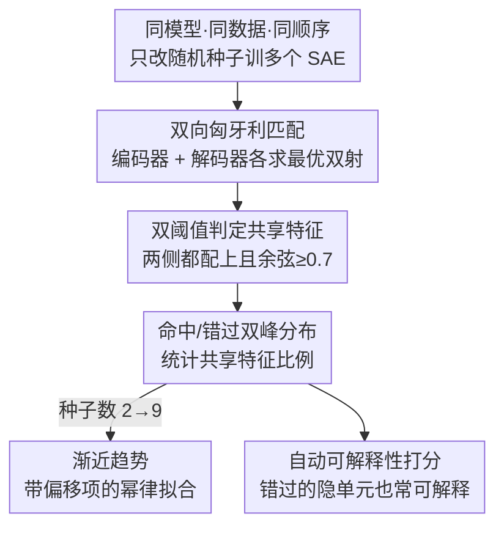

# Sparse Autoencoders Trained on the Same Data Learn Different Features

**会议**: ICLR 2026  
**OpenReview**: [https://openreview.net/forum?id=EjInprGpk9](https://openreview.net/forum?id=EjInprGpk9)  
**代码**: 有（论文 Code Availability 提供 Hungarian 对齐与分析脚本，及全部 SAE checkpoint）  
**领域**: 可解释性 / 稀疏自编码器 / 机制可解释性  
**关键词**: 稀疏自编码器, 随机种子, 特征稳定性, 匈牙利匹配, 可解释性

## 一句话总结
这是一篇分析型论文：作者用匈牙利算法对齐「只有初始化随机种子不同、看到的数据完全相同」的多个稀疏自编码器（SAE），发现它们学到的特征只有一部分重叠（Llama 3 8B 上仅 30%），且越大的模型/SAE 重叠越低、TopK 比 ReLU 更不稳定，从而论证 SAE 找到的特征是「一种实用的激活空间分解」而非模型「真正使用的、唯一客观的特征清单」。

## 研究背景与动机

**领域现状**：SAE 是当下机制可解释性的主力工具，用一个稀疏的过完备隐层把神经网络激活分解成人类可读的「特征」，以缓解神经元的多义性（polysemanticity）。它已经被搬到 GPT-4、Claude 3 Sonnet 这种 SOTA 模型上。

**现有痛点**：很多研究者（以及安全社区）暗含一个更强的期待——希望 SAE 能「枚举模型里的全部特征」，进而验证诸如「模型永远不会撒谎」这类安全性质。这个期待预设了：神经网络存在一个**唯一、客观**的特征分解，而 SAE 能把它挖出来。但这个预设从没被严格检验过。

**核心矛盾**：如果 SAE 真的在逼近某个客观的特征集合，那么仅仅换一个权重初始化的随机种子、其余完全不变，训出来的两个 SAE 应该学到几乎相同的特征。反之，如果换种子就学到一大批不同特征，就说明 SAE 的解只是损失曲面众多局部极小之一，所谓「真实特征清单」并不存在。

**本文目标**：把上面这个哲学预设变成一个可测量的问题——同模型、同数据、同顺序，只改随机种子，量化两个 SAE 之间「共享特征」的比例，并看它如何随模型规模、SAE 规模、稀疏度、激活函数、训练时长变化。

**切入角度**：难点在于 SAE 的隐单元（latent）没有固有顺序，把一个 SAE 的隐单元随机置换得到的新 SAE 表示的是同一个函数、同一批特征，但权重矩阵看起来完全不同，无法逐行直接比对。作者的观察是：只要找到一个**最大化平均相似度的双射匹配**，就能在「仅是置换」的情形下正确判定两者特征相同，从而把「特征是否共享」变成一个可计算的指派问题。

**核心 idea**：用匈牙利算法在两个 SAE 的隐单元之间求最优双射匹配，再用余弦相似度阈值把每个隐单元判成「命中（hit）」或「错过（miss）」，以共享比例作为 SAE 特征普适性的代理指标。

## 方法详解

### 整体框架

本文不是提出新模型，而是提出一套**度量 SAE 特征稳定性**的分析流程。整体可以概括为：先用不同随机种子（但相同数据、相同顺序）独立训练一批 SAE；然后对任意两个 SAE 求隐单元的最优双射匹配；接着用相似度阈值把每个隐单元标成命中/错过，统计共享特征比例；再把种子数从 2 扩展到 9，看「只存在于某一个 SAE 的特征」比例如何衰减；最后用自动可解释性流水线给命中和错过的隐单元打分，回答「被某个种子漏掉的特征是不是垃圾」。

SAE 本身的形式是带 TopK 激活的标准结构：
$$\hat{x} = D\,\mathrm{TopK}(Ex + e) + d$$
其中 $x$ 是目标 MLP 的输出，$E, e$ 是编码器权重与偏置，$D, d$ 是解码器权重与偏置，训练目标是最小化重建均方误差 $\lVert x - \hat{x}\rVert_2^2$。所有 SAE 隐单元数与输入维度之比固定为 36。

### 关键设计

**1. 双向匈牙利匹配：用最优双射绕开隐单元无序的难题**

直接比较两个 SAE 的权重矩阵没有意义，因为隐单元顺序是任意的——把一个 SAE 的行随机置换就得到权重完全不同、却表示同一函数的「孪生」SAE。作者要求匹配满足两个性质：是双射（一对一，不能多个隐单元都映到同一个），且最大化匹配对的平均相似度。这恰好是经典的线性指派问题，用匈牙利算法（SciPy 的 `linear_sum_assignment`）即可高效求解。具体地，先把编码器行向量、解码器列向量都标准化为单位范数，再分别求解码器置换 $P_{dec}$ 最大化 $\mathrm{tr}(P_{dec}^{T} D_1^{T} D_2)$、编码器置换 $P_{enc}$ 最大化 $\mathrm{tr}(P_{enc}^{T} E_1 E_2^{T})$。这样做的好处是：当 $M'$ 真的只是 $M$ 的置换版时，算法会把它们完全对上、判定特征相同，从而保证度量在「应当相同」的情形下不会误判。

**2. 双阈值共享判定：编码器和解码器都得认账**

编码器和解码器虽然初始化时互为转置，训练中却会逐渐分化，单看一侧可能高估相似度。作者采取保守策略：编码器、解码器**各做一次匹配**，只有当某个隐单元在两套匹配里都被配到同一个对手、且两套匹配的余弦相似度都 $\geq 0.7$，才算「共享特征」；否则称为「未配对（unpaired）」。按这个严格定义，两个独立训练的 SAE 只有 42% 的隐单元是共享的。作者还验证：把匈牙利匹配换成更简单的「最大余弦相似度」（mean max cosine similarity，每个隐单元取它与对方所有隐单元的最大相似度再平均）结论几乎不变——大多数隐单元本来就被匹配到了最近邻，说明结果不依赖具体匹配方法这一选择。

**3. 命中/错过双峰分布：共享与否不是连续光谱而是两个模态**

把匹配后的余弦相似度画出来，分布呈现清晰的**双峰**：高相似度的「命中（hits）」和低相似度的「错过（misses）」。命中的隐单元往往在语义相近的上下文里激活、解释也相似；错过的则通常语义无关。更有意思的是，当编码器匹配和解码器匹配对同一个隐单元给出不同对手时（两套匹配「不一致」），其相似度通常两侧都低；而两套匹配一致时相似度都高。这个双峰结构正是把「共享比例」当作有意义指标的前提——它让「共享/不共享」成为一个干净的二分，而不是任意切一刀的连续值。作者进一步发现：发放频率最高的隐单元几乎在所有种子里都有对手，发放最稀的则常常谁都对不上；但相当一部分错过的隐单元平均发放率反而比那些「全种子共享」的还高，呈现非单调关系。

**4. 渐近趋势 + 自动可解释性验证：漏掉的特征不是噪声**

只比两个种子可能低估稳定性，作者把种子扩到 9 个，对每个 $k\in[2,9]$ 遍历所有 $k$ 个 SAE 的组合、轮流以每个 SAE 为「基准 SAE」，统计「只存在于基准 SAE」（即在其余 $k-1$ 套匹配里全部是错过）的隐单元比例。结果显示这个比例随种子数缓慢下降，到 $k=9$ 时仍约 35%；带偏移项的幂律比不带偏移项拟合得明显更好，意味着无论训多少个 SAE，总有一批隐单元永远找不到对手。为排除「这些孤儿隐单元只是垃圾」的可能，作者用 Paulo et al. (2024) 的自动可解释性流水线（Llama 3.1 70B Instruct 看 40 个激活样本生成解释，再用 detection 与 fuzzing 打分）给隐单元评分。结论是：共享种子数越多的隐单元平均可解释性分数越高，但相当一部分「只在一个种子里出现」的隐单元同样拿到高分（见 Table 1，余弦相似度 < 0.7 却解释分高的成对例子）。这说明任何单次 SAE 训练都在系统性地漏掉一批本可解释的特征。

### 损失函数 / 训练策略

SAE 用 Adam 优化器训练，序列长度 2049、batch 为 32 条序列，目标是重建 MSE。主实验在 Pythia 160M 第 6 个 MLP 上训 $2^{15}$ 个隐单元、过 Pile 前 8B token；另在 SmolLM、GPT-2、Llama 3.1 8B 上各训一套（数据集分别为 Fineweb-edu、OpenWebText、RedPajama V2）。标准训练配方把解码器向量约束为单位范数，以消去 ReLU 网络固有的连续缩放对称性。

## 实验关键数据

### 主实验

| 设置 | 共享特征比例 | 说明 |
|------|------------|------|
| Pythia 160M, 32K 隐单元, 两种子 | 42% | 严格双阈值定义下的共享比例 |
| Pythia 160M, 9 种子 ($k=9$) | 「只在单一 SAE」约 35% | 即仍有约 35% 隐单元永远找不到对手 |
| Llama 3 8B, 131K 隐单元 | 30% | 最大模型，共享比例最低 |
| GPT-2 / Gated·ReLU (L1 loss) | 高（> 90%，旧工作量级） | L1 ReLU/Gated SAE 跨种子更稳定 |
| GPT-2 / TopK | 明显更低 | TopK 在相同稀疏度下更依赖种子 |

### 消融实验

| 变量 | 共享比例变化 | 解读 |
|------|------------|------|
| 增大隐单元总数 | 下降 | SAE 越大，跨种子越发散 |
| 增大 TopK 的 $k$（激活更密） | 下降 | 活跃隐单元越多越不稳定 |
| 延长训练时长 | 上升 | 训得越久种子间对齐越好 |
| 层位置（中层 vs 早/末层） | 中层基本恒定，早层与最后一层更低 | 稳定性随层位置变化 |
| 激活函数（ReLU/Gated vs TopK） | ReLU/Gated > TopK | TopK 的不连续性加剧非凸局部最优问题 |

### 关键发现
- **越大越发散**：与「规模越大越收敛到真实特征」的直觉相反，模型/SAE 越大，跨种子共享比例越低（Llama 3 8B 仅 30%），SAE 随规模是发散而非收敛的。
- **TopK 比 ReLU 更不稳定**：即便控制稀疏度，SOTA 的 TopK 激活也比 L1 ReLU/Gated 更依赖种子；作者归因于 TopK 激活不连续，进一步恶化了 SAE 损失本身的非凸性、制造更多局部最优。
- **种子依赖不像是特征吸收（feature absorption）**：吸收会随稀疏度下降、训练变长而加剧，但本文观察到的不稳定随训练变长反而减轻、随隐单元数增加而加剧，方向相反，说明这是另一种现象。
- **漏掉的不是垃圾**：相当比例「只在单一种子出现」的隐单元仍有高可解释性分数，意味着单次训练会系统性地错过一批有意义的特征。

## 亮点与洞察
- **把哲学预设变成可测量实验**：「SAE 是否找到唯一客观特征集」这种听起来很玄的问题，被干净利落地转化为「换种子后共享比例是多少」，并用匈牙利匹配给出可复现的度量——这是方法论上最漂亮的一步。
- **双向匹配 + 双阈值的保守设计**：编码器、解码器各匹配一次且都要过 0.7 阈值，既防止单侧高估，又能优雅证明「仅置换」情形下判定为相同，可直接迁移到任何需要对齐两套无序字典/原型的场景（如模型融合、字典学习对比）。
- **双峰分布的发现本身就是结论**：相似度不是连续铺开而是命中/错过两个模态，这让「共享比例」成为一个有意义的指标，而不是人为切阈值的产物。
- **对安全叙事的直接冲击**：如果连「枚举全部特征」都因种子而异，那么「用 SAE 证明模型永不撒谎」这类安全保证的根基就被动摇了，提示应把 SAE 特征当作「实用分解」而非「真理清单」。

## 局限与展望
- **结论以 MLP 输出 SAE 为主**：作者指出当前的吸收度量主要为残差流 SAE 调过，在 MLP SAE 上「没发现吸收」可能只是指标不敏感，而非真的没有吸收。
- **匹配的代价函数是超参**：用编码器还是解码器相似度、阈值取 0.7、要求两侧一致，都是人为选择；虽然作者用最大余弦相似度做了稳健性验证，但「共享」的精确数值仍依赖这些约定。
- **只回答「是否共享」，未深究「为何分叉」**：论文把根因归到损失非凸 + TopK 不连续，但缺少对「不同局部最优在特征层面如何系统性不同」的机制刻画。
- **可改进方向**：可探索显式跨种子对齐训练（如 Marks et al. 的对齐损失）能把共享比例提到多高、是否以牺牲重建为代价；或设计层级化 SAE 让「通用特征 + 具体特征」共存，看能否减少种子依赖。

## 相关工作与启发
- **vs Leask et al. / Braun et al. (ReLU + L1 稳定结论)**：他们在较小、ReLU 架构的 SAE 上测得 GPT-2 种子间 > 90% 共享，本文复现了 L1 ReLU/Gated 更稳定，但指出一旦换成更大、TopK 的 SAE，共享比例会大幅下降，把「SAE 稳定」的乐观结论限定在了特定架构与规模。
- **vs Marks et al. (2024)**：他们发现 TopK SAE 需要强制对齐两个种子才能提升，间接说明默认并不对齐；本文从正面量化了这种不对齐的程度。
- **vs Balagansky et al. (2024)（并行工作）**：他们同样用匈牙利算法对齐 Gemma 2 相邻层的 SAE 并得到正面（高对齐）结果，但本文指出 Gemmascope 全部 SAE 用了**同一个随机种子**初始化，其正面结论很可能正是这一超参选择的产物——恰好反衬本文「换种子就分叉」的核心论点。
- **vs 特征吸收 / meta-SAE 工作（Chanin、Leask、Ayonrinde 等）**：这些工作揭示 SAE 特征非原子、可被更细的特征替换、且「扁平」设计难容纳层级概念；本文的种子分叉现象与之呼应，共同支持「特征发现是组合/层级问题」的视角。

## 评分
- 新颖性: ⭐⭐⭐⭐⭐ 把「SAE 是否找到唯一真实特征」这一长期被默认的预设首次系统证伪
- 实验充分度: ⭐⭐⭐⭐ 覆盖 3 个模型、2 个数据集、多种架构与超参消融，但深入机制刻画偏少
- 写作质量: ⭐⭐⭐⭐⭐ 问题定义清晰、度量设计严谨、结论克制不夸大
- 价值: ⭐⭐⭐⭐⭐ 直接影响可解释性与 AI 安全社区对 SAE 的根本期待

<!-- RELATED:START -->

## 相关论文

- [\[ICLR 2026\] AbsTopK: Rethinking Sparse Autoencoders For Bidirectional Features](abstopk_rethinking_sparse_autoencoders_for_bidirectional_features.md)
- [\[ICLR 2026\] Toward Faithful Retrieval-Augmented Generation with Sparse Autoencoders](toward_faithful_retrieval-augmented_generation_with_sparse_autoencoders.md)
- [\[ICLR 2026\] On the Limits of Sparse Autoencoders: A Theoretical Framework and Reweighted Remedy](on_the_limits_of_sparse_autoencoders_a_theoretical_framework_and_reweighted_reme.md)
- [\[ICLR 2026\] Uncovering Conceptual Blindspots in Generative Image Models Using Sparse Autoencoders](uncovering_conceptual_blindspots_in_generative_image_models_using_sparse_autoenc.md)
- [\[ICLR 2026\] Taming Polysemanticity in LLMs: Theory-Grounded Feature Recovery via Sparse Autoencoders](taming_polysemanticity_in_llms_theory-grounded_feature_recovery_via_sparse_autoe.md)

<!-- RELATED:END -->
