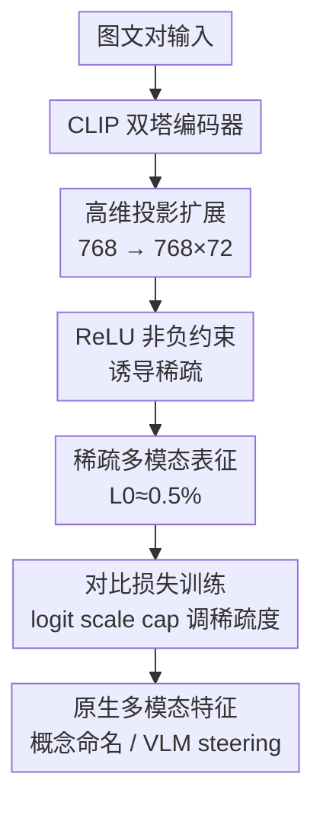

# Sparse CLIP: Co-optimizing Interpretability and Performance in Contrastive Learning

**会议**: ICLR 2026  
**OpenReview**: [https://openreview.net/forum?id=DjefrO8TJr](https://openreview.net/forum?id=DjefrO8TJr)  
**代码**: 无  
**领域**: 多模态VLM / 可解释性 / 对比学习  
**关键词**: CLIP, 稀疏表征, 可解释性, 多模态, 视觉 steering

## 一句话总结
本文把"稀疏"直接塞进 CLIP 的对比预训练（最终投影层加 ReLU 非负约束 + 维度大幅扩展），训练出既可解释、又不掉点、还天然保留跨模态能力的稀疏 CLIP 表征，从而推翻了"可解释性必然牺牲精度"这一通行假设。

## 研究背景与动机
**领域现状**：CLIP 已经是视觉-语言表征学习的基石，也是多模态大模型（MLLM）默认的视觉骨干。但它输出的是一个稠密、不透明的隐空间，单看某一维很难说清模型到底学到了什么概念，可解释性差。

**现有痛点**：为了打开这个黑盒，近期主流做法是事后（post-hoc）训练一个稀疏自编码器（SAE）——在预训练好的 CLIP 残差流里插一个高维瓶颈层，用稀疏约束把稠密特征拆成可对应概念的稀疏原子。但 SAE 有两个硬伤：其一，稀疏 SAE 特征在下游任务（探针、unlearning 等）上往往打不过稠密原始特征，可解释是可解释了，性能掉了；其二，绝大多数 CLIP SAE 只在视觉塔上训练，丢掉了 CLIP 最珍贵的跨模态能力——即便有人在多模态表征空间上训 SAE，得到的特征也大多是"单模态"的（要么只对图片激活、要么只对文本激活）。

**核心矛盾**：领域里有一个根深蒂固的信念——可解释性与精度本质上互斥，"训练时强行稀疏会损害下游性能"，正是这个假设把大家都逼到了事后稀疏（post-hoc）这条路上。

**本文目标**：能不能在训练阶段就引入稀疏，同时（1）保住下游性能、（2）保住多模态特性、（3）拿到比事后 SAE 更好的可解释性？

**切入角度**：作者注意到一个理论事实——HaoChen 等证明对比学习的谱形式等价于矩阵分解（MF），Wang 等进一步证明"非负对比学习等价于非负矩阵分解（NMF）"，且这一等价能推广到多模态对比学习。既然 NMF 和 SAE 都能统一在字典学习框架下，那"给 CLIP 加非负约束诱导稀疏"就有了理论依据，而且它天生还是用对比损失训练的，多模态属性不会丢。

**核心 idea**：不另起炉灶训 SAE，而是对原始 CLIP 训练做两处极简改动——最终投影层后加 ReLU（非负约束）+ 大幅扩张投影维度——就能把稠密 CLIP 表征变成类似 SAE 的稀疏可解释特征，但性能不降、多模态天然保留。

## 方法详解

### 整体框架
Sparse CLIP 的出发点很反直觉：它几乎不改 CLIP 的训练流程，只在图像/文本编码器的**最终投影层**上动两刀，仍然用原汁原味的对比（余弦相似度）损失训练。具体来说，输入仍是网络爬来的图文对，经双塔编码器得到嵌入，但投影层把维度从 768 扩张到 768×72=55,296，并在投影后加 ReLU 强制非负——这两步联手就把原本稠密、全维激活的表征压成了 L0 极低（激活率 0.47%–0.66%）的稀疏向量。训练完成后，每一维稀疏特征都能对应一个语义概念，可以直接用"最大激活的词"给它命名，进而支持 VLM 的视觉 steering（屏蔽/增强某概念）。

从字典学习的视角看，要把激活矩阵 $A \in \mathbb{R}^{n\times m}$ 近似分解为 $A \approx UV^\top$（$V$ 是字典、$U$ 是表征）：NMF 走 $U,V\ge 0$ 的非负约束，SAE 走 $U=\psi(A), \|U\|_0\le K$ 的硬稀疏。Sparse CLIP 选了 NMF 那一支——非负约束（而非 top-K/重建损失）——因此它在结构上很像"去掉解码器的 SAE"，但损失函数仍是对比损失，这正是它区别于 SAE 的关键。

### 关键设计

**1. 非负约束诱导稀疏：用 ReLU 而不是 top-K/重建损失**

作者一开始也试过把传统 SAE 那套（重建损失、top-K 激活）搬进 CLIP 训练，但很快发现根本不需要——只要在最终投影层后加一个 ReLU 强制激活非负，配合对比损失就能自然涌现稀疏。这一步的理论支撑是"非负对比学习等价于 NMF"，所以非负约束本质上就是在做稀疏字典分解。更关键的是 ReLU 与 top-K/L1 在动力学上的差别：L1 和 top-K 从训练一开始就把 L0 砸得很低，过早限制了模型容量、伤害学习能力；而 ReLU 让稀疏**渐进地**形成，训练早期仍保留较高激活密度、模型能充分学习，稀疏随训练逐步收紧，因此最终 zero-shot 精度显著更高（消融见 Observation 2）。一句话：稀疏要"慢慢长出来"，而不是"一上来就掐死"。

**2. 维度扩展：字典必须足够大**

光有非负约束不够。小规模实验显示，不做维度扩展时，单纯加非负约束反而会掉点（图 2a 蓝线最左端）；只有把投影维度大幅拉高，稀疏表征才能在下游任务上达到有竞争力的性能。这与字典学习理论一致——要学到好的字典，字典规模（即表征维度）必须足够大。同时维度扩展和非负约束有协同效应：随着维度增加，性能持续提升、而被激活的特征数趋于平台（即稀疏度稳定），但**这只在有非负约束时成立**；没有 ReLU 时无论维度多大，所有特征都保持激活、稀疏无从谈起。在 ViT-L/14 上作者用了 72× 扩展因子（受 80GB 显存上限约束的最大值），把维度从 768 扩到 55,296。

**3. logit scale cap：一个可调的稀疏度旋钮**

CLIP 有一个可学习的 logit scale（即温度），它在 softmax 前放大余弦相似度、控制分布锐度，让模型从越来越难的样本里学习。作者发现这个参数还能当稀疏度的控制阀：降低 logit scale cap 会稳定地降低激活的 L0 稀疏度（图 2c 左）。虽然缺乏完整理论解释，但它提供了实用的稀疏调控手段。不过存在甜区——cap 降到 20 时 zero-shot 性能急剧下滑，说明过度压稀疏会损害表征容量。最终作者用 cap=50 和 cap=40 训出两个稀疏度不同的模型（L0 分别 0.66% 与 0.47%），命名为 ViT-L/14 Sparse 与 Sparse+。

**4. 原生多模态带来的免费午餐：概念命名与视觉 steering**

因为 Sparse CLIP 始终用跨模态对比损失训练，它的稀疏特征是**真·多模态**的——同一维特征会同时被语义相近的图像和文本激活（与事后 SAE 大多得到单模态特征形成鲜明对比，见图 3b）。这带来两个直接红利：其一，可以直接用"最大激活的词汇"给视觉特征命名（作者用 9.86 万词表 + 8 万张 MetaCLIP 图，发现文本概念与视觉概念高度相关，比如"dog""British""David Beckham"这样的特征），无需额外分类器或 LLM 辅助；其二，可以做视觉 steering——在 VLM 的 adapter 之前直接改稀疏激活值，把"dog"特征置零、"cat"特征拉到 2.0，VLM 的文本输出就从"狗"变成"猫"；或把"password"特征压掉以屏蔽敏感概念。

### 损失函数 / 训练策略
全程使用 CLIP 原生的跨模态余弦相似度对比损失（**不引入重建损失、不引入 top-K**），稀疏完全由 ReLU + 维度扩展涌现。小规模 recipe 搜索用 ViT-B/32 + 1500 万 MetaCLIP 图文对，在 ImageNet-1k 上看 zero-shot 精度与 L0。放大实验用 ViT-L/14 + 22 亿 MetaCLIP 全量语料训约 6 个 epoch，扩展因子 72（维度 55,296），通过 logit scale cap=50/40 训出 Sparse / Sparse+ 两档。下游 VLM 用 Sparse+ 作视觉编码器 + Llama 3.1 8B Instruct，经 2 层 MLP adapter 连接，分两阶段训练（先冻结编码器与 LLM 只训 adapter，再联合微调 adapter+LLM）。

## 实验关键数据

### 主实验
在 zero-shot 分类上，稀疏化不仅不掉点，反而略涨：

| 模型 | 平均分类 | 平均细粒度 | 稀疏度 (L0) |
|------|---------|-----------|------------|
| ViT-L/14 baseline（稠密） | 75.1 | 73.3 | 100% |
| ViT-L/14 Sparse | **75.6** (+0.5) | **74.0** (+0.7) | 0.66% |
| ViT-L/14 Sparse+ | 75.1 | 73.2 | 0.47% |

在额外下游任务上，BBox 分类（模拟开放词表检测里 CLIP 用法）稀疏模型明显领先，但 zero-shot 检索一致偏低：

| 模型 | BBox Acc@1 | 图→文检索 IR@1 | 文→图检索 TR@1 |
|------|-----------|---------------|---------------|
| ViT-L/14 baseline | 53.3 | 45.5 | 62.7 |
| ViT-L/14 Sparse | **55.5** | 43.7 | 59.9 |
| ViT-L/14 Sparse+ | 56.0 | 41.8 | 57.0 |

作者推测：低 L0 + 较低 logit scale cap 使 Sparse CLIP 倾向于只聚焦图像里的主导主体，这对 COCO 检索（caption 常描述多个主体）不利，故检索掉点。

可解释性上，用 Clarity 指标（衡量激活同一特征的图像间平均两两余弦相似度，公式 $\text{Clarity}=\frac{1}{|F_{active}|}\sum_{i}\frac{1}{|I_i|(|I_i|-1)}\sum_{x_j,x_k\in I_i}\text{sim}(e(x_j),e(x_k))$）对比开源 CLIP SAE：

| 模型 | Clarity ↑ (ImageNet) | 激活特征占比 ↑ | L0 ↓ |
|------|---------------------|---------------|------|
| Prisma SAE (cls@11) | 0.519 | 45.1% | 916.0 |
| Daujotas' SAE | 0.521 | 41.0% | >10k |
| ViT-L/14 Sparse | 0.549 | 88.3% | 468.5 |
| ViT-L/14 Sparse+ | **0.559** | 85.5% | 344.3 |

Sparse CLIP 在三项指标上全面超越事后 SAE：Clarity 更高、激活特征占比近乎翻倍、L0 还更低。

### 消融实验

| 配置 | 关键发现 | 说明 |
|------|---------|------|
| 仅非负约束、无维度扩展 | 掉点 | 字典太小，稀疏伤性能（图 2a 蓝线最左端） |
| 非负 + 维度扩展 | 性能与稀疏同涨 | 维度↑则性能↑、激活特征数趋平台，仅在有 ReLU 时成立 |
| L1 loss / top-K(K=512) 注入稀疏 | zero-shot 明显更低 | 一开始就把 L0 砸低，限制学习容量 |
| ReLU 注入稀疏 | zero-shot 最高 | 稀疏渐进形成，保住训练期模型容量 |
| logit scale cap 50→40→...→20 | L0 单调降、cap=20 时性能崩 | 稀疏度可调，但有甜区 |

下游 VLM 的 Image QA 也验证稀疏编码器可用：

| 视觉编码器 | MMMU | AI2D | TextVQA | POPE |
|-----------|------|------|---------|------|
| ViT-L/14 baseline | 39.6 | 67.2 | 48.9 | 80.8 |
| ViT-L/14 Sparse | 40.8 | 66.4 | **51.3** | **82.0** |
| ViT-L/14 Sparse+ | **41.7** | **70.6** | 48.5 | 80.7 |

### 关键发现
- **维度扩展是性能的关键开关，ReLU 是稀疏的"温和注入"方式**：去掉维度扩展会掉点，换成 L1/top-K 会因过早稀疏而伤性能——二者缺一不可，且都不能用激进的硬稀疏替代。
- **稀疏特征从训练极早期（1%）就是多模态的**：1% checkpoint 的模态分布已与最终态高度相似，只是激活密度高一个数量级；说明跨模态对齐很早涌现，而非后期才合并。
- **概念会在训练中演化甚至完全变形**："dog rose"特征从"红色果实+随机生物"→"玫瑰果"→"狗蔷薇检测器"；feature 40397 从"goatee"→"Ryan Gosling"→"David Beckham"。Sparse CLIP 从头训练 + 原生可解释，罕见地提供了观察 CLIP 概念如何"出生与成熟"的窗口。
- **视觉 steering 在 SS=2.0、只改 1–2 个特征时最稳**：压制概念随特征数与强度线性增强；增强新概念也有效，但高 SS 下会触发模型 corruption（异常长回复），需要控制改动的特征数。

## 亮点与洞察
- **极简改动撬动大命题**：仅"投影层后加 ReLU + 维度扩展"两处改动，就在不掉点的前提下拿到可解释性，正面挑战了"可解释 vs 精度互斥"的通行假设——这是最大的"啊哈"点。
- **复用 CLIP 自带的温度当稀疏旋钮**：把已有的 logit scale cap 重新解读为稀疏度控制阀，不引入新超参就能在稀疏-性能甜区上滑动，工程上很优雅。
- **"原生可解释"打开了训练动力学的观测窗**：从头训练且每维可命名，使得"概念如何随训练涌现/演化"第一次能被直接可视化，这套思路可迁移到任何想研究表征演化的对比学习场景。
- **稀疏要渐进而非硬切**：ReLU 优于 L1/top-K 的结论提醒——稀疏正则的"注入时机/速度"本身是个设计变量，过早压稀疏会损容量。

## 局限与展望
- **只能从头训练、不直接迁移到现有稠密 CLIP**：本文训练的是"原生可解释"的 CLIP 变体，对已有 dense CLIP 的洞察不能直接搬运；跨架构比较学到的概念是后续工作。
- **参数开销不小，性能增益来源未厘清**：768→768×72 的投影层给视觉塔加了约 14% 参数，"性能到底来自稀疏还是来自多出来的参数"仍是悬而未决的问题。
- **显存是硬天花板**：对比学习要跨 GPU 聚合 batch 激活算余弦相似度，稀疏维度放大后显存吃紧，80GB GPU 上 72× 已是极限，内存高效的稀疏 CLIP 训练是重要挑战。
- **检索任务系统性偏弱**：聚焦主导主体的倾向使其在多主体 caption 检索上吃亏，适用范围需注意。

## 相关工作与启发
- **vs 事后 SAE（Prisma / Joseph et al.）**：SAE 在训练好的 CLIP 上事后插瓶颈层、用重建损失学稀疏，结果多为单模态、且下游掉点；本文在训练期用对比损失原生诱导稀疏，特征真·多模态、性能不降，Clarity/激活率/L0 全面更优。
- **vs 非负对比学习（Wang et al. 2024）**：他们证明了"非负对比学习≡NMF"会诱导稀疏，但没去探索靠扩维强化表征；本文补上"维度扩展"这一关键拼图，把理论变成可用、可扩展的训练方案。
- **vs 词表预定义稀疏（Chen et al. 2023）**：他们把稠密特征投到由词表预定义的高维空间，虽可解释、多模态，但词表限制了能表达的高层语义；本文的稀疏空间是数据学出来的，不受预定义词表约束。

## 评分
- 新颖性: ⭐⭐⭐⭐⭐ 用两处极简改动正面推翻"可解释必牺牲精度"的领域共识，并打通了 NMF↔对比学习的理论桥。
- 实验充分度: ⭐⭐⭐⭐ 覆盖 zero-shot 分类/细粒度/检索/BBox/VLM QA + 可解释性 + steering，但代码未放、72× 受显存限制未能继续放大。
- 写作质量: ⭐⭐⭐⭐ 从理论动机到消融观察层层递进，三处 Observation 把设计选择讲得很清楚。
- 价值: ⭐⭐⭐⭐⭐ "训练期原生可解释"是一个有望被广泛复用的设计原则，对 MLLM 视觉骨干的可控/可审计意义重大。

<!-- RELATED:START -->

## 相关论文

- [\[ACL 2026\] From Interpretability to Performance: Optimizing Retrieval Heads for Long-Context Language Models](../../ACL2026/interpretability/from_interpretability_to_performance_optimizing_retrieval_heads_for_long-context.md)
- [\[ICLR 2026\] Dissecting Representation Misalignment in Contrastive Learning via Influence Function](dissecting_representation_misalignment_in_contrastive_learning_via_influence_fun.md)
- [\[ICLR 2026\] Learning Multimodal Dictionary Decompositions with Group-Sparse Autoencoders](learning_multimodal_dictionary_decompositions_with_group-sparse_autoencoders.md)
- [\[ICLR 2026\] Dyslexify: A Mechanistic Defense Against Typographic Attacks in CLIP](dyslexify_a_mechanistic_defense_against_typographic_attacks_in_clip.md)
- [\[ICLR 2026\] The Tutor-Pupil Augmentation: Enhancing Learning and Interpretability via Input Corrections](the_tutor-pupil_augmentation_enhancing_learning_and_interpretability_via_input_c.md)

<!-- RELATED:END -->
