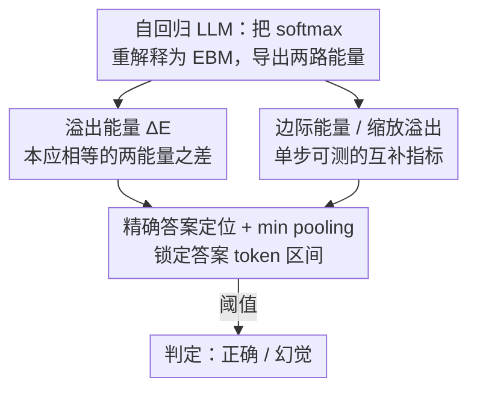

# Spilled Energy in Large Language Models

**会议**: ICLR 2026 (Poster)  
**OpenReview**: [https://openreview.net/forum?id=EXFKk4Y3yc](https://openreview.net/forum?id=EXFKk4Y3yc)  
**代码**: https://github.com/OmnAI-Lab/spilled-energy/ (有)  
**领域**: LLM可解释性 / 机制分析 / 幻觉检测  
**关键词**: 能量模型(EBM)、幻觉检测、训练无关、softmax、自回归

## 一句话总结
本文把 LLM 最后那层 softmax 分类器重新解释成一个能量模型(EBM)，发现"按概率链式法则本应相等、却分别在相邻两个解码步被读出"的两路能量之间存在差值——称之为"溢出能量(spilled energy)"，并证明这个**完全训练无关、直接从 logits 读出**的差值与模型出错强相关，在 9 个基准、多个 SOTA 模型上做幻觉检测，跨任务泛化能力显著强于需要逐任务训练的探针分类器。

## 研究背景与动机

**领域现状**：LLM 幻觉检测里有一条"白盒/内省"路线——不靠外部事实核查，而是看模型内部信号判断它这次答得对不对。代表作是 Orgad et al. (2025)：在模型内部表征上训练一个**探针分类器(probing classifier)**，专门盯住"精确答案 token"(exact answer tokens)的隐状态来预测对错；它还发现真实性信号高度集中在这些精确答案 token 上。

**现有痛点**：探针分类器有个致命问题——**不跨任务泛化**。Orgad 自己在论文里承认"probing classifiers do not generalize across different tasks"。本文复现的跨数据集混淆矩阵(Fig. 4a)显示：探针一旦离开训练分布，性能立刻塌到 62–64%，只比随机猜(50%)好一点点。而 LLM 是基础模型、用户在"野外"千奇百怪地用，根本没法预知该挂哪个探针；更糟的是最优的 token–层组合还依赖数据集，分类器权重得逐任务动态更新，这与"基础模型一招通吃"的部署诉求天然冲突。

**核心矛盾**：要么用训练无关的简单基线(logit 置信度、p(true))，但这些在文献里公认很弱；要么用强一点的训练式探针，但它换个任务就废。检测能力和泛化能力之间被这条"要不要训练"的鸿沟割裂。

**本文目标**：找一个**既不用训练、又跨任务泛化、还有数学原理支撑**的内部信号，把对错检测从"逐任务调参"中解放出来。

**切入角度**：作者借鉴 Grathwohl et al. (2020) "你的分类器其实偷偷是个 EBM"的视角，把 LLM 末端 softmax 当成 EBM 来看。一旦把自回归概率链按链式法则展开，会发现链条里有两个量**理论上必须相等**(它们都等于同一个序列能量)，却是在**相邻两个解码步、由 softmax 的不同部件**分别算出来的。

**核心 idea**：用"这两个本应相等的能量之间的实际差值"当幻觉信号——差值越大，说明模型在这一步对自身预测的能量建模越不自洽，越可能在胡说。因为它纯由 EBM 数学和概率链式法则推出，无需训练任何检测器。

## 方法详解

### 整体框架

整篇方法可以分三步看：**(1)** 把自回归 LLM 的 softmax 重写成 EBM，从每一步 logits 里读出两路能量；**(2)** 利用概率链式法则指出"相邻两步本应相等的能量"之间存在差值——溢出能量 $\Delta E_\theta$，这就是核心检测信号；**(3)** 配合"精确答案 token 定位 + 池化 + 阈值"把这个信号落地成一个句级幻觉判别器。整套流程不训练任何参数，全部从模型自身的输出 logits 即时算出。

### 关键设计

**1. 把 softmax 重解释为 EBM：从 logits 里读出两路能量**

自回归 LLM 用链式法则建模序列概率 $p(x_{i:1}) = \prod_i p_\theta(x_i \mid x_{i-1:1})\, p_\theta(x_1)$，而每个条件概率其实是个**判别式 softmax 分类器**：给定前文，在词表 $V$ 上预测下一个 token。EBM 的视角是：概率 $p_\theta(x) = \exp(-E_\theta(x))/Z_\theta$，能量越低概率越高。把 Grathwohl 的"trick"套到 LLM 的条件概率上，softmax 的分子(被采样 token 的 logit)和分母(对全词表的 log-sum-exp)恰好对应两路能量：

$$E^{\ell}_\theta(x_{i:1}) = -\,\theta(x_{i-1:1})[\mathrm{id}(x_i)], \qquad E^{m}_\theta(x_{i-1:1}) = -\log \sum_{k=1}^{V} \exp\theta(x_{i-1:1})[k].$$

其中 $E^{\ell}_\theta$ 是"被采样 token 的能量"——直接取那个 token 的 logit 取负(这正是文献里被叫做"logit 置信度"的经典基线)；$E^{m}_\theta$ 是"对所有可能 token 做边际化后的能量"，即 softmax 分母的负 log-sum-exp，单步即可测。这一步是后面一切的地基：它把"对错信号"从需要训练的隐状态探针，搬到了**人人可读、无需训练**的输出 logits 上。

**2. 溢出能量 $\Delta E$：两个本应相等的能量之间的差，就是出错信号**

把负对数似然用能量重写，再按 Eq. (2) 的方式沿序列展开，会得到一个关键观察：在相邻两步里出现的 $E^{\ell}_\theta(x_{i:1})$(第 $i$ 步读的 logit 能量)和 $-E^{m}_\theta(x_{i:1})$(第 $i{+}1$ 步读的边际能量)**理论上都应等于同一个序列能量 $E_\theta(x_{i:1})$**，因此应当抵消为零。但它们是在**不同时间步、由 softmax 的不同部件**测出来的，交叉熵训练只用真值 token 的监督、从不显式约束这个一致性，于是实际上并不为零。作者把这个差值定义为溢出能量：

$$\Delta E_\theta(x_{i:1}) \;\triangleq\; -E^{m}_\theta(x_{i:1}) + E^{\ell}_\theta(x_{i:1}) \;=\; -\log\sum_k \exp\big(\theta(x_{i:1})[k]\big) \;+\; \theta(x_{i-1:1})[\mathrm{id}(x_i)].$$

理想自洽时 $\Delta E_\theta = 0$；现实中它非零，而且经验上**这个非零差值与模型出错强相关**(Fig. 2c/2d)：正确与错误答案的 $\Delta E$ 分布很容易用一个简单阈值分开。直觉上，当模型对当前预测的能量地形建模越不自洽，溢出越大，越可能在产生事实错误、偏见或推理崩塌。和 logit 基线的区别在于：logit 只看"被采样 token 多有信心"，而溢出能量看的是"模型对这个 token 的两种能量度量有多矛盾"——后者捕捉到 logit 看不见的内部不一致。

**3. 边际能量与缩放溢出：单步可测的互补指标**

除了需要跨两步的溢出能量，作者还把**边际能量 $E^{m}_\theta(x_{i:1})$**单独拿出来当检测量——它只需单步即可算(就是 softmax 分母那项)，刻画模型在该步整体的"能量水位"。两者互补：溢出能量抓"步间不一致"，边际能量抓"单步绝对水平"。进一步，作者把二者相乘得到**缩放溢出能量** $\Delta E_s(x_{i:1}) = |E^{m}_\theta(x_{i:1})|\,\Delta E_\theta(x_{i:1})$，用边际能量的幅度去放大溢出信号。实验里这几个指标互有胜负：指令微调模型上溢出能量 $\Delta E$(配 min 池化)通常最强，而在未对齐的 Mistral 上边际能量偶尔略占上风——它们都是从同一套 softmax logits 派生、可高效计算的训练无关量。

**4. 精确答案 token 定位 + 池化：把信号落到"答案"上而非整句**

直接对整句算溢出能量会有大量假阳性：标点(逗号、句号)和句首词处，下一 token 的概率质量天然分散在很多合理选项上，导致即便答案正确，溢出能量也被抬高。所以本文沿用 Orgad 的洞察——真实性信号集中在**精确答案 token**(如"意大利首都是 Rome"里的 Rome、算术题里的最终数字)——先用一次"让 LLM 给简短答案"的提示把答案 token 区间 $[u, w] \subseteq [i{+}1, N]$ 定位出来，只在这个区间里读能量。当答案跨多个 token 时再用**池化(pooling)**汇成一个句级分数；实验比较了多种池化，发现 **min 池化整体最优**。消融显示这一步至关重要：限定到精确答案后，溢出/边际能量的 AuROC 暴涨约 24%，而 logit 基线只涨 9% 左右——说明能量类信号对"读哪个 token"远比 logit 敏感，定位是把它用好的前提。

### 损失函数 / 训练策略
无。本文是**完全训练无关**的检测方法：不训练新模型、不训探针、不做激活消融，所有指标都是在推理时直接从输出 logits 读出并计算，因此天然零训练开销、对预训练版和指令微调版同样适用。

## 实验关键数据

### 主实验

两套互补设置：**(a)** 受控合成算术(13–14 位整数大数加法，人为注入 Easy[1000,10000]/Medium[100,1000]/Hard[1,10] 三档误差)，在 Llama-3 8B、Qwen-3 8B、Mistral-7B-Instruct 上验证溢出能量能把正确/错误解清晰分开，且**在最难的 [1,10] 档优势最大**；**(b)** 9 个真实 NLP 基准(HotpotQA、HotpotQA-WC、IMDB、Math、MNLI、Movies、TriviaQA、Winobias、Winogrande)，指标 AuROC，覆盖 LLaMA/Mistral 的 base 与 Instruct 共 4 个模型。下表为 9 基准平均 AuROC：

| 模型 | 方法 | 平均 AuROC | 是否需训练 |
|------|------|-----------|-----------|
| LLaMA-3-Instruct | p(true) | 51.29 | 否 |
| LLaMA-3-Instruct | Orgad 探针分类器 | 64.16 | **是** |
| LLaMA-3-Instruct | Logit $E^{\ell}$ | 54.62 | 否 |
| LLaMA-3-Instruct | Marginal $E^{m}$ (Max) | 65.72 | 否 |
| LLaMA-3-Instruct | **Spilled $\Delta E$ (Min)** | **73.16** | 否 |
| Mistral-Instruct | Orgad 探针分类器 | 65.56 | **是** |
| Mistral-Instruct | Logit $E^{\ell}$ | 63.44 | 否 |
| Mistral-Instruct | **Spilled $\Delta E$ (Min)** | **77.49** | 否 |

溢出能量在不训练的前提下，平均 AuROC 全面超过 logit 与 p(true)，并大幅领先需要训练的 Orgad 探针。跨数据集混淆矩阵(Fig. 4)更说明问题：探针在对角线(同分布)表现尚可，一离开就塌到近随机；而溢出能量在大量**非对角格子**上正向改进(TriviaQA、HotpotQA、Movies 甚至连对角线也被超过)。另在 Gemma-Instruct 上溢出能量 4B 达 75.89、1B 达 68.67，说明跨模型规模也成立。

### 消融实验

| 配置 | 平均 AuROC (含精确答案) | 相对"不定位"的提升 |
|------|------------------------|--------------------|
| Logit $E^{\ell}$ (Max) | 56.12 | +9.23 |
| Orgad 探针 (Mean) | 63.67 | – |
| Marginal $E^{m}$ (Min) | 67.23 | +20.02 |
| **Spilled $\Delta E$ (Min)** | **73.32** | **+24.06** |

### 关键发现
- **精确答案定位是能量信号的命门**：定位后溢出/边际能量涨约 24%，而 logit 只涨 9%——能量类信号对"读哪个 token"极度敏感，不定位会被标点/句首词的高溢出淹没成假阳性。
- **指令微调对两类信号方向相反**：logit 在微调后反而退化(LLaMA 56.89%→54.62%)，暗示微调带来过度自信；而溢出能量持续受益(LLaMA 68.69%→73.16%、Mistral 73.94%→77.49%)——这是它相对经典置信度的一个反直觉优势。
- **高方差不是缺点而是训练无关的体现**：溢出/边际能量的跨数据集标准差比探针大，因为它依赖每个领域各自的能量地形(Math/HotpotQA 峰尖、Winobias/IMDB 平缓)；探针虽方差小，但跨测均值常年卡在 62–64% 的近随机水平。
- **池化策略**：min 池化在各方法上整体最优。

## 亮点与洞察
- **"本应相等却不等"是个极优雅的信号源**：把概率链式法则里一个恒等式(两能量应抵消为零)反过来用——现实里它不为零，这个"违约量"本身就是模型不自洽/出错的探针，且无需任何监督。这种"用理论恒等式的破缺当检测信号"的思路，可迁移到任何有内部一致性约束的模型。
- **真正的零训练 + 跨任务泛化**：所有指标都从 logits 即时读出，部署时不挂任何任务相关权重，正好对上"基础模型在野外用"的现实——这是相对 Orgad 探针最实在的工程价值。
- **把 logit 置信度纳入统一框架**：经典 logit 基线其实就是 $E^{\ell}_\theta$ 这一路能量，本文等于给"为什么 logit 弱"给出了 EBM 解释，并指出还有"步间不一致"这一路被忽略的信号。

## 局限与展望
- **作者承认的局限**：在语义不重要的 token(标点、句首词)上会产生假阳性——那里下一 token 概率质量天然分散，溢出能量被抬高；因此强依赖"精确答案 token 定位"是否准确。
- **定位环节是单点风险**：整套方法的高分都建立在能准确锁定 $[u,w]$ 答案区间上，而定位本身又依赖"让 LLM 给简短答案"的提示，提示失败或答案不可定位(开放式生成、长链推理)时方法可能退化，论文未深入这类场景。
- **方差与可比性**：跨数据集方差大意味着同一阈值未必跨域通用；横向比"平均 AuROC"时不同数据集难度不一，单看均值需谨慎。
- **改进思路**：可探索把溢出能量做成逐 token 的连续可视化信号用于生成时干预(steering)，或与语义熵等其他训练无关信号融合，弥补在非答案 token 上的噪声。

## 相关工作与启发
- **vs Orgad et al. (2025)**：同样聚焦"精确答案 token"、同样在白盒下做幻觉检测，但 Orgad 用**逐任务训练的探针分类器**，本文用**训练无关的 EBM 能量差**。区别在于泛化：探针出分布即近随机(62–64%)，溢出能量跨任务稳健(平均 73–77%)，本文优势是部署零成本、劣势是方差更大、依赖答案定位。
- **vs ITI / 激活干预 (Li et al. 2024)**：ITI 在推理时改写少数注意力头的激活去"导正"真实性；本文不改任何激活，只**读**内部值做检测，更轻量但只检测不修复。
- **vs EBM-OOD (Liu et al. 2020) / Grathwohl et al. (2020)**：能量分数早被用于 OOD 检测与"判别器即 EBM"的训练，本文把这套视角第一次系统搬到**自回归 LLM 解码的步间一致性**上，提出 LLM 专属的"溢出能量"概念。
- **vs 语义熵 (Farquhar et al. 2024) / DeepConf (Fu et al. 2025)**：都属训练无关的内部信号检测，但语义熵靠多次采样估计语义不确定性、DeepConf 靠模型内置置信度过滤推理轨迹；本文只需单次前向的 logits、且有 EBM 数学原理支撑，计算更省。

## 评分
- 新颖性: ⭐⭐⭐⭐⭐ 把"概率链式法则里本应抵消的能量差"提炼成训练无关的幻觉信号，视角独到且有数学原理
- 实验充分度: ⭐⭐⭐⭐ 9 基准 × 多模型(含 base/Instruct、Gemma 1B/4B)+ 合成算术受控实验，对照 Orgad/logit/p(true) 齐全；但缺开放式长生成场景
- 写作质量: ⭐⭐⭐⭐ 推导清晰、图示直观，但能量符号较密、部分表格排版需对照原文
- 价值: ⭐⭐⭐⭐⭐ 零训练 + 跨任务泛化正中"基础模型野外部署"痛点，实用性强且易复现

<!-- RELATED:START -->

## 相关论文

- [\[ICML 2026\] Towards Atoms of Large Language Models](../../ICML2026/interpretability/towards_atoms_of_large_language_models.md)
- [\[ICLR 2026\] Medical Interpretability and Knowledge Maps of Large Language Models](medical_interpretability_and_knowledge_maps_of_large_language_models.md)
- [\[ICLR 2026\] Precise and Interpretable Editing of Code Knowledge in Large Language Models](precise_and_interpretable_editing_of_code_knowledge_in_large_language_models.md)
- [\[ICLR 2026\] Neuron-Level Analysis of Cultural Understanding in Large Language Models](neuron-level_analysis_of_cultural_understanding_in_large_language_models.md)
- [\[ICLR 2026\] What Do Large Language Models Know About Opinions?](what_do_large_language_models_know_about_opinions.md)

<!-- RELATED:END -->
