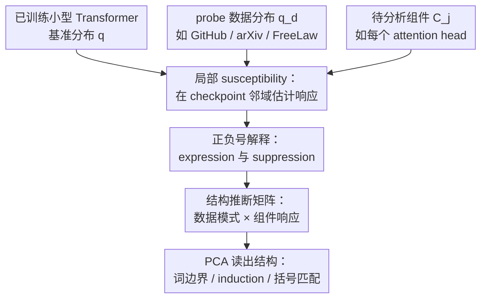

# Structural Inference: Interpreting Small Language Models with Susceptibilities

**会议**: ICLR2026  
**OpenReview**: [https://openreview.net/forum?id=J4GYMiE3JT](https://openreview.net/forum?id=J4GYMiE3JT)  
**代码**: 无  
**领域**: 可解释性 / 机制可解释性  
**关键词**: susceptibility、结构推断、小语言模型、注意力头、SGLD  

## 一句话总结
这篇论文把小型语言模型看成一个贝叶斯统计物理系统，用数据分布的微小扰动诱发模型组件响应，定义 susceptibility 来刻画注意力头对不同数据模式的表达或抑制，并在 3M 参数两层 attention-only Transformer 上用 PCA 自动分离出词边界、induction circuit 和括号匹配等已知结构。

## 研究背景与动机
**领域现状**：机制可解释性常用 ablation、activation patching、direct logit attribution 等手段判断模型内部组件在做什么。研究者会人为扰动某个注意力头或 MLP，再观察 loss、logit 或行为变化，从而推断这个组件是否参与了某个 circuit。

**现有痛点**：这类方法虽然直观，但通常是“对组件动刀”，再看输出坏在哪里。它容易把模型推到非自然分布上，也很难系统回答另一个问题：如果数据分布本身稍微偏向 GitHub、法律文本、数学题或 arXiv，模型内部哪些组件会随之改变？换句话说，现有工具更擅长测试一个已经提出的 circuit 假设，却不一定擅长从数据模式反向发现内部结构。

**核心矛盾**：语言模型内部结构不是孤立长出来的，它应当和训练数据里的统计模式相互对应；但如果只看单个 token 的 loss 或单个 head 的 ablation，数据模式、组件角色和训练后验几何之间的联系会被拆散。本文的核心问题是：能否用一个统一的响应函数，把“数据分布怎么变”和“某个组件的局部行为怎么变”连起来？

**本文目标**：作者希望构造一种面向组件的线性响应指标。这个指标既要能在单个训练 checkpoint 附近估计，又要能分解到 token 级别，还要能把多个 probe dataset 与多个 attention head 组织成矩阵，从矩阵结构里自动读出模型内部功能模块。

**切入角度**：论文借用统计物理中的 susceptibility 思想：复杂材料的内部结构可以通过外部场的微小扰动和系统响应来探测。把这个类比搬到神经网络中，数据分布的微小混合扰动就是外部场，组件相关的 loss observable 是观测量，响应的一阶导数就是 susceptibility。

**核心 idea**：用数据分布扰动诱发的贝叶斯局部后验响应替代直接 ablation，把小模型中的注意力头解释为对不同数据模式有正负 susceptibility 的结构单元。

## 方法详解

### 整体框架
本文的方法不是训练一个新模型，而是在一个已训练的小型 Transformer checkpoint 附近做结构探测。输入包括一个基准数据分布 $q$、若干 probe 数据分布 $q_d$、一组待分析组件 $C_j$（实验中是 attention heads），以及局部 SGLD 采样得到的权重扰动。输出是两类可解释对象：组件对数据分布扰动的整体 susceptibility，以及 token 级 susceptibility 矩阵经 PCA 后得到的数据模式和组件 loading。

从流程上看，论文先在理论上定义“数据扰动到组件 observable 的一阶响应”，再把它局部化到单个 checkpoint，随后把响应矩阵送入 PCA 做结构推断。由于这个 pipeline 很清晰，整体框架可以概括为下面这张图：

### 关键设计
**1. 局部 susceptibility：把数据分布扰动变成组件响应**

论文首先定义一个数据分布的单参数扰动，例如把原分布 $q$ 和 probe 分布 $q'$ 混合成 $q_h=(1-h)q+hq'$。对任意 observable $\phi(w)$，susceptibility 是其后验期望对扰动强度 $h$ 的一阶导数：$\chi=\frac{1}{n\beta}\frac{\partial}{\partial h}\langle\phi\rangle_{\beta,h}\vert_{h=0}$。通过协方差恒等式，它可以写成 $\chi=-\operatorname{Cov}_{\beta}(\phi,\Delta L)$，其中 $\Delta L$ 是数据扰动带来的 population loss 变化。

真正关键的是 observable 的选择。本文把组件 $C$ 视为参数空间分解 $W=U\times C$ 中的一部分，并用 $\phi_C(w)=\delta(u-u^*)[L(w)-L(w^*)]$ 描述“只让组件附近参数变化时的 loss observable”。这样 susceptibility 不再是模型整体对数据的敏感性，而是某个 attention head 对某类数据分布变化的敏感性。这个定义把数据、组件和 loss landscape 几何放在同一个公式里，是后续结构推断的理论支点。

**2. SGLD 局部化：让贝叶斯响应能在单个 checkpoint 上估计**

完整贝叶斯后验不可采样，作者也并不关心训练全过程中的所有可能模型，而是关心一个具体 checkpoint $w^*$ 附近的结构。因此方法把先验换成以 $w^*$ 为中心的高斯局部先验，得到局部 Gibbs posterior：$p(w;w^*,\beta,\gamma)\propto \exp\{-n\beta L_n(w)-\frac{\gamma}{2}\|w-w^*\|_2^2\}$。这一步把“全局后验响应”变成“checkpoint 邻域内的响应”，可以用 SGLD 在局部采样。

估计时，作者用原数据 batch 计算 $L_n(w)$，用混合数据 batch 计算 $L_n^{\delta h}(w)$，再用 Monte Carlo 协方差形式近似 susceptibility。实验中的混合比例为 $\delta h=0.1$，regular susceptibility 使用 4 条 chain 和 200 draws，per-token susceptibility 使用 100 draws。这个设计的意义在于，它不像普通 ablation 那样直接把 head 置零，而是在局部 loss landscape 中看组件权重的自然扰动如何和数据扰动协变，因此得到的是一种更接近“线性响应”的信号。

**3. 正负号解释：把 per-token susceptibility 翻译成表达与抑制**

为了让指标可读，论文把整体 susceptibility 分解到 token 级别。对上下文和下一个 token $(x,y)$，per-token susceptibility 衡量组件 $C$ 的局部 loss observable 与 token loss $\ell_{(x,y)}(w)=-\log p(y|x,w)$ 的协方差关系。作者进一步对矩阵按行中心化，去掉只依赖组件、不依赖 token 的常数项，得到 standardized susceptibility。

这个标准化后的符号解释非常重要：负 susceptibility 表示当组件 $C$ 的扰动让整体 loss 变差时，$y$ 在上下文 $x$ 下也更不可能，说明该组件在机制上支持或表达这个 continuation；正 susceptibility 表示那些让组件局部 loss 变差的扰动反而会提高 $p(y|x)$，说明该组件倾向于反对或抑制这个 continuation。论文因此把负号称为 expression，把正号称为 suppression。这个解释让可视化不再只是“绿色/红色相关性”，而是能说明某个 head 是在推动 induction、词边界还是括号闭合。

**4. 结构推断矩阵：用 PCA 从响应模式中恢复内部模块**

有了每个组件对每个 probe 的响应后，论文构造响应矩阵 $X=(\hat{\chi}^{C_j}_d)_{d\in D,j\in H}$；在 token 级分析中，则对每个数据集采样 token，把矩阵扩展成“token 样本 × attention head”的 per-token susceptibility 矩阵。作者的结构推断假设是：如果数据分布中存在若干模式，而模型组件分别耦合到这些模式，那么响应矩阵应当呈现低秩或近低秩结构。

因此，PCA 在这里不是普通降维可视化，而是解释工具：左侧主成分对应数据中的模式，右侧 loading 对应模型中的组件结构。在实验里，PC1 对应词边界分割，PC2 把 induction heads 与 layer-1 multigram heads 分开，PC3 与右括号/括号匹配相关。这个设计把“发现 circuit”从人工逐个 ablate head 的过程，转成对 susceptibility 矩阵做数据分析。

### 一个完整示例
假设我们想知道某个 attention head 是否和 GitHub 代码数据中的重复 token、空格或格式符号有关。方法先把基准分布 $q$ 与 GitHub probe 分布按 $\delta h=0.1$ 混合，形成轻微偏向 GitHub 的数据分布；然后在 checkpoint $w^*$ 附近用 SGLD 采样多个权重扰动，分别计算原数据 loss、混合数据 loss，以及只关注目标 head 的局部 observable。

对一个具体 token，例如代码或文档中的空格 token，方法再计算它的 per-token susceptibility。如果某个 head 对空格 token 的负 susceptibility 很大，说明这个 head 的“好方向”会提高该空格在上下文中的概率，可以理解为它表达这个 continuation。论文在 GITHUB-ALL 的分析中发现，head 0:1 对空格 token 的负 susceptibility 均值比 0:0 更大，空格本身又出现了 42,764 次，因此它能解释 0:1 在 GitHub 数据上成为负向 outlier 的相当一部分。

### 损失函数 / 训练策略
本文没有提出新的训练损失；模型是已有的 3M 参数、两层 attention-only Transformer，用 next-token prediction 在 Pile 子集上训练。分析阶段使用的 empirical loss 是标准自回归负 log-likelihood：对长度 $K=1024$ 的上下文，逐 token 累加 $-\log p(t_{k+1}\mid t_{\le k},w)$ 并取平均。

SGLD 参数来自 Wang et al. (2024)：$\gamma=300$、$n\beta=30$、步长 $\epsilon=0.001$、batch size 64、4 条 chain；regular susceptibility 用 200 draws，per-token susceptibility 用 100 draws 且 batch size 16。混合数据构造时，预训练数据集规模为 $1,000,000$，probe 数据集通常取 $100,000$ 行，通过确定性的 interleaving 算法按 $\delta h$ 均匀插入 probe 样本，再 shuffle 后用于 SGLD minibatch。

## 实验关键数据

### 主实验
实验对象是一个 3M 参数、2 层、每层 8 个 attention head、无 MLP 的小型 Transformer，tokenizer 是截断到 5,000 token 的 GPT-2 tokenizer。作者在 Pile 的多个未版权子集上做 probe，包括 GitHub、Common Crawl、PubMed、USPTO、FreeLaw、arXiv、DM Mathematics、Enron Emails、HackerNews 等；每个主要子集取 100k rows，另有 PILE1M 作为混合基准。

| 分析对象 | 输入矩阵 / 数据量 | 关键指标或读出 | 结果 |
|----------|------------------|----------------|------|
| token 级 PCA，Layer 0 | 每个数据集随机采样 $N=20,000$ tokens，列为 8 个 head | 前 3 个 PC 方差解释率 | $95.34\% / 1.83\% / 0.73\%$ |
| token 级 PCA，Layer 1 | 同上，列为 Layer 1 的 8 个 head | 前 3 个 PC 方差解释率 | $99.14\% / 0.39\% / 0.11\%$ |
| PC1 | top positive/negative susceptibility token 的 pattern loading | 数据模式解释 | 主要对应 word segmentation：word endings、induction、right delimiters 与 word starts、spaces 呈相反方向 |
| PC2 | data loading + component loading | circuit 解释 | 分离 induction circuit：1:6、1:7 与 0:1、0:4、0:5 等已知 induction/previous-token/current-token heads 对齐 |
| PC3 | right delimiter loading + head loading | circuit 解释 | 与括号匹配相关，0:7、1:3、1:5 等 Dyck heads 出现在重要 loading 中 |

这些结果的重点不在于提升某个 benchmark 分数，而在于 susceptibility 矩阵是否能恢复已知机制结构。PC2 能稳定把 induction circuit 从其他 layer-1 multigram heads 中区分出来，并且这个结论在 4 个独立训练 seed 上成立，这是论文最强的经验验证。

### 消融实验
论文没有做传统意义上“去掉模块再重新训练”的消融，而是用多组 sanity checks 和与 zero ablation 的对照来验证 susceptibility 信号不是普通 loss 或 ablation delta 的重复。下面的表格按论文中的检查项整理：

| 检查 / 对照 | 设置 | 关键指标 | 说明 |
|-------------|------|----------|------|
| susceptibility vs zero ablation | heads 0:0、1:2；datasets GITHUB、DM_MATHEMATICS | Pearson $r\approx 0.003, -0.001, 0.001, -0.009$ | 与 ablation delta 几乎不相关，说明 susceptibility 捕捉的是另一类信号 |
| per-token susceptibility 汇总解释整体 susceptibility | GITHUB-ALL，比较整体 susceptibility 与 token 汇总 | Pearson $r=0.958$，拟合斜率 $9.794$ | 因 $\delta h=0.1$，理论预期斜率约为 10，验证 token 分解可解释整体响应 |
| context length 效应 | 160 个 contexts，多个 Pile 子集 | Layer 1 multigram heads 1:0-1:5 从长度 10 后增长最明显 | 信号依赖上下文，不只是 token identity；长上下文更容易出现 induction pattern |
| GITHUB-ALL head 0:0 vs 0:1 | 约 163k tokens | scaled sum: 0:0 为 $0.016$，0:1 为 $-0.040$ | 0:1 的负向异常很大程度来自空格 token；空格出现 42,764 次 |
| CC vs GITHUB-ALL | head 0:0 | GITHUB-ALL scaled sum $0.016$，CC scaled sum $-0.0013$ | CC 接近基准 Pile，正负 contribution 大但相互抵消，最终 susceptibility 接近 0 |

### 关键发现
- susceptibility 与 zero ablation 的相关性接近 0，说明它不是“换一种颜色画 ablation 结果”。它更像在局部后验里测量组件权重扰动、token loss 和数据分布变化之间的协变结构。
- PC1 解释了绝大多数 variance，但它主要是全局词边界/分词结构；真正体现 circuit 区分能力的是 PC2 和 PC3，分别对应 induction circuit 与括号匹配结构。
- token 级分解是必要的。整体 susceptibility 能告诉我们某个 head 对某个 probe dataset 敏感，但只有 per-token susceptibility 才能解释敏感性来自空格、右括号、word endings 还是 induction pattern。
- 方法在小模型上非常清楚，是因为模型结构简单、数据模式也相对容易枚举；作者明确承认更大模型上 PCA 本身可能不够，需要 UMAP 或更复杂的数据分析。

## 亮点与洞察
- 把统计物理里的 susceptibility 引入机制可解释性很有启发性。它把模型组件解释成对“外部数据场”有响应的结构单元，比单纯问“ablate 后 loss 涨多少”更能体现数据模式与内部机制的耦合。
- 正负号解释很漂亮：负 susceptibility 对应 expression，正 susceptibility 对应 suppression。这使得“抑制某个 continuation”可以被系统地测量，而不是只在个别 circuit 案例里靠 logit 方向观察。
- 结构推断的矩阵视角很适合扩展。只要能定义 probe distribution 和组件集合，就可以把不同数据模式、层、head、MLP neuron 或子网络放进同一个响应矩阵，再用线性或非线性数据分析寻找结构。
- 论文没有把 susceptibility 包装成直接替代 ablation 的工具，而是强调它捕捉的是不同信号。这一点很重要：在解释模型时，多一种互补测量往往比追求一个万能 attribution 分数更现实。

## 局限与展望
- 最大局限是 SGLD 后验采样质量。SGLD 样本相关性强，超参数对估计的影响仍不清楚；多条 chain 只能部分缓解，不能保证得到理想的局部后验样本。
- 计算成本较高。regular susceptibility 在小模型上已经用到 10 张 A100、每张约 20 小时；per-token susceptibility 使用 16 张 A100、每张约 50 小时。附录估计更大模型时成本随组件数、probe 数据集数和 SGLD samples 增长。
- 实验模型很小，只有 3M 参数、两层 attention-only Transformer，且内部 circuit 已经被前人充分研究。本文更像是方法验证：它证明 susceptibility 能恢复已知结构，但尚未证明它能在复杂大模型中发现真正新且可靠的结构。
- PCA 在小模型中足够好，但大模型的数据模式和组件角色会复杂得多。后续可以把 structural inference 与 UMAP、ICA、稀疏字典学习、聚类或因果验证结合起来，先用 susceptibility 提出候选结构，再用更传统的机制实验确认。

## 相关工作与启发
- **vs ablation / activation patching**: ablation 直接干预激活或组件，看输出变化；本文通过局部权重扰动和数据分布扰动的协方差测量组件响应。前者适合验证具体假设，后者更适合从 probe 数据模式反向发现组件结构。
- **vs influence functions**: 影响函数研究上调某个训练样本对测试点 loss 的影响。论文指出 influence function 可以看成 susceptibility 的一个特殊情况；本文不同之处在于 observable 绑定到模型组件，而不是只绑定到测试样本 loss。
- **vs refined LLC / singular learning theory**: Wang et al. (2024) 的 refined learning coefficient 用局部几何分析组件复杂度，本文选择的 observable 与该思想相连，可以理解为观察数据分布变化如何改变某个组件附近的局部学习几何。
- **vs suppression / copy-suppression work**: 以往 suppression 常通过 direct logit effect 或特定任务 circuit 观察到；本文提供了 token 级正负 susceptibility，让 expression 与 suppression 成为可批量统计的现象。

## 评分
- 新颖性: ⭐⭐⭐⭐⭐ 从统计物理线性响应出发定义组件级 susceptibility，视角新且与机制可解释性结合自然。
- 实验充分度: ⭐⭐⭐⭐☆ 小模型验证很扎实，sanity checks 和已知 circuit 对齐充分；但模型规模和任务复杂度仍有限。
- 写作质量: ⭐⭐⭐⭐☆ 理论推导清楚，附录细节完整；不过公式和符号密度较高，读者需要一定贝叶斯/统计物理背景。
- 价值: ⭐⭐⭐⭐⭐ 为“从数据模式发现内部结构”提供了一条可操作路线，尤其适合和现有 mechanistic interpretability 工具互补使用。

<!-- RELATED:START -->

## 相关论文

- [\[ICML 2025\] Inference-Time Decomposition of Activations (ITDA): A Scalable Approach to Interpreting Large Language Models](../../ICML2025/interpretability/inference-time_decomposition_of_activations_itda_a_scalable_approach_to_interpre.md)
- [\[ICLR 2026\] Small Transformers Don't Need LayerNorm at Inference Time: Scaling LayerNorm Removal to GPT-2 XL and Implications for Mechanistic Interpretability](small_transformers_dont_need_layernorm_at_inference_time_scaling_layernorm_remov.md)
- [\[ICML 2026\] Scalable Circuit Learning for Interpreting Large Language Models](../../ICML2026/interpretability/scalable_circuit_learning_for_interpreting_large_language_models.md)
- [\[ICLR 2026\] The Price of Amortized inference in Sparse Autoencoders](the_price_of_amortized_inference_in_sparse_autoencoders.md)
- [\[ICLR 2026\] Semantic Regexes: Auto-Interpreting LLM Features with a Structured Language](semantic_regexes_auto-interpreting_llm_features_with_a_structured_language_of_re.md)

<!-- RELATED:END -->
