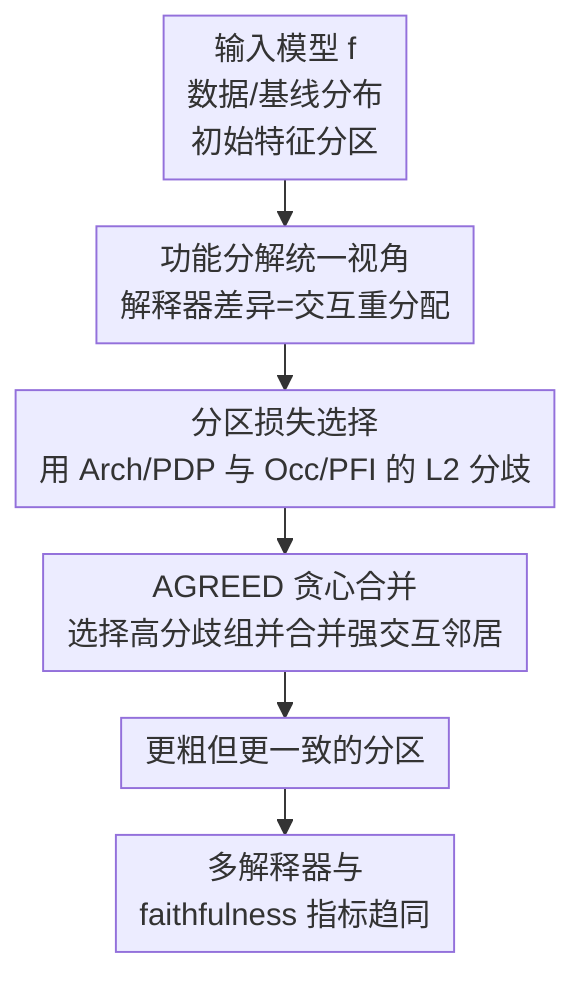

# Tackling the XAI Disagreement Problem with Adaptive Feature Grouping

**会议**: ICLR2026  
**OpenReview**: [https://openreview.net/forum?id=RClKXngVN8](https://openreview.net/forum?id=RClKXngVN8)  
**代码**: https://github.com/thalesgroup/AGREED  
**领域**: 可解释 AI / 特征归因  
**关键词**: XAI 分歧问题, 特征归因, 功能分解, 特征分组, faithfulness 评估  

## 一句话总结
本文指出后验解释器与 faithfulness 指标之所以互相打架，核心原因是不同特征组之间存在交互项，并提出 AGREED 通过自适应合并强交互特征组来降低解释方法之间的分歧，在表格数据和图像 saliency map 上都能让多种解释更趋一致。

## 研究背景与动机
**领域现状**：后验可解释方法已经非常丰富，表格任务里常见 PDP、PFI、SHAP，图像任务里常见 Occlusion、RISE、LIME、Integrated Gradients、ArchAttribute 等。它们都试图回答同一个问题：某个输入特征，或一组像素 patch，对模型当前预测到底贡献多大。现实使用时，研究者和工程师往往会把这些解释结果画成条形图或 saliency map，再根据高亮区域判断模型是否可信。

**现有痛点**：问题在于，这些解释方法经常给出彼此矛盾的答案。同一个 ResNet18 预测白狼，不同 saliency map 可能分别强调眼睛、鼻子、背景或整只动物；同一个 California Housing 模型，PFI、SHAP 和 PDP 对 Longitude 的重要性排序也会不一致。更麻烦的是，用来裁判解释器的 faithfulness / unfaithfulness 指标本身也会不一致：某个指标认为 PFI 最忠实，另一个指标却认为 SHAP 最忠实。这样一来，benchmark 并没有真正解决 disagreement problem，只是把“哪个解释器可信”的争论转移成“哪个指标可信”的争论。

**核心矛盾**：本文把矛盾压到一个更底层的数学原因上：当模型在不同特征组之间存在交互时，一个组的重要性就不再是单独可分配的量。不同解释器本质上是在用不同规则重新分摊这些组间交互项，faithfulness 指标也在用不同权重衡量重建误差。只要交互项还横跨多个特征组，不同方法就很难自然达成一致。

**本文目标**：作者不试图宣布某个解释器或某个 faithfulness 指标是唯一正确答案，而是转向另一个目标：能否改变“解释单元”的划分，让强交互的特征被放进同一个组里。若分组后模型相对于这些组近似可加，那么每个组的贡献就会变得更明确，多种解释方法和多种指标自然会更接近。

**切入角度**：已有 functional decomposition 工作已经能把多种特征解释统一到函数分解和博弈论视角下，但通常默认解释的是单个 feature，或者没有认真处理“feature group / patch partition”。本文把这个统一框架扩展到特征分组场景，并把“寻找更好分组”本身当成一个优化问题。

**核心 idea**：用自适应特征分组代替固定粒度解释：先从细粒度单特征或小 patch 出发，找到导致解释器分歧最大的组间交互，再逐步合并这些组，使模型在新的组划分下更接近 groupwise additive。

## 方法详解
### 整体框架
本文的方法叫 AGREED，全称是 Adaptive Grouping to REduce Explanation Disagreements。它先用 functional decomposition 说明不同解释器如何处理组间交互，再构造一个适合优化分区的 disagreement loss，最后用贪心算法不断合并交互最强的特征组。输出不是新的解释器，而是一套更合理的 feature partition；在这套分区上，PDP / PFI / SHAP / LIME / Occlusion / IG 等解释器的结果会更接近。

从数据形态看，表格和图像采用同一套原则，但实现约束不同。表格数据通常令基线分布 $B$ 等于数据分布 $D$，得到一套可用于解释任意样本的全局分组；图像解释则固定待解释图像 $x$ 和基线图 $b$，把 $D=\delta_x$、$B=\delta_b$，因此每张图都需要单独运行 AGREED，并且像素 patch 只能与共享边界的邻居合并，以保持 patch 连通。

### 关键设计
**1. 功能分解统一视角：把解释器分歧写成组间交互的重分配问题**

作者先考虑一个模型 $f:X\to R$ 和一个特征分区 $P:[d]\to[D]$。在 marginal decomposition 中，模型相对于基线分布 $B$ 可以写成 $f(x)=\sum_{u\subseteq[d]} f_{u,B}(x)$，其中 $|u|=1$ 是 main effect，$|u|\ge2$ 是 interaction。若把单个 feature 聚合成 group，那么某个 interaction 是否“跨组”，取决于 $P(u)$ 覆盖了几个组。

这个视角直接解释了为什么解释器会不一致。ArchAttribute / joint-PDP 只给组 $i$ 分配完全落在该组内部的项；Occlusion / joint-PFI 会把所有涉及组 $i$ 的交互都算进去；SHAP 会按 $1/|P(u)|$ 平均分摊交互；RISE / LIME 则按 Banzhaf 类规则分摊。论文用定理 3.1 概括为：各种归因都可以写成“组内效应 + 组间交互项的不同权重”。因此 disagreement problem 并不是单纯的实现误差，而是同一批跨组交互被不同规则拆账后的必然结果。

**2. Groupwise additive 目标：让分组消掉解释器和指标的共同歧义**

有了上面的分解，本文把理想状态定义成 groupwise additive：在某个区域 $R$ 内，模型可以写成 $f(x)=\omega_0+\sum_{i=1}^{D} g_{P^{-1}(\{i\})}(x)$。这意味着每个组只通过自己的子函数影响输出，不再有跨组交互。若这种结构成立，那么组 $i$ 对 gap $f(x)-\mathbb{E}_{b\sim B}[f(b)]$ 的贡献就是明确的，不需要再争论如何把交互分摊给不同组。

论文的定理 3.2 进一步说明：一旦模型相对于分区 $P$ 是 groupwise additive，常见形式的 faithfulness / unfaithfulness 指标都会同时达到 $0$，并且对任意解释器权重和指标权重都成立。这个结论很关键，因为它把“解释器一致”和“faithfulness 指标一致”放到同一个条件下：不是去选择某个解释器，而是去寻找一个让模型近似组可加的分区。

当然，把所有 feature 合成一个大组会平凡地消除组间交互，但解释也会失去意义。因此本文真正优化的是一种折中：在尽量保留较细解释粒度的同时，优先合并那些确实发生强交互、确实造成分歧的组。

**3. 分区损失选择：用 Occlusion/PFI 与 Arch/PDP 的 L2 分歧作为可优化信号**

为了让“合并哪些组”成为可计算问题，作者定义了 partition loss 需要满足的三条性质：如果模型已经 groupwise additive，损失应为 $0$；如果某个组本来与其他组可加，把它和别的组合并不应改变损失；在独立特征的 ANOVA 条件下，分区变粗时损失不应上升。这些性质避免算法为了降低某个表面指标而合并无关特征。

论文证明并不是任意 disagreement 指标都适合拿来优化。比如不用 Occlusion 的解释器配对，或者用 Pearson correlation 型 disagreement，都可能破坏上述性质。AGREED 最后选择 Arch/PDP 与 Occlusion/PFI 之间的 $L_2$ 分歧：

$$
L^{\mathrm{AGREED}}_f(D,B,P)=\mathbb{E}_{x\sim D}\left[\sum_{i=1}^{D}\left(\phi^{\mathrm{PDP/Arch}}_i(f,x,B,P)-\phi^{\mathrm{PFI/Occ}}_i(f,x,B,P)\right)^2\right].
$$

这个选择有两层好处：理论上，它满足论文定义的 partition loss 条件；计算上，PDP/Arch 和 PFI/Occlusion 是最便宜的解释器之一，适合作为反复搜索分区时的优化信号。

**4. AGREED 贪心合并：从最大分歧组出发寻找最强交互邻居**

AGREED 从最细分区开始，表格数据里通常是每个 feature 一个组，图像里是固定大小的 $W\times W$ patch。每一轮先计算每个组的 potential $\Psi(i)$，即这个组在 Arch/PDP 与 Occlusion/PFI 之间造成的平方分歧；然后选出 $\Psi(i)$ 最大的组 $i$，再估计它和候选组 $j$ 的 pairwise interaction。若 $i$ 与 $j$ 的交互最强，就把它们合并成一个新组，并更新分区与缓存张量。

表格场景下，算法利用 $D\times N\times N$ 的 $G$ 张量缓存替换操作后的模型输出差值，其中 $N$ 是 Monte Carlo 样本数。组间 interaction 用 $I$ 张量表示，融合后的新 $G$ 可以由旧 $G$ 和 $I$ 直接更新，不需要为所有已有组重新推理。整体复杂度为 $O(d^2N^2)$。图像场景中，作者把单图解释转成两点混合分布 $Q=\frac{1}{2}(\delta_x+\delta_b)$，于是同样可以调用 $B=D$ 的算法，只是 $N=2$，主要瓶颈变成 patch 数量的平方。

### 一个完整示例
以 Marketing 表格数据为例，未分组时 PDP、SHAP、PFI 对 month、day、contact 三个特征的重要性判断明显不一致。单独看 PDP 和 ICE 曲线会发现，contact=? 时 June / July 的模型输出趋势与其他 contact 值不同，而 day 的影响又依赖 month。这说明这三个变量不是三个独立的一维效应，而更像一个“联系日期与联系方式”的联合因素。

AGREED 用 $N=1000$ 个样本估计交互，并把停止阈值设为让 loss 降到原来的 $25\%$。约 30 秒后，算法把 month、day、contact 合并成一个组。合并后，PDP、SHAP、PFI 对这个新组的全局重要性几乎不再冲突；解释也从“哪个单变量更重要”变成“在不同联系方式下，月份和日期组合如何影响模型输出”。这个例子很好地说明了本文的核心立场：当变量本来就以联合方式影响模型时，强行拆成单变量解释反而会制造假的分歧。

### 损失函数 / 训练策略
本文不是训练新模型，而是训练后对已有黑盒模型做分区搜索。优化目标就是 $L^{\mathrm{AGREED}}_f(D,B,P)$，停止条件是该目标降到阈值 $\epsilon$ 以下，或者按实验设置记录不同合并阶段的折中曲线。

在表格数据中，$B=D$，AGREED 抽取 $N$ 个数据点近似期望，论文主实验里 Marketing 和 Default-Credit 使用 $N=100$，SPAM 和 NOMAO 使用 $N=50$，定性案例为了更稳定使用 $N=1000$。在图像数据中，$D=\delta_x$、$B=\delta_b$，通过混合分布 $Q$ 转成 $N=2$ 的算法；为保持图像 patch 可解释，合并只发生在共享边界的 patch 之间。

## 实验关键数据

### 主实验
论文实验覆盖三个层面：合成数据检验是否能找回真实分区，真实表格数据检验 disagreement 与 unfaithfulness 是否随分组下降，MiniImageNet 图像解释检验 saliency map 是否更一致。下面表格按论文主文结论汇总最关键的结果。

| 场景 | 对比方法 / 模型 | 评估指标 | AGREED 结果 | 主要结论 |
|------|----------------|----------|-------------|----------|
| 合成表格数据 | IGREEDY / RECURSIVE / PAIRWISE | 是否找回 ground-truth partition | AGREED、PAIRWISE、RECURSIVE 都找回真实分区；IGREEDY 有时失败 | AGREED 的搜索目标能恢复已知组可加结构 |
| 真实表格 Marketing | EBM / HGBT | PDP-SHAP、PDP-PFI、SHAP-PFI 的 $L_2$ disagreement | 随 feature group 数减少整体下降 | 虽然只优化 PDP-PFI，其他解释器配对也一起更一致 |
| 真实表格 Marketing | EBM / HGBT | Sensitivity-1、INFD、SWF | 三类 unfaithfulness 指标随分组共同趋近 $0$ | 分组缓解了指标之间的排序冲突 |
| MiniImageNet | VGG16 / ResNet18 / ConvNext | 多解释器平均 disagreement 与 INFD | 相同平均 patch size 下，AGREED 通常给出更低分歧和更低 INFD | 自适应 patch 比 QUICKSHIFT 和固定方格 patch 更适合降低 saliency map 分歧 |

图像实验尤其能体现方法的实用性。论文在 VGG16、ResNet18 和 ConvNext tiny 上比较 AGREED、QUICKSHIFT、SQUARE 三类分区。AGREED 从 $14\times14$ 小 patch 出发，每张图大约需要 1-7 秒生成 VGG16/ResNet18 分区，ConvNext 需要 4-30 秒。对于 ConvNext，QUICKSHIFT 和 SQUARE 的分歧可能停滞甚至上升，而 AGREED 是唯一能稳定降低 disagreement / unfaithfulness 的方法。

### 消融实验
| 分析项 | 观察 | 说明 |
|--------|------|------|
| 解释器配对选择 | 只有包含 Occlusion/PFI 的 $L_2$ 配对满足 partition loss 的关键性质 | 解释了为什么 AGREED 选择 Arch/PDP vs Occ/PFI，而不是任意两种解释器 |
| disagreement 度量选择 | Pearson correlation 型 disagreement 会破坏“合并可加组不应改变损失”的性质 | 相关系数看似自然，但可能鼓励无意义合并 |
| 表格模型类型 | EBM 上分组效果更明显，GBT 在大数据集上可能保留高阶交互 | EBM 主要建模二阶交互，更容易通过分组消除；深树 GBT 的高阶交互更难压低 |
| 图像初始分区 | 从小方格 patch 出发，再只合并相邻 patch | 控制 $O(d^2)$ 成本，同时保证输出 patch 连通、可视化上仍能解释 |
| 合成图像 | AGREED 和 PAIRWISE 都能找回矩形四条边的真实分组，但 PAIRWISE 随图像尺寸增长更慢 | AGREED 利用 CNN 交互局部性的假设，避免考虑所有非邻接 patch 对 |

### 关键发现
- 组间交互确实是多解释器分歧的共同来源。AGREED 只直接优化 PDP/Arch 与 PFI/Occlusion 的差异，但 SHAP 相关配对、LIME/IG 相关 saliency map 也会受益，说明优化目标抓住了比较底层的结构原因。
- faithfulness 指标的不一致不是小噪声，而是会改变解释器排序。Marketing 数据中，未分组时 Sensitivity-1、INFD、SWF 对 PDP、SHAP、PFI 的忠实度排名并不一致；随着分组合并，这些指标共同趋近 $0$。
- 分组并不等于解释变简单。它减少了“单特征解释”的歧义，但也把解释对象变成多变量函数。例如 month:day:contact 或 Delay-Aug:Delay-Sep:Bill-Sep 需要联合 PDP、条件切片或散点图来解释。
- 图像上 AGREED 往往会生成覆盖整个目标物体的大 patch，这能回答“模型看哪里”，但不一定能回答“模型看到了什么语义部件”。这也是作者在结论中提出与 concept-based 方法结合的原因。

## 亮点与洞察
- 本文最有价值的地方不是又提出一个解释器，而是把 disagreement problem 的根因转成了可操作的分区问题。这个视角很务实：如果单特征归因天然不可辨，就不要继续强行裁判单特征解释谁对谁错，而是改变解释粒度。
- 定理 3.1 和 3.2 把“解释器分歧”和“faithfulness 指标分歧”连在了一起。很多工作只讨论解释器之间的差异，本文进一步说明 benchmark 指标也会因为组间交互而互相冲突，这让论文的问题定义更完整。
- AGREED 的优化目标选得比较克制。作者没有使用昂贵的 SHAP 或复杂指标做内循环，而是用便宜的 PDP/Arch 与 PFI/Occlusion 差异作为代理，并证明这个代理有合适的 partition loss 性质。
- 对图像的处理提醒我们，saliency map 的 patch 粒度不是纯可视化超参，而会改变解释问题本身。固定方格或传统 segmentation 不一定尊重模型内部交互，自适应合并能让解释单元更贴近模型实际使用信息的方式。
- 对其他模态也有启发。文本里 token、短语、句子之间有强交互，时间序列里相邻时间段也常常联合决定输出；AGREED 的思想可以迁移为“先找交互，再决定解释单元”，而不是预先假设 token 或时间点就是最自然的解释单位。

## 局限与展望
- 最大局限是解释粒度和一致性之间存在不可避免的 trade-off。合并越多，解释器越容易一致，但组越大，用户越难理解一个组内部到底哪个子因素在起作用。对于超过三维的表格特征组，作者也承认还缺少自动可视化方法。
- AGREED 的计算复杂度仍然不低。表格算法是 $O(d^2N^2)$，高维表格或大 $N$ 会变贵；图像虽然用 $N=2$，但 patch 数仍带来平方级成本。论文通过小 patch、相邻合并和样本下采样控制成本，但这也意味着结果会受初始粒度和 Monte Carlo 估计影响。
- 方法假设输出是 disjoint feature groups。对于图像语义而言，不同概念可能共享像素区域，严格不重叠的 patch 有时会迫使算法把整只动物合并成一个大块，导致语义解释不足。作者提出未来可以结合 concept activation 或允许 overlap 的模型特定解释。
- 对高阶交互很强的模型，AGREED 可能只能告诉用户“这个模型不适合细粒度特征解释”，而不能给出漂亮解释。附录中 GBT 在 SPAM 和 NOMAO 上的表现就说明，若模型学到了很复杂的高阶交互，仅靠合并少数组并不能完全消除分歧。
- 未来可以把 AGREED 与 regional explanations 结合：先用分组减少跨组交互，再在每个复杂组内部按局部区域解释多变量函数。这样可能同时保留一致性和可读性。

## 相关工作与启发
- **vs SHAP / Integrated Gradients**: SHAP 和 IG 试图通过公理或路径积分给出更有原则的归因，但本文指出当组间交互存在时，归因的“唯一性”仍会受假设影响。AGREED 不替代它们，而是让它们在更合理的分组上更容易一致。
- **vs LIME / RISE / Occlusion / PDP / PFI**: 这些方法可统一成对 coalitional game 或 functional decomposition 的不同加权。本文的贡献在于说明它们差异不是零散经验现象，而是对同一组 interaction terms 的不同分摊规则。
- **vs PAIRWISE / RECURSIVE / IGREEDY feature grouping**: 这些方法也做特征分组，但目标和适用性不同。PAIRWISE 需要计算所有两两交互，图像上代价高；RECURSIVE 在表格上伸缩性好；IGREEDY 的停止准则在相关特征下可能不稳定。AGREED 用解释器分歧本身作为合并目标，更直接服务于 XAI disagreement problem。
- **vs regional explanations**: Laberge et al. 2024 通过限制 baseline distribution 到规则区域来降低表格解释分歧，但不适用于像素。AGREED 改为改变 feature partition，因此能同时处理表格和图像。
- **vs overlapping patch / self-attributing neural networks**: 一些模型特定方法允许重叠 patch，并通过架构约束让模型自带解释。AGREED 保持模型无关，因此只能输出不重叠分区；优势是适用面广，代价是图像语义上有时不够细。

## 评分
- 新颖性: ⭐⭐⭐⭐☆ 把解释器与 faithfulness 指标分歧统一到组间交互，并用自适应分组缓解，问题切入很清晰。
- 实验充分度: ⭐⭐⭐⭐☆ 覆盖合成表格、真实表格、合成图像和 MiniImageNet，多模型多指标验证充分，但缺少更多文本/时间序列模态。
- 写作质量: ⭐⭐⭐⭐☆ 理论线索完整，主文结论清楚；部分公式和附录细节较密，需要读者有 functional decomposition 背景。
- 价值: ⭐⭐⭐⭐☆ 对实际 XAI 使用者很有启发，尤其提醒大家解释粒度本身会影响分歧；若后续可视化和大规模效率继续完善，实用价值会更高。

<!-- RELATED:START -->

## 相关论文

- [\[ICML 2026\] Formalizing the Binding Problem](../../ICML2026/interpretability/formalizing_the_binding_problem.md)
- [\[ICLR 2026\] Adaptive Concept Discovery for Interpretable Few-Shot Text Classification](adaptive_concept_discovery_for_interpretable_few-shot_text_classification.md)
- [\[ICLR 2026\] DIVERSE: Disagreement-Inducing Vector Evolution for Rashomon Set Exploration](diverse_disagreement-inducing_vector_evolution_for_rashomon_set_exploration.md)
- [\[ICML 2026\] Adaptive Querying with AI Persona Priors](../../ICML2026/interpretability/adaptive_querying_with_ai_persona_priors.md)
- [\[ICLR 2026\] xRFM: Accurate, scalable, and interpretable feature learning models for tabular data](xrfm_accurate_scalable_and_interpretable_feature_learning_models_for_tabular_dat.md)

<!-- RELATED:END -->
