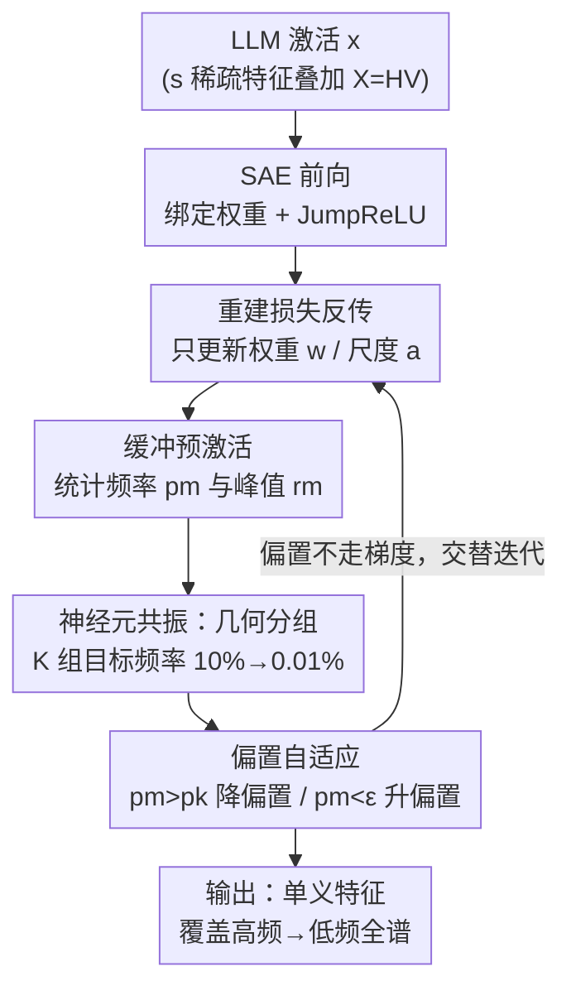

# Taming Polysemanticity in LLMs: Theory-Grounded Feature Recovery via Sparse Autoencoders

**会议**: ICLR 2026  
**OpenReview**: [https://openreview.net/forum?id=VtWkPIbAQ8](https://openreview.net/forum?id=VtWkPIbAQ8)  
**代码**: https://github.com/FFishy-git/TamingSAE_GBA  
**领域**: 可解释性 / 机制可解释性 / 稀疏自编码器  
**关键词**: 稀疏自编码器, 多义性, 特征恢复, 神经元共振, 偏置自适应

## 一句话总结
本文从"神经元激活频率"的视角重新审视稀疏自编码器（SAE）训练，发现并证明了**神经元共振（neuron resonance）**现象——神经元的激活频率 $p$ 落在特征出现频率 $f$ 附近的"共振带"内时才能可靠学到单义特征——并据此设计了**分组偏置自适应（Group Bias Adaptation, GBA）**算法，给出了首个带理论恢复保证、且能扩展到 20 亿参数 LLM 的 SAE 训练方法。

## 研究背景与动机

**领域现状**：大语言模型靠**叠加（superposition）**把远多于神经元维度的概念塞进同一组激活方向，导致单个神经元**多义（polysemantic）**——同时响应多个互不相干的概念，难以解释。字典学习 / 稀疏自编码器（SAE）是当下拆解多义表征的主流方案：把 LLM 内部激活 $x\in\mathbb{R}^d$ 编码成高维稀疏码 $z=f_{\text{enc}}(x)\in\mathbb{R}^M$（$M\gg d$），再解码重建 $\hat{x}\approx x$，理想情况下每个被激活的神经元对应一个可解释的单义特征。

**现有痛点**：现有 SAE 训练几乎都在最小化 $L(x,\hat{x})=\|x-\hat{x}\|_2^2+\lambda\cdot R(z)$ 这类"重建 + 稀疏正则"目标，但缺乏数学保证、且实践上很脆：L1 正则对 $\lambda$ 极其敏感，还会带来**激活收缩（activation shrinkage）**让特征幅值被系统性低估；TopK 强行限定每条输入激活 $K$ 个神经元，却忽略了不同输入需要的活跃特征数其实不同，并且**跨随机种子极不稳定**——换个初始化就学出一套不一样的特征。

**核心矛盾**：这些方法都只能**间接**控制稀疏度，无法直接控制"每个神经元多久激活一次"。可问题恰恰出在频率上：一个理想训练好的神经元，其激活频率 $p$（被多少比例的输入触发）应当等于它对应特征的出现频率 $f$。现有方法绕过了这个本质量，自然既没保证也不稳定。

**本文目标**：拆成两个问题——(1) 到底是什么让神经元能成功恢复特征？(2) 能否设计一个**可证明恢复特征**、又能在现代 LLM 上实用的训练算法？

**切入角度**：作者在已知特征频率的合成数据上做受控实验，系统地扫描神经元激活频率 $p$ 与特征频率 $f$ 的关系，发现了一个干净的规律——像收音机调台一样，神经元必须"共振"在正确的激活频率上才能收到清晰信号。

**核心 idea**：用**频率**而非正则项来驱动稀疏——把神经元分成若干组、各自盯住一个几何递减的目标激活频率，再用**偏置自适应**这一反馈控制把每个神经元的实际激活频率拽到目标值，从而覆盖从高频常见特征到低频专有特征的整个频谱。

## 方法详解

### 整体框架

GBA 把"频率视角"贯穿到底：先用**数据模型**刻画"激活 = 多个非负单义特征的稀疏叠加" $X=HV$（$V\in\mathbb{R}^{n\times d}$ 是 $n$ 个单义特征、$H$ 是 $s$ 稀疏的非负系数，研究的是 $n>d$ 的叠加区间，目标是在不知道 $H$ 的情况下从 $X$ 恢复 $V$）；再把 SAE 写成带绑定权重的三层网络

$$f(x;\Theta)=\sum_{m=1}^{M}a_m w_m\,\phi\big(w_m^\top(x-b_{\text{pre}})+b_m\big)+b_{\text{pre}},$$

其中每个神经元 $m$ 的权重 $w_m$ 同时充当检测器（编码）和重建器（解码），预激活 $y_m=w_m^\top(x-b_{\text{pre}})+b_m>0$ 时才激活。训练时**梯度只更新权重 $w$ 和输出尺度 $a$，偏置 $b$ 完全不走梯度**，而是被一套独立的频率反馈机制控制：每个神经元被分到某个目标激活频率（TAF）组，缓冲一批预激活后统计实际激活频率 $p_m$，再调整偏置把 $p_m$ 推向目标。整个训练在"梯度相位"和"偏置自适应相位"之间交替，让特征自然迁移到激活频率匹配的神经元上。

### 关键设计

**1. 神经元共振：用激活频率匹配取代正则调参**

这是全文的奠基性观察，直接回答"什么让神经元能恢复特征"。作者在已知特征频率 $f=s/n$ 的合成数据上训练大量 SAE，用**特征恢复率（FRR）**——至少有一个学到的神经元与某真特征 $v_i$ 的余弦相似度超过阈值 $\tau_{\text{align}}$ 的特征占比——度量成败，发现一个干净现象：神经元只有当激活频率 $p$ 落在 $f$ 附近的一条**共振带**内才能可靠学到该特征，就像收音机要调到正确频率才收得到清晰信号。更关键的是，共振带宽度取决于叠加程度：**重叠加**（$d<\sqrt{n}$，真实语言数据所处的区间）下带很窄、$p$ 必须紧贴 $f$；**轻叠加**（$d>\sqrt{n}$，尤其 $d>n$ 时特征近乎正交）下带显著变宽。这条规律之所以重要，是因为它把"该不该激活"从玄学正则调参变成了一个可直接操作的频率对齐问题——常见特征要频繁激活的神经元，稀有特征要选择性、罕发的神经元。

**2. 偏置自适应：把激活频率当反馈量直接控制**

共振原理指出要对齐频率，但 L1/TopK 都做不到直接控制频率。本文的做法是把偏置 $b_m$ 从梯度中剥离，改用反馈控制：训练中累积 $B$ 个样本进缓冲，统计每个神经元的经验激活频率 $p_m=|B_m|^{-1}\sum_{y\in B_m}\mathbf{1}(y>0)$ 和最大预激活 $r_m$，然后按目标频率 $p_k$ 调偏置——**过度激活**（$p_m>p_k$）时按 $b_m\leftarrow\max\{b_m-\gamma_- r_m,-1\}$ 降低偏置让它更挑剔，**激活不足**（$p_m<\epsilon$）时按 $b_m\leftarrow\min\{b_m+\gamma_+\bar{s}_{r_k},0\}$ 升高偏置（$\bar{s}_{r_k}$ 是组内正峰值的均值基线）让它更敏感，偏置钳在 $[-1,0]$。降时用神经元自身峰值 $r_m$ 做比例调整、升时用组基线，这样的非对称设计配合 $\gamma_+=\gamma_-=0.01$、每 50 步优化做一次自适应，能让损失平滑不震荡。直接频控天然回避了 L1 的超参敏感和 TopK 的死神经元问题。

**3. 几何分组：用多条共振带覆盖长尾特征频谱**

单一目标频率只能盯住一段频率的特征，而语言特征频率是长尾的（常见功能词 vs. 领域术语）。GBA 把 $M$ 个神经元分成 $K$ 组（默认 $K=10$），目标激活频率（TAF）按固定衰减比 $p_k/p_{k+1}$ 几何排布，从 $10\%$ 一路降到 $0.01\%$，每组 $M/K$ 个神经元共享同一 TAF $p_k$。几何间距恰好匹配特征频率的长尾分布，让不同频段都有专属的"共振带"接住对应特征；组内再用上面的偏置自适应维持各自的目标频率。消融显示分组是性能关键：去掉分组的单组变体 BA 在所有实验里都明显逊于 GBA，而几何分组让算法近乎免调参——HTF 设 0.5（零偏置随机初始化时约 50% 激活）、LTF 设 $10^{-3}\sim10^{-4}$（覆盖稀有特征又防死神经元）、组数取大即可。

**4. 理论恢复保证：首个 SAE 训练的可证明特征恢复定理**

为了把共振现象做实，作者分析了 GBA 的单组简化版 BA（所有神经元共享固定目标频率 $p$、用球面梯度下降训练），在数据模型 $X=HV$（$V$ 取 i.i.d. 高斯、$H$ 为 $s$ 稀疏）下给出 Theorem 6.1：当网络宽度 $M\gtrsim n\cdot p^{-s/(1-\varepsilon)^2}$、频率落在共振带 $n^{-1}\lesssim p\lesssim\min\{n^{-(1+s^{-1})/2},\,n^{-2(1+\varepsilon)^2/s},\,d^{1-\varsigma}/n\}$ 内时，以高概率 $1-n^{-4\varepsilon}$ 在常数 $T=\varsigma^{-1}$ 步内恢复**所有** $n$ 个特征，即 $\langle w_{m_i}^{(T)},v_i\rangle/\|v_i\|_2\ge1-o(1)$。定理读出两点：宽度 $M$ 随特征数 $n$ **线性**增长（每个神经元最多学一个特征）、但随稀疏度 $s$ **指数**增长（特征共现越多越难分）；频率上界同时由叠加程度 $d/n$ 和稀疏度 $s$ 决定，把 $f=s/n=\Theta(n^{-1})$ 代入即得 $f\lesssim p\lesssim\min\{\sqrt{f},\,fd\}$，与第 3 节合成实验里 $d\approx\sqrt{n}$ 处的相变完全吻合。⚠️ 频率带与宽度的精确指数以原文为准。这是已知首个证明 SAE 训练能在常数步内恢复单义特征的动力学保证。

### 损失函数 / 训练策略

训练目标仍是标准的归一化 $\ell_2$ 重建损失 $L_{\text{rec}}(x;\Theta)=\frac{1}{2}\|f(x;\Theta)-x\|_2^2$，无任何稀疏正则项——稀疏完全由偏置自适应保证。优化用 Adam/AdamW 只更新 $W$ 和 $a$；每 50 个优化步、缓冲满 $B$ 样本时做一次偏置自适应；激活函数统一用 JumpReLU。关键超参近乎固定：$\gamma_+=\gamma_-=0.01$、batch $L=512$、HTF=0.5、LTF=$10^{-3}\sim10^{-4}$、$K\ge10$，无需逐数据集调参。

## 实验关键数据

实验在 Qwen2.5-1.5B 和 Gemma2-2B 上、用 Pile（Github / Wikipedia）数据训练 66k 神经元的 SAE，对比 L1、TopK、BA（单组变体）三个基线。

### 主实验

| 实验 | 指标 | GBA | 最强基线 | 结论 |
|--------|------|------|----------|------|
| 重建–稀疏前沿（66k 神经元） | 同稀疏度下重建损失 | 最低，与 TopK 最优曲线持平 | TopK | 达到 Pareto 前沿，远超 L1 与 BA |
| 跨种子一致性（top-0.05% 激活） | MCS>0.9 神经元占比 | 超过 L1 | L1 | 最显著特征上恢复更稳 |
| SAEBench 可解释性（Gemma2-2B, L0≈300） | 9 项指标 | 4 项最佳 | 6 个基线 | Explained Variance/Absorption/Alive 领先 |

SAEBench 上 GBA 的 Explained Variance 0.902（最高）、Absorption Score 0.0041（最低、越低越好）、Alive Fraction 0.970（最高，约 99% 神经元存活），在 9 项中 4 项第一。

### 关键发现：玩具实验证明"频率感知"的必要性

作者构造了一个不平衡合成集（$n=128,d=42$，一半样本 $s=3$ 稀疏、一半 $s=20$ 稠密，所有特征 $f\approx0.09$）来隔离频率感知的收益：

| 方法 | FRR ($\tau_{\text{align}}\ge0.8$) | FRR ($\tau_{\text{align}}\ge0.9$) | 说明 |
|------|------|------|------|
| TopK ($K=20$) | 100.0% | 98.4% | 恰好猜中稀疏度才近乎完美 |
| TopK ($K=30$) | 98.4% | 24.2% | $K$ 偏离即崩 |
| TopK ($K=50$) | 94.5% | 23.4% | 进一步恶化 |
| GBA（全频覆盖） | 100.0% | 100.0% | 无需调参、无需 $f$ 先验 |
| GBA（频率设错） | 38.3% | 3.9% | 频率覆盖错则失败 |

### 消融实验

| 配置 | 关键指标 | 说明 |
|------|---------|------|
| GBA 完整（$K\ge10$, HTF=0.5） | 重建损失/稀疏度稳定收敛、贴近 TopK | 完整模型 |
| 减小组数（$K=3$） | 损失略低但激活更密、可解释性下降 | 高频神经元过多 |
| 降低 HTF（0.05） | 重建损失升高 | 难以恢复高频特征 |
| 单组变体 BA（去分组） | 所有实验均逊于 GBA | 分组机制是性能关键 |

### 关键发现
- **分组是核心**：BA → GBA 的稳定优势直接证明几何分组（多共振带）才是性能与可解释性兼得的关键。
- **近乎免调参**：$K\ge10$ 且 HTF=0.5 时性能稳定、对 $K$ 不敏感；相比 TopK 要在 66k 神经元里搜 $K$、L1 要搜 $\lambda$，GBA 用一套固定规则即可。
- **理论与实验对得上**：合成数据里 $d\approx\sqrt{n}$ 处共振带从宽变窄的相变，与 Theorem 6.1 的频率带预测一致；高 Z-score 神经元同时有高 MCS，印证选择性激活的神经元跨种子可稳定恢复。

## 亮点与洞察
- **把"稀疏"重新定义为"频率对齐"**：跳出 L1/TopK 的正则范式，用激活频率这个可直接观测、可直接控制的量替代玄学正则，既给了理论抓手又消除了超参敏感——这是最"啊哈"的视角转换。
- **偏置不走梯度、改走反馈控制**：把 SAE 训练拆成"权重梯度相位 + 偏置反馈相位"交替，是一个干净且可迁移的 trick——任何想精确控制某个统计量（激活率、命中率、覆盖率）的稀疏 / 路由模型都能借用这套"剥离参数 + 反馈控制"思路。
- **几何分频覆盖长尾**：用几何递减的多组目标频率天然匹配语言特征的长尾分布，思路可迁移到 MoE 路由、检索召回等"既要覆盖头部又不丢长尾"的场景。
- **首个 SAE 恢复保证**：常数步内恢复全部单义特征的动力学定理，填补了 SAE 长期"只有经验、没有理论"的空白。

## 局限与展望
- **理论假设偏理想**：Theorem 6.1 要求 $V$ 为高斯、$H$ 为均匀 $s$ 稀疏，真实 LLM 特征显然非高斯；作者用合成 + 真实数据佐证算法在非高斯下仍工作，但定理本身不覆盖这些情形。
- **宽度对稀疏度指数依赖**：$M\gtrsim n\cdot p^{-s/(1-\varepsilon)^2}$ 意味着特征共现越密（$s$ 大）所需神经元数指数爆炸，对极稠密叠加的可扩展性存疑。
- **频率覆盖错则失败**：玩具实验里"GBA（频率设错）"FRR 仅 3.9%，说明频率范围虽近乎免调，但 HTF/LTF 设得离谱仍会崩，对未知频率分布的数据需要合理先验。
- **规模仍有限**：最大验证到 2B 参数模型，对更大 LLM、更深层 residual stream 的表现待验证。

## 相关工作与启发
- **vs L1 SAE**：L1 用 $\lambda\sum_m\|w_m\|_2\phi(y_m)$ 间接压稀疏，对 $\lambda$ 敏感且有收缩偏差；GBA 不用任何正则、直接频控，免调参且无收缩。L1 在多数选择准则下跨种子一致性更高，但 GBA 在最活跃特征（top-0.05%）上反超。
- **vs TopK SAE**：TopK 硬性每输入留 $K$ 个激活，假定固定稀疏度、跨种子极不稳；GBA 用频率自适应处理变化的稀疏度，跨种子一致性（MCS>0.9 占比）在所有 $\alpha$ 下都高于 TopK，且重建–稀疏前沿与 TopK 最优持平。
- **vs Gated / JumpReLU / Matryoshka / BatchTopK**（SAEBench 基线）：这些改进激活或结构但仍缺频率视角与理论保证；GBA 在 9 项可解释性指标里 4 项第一，且唯一带可证明恢复定理。
- **vs 经典字典学习**：继承 Olshausen & Field 等稀疏字典学习传统，但首次把"激活频率—特征频率共振"这一动力学机制讲清并证明。

## 评分
- 新颖性: ⭐⭐⭐⭐⭐ 神经元共振视角 + 首个 SAE 恢复保证，把领域从经验推进到理论。
- 实验充分度: ⭐⭐⭐⭐ 合成 + 2B LLM + SAEBench 多维验证，但规模与非高斯理论缺口仍在。
- 写作质量: ⭐⭐⭐⭐⭐ 现象 → 理论 → 算法 → 实验闭环，逻辑链清晰。
- 价值: ⭐⭐⭐⭐⭐ 给 SAE 训练立了理论地基，又提供近乎免调参的实用算法，机制可解释性社区受益面广。

<!-- RELATED:START -->

## 相关论文

- [\[ICLR 2026\] Toward Faithful Retrieval-Augmented Generation with Sparse Autoencoders](toward_faithful_retrieval-augmented_generation_with_sparse_autoencoders.md)
- [\[ICLR 2026\] AbsTopK: Rethinking Sparse Autoencoders For Bidirectional Features](abstopk_rethinking_sparse_autoencoders_for_bidirectional_features.md)
- [\[ICLR 2026\] Sparse Autoencoders Trained on the Same Data Learn Different Features](sparse_autoencoders_trained_on_the_same_data_learn_different_features.md)
- [\[ICLR 2026\] On the Limits of Sparse Autoencoders: A Theoretical Framework and Reweighted Remedy](on_the_limits_of_sparse_autoencoders_a_theoretical_framework_and_reweighted_reme.md)
- [\[ICML 2026\] PolySAE: Modeling Feature Interactions in Sparse Autoencoders via Polynomial Decoding](../../ICML2026/interpretability/polysae_modeling_feature_interactions_in_sparse_autoencoders_via_polynomial_deco.md)

<!-- RELATED:END -->
