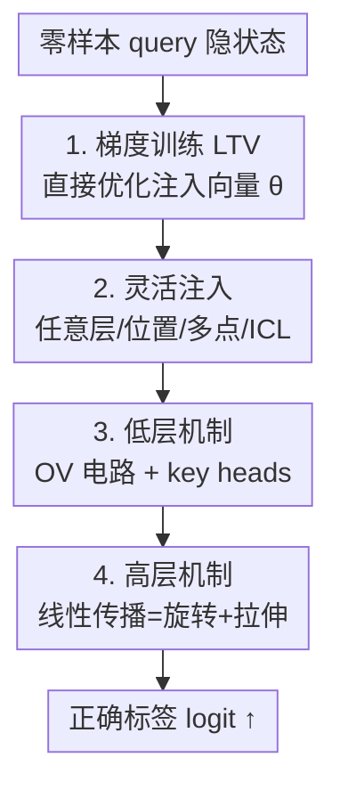

# Task Vectors, Learned Not Extracted: Performance Gains and Mechanistic Insights

**会议**: ICLR 2026  
**OpenReview**: [https://openreview.net/forum?id=RGEbVZgf4E](https://openreview.net/forum?id=RGEbVZgf4E)  
**代码**: https://github.com/HLYang2001/Learned_TV  
**领域**: 机制可解释性 / In-Context Learning  
**关键词**: 任务向量, In-Context Learning, 机制可解释性, OV 电路, 线性传播

## 一句话总结
本文不再从模型表征里"提取"任务向量（Task Vector, TV），而是用梯度下降**直接训练**一个注入向量（Learned Task Vector, LTV），在分类与生成任务上全面超越提取式 TV 且能注入到任意层/位置；同时系统拆解了 TV 起效的机制——低层主要经由注意力头的 OV 电路（少数 key heads 起决定作用），高层则以"旋转 + 拉伸"的近线性方式传播。

## 研究背景与动机
**领域现状**：大模型能从上下文示例（demonstrations）里直接学会新任务，即 In-Context Learning（ICL）。近年一条主流解释是：这些示例被压缩成一个紧凑的**任务向量** $\theta$，把它加到零样本 prompt 的隐状态上，就能让模型达到 few-shot 水平的准确率。围绕"从哪里提取（隐状态 / 注意力头输出 / MLP 输出）、怎么提取（PCA / 复杂优化 / 逐头消融）"已有大量工作。

**现有痛点**：现有方法几乎都是**提取式**——要么对 ICL 隐状态做差（Vanilla TV：$\theta = h^l_{N,\text{ICL}} - h^l_N$），要么把若干筛选出来的注意力头输出求和（Function Vector, FV：$\theta = \sum_{(l,k)\in I} a^l_{N,k,\text{ICL}}$）。这带来三个问题：(1) 构造过程不透明、依赖逐头消融等繁琐筛选；(2) TV 质量被模型本身表征质量"卡死"，提取到的往往是次优解；(3) 对注入层 $l$ 极其敏感，且只能注入到最后一个 token、单一层。

**核心矛盾**：提取式方法用模型自己的（可能很差的）ICL 表征当上限，既测不准 TV 的真实效果，又因为黑箱构造而**说不清 TV 到底怎么起作用**。绝大多数工作止步于"注入 TV 能涨点"，没回答"模型如何利用 TV 做出正确预测"这个核心机制问题。

**本文目标**：拆成两个子问题——(1) 能不能绕开提取、直接找到"最优 TV"，并摆脱表征质量与注入位置的束缚？(2) 能不能把 TV 起效的低层（哪些组件参与）与高层（怎么一步步把输出推向正确标签）机制讲清楚？

**切入角度**：既然 TV 本质是"加到隐状态上的一个向量"，那它和 LLM steering（往隐状态加方向向量来引导行为）是同构的，而后者已有"直接训练 steering 向量"的先例。于是作者把 TV 也当成**可训练参数**，用任务标签的监督信号直接优化它。

**核心 idea**：用"梯度下降直接训练一个注入向量"取代"从 ICL 表征里提取"，得到不受表征质量约束的最优 TV；再以这个干净的 LTV 为探针，系统刻画 TV 在 Transformer 里的低层与高层传播机制。

## 方法详解

### 整体框架
本文方法分两步走：先把任务向量从"提取"变成"训练"，得到一个干净、灵活的 LTV；再用它当探针，自底向上拆解 TV 的作用机制。

具体地：给定零样本 query $x_q$（如 "I like this movie. Sentiment:"），其隐状态在 $L$ 层间逐层更新。**第一步**，在某些层 $\mathcal{L}$、某些位置 $\mathcal{P}$ 的隐状态上加一个待训练向量 $\theta$，固定模型权重、只用标签监督优化 $\theta$，得到 LTV；它可注入任意层、任意位置、甚至多点同时注入或直接注入 ICL prompt。**第二步**，分析这个注入的 $\theta$ 如何在后续层传播：低层看它经由哪些组件影响残差流（结论是注意力头的 OV 电路，且少数 key heads 决定性最强），高层看它作为整体如何被后续层"线性地"变换（结论是旋转 + 拉伸，早层 TV 靠旋转对齐任务子空间、晚层 TV 靠拉伸放大幅度），最终把正确标签的 logit 抬高。

### 关键设计

**1. 直接训练 LTV：把"提取"换成"梯度优化"**

提取式 TV 的根本问题是上限被模型 ICL 表征质量卡住，且构造过程不透明。本文干脆把 $\theta$ 当成可学习参数，固定 LLM 权重，最小化零样本 query 上正确标签的负对数似然：

$$-\log p(y_q \mid x_q, \theta, \mathcal{L}, \mathcal{P})$$

其中 $\mathcal{L}$ 是注入层集合、$\mathcal{P}$ 是注入位置集合；一般会在 $|\mathcal{L}|\times|\mathcal{P}|$ 组 (层, 位置) 索引的隐状态上各加一个独立的 $\theta$。多 token 标签则对各 token 的对数概率取平均。优化用 AdamW，学习率 0.001、weight decay 0.01。当 $\mathcal{L}=\{l\}$、$\mathcal{P}=\{-1\}$ 时就退化成"在第 $l$ 层最后一个 token 加一个向量"的 baseline 设定。这一步彻底摆脱了对 ICL 隐状态的操纵，直接找到"最有效的那个 TV"，而且只优化 $d$ 个参数（一个隐向量维度），天然是一种极轻量的 PEFT 方法。

**2. 灵活注入：解除层/位置/单点的束缚**

提取式 TV 只能注入最后一个 token、单一层，且对层号极敏感（晚层注入几乎失效，被认为存在"临界深度"）。LTV 因为是端到端训出来的，可以适配各种配置：换非最后位置（$\mathcal{P}=\{4\}$）、多位置（$\mathcal{P}=\{-5,\dots,-1\}$）、每隔几层注入（$\mathcal{L}=\{0,4,\dots,32\}$）、层与位置同时多点、甚至把它叠加到 8-shot ICL prompt 上进一步涨点。关键是 LTV 在晚层注入仍能拿到非平凡准确率，直接**反驳了"存在临界深度，超过它层就无法利用注入 TV"的旧观点**——这一现象也成为后面机制分析（晚层靠拉伸而非旋转起效）的引子。

**3. 低层机制：TV 主要经由注意力头的 OV 电路起效，少数 key heads 决定性最强**

第一个机制问题是"哪些具体组件在和 TV 交互"。回到注意力头输出 $a^l_{N,k}=\sum_j c^{l,k}_{j,N} W^{l,\top}_{O,k} W^l_{V,k} h^{l-1}_j$，当在第 $l-1$ 层最后位置注入 $\theta$ 后，会多出一项 $c^{l,k}_{N,N}\, W^{l,\top}_{O,k} W^l_{V,k}\,\theta$，即 **TV 被该头 OV 电路（$W_O W_V$）变换后的结果**。借残差连接，$\theta$ 会前向影响第 $l$ 层及之后所有头，其对头输出的总影响为 $\sum_{(l',k'):\,l'\ge l+1} W^{l',\top}_{O,k'} W^{l'}_{V,k'}\theta$（形式上与 FV 同构）。作者把这个"打包后的 OV 效应"重新注回残差流，发现它能**复现 LTV 的大部分涨点**（83% → 52% vs 零样本 0%），而 MLP 路径的重构只能恢复很小一部分——证明 OV 电路是低层主通道。进一步用一阶泰勒近似的显著性分数 $\big|a^{l'}_{N,k}\big|\cdot \frac{\partial p(y_q\mid x_q,\theta,\mathcal{L},\mathcal{P})}{\partial a^{l'}_{N,k}}$ 给头打分，取 top 10% 为 key heads：消融 key heads 让准确率从 83% 暴跌到 51%，而随机消融 10% 的头几乎无影响（78%）。这些 key heads 呈准 U 形分布（注入层之后、以及最后几层最密集），且比随机头更少陷入 "attention sink"、更聚焦于末尾位置，因而真正能利用注入的 TV。

**4. 高层机制：TV 近线性传播 = 旋转 + 拉伸**

第二个机制问题是"TV 整体如何一路传到最终输出"。尽管 Transformer 含大量非线性，作者假设 $l$→$L$ 的复合层更新对 $\theta_l$ 近似线性，即存在 $W_{TV,(l)}\in\mathbb{R}^{d\times d}$ 使 $\mathbf{1}_n (W_{TV,(l)}\theta_l)^\top \approx H^{L'}_{(l)} - H^L$。为避开 rank-1 退化，训练时对 $\theta_l$ 加噪 $\theta_{l,i}=\theta_l+\lambda_i\epsilon_i$ 来拟合 $W_{TV,(l)}$。实验证实：用线性重构的 TV 在大多数层都能匹配原 TV 的性能，说明一个纯线性算子几乎能完整刻画"注入 TV → 末层隐状态变化"这条通道。再对其做极分解 $W_{TV,(l)}=Q_{(l)}\Sigma_{(l)}$（$Q$ 为旋转、$\Sigma$ 为拉伸），得到统一图景：**早层 TV** 解码出来是无关 token，但只施加旋转 $Q_{(l)}$ 后就显著提升与任务标签 unembedding 的对齐度、解码出 task-related token——说明早层 TV 靠中间层（主要是这些层的 OV 电路）被旋转到任务子空间才起效；**晚层 TV** 本就解码出 task-related token，旋转矩阵趋近单位阵、拉伸成为主导。随层加深，$\cos(\theta_l, Q_{(l)}\theta_l)$ 升高（旋转减弱），完成"旋转退场、拉伸登场"的相位转换。

### 损失函数 / 训练策略
训练目标即上文的负对数似然 $-\log p(y_q\mid x_q,\theta,\mathcal{L},\mathcal{P})$，多 token 标签对各 token 对数概率取平均。优化器 AdamW，学习率 0.001、weight decay 0.01；只优化注入向量 $\theta$（每个 (层, 位置) 一个，单点情形即 $d$ 个参数），模型权重全程冻结。

## 实验关键数据

模型主报告在 Llama3.1-8B（另含 Llama2/3/3.1/3.2、Qwen2.5-32B、Yi-34B 等）；数据集含 Capital / Capitalize / Antonym 三个人工任务，SST-2 / TREC / SNLI / RTE 四个分类任务，以及生成任务 Myopic。

### 主实验

LTV 当作 PEFT 与 Prefix Tuning、LoRA 在 SST-2 上对比（同等参数预算）：

| 方法 | 准确率 ↑ | 参数量 ↓ | 训练延迟(s) ↓ | 推理峰值显存(GB) ↓ |
|--------|---------|---------|---------------|---------------------|
| Prefix Tuning | 85.67% | $d$ | 0.050 | 16.31 |
| LoRA | 91.63% | $2d$ | 0.053 | 16.37 |
| **LTV (Ours)** | **92.89%** | $d$ | **0.049** | 16.36 |

跨配置鲁棒性（dataset-average 准确率，Llama3.1-8B；箭头为相对零样本的提升）：

| 方法 | Baseline $P{=}\{-1\},L{=}\{16\}$ | 异位置 $P{=}\{4\}$ | 多位置 | 多层 | 多层+多位置 | ICL prompt |
|------|------|------|------|------|------|------|
| Vanilla TV | 37.80% | 2.16% | 17.97% | 19.18% | 18.15% | 56.12% |
| FV | 37.30% | 2.68% | 31.88% | 6.05% | 0.38% | 74.78% |
| **LTV (Ours)** | **83.49%** | **78.39%** | **86.43%** | **82.44%** | **51.39%** | **84.61%** |

逐层注入（Figure 2）显示 LTV 在所有层都稳定超越 Vanilla TV 与 FV，差距在晚层尤为明显，早层注入时可匹敌甚至超过 ICL。

### 消融实验

| 配置 | SST-2 准确率 | 说明 |
|------|------|------|
| 完整 LTV | 83% | 中层注入 |
| 仅 OV 电路重构 | 52% | 复现大部分涨点 → OV 是低层主通道 |
| 零样本 | 0% | 无注入下限 |
| 消融 key heads (top 10%) | 51% | 掉点最严重 → key heads 决定性最强 |
| 随机消融 10% 头 | 78% | 几乎无影响 → 对照组 |
| 线性重构 TV | ≈ 原 TV | 多数层匹配原性能 → 高层近线性 |

### 关键发现
- **OV 电路 + key heads 是低层关键**：只用 OV 变换重构就能把 83% 的涨点恢复到 52%，而消融 top-10% key heads 直接跌回 51%、随机消融 10% 仍有 78%——说明少数头承担了 TV 几乎全部作用，且这些头更少"注意力沉没"、更聚焦末尾位置。
- **高层近线性、且呈"旋转→拉伸"相位转换**：尽管 Transformer 大量非线性，一个 $d\times d$ 线性算子几乎能完整刻画 TV 到末层的传播；早层 TV 需被旋转到任务子空间才起效，晚层 TV 旋转趋于单位阵、靠拉伸放大。
- **跨任务泛化受标签空间约束**：LTV 呈强类内对齐、清晰类间分离；唯一例外是共享 {true,false} 标签空间的 SNLI 与 RTE（SNLI 训的 LTV 只在 RTE 上有 46.21% 的非平凡迁移，其余任务≈0）。
- **组合性**：English→French 与 Masculine→Feminine 两个 LTV 直接相加，在 English-Masculine→French-Feminine 复合任务上准确率远超零样本与 ICL，呈现 word2vec 式语义组合。

## 亮点与洞察
- **"训练而非提取"是方法论上的范式切换**：把 TV 从"模型表征的副产品"变成"被监督信号直接优化的参数"，一举解除表征质量、注入层、注入位置三重束缚，还顺手得到一个只需 $d$ 参数的 PEFT 方法——巧在它把 TV 与 LLM steering 两条线索打通。
- **用干净探针换来干净机制**：正因为 LTV 不依赖噪声大的 ICL 表征，后续 OV 重构、key heads 显著性、线性算子拟合这些机制实验才能给出清晰因果信号；这是"更好的工具→更清楚的科学结论"的范例。
- **"旋转退场、拉伸登场"是可迁移的视角**：把层更新对注入向量的作用极分解成旋转+拉伸，并发现深度上的相位转换，给"为什么早层 TV 和晚层 TV 行为不同"提供了统一解释，这一分析框架可迁移到任何"往隐状态加向量"的 steering 研究。

## 局限与展望
- 机制分析高度依赖 SST-2 等"标签空间清晰"的任务，对开放式、长生成任务的机制结论仍是外推；Myopic 之外的复杂生成场景验证有限。
- 跨任务迁移被标签空间重叠"卡死"：不共享标签语义的任务（如 Capital）几乎零迁移，意味着 LTV 学到的更像"标签方向"而非抽象任务语义，泛化性有上限。
- 线性传播是"近似"而非严格——少数层存在例外；极分解给出的旋转/拉伸图景是后验拟合的，因果强度仍依赖重构实验，未给出端到端的理论保证（理论保证放在附录）。
- 主结论多在 8B 量级、单 query 监督下得到，超大模型与多任务联合训练 LTV 时是否仍保持同样机制有待验证。

## 相关工作与启发
- **vs Vanilla TV (Hendel et al., 2023)**：他们用 ICL 与零样本隐状态做差得到 TV，本文改为梯度直接训练；区别在于是否受表征质量与注入层束缚，本文在所有层、所有配置下都显著更高、更稳。
- **vs Function Vector (Todd et al., 2024)**：他们靠逐头消融筛选注意力头并求和，本文不做筛选、直接优化整向量；FV 忽略消融间的相关性导致次优，而本文反过来用 OV 聚合形式解释了 FV 为何"形似有效"。
- **vs LLM steering / 训练 steering 向量 (Cao et al., 2024; Panickssery et al., 2024)**：本文借鉴"直接训练注入向量"的思路并迁移到 ICL 的 TV 框架，把 steering 的工程经验转化为对 ICL 机制的科学解释。

## 评分
- 新颖性: ⭐⭐⭐⭐⭐ "训练而非提取"的视角转换 + 低层/高层机制的系统拆解，少见地把方法与解释合二为一。
- 实验充分度: ⭐⭐⭐⭐⭐ 8 个模型、7+ 数据集、PEFT 对比、OV/key-heads/线性重构多重机制验证齐全。
- 写作质量: ⭐⭐⭐⭐ 逻辑清晰、图文呼应；机制部分公式密集，对非可解释性背景读者门槛偏高。
- 价值: ⭐⭐⭐⭐⭐ 既给出可直接用的轻量 PEFT/TV 工具，又为 ICL 的机制理解提供了统一框架。

<!-- RELATED:START -->

## 相关论文

- [\[ICLR 2026\] When Thinking Backfires: Mechanistic Insights into Reasoning-Induced Misalignment](when_thinking_backfires_mechanistic_insights_into_reason-induced_misalignment.md)
- [\[ICLR 2026\] Sparse CLIP: Co-optimizing Interpretability and Performance in Contrastive Learning](sparse_clip_co-optimizing_interpretability_and_performance_in_contrastive_learni.md)
- [\[ICLR 2026\] Formal Mechanistic Interpretability: Automated Circuit Discovery with Provable Guarantees](formal_mechanistic_interpretability_automated_circuit_discovery_with_provable_gu.md)
- [\[ICLR 2026\] Latent Concept Disentanglement in Transformer-based Language Models](latent_concept_disentanglement_in_transformer-based_language_models.md)
- [\[ACL 2026\] Linear Probes Detect Task Format, Not Reasoning Mode in Language Model Hidden States](../../ACL2026/interpretability/linear_probes_detect_task_format_not_reasoning_mode_in_language_model_hidden_sta.md)

<!-- RELATED:END -->
