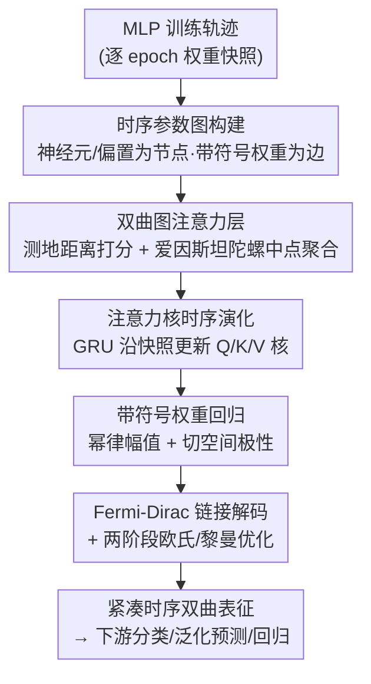

# Temporal Geometry of Deep Networks: Hyperbolic Representations of Training Dynamics for Intrinsic Explainability

**会议**: ICLR 2026  
**OpenReview**: [https://openreview.net/forum?id=Xq64xkQCak](https://openreview.net/forum?id=Xq64xkQCak)  
**领域**: 可解释性 / 元网络 / 双曲几何  
**关键词**: 内在可解释性, 训练动力学, 双曲嵌入, 参数图, 元学习

## 一句话总结
本文把一个 MLP 的整段训练轨迹看成一串"参数图"快照，并用一个保持排列对称性的双曲图注意力元网络（GTH-GMN）把它们嵌入 Poincaré 球，从而在负曲率空间里还原网络在训练过程中的自组织几何，既能在 INR 分类、泛化预测、正弦回归等任务上匹配强基线，又能直接从嵌入的径向/角向结构读出可解释信号。

## 研究背景与动机
**领域现状**：近年兴起一类"把神经网络当作数据"的元网络（meta-network）研究——把目标网络的权重当输入，去预测它的泛化性能、分类它代表的隐式神经表示（INR）、或为迁移学习生成权重。从最早把权重拉平成单个张量，到后来强制排列等变（reorder 神经元不改变功能），再到把神经元/偏置当节点、权重当边的图元网络（GMN、NFN、DWSNet 等），这条线越做越尊重权重空间的对称性。

**现有痛点**：这些方法几乎都有两个共同短板。其一，它们只看训练轨迹上的**单个 checkpoint**做零样本预测，把优化过程中留下的时间轨迹白白浪费了；其二，它们几乎全用**欧氏嵌入**，而欧氏空间要表达层级结构、重尾分布需要很高维度，投影时还会扭曲结构，导致很难"看懂"网络内部的自组织。

**核心矛盾**：神经网络的信息不仅编码在最终权重里，也编码在训练时走过的**轨迹**里；而权重的拓扑天然带有层级（hierarchy）、模块化、小世界、重尾这些复杂网络先验——这些恰恰是欧氏几何最不擅长保真表达的。换句话说，"想要可解释的几何表征"和"用欧氏空间 + 单快照"之间存在根本张力。

**本文目标**：构造一个能吃下整段训练轨迹、在低曲率空间里保结构嵌入、同时尊重权重空间对称性的元网络，让"网络如何随训练自组织"这件事本身成为研究对象，并产出可直接解读的几何表征。

**切入角度**：网络科学早就指出，许多复杂网络可以嵌入到"距离对应连接概率"的隐度量空间里，而**双曲空间**能以极低失真保层级关系。作者赌的是：神经参数图也有类似的小世界 + 模块化倾向，那么把它们嵌进双曲球、用"距离偏置"的学习方式，就能得到紧凑又可解释的表征。

**核心 idea**：把"训练"视为参数图在负曲率空间里的一条轨迹，用双曲图注意力 + 注意力核的时序演化，做出一个对快照内神经元排列等变、对历史快照排列不变的双曲时序元网络（GTH-GMN）。

## 方法详解

### 整体框架
GTH-GMN 接收一个 MLP 的训练轨迹（一串 epoch 上的权重快照），输出一个紧凑的时序双曲表征，可接下游做分类 / 泛化预测 / 回归。整条管线是：先把每个 checkpoint 转成一张带符号权重的**参数图**，再把这串图嵌入 Poincaré 球用**双曲图注意力**做空间聚合；注意力核的参数本身用 GRU 沿时间**演化**以维持时序平滑；同时一个**带符号权重回归头**把几何距离绑定到权重大小、把方向绑定到切空间内积；最后 Fermi-Dirac 解码器把双曲距离译成连边概率，并用两阶段（欧氏 + 黎曼）优化交替更新参数与节点坐标。

### 关键设计

**1. 时序参数图构建：把训练轨迹变成保对称的带符号图序列**

针对"单快照浪费时间轨迹"的痛点，本文在每个 epoch $t$ 都把 MLP 转成一张图快照 $G_t = (X_t, E_t, W_t)$：神经元和偏置都是节点 $u \in V_t$，权重是带符号标签 $w^\star_{uv,t}$ 的边，权重为零则不建边。输入/输出层固定、隐藏层神经元重排只产生等变图结构，从而天然尊重排列对称性。关键在于节点特征的设计——为了不把权重本身泄漏进模型（否则等于作弊），每个节点特征只放层标签 $\ell(u)$、类型 $\tau(u)$ 以及对邻接边强度做标准化得到的 z 分数 $\mathrm{es}_{\text{abs}}(u,t)$、$\mathrm{es}_{\text{sgn}}(u,t)$，即 $x_{u,t}=(\ell(u),\tau(u),\mathrm{es}_{\text{abs}}(u,t),\mathrm{es}_{\text{sgn}}(u,t))$；边属性也刻意极简，只编码"是不是偏置边、是否跨层"。有向对通过反平行方向取平均对称化，缺失方向补零。这样得到的序列 $\{G_t\}_{t=1}^{T}$ 既捕捉自组织，又对隐藏层排列不变。所有描述子先嵌入原点切空间 $T_0 B_c^d$（离散标签走可学习嵌入、强度特征过小 MLP + 残差块），让归一化/dropout 这些不稳定操作留在平直的欧氏空间，曲率只在后续双曲消息传递时引入。

**2. 双曲图注意力层：用测地距离决定"谁影响谁"、用陀螺中点做曲率一致的聚合**

普通注意力的线性映射和欧氏平均在弯曲流形上都不成立——两点欧氏相加的结果通常掉出流形、也不对应任何测地中点。本设计遵循"在切空间算、需要几何时才搬到球上、在有良定义重心的模型里聚合"三步。先把欧氏参数 $W,b$ 实现为双曲仿射映射：$\Phi^{(t)}_{W,b}(x)=\exp_{\Phi^{(t)}_W(x)}\!\big(\mathrm{PT}_{0\to\Phi^{(t)}_W(x)}(b)\big)$，其中 $\Phi^{(t)}_W(x)=\exp_0(W\log_0(x))$，由它产出每个节点的双曲 query/key/value。注意力打分用**负测地距离** $\theta^{(t)}_{u\to v}=-d_c(q_u,k_v)+b_{uv}$——越近相似度越高，softmax 后越近的节点拿到指数级更大的权重；再乘一个门控 $g_{uv}$ 重新归一化，给跨层/偏置这类结构上更重要的边加权。聚合时不能线性平均，而是映到 Klein 模型用**爱因斯坦陀螺中点**（闭式重心）：经 Poincaré↔Klein 映射 $\kappa(z)=\frac{2\sqrt{c}\,z}{1+c\|z\|^2}$ 与洛伦兹因子 $\gamma(y)=1/\sqrt{1-\|y\|^2}$ 加权求重心后映回。这一拆分的解释学后果很关键：**注意力用测地线决定影响关系、聚合尊重全局曲率**，于是层级结构、枢纽节点、边界效应都被保留下来。

**3. 注意力核时序演化：用 GRU 让核随时间漂移而不存历史嵌入**

为了在不同快照间维持时序平滑、又不爆内存，本文不存整段双曲嵌入序列，而是借鉴 EvolveGCN 的思路用 GRU **元演化注意力核参数**。对每层 $\ell$、每个头 $r$，维护一个循环状态：先把上一步节点表征均值池化成 $p^{(t-1)}_\ell=\frac{1}{N}\sum_i X^{(t-1)}_{\ell,i}$，再用 $u^{(t)}_{\ell,r}=\mathrm{GRU}(p^{(t-1)}_\ell, u^{(t-1)}_{\ell,r})$ 更新状态，最后由一个 MLP 从该状态吐出新一轮的 Q/K/V 参数 $W^{(t)}_{\ell,r,k/q/v}=\phi_{\text{MLP}}(W_{\text{out}}u^{(t)}_{\ell,r}+b_{\text{out}})$ 再喂回双曲仿射映射。这样注意力核能沿优化轨迹平滑漂移，既保排列不变性，又把内存压到紧凑的循环状态，让长轨迹也能高效学习——这正是它优于"对每个 checkpoint 独立编码"的地方。

**4. 带符号权重回归：把权重幅值绑成双曲距离的幂律、把极性放进切空间**

只判断"边是否存在"不够，加权网络还需恢复连接的**强度和极性**。真实网络里这些幅值常呈重尾分布，而双曲距离正好是它天然的几何代理。本设计先从切空间特征预测节点相关的尺度/衰减因子 $s_i=f_\sigma(X_i)$、$k_i=f_\kappa(X_i)$，并让幂律斜率随局部上下文微调 $\alpha_{uv}=\alpha_0+\delta_\alpha\cdot\tanh(\phi_{\text{MLP}}([X_u,X_v,e_{uv}]))$；于是预测幅值服从重尾幂律 $|w^{(t)}_{uv}|=\exp(\log\nu+s_u+s_v)\exp(-(1-\frac{\alpha_{uv}}{d})(k_u+k_v))\,(d^{(t)}_{uv})^{-\alpha_{uv}}$，其中 $d^{(t)}_{uv}=d_c(z_u,z_v)$ 是 Poincaré 距离——大幅值对应短双曲距离。极性则因流形距离恒正而被放到切空间建模：把 $z_v$ 经对数映射搬到 $z_u$ 的切空间得 $\delta^{(t)}_{u\to v}=\log_{z_u}(z_v)$，按共形因子归一化源特征后用双曲一致的内积给出符号 logit $s^{(t)}_{uv}=\beta\langle\delta^{(t)}_{u\to v},\xi_u\rangle$，最终 $\hat{w}^{(t)}_{uv}=|w^{(t)}_{uv}|\tanh(s^{(t)}_{uv})$。这就把每条权重几何忠实地拆成"强度（径向距离）+ 方向（切空间夹角）"，让嵌入获得语义：枢纽外漂、强边径向聚集、兴奋/抑制表现为角向差异。

### 损失函数 / 训练策略
链接预测用 Fermi-Dirac 解码器 $\psi^{(t)}(u,v)=\big(1+\exp(\frac{d_c(z_u,z_v)-R}{T})\big)^{-1}$（半径 $R$、温度 $T$ 均可学），配二元交叉熵 + 同层/均匀双分布的动态负采样。总目标是 Fermi-Dirac 交叉熵 + 幅值监督 + 符号监督 + 几何正则（斜率先验、时序平滑项、"强连接对应更短双曲距离"的排序损失）的加权和，并用退火 ranking margin、逐步加难负采样的课程稳定训练。优化分两阶段：第一阶段欧氏反传更新所有核、回归头、解码器；第二阶段在 Poincaré 球上用黎曼优化（共形因子缩放梯度 + RAMSGrad 风格的矩估计 + 指数映射更新 + 矩向量平行移动）直接精修节点坐标 $z^{(t)}$，从而把欧氏注意力栈的稳定性和双曲嵌入的动力学解耦。

## 实验关键数据

### 主实验
INR 分类：把每张图像拟合成浅层 INR，记录其参数随优化的演化轨迹（$T\in[80,100]$ 个 checkpoint），元网络**只看权重演化、从不看图像本身**，再训一个小分类器预测类别。

| 数据集 | 指标 | 本文 (Temporal) | 之前最强 (NFN_NP) | 提升 |
|--------|------|------|----------|------|
| MNIST INR | Test Acc (%) | 95.6 ± 0.18 | 92.9 ± 0.22 | +2.7 |
| Fashion-MNIST INR | Test Acc (%) | 80.72 ± 0.29 | 75.6 ± 1.07 | +5.1 |

正弦回归（预测 $a\sin(bx)$ 的频率/幅值）：

| 方法 | Test MSE | 说明 |
|------|---------|------|
| DWSNets | 1.39 ± 0.06 | 排列等变元网络 |
| GMN | 1.13 ± 0.08 | 图元网络（强基线） |
| GTH-GMN (ours) | 1.06 ± 0.24 | 均值最优，方差偏大 |

### 泛化预测 / 分析
CIFAR-10 泛化预测：每个 trial 是在 CIFAR-10 子集上训的 MLP，用 Kendall's $\tau$ 衡量预测准确率与真实准确率的秩相关。

| 方法 | Kendall's τ | 说明 |
|------|---------|------|
| NFN_HNP | 0.934 ± 0.001 | 直接操作原始权重张量 |
| NFN_NP | 0.922 ± 0.001 | 同上 |
| StatNN | 0.915 ± 0.002 | 统计特征 |
| GTH-GMN (ours) | 0.846 ± 0.004 | 偏重全局几何与时序一致性 |

### 关键发现
- INR 分类是本文最亮的战场：在 MNIST/Fashion 上都明显超过 NFN、DWSNet 等强基线，说明 INR 在训练中**如何自组织**本身就编码了类别相关的几何结构。
- CIFAR-10 泛化预测上 $\tau=0.846$ 反而低于 NFN 系列——作者诚实地把它解释为**权衡**：本文强调全局几何与时序一致性、自编码式 MSE 重建带来平滑偏置，会丢掉与准确率强相关的细粒度张量微结构；而排列等变的 neural functional 直接吃原始权重张量，保留更多微结构但几何可解释性差。
- 正弦回归均值最优但方差偏大，根因是双曲球里"有效步长随半径增大"，早期小差异会被曲率 + 循环核放大成发散轨迹；可用更保守的黎曼步长、更强时序正则或轻量集成缓解。
- 可视化（13 层 MLP 的 INR，$t=11$ vs $t=97$）显示各层随训练在径向和角向上逐步分离、节点向边界漂移，直观印证了"训练即几何自组织"。

## 亮点与洞察
- 把"训练轨迹"而非"单快照"当作可解释性的载体，是一个被以往元网络忽视的信息维度——同一个网络的演化方式本身就携带类别/泛化信号。
- 用双曲几何天然承接网络科学的层级 + 重尾 + 小世界先验，让"短距离 = 强连接"成为内建归纳偏置，嵌入因此可直接读：枢纽外漂、强边径向聚集、兴奋/抑制呈角向差异，甚至能指示冗余/剪枝机会。
- "幅值放径向距离、极性放切空间内积"这种把一条带符号权重几何忠实分解的手法，可迁移到任何需要在双曲空间建模有符号/有向边的场景（脑网络、知识图谱等）。
- 用 GRU 演化注意力核而非存储历史嵌入，是把长序列双曲学习压进可承受内存的实用技巧。

## 局限与展望
- 作者承认 CIFAR-10 泛化预测落后于直接操作原始张量的 neural functional，几何可解释性是以一部分预测精度为代价换来的。
- 双曲 + 循环耦合带来的高方差（正弦任务）说明训练稳定性仍是痛点，需要更细致的黎曼步长控制。
- 实验仅覆盖 MLP（虽然附录称可扩展到其他架构），CNN/Transformer 这类更复杂结构上的有效性尚未充分验证。
- "可解释信号"目前还停留在定性观察（径向漂移、角向分离对应什么），缺乏与下游可解释性任务的定量对接。

## 相关工作与启发
- **vs GMN / NFN / DWSNet（图/张量元网络）**：它们做单快照、欧氏嵌入、零样本预测；本文做整段时序轨迹、双曲嵌入、保排列对称，优势是几何可解释 + 时序信息，代价是在纯泛化预测精度上略逊。
- **vs 静态双曲 GNN（Poincaré/Lorentz 嵌入、HGAT）**：它们处理静态图；本文把双曲图注意力 + EvolveGCN 式核演化结合，专门面向"参数图随训练演化"这一动态对象，并加了带符号权重回归这一新模块。
- **vs 物理域复杂网络的几何嵌入（Allard 等）**：本文把"权重幅值是双曲距离的幂律"这一网络科学先验首次引入神经参数图，作为可解释性的几何抓手。

## 评分
- 新颖性: ⭐⭐⭐⭐⭐ 首个把神经参数图的时序轨迹嵌入双曲空间、并保排列对称的元网络，视角独特。
- 实验充分度: ⭐⭐⭐⭐ 三类任务覆盖分类/回归/泛化预测，但 CIFAR-10 落后且仅限 MLP。
- 写作质量: ⭐⭐⭐⭐ 几何动机和公式交代清晰，对自身权衡也很诚实。
- 价值: ⭐⭐⭐⭐ 为"内在可解释性"提供了一条几何化的新路径，启发性强。

<!-- RELATED:START -->

## 相关论文

- [\[ICLR 2026\] Temporal Superposition and Feature Geometry of RNNs under Memory Demands](temporal_superposition_and_feature_geometry_of_rnns_under_memory_demands.md)
- [\[ICLR 2026\] Emergence of Superposition: Unveiling the Training Dynamics of Chain of Continuous Thought](emergence_of_superposition_unveiling_the_training_dynamics_of_chain_of_continuou.md)
- [\[ICLR 2026\] On The Geometry and Topology of Representations: the Manifolds of Modular Addition](on_the_geometry_and_topology_of_representations_the_manifolds_of_modular_additio.md)
- [\[ICLR 2026\] Addressing Divergent Representations from Causal Interventions on Neural Networks](addressing_divergent_representations_causal.md)
- [\[ICLR 2026\] Learning for Highly Faithful Explainability](learning_for_highly_faithful_explainability.md)

<!-- RELATED:END -->
