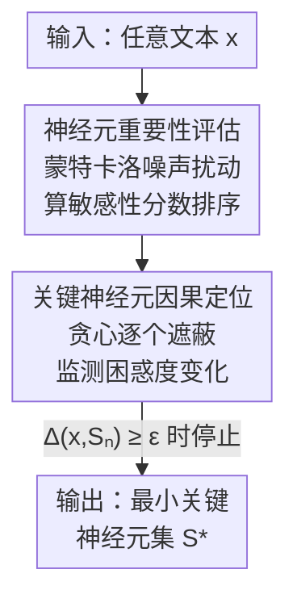

# The Achilles' Heel of LLMs: How Altering a Handful of Neurons Can Cripple Language Abilities

**会议**: ICLR 2026  
**OpenReview**: [https://openreview.net/forum?id=pJoSE7Cvj0](https://openreview.net/forum?id=pJoSE7Cvj0)  
**代码**: https://github.com/qqqqqqqzx/The-Achilles-Heel-of-LLMs  
**领域**: 可解释性  
**关键词**: 关键神经元, 因果定位, 扰动分析, 相变, 鲁棒性

## 一句话总结
本文提出一种「基于扰动的关键神经元因果定位」方法，在 21 个 0.5B–72B 的 LLM 上发现：只要把 3 个左右的神经元置零，就能让一个含 11 亿神经元的 72B 模型彻底崩溃（困惑度暴涨多达 20 个数量级），而且这些关键神经元高度集中在外层 MLP 的 down_proj，崩溃以「相变」而非渐变的形式发生。

## 研究背景与动机
**领域现状**：神经科学早就发现，大脑的计算能力可能并非均匀分布在所有神经元上，而是依赖极少数「高影响力」的神经元充当计算瓶颈（Arshavsky, 2001）。与此同时，越来越多研究指出 LLM 的层级化处理、预测编码机制与大脑的分层结构高度相似。一个自然的问题随之而来：LLM 是否也存在这样一小撮「不可或缺」的关键神经元？

**现有痛点**：AI 领域已有的脆弱性研究大多停留在**参数级 / 组件级**而非**神经元级**——比如权重离群点（weight outliers）、激活离群点（activation outliers）、以及最近的「super weights」（指出 MLP down_proj 里单个参数能灾难性影响性能）。但这些工作要么靠人工观察定位、要么只让准确率下降而非彻底失能，更没有刻画**多个神经元协同**的交互效应。

**核心矛盾**：要回答「LLM 是否有关键神经元」，需要一个**自动、可复现、且能做因果验证**的定位流程。单纯按激活大小或梯度大小排序（静态重要性度量）找不到真正的关键神经元——激活大小反映的是「计算负载」、梯度大小只对特定输入有效，二者都无法捕捉神经元对输入扰动的**动态敏感性**。

**本文目标**：找到一个稀疏子集 $S^* \subseteq N$（$|S^*| \ll |N|$），使得把它们置零就能让模型性能发生显著的、超过阈值 $\epsilon$ 的退化，并据此分析这些神经元的功能角色与分布规律。

**切入角度**：作者把「重要性排序」和「因果验证」拆成两阶段——先用蒙特卡洛噪声扰动给所有神经元算一个敏感性分数得到候选排名，再用贪心遮蔽逐个验证哪些神经元真正不可或缺。前者负责高效缩小搜索空间，后者负责给出因果证据。

**核心 idea**：用「噪声敏感性分析 + 贪心因果遮蔽」两阶段流程，在 $O(|N|)$ 复杂度内精确定位出导致语言能力灾难性崩溃的最小关键神经元集。

## 方法详解

### 整体框架
方法叫 **Perturbation-based Causal Identification of Critical Neurons**（基于扰动的关键神经元因果定位）。给定任意一段文本作为输入，整个流程分两个阶段：第一阶段往输入注入受控高斯噪声，测量每个神经元激活值的变化幅度，得到一个按敏感性降序排列的候选神经元列表；第二阶段沿着这个排名，从高到低贪心地逐步遮蔽（置零）神经元，每加入一批就监测模型困惑度的变化，一旦退化超过阈值就停止，返回触发崩溃的最小神经元集 $S^*$。

衡量遮蔽影响的核心量是困惑度的对数变化：把神经元集合 $S$ 置零得到模型 $M_{-S}$，定义

$$\Delta(x, S) = \log_{10}\left(\frac{\mathrm{PPL}_{M_{-S}}(x)}{\mathrm{PPL}_{M}(x)}\right) = \frac{1}{T\ln 10}\sum_{t=1}^{T}\left[\log P_M(x_t \mid x_{<t}) - \log P_{M_{-S}}(x_t \mid x_{<t})\right]$$

其中遮蔽操作把神经元 $(l, i)$ 的激活定义为 $\tilde{n}^{(i)}_l(x) = 0$（当 $(l,i)\in S$）否则保持原值。关键神经元定位问题即：找最小的 $S^*$ 使 $\Delta(x, S^*) \ge \epsilon$。

### 关键设计

**1. 噪声敏感性打分：用动态扰动而非静态量找候选**

要在十亿量级神经元里高效定位关键神经元，必须先有一个靠谱的候选排名，否则第二阶段无从下手。作者没有用激活大小或梯度大小这类静态度量（前面分析过它们抓不住功能关键性），而是用**蒙特卡洛噪声扰动**来衡量每个神经元对输入扰动的敏感程度。具体地，把输入 $x$ 加上 $K$ 次高斯噪声得到扰动输入 $\tilde{x}_i = x + \alpha\cdot\epsilon_i$（$\epsilon_i \sim \mathcal{N}(0,I)$，$\alpha$ 控制扰动幅度），对每个神经元 $s$ 累加干净激活与噪声激活的差异：

$$\mathrm{Imp}(s) = \frac{1}{K}\sum_{i=1}^{K}\left|A^{\mathrm{clean}}_s - A^{\mathrm{noisy}}_{i,s}\right| \xrightarrow{K\to\infty} \mathbb{E}_{\epsilon\sim\mathcal{N}(0,I)}\left[\left|f_{\theta,s}(x) - f_{\theta,s}(x + \alpha\epsilon)\right|\right]$$

由大数定律，这个蒙特卡洛估计量随 $K$ 增大收敛到真实的期望敏感性。算完所有神经元的 $\mathrm{Imp}(s)$ 后降序排列得到候选列表。直觉是：真正承担核心计算的神经元，其激活会对输入扰动表现出更剧烈的响应，因此排在前面。

**2. 贪心因果遮蔽：把指数搜索压成线性并给出因果证据**

光有重要性排名还不够——排名靠前不等于「去掉就崩溃」，需要做因果验证。但穷举所有神经元子集是 $O(2^{|N|})$，完全不可行。作者利用第一阶段的排名设计了**贪心搜索**：按步长 $\Delta n$ 递增地把候选集扩成 $S_n = \{s_1,\dots,s_n\}$（取重要性最高的前 $n$ 个），每次遮蔽后评估退化量 $\Delta(x, S_n)$，目标是

$$n^* = \arg\min_n \{n : \Delta(x, S_n) \ge \epsilon\}$$

一旦退化越过阈值 $\epsilon$ 就终止，返回最小集 $S_{n^*}$。这只需测试 $\lceil |N|/\Delta n\rceil$ 个候选集，把复杂度降到 $O(|N|)$。这一步是「因果」的关键：不是观察相关性，而是真的把神经元置零、看模型是否塌掉，从而把「重要」与「不可或缺」区分开。实验里 $\Delta n = 1$、$\epsilon = 1$。

**3. 输入无关的稳健定位：一条序列就能复现同一组神经元**

这套方法只需要**一条**输入序列就能跑，这本身就是一个很强的设计点。作者发现，只要输入文本长度超过最小阈值（$T > 10$），且 $K$、$\alpha$ 取到稳定值（$K=100$，$\alpha=5$），对同一个模型反复实验定位出的关键神经元**完全一致**——与文本类型（维基、新闻、传记、媒体）、语言（英/法/德/中/西）都无关，甚至经过微调和强化学习后的模型，关键神经元位置依旧不变、遮蔽后照样灾难性崩溃。这说明定位到的不是某次输入的偶然产物，而是模型**内在的架构依赖**，给「关键神经元真实存在」提供了可复现的证据。

### 损失函数 / 训练策略
本方法是**纯推理期的分析诊断流程，不涉及任何训练或参数更新**。关键超参：噪声尺度 $\alpha = 5$、蒙特卡洛采样次数 $K = 100$、贪心步长 $\Delta n = 1$、临界阈值 $\epsilon = 1$；统一用一条 30-token 的维基文本作输入，fp16 混合精度，4×A800(80GB) 上运行。

## 实验关键数据

### 主实验
在 21 个模型（0.5B–72B，涵盖 Llama-3 / Gemma / DeepSeek-R1-Distill / Phi-3 / Qwen2.5）上，遮蔽极少数关键神经元即触发困惑度暴涨。关键神经元占比一致落在 $10^{-8}$ 量级。

| 模型 | 关键神经元数 | 占比 ($10^{-8}$) | WikiText-103 原始→遮蔽后 |
|--------|------|------|------|
| Gemma-7B | 3 | 1.01 | 9.98 → 6.25×10²¹ |
| DeepSeek-R1-Distill-Llama-70B | 3 | 0.27 | 7.86 → 2.21×10⁴ |
| Qwen2.5-72B-Instruct | 3 | 0.26 | 10.23 → 2.24×10⁴ |
| Qwen2.5-0.5B-Instruct | 3 | 5.90 | 18.18 → 1.76×10⁶ |
| Llama-3.3-70B-Instruct | 7 | 0.63 | 5.41 → 3.86×10⁶ |

下游任务上，遮蔽关键神经元导致 7 个 benchmark **全线归零**——崩溃波及知识、推理、代码、数学、指令遵循、多语言、事实问答各个维度，说明关键神经元控制的是核心语言处理功能而非某个任务专属组件。

| 模型 | 条件 | MMLU-Pro | GPQA-Diamond | HumanEval | MATH | MGSM |
|------|------|------|------|------|------|------|
| Llama-3.3-70B | 原始 | 0.4441 | 0.2879 | 0.2988 | 0.4420 | 0.9590 |
| Llama-3.3-70B | 遮蔽后 | 0.0000 | 0.0000 | 0.0000 | 0.0000 | 0.0000 |
| Qwen2.5-72B | 原始 | 0.2442 | 0.3687 | 0.2866 | 0.3140 | 0.9080 |
| Qwen2.5-72B | 遮蔽后 | 0.0000 | 0.0000 | 0.0000 | 0.0000 | 0.0000 |

### 消融实验
与其他神经元定位策略及其他组件对比，验证方法的精准性与崩溃的定位来源。

| 对比维度 | 配置 | 关键指标 | 说明 |
|------|------|---------|------|
| 定位策略 | 随机 / 激活幅度(AM) / 梯度幅度(GM) | 遮蔽 1000 个仍仅小幅上升 | 静态度量抓不住关键神经元 |
| 定位策略 | 本文 | 仅 3 个即灾难崩溃 | 动态敏感性 + 因果验证 |
| MLP 组件 | up_proj / gate_proj | 遮蔽 Top-1000 困惑度仅升 0–1 个数量级 | 普通组件可容忍 |
| MLP 组件 | down_proj | 遮蔽极少数即升 5–6 个数量级 | 崩溃高度定位于此 |
| 参数 $\alpha$ | $\alpha \ge 5$ | 稳定在 7 个神经元 | 阈值效应，需足够扰动 |
| 参数 $K$ | $K > 80$ | 稳定在 7 个神经元 | 需足够采样收敛 |

### 关键发现
- **崩溃来源高度定位于 MLP down_proj**：up_proj / gate_proj 即使遮蔽上千神经元也只让困惑度升 0–1 个数量级，而 down_proj 只需几个就升 5–6 个数量级。作者归因于 down_proj 承担「信息压缩」角色（把高维表示压回嵌入空间），是天然的信息瓶颈，一旦失效便全网扩散。
- **关键神经元集中在外层**：早层做基础特征提取、晚层做最终整合输出，都是瓶颈；中间层有冗余通路可容忍扰动，所以关键神经元偏向外层而非均匀分布。
- **相变而非渐变**：单独遮蔽某个关键神经元几乎无影响，只有把整组同时遮蔽才触发爆炸式崩溃——说明它们构成一个**紧耦合的计算回路**，单个被遮时其余神经元能通过共享通路部分补偿，整组被破坏才丧失功能完整性。
- **超强鲁棒性**：跨文本类型、跨语言、跨微调/RL 训练，同一模型定位出的关键神经元完全一致，证明是内在架构依赖。

## 亮点与洞察
- **「3 个神经元放倒 720 亿参数」的反差极具冲击力**：它把神经科学里「少数关键神经元充当计算瓶颈」的原理，在 LLM 上找到了惊人对应，是一个很漂亮的跨学科类比落地。
- **两阶段「敏感性排序 + 因果遮蔽」是可复用范式**：用噪声扰动的动态敏感性缩小候选、再用贪心遮蔽做因果验证，这套思路可迁移到定位任何「关键组件」的诊断任务（比如关键 attention head、关键 layer）。
- **相变现象提示「回路」视角**：关键不是单个神经元而是协同的回路，这对机制可解释性研究是个重要提醒——孤立地评估单神经元重要性会严重低估其作用。
- **直接的安全含义**：既然外层 down_proj 的极少数神经元是「阿喀琉斯之踵」，那在安全敏感部署中就需要针对性加固，同时也警示了潜在的精准攻击面。

## 局限与展望
- **只做诊断不给修复**：论文揭示了脆弱性与分布规律，但没有给出如何让架构对这种极稀疏脆弱性更鲁棒的具体方案。
- **机制解释偏定性**：对「为何 down_proj 是瓶颈」「为何形成紧耦合回路」的解释更多是基于压缩/瓶颈的直觉与已有工作引用，缺乏对回路内部计算的更细致刻画。
- **阈值 $\epsilon$、噪声尺度 $\alpha$ 的设定带经验性**：虽然有参数敏感性分析显示稳定区间，但崩溃定义（$\Delta\ge\epsilon$）本身依赖人为阈值，跨模型「关键神经元数」的横向比较（3 vs 7 vs 45）需谨慎，受架构与阈值共同影响。
- **改进方向**：可探索训练期就分散关键依赖（增加冗余通路）、或在 down_proj 引入容错机制，把「单点崩溃」摊薄。

## 相关工作与启发
- **vs Super Weights (Yu et al., 2025)**: 他们研究 MLP down_proj 里的**参数级**离群点，靠人工观察定位，且只让准确率下降；本文研究**神经元级**，提供自动可复现的因果定位流程，遮蔽后导致语言能力**完全丧失**，并首次揭示多神经元协同的相变现象。
- **vs Super-neurons (Gong et al., 2025)**: 他们关注多义负载极高的神经元，放大其激活能强烈引导行为、但遮蔽影响有限；本文恰好相反，关注的是**遮蔽即崩溃**的关键神经元。
- **vs Wasserstein neurons (Kong et al., 2025)**: 他们定位编码句法结构的神经元、破坏许多个才选择性损害句法能力；本文的关键神经元只需极少数即导致**全面**而非选择性的能力崩溃。
- **vs 激活幅度(AM)/梯度幅度(GM)定位**: 这两类静态重要性度量遮蔽上千神经元也只造成温和退化，本文用动态噪声敏感性 + 因果验证才精准锁定超稀疏关键集。

## 评分
- 新颖性: ⭐⭐⭐⭐⭐ 神经元级因果定位 + 相变发现，把神经科学类比扎实落地到 LLM
- 实验充分度: ⭐⭐⭐⭐⭐ 21 个模型 0.5B–72B、多架构多数据集，且与多种定位策略/组件做对比
- 写作质量: ⭐⭐⭐⭐ 三大发现叙事清晰，但部分机制解释偏定性、依赖附录
- 价值: ⭐⭐⭐⭐⭐ 对鲁棒性、可解释性与部署安全都有直接启发

<!-- RELATED:START -->

## 相关论文

- [\[ICLR 2026\] From Tokens to Thoughts: How LLMs and Humans Trade Compression for Meaning](from_tokens_to_thoughts_how_llms_and_humans_trade_compression_for_meaning.md)
- [\[ICLR 2026\] Can LLMs Reason Soundly in Law? Auditing Inference Patterns for Legal Judgment](can_llms_reason_soundly_in_law_auditing_inference_patterns_for_legal_judgment.md)
- [\[CVPR 2026\] Language Models Can Explain Visual Features via Steering](../../CVPR2026/interpretability/language_models_can_explain_visual_features_via_steering.md)
- [\[ICLR 2026\] Mixing Mechanisms: How Language Models Retrieve Bound Entities In-Context](mixing_mechanisms_how_language_models_retrieve_bound_entities_in-context.md)
- [\[ICLR 2026\] LatentQA: Teaching LLMs to Decode Activations Into Natural Language](latentqa_teaching_llms_to_decode_activations_into_natural_language.md)

<!-- RELATED:END -->
