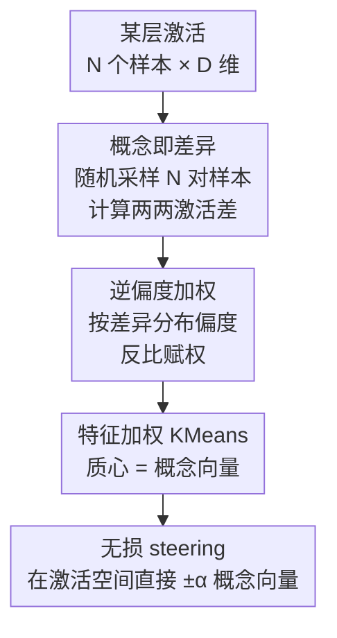

# The Deleuzian Representation Hypothesis

**会议**: ICLR 2026  
**OpenReview**: [https://openreview.net/forum?id=10JEfJtiJM](https://openreview.net/forum?id=10JEfJtiJM)  
**代码**: 待确认  
**领域**: 机制可解释性 / 概念提取  
**关键词**: 概念提取, 稀疏自编码器替代, 判别分析, 偏度加权聚类, 概念引导

## 一句话总结
这篇论文提出用"对激活值的两两差异做聚类"来无监督地从神经网络中提取可解释概念，作为稀疏自编码器（SAE）的简单替代：它把概念建模为"差异"（呼应德勒兹"概念即差异"的哲学观），用判别分析给出理论依据，并用激活分布的逆偏度给聚类加权来提升概念多样性，在 5 个模型、3 种模态、20 个任务上的概念质量超过现有无监督 SAE 变体、逼近有监督 LDA。

## 研究背景与动机

**领域现状**：机制可解释性（mechanistic interpretability）想从神经网络的内部激活里抽出"人能看懂的概念"。当前主流工具是稀疏自编码器（SAE）：在某一层的激活上训练一个过完备字典，靠 L1 / TopK 等稀疏约束逼出一组稀疏激活的特征，期望每个特征对应一个单义概念。

**现有痛点**：SAE 有几个绕不开的毛病。一是训练难、不稳定，对超参数（如 L1 系数 $\lambda$、阈值 $\theta$）敏感；二是仍可能学出"多义特征"，一个维度混着好几个概念；三是它把"稀疏"当成"可解释"的代理指标，而这个假设本身近年受到质疑——稀疏并不等于语义清晰。

**核心矛盾**：SAE 的训练目标是"在稀疏约束下尽量重建激活、抓住尽可能多的方差"，这等于把概念默认成"激活空间里普遍存在的结构性成分"，对应柏拉图 / 黑格尔式"概念是事实的普遍本质"的古典哲学观。但这种"普遍本质"视角被批评为过于死板：它倾向于抓住高方差的主轴，却未必对应人类真正在意的、相互区分的语义。

**本文目标**：换一个哲学立场来定义"概念"——不去建模激活的全部方差，而是去找激活之间**反复出现的差异**。这呼应德勒兹《差异与重复》里"概念源于差异、而非普遍共相"的观点。

**切入角度**：作者观察到，如果把"概念"看成"区分两个样本的方向"，那么两个样本激活之差 $\vec{x}_i - \vec{x}_j$ 本身就是一个候选概念方向；在各向同性假设下，它恰好等价于判别分析（LDA）给出的最优分离方向。于是只要对大量两两差异做聚类，反复出现的差异模式就会聚成稳定的概念向量。

**核心 idea**：用"对激活两两差异做（逆偏度加权的）KMeans 聚类"代替"训练 SAE 重建激活"，把概念提取从"重建普遍成分"转成"聚合反复差异"，方法只有一个可解释超参数 $k$（概念数），且天然支持无损 steering。

## 方法详解

### 整体框架

方法的目标是：给定某一层、$D$ 维、$N$ 个样本的激活，无监督地输出 $k$ 个"概念向量"（激活空间里的方向），每个方向对应一个可解释概念。整体只有三步加一个下游应用：先从样本两两相减得到一堆"差异向量"，再用激活分布的逆偏度给这些差异加权、做 KMeans 聚类，聚类中心（质心）就是概念向量；得到的概念向量因为本身活在激活空间里，可以直接做加减来 steering 模型行为，且完全可逆。

整个 pipeline 在样本数 $N$ 和维度 $D$ 上都是线性时间 / 线性内存，因此能扩展到大数据集和大模型，这点和需要训练优化的 SAE 形成对比。

### 关键设计

**1. 概念即差异：把"提取概念"重写成"聚合反复出现的激活差异"**

这是全文的立足点，针对的是 SAE"用重建抓普遍成分"导致概念死板、多义的痛点。作者不去建模激活的全部方差，而是把概念定义成"区分样本的方向"。具体地，定义差异集合 $\mathcal{D} = \{\vec{d}_1, \dots, \vec{d}_N\}$，每个 $\vec{d}$ 是一对样本激活之差。由于完全无监督、没有类别标签可用，无法像有监督那样只取"两类之间"的对比对；而算全部两两差异是 $O(N^2)$ 的，作者改为**随机采样 $N$ 对**来近似差异分布，并保证每个样本在减法两端各被用到一次。随后用 KMeans 把这 $N$ 个差异聚成固定的 $k$ 个簇，质心即概念向量。这样"反复出现的差异"会自然聚成稳定方向，而偶发的、一次性的差异被平均掉，得到的概念既无监督又只受一个可解释超参 $k$ 控制。

**2. 逆偏度加权聚类：压住"尖峰差异"以换取概念多样性**

直接对差异做 KMeans 会出问题：某些差异维度分布高度偏斜——大多数样本上接近 0，偶尔暴涨成大值。这类尖峰坐标会主导 KMeans 用的欧氏距离，逼出一堆冗余、雷同的簇，多样性塌掉。作者用分布的偏度来识别并惩罚它们。对一个概念方向 $\vec{d}_i$，取它在所有样本投影 $\{\vec{d}_i \cdot \vec{x}_j\}$ 上的归一化三阶中心矩作为偏度

$$\tilde{\mu}_3(\vec{d}_i) = \frac{\sum_{j=1}^{N}\left(\vec{d}_i \cdot \vec{x}_j - \mu(\vec{d}_i \cdot \vec{x}_j)\right)^3}{N\,\sigma(\vec{d}_i \cdot \vec{x}_j)^3}$$

然后给每个差异赋一个与偏度成反比的权重，把它做成 Feature-Weighted KMeans 的变体，质心计算时的加权距离为 $d(\vec{d}_i, \bar{C}) = \frac{1}{\tilde{\mu}_3(\vec{d}_i)}\,\lVert \bar{C} - \vec{d}_i \rVert^2$。为避免负权重导致聚类病态，并且因为"方向"不分正负（找的是方向而非朝向），对偏度为负的差异取其相反向量 $-\vec{d}_i$。这个逆偏度加权是论文唯一为"多样性"专门加的机制，消融里它把概念的有效秩（effective rank）和去冗余度都显著拉高。

**3. 与判别分析的等价：给"差异即概念"一个理论靠山**

作者要回答"为什么两个样本激活之差是个好的概念方向"。在有监督设定下，Fisher 判别分析给出区分两类的最优方向 $\vec{c} \propto (\Sigma_A + \Sigma_B)^{-1}(\vec{\mu}_A - \vec{\mu}_B)$。把单个样本对 $i, j$ 看成两个均值为 $\vec{x}_i, \vec{x}_j$ 的"簇"，在高维（transformer 通常 $\geq 512$ 维）下把协方差近似成对角，则当各簇分布各向同性（$\Sigma_i \propto \Sigma_j \propto I$）时，最优分离方向恰好 $\vec{c} \propto \vec{x}_i - \vec{x}_j$。也就是说，"把激活差异当作概念"等价于"假设概念在激活空间里各向同性分布"。这个推导比标准 LDA 的假设更弱：不需要同方差性（homoscedasticity）和高斯性，还能自然推广到多类。实验里 LDA 在 BART/CoNLL 上反而很差，正说明它的强假设有时不成立，而本文方法不吃这个亏。（附录另给了一个考虑各向异性的二次扩展，理论上更细但实验没更好，因此正文坚持各向同性版本。）

**4. 无损 steering：概念向量活在激活空间，加减完全可逆**

SAE 做 steering 要先把激活投影到概念空间、改完再投影回来，两次投影带来重建误差和信息损失。本文概念本身就是激活空间里的向量，可以直接在激活上操作：把样本表示按幅度 $\alpha$ 沿概念 $\vec{c}_i$ 平移，$\tilde{x} = x + \alpha \vec{c}_i$。先 $+\alpha$ 再 $-\alpha$ 能精确还原原始激活——修改只作用在目标方向、且可逆，因此称"无损 steering"。这不仅是个便利特性，也是对"概念真有因果影响"的验证手段：实验中在 CLIP 上压低 Romanticism、抬高 Abstract 能把画作表示推向抽象风格的近邻；在 BART 上调"国家名"概念能让模型把"Rio de Janeiro"换成"February"或反过来频繁提及国家名（还暴露出偏向 United States 的偏置）。

## 实验关键数据

### 主实验

评测用 **Probe Loss**（越低越好）：对每个真实属性，训练一维逻辑回归探针从提取的概念里恢复该属性，取最低交叉熵；多类属性取所有属性的中位数。覆盖 5 模型 × 3 模态 × 874 个属性、20 个任务，概念空间维度 6144（约激活的 8 倍）。

| 设定（任务） | 本文 Deleuzian | 最佳无监督 SAE | 有监督 LDA（参考） |
|--------------|----------------|----------------|--------------------|
| CLIP / WikiArt-Genre | **0.1230** | 0.1360 (Tk-SAE) | 0.0976 |
| DinoV2 / WikiArt-Style | **0.0137** | 0.0144 (Tk-SAE) | 0.0101 |
| BART / CoNLL-POS | **0.0639** | 0.1647 (Van-SAE) | 0.3875（LDA 失效）|
| AST / AudioSet | **0.0164** | 0.0169 (Tk/A-SAE) | 0.0164 |
| **平均排名 ↓** | **1.65 ± 0.85** | 2.65 ± 1.01 (Tk-SAE) | — |

本文在 20 个任务中的 13 个拿到最低 probe loss，平均排名 1.65 显著优于第二名 TopKSAE（2.65）。很多设定下其 probe loss 落在"有监督 LDA"与"次优无监督方法"之间。值得注意 LDA 在 BART/CoNLL 上崩坏，说明其正态 + 同方差假设此处不成立，而本文方法假设更弱、依旧稳定。

一致性用 **MPPC**（不同随机种子下概念集合的最大两两皮尔逊相关，越接近 1 越一致），跑 10 次取平均：

| 任务 | 本文 | Tk-SAE | Van-SAE |
|------|------|--------|---------|
| DinoV2 / ImageNet | **0.789** | 0.588 | 0.603 |
| AST / AudioSet | **0.830** | 0.601 | 0.837 |
| BART / IMDB | **1.0** | 0.996 | 0.996 |

本文整体比其它方法更一致，唯一例外是 VanillaSAE——但 Van-SAE 的概念质量和多样性都明显更差（见表 1）。

### 消融实验

在 CLIP/WikiArt 与 DeBERTa/CoNLL-NER 上拆解三个要素：输入空间（原激活 vs 两两差异）、概念识别器（SAE vs KMeans）、是否用逆偏度加权。多样性用有效秩（越高越好）和最大两两余弦（越低越冗余）衡量。

| 输入 | 识别器 | 偏度加权 | Probe Loss↓ (CLIP/DeBERTa) | 有效秩↑ (CLIP/DeBERTa) |
|------|--------|----------|----------------------------|------------------------|
| 激活 | Tk-SAE | ✗ | 0.0125 / 0.0839 | 96.1 / 183.9 |
| 激活 | KMeans | ✓ | 0.0133 / 0.1184 | 24.3 / 14.6 |
| 差异 | Tk-SAE | ✗ | 0.0134 / 0.1093 | 340.5 / 109.2 |
| 差异 | KMeans | ✗ | 0.0128 / 0.0841 | 17.9 / 5.65 |
| **差异 | KMeans | ✓（本文）** | **0.0119 / 0.0665** | **124.4 / 182.0** |

### 关键发现
- **"用差异"是质量的关键**：对比"激活+KMeans"与"差异+KMeans"两行，换到差异空间后 probe loss 明显改善，说明把概念建模成差异比建模成普遍成分更对路。
- **逆偏度加权是多样性的关键**：不加权时（差异+KMeans）有效秩只有 17.9 / 5.65、且高度冗余；加权后跳到 124.4 / 182.0，probe loss 也最低——这正是该权重设计的目的。
- **概念效率高**：在 CLIP/WikiArt-artist 上，只需约 2000 个概念（远少于 6144）就能超过所有竞争方法，说明方法能用更少方向高效恢复概念。
- **steering 验证因果性**：CLIP 风格迁移、BART 国家名增删都能定向改变输出，证明提取的概念对下游行为有因果影响，而非仅相关。

## 亮点与洞察
- **哲学立场直接转成算法**：把"概念即差异（德勒兹）vs 概念即普遍本质（柏拉图/黑格尔）"的对立，落成"聚类差异 vs 重建激活"的具体方法选择，是少见的"哲学动机—理论推导—实证"闭环。
- **逆偏度加权这一手很巧**：用三阶矩识别"平时为零、偶尔暴涨"的尖峰维度并反比压权，直击 KMeans 被尖峰主导、生成冗余簇的病根，是可迁移到其它聚类/字典学习场景的通用 trick。
- **无损 steering 是结构带来的免费午餐**：因为概念向量天生活在激活空间，省掉了 SAE 的两次投影和信息损失，可逆性还顺带成了因果验证工具。
- **单超参 + 线性复杂度**：只有概念数 $k$ 一个可解释超参、$O(N)$ 时间内存，相比 SAE 的难训练 / 多超参，工程上更省心、更易扩展到大模型。

## 局限与展望
- **只在 encoder 模型上评测**：作者刻意只用编码器（含 BART 的 encoder），以便用有监督标签衡量概念质量；对纯自回归/解码器 LLM 的适用性未充分验证。
- **各向同性假设**：理论等价依赖"概念在激活空间各向同性"，附录的各向异性二次扩展虽更一般却没带来更好结果，说明真实分布与该假设的偏离还没被很好处理。
- **steering 证据偏定性**：因果影响主要靠 CLIP/BART 的少量定性例子展示，缺乏对 steering 强度、副作用的系统量化。
- **随机采样近似**：为避开 $O(N^2)$ 而只采样 $N$ 对差异，采样规模与近似误差、对小数据集的稳健性之间的权衡未深入讨论。

## 相关工作与启发
- **vs 稀疏自编码器（Van/Gated/JumpReLU/Matryoshka/TopK/Archetypal-SAE）**: 它们靠重建+稀疏约束学过完备字典，训练难、多超参、把稀疏当可解释代理；本文不重建、改为聚类差异，单超参、线性复杂度、且 steering 无损，质量与一致性整体更优。
- **vs 有监督 LDA**: LDA 是本文方法在"同方差+正态"假设下的上界，但这些强假设有时不成立（BART/CoNLL 上 LDA 崩坏），本文用更弱的各向同性假设换来了更稳的无监督表现。
- **vs 探针 / CBM / TCAV / Contrast-Consistent Search**: 这些要么只测相关不测因果、要么依赖人工预定义的概念列表或对比分组，无法发现新概念；本文完全无监督、不需预设概念清单，且通过 steering 给出因果证据。
- **vs ICA**: ICA 做最大化统计独立的线性分解，但维度受限（768）、probe loss 普遍偏高；本文在概念质量和一致性上都更好。

## 评分
- 新颖性: ⭐⭐⭐⭐⭐ 从哲学立场重定义概念，并落成"聚类差异+判别分析"的全新无监督路线，是对 SAE 范式的实质性替代。
- 实验充分度: ⭐⭐⭐⭐ 覆盖 5 模型 3 模态 874 属性 20 任务，质量/一致性/消融齐全；但 steering 偏定性、未覆盖解码器 LLM。
- 写作质量: ⭐⭐⭐⭐ 动机—理论—实验链条清晰，公式与哲学叙事衔接自然。
- 价值: ⭐⭐⭐⭐⭐ 提供简单、可扩展、单超参、无损可控的概念提取工具，对机制可解释性社区有直接实用价值。

<!-- RELATED:START -->

## 相关论文

- [\[ICLR 2026\] Gauge-invariant Representation Holonomy](gauge-invariant_representation_holonomy.md)
- [\[ICLR 2026\] f-INE: A Hypothesis Testing Framework for Estimating Influence under Training Randomness](f-ine_a_hypothesis_testing_framework_for_estimating_influence_under_training_ran.md)
- [\[ICLR 2026\] The Geometry of Reasoning: Flowing Logics in Representation Space](the_geometry_of_reasoning_flowing_logics_in_representation_space.md)
- [\[ICLR 2026\] On the Predictive Power of Representation Dispersion in Language Models](on_the_predictive_power_of_representation_dispersion_in_language_models.md)
- [\[ICLR 2026\] MICLIP: Learning to Interpret Representation in Vision Models](miclip_learning_to_interpret_representation_in_vision_models.md)

<!-- RELATED:END -->
