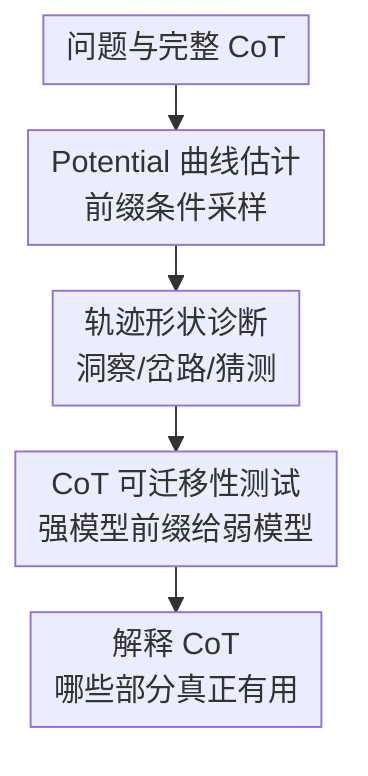

# The Potential of CoT for Reasoning: A Closer Look at Trace Dynamics

**会议**: ICLR2026  
**OpenReview**: [https://openreview.net/forum?id=uwuSD63wbe](https://openreview.net/forum?id=uwuSD63wbe)  
**代码**: 无  
**领域**: 可解释性 / CoT 推理轨迹分析  
**关键词**: CoT, 推理轨迹, potential, 推理洞察, CoT 可迁移性  

## 一句话总结

这篇论文提出用“potential”衡量给定 CoT 前缀对最终正确率的条件提升，并通过数学、科学问答与代码任务上的轨迹分析发现：CoT 的有效性往往集中在少数推理洞察上，同时也会出现切题但有害的推理岔路、难以人类解释的跳变和幸运猜测。

## 研究背景与动机

**领域现状**：Chain-of-Thought 已经成为让大语言模型处理数学、代码和复杂问答任务的标准做法。常见直觉是：模型先写出中间步骤，再给出答案，因此获得了更多计算 token，也能把大问题拆成更小的子问题。尤其在 AIME、MATH、HumanEval 这类任务上，CoT 往往显著优于直接回答。

**现有痛点**：问题在于，CoT 看起来像人类推理，并不等于它真的按人类可读的步骤在解决问题。已有研究发现，模型解释有时并不忠实于内部计算；还有一些结果显示，模型对插入错误、符号替换等扰动并没有人类直觉中那么敏感。于是，“哪一段 CoT 真的帮到了最终答案”就变成了一个比“CoT 是否有效”更细的问题。

**核心矛盾**：如果只看完整 CoT 是否得出正确答案，很容易把整条轨迹都当成有效推理；但真实轨迹中可能混着必要计算、无关铺垫、误导模型的岔路、最后一刻的猜测，甚至某些模型特有的奇怪触发词。作者想把这种混合状态拆开：不要评价一整段解释是否像推理，而要沿着 token 前缀追踪“从这一刻继续采样，模型还有多大概率答对”。

**本文目标**：论文主要回答三个问题。第一，如何定义一个可操作的指标，衡量某个 CoT 前缀对后续答对概率的贡献。第二，用这个指标观察真实 CoT 轨迹时，哪些片段会让正确率上升、下降或突然跳变。第三，强模型 CoT 里的关键洞察能不能迁移给弱模型，帮助弱模型解决原本答不出的题。

**切入角度**：作者选择 competition-level mathematics 作为主场景，尤其是 AIME-2024 / AIME-2025，因为这些题对模型既不是完全不可解，也不是轻易全对：同一个问题上，模型会产生多条不同轨迹，有的正确、有的失败。这种“初始正确概率介于 0 和 1 之间”的状态最适合观察某段 CoT 是否真正改变了后续成功率。

**核心 idea**：把 CoT 前缀看作一个“状态”，用从该状态继续采样得到正确答案的概率作为 potential，从而把推理轨迹中的洞察、岔路、跳变和猜测显式定位出来。

## 方法详解

### 整体框架

本文不是训练一个新模型，而是提出一套 CoT 轨迹分析方法。给定问题 $x$、模型生成的一条 CoT $c$ 和最终答案 $y$，作者在不同前缀位置截断 CoT，然后让同一个模型从该前缀继续采样多次，用答对比例估计这个前缀的 potential。沿着 token 或 chunk 位置画出的 potential 曲线，就能显示哪些片段让模型更接近正确答案，哪些片段反而把模型带偏。

整套分析还包括两层延伸：一层是对 potential 曲线形状做定量统计，归纳 reasoning insight、reasoning tangent、late spike、monotonicity 等现象；另一层是 CoT transferability，把强模型的部分 CoT 前缀喂给弱模型，观察弱模型的 potential 或准确率是否被“解锁”。这两层都围绕同一个核心问题：CoT 中真正可迁移、可定位的推理增益在哪里。

### 关键设计

**1. Potential 曲线估计：用条件答对率定位 CoT 前缀的真实贡献**

作者把一段 CoT 前缀 $c_{<t}$ 的价值定义为：在问题 $x$ 和这个前缀条件下，模型继续生成剩余 CoT 与最终答案时答对的概率。形式上，

$$
\mathrm{pot}(c_{<t};x)=P_{(c_{\ge t},y)\sim LM_\theta(\cdot|c_{<t},x)}(y=y^*)
$$

这个定义的好处是，它不需要人类去主观判断某句话“像不像推理”，而是直接问一个反事实问题：如果模型已经写到这里，再从这里随机续写很多次，最终答对的概率是多少？如果 $\mathrm{pot}(c_{<t};x)$ 比更短前缀 $\mathrm{pot}(c_{<s};x)$ 高很多，就说明 $c_{s:t}$ 这段前缀确实帮模型跨过了某个难点；如果几乎不变，说明这段可能只是模型容易复现的常规步骤；如果下降，则说明这段虽然出现在某条正确轨迹里，却会在平均意义上把模型带向更差的续写。

真实概率不可直接计算，所以论文用 Monte Carlo 估计：在每个截断点，从同一模型继续采样 $N$ 条补全，统计最终答案等于标准答案 $y^*$ 的比例。主实验中作者通常设置 $N=128$，并把完整 CoT 分成若干 chunk 来降低计算量。这个估计本质上类似 value function：每个 CoT 前缀是一个状态，potential 就是从该状态出发达到正确答案的价值。

**2. 轨迹形状诊断：把 CoT 分成洞察、岔路、跳变和猜测，而不是整体打分**

有了 potential 曲线后，论文不再笼统地说“这条 CoT 正确”或“这条 CoT 错误”，而是看曲线在哪些地方突变。大幅上升的片段被解释为 reasoning insight 或 reasoning jump。前者通常对应人类也能理解的关键数学洞察，比如发现对称性、把表达式化成平方、找到方程根；后者则是模型特有的突升，有时只是一个看似平凡的词或算术步骤，却会显著提高后续正确率。

同样重要的是下降。作者把大幅下降称为 reasoning tangent 或 reasoning flaw：模型进入一个看似合理、甚至局部没有明显错误的方向，但这个方向让后续采样更容易失败。这个设计抓住了 CoT 的一个细节：正确轨迹中也可能包含有害片段，因为某一次生成最终侥幸绕回来了，并不代表这段前缀在平均意义上是好状态。

论文还专门关注 late spike，也就是前面很长一段 potential 都接近 0，直到最后答案附近才突然上升。这通常对应“猜对”：模型的中间推理并没有真正推出答案，最后却输出了正确整数、选项或代码片段。这个现象会污染 pass@k，因为 pass@k 只要 $k$ 次采样里有一次最终答案正确就算成功，却不区分它是稳健推理还是幸运命中。

**3. Potential 优化 CoT：用贪心搜索证明更单调的推理轨迹是存在的**

论文进一步问：既然自然生成的 CoT 经常不单调，能否主动搜索一条让 potential 逐步提高的 CoT？作者提出一个概念验证式的 greedy 方法。先从空 CoT 开始，每次采样 $M$ 个候选 CoT chunk；对每个候选 chunk 接到当前前缀后计算 potential；保留 potential 最高的 chunk，并继续下一轮，直到候选包含最终答案。

这个过程不被作者当作实用推理算法，因为计算成本很高，需要为大量候选和大量截断点做重复采样。但它提供了一个重要证据：标准 CoT 曲线不单调，不一定是任务本身必须如此，而可能是模型自然采样会走入许多低价值路径。实验中的 optimized CoT 往往更短、更稳定，曲线也更接近单调上升，说明 CoT 空间里确实存在更“干净”的推理路径。

**4. CoT 可迁移性测试：用强模型部分轨迹检验推理洞察是否跨模型共享**

如果 potential 上升真的来自任务相关洞察，那么这些洞察不应只对生成它的模型有效。论文因此设计了 CoT transferability：把强模型生成的 partial CoT 给弱模型作为前缀，让弱模型从这里继续完成答案，再观察准确率随前缀比例增加而如何变化。

实验分两类。对 reasoning model，作者把 Qwen3-32B 或 GPT-OSS-20B 的部分 CoT 提供给 Qwen3-0.6B；对 non-reasoning model，作者用 Qwen3-235B thinking mode 生成较干净的 gold CoT summary，再给 Qwen2.5-7B 和 Qwen2.5-72B 补全。结果显示，即使只提供约 20% 的 partial CoT，弱模型的准确率也能快速上升，甚至解决原本从头采样无法解决的问题。这说明很多 CoT 片段不是“某个模型内部的私有口头禅”，而承载了跨模型可用的任务信息。

### 一个完整示例

可以把 AIME 中的一道题想成如下过程。模型从空前缀出发时，$\mathrm{pot}(c_{<0};x)$ 只有 0.15，说明从头采样 128 次大约只有 19 次能答对。它先把题目约束翻译成一个优化问题，potential 缓慢升到 0.25；这一步对人类看起来很基础，但对模型而言并不是最大难点。

随后模型尝试用 AM-GM 不等式给下界。这个方向表面上合理，却不是该题的紧路径，于是从这个前缀继续采样时，很多补全被带进死胡同，potential 可能掉到 0.05。这就是 reasoning tangent：它不一定每个符号都错，但它把后续搜索空间推向了更坏区域。

再往后，模型发现问题具有 $x=y$ 的对称结构，potential 立刻跃升到 0.55；接着找到关键三次方程的根，potential 又跃升到 0.85。这两个位置就是人类也容易认可的 reasoning insight。最后，模型做一个看似普通的算术化简，potential 从 0.85 到 1.0；作者把这类难以从人类角度解释的突升称为 reasoning jump，因为它暴露的是模型自身的局部难点，而不一定是题目本身最难的步骤。

### 损失函数 / 训练策略

本文没有训练新模型，也没有引入新的监督损失。所有分析都基于已有模型的条件采样和 Monte Carlo 估计。主要实验设置包括：potential 估计使用 $N=128$ 次采样，采样温度为 $T=0.6$、top-p 为 $0.95$；每个模型和数据集最多生成 32k token，并在从 partial CoT 继续生成时扣除已给前缀长度，避免 potential 上升只是因为总生成预算变长。

在 optimized CoT 的概念实验中，作者使用 chunk-level 贪心搜索。每一步采样多个候选 chunk，再用 potential 选择最优候选。这不是训练策略，而是对 CoT 空间的搜索，用来验证“更单调、更高价值的 CoT 是否存在”。

## 实验关键数据

### 主实验

论文主实验围绕 AIME-2024 的 potential 曲线形状展开。作者对每个问题采样多条 CoT，只保留最终答对的轨迹，并过滤掉从空 CoT 出发已经接近满分的问题。下面表格摘取 Table 1 中的关键统计，显示不同模型上 CoT 轨迹并不总是平滑积累证据。

| 模型 | 是否 reasoning model | Reasoning insights ↑ | Tangents ↓ | Late spike | Monotonicity |
|------|----------------------|----------------------|------------|------------|--------------|
| Qwen2.5-1.5B | 否 | 40% | 5% | 20% | 45% |
| Qwen2.5-7B | 否 | 62% | 9.5% | 14% | 42% |
| Llama3.1-8B | 否 | 46% | 33% | 6% | 15% |
| Llama3.1-70B | 否 | 37% | 40% | 5% | 17% |
| Qwen3-0.6B | 是 | 55% | 41% | 10% | 15% |
| Qwen3-32B | 是 | 36% | 18% | 0% | 36% |

这组结果最直接的结论是：即便只看最终答对的 CoT，也只有一部分轨迹接近单调上升。reasoning model 并不天然更“平滑”；小模型 Qwen3-0.6B 的 tangents 高达 41%，monotonicity 只有 15%，符合长推理模型容易 overthink、反复探索并偏离已发现答案的观察。

论文还在 MATH-500、HumanEval 和 GPQA-Diamond 上报告类似趋势。MATH-500 上 reasoning model 的 tangent 仍然偏高；HumanEval 上 CoT 更稳定，Qwen2.5-7B 的 monotonicity 达到 73%；GPQA 因为是四选一，多选项猜测空间导致 late spike 更明显。也就是说，potential 不是只在 AIME 上有效，而是一种跨任务的轨迹诊断工具。

| 数据集 / 模型 | Reasoning insights ↑ | Tangents ↓ | Late spike | Monotonicity | 主要现象 |
|---------------|----------------------|------------|------------|--------------|----------|
| MATH-500 / Qwen3-0.6B | 30% | 40% | 1.4% | 30% | reasoning model 仍常有岔路 |
| MATH-500 / Qwen3-32B | 28% | 35% | 0.9% | 45% | 大模型更稳但不完全单调 |
| HumanEval / Qwen2.5-7B | 30% | 4.8% | 0% | 73% | 代码任务中 CoT 更接近稳定积累 |
| GPQA-Diamond / Llama3.1-8B | 29.1% | 20.0% | 17.6% | 25.8% | 多选题更容易出现 late spike / 猜测 |

### 消融实验

这篇论文没有传统意义上的“去掉某个模块再训练”的消融，因为它是分析论文。更合适的对照是：不同轨迹评估方式、是否过滤 late spike、以及是否提供 partial CoT。下面表格总结了论文中最关键的分析型对照。

| 配置 | 关键指标 / 观察 | 说明 |
|------|-----------------|------|
| 标准 CoT potential 曲线 | 大量非单调、tangent 和 late spike | 说明最终答对不等于整条 CoT 都有效 |
| Potential-optimized CoT | 曲线更单调，许多 token 都推动 potential | 证明 CoT 空间中存在更稳定路径，但计算昂贵 |
| 原始 pass@k | 在 Qwen2.5-1.5B / 7B 上明显偏乐观 | 因为只要一次猜中答案就算成功 |
| 去除 late spike 后的 corrected pass@k | 分数下降，尤其大 $k$ 更明显 | late spike 揭示了 pass@k 被幸运猜测放大的问题 |
| 弱模型从空 CoT 作答 | 许多 AIME-2025 题无法稳定解决 | 空前缀 potential 低，模型缺少关键洞察 |
| 弱模型接收约 20% 强模型 partial CoT | 准确率快速提升 | 说明强模型 CoT 中部分洞察可跨模型迁移 |

CoT 可迁移性实验是本文最有说服力的外部验证。图 8 显示，Qwen3-0.6B 接收 Qwen3-32B 或 GPT-OSS-20B 的 partial CoT 后，在 AIME-2025 上的准确率随着前缀比例上升而很快提升；非 reasoning 的 Qwen2.5-7B 和 Qwen2.5-72B 接收 Qwen3-235B 的 summary CoT 后也有类似趋势。特别是约 20% 前缀就能带来明显收益，支持“CoT 里存在稀疏但关键的可迁移 insight”这一解释。

### 关键发现

- Potential 曲线经常强烈非单调。即便完整 CoT 最终答对，中间也可能出现让后续成功率下降的片段，这直接挑战了“CoT 是逐步积累证据”的朴素叙事。
- 大幅上升有两种不同来源：一种是人类也能理解的 reasoning insight，另一种是模型特有、难解释的 reasoning jump。后者提醒我们，不要把所有 CoT 突变都过度拟人化。
- Late spike 揭示了数学 benchmark 中的幸运猜测问题。模型可能长时间没有真正接近答案，最后输出了正确整数；这会让 pass@k 尤其在大 $k$ 时显得过高。
- CoT 的关键片段具有可迁移性。弱模型并不是只能利用自己生成的推理，它可以借助强模型的部分前缀解开原本答不出的题，说明至少一部分 CoT 承载的是模型无关的任务信息。

## 亮点与洞察

- Potential 是一个很干净的分析视角：它把“某句话是否有用”转化为“从这里继续采样，答对概率是否提高”。这个定义避开了人工解释打分的主观性，也能自然处理正确轨迹中的有害片段。
- 论文最有意思的地方是区分了 insight 和 jump。前者像人类解题中的关键顿悟，后者却可能只是模型在某个普通 token 后突然更会续写；这种区分让 CoT 可解释性少了一点浪漫化，多了一点机制感。
- Tangent 的发现对长推理模型很重要。更长的 CoT 不一定更好，因为模型可能在已经接近正确答案后继续探索，把自身带到低 potential 状态；这和“overthinking”现象形成了很自然的连接。
- CoT transferability 给训练和推理都留下了启发。未来可以把 high-potential 前缀作为更细粒度的奖励信号，或者用强模型的 partial rationale 辅助弱模型学习关键中间状态，而不是只用最终答案做稀疏监督。

## 局限与展望

- Potential 估计非常昂贵。每个截断点都要从同一前缀继续采样多次，论文中 $N=128$ 已经能得到稳定估计，但对于 32k token 的长 CoT 和大模型来说，成本远高于普通评测。
- 指标依赖可验证最终答案。AIME、MATH、HumanEval 适合这种分析，因为有明确答案或测试用例；开放式写作、规划、对话任务中，$y=y^*$ 不容易定义，potential 需要更复杂的 reward 或 verifier。
- Potential 解释的是外显轨迹状态，不等于模型内部因果机制。某个前缀提升答对率，说明它作为上下文有用，但不能直接证明模型内部真的按人类理解的概念完成了这一步。
- Reasoning jump 仍然难解释。论文能定位某个 token 或短片段让 potential 暴涨，却无法完全解释为什么这个片段对模型如此关键；这正是后续 mechanistic interpretability 可以深入的位置。
- CoT transferability 实验主要展示了“给定强模型前缀后弱模型能变好”，但还没有系统回答什么样的前缀最可迁移、最短前缀如何自动选择，以及错误前缀会如何污染弱模型。

## 相关工作与启发

- **vs CoT attribution / step scoring**: 许多工作尝试用梯度、扰动或人工标签给 CoT 步骤打分，本文则从条件生成概率出发，把每个前缀变成一个可采样估计的状态价值。优势是更贴近模型真实续写行为，代价是计算成本高。
- **vs Thought Anchors / fork token 分析**: 相近工作也研究 partial CoT completion，关注哪些 token 或步骤会改变后续生成。本文的区别在于，它不仅找“有用锚点”，还系统讨论有害岔路、猜测、非单调性，并把这些现象和 CoT 可迁移性联系起来。
- **vs CoT faithfulness 研究**: 以 Lanham 等为代表的研究强调 CoT 不一定忠实反映模型内部计算。本文没有否定这一点，而是提供了一个外部行为层面的补充：即便 CoT 不完全忠实，其中某些前缀仍可能显著提高后续答对概率。
- **vs RL value function / credit assignment**: Potential 很像按 Monte Carlo 估计的状态价值函数，只是状态是自然语言 CoT 前缀。这个类比启发后续用 segment-level reward、tree search 或 partial rationale 来缓解推理 RL 中最终答案奖励过稀疏的问题。

## 评分

- 新颖性: ⭐⭐⭐⭐☆ 用 potential 作为 CoT 前缀价值的定义很自然，但把它系统用于洞察、岔路、猜测和迁移性分析，组合得相当有新意。
- 实验充分度: ⭐⭐⭐⭐☆ AIME 主实验深入，MATH、HumanEval、GPQA 和多模型结果增强了可信度；不足是成本限制下仍偏分析型，缺少更大规模任务覆盖。
- 写作质量: ⭐⭐⭐⭐☆ 论文结构清晰，图例很好地把曲线和具体推理片段对齐；部分 reasoning jump 的解释仍偏假设，需要读者接受不完全解释的状态。
- 价值: ⭐⭐⭐⭐⭐ 对理解 CoT 是否真的在推理、如何识别有用中间步骤、以及如何设计更细粒度推理奖励都有直接启发。

<!-- RELATED:START -->

## 相关论文

- [\[ICLR 2026\] CoT Vectors: Transferring and Probing the Reasoning Mechanisms of LLMs](cot_vectors_transferring_and_probing_the_reasoning_mechanisms_of_llms.md)
- [\[ICLR 2026\] Block Recurrent Dynamics in Vision Transformers](block_recurrent_dynamics_in_vision_transformers.md)
- [\[ICLR 2026\] Faithfulness Under the Distribution: A New Look at Attribution Evaluation](faithfulness_under_the_distribution_a_new_look_at_attribution_evaluation.md)
- [\[ICLR 2026\] Comparing the learning dynamics of in-context learning and fine-tuning in language models](comparing_the_learning_dynamics_of_in-context_learning_and_fine-tuning_in_langua.md)
- [\[ICLR 2026\] Influence Dynamics and Stagewise Data Attribution](influence_dynamics_and_stagewise_data_attribution.md)

<!-- RELATED:END -->
