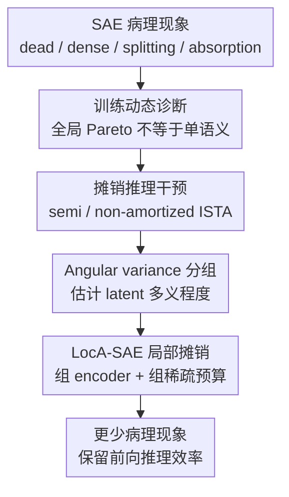

# The Price of Amortized inference in Sparse Autoencoders

**会议**: ICLR2026  
**OpenReview**: [https://openreview.net/forum?id=33wY6AI13k](https://openreview.net/forum?id=33wY6AI13k)  
**代码**: https://github.com/wenjie1835/Local_Amotized_SAEs  
**领域**: 可解释性 / 稀疏自编码器  
**关键词**: 稀疏自编码器, 机制可解释性, 摊销推理, 单语义特征, LocA-SAE  

## 一句话总结
本文指出 SAE 中很多死 latent、稠密 latent、特征拆分和特征吸收并不是孤立工程问题，而是共享 encoder 的摊销推理与单样本最优性冲突的结果，并提出按 angular variance 局部分组的 LocA-SAE 来在计算成本和单语义性之间折中。

## 研究背景与动机
**领域现状**：机制可解释性希望把大模型内部激活拆成更接近“概念”的可解释单元。稀疏自编码器（Sparse Autoencoder, SAE）是当前最常用的工具之一：它用一个过完备字典解码激活向量，再用稀疏 latent 表示模型在某个 token 上激活了哪些特征。理想情况下，每个 latent 应该对应一个单语义概念，既能重构原激活，又能让研究者做定位、消融和干预。

**现有痛点**：SAE 的实际训练经常出现几类病理现象：一部分 latent 几乎永不激活，形成 dead latents；一部分 latent 在很多 token 上频繁激活，变成 dense latents；一个概念被多个相似 latent 分摊，形成 feature splitting；罕见概念被高频概念吞掉，形成 feature absorption。这些问题过去常被分别归因于激活函数、TopK 约束、稀疏惩罚或训练技巧，但这种解释没有回答一个更根本的问题：为什么追求更好的重构-稀疏折中，反而常常没有带来更好的单语义性？

**核心矛盾**：本文把矛盾指向 SAE 的摊销推理（amortized inference）。经典 sparse coding 会对每个样本单独求解稀疏 code，因此目标天然偏向 instance-wise optimality；SAE 则训练一个共享 encoder $f_\phi(x)$，让它一次前向传播近似所有样本的 sparse code。共享 encoder 提供了巨大效率优势，但也把所有样本压进同一个全局映射和同一个全局稀疏预算里。当数据长尾、多模态、概念频率差异很大时，全局平均重构误差最优和每个样本的语义原子性很难同时满足。

**本文目标**：作者首先想证明这些病理现象之间存在系统性 trade-off，而不是互不相关的训练噪声；其次用半摊销和非摊销推理作为干预，验证减少共享 encoder 依赖是否能缓解病理；最后给出一个可扩展的中间方案，既不完全回到昂贵的逐样本优化，也不继续使用单一全局 encoder 处理所有 latent。

**切入角度**：论文把摊销差距（amortization gap）从“重构目标上的误差”重新连接到“可解释特征是否单语义”这一目标。它不是只问 SAE 是否在重构误差和稀疏度上更接近 Pareto frontier，而是问：这个 global Pareto 改善是不是以牺牲局部语义纯度、罕见概念完整性和跨运行稳定性为代价？

**核心 idea**：如果 SAE 病理来自全局共享 encoder 对不同语义复杂度 latent 的一刀切摊销，那么应当减少或局部化摊销推理，让高多义性 latent 和低多义性 latent 在不同 encoder 与不同稀疏预算下被编码。

## 方法详解
### 整体框架
这篇论文的方法部分可以理解为“三步走”。第一步，作者用训练动态分析证明：在全摊销 SAE 中，稀疏惩罚、重构误差和病理指标之间存在不合理 trade-off，单纯沿着重构-稀疏 Pareto frontier 前进并不会自动提升单语义性。第二步，作者把推理方式作为干预变量，引入 semi-amortized 和 non-amortized sparse coding，观察病理是否随摊销依赖降低而缓解。第三步，作者提出 LocA-SAE：保留共享 decoder，但按 latent 的 angular variance 分组，为不同组配置独立 encoder 和不同 TopK 稀疏预算。

这个框架的关键不是发明一个更复杂的 SAE 变体，而是把“病理从哪里来”变成一个可干预的问题。Semi-amortized 和 non-amortized 方案像因果探针：如果减少摊销之后病理显著缓解，那么问题就不只是某个激活函数没调好。LocA-SAE 则是工程折中：既承认逐样本 sparse coding 更接近单样本最优，又避免每个 token 都做长迭代带来的不可扩展成本。

### 关键设计
**1. 摊销差距重解释：把全局目标和单样本语义目标分开看**

论文首先把 SAE 与经典 sparse coding 放在同一套目标下比较。经典 sparse coding 对每个输入 $x$ 求

$$
z_o = \arg\min_z \|x - Dz\|_2^2 + \lambda \|z\|_1,
$$

而 SAE 用共享 encoder 给出 $z_a=f_\phi(x)$。摊销差距可以写成

$$
\Delta(x)=\big(\|x-Dz_a\|_2^2+\lambda\|z_a\|_1\big)-\big(\|x-Dz_o\|_2^2+\lambda\|z_o\|_1\big).
$$

这个定义表面上仍是重构-稀疏目标里的差距，但作者强调它在 SAE 可解释性里有额外含义：$z_o$ 是在当前样本上单独优化出来的稀疏解释，$z_a$ 是一个全局共享函数对所有样本妥协后的输出。MI 想要的是每个 token 上稳定、可缝合、语义纯的特征，而不是仅仅让全数据平均目标变小。因此，平均摊销差距 $\bar{\Delta}$ 下降只能说明全局 sparse coding 目标更接近，不能保证 feature splitting、feature absorption 或 feature consistency 变好。

这个视角解释了为什么很多 SAE 改进会“看起来更稀疏、重构更好，却不一定更可解释”。共享 encoder 会偏好高频、跨上下文可复用的方向，因为这些方向对平均重构误差最有边际收益；罕见但语义清晰的方向则容易被剪掉、吞并或拆开。这不是单个 latent 的偶然失败，而是全局目标在长尾概念分布上做出的系统性选择。

**2. 训练动态诊断：用病理指标之间的联动暴露共享 encoder 的代价**

为了证明这些现象不是孤立的，作者在 SAEBench 设置中跟踪 Standard SAE 和 TopK SAE 的训练过程，观察不同稀疏强度和不同 checkpoint 下的 NMSE、Dead Rate、Dense Rate、$\Delta F1$、Absorption Rate 以及摊销差距。这里 $\Delta F1=F1@2-F1@1$ 被用作 feature splitting 的代理指标：如果两个 latent 比一个 latent 对同一 probe 标签有明显增益，说明概念可能被多个 feature 分摊。Absorption Rate 则衡量主导 latent 不激活时，后续相关 latent 是否替代性激活，用来刻画罕见概念被吸收的情况。

训练动态给出的图景很不舒服：增加稀疏惩罚通常会提高 NMSE 和 Dead Rate，但 dense latent 并不会因此被彻底清理；在某些中后期 checkpoint，dead 和 dense 甚至会同时恶化。与此同时，Standard SAE 在高稀疏条件下会出现 Absorption Rate 和 $\Delta F1$ 的尖峰，说明模型为了满足全局预算，把解释性问题转化成了拆分和吸收问题。TopK SAE 确实靠硬门控压低了 dense rate，也缓解了部分 dead latent，但随着稀疏加强，absorption 和 splitting 仍会出现上升趋势。也就是说，TopK 改的是表层稀疏机制，不能消除共享 encoder 与单样本最优之间的根冲突。

最关键的观察是：摊销差距在训练中可以持续下降，病理指标却不随之同步改善。它说明“更靠近重构-稀疏 Pareto frontier”不是“更单语义”的充分条件。对 SAE 解释性而言，一个低 $\bar{\Delta}$ 的 encoder 仍可能把罕见概念压进高频 latent，把一个概念拆成多个 redundant feature，或者让不同训练运行学到难以 stitch 的局部基。

**3. 摊销方式干预：用 semi / non-amortized sparse coding 验证根因**

作者接着把推理方式本身作为干预变量。Fully-amortized 就是普通 SAE encoder 一步前向得到 sparse code；semi-amortized 从 encoder 的输出 $z^{(0)}$ 出发，再做少量 ISTA 式逐样本 refinement；non-amortized 则从零开始对每个样本求解非负 sparse coding，不依赖共享 encoder。它们共享 decoder $D$，并通过校准 $\lambda$ 尽量匹配激活密度，从而减少“只是更稀疏或更稠密”带来的混淆。

Semi-amortized 的更新形式近似为

$$
z^{(t+1)}=\max\big(z^{(t)}-\alpha(D^\top(Dz^{(t)}-x)+\lambda\mathbf{1}),0\big),
$$

non-amortized 则从 $z^{(0)}=0$ 开始运行更多 ISTA 步。这个设计很直接：如果病理主要来自 encoder 结构或全局共享推理，那么在 decoder 不变的情况下，只要把 inference 往单样本优化方向推，dead、splitting、absorption 等指标就应当改善。

实验结果大体支持这个判断。许多 SAE 变体在 semi-amortized 或 non-amortized 下 NMSE 显著下降，dead latent 更少，部分 absorption 和 splitting 也被缓解。比如 Pythia-160M layer 8 上，TopK 的 Full-Amortized NMSE 为 1.499、Dead Rate 为 0.307，而 Semi-Amortized 降到 NMSE 0.087、Dead Rate 0.022；BatchTopK 从 Full-Amortized 的 NMSE 0.537、Dead Rate 0.316 变为 Semi-Amortized 的 NMSE 0.101、Dead Rate 0.000。Gemma-2-2B layer 12 上，JumpReLU 的 Full-Amortized Absorption Rate 高达 0.923，Semi-Amortized 和 Non-Amortized 都把它降到 0.000。这样的变化很难只用“某个 SAE 架构更好”解释，更像是减少摊销依赖后，单样本语义目标重新获得了空间。

**4. LocA-SAE：按 angular variance 局部化摊销，而不是彻底放弃效率**

Semi-amortized 和 non-amortized 能说明问题，但逐样本迭代会带来明显计算负担。LocA-SAE 因此选择一个中间点：仍然保留前向 encoder 的摊销效率，但不再让一个全局 encoder 负责所有 latent。它先用一个预训练全局 SAE 得到 latent 激活，再对每个 latent 计算 angular variance：

$$
AVar_j = 1 - \|\mu_j\|_2,
$$

其中 $\mu_j$ 是所有激活 latent $j$ 的归一化输入方向的均值。直觉上，如果某个 latent 在方向很一致的一簇输入上激活，$\|\mu_j\|_2$ 会较大，$AVar_j$ 较小，说明它更接近单语义；如果它在方向分散的多类输入上激活，$AVar_j$ 较大，说明它可能承载更强多义性。

LocA-SAE 将 latent 按 $AVar_j$ 排序后切成 $G=8$ 个连续组，每组有独立 encoder $W_{enc}^{(g)}$ 和组内 Top-$k_g$ 稀疏预算，论文中使用的预算为 $(6,5,4,3,3,2,2,1)$。decoder 仍是全局共享字典 $D$，最终把各组 code 拼接后重构 $\hat{x}=Dz$。训练分四步：先预训练全局 SAE；按 angular variance 给 latent 分组；把全局 encoder 权重复制初始化到各组 encoder；最后在组级 TopK 约束下联合微调。

这个设计的意义在于，它承认不同 latent 的“多义性强度”不同，不应该被同一个稀疏门槛和同一个 encoder 映射处理。低方差、更稳定的 latent 可以用更严格稀疏预算；高方差、更复杂的 latent 则有更多局部容量来避免被高频概念吸收或被迫拆分。它不是完全追求 sparse coding 的单样本最优，而是把摊销从“全数据全 latent 共享”降到“latent 组内局部共享”。

### 损失函数 / 训练策略
基础 SAE 仍使用重构误差加稀疏约束的目标，形式为 $L=\|x-\hat{x}\|_2^2+\lambda\|z\|_1$，TopK 系列则用硬稀疏选择替代显式 $L_1$ 惩罚。LocA-SAE 的训练不从头随机训练全部结构，而是先训练一个全局 SAE，再用该 SAE 的 latent 激活统计计算 angular variance 分组，并把原 encoder 权重复制到每个组 encoder 作为初始化。这样做避免了组 encoder 从零开始时不稳定，也让 LocA-SAE 的改动更集中在“局部摊销和异质稀疏预算”上。

实验中的 semi-amortized refinement 主要用于干预验证。作者用少量 ISTA 步从 amortized code 出发修正每个样本的 code；non-amortized 则用更多 ISTA 步从零开始近似 sparse coding 解。附录中还对 BatchTopK 的 refinement 步数做了消融，发现迭代步数增加会单调降低 NMSE，但病理指标变化较小。例如 Pythia 上从 5 步到 25 步，NMSE 从 0.477 降到 0.132，Dead Rate 始终为 0；Gemma 上从 5 步到 25 步，NMSE 从 0.072 降到 0.025，Absorption Rate 从 0.014 降到 0.004。这说明中等步数已经能获得大部分重构收益，而病理缓解结论并不依赖某个非常精细的迭代预算。

## 实验关键数据

### 主实验
论文的主实验分成两类。第一类是训练动态实验，比较不同稀疏强度下 Standard SAE 和 TopK SAE 的病理指标变化；第二类是摊销方式干预实验，在多个 SAE 架构上比较 Full-Amortized、Semi-Amortized、Non-Amortized 和 LocA-SAE。这里摘出最能说明主张的结果。

| 设置 | 关键观察 | 代表数值 | 说明 |
|------|----------|----------|------|
| Standard SAE 高稀疏训练后期 | 病理可同时恶化 | Trainer 5 / checkpoint 77203: Dead Rate 0.3524, $\Delta F1$ 0.5008, Absorption Rate 0.9164 | 高稀疏没有换来更清晰 feature，反而出现强吸收和拆分 |
| Standard SAE 训练早中期 | dense latent 不随稀疏自然消失 | 多个早期 checkpoint Dense Rate@0.2 超过 0.66 | 共享 encoder 会保留高频方向，因为它们对平均重构有价值 |
| TopK SAE | 硬稀疏缓解 dense，但不消除根冲突 | 论文图中 absorption / $\Delta F1$ 仍随稀疏和训练阶段波动上升 | TopK 是有效工程技巧，但不是摊销问题的根治 |
| 摊销差距趋势 | 全局目标变好不等于单语义变好 | $\bar{\Delta}$ 可随训练下降，而 Dead / Dense / Absorption / $\Delta F1$ 不同步改善 | 这是全文最核心的证据链 |

在不同推理模式下，论文报告了更直接的干预结果。下面表格选取 Pythia-160M layer 8 与 Gemma-2-2B layer 12 的代表性数值。

| 模型 / SAE | 推理模式 | NMSE | Dead Rate | $\Delta F1$ | Absorption Rate | 结论 |
|------------|----------|------|-----------|-------------|-----------------|------|
| Pythia / TopK | Full-Amortized | 1.499 | 0.307 | 0.053 | 0.225 | 全摊销下重构和 dead latent 都较差 |
| Pythia / TopK | Semi-Amortized | 0.087 | 0.022 | 0.036 | 0.134 | 少量逐样本 refinement 明显改善 |
| Pythia / BatchTopK | Full-Amortized | 0.537 | 0.316 | 0.047 | 0.171 | batch-wise 稀疏仍受全摊销限制 |
| Pythia / BatchTopK | Semi-Amortized | 0.101 | 0.000 | 0.031 | 0.121 | dead latent 被消除，重构误差下降 |
| Pythia / LocA-SAE | Loc-Amortized | 0.427 | 0.000 | 0.013 | 0.055 | 不做逐样本迭代也能缓解多项病理 |
| Gemma / JumpReLU | Full-Amortized | 0.341 | 0.102 | 0.032 | 0.923 | full amortization 下 absorption 异常严重 |
| Gemma / JumpReLU | Semi-Amortized | 0.236 | 0.086 | 0.001 | 0.000 | refinement 直接消除该 absorption 异常 |
| Gemma / LocA-SAE | Loc-Amortized | 0.211 | 0.000 | 0.024 | 0.023 | 保持较低 dead 与 absorption，但 NMSE 不是最低 |

### 消融实验
| 配置 | 关键指标 | 说明 |
|------|----------|------|
| BatchTopK Semi-Amortized, Pythia, ISTA 5 步 | NMSE 0.477, Dead Rate 0.000, $\Delta F1$ 0.026, Absorption 0.110 | 少量 refinement 已消除 dead，但重构仍较差 |
| BatchTopK Semi-Amortized, Pythia, ISTA 25 步 | NMSE 0.132, Dead Rate 0.000, $\Delta F1$ 0.067, Absorption 0.121 | 重构收益大部分已经出现，病理指标没有剧烈改变 |
| BatchTopK Semi-Amortized, Pythia, ISTA 50 步 | NMSE 0.046, Dead Rate 0.000, $\Delta F1$ 0.039, Absorption 0.121 | 更多迭代继续降低 NMSE，但收益逐渐饱和 |
| BatchTopK Semi-Amortized, Gemma, ISTA 5 步 | NMSE 0.072, Dead Rate 0.000, $\Delta F1$ 0.034, Absorption 0.014 | Gemma 上少量 refinement 已经较稳 |
| BatchTopK Semi-Amortized, Gemma, ISTA 25 步 | NMSE 0.025, Dead Rate 0.000, $\Delta F1$ 0.034, Absorption 0.004 | 提升主要体现在重构误差和 absorption 下降 |
| BatchTopK Semi-Amortized, Gemma, ISTA 50 步 | NMSE 0.014, Dead Rate 0.000, $\Delta F1$ 0.033, Absorption 0.002 | 长迭代进一步逼近非摊销解，但计算成本更高 |

### 关键发现
- 减少对全摊销 encoder 的依赖，通常会降低 NMSE，并缓解 dead latent、feature absorption 和部分 feature splitting；这支持“病理来自共享摊销推理”的主张。
- 不同 SAE 架构的表层机制会影响具体病理形态。GatedSAE 往往 dead rate 很低但 dense rate 极高；TopK 和 JumpReLU 更强稀疏，但 full-amortized 下可能出现高 NMSE 或 absorption；BatchTopK 和 Matryoshka 在半摊销或非摊销下更稳定。
- LocA-SAE 的定位不是在所有指标上击败 non-amortized sparse coding，而是在不做逐样本长迭代的情况下，显著降低 dead latent 和 absorption。它用一些重构误差代价换取更好的可解释性指标和推理效率。
- 论文也诚实报告了异常情况：例如 Gemma / TopK 的 non-amortized 设置反而带来 $\Delta F1=0.197$ 和 Absorption Rate 0.400，说明逐样本优化不总是无条件更好，硬 TopK 约束与 ISTA soft-thresholding 之间可能存在机制不匹配。

## 亮点与洞察
- 这篇论文最有价值的地方，是把 SAE 的病理现象从“调参失败”提升到“推理范式错配”来讨论。它提醒读者，重构误差、稀疏度和可解释性不是同一个目标，沿着前两个目标优化可能会把第三个目标推坏。
- 摊销差距的重新解释很有启发。过去 amortization gap 更常被看作近似推理质量问题；本文把它和 MI 所需的 feature consistency、stitchability、monosemanticity 关联起来，使它成为解释 SAE 病理的统一线索。
- 用 semi-amortized / non-amortized 做干预很干净。因为 decoder 共享，变化主要来自 inference pattern，这比单纯比较不同 SAE 架构更能说明“共享 encoder 是否是瓶颈”。
- LocA-SAE 的 angular variance 分组是一个可复用 trick。很多可解释性方法都面对“有些特征稳定、有些特征多义”的异质性，按激活样本方向方差分配不同容量和稀疏预算，比统一 TopK 或统一 $\lambda$ 更符合数据分布。
- 对下游干预的附录实验也加强了论文论点。Targeted Probe Perturbation 和 Generative Intervention Scoring 显示 semi / non-amortized feature 在定向消融和生成干预中更有选择性，说明这些改动不只是优化了内部指标，也可能提升特征可控性。

## 局限与展望
- LocA-SAE 仍然是启发式局部分组。Angular variance 能捕捉激活方向多样性，但它只是 polysemanticity 的代理指标，不保证每个高方差 latent 都多义，也不保证低方差 latent 一定单语义。
- 实验主要围绕 Pythia-160M 和 Gemma-2-2B 的特定 residual stream 层展开。结论很有说服力，但还需要在更大模型、更多层、不同 activation site 和不同数据分布上验证。
- 病理指标本身仍是代理指标。例如 $\Delta F1$ 用 probe 的 top-1 到 top-2 增益近似 feature splitting，Absorption Rate 依赖标签和 latent 排名定义。它们能揭示趋势，但不能完全替代人工解释或真实概念级评估。
- Semi-amortized 和 non-amortized 的计算成本明显更高。LocA-SAE 缓解了这个问题，但它引入了多组 encoder、分组流程和组级预算选择，未来还需要更系统的 compute-quality scaling 分析。
- 论文指出 TopK non-amortized 在部分设置中反而加剧 splitting / absorption，这说明“减少摊销”不是万能药。未来需要研究硬稀疏选择、soft-thresholding、decoder geometry 和 semantic consistency 之间的更细机制。

## 相关工作与启发
- **vs 经典 sparse coding**: 经典 sparse coding 每个样本单独求解稀疏 code，更接近 instance-wise optimality，但计算成本高。本文认为 SAE 的共享 encoder 正是用效率换掉了部分单样本语义精度，LocA-SAE 则试图在两者中间找局部摊销折中。
- **vs TopK / BatchTopK SAE**: TopK 系列通过硬稀疏选择改善 dead latent 和 dense latent 问题，但仍属于全摊销 encoder。本文的结果显示，这类门控机制能缓解某些症状，却不能保证 absorption 和 splitting 消失。
- **vs Gated SAE / JumpReLU SAE**: Gated 和 JumpReLU 主要改激活函数或幅值估计方式，目标是提升重构 fidelity、减少 shrinkage 或改善稀疏控制。本文更关心推理方式本身，指出即使这些架构在某些指标上有效，full amortization 的根冲突仍可能留下。
- **vs Matryoshka SAE**: Matryoshka 通过层级宽度学习多粒度 feature，适合讨论特征层级和多分辨率解释。LocA-SAE 的分组不是按层级宽度，而是按 latent 激活方向的多样性来局部化 encoder，关注的是不同多义程度 latent 的异质稀疏需求。
- **对后续研究的启发**: SAE 研究不应只报告重构误差、L0 或 sparsity，更应把 dead、dense、splitting、absorption、feature consistency 和下游可控性作为联合评价。未来可以探索 meta-amortization、在线 dictionary learning、按样本簇局部 encoder、或者把 angular variance 与人工概念标签结合的混合分组。

## 评分
- 新颖性: ⭐⭐⭐⭐☆ 从摊销推理范式解释 SAE 病理很有角度，LocA-SAE 是自然但有效的第一步。
- 实验充分度: ⭐⭐⭐⭐☆ 覆盖训练动态、推理方式干预、多种 SAE 架构和两个模型层，附录也有 downstream intervention；但模型规模和层位还可继续扩展。
- 写作质量: ⭐⭐⭐⭐☆ 主线清楚，论点有统一性；部分表格和章节编号略混乱，且 TopK 表格疑似与 Standard 表重复，需要读者结合图和附录理解。
- 价值: ⭐⭐⭐⭐⭐ 对 SAE 可解释性研究很有提醒意义：不要把重构-稀疏 Pareto frontier 当成单语义性的替代目标，也不要只靠门控技巧掩盖摊销推理的结构性代价。

<!-- RELATED:START -->

## 相关论文

- [\[ICML 2026\] Ensembling Sparse Autoencoders](../../ICML2026/interpretability/ensembling_sparse_autoencoders.md)
- [\[ICLR 2026\] Toward Faithful Retrieval-Augmented Generation with Sparse Autoencoders](toward_faithful_retrieval-augmented_generation_with_sparse_autoencoders.md)
- [\[ICLR 2026\] AbsTopK: Rethinking Sparse Autoencoders For Bidirectional Features](abstopk_rethinking_sparse_autoencoders_for_bidirectional_features.md)
- [\[ICML 2026\] Sparse Autoencoders are Topic Models](../../ICML2026/interpretability/sparse_autoencoders_are_topic_models.md)
- [\[ICLR 2026\] On the Limits of Sparse Autoencoders: A Theoretical Framework and Reweighted Remedy](on_the_limits_of_sparse_autoencoders_a_theoretical_framework_and_reweighted_reme.md)

<!-- RELATED:END -->
