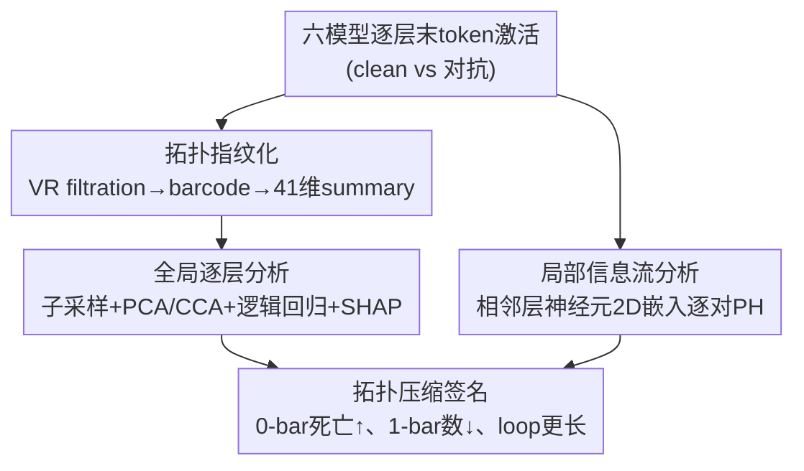

# The Shape of Adversarial Influence: Characterizing LLM Latent Spaces with Persistent Homology

**会议**: ICLR 2026  
**OpenReview**: [https://openreview.net/forum?id=v2PglvLLKT](https://openreview.net/forum?id=v2PglvLLKT)  
**代码**: 待确认  
**领域**: 可解释性 / LLM 安全  
**关键词**: 持续同调, 拓扑数据分析, 对抗攻击, 表示几何, 提示注入

## 一句话总结
本文用持续同调（persistent homology, PH）把 LLM 各层激活点云转成可跨模型比较的拓扑指纹，发现间接提示注入与后门微调两类机理完全不同的攻击都会在隐空间留下同一种"拓扑压缩"签名——表示从"小而多、紧凑多样"塌缩成"大而少、稀疏主导"，且这一现象在 3.8B 到 70B 六个模型上一致、出现得早、跨层高度可判别。

## 研究背景与动机

**领域现状**：现有的 LLM 可解释性工具——线性探针、稀疏自编码器（SAE）、激活方向提取——本质上都在隐空间里找**线性可分的方向**或**孤立的特征**。它们能告诉你"某个方向编码了某个概念"，却假设表示是平铺、可线性分解的。

**现有痛点**：这种线性/逐特征的视角看不到表示的**关系性、非线性、全局几何结构**。具体到对抗安全场景：线性探针确实能以很高准确率把正常激活和对抗激活分开，但它只给出一个判别边界，**说不清这两类表示在几何上到底差在哪**；而且 SAE 的字典绑定在特定模型权重上，没法跨模型、跨微调阶段做比较。

**核心矛盾**：模型的行为越来越被证明是编码在隐空间的**几何**里的，但主流可解释性工具只会看线性方向，对"激活之间相互作用所涌现的非线性几何"是盲的。更根本的是，过去研究往往只孤立地看一类攻击，没人回答过：机理上完全不同的攻击，会不会在模型内部留下**同一个**几何签名？

**本文目标**：(1) 找一套能刻画高维、非线性、坐标无关的表示几何的工具；(2) 用它在两类机理迥异的攻击上验证是否存在共享签名。

**切入角度**：作者主张持续同调（拓扑数据分析的主力工具）天然适配这个任务——它对噪声可证鲁棒、坐标无关、给出多尺度的关系几何摘要，因此能直接跨模型、跨输入分布、跨微调阶段比较；不像降维投影会丢掉全局拓扑。

**核心 idea**：把每层激活当成 $\mathbb{R}^D$ 里的点云，用持续同调算出 barcode，再把 barcode 向量化成可比的拓扑特征，从而"看见"对抗输入如何重塑表示的形状。

## 方法详解

### 整体框架

输入是六个指令微调 LLM（Phi3-mini 3.8B、Mistral 7B、LLaMA3 8B/70B、Phi3-medium 14B、Mixtral-8×7B）在 **clean / 对抗** 两种条件下、每层**最后一个 token** 的激活向量（最后 token 被认为聚合了模型对整段上下文的理解）。对抗条件覆盖两类攻击：间接提示注入（XPIA，用 TaskTracker 数据集的 clean vs poisoned）和后门微调导致的"装弱"（sandbagging，自己用 LoRA 在 WMDP 风格数据上微调出 locked vs elicited 两态）。

整套分析分两条并行支路，都建立在"把激活点云做持续同调"这一共同地基上：一条是**全局逐层分析**——把整层点云转成 41 维 barcode summary，再用机器学习探查哪些拓扑特征能区分正常/对抗；另一条是**局部信息流分析**——逐对相邻层把神经元嵌成 2D 点云做 PH，刻画神经元级的信息流变化。两条支路最终汇聚到同一个结论：对抗输入诱发"拓扑压缩"。

### 关键设计

**1. 拓扑指纹化：把激活点云压成可跨模型比较的 41 维 barcode summary**

线性探针只给判别边界、说不清几何差异，根因是它没有一个**坐标无关、对噪声鲁棒、多尺度**的表示。本文用持续同调补上这一环。对点云 $X\subset\mathbb{R}^D$（$D$ 通常 4096），在尺度参数 $\epsilon$ 下构造 Vietoris–Rips 复形：距离小于 $\epsilon$ 的点连边，三点两两相连就补一个三角形，依此类推纳入高阶单纯形。让 $\epsilon$ 从 0 增长就得到一族 filtration，PH 用代数拓扑记录各维拓扑特征的"诞生—死亡"，得到 barcode。本文关注 0 维（连通分量，0-bar）和 1 维（环/loop，1-bar）：0-bar 在 $\epsilon=0$ 时和点数一样多，随点连通而陆续死亡；1-bar 在边围出空洞时诞生、在三角形填满空洞时死亡。

barcode 不在欧氏空间里、不能直接喂给机器学习模型，所以作者改取它的**摘要统计**：births / deaths / persistences（bar 长度）的均值、标准差、中位数、分位数，再加上尺度不变的 birth/death 比值、bar 总数（拓扑多样性）、total persistence（所有 bar 长度之和，同时编码特征数量与大小）、以及 persistent entropy（bar 长度的异质性）。每条 barcode 最终压成一个 **41 维 barcode summary** 向量，这才是后续所有机器学习与解释的输入。这一步的妙处在于：barcode summary 是内在几何量、跨架构直接可比，正好绕开了 SAE 字典绑权重、无法跨模型比较的硬伤。

**2. 全局逐层分析：从拓扑特征中读出"拓扑压缩"签名**

光有指纹还不够，得证明它**判别力强**且能**解释**几何差异。作者对每层各取 $K=64$ 个子采样、每个含 $k=4096$ 个正常 / 对抗激活（子采样既降算力又有收敛性理论保证），用 RIPSER++ 算 barcode 并向量化成 41 维 summary，随后跑一条解释流水线：先用交叉相关矩阵剔除相关性 >0.5 的冗余特征（得到"pruned barcode summaries"），再用 PCA 看几何可分性、用 CCA 找驱动正常/对抗分离的特征、用逻辑回归量化判别力、用 Shapley 值解释每个特征的贡献方向。

结果非常干净：仅凭拓扑特征训练的逻辑回归在测试集和 5 折交叉验证上拿到**完美准确率与 AUC-ROC**，在早期层尤其优于 LDA / SVM / 原始或 SAE 降维后的线性基线（见主表）。CCA 与 SHAP 一致指认两个关键特征——0-bar 的**平均死亡时间**和 1-bar 的**数量**，且呈清晰的二分效应：0-bar 平均死亡小（点云更紧凑）+ 1-bar 多 → 判为 clean；0-bar 平均死亡大（点云更分散）+ 1-bar 少 → 判为 poisoned。综合起来就是**拓扑压缩签名**：对抗状态把表示压成"少数几个方向上的大 loop"，正常状态则是"许多更小、分布更均匀、更高熵的 loop"。这条签名跨六个模型一致（见压缩签名表），出现得早，甚至能扛住专门设计来规避 TaskTracker 防御的自适应攻击。本设计里还引入**局部离散比 LDR**——对每个激活差向量取 $k$ 近邻做 PCA，$\text{LDR}=\frac{\sum_{j=2}^{D'}\lambda_j}{\lambda_1+\epsilon}$，LDR 高表示方差均摊在次要方向、低表示集中在单一主方向；它把几何变化直接连到行为：被执行/被忽略的注入在中间层 LDR 升高（模型分配了额外容量去"加工"注入指令），被拒绝的注入则映到更压缩的低离散区。

**3. 局部信息流分析：在神经元尺度捕捉信息流的拓扑相变**

全局分析看的是整层点云的形状，但对抗影响在**神经元级、跨层信息流**上到底怎么发生的，还需要更细的镜头。作者对每一对层 $\ell, \ell'$ 构造一个 2D 点云：第 $i$ 个神经元取坐标 $(v^\ell_i, v^{\ell'}_i)$，即它在两层的激活值。直觉是相邻层激活高度相关、点会聚在 $y=x$ 单位线附近；真正发生显著变换的神经元会偏离这条线，制造出 PH 能捕捉的环结构。激活先归一化到零均值单位方差（排除纯尺度差异），并用"随机置换神经元索引"作对照。

用 1-bar 的 total persistence 度量拓扑复杂度，作者发现一个**结构相变**：clean 输入初期结构更复杂、随深度简化；poisoned 输入初期更简单、复杂度却随深度上升，约在第 12 层附近与 clean 显著分叉——说明对抗影响在深层引发了信息处理的重组。这个信号在置换对照下消失，证明它依赖**具体的神经元到神经元通路**而非统计假象。更实用的是，在没有标签的真实场景里，某个拓扑特征在所有样本上的**总体方差**与"clean vs poisoned 差异幅度"强相关（Spearman r 最高 0.78、p@5 最高 0.8），因此可以**无监督**地定位对抗效应最显著的层。把分析推广到非相邻层还表明：层间隔为 1、3 时归一化与对照仍可区分，间隔到 10 时差异基本消失，说明有意义的拓扑交互发生在邻近层。

## 实验关键数据

### 主实验

拓扑特征 vs 线性基线在 Mistral 7B / XPIA 上的判别准确率（70/30 划分，1000 clean vs 1000 poisoned）：

| 层 | LDA | SVM | LR | LR (SAE) | PH (本文) |
|----|-----|-----|-----|----------|-----------|
| Layer 1 | 0.995 | 0.888 | 0.870 | 0.743 | **1.000** |
| Layer 8 | 1.000 | 1.000 | 0.995 | 0.623 | **1.000** |
| Layer 16 | 1.000 | 1.000 | 1.000 | 0.673 | **1.000** |
| Layer 24 | 1.000 | 1.000 | 1.000 | 0.960 | **1.000** |
| Layer 32 | 1.000 | 1.000 | 1.000 | 1.000 | **1.000** |

PH 在所有层都拿满分，早期层（Layer 1）相对线性方法优势最明显；SAE 降维反而明显掉点。作者强调 PH 的价值不只是判别力满分，而是它的特征可解释——能说清正常/对抗在拓扑上差在哪。

### 拓扑压缩签名的跨模型一致性

| 模型 | 最低准确率 | $\bar{d}_{H_0}$↑ | $\#H_1$↓ | $\bar{\ell}_{H_1}$↑ |
|------|-----------|------------------|----------|---------------------|
| Phi3-mini (3.8B) | 1.00 | ✓ | ✓ᵃ | ✓ |
| Mistral (7B) | 1.00 | ✓ | ✓ | ✓ |
| LLaMA3 (8B) | 1.00 | ✓ | ✓ | ✓ |
| Mixtral-8×7B | 1.00 | ✓ | ✓ | ✓ᵃ |
| Phi3-medium (14B) | 1.00 | ✓ | ✓ | ✓ |
| LLaMA3 (70B) | 1.00 | ✓ | ∼ᵇ | ✓ |

签名（0-bar 平均死亡↑、1-bar 数量↓、剩余 loop 寿命↑）在六个模型上基本一致；ᵃ 表示 L1–L24 成立但在 L32 反转，ᵇ 表示该项跨层方向不定。两类攻击（提示注入 + 后门微调）共享同一签名。

### 关键发现

- **判别力最强的拓扑特征是 0-bar 平均死亡时间和 1-bar 数量**：前者刻画点云紧凑度，后者刻画环结构多样性；CCA 与 SHAP 两套方法独立指认它们，互相印证。
- **效应出现得早**：早期层 PH 就能完美区分，而线性方法在早期层更吃力，说明对抗签名在浅层就已成形。
- **依赖具体神经元通路而非统计假象**：随机置换神经元索引后局部信号消失，是排除"尺度/统计伪影"的关键对照。
- **几何直接关联行为**：被执行/忽略的注入中层 LDR 升高、被拒绝的注入被压到低离散区，把抽象几何量落到了 task 级行为上。
- **可无监督定位**：拓扑特征的总体方差与类间差异强相关（r 最高 0.78），无需标签即可找到对抗效应最显著的层。

## 亮点与洞察

- **把"对抗攻击的影响"重新表述成一个可测量的几何不变量**：不同机理的攻击共享同一拓扑签名，这个结论本身就很反直觉，也暗示了一种统一的对抗检测视角。
- **barcode summary 跨模型可比是真正的杀手锏**：SAE 字典绑权重、跨模型没法比，而这套坐标无关的拓扑摘要可以直接把 3.8B 和 70B 放在一起谈，这对"机制可解释性能否泛化"是个有价值的存在性证明。
- **"全局点云 PH + 局部神经元 2D 嵌入 PH"双视角**很可复用：前者看整层形状、后者看跨层信息流的相变，把同一工具用在两个尺度上互相印证，思路可迁移到记忆化、能力涌现等其它表示几何问题。
- **用总体方差无监督定位关键层**是个实用 trick：在没有 clean/poisoned 标签的真实部署里也能找到该盯哪几层。

## 局限与展望

- **解释 vs 检测的定位需要厘清**：线性探针其实已经能高准确率检测对抗，本文 PH 的增量主要在"解释几何差异"而非"提升检测"，论文也坦承这一点；实际落地为防御时性价比还需评估。
- **依赖"最后 token + 子采样"**：只取末 token 的聚合表示、且用 $k=4096$ 子采样，可能漏掉分布在序列中段或长尾上的对抗结构；VR filtration 与 PH 的算力开销在更大 $k$ / 更大模型上也是瓶颈。
- **签名并非处处一致**：70B 上 1-bar 数量这一项跨层方向不定，部分模型在最后一层（L32）出现反转，说明"压缩签名"在深层 / 超大模型上还有例外，机制尚未完全讲清。
- **攻击覆盖仍有限**：只测了间接提示注入和后门装弱两类，是否能推广到越狱、数据投毒、对抗后缀等其它攻击面仍待验证。

## 相关工作与启发

- **vs 线性探针 / 激活方向提取（Alain & Bengio；Zou et al.）**：它们找线性可分方向，能检测却说不清几何；本文用 PH 揭示可分性背后的拓扑结构，是互补而非替代。
- **vs 稀疏自编码器 SAE（Cunningham et al.）**：SAE 把表示拆成可解释"积木"特征，但逐激活孤立分析、对非线性几何盲，且字典绑权重无法跨模型比；本文计算内在、坐标无关的几何量，天然跨架构可比。
- **vs 早期把 PH 用于 CNN/MLP 的工作（Naitzat et al.；Zhang et al.）以及用 zigzag persistence 做层剪枝的 Gardinazzi et al.**：本文首次把 PH 规模化、系统化地用到大模型激活空间（至 70B+）并放到对抗干预下，拓展了 TDA 理解 LLM 行为的边界。

## 评分
- 新颖性: ⭐⭐⭐⭐⭐ 首次系统地用持续同调刻画大模型对抗下的隐空间几何，并发现跨攻击共享的拓扑压缩签名。
- 实验充分度: ⭐⭐⭐⭐ 六模型、两类攻击、全局+局部双视角、含线性基线与置换对照，但攻击面与解释 vs 检测的定位还可更深。
- 写作质量: ⭐⭐⭐⭐ 拓扑概念铺垫清晰、图示充分，但 PH 背景对非 TDA 读者门槛偏高。
- 价值: ⭐⭐⭐⭐ 为对抗可解释性提供了坐标无关、跨模型可比的新几何视角，思路可迁移到更广的表示几何研究。

<!-- RELATED:START -->

## 相关论文

- [\[ICLR 2026\] Emotions Where Art Thou: Understanding and Characterizing the Emotional Latent Space of Large Language Models](emotions_where_art_thou_understanding_and_characterizing_the_emotional_latent_sp.md)
- [\[ICLR 2026\] Influence Dynamics and Stagewise Data Attribution](influence_dynamics_and_stagewise_data_attribution.md)
- [\[ICLR 2026\] Internal Planning in Language Models: Characterizing Horizon and Branch Awareness](internal_planning_in_language_models_characterizing_horizon_and_branch_awareness.md)
- [\[ICLR 2026\] From Data Statistics to Feature Geometry: How Correlations Shape Superposition](from_data_statistics_to_feature_geometry_how_correlations_shape_superposition.md)
- [\[ICLR 2026\] Latent Thinking Optimization: Your Latent Reasoning Language Model Secretly Encodes Reward Signals in Its Latent Thoughts](latent_thinking_optimization_your_latent_reasoning_language_model_secretly_encod.md)

<!-- RELATED:END -->
