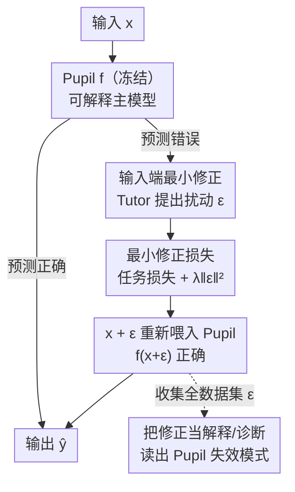

# The Tutor-Pupil Augmentation: Enhancing Learning and Interpretability via Input Corrections

**会议**: ICLR 2026  
**OpenReview**: [https://openreview.net/forum?id=TvP90DWijM](https://openreview.net/forum?id=TvP90DWijM)  
**代码**: 无  
**领域**: 可解释性  
**关键词**: 模型增强, 可解释性, 输入修正, 残差建模, 诊断工具

## 一句话总结
本文提出 Tutor-Pupil 增强框架：让一个固定的、可解释的「学生」（Pupil）模型负责主任务，再训练一个灵活的「导师」（Tutor）模型在**输入空间**施加最小扰动 $\epsilon$ 把学生喂错的样本「掰正」；由于修正发生在输入端、且被约束得尽量小，这些修正本身就成了一张诊断图，能暴露学生在哪里、为什么会失败，从而同时拿到性能提升与可解释性。

## 研究背景与动机
**领域现状**：把先验知识塞进模型有两条主流路线——一是靠架构（CNN 抓空间局部性、Transformer 抓长程依赖、PINN/PGNN 把物理方程写进 loss），二是**模型增强（model augmentation）**：保留一个体现先验的主模型，再挂一个灵活的辅助模型去补主模型抓不到的残差。辅助模型与主模型的连接可以是串联、并联、反馈等多种形态。

**现有痛点**：最常见的并联增强（parallel augmentation）让辅助网络直接去修正主模型的**输出** $\hat y = f(x) + \mathrm{NN}(x)$。在主模型表现好的区域，预测由可解释的 $f$ 主导，解释性还在；但恰恰在主模型表现差、最需要理解「为什么错」的区域，辅助网络反而主导了预测——而辅助网络通常是不透明的，于是**可解释性在最该解释的地方丢失了**。即便把修正量压小，它也只告诉你「输出要调多少」，完全说不清「模型为什么错、残差背后有什么结构」。

**核心矛盾**：复杂模型精度高但不透明，简单模型透明但表达力弱，二者之间存在精度—可懂度的 trade-off；而输出端修正的增强方案没能打破这个矛盾，只是把不透明性搬了个位置。

**本文目标**：在保住主模型可解释性的前提下提升性能，并且让「修正」这件事本身变成可以阅读的解释——既能补性能，又能当诊断仪。

**切入角度**：作者的关键观察是——如果修正发生在**输入空间**而非输出空间，那么修正向量 $\epsilon$ 就活在和数据同样的语义坐标里（哪个特征、朝哪个方向、动多大），天然适合人去看；再加上「修正越小越好」的约束，被动到的地方就是学生真正薄弱的地方。

**核心 idea**：用一个 Tutor 学「把输入 $x$ 最小地推到 $x+\epsilon$，使固定的 Pupil 在 $x+\epsilon$ 上预测正确」来代替「直接修正输出」，让修正向量同时承担纠错与解释两个角色。

## 方法详解

### 整体框架
整篇论文要解决的是：**怎样在不改动可解释主模型的情况下既提性能、又让修正可读**。Tutor-Pupil 给出的答案是一条「固定学生 + 输入端导师」的双模型回路。Pupil $f$ 是针对任务结构挑好的、且在 Tutor 训练期间**完全冻结**的模型（决策树、第一性原理公式、逻辑回归都行）；Tutor 是一个灵活网络，它不碰 $f$ 的参数，只输出一个施加在输入上的最小扰动 $\epsilon$，使被 $f$ 喂错的样本在 $x+\epsilon$ 处被正确分类/预测。训练完成后，把 Tutor 在全数据集上学到的 $\epsilon$ 收集起来观察，就得到一张关于「Pupil 在输入空间何处、朝何方向失效」的全局诊断图。

这条回路里真正贡献的是三件事：**输入端最小修正**（用 $\epsilon$ 而非输出修正）、**最小修正损失**（任务损失 + 修正幅度正则的双目标）、以及**把修正当解释/诊断**（按 Pupil 是否可解释分成两类用途）；当 Pupil 输入是高维图像时，还要补一个**潜空间修正**的工程化设计，让 Tutor 在 VAE 低维潜空间里动而不是逐像素动。

### 关键设计

**1. 输入空间最小修正：把纠错搬到和数据同坐标的输入端**

并联增强在输出端动手，导致不透明性在「最该解释」的区域复活。本文的核心反转是：让 Tutor 不去改 $\hat y$，而是提出一个加在输入上的小扰动 $\epsilon$，让冻结的 Pupil 在 $x+\epsilon$ 上给出正确答案——分类任务里就是把误判为 $y=1$ 的 $y=0$ 点轻推到决策边界之外、使 $f(x+\epsilon)=0$，反之亦然。这样做有效，是因为 $\epsilon$ 和原始特征活在同一个空间里：它的方向和大小直接告诉你「这个样本在哪个特征维度上、需要朝哪边挪多少」才能被学生接受，而这正是人能读懂的语言。比起仅仅暴露「输出要修多少」的输出端方案，输入端修正暴露的是「决策边界应该往哪里形变」，信息量更靠近问题本身。

**2. 最小修正损失：用幅度正则逼出「最薄弱处才动」**

光让 $f(x+\epsilon)$ 正确还不够——如果允许 $\epsilon$ 随便大，Tutor 会把所有样本搬到舒服的地方，修正就失去诊断意义。于是 Tutor 的训练目标是任务损失与修正幅度的加权和：

$$\mathcal{L} = \mathcal{L}_C\big(y,\, f(x+\epsilon)\big) + \lambda \,\lVert \epsilon \rVert_2^2$$

其中 $\mathcal{L}_C$ 是分类损失（如二元交叉熵），$\lambda$ 是限制修正幅度的正则系数。第一项逼着修正后预测正确，第二项逼着「能不动就不动、要动就尽量少动」。这个 $\ell_2$ 约束是整套解释性的支点：因为修正被压到最小，被显著动到的样本/区域就精确对应 Pupil 真正的失效边界；幅度大的 $\epsilon$ 出现在哪，哪里就是学生最薄弱、最需要改进的地方。

**3. 把修正当解释：按 Pupil 是否可解释分成两类诊断**

Tutor 学到的不是逐样本的局部反事实，而是在**整个数据集**上训练出来的一致修正模式，因此它给的是**全局**解释——这是它区别于传统逐实例反事实/SHAP 的关键。论文按 Pupil 性质把用途分成两支：① 当 Pupil 本身可解释（决策树、或第一性原理公式）时，$\epsilon$ 揭示的是**数据/物理世界**里被主模型忽略的高阶结构——比如理想气体例子中，Tutor 在小体积处系统性地缩小有效体积，恰好复现了范德华方程里描述分子有限体积的 $b$ 项的物理含义；② 当 Pupil 不可解释（如高维上的逻辑回归）时，$\epsilon$ 揭示的是**模型自身**依赖哪些特征、对什么敏感，Tutor 退化成一个探针，照出 Pupil 的隐式策略与盲区。同一套机制，因 Pupil 不同而解释对象不同，是本框架的概念亮点。

**4. 潜空间修正：让 Tutor 在 VAE 低维空间里动，避免逐像素纠错**

当 Pupil 的输入是高维图像（MNIST 每张 $28\times28=784$ 维），直接学逐像素的 $\epsilon$ 既贵又易过拟合。作者借生成模型的紧凑表示：用一个预训练 VAE 把图像编码到低维潜变量 $z$，Tutor（网络 $q_\phi$）只在潜空间产生扰动 $\Delta z$ 得到 $z'$，再由冻结解码器 $h_\psi$ 解回修正图像 $x' = h_\psi(z')$ 喂给 Pupil。这在功能上等价于通用的「$x' = x+\epsilon$」哲学，只是修正发生在更可控的潜空间。对应的损失加了潜空间一致性与重构保真两项：

$$\mathcal{L} = \mathcal{L}_C\big(y, f(x')\big) + \lambda_1\, D_{\mathrm{KL}}\big(q_\phi(z'\mid z)\,\Vert\, g_\theta(z\mid x)\big) + \lambda_2\,\lVert x'-x\rVert_2^2$$

$\lambda_1$ 控制 $z'$ 偏离 $z$ 的程度（潜空间里也保持「最小修正」），$\lambda_2$ 保证修正后的图像仍贴近原图。这样 Tutor 学到的修正是语义层面的（补全没闭合的圈、补齐残缺的笔画），人一眼能读懂，而不是一堆零散像素噪声。

### 一个完整示例
以理想气体的第一性原理 Pupil 为例走一遍：Pupil 是状态方程 $P = \frac{nRT}{V}$，它在大体积下逼近模拟数据，但体积变小时**系统性低估压强**，温度越高偏差越大。把它当 Pupil 冻结，训练 Tutor 学体积与温度的修正 $\epsilon=(\epsilon_V,\epsilon_T)$，目标是

$$\mathcal{L} = \left(\frac{nR(T+\epsilon_T)}{V+\epsilon_V} - P\right)^2 + \lambda\,\lVert\epsilon\rVert_2^2,$$

修正后预测 $\hat P = \frac{nR(T+\epsilon_T)}{V+\epsilon_V}$ 几乎完美贴合实验等温线。读 $\epsilon$ 会发现：体积越小，修正越大，且 Tutor 一律把有效体积**进一步缩小**。这条模式的物理含义不言自明——理想气体假设分子体积可忽略、能占满整个容器，而真实有限半径的分子中心无法贴到器壁内一个半径以内，可达体积被「挤掉」了一块，容器越小这块越显著。这正是范德华方程里 $b$ 项干的事。换句话说，Tutor 不是黑箱补丁，而是从数据里把「被违背的假设」指了出来；若对学到的 $\epsilon$ 再跑符号回归，甚至可能恢复出形似范德华、但 $\epsilon_V,\epsilon_T$ 是 $V,T$ 的函数的更自适应表达式。

## 实验关键数据

本文是框架性论文，用三个由简到繁的设定做验证，没有大规模 benchmark 对照表，但每个设定都给出了明确的性能与解释性证据。

### 主实验

| 设定 | Pupil 模型 | Pupil 单独 | Tutor-Pupil | 说明 |
|------|-----------|-----------|-------------|------|
| 二元分类（玩具） | 浅层决策树 | 基线 | 平均提升约 **13%** | 输入端 $\epsilon$ 把误判点轻推过边界 |
| 理想气体（第一性原理） | $P=nRT/V$ | 小体积系统性低估 | 几乎完美贴合实验等温线 | 修正复现范德华 $b$ 项物理含义 |
| MNIST 数字分类 | 逻辑回归 | **91%** | **98.5%** | 潜空间修正补全数字关键结构 |

### 分析 / 对比实验

| 对比对象 | 关键发现 | 说明 |
|---------|---------|------|
| vs 输出端并联增强 | 输入端 $\epsilon$ 暴露「边界该怎么形变」 | 输出端只暴露「输出要调多少」，且在失效区丢解释性 |
| vs SHAP（MNIST） | Tutor 修正直接改图、人可读 | SHAP 热力图在 784 像素上很难被人解读 |
| vs 反事实/局部解释 | Tutor 全数据集训练 → 全局失效模式 | 反事实只解释单个实例的特征敏感性 |

### 关键发现
- **修正幅度即诊断信号**：$\ell_2$ 正则下被显著动到的样本恰是 Pupil 的失效边界——理想气体里大修正集中在小体积区，MNIST 里集中在笔画残缺/比例失常的非标准手写体上。
- **解释对象随 Pupil 切换**：Pupil 可解释时 $\epsilon$ 解释**数据/物理**（揭示范德华式高阶结构）；Pupil 不可解释时 $\epsilon$ 解释**模型本身**（逻辑回归作为线性像素分类器对形变/缺笔敏感，与已知局限一致）。
- **全局 vs 局部**：Tutor 在全数据集学一致修正，给的是跨样本的系统性失效模式，而非反事实那样的单点解释。

## 亮点与洞察
- **「修正即解释」的视角转换**：把辅助模型从「事后补丁」重新定位成「诊断仪」——因为修正被约束在输入空间且最小化，它天然落在和数据同样的语义坐标里，可读性是设计出来的而非事后凑的。这个思路可迁移到任何「主模型 + 残差修正」的混合建模场景。
- **冻结 Pupil 是关键约束**：正因为 Pupil 在 Tutor 训练时完全不动，$\epsilon$ 的结构才纯粹反映 Pupil 的缺陷而非二者纠缠，解释才站得住。
- **数据驱动地「重新发现」物理定律**：理想气体 → 范德华的例子很漂亮——框架不是套公式，而是让模型自己从修正模式里指出被违背的假设，再用符号回归形式化，是连接经验行为与理论理解的一座桥。
- **潜空间修正的工程巧思**：高维下不逐像素动、而是借预训练 VAE 在低维潜空间动，把「最小修正」从像素层面提到语义层面，让修正变成「补全圈、补齐笔画」这种人能秒懂的操作。

## 局限与展望
- **作者承认**：当前 Tutor 在 Pupil 之后训练（两阶段），未来可探索两者**联合训练**，并施加 Tutor 与 Pupil 的「功能正交」约束，使二者捕捉互补、解耦的部分，可能同时提升性能与解释清晰度。
- **可解释性仍需额外约束才更强**：纯靠「最小扰动」鼓励解释性，但若想更清晰，可能要把 Tutor 限制在 superpixel 或其他人类对齐的特征分解上。
- **自己发现的局限**：三个设定都偏玩具/受控（决策树、理想气体、逻辑回归 on MNIST），缺乏在大规模深层 Pupil、真实复杂任务上的验证；「修正幅度小 ⇒ 解释可靠」的假设在高度非线性、对抗敏感的 Pupil 上是否成立尚未充分检验；$\lambda$ 的选取直接决定修正幅度与解释粒度，论文未系统分析其敏感性。
- **延伸用途（作者点出）**：Tutor 可对抗式训练（故意妨碍 Pupil）以暴露脆弱依赖、做鲁棒性诊断；也可用于**偏见检测**——若 Pupil 受训练数据混淆因子影响，Tutor 可能系统性地「撤销」这些影响，从而浮现隐含偏见或伪相关。

## 相关工作与启发
- **vs 并联（输出端）增强**：他们直接修正输出 $\hat y$，本文修正输入 $x$；区别在于输入端修正活在数据语义坐标里、且在主模型失效区仍保有可读性，而输出端方案恰在最需解释处丢失透明度。
- **vs 残差学习（ResNet）**：ResNet 在隐藏特征空间学残差映射，目的是**优化**（缓解梯度、易训练）；本文在输入空间学修正，目的是**建模与解释**——补主模型与数据的系统性偏差并使之可读。
- **vs 集成（ensemble）**：集成聚合多个同量级学习器降方差/偏差，常以牺牲解释性为代价；本文是主模型（含先验）+ 辅助模型的结构化交互，刻意保留主模型的可懂性。
- **vs SHAP / 反事实等局部解释**：它们针对单个实例做特征归因或最小改动，本文 Tutor 在全数据集上学一致修正，给的是跨样本的**全局**失效模式与多特征联动的高阶结构。

## 评分
- 新颖性: ⭐⭐⭐⭐ 「输入端最小修正即解释」的视角转换干净有力，把模型增强重新定位为诊断工具。
- 实验充分度: ⭐⭐⭐ 三个设定由简到繁、论证清晰，但都偏受控玩具，缺大规模/深层 Pupil 验证。
- 写作质量: ⭐⭐⭐⭐⭐ 叙事递进（决策树 → 理想气体 → MNIST）层层加码，理想气体→范德华的例子极具说服力。
- 价值: ⭐⭐⭐⭐ 为可解释混合建模提供了一个可迁移、可形式化（接符号回归）的通用框架，思路启发性强。

<!-- RELATED:START -->

## 相关论文

- [\[ACL 2025\] Enhancing Automated Interpretability with Output-Centric Feature Descriptions](../../ACL2025/interpretability/output_centric_interpretability.md)
- [\[ICLR 2026\] Sparse CLIP: Co-optimizing Interpretability and Performance in Contrastive Learning](sparse_clip_co-optimizing_interpretability_and_performance_in_contrastive_learni.md)
- [\[ICLR 2026\] Learning Pseudorandom Numbers with Transformers: Permuted Congruential Generators, Curricula, and Interpretability](learning_pseudorandom_numbers_with_transformers_permuted_congruential_generators.md)
- [\[ACL 2026\] Letting Tutor Personas Speak Up for LLMs: Learning Steering Vectors from Dialogue via Preference Optimization](../../ACL2026/interpretability/letting_tutor_personas_speak_up_for_llms_learning_steering_vectors_from_dialogue.md)
- [\[ICML 2025\] Towards Attributions of Input Variables in a Coalition](../../ICML2025/interpretability/towards_attributions_of_input_variables_in_a_coalition.md)

<!-- RELATED:END -->
