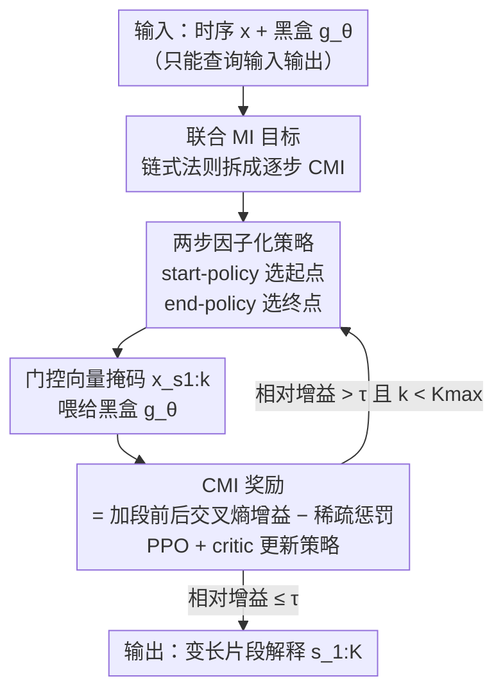

# TimeSeg: An Information-Theoretic Segment-Wise Explainer for Time-Series Predictions

**会议**: ICLR 2026  
**OpenReview**: [https://openreview.net/forum?id=alt9mSWULk](https://openreview.net/forum?id=alt9mSWULk)  
**代码**: 有（论文 footnote 提供，仓库地址见原文）  
**领域**: 可解释性 / 时间序列 / 信息论 / 强化学习  
**关键词**: 时间序列解释, 片段级解释, 互信息, 条件互信息, PPO

## 一句话总结
TimeSeg 把"为黑盒时序模型做解释"重新定义成"挑出一组连续子序列、让它们与模型预测的联合互信息最大"，再用链式法则把这个不可解的联合优化拆成逐步选段的强化学习问题，从而在严格黑盒（只能看输入输出）条件下产出对齐真值、边界精准的变长片段解释。

## 研究背景与动机
**领域现状**：在医疗、金融、制造等高风险场景里，黑盒时序模型必须给出可解释的依据。早期解释方法大多移植自通用 XAI（Integrated Gradients、SHAP、LIME），把每个时间点当独立特征打分，即所谓"逐点解释"（point-wise）。后续工作如 Dynamask、ExtrMask、FIT、WinIT、TimeX++ 在逐点框架上加时序平滑/连续性正则，或用替代解释器学伯努利掩码。

**现有痛点**：逐点方法定位精准，却天然产出"被时间间隙割裂"的零散显著点，人看不出连贯的时序模式；而想直接给"片段级解释"的方法（如 LIMESegment 用固定长度 patch、SpectralX 在频域扰动）又因为段长固定、无法自适应，常常错位或碎片化。两类方法各占一头，存在精准定位与片段连贯之间的取舍。

**核心矛盾**：片段级解释一直没被认真做，根子在于缺乏"什么才算一个有意义的片段"的原则性定义。逐点方法之所以可解，是因为它假设每个时间点是独立的伯努利变量；可一旦要选"段"，连续时间点必须联合考虑，候选段空间随序列长 $T$ 指数爆炸（$O(2^T)$），且多段之间还有复杂的组合依赖，连续松弛（Gumbel-Softmax 那一套）直接失效。

**本文目标**：(i) 给"片段级解释"一个可优化的形式化定义；(ii) 在严格黑盒（无梯度、无内部表示）下求解；(iii) 让每条样本自适应地决定选几段、每段多长。

**切入角度**：作者用信息论给出定义——好的解释就是"一组连续子序列，与黑盒预测的联合互信息最大、同时结构尽量简单"。这个定义把模糊的"可解释片段"变成了带正则的互信息最大化问题。

**核心 idea**：用链式法则把不可解的联合互信息拆成一串条件互信息（CMI），把"一次性选所有段"变成"逐步选段"的序列决策，再交给强化学习的策略去学，每选一段拿 CMI（交叉熵增益）当奖励。

## 方法详解

### 整体框架
TimeSeg 是一个**事后（post-hoc）、严格黑盒**的片段级解释器。对一条单变量时序 $x=(x_1,\dots,x_T)$ 和一个只能查询输入输出的黑盒分类器 $g_\theta$，目标是输出一组不重叠、变长的连续片段 $s_{1:K}=(s_1,\dots,s_K)$（每段 $s_k=(t^s_k,t^e_k)$ 用起止下标表示），使其最能解释 $g_\theta(x)$。

形式化目标（Def. 3.1）是最大化选中片段与预测的互信息减去复杂度正则：
$$E^*=\arg\max_E\; I\big(g_\theta(X);X_{s_{1:K}}\big)-\lambda J(s_{1:K}),\quad s_{1:K}\sim E(X).$$
直接解它有两座大山：联合互信息估不准、离散映射的组合搜索算不动。TimeSeg 的破局思路是把"一次选 $K$ 段"改写成"逐步选段"：用链式法则把联合 MI 拆成 CMI 之和，每一步选一个新段、用一次"加段前后交叉熵之差"当即时奖励，于是整个流程变成一个强化学习回合——策略网络是 agent，黑盒模型是环境，反复"提议一段 → 喂给黑盒 → 拿奖励"，直到边际增益低于阈值或达到 $K_{\max}$ 才停。

### 关键设计

**1. 信息论定义 + 链式法则把联合 MI 拆成逐步 CMI：让"选段"从指数搜索变成序列决策**

直接最大化联合互信息 $I(g_\theta(X);X_{s_{1:K}})$ 既估不准又要在 $O(2^T)$ 个候选段集合上做组合搜索。TimeSeg 的关键一步是用链式法则做精确分解：
$$I\big(g_\theta(X);X_{s_{1:K}}\big)=\sum_{k=1}^{K} I\big(g_\theta(X);X_{s_k}\mid X_{s_{1:k-1}}\big),$$
其中第 $k$ 项 CMI 衡量"在已选片段 $X_{s_{1:k-1}}$ 的基础上，再观察第 $k$ 段能带来多少关于预测的新信息增益"。CMI 本身仍不可直接算，作者借信息瓶颈原理给出变分近似，把每一项写成一个**交叉熵之差**：
$$I_{\theta,\phi}\big(Y;X_{s_k}\mid X_{s_{1:k-1}}\big)=\mathbb{E}\Big[\log p_\theta\big(y\mid x_{s_{1:k}}\big)-\log p_\theta\big(y\mid x_{s_{1:k-1}}\big)\Big].$$
这一拆解的价值在于：把"一次性挑全部段"（指数复杂度）换成"一段段顺序挑"（每步只决策一段），既绕开了对所有离散映射的组合搜索，又让"片段"成为可跨样本泛化的连贯解释单元。这是全文的地基，后面 RL、策略、终止判据都建立在它之上。

**2. 把逐步选段建模成 RL，用交叉熵增益当奖励：在严格黑盒下也能学**

有了逐步 CMI，作者顺势把它套进强化学习框架：解释器是 agent，第 $k$ 步的状态是输入 $x$ 加历史已选段 $s_{1:k-1}$，动作是选下一段 $s_k\sim\pi_\phi$，奖励正是那一步的 CMI——即加入新段前后黑盒输出的交叉熵差：
$$r_\theta(x_{s_k},x_{s_{1:k-1}})=\mathbb{E}_{p_\theta(y\mid x)}\Big[\log p_\theta(y\mid x_{s_{1:k}})-\log p_\theta(y\mid x_{s_{1:k-1}})\Big].$$
为防止策略偷懒"把所有段全选上"，奖励里减去一个稀疏代价 $c(s_k)=\frac1T\|m_k\|_1$（段越长惩罚越大），即时奖励变成 $R_k=r_\theta-\lambda c(s_k)$。因为奖励只用到黑盒的输入和输出概率、完全不碰梯度或内部表示，TimeSeg 才能在严格黑盒下工作——这正是它相对 TimeX++（依赖内部 embedding）、IG（依赖梯度）的根本差异。优化上，由于段是离散采样、目标对策略参数不可导，REINFORCE 方差又大，作者上 actor–critic：引入价值网络 $V_\psi$ 当可学基线，用一步 TD 误差算优势 $A_k=R_k+\gamma V_\psi(x,s_{1:k})-V_\psi(x,s_{1:k-1})$ 降方差，再用 PPO 的裁剪目标约束策略更新幅度，actor 与 critic 联合训练。

**3. 两步因子化策略 + 门控向量：结构上保证生成合法变长段，并区分"全局视野"与"黑盒视野"**

选段最棘手的约束是起点必须不晚于终点（$t^s_k\le t^e_k$），而这恰恰让连续松弛失效。TimeSeg 不去建模所有合法"起-止"对的联合分布，而是把策略因子化成两个条件分布——先采起点、再在合法范围内采终点：
$$\pi_\phi(s\mid x,s_{1:k-1})=\pi_{\phi_s}(t^s\mid x,s_{1:k-1})\,\pi_{\phi_e}(t^e\mid t^s,x,s_{1:k-1}).$$
这样从构造上就保证每段都合法、非空，天然产出变长片段。另一个细节是"视野不对称"：策略网络和价值网络需要看全序列才能谋划下一段选哪里，而黑盒只应看到被选中的片段。作者用二值门控向量 $m_k\in\{0,1\}^T$ 标记某时间点是否被第 $k$ 段覆盖，组合门控 $m_{1:k}=m_1\vee\cdots\vee m_k$。给策略/价值网络的输入是把 $m_{1:k-1}$ 拼到 $x$ 上（$[x;m_{1:k-1}]$，全局视野 + 已选标记）；而喂给黑盒的输入则是 $x_{s_{1:k}}=m_{1:k}\odot x+(1-m_{1:k})\odot\bar x$，未选位置用训练集均值 $\bar x$ 中和，确保黑盒只依据被选片段做预测。

**4. 实例级自适应终止：每条样本自己决定选几段**

不同时序需要的解释段数本就不同，硬定一个 $K$ 不合理。TimeSeg 在每一步用归一化的相对增益判停——把当前 CMI 奖励除以当前交叉熵，一旦相对增益跌破阈值 $\tau$ 就停止：
$$r_\theta(x_{s_k},x_{s_{1:k-1}})\big/\mathbb{E}_{p_\theta(y\mid x)}\big[-\log p_\theta(y\mid x_{s_{1:k-1}})\big]\le\tau.$$
论文设 $\tau=0.3$、$K_{\max}=5$。这让段数 $K$ 随样本自适应：信息已经差不多被覆盖时就收手，避免冗余段。训练时起止下标按策略分布采样以鼓励探索，推理时则改用 argmax 确定性选段，保证解释稳定可复现。

### 损失函数 / 训练策略
总目标是最大化期望累积奖励 $L(\phi)=\mathbb{E}\big[\sum_k r_\theta(x_{s_k},x_{s_{1:k-1}})-\lambda c(s_k)\big]$；actor 用 PPO 裁剪代理目标 $L^{\text{PPO}}(\phi)=\mathbb{E}\big[\sum_k\min(\rho_k A_k,\,\text{CLIP}(\rho_k,1-\epsilon,1+\epsilon)A_k)\big]$（$\rho_k$ 为新旧策略采样比），critic 用 MSE 拟合自举价值目标 $L^{\text{value}}(\psi)=\mathbb{E}\big[(V_\psi(x,s_{1:k-1})-(R_k+\gamma V_\psi(x,s_{1:k})))^2\big]$。黑盒 $g_\theta$ 用 TCN 实现，策略与价值网络均为 3 层 1D CNN。

## 实验关键数据

### 主实验
在带真值解释段的数据集上，与逐点法（Dynamask/WinIT/TimeX++）、patch 法（LIMESegment）、梯度法（IG）对比；其中 IG 与 TimeX++ 需访问内部信息（表中带 *），TimeSeg 严格黑盒。指标为 F1↑、IoU↑、连续性 Cont.↓（同一稀疏度下对齐）。

| 数据集 | 指标 | TimeSeg | 次优（方法） | 说明 |
|--------|------|---------|--------------|------|
| MIT-ECG | F1 ↑ | **0.739** | 0.593（TimeX++*） | 严格黑盒反超需内部访问的 TimeX++ |
| MIT-ECG | IoU ↑ | **0.621** | 0.460（TimeX++*） | 大幅领先 |
| MIT-ECG | Cont. ↓ | **0.006** | 0.006（LIMESegment） | 连续性与 patch 法持平 |
| SeqComb-UV | F1 / IoU ↑ | **0.645 / 0.495** | 0.636 / 0.489（TimeX++*） | 略胜且无需内部访问 |
| LowVarDetect-UV | F1 / IoU ↑ | **0.499 / 0.356** | 0.467 / 0.314（LIMESegment） | 全面领先黑盒基线 |
| FreqShapes-V | F1 / IoU ↑ | 0.722 / 0.576 | 0.799 / 0.666（TimeX++*） | 次于用内部信息的 TimeX++ |

在**无真值**的真实数据上做遮挡分析（只留选中段看 AUROC 掉幅 Suff.↓，移除选中段看 Comp.↑，Mean/Zero 两种替换）：

| 数据集 | 指标 | TimeSeg | 次优 | 对比 |
|--------|------|---------|------|------|
| MIT-ECG | Suff.↓ (Mean) | **0.70** | 23.51（WinIT） | 只留选段时几乎不掉点 |
| Wafer | Suff.↓ (Mean) | **0.19** | 31.13（Dynamask） | 选段充分性碾压 |
| GunPoint | Comp.↑ (Mean) | **46.41** | 9.15（Dynamask） | 移除选段时掉点最大 |

关键现象：TimeSeg 只用选中段预测时 AUROC 掉幅 ≤2%，而次优方法普遍 ≥31%，且连续性低至 1–2%，说明所选片段既充分又连贯。

### 消融实验

| 配置 | 关键指标 | 说明 |
|------|---------|------|
| $\lambda=0.1$（MIT-ECG） | F1 0.702 / Sparsity 0.218 | 惩罚小 → 段更长、更保预测性能但不简洁 |
| $\lambda=0.3$ | F1 **0.739** / Sparsity 0.144 | 最佳折中（论文采用值） |
| $\lambda=0.9$ | F1 0.690 / Sparsity 0.098 | 惩罚大 → 段更紧凑、F1 略降 |
| $K_{\max}=1$（SeqComb-UV） | F1 0.499 / 平均段数 1.0 | 被迫只选一段、无法覆盖两个关键模式 |
| $K_{\max}=3$ | F1 **0.652** / 平均段数 1.65 | 指标饱和 |
| $K_{\max}=7$ | F1 0.642 / 平均段数 1.65 | 再加大无明显变化 |

### 关键发现
- $\lambda$ 如设计般起作用：增大 $\lambda$ 段更紧凑、预测性能略降；减小则段更长更保性能。它给了对解释稀疏结构的直观控制旋钮。
- $K_{\max}$ 只需"足够大不约束策略"即可，$K_{\max}\ge3$ 后指标稳定、平均段数自动停在 ~1.65，不必精细调参——这正是自适应终止判据在起效。
- 最亮眼的是 MIT-ECG 与遮挡分析：TimeSeg 在不碰梯度/内部表示的严格黑盒下，反超依赖内部信息的 TimeX++，说明"片段级 + 信息论"定义抓到了真正的判别性时序模式。

## 亮点与洞察
- **把"可解释片段"做成可优化的信息论目标**：用"与预测的联合互信息最大 + 复杂度正则"给片段下定义，再用链式法则降成逐步 CMI，干净地绕开了 $O(2^T)$ 组合爆炸——这是从"启发式画框"到"原则性定义"的关键一跃。
- **奖励即 CMI，天然契合黑盒**：把交叉熵增益当奖励，只需查询黑盒输入输出，是它能在严格黑盒下打过白盒方法的根本原因；这套"信息增益当 RL 奖励"的思路可迁移到任何需在黑盒约束下做特征/区域选择的解释任务。
- **两步因子化策略解决合法性**：先起点后终点的条件分解，用结构而非惩罚保证 $t^s\le t^e$，是处理"带顺序约束的离散选择不能用连续松弛"的实用范式。
- **门控向量区分双重视野**：策略看全序列谋划、黑盒只看选中段，靠拼接 vs 掩码两套用法实现，设计简洁却到位。

## 局限与展望
- 主体方法与实验聚焦**单变量**时序；多变量仅在附录 D.5 用通道选择扩展，正文未充分展开，多变量下段与通道的联合解释仍待验证。
- 解释质量依赖黑盒预测概率本身可信；若黑盒预测系统性偏差，CMI 奖励也会被带偏，论文未深入讨论黑盒不可靠时的鲁棒性。
- 变分近似与 PPO 训练引入若干超参（$\lambda$、$\tau$、$K_{\max}$、$\gamma$、裁剪 $\epsilon$），虽显示对 $\tau$/$K_{\max}$ 稳健，但 RL 训练的稳定性与计算成本（每步都要查询黑盒）相比一次性逐点方法更高。
- 评测数据集规模偏小（合成 + MIT-ECG/Epilepsy/Wafer/GunPoint），更长序列、更复杂多类任务上的可扩展性有待检验。

## 相关工作与启发
- **vs 逐点法（Dynamask / WinIT / TimeX++）**: 它们把每个时间点当独立伯努利变量打分，定位精准但产出被时间间隙割裂的零散点；TimeSeg 直接选连续段、用 CMI 串起来，解释连贯且无需把"段"硬塞进逐点框架。TimeX++ 还依赖内部 embedding，TimeSeg 严格黑盒却在 MIT-ECG 反超。
- **vs patch 法 LIMESegment**: 它用固定长度 patch 切段，连续但因段长固定常错位、定位差（低 F1/IoU）；TimeSeg 的两步策略产出**变长**段，连续性与之持平却显著更对齐真值。
- **vs SpectralX**: 频域扰动给频率感知解释，但同样无法自适应每条样本的时序动态；TimeSeg 在时域做实例级变长选段，更贴合每条序列的独特模式。

## 评分
- 新颖性: ⭐⭐⭐⭐⭐ 首次把片段级时序解释形式化为信息论优化并拆成 RL 序列决策，定义与方法都新。
- 实验充分度: ⭐⭐⭐⭐ 合成+真实、带/不带真值、遮挡分析与消融齐全，但数据集规模偏小、多变量仅附录。
- 写作质量: ⭐⭐⭐⭐⭐ 动机—挑战—方法链条清晰，公式与图示对照到位。
- 价值: ⭐⭐⭐⭐⭐ 严格黑盒下产出连贯可读的解释，对医疗/金融等高风险落地很有用。

<!-- RELATED:START -->

## 相关论文

- [\[ICLR 2026\] An Information-Theoretic Parameter-Free Bayesian Framework for Probing Labeled Dependency Trees from Attention Score](an_information-theoretic_parameter-free_bayesian_framework_for_probing_labeled_d.md)
- [\[ICLR 2026\] Paradigm Shift of GNN Explainer from Label Space to Prototypical Representation Space](paradigm_shift_of_gnn_explainer_from_label_space_to_prototypical_representation_.md)
- [\[NeurIPS 2025\] Benchmarking Probabilistic Time Series Forecasting Models on Neural Activity](../../NeurIPS2025/interpretability/benchmarking_probabilistic_time_series_forecasting_models_on_neural_activity.md)
- [\[ICLR 2026\] Concepts' Information Bottleneck Models](concepts_information_bottleneck_models.md)
- [\[ICLR 2026\] Multi-ReduNet: Interpretable Class-Wise Decomposition of ReduNet](multi-redunet_interpretable_class-wise_decomposition_of_redunet.md)

<!-- RELATED:END -->
