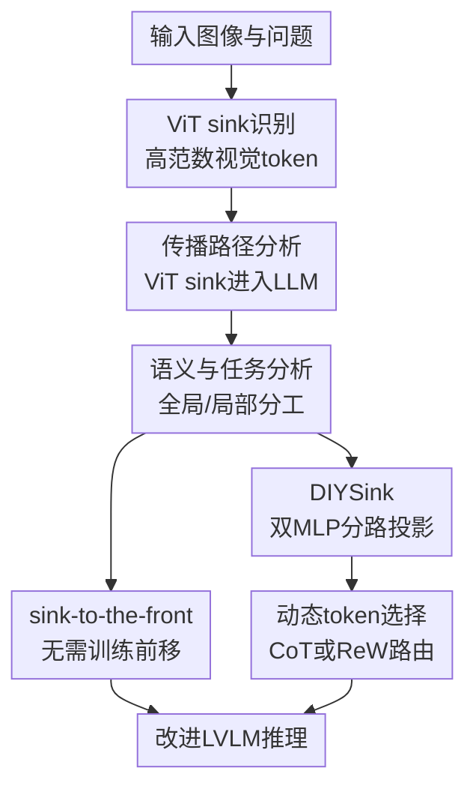

# To Sink or Not to Sink: Visual Information Pathways in Large Vision-Language Models

**会议**: ICLR2026  
**OpenReview**: [https://openreview.net/forum?id=sQGlhjKUC0](https://openreview.net/forum?id=sQGlhjKUC0)  
**代码**: DIYSink 项目页待开源  
**领域**: 多模态可解释性 / VLM内部机制  
**关键词**: ViT attention sink, LVLM信息流, 视觉token解释, 动态token选择, DIYSink  

## 一句话总结
本文发现大视觉语言模型中的 ViT sink token 不是单纯噪声，而是会传播进 LLM、携带粗粒度高层视觉语义，并提出无需训练的 sink-to-the-front 与训练式 DIYSink 框架，让模型按任务需求更好地使用 sink 与 non-sink 视觉信息。

## 研究背景与动机
**领域现状**：主流 LVLM 通常由视觉编码器、连接器和语言模型三部分组成：ViT 先把图像切成 patch token 并编码为视觉特征，MLP/Q-Former/Resampler 等连接器把视觉特征投到 LLM 词向量空间，LLM 再基于系统提示、视觉 token 和文本问题生成回答。近年的机制解释工作开始关注 attention sink，即少量 token 获得异常高注意力或出现 massive activation 的现象。

**现有痛点**：在 LLM 里，attention sink 有时被认为有利于长上下文稳定性；但在视觉模型或多模态模型里，很多工作把视觉 sink 看成背景、空白区域或低语义 token，并倾向于抑制、遮蔽或把注意力重新分配给其他 token。这种处理默认了一个前提：视觉 sink 是干扰项。问题是，LVLM 的视觉前端和语言后端通过连接器耦合在一起，ViT 内部的高范数 token 是否真的无用，并不能只看它在原始图像里的空间位置来判断。

**核心矛盾**：如果 ViT sink 只是视觉编码器里的副产物，那么去掉或弱化它们应该普遍有益；但如果它们在 LVLM 中被 LLM 当成压缩过的视觉摘要来使用，那么一刀切抑制会损失全局语义。更棘手的是，全局语义和局部细节对不同任务的价值相反：场景理解、几何/逻辑推理可能需要粗粒度上下文，而计数、定位、OCR 这类任务更依赖局部 patch 细节。

**本文目标**：作者要回答三个相互连接的问题：第一，ViT 中的 sink token 会不会真的传播到 LLM，并在 LLM 内形成可辨认的视觉 sink；第二，这些 token 到底编码了什么视觉信息；第三，如果 sink 与 non-sink 分别偏向全局和局部信息，LVLM 应该如何在推理时选择或加权它们。

**切入角度**：论文没有从输出错误案例反推，而是从 token 范数、注意力权重、隐藏维度激活、相关性图和词分布解码等内部证据入手，把 ViT sink、传播到 LLM 的 ViT sink、以及 LLM 自己涌现的 sink 区分开来。这个角度的价值在于，它能把“sink 是否有害”改写为更精确的问题：“哪一种 sink、在哪类任务、通过哪条信息路径起作用”。

**核心 idea**：ViT sink 是一种可利用的高层视觉摘要；LVLM 不应固定地抑制或保留它，而应先分离 sink/non-sink 两类视觉路径，再按输入任务动态决定使用 sink、non-sink 或二者结合。

## 方法详解

### 整体框架
本文的流程可以分成两层：先做机制分析，证明 ViT sink 会以独立于 LLM-emerged sink 的形式进入 LLM，并携带全局视觉语义；再把这个发现转成两类改造方法，一类是在推理时把 sink token 前移，另一类是训练 DIYSink，用双 MLP 和动态选择模块分别处理 sink 与 non-sink。整体上，论文不是单纯提出一个模块，而是用“观察 → 假设 → 轻量改造 → 训练式框架”的链条说明为什么视觉信息路径需要被重新设计。

具体做法上，作者先用 token 特征范数定义 ViT sink。给定第 $l$ 层前的 token 隐状态 $x_j^{l-1}$，sink token 满足 $\phi(x_j^{l-1}) \ge \tau$，其中在 ViT 侧 $\phi$ 取特征范数 $\|x_j^{l-1}\|$。主文中 CLIP-ViT/LLaVA-7B 的 ViT sink 阈值取 $\tau=100$，通常每张图只有 3 到 5 个这样的高范数 token。随后，论文统计这些 token 在 LLM 输出生成阶段从输出 token 获得的注意力，发现 ViT 范数越高，LLM 给它的注意力也越高。

在解释层面，作者进一步区分两种 sink：一种是 LLM 自己涌现的 sink，另一种是从 ViT 传播进 LLM 的 propagated ViT sink。两者激活的隐藏维度不同，例如 LLaVA-7B 中 LLM 原生 sink 主要关联维度 $2533, 1415$，而 propagated ViT sink 主要关联 $982, 2494, 3263$。这说明视觉 sink 不是简单复用了 LLM 语言侧 sink 的机制，而是一条独立的视觉信息路径。

### 关键设计
**1. ViT sink传播分析：把视觉sink从“可疑噪声”重新定位为LLM会读取的信息路径**

论文首先要排除一个很容易混淆的问题：ViT 中高范数 token 获得高注意力，是否只是视觉编码器内部现象，到了 LLM 以后就不重要了。作者把 ViT token 按范数分桶，再统计 LLM 输出 token 对这些视觉 token 的平均注意力。结果显示，大多数视觉 token 范数低于 60，而范数超过 100 的 token 数量很少，却能获得约 7 倍于普通 token 的 LLM 注意力。这个相关性不是架构强制的，因为连接器和 LLM 并没有被显式告知哪个 token 是 ViT sink；它表明 LLM 在多模态训练后隐式继承了视觉编码器的显著性信号。

更关键的是，作者没有把所有高注意力 token 混成一类，而是用隐藏维度激活拆解 LLM-emerged sink 和 propagated ViT sink。两类 sink 的高激活维度不同，且 ViT sink 的传播维度是在多模态训练后出现的。这个设计让后续结论更有说服力：如果只沿用 LLM sink 的维度去找 LVLM sink，就可能把语言侧 sink 和视觉侧 sink 混在一起，进而误判“抑制 sink 有益”到底抑制的是哪条路径。

**2. 语义解码与任务分型：说明sink擅长全局摘要而non-sink保留局部细节**

为了回答 ViT sink 到底编码什么，论文用两种互补的解释手段。第一种是 relevance map：在注意力图中取目标 token 对应的竖列，重排回图像 patch 网格，观察哪些区域在聚合到这个 token。non-sink token 的相关性通常集中在局部邻域，而 sink token 会从前景或背景的较大区域聚合信息，表现为粗粒度上下文。第二种是词分布解码：作者阻断 LLM 中其他 token 对视觉 token 的注意力，让被隔离的视觉 token 经过 LLM 层和 LM head 映射到词表，统计其预测词分布。对 300 张猫图和 300 张人物图，sink token 更容易映射到 cat/person 这类主物体词，non-sink 则少得多。

这个结论随后被任务分型实验验证。作者用 GPT-4o 给 600 个 image-query pair 标注 image complexity 和 query globalness，再分成 Global、Local、Mixed 三类。只输入 sink token 时，模型在全局任务上表现强；只输入 non-sink token 时，局部任务更稳。换句话说，sink 不是“好 token”或“坏 token”，而是偏向高层摘要的 token；当问题问的是场景、几何关系、逻辑推理时，它能提供压缩上下文，当问题要求精确定位、计数、OCR 或细节识别时，它可能遮蔽细节。

**3. sink-to-the-front：利用自回归因果结构放大少量高层视觉摘要**

训练不可用时，论文提出一个非常简单的推理时策略：识别 ViT sink 后，把这些 sink token 连同其对应位置嵌入一起移动到视觉 token 序列最前面，再送入连接器和 LLM。这个操作的核心假设来自自回归 Transformer 的因果注意力：较早的 token 能被后续 token 反复访问，因此把携带全局语义的 sink 放到前面，可以让后续视觉 token、文本问题和输出 token 更容易利用它。

这个策略的微妙之处在于它没有改变模型参数，也不需要知道具体任务标签，适合闭源或难以重训的 LVLM。作者还在附录比较了 sink-to-the-front 与 sink-to-the-end，发现前移通常更好，说明因果注意力带来的前位影响比 RoPE 的近邻/recency 偏置更关键。为了不破坏空间布局，前移时同时移动原始位置嵌入；由于 sink 数量通常只占视觉 token 的极小比例，整体空间结构不会被大幅扰乱。

**4. DIYSink：用双MLP和动态选择把sink/non-sink从同一连接器里拆开**

训练式框架 DIYSink 针对的是共享连接器的表示干扰问题。普通 LVLM 用一个 MLP 把所有 ViT token 投到 LLM 空间，但 sink token 具有高范数、特定隐藏维度和全局摘要属性，non-sink token 则承载更细的局部信息。让一个 MLP 同时适配两类分布，容易把二者压到同一个语义空间里相互稀释。DIYSink 因此设置两个连接器：$f_{sink}: \mathbb{R}^{D'} \to \mathbb{R}^{D}$ 专门投影 $V_{sink}$，$f_{non\text{-}sink}: \mathbb{R}^{D'} \to \mathbb{R}^{D}$ 专门投影 $V_{non\text{-}sink}$。预训练阶段二者分别只看自己的 token 类型，微调阶段再把两路结果拼接给 LLM。

在推理阶段，DIYSink 还要决定当前样本该依赖哪一路。论文给出两种选择模块：CoT-Reweighting 是硬选择，先让模型判断图像是否 symbolic/simple 或 real-world/complex，再判断问题是否需要 holistic reasoning 或 local understanding；简单符号图加全局推理走 sink-only，复杂真实图加局部理解走 non-sink-only，其余情况二者都用。MLP-Reweighting 是软选择，用冻结句子编码器把问题编码成 $q \in \mathbb{R}^d$，再由轻量 MLP 输出 $[w_{sink}, w_{non\text{-}sink}] = R(q)$，将两路视觉 token 加权后拼接：$I_{vis}=[w_{sink} f_{sink}(V_{sink}); w_{non\text{-}sink} f_{non\text{-}sink}(V_{non\text{-}sink})]$。这样，DIYSink 把“sink 有用但有条件”落实成可训练、可路由的视觉信息路径。

### 一个完整示例
假设输入是一张几何题截图，问题问“如果角 $\angle 1=50^\circ$，那么 $\angle 2$ 是多少”。ViT 编码后会产生几百个 patch token，其中少数高范数 ViT sink 可能聚合了整张图的全局结构，例如“这是一道几何角度推理题”“图中存在相交线和角标”；non-sink token 则保留角标、线段位置、局部文字等细节。

如果只按传统共享 MLP 投影，sink 的全局摘要和 non-sink 的局部符号可能被混在同一连接器里，LLM 既没有被告知哪类 token 更适合几何推理，也可能被局部噪声带偏。DIYSink 会先用双 MLP 分别投影两类 token，再通过 CoT 或 ReW 判断该问题需要较强的整体几何关系理解，因此提高 sink 权重，同时保留必要 non-sink 以读取角标。最终 LLM 得到的不是一串未区分的视觉 token，而是经过“全局摘要 + 局部细节”分路组织后的视觉上下文。

### 损失函数 / 训练策略
DIYSink 的训练分两段。第一段是连接器预训练，两个 MLP 分别优化语言建模目标，只不过视觉输入分别限制为 sink 或 non-sink：

$$
\min_{\theta_{f_{sink}}} \mathcal{L}_{LM}(E(I_{sys}, f_{sink}(V_{sink}), I_{txt}, I_{out})),\quad
\min_{\theta_{f_{non\text{-}sink}}} \mathcal{L}_{LM}(E(I_{sys}, f_{non\text{-}sink}(V_{non\text{-}sink}), I_{txt}, I_{out})).
$$

第二段是标准 LVLM 微调，把两个连接器输出拼接后送入 LLM。对 ReW 模块，作者只训练轻量 reweighting MLP，其他组件冻结，避免额外数据泄漏；训练样本来自 PixMo 和 GeoQA 训练集，0.5B/3B 模型用 120 个样本，7B 模型用 240 个样本，Local、Global、Mixed 三类大致均衡，训练 10 个 epoch，学习率为 $1e^{-2}$，全局 batch size 为 20。

## 实验关键数据

### 主实验
训练不可用的 sink-to-the-front 在多种现成 LVLM 上提升最明显的是 MME 和 MathVista 这类含全局理解/推理的 benchmark，而普通 LLaVA eval 平均提升较小，符合“sink 对全局语义更有帮助”的假设。

| 方法 | LLaVA eval AVG | MME All | MathVista All | 主要变化 |
|------|----------------|---------|---------------|----------|
| InternVL2.5-4B | 70.99 | 2332.16 | 62.90 | 基线 |
| + Sink-to-the-front | 71.01 | 2351.33 | 63.30 | MME +19.17，MathVista +0.40 |
| Phi-3.5-V | 65.29 | 1887.90 | 43.10 | 基线 |
| + Sink-to-the-front | 65.71 | 1891.27 | 43.50 | LLaVA eval +0.42，MathVista +0.40 |
| Molmo-7B-D | 61.68 | 1821.93 | 49.40 | 基线 |
| + Sink-to-the-front | 61.74 | 1852.21 | 51.20 | MME +30.28，MathVista +1.80 |
| Gemma3-12B-it | 61.26 | 1706.30 | 40.80 | 基线 |
| + Sink-to-the-front | 61.55 | 1740.11 | 41.00 | MME +33.81，MathVista +0.20 |

训练式 DIYSink 在 TinyLLaVA 和 LLaVA 变体上更稳定，尤其对小模型收益明显。3B Phi 版本中，DIYSink(ReW) 把 LLaVA eval 平均从 48.55 提到 54.34，MME 从 1455.22 提到 1682.41；Qwen2.5-3B 版本中，CoT 和 ReW 都把 MathVista 从 30.40 提到 33 左右。

| 模型与方法 | LLaVA eval AVG | MME All | MathVista All | 备注 |
|------------|----------------|---------|---------------|------|
| TinyLLaVA-0.5B-SigLIP-Qwen2 baseline | 48.34 | 1381.10 | 24.30 | LLaVA 原训练集微调 |
| DIYSink (CoT) | 49.04 | 1456.78 | 25.10 | MME +75.68 |
| DIYSink (ReW) | 49.13 | 1451.87 | 25.20 | 推理开销更小 |
| TinyLLaVA-3.1B-SigLIP-Phi2 baseline | 48.55 | 1455.22 | 25.90 | 基线 |
| DIYSink (CoT) | 52.17 | 1523.18 | 26.20 | LLaVA eval +3.62 |
| DIYSink (ReW) | 54.34 | 1682.41 | 27.40 | LLaVA eval +5.79，MME +227.19 |
| LLaVA-7B-CLIP-ViT-Vicuna baseline | 56.55 | 1781.70 | 26.00 | 基线 |
| DIYSink (CoT) | 56.76 | 1797.80 | 26.40 | MME code reasoning +15 |
| DIYSink (ReW) | 56.59 | 1787.00 | 26.60 | 改善较温和 |

### 消融实验
Dual-MLP 的消融说明，收益不是只来自动态选择模块。即使不做 CoT/ReW，只把 sink 和 non-sink 分别投影，也能提高 SQA、MMMU 和 MME，支持“共享连接器会混淆两类视觉 token”的判断。

| 配置 | SQA | MMMU | MME All | MME Cog. | 说明 |
|------|-----|------|---------|----------|------|
| TinyLLaVA-0.5B baseline | 57.76 | 30.30 | 1381.10 | 207.14 | 单 MLP 连接器 |
| + Dual-MLP | 60.63 | 30.80 | 1439.21 | 208.21 | 只分路投影也有收益 |
| TinyLLaVA-3B baseline | 68.47 | 33.50 | 1455.22 | 261.79 | 单 MLP 连接器 |
| + Dual-MLP | 70.75 | 34.80 | 1679.24 | 262.14 | MME All 大幅提升 |

论文还比较了不同 token 类型在 Local/Global 任务上的表现，能更直接看出动态选择的必要性。以 TinyLLaVA-0.5B 为例，sink-only 在 MME cognition 和 MathVista numerical reasoning 上更好，但在 GQA/TextVQA 等局部任务上明显下降；non-sink-only 则相反。

| 模型配置 | GQA Local | TextVQA Local | MME Cog. Global | MathVista NUM Global | 说明 |
|----------|-----------|---------------|-----------------|----------------------|------|
| TinyLLaVA-0.5B baseline | 57.98 | 47.32 | 207.14 | 11.11 | 全部视觉 token |
| Ours sink-only | 39.53 | 30.10 | 270.71 | 17.36 | 全局推理强，局部细节差 |
| Ours non-sink-only | 58.07 | 48.28 | 220.00 | 11.11 | 局部任务稳，全局收益有限 |
| DIYSink (CoT) | 58.14 | 46.14 | 277.50 | 11.81 | 动态硬选择 |
| DIYSink (ReW) | 57.75 | 47.42 | 229.64 | 14.58 | 动态软加权 |

### 关键发现
- ViT sink 的数量很少但影响不小。在 LLaVA-7B 中，普通 non-sink token 平均每个只获得约 0.1532% 注意力，LLM-emerged sink 为 1.27%，ViT sink 为 1.13%，说明 propagated ViT sink 和语言侧 sink 一样是 LLM 输出阶段会重点读取的 token。
- ViT sink 更像全局语义压缩器，而不是低语义背景垃圾。线性 probing 中，CLIP sink 在 object class 上达到 0.865，non-sink 为 0.512；SigLIP sink 在 lighting 上达到 0.722，non-sink 为 0.515。这与 relevance map 和词分布解码的结论一致。
- 动态选择是必要的。sink-only 能在高层推理和效率上表现突出，但在密集/组合场景、位置和计数类任务上会掉点；DIYSink 通过 CoT 或 ReW 在不同任务间切换，避免把 sink 作为统一答案。
- 训练式方法比无训练前移收益更大，但代价也更高。Dual+ReW 推理只增加约 0.01 秒，而 Dual+CoT 因为多轮路由会从约 0.09 秒增到约 0.25 秒；前者更适合低延迟场景，后者更容易解释路由决策。

## 亮点与洞察
- 论文最有价值的地方是把 LVLM attention sink 拆成了不同来源：ViT 原生 sink、传播到 LLM 的 ViT sink、LLM 自己涌现的 sink。这个拆分避免了“sink 有害/有益”的粗糙争论，让后续分析能落到具体路径。
- sink token 的语义解释很有启发性。作者不是只展示注意力热图，而是把 relevance map、词表解码、任务分型和 linear probing 组合起来，形成了从内部机制到下游行为的证据链。
- sink-to-the-front 很像一个机制发现后的最小干预实验：如果前移少量 ViT sink 就能提升全局推理任务，说明这些 token 的确能被模型利用，而不只是离线分析里看起来有语义。
- DIYSink 的设计可以迁移到其他视觉 token 分组问题。比如未来可以把 token 按 object/scene/text region、temporal key frame/non-key frame 或可靠性分组，再用专门连接器与动态路由决定送给 LLM 的信息比例。
- 这篇论文也提醒 VLM 压缩不能只按注意力或范数简单删 token。高范数 token 可能是噪声，也可能是全局摘要；是否保留要看任务和模型内部路径。

## 局限与展望
- DIYSink 需要重新训练或至少训练额外模块，尤其双 MLP 连接器需要访问训练数据和计算资源。对完全闭源模型，论文只能使用 sink-to-the-front 这类推理时改动，收益相对有限。
- sink 的识别仍依赖范数阈值或自适应范数 drop。虽然作者做了阈值稳健性实验，但不同视觉编码器、不同层、不同训练配方下，sink 的边界可能变化，部署时仍需要校准。
- 动态选择模块主要基于图像复杂度和问题 globalness/localness 的二分假设。真实任务可能同时需要细粒度 OCR、空间定位和全局常识推理，简单三类路由未必能捕捉所有组合。
- 论文重点讨论图像-语言模型，没有系统扩展到视频、音频或多图输入。视频 VLM 中的 sink 可能同时承担空间摘要和时间摘要，路径会更复杂。
- 实验主要显示 benchmark 平均提升，但对失败案例的机制解释还可以更细。例如某些模型如 DeepSeek-VL 的收益较小，作者解释与 SAM/SigLIP channel-wise concat 有关，但还缺少更深入的架构级归因。

## 相关工作与启发
- **vs Visual attention sink 抑制类方法**: Kang et al.、Huang et al.、Woo et al. 等工作更多关注视觉 sink 对幻觉或错误注意力的负面影响，并通过重分配、惩罚或校准来削弱它。本文的区别是把 ViT sink 视为可能有用的全局语义载体，主张按任务选择性使用，而不是默认压制。
- **vs Vision Transformers Need Registers**: Darcet et al. 通过 register token 吸收 ViT 中的高范数异常，让特征图更干净。本文继承了高范数 ViT sink 的观察，但关注它进入 LVLM 后是否被 LLM 利用；因此一个是改善视觉特征图，一个是解释并改造 VLM 信息流。
- **vs LLM attention sink 研究**: Sun et al. 和后续 LLM 机制工作讨论语言模型中的 massive activation 与 attention sink，说明 sink 可能对上下文建模有用。本文把这个问题移到多模态模型中，并指出 propagated ViT sink 的隐藏维度不同于 LLM-emerged sink，不能直接套用语言侧结论。
- **vs 视觉 token pruning/selection**: 许多高效 VLM 方法尝试删掉低价值视觉 token。本文提供了一个更细的准则：少量 sink token 可能对全局推理极高效，但不适合局部任务；因此 token 选择最好和 query 类型绑定，而不是只做静态剪枝。

## 评分
- 新颖性: ⭐⭐⭐⭐⭐ 论文把 ViT sink 从“异常 token”重新解释为 LVLM 中的高层视觉信息路径，并区分 propagated ViT sink 与 LLM-emerged sink，视角很新。
- 实验充分度: ⭐⭐⭐⭐☆ 主实验覆盖多个 ViT/LLM 组合、训练式和无训练场景，并有丰富消融；但任务路由和失败案例还可以更细。
- 写作质量: ⭐⭐⭐⭐☆ 机制链条比较清楚，图表也充分；部分附录内容较多，读者需要在主文和附录之间来回对照。
- 价值: ⭐⭐⭐⭐⭐ 对 VLM 可解释性、视觉 token 压缩、连接器设计和多模态推理都很有启发，尤其适合后续研究复用其 sink/non-sink 分路思想。

<!-- RELATED:START -->

## 相关论文

- [\[ICLR 2026\] A Comprehensive Information-Decomposition Analysis of Large Vision-Language Models](a_comprehensive_information-decomposition_analysis_of_large_vision-language_mode.md)
- [\[ICLR 2026\] Inducing Dyslexia in Vision Language Models](inducing_dyslexia_in_vision_language_models.md)
- [\[ICLR 2026\] Universal Properties of Activation Sparsity in Modern Large Language Models](universal_properties_of_activation_sparsity_in_modern_large_language_models.md)
- [\[ICLR 2026\] Spilled Energy in Large Language Models](spilled_energy_in_large_language_models.md)
- [\[ICLR 2026\] Concepts' Information Bottleneck Models](concepts_information_bottleneck_models.md)

<!-- RELATED:END -->
