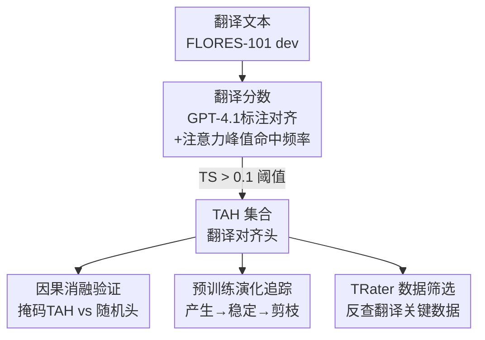

# Token Alignment Heads: Unveiling Attention's Role in LLM Multilingual Translation

**会议**: ICLR 2026  
**OpenReview**: [https://openreview.net/forum?id=q8fTgw8e5E](https://openreview.net/forum?id=q8fTgw8e5E)  
**代码**: 待确认  
**领域**: 可解释性 / 机制可解释性 / 多语言翻译  
**关键词**: 注意力头, 机制可解释性, 多语言翻译, 词对齐, 数据筛选

## 一句话总结
作者在 LLM 里定位出一类专门负责"把源语言 token 映射到目标语言 token"的注意力头——token alignment heads（翻译对齐头），证明它们普遍存在、极其稀疏、跨语言一致且对翻译有直接因果作用，并据此设计数据打分算法 TRater，用极少量关键数据就能显著提升模型翻译能力。

## 研究背景与动机

**领域现状**：现代 LLM 的多语言能力越来越强，而翻译被认为是支撑多语言能力的核心机制。已有一批工作开始拆解 LLM 内部的多语言处理过程，比如发现模型倾向先把多语言输入转成"以英语为中心"的中间表示再去解题，暗示内部存在一个隐式的翻译过程。

**现有痛点**：以往研究注意力头在翻译中的作用，大多是按"删掉这个头后某个翻译指标掉多少"来排重要性。这类做法有三个问题：依赖任务特定的评测指标、通常只在单个或小模型上做、识别"重要头"的方法不透明。更关键的是，它们往往止步于"哪些头重要"，却没回答"这些头到底在机制上做了什么"。

**核心矛盾**：重要性排序 ≠ 机制理解。一个头掉点多，可能是因为它做翻译，也可能只是碰巧参与了某个通用计算。要真正理解翻译，必须从"下游表现"转向"内部机制"——直接观察头有没有在做跨语言的 token 映射。

**本文目标**：(1) 提出一个不依赖下游指标、直接刻画"跨语言对齐行为"的方法来识别翻译头；(2) 系统验证这类头的普遍性、稀疏性、一致性、因果性、功能特异性；(3) 追踪它们在预训练全过程中的形成轨迹；(4) 把这种机制理解落地成可用的数据筛选工具。

**切入角度**：受 induction heads（实现上下文学习）、retrieval heads（实现长上下文检索）等"功能专化电路"的启发，作者假设翻译也必然对应一组专门的头。这些头不是做通用的 copy-paste，而是干一件具体的事：把源语言的某个 token 对齐到目标语言对应的 token——这本质上是经典统计机器翻译里的"词对齐"在注意力层面的体现。

**核心 idea**：用"注意力是否把目标 token 的注意力峰值落在它真正的源语言对齐 token 上"这一可观测信号定义 **翻译分数（Translation Score）**，据此筛出 token alignment heads，再用因果消融、演化追踪和数据筛选三条线坐实它们的作用。

## 方法详解

### 整体框架

整篇工作可以拆成"识别 → 验证 → 应用"三段。**识别**部分（论文第 2 节）是核心算法：先用 GPT-4.1 给翻译文本做 token 级对齐标注，得到"目标 token ↔ 源 token"的金标准映射；再在贪心解码过程中逐个目标 token 检查每个注意力头的注意力峰值是否落在正确的源 token 上，统计命中频率得到该头的翻译分数；最后用阈值 0.1 把翻译分数高的头标记为 token alignment head（TAH）。**验证**部分围绕筛出的 TAH 集合展开：一方面刻画它们的静态属性（普遍性、稀疏性、集中在中间层、跨语言一致），另一方面通过因果消融（掩码 TAH vs 掩码随机头）和预训练演化追踪坐实它们的因果地位。**应用**部分把这套机制理解反向用于数据：TRater 通过"掩码 TAH 前后某条样本 loss 的变化"给多语言数据打分，筛出对翻译机制最关键的那一小撮数据。

下面这张图展示从原始翻译文本到筛出 TAH、再到三条下游验证/应用的整体流向：

### 关键设计

**1. 翻译分数：用跨语言对齐频率而非下游指标定义"翻译头"**

针对"以往按 benchmark 掉点排重要性、不透明也不机制"的痛点，本文换了一个直接刻画行为的信号。第一步是拿到对齐金标准：由于现成的词对齐工具覆盖语言有限，作者用 GPT-4.1 为翻译文本里每个目标语言 token 标注它对应的源语言 token，并给出置信度，只保留置信度 > 0.9 的对齐，没有对应源 token 的标为 None。第二步定义翻译分数：在贪心解码时，设当前生成的 token 为 $t$，某注意力头的注意力分布为 $w \in \mathbb{R}^{|x|}$；如果 $t$ 有一个金标准源 token $s$（位置 $idx$ 为 $s_{idx}$），且该头把最大注意力分配给了这个源 token，即 $w_{s_{idx}} = \max(w)$，就算这个头完成了一次有效的跨语言对齐。设 $g_h$ 是头 $h$ 完成的有效对齐次数，$m$ 是所有"有对应源 token"的目标 token 总数，则该头的翻译分数为：

$$\mathrm{TS}_h = \frac{g_h}{m}$$

第三步是检测：在 FLORES-101 dev 上对某个语向约 900 个句对逐句算每个头的 TS，再对该语向所有样本取平均；只要某个头的平均翻译分数超过阈值 0.1，就判定为 token alignment head。这个定义的好处是它直接看"头有没有在做跨语言映射"，独立于任何具体评测任务——因此筛出的头天然带有"词级、跨语言对齐"的明确语义，而掩码实验只是后续的因果验证步骤，不参与定义本身。

**2. 五大属性：普遍、稀疏、中间层、跨语言一致**

筛出 TAH 之后，作者在 1.7B–30B、dense 与 MoE、预训练与指令微调等多种模型（Llama-3.1-8B、Mistral-7B、Qwen2.5-7B、Qwen3-1.7B/30B 等）上系统刻画它们的属性。**普遍性**：所有被检查的模型都存在 TAH，与规模、架构、训练阶段无关，说明它是多语言 LLM 的一种涌现共性。**稀疏性**：TAH 在全部注意力头中占比不到 8%，Mistral-7B-v0.3 甚至低到约 3%；近一半的头是低频激活（TS 落在 0–0.1），剩下 36%–55% 的头几乎从不激活。**位置分布**：TAH 高度集中在模型的中间层，最前和最后几层几乎没有——这与 Transformer"浅层抽表层特征、深层组织输出"的认识一致，跨语言对齐恰好发生在中间的语义层。**跨语言一致性**：对 Llama-3.1-8B，取每个语向 top-20 的 TAH 组成集合，用 Jaccard 相似度 $\mathrm{Sim}_{S,T} = |S \cap T| / |S \cup T|$ 两两比较 10 个跨语系的语向，绝大多数相似度高于 0.8、从不低于 0.6，说明同一套基本不变的头在负责各种语言对的翻译，跨语系泛化性很强。

**3. 因果消融：掩掉 TAH 让翻译崩塌并退化为"复制源文"**

属性刻画只是相关性，真正坐实因果靠消融对照。作者在 FLORES-101 上对比"掩码 top-K 个 TAH"与"掩码同等数量的随机非 TAH 头"后翻译指标的变化。结果是掩掉 TAH 造成 BLEU 最大跌幅超过 17 分、chrF++ 超过 25 分，而掩掉随机头几乎没影响——这就是 TAH 的因果性。更有揭示性的是失败模式：如论文 Figure 1，掩掉 Llama-3.1-8B 的 top-30 TAH 后，模型不是胡乱输出，而是退回到一种更基础的 copy-paste 行为，逐字照抄英文源文。这说明模型"复制 token"的通用能力完好无损，被消融掉的恰恰是"跨语言映射"这一非复制的专门功能。功能特异性进一步体现在下游：掩掉 TAH 对 Hellaswag-ML、ARC-ML 这类隐含跨语言映射的任务掉点明显（最多约 10 分），但对 XNLI、XCOPA 这类在更高语义层操作、不依赖 token 级映射的任务影响很小甚至小于随机消融——可见 TAH 提供的是一种基础的跨语言对齐能力，不同下游任务对它的依赖程度不同。

**4. 预训练演化与 TRater：三阶段轨迹 + 用 TAH 反查关键数据**

为了看 TAH 怎么长出来，作者从零训了一个 Llama-2 架构的 8B 模型（共 15T tokens），按 checkpoint 追踪 TAH 比例。轨迹呈现清晰的三阶段：**快速增殖**（0–8k step，TAH 占比从 0 飙到约 8% 峰值，恰好与 FLORES chrF++ 从 12.58 猛涨到 45.77 同步，说明翻译能力的获得依赖这批专化头的快速涌现）；**集合稳定**（10k–64k step，占比稳定在约 5%，用条件重叠率 $|A \cap B|/|B|$ 衡量当前头集 $A$ 与最终头集 $B$ 的重叠，从 8k 步起就持续高于 0.8 接近 1.0，说明早期形成的核心头集基本被保留）；**巩固剪枝**（64k–952k step，占比缓慢降到 2.6%，同时完全不激活的头比例升到 61.7%）——模型并非靠更多头，而是靠更少、更高效、更专化的电路来解决翻译，呈现"过量产生再精修"的优化规律。把这套理解落地，作者提出 **TRater** 数据筛选算法：用掩码 top-20 TAH 前后样本 loss 的差异给数据打分，

$$\mathrm{score}(x) = \frac{1}{m} \sum_i \big( L(\theta_{\mathrm{mask}}, x_i) - L(\theta, x_i) \big)$$

其中 $L$ 是 token 级交叉熵，$\theta_{\mathrm{mask}}$ 是掩掉 TAH 后的参数，分数越高表示这条数据越依赖 TAH（即越"翻译相关"）。在 1.5B 模型、1T tokens（700B 英文 + 300B 多语言）上，按 TRater 给 300B 多语言数据打分、每种语言取 top 1.3%，再做 Remove（剔除这批数据）和 Enhance（把这批数据三倍上采样）两组对照，验证这一小撮数据对翻译能力的决定性作用。

### 损失函数 / 训练策略
本文是机制分析 + 数据筛选工作，不引入新的训练损失。核心量化工具是翻译分数 $\mathrm{TS}_h$、跨语言一致性的 Jaccard 相似度、演化追踪的条件重叠率，以及 TRater 的样本打分 $\mathrm{score}(x)$（基于掩码前后交叉熵差）。

## 实验关键数据

### 主实验

因果消融（FLORES-101，掩码 vs 基线的指标变化）：

| 消融对象 | BLEU 变化 | chrF++ 变化 | 说明 |
|----------|-----------|-------------|------|
| 掩码 top-K TAH | 最大 < −17 | 最大 < −25 | 翻译能力崩塌，退化为复制源文 |
| 掩码随机非 TAH 头 | 接近 0 | 接近 0 | 几乎无影响 |

TRater 数据筛选（1.5B 模型，Table 1 节选关键指标）：

| 设置 | FLORES chrF++ | XStoryCloze | 其余多语言任务 |
|------|---------------|-------------|----------------|
| baseline | 43.87 | 58.40 | 基本持平 |
| remove（剔除筛出数据） | 41.33 | 58.15 | 翻译明显下降 |
| enhance（三倍上采样） | 46.68 | 58.44 | 翻译明显提升 |

只占 1.3% 的翻译关键数据，剔除后 FLORES chrF++ 掉约 2.5 分、增强后涨约 2.8 分，而对其他多语言 benchmark 影响很小。

### 消融实验

跨任务功能特异性（掩码 TAH 对不同下游任务的掉点对比）：

| 任务类型 | 代表 benchmark | 掩 TAH 影响 | 解读 |
|----------|----------------|-------------|------|
| 纯翻译 | FLORES-101 | 极大（chrF++ > 25） | 直接依赖跨语言映射 |
| 含跨语言映射 | Hellaswag-ML / ARC-ML | 较大（最多约 10 分） | 部分依赖 token 级对齐 |
| 高层语义 | XNLI / XCOPA | 很小，常 < 随机消融 | 依赖另一套多语言机制 |

属性统计（部分模型 TAH 占比）：Llama-3.1-8B 3.9%、Mistral-7B-Instruct 4.3%、Mistral-7B-v0.3 3.0%、Qwen3-1.7B 7.6%、Qwen2.5-7B 7.9%、Qwen3-30B 5.5%——均 < 8%。

### 关键发现
- **失败模式比掉点更有信息量**：掩掉 TAH 后模型退回逐字复制源文，而非乱码，干净地分离出"复制能力"与"跨语言映射能力"，强力支持 TAH 的功能特异性。
- **翻译能力的获得与 TAH 涌现同步**：预训练前 8k 步 TAH 比例飙升的同时 chrF++ 从 12.58 跳到 45.77，二者时间上严格对齐。
- **过量产生再剪枝**：TAH 峰值 8% 最终降到 2.6%，但核心集合（条件重叠率 > 0.8）保持稳定，说明剪掉的是冗余弱头，模型走向稀疏高效。
- **翻译像一个可分离模块**：极少量翻译关键数据对 FLORES 影响大（2–3 分）、对其他多语言任务影响小，提示翻译在 LLM 内部相对独立。

## 亮点与洞察
- **用"对齐行为"而非"下游掉点"定义翻译头**：翻译分数直接看注意力峰值是否落在金标准源 token 上，定义与任务无关，掩码只作事后因果验证——比以往按 benchmark 排序的方法语义清晰得多，这是本文最干净的方法学贡献。
- **"退化为复制源文"是绝妙的对照**：它一举证明被删的不是通用搬运能力而是特定的跨语言映射，把"重要"升级成"机制上做什么"。
- **机制理解能反哺数据工程**：TRater 把"哪些头做翻译"翻译成"哪些数据喂翻译"，1.3% 的数据就能左右翻译表现，给数据 curation 提供了一个有机制依据的抓手，可迁移到其他专化电路（如检索头筛检索数据）。
- **预训练"过量产生再剪枝"轨迹**：为"专化电路如何在大规模训练中涌现与优化"提供了一个具体可观测的范例。

## 局限与展望
- 对齐金标准依赖 GPT-4.1 标注（仅保留置信度 > 0.9），标注质量与覆盖会直接影响翻译分数的可靠性，作者也承认现成对齐工具覆盖语言不全才转用 LLM 标注。
- 阈值 0.1、top-20/top-30 等关键超参较为经验化，缺少对阈值敏感性的系统分析。
- 翻译分数基于贪心解码下的注意力峰值，是否能完整刻画多头协同、软对齐（峰值不在第一但仍贡献）等更复杂的对齐行为，仍有讨论空间。
- TRater 的增益（FLORES 约 2–3 分）相对消融掉点（> 10 分）较小，对非翻译多语言任务收益不明显，规模化（更大模型/更多数据）效果待验证。

## 相关工作与启发
- **vs 按下游指标排重要头（Kim et al. 2021 / Zhang et al. 2025）**：他们用头对翻译指标/perplexity 的影响来排序、有时配合 path patching；本文改用"对齐分数"这一与任务无关的信号定义头，专化语义显式落在"词级跨语言对齐"上，掩码只做验证。
- **vs 语义空间类工作（Schut et al. 2025 / Zhao et al. 2024）**：他们说明多语言信息"住在哪"（模型倾向在中间层用英语/语言无关空间思考）；本文互补地指出在相似的中间层有一批 TAH 真正执行 token 级跨语言对齐，把源 token 表示路由到目标位置。
- **vs 神经元级 / function vector（Todd et al. 2024 / Wang et al. 2024）**：function vector 像"触发翻译模式的总开关"，本文的 TAH 则是"执行翻译的核心机械"，从任务触发层下沉到 token 执行层。
- **vs induction / retrieval heads（Olsson et al. 2022 / Wu et al. 2025a）**：同属"少数专化头解释非平凡能力"的范式，本文把这一范式延伸到翻译，提出 token alignment heads 这一新成员。

## 评分
- 新颖性: ⭐⭐⭐⭐⭐ 把"翻译头"的识别从下游掉点升级为与任务无关的对齐行为信号，并落地成数据工具，视角新颖完整。
- 实验充分度: ⭐⭐⭐⭐⭐ 覆盖多规模/架构/训练阶段模型，含属性刻画、因果消融、预训练演化、数据筛选四条线。
- 写作质量: ⭐⭐⭐⭐ 逻辑清晰、图例丰富；个别公式与超参选择说明可更充分。
- 价值: ⭐⭐⭐⭐⭐ 机制理解 + 可操作的数据筛选，对多语言模型的架构创新与数据策略都有直接启发。

<!-- RELATED:START -->

## 相关论文

- [\[ICML 2026\] Singular Vectors of Attention Heads Align with Features](../../ICML2026/interpretability/singular_vectors_of_attention_heads_align_with_features.md)
- [\[ICLR 2026\] How Stable is the Next Token? A Geometric View of LLM Prediction Stability](how_stable_is_the_next_token_a_geometric_view_of_llm_prediction_stability.md)
- [\[ICLR 2026\] Emergence of Superposition: Unveiling the Training Dynamics of Chain of Continuous Thought](emergence_of_superposition_unveiling_the_training_dynamics_of_chain_of_continuou.md)
- [\[ICLR 2026\] Decomposing LLM Computation with Jets](decomposing_llm_computation_with_jets.md)
- [\[ICLR 2026\] LLMs Process Lists With General Filter Heads](llms_process_lists_with_general_filter_heads.md)

<!-- RELATED:END -->
