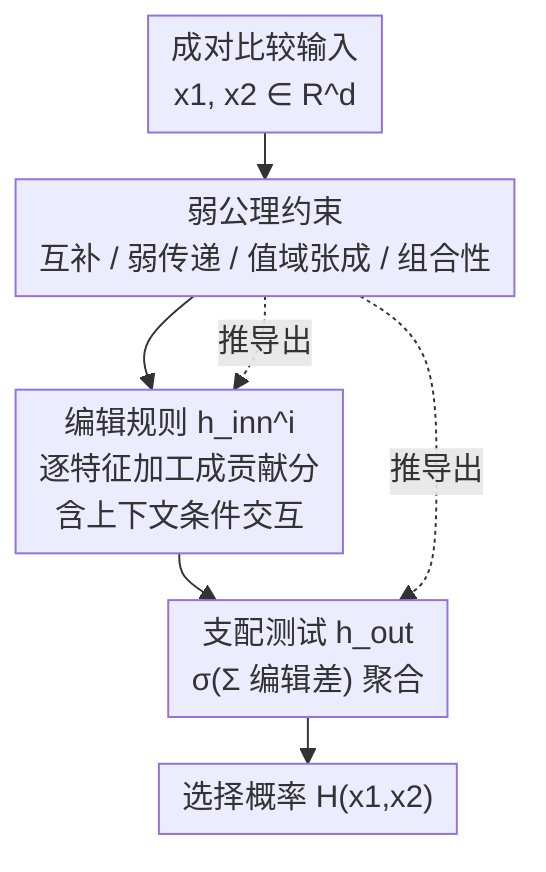

# Towards Cognitively-Faithful Decision-Making Models to Improve AI Alignment

**会议**: ICLR 2026  
**OpenReview**: [https://openreview.net/forum?id=ziP9zetlLp](https://openreview.net/forum?id=ziP9zetlLp)  
**代码**: https://github.com/vijaykeswani/Cognitively-Faithful-Decision-Models (有)  
**领域**: 可解释性 / 对齐RLHF / 偏好建模  
**关键词**: 认知忠实、决策建模、公理化、偏好学习、肾脏分配

## 一句话总结
本文从一组「弱公理」出发，推导出一类**两阶段决策模型**（先对每个特征做可学习的编辑规则、再用固定聚合规则做支配测试），让学到的偏好模型既保持可解释性、又能忠实复现人类用启发式（阈值、计数等）做成对比较的认知过程，并在肾脏分配的道德判断数据上做到「准确率不输、可解释性更强」。

## 研究背景与动机
**领域现状**：当前 AI 对齐（偏好引出、RLHF、逆强化学习）普遍假设一个预设的奖励/效用假设类（线性模型、决策树、神经网络）就能准确预测人类决策，然后把 AI 对齐到这个学到的人类偏好模型上。

**现有痛点**：这些方法对「模型是否忠实于人类的认知过程」是不可知的（agnostic）。人类做成对决策时大量依赖**启发式**——比如把「抚养人数」当成 0/非 0 的二值阈值（hiatus heuristic），或者简单数一数哪个选项占优特征更多（tallying heuristic）。线性模型根本捕捉不到阈值这类规则；神经网络/随机森林也许能拟合，却把启发式表示成一团**等价但完全不透明**的运算，无法验证、无法解释它在决策中扮演的角色。

**核心矛盾**：简单可解释模型（线性、决策树）对人类决策的拟合高度依赖具体场景，未必忠实；强表达力模型（NN、RF）又不可解释、无法验证。在医疗、量刑这类**高风险道德领域**，利益相关者期望 AI 像人一样、以同样的方式给出决策理由——一项肾脏分配的质性研究里就有参与者抱怨「它们不像人那样思考，它觉得该优先的，我未必认同」。既要忠实于认知过程、又要可解释、还要不掉精度，这三者难以同时满足。

**本文目标**：找到一个假设类，使得最优拟合模型既**忠实复现人类的真实决策过程**、又天然可解释、还能匹配甚至超过现有模型的预测精度。

**切入角度**：经典选择理论（von Neumann-Morgenstern、Luce）的公理太强（强传递性、无关方案独立性），几十年实证显示人类系统性地违反它们。作者反其道行之——提出一组**严格更弱的公理**，它们不完全指定决策过程，而是**约束可行的决策空间**，从而既保留理论根基与可解释性、又不与实证观察到的启发式过程冲突。

**核心 idea**：用「弱公理 → 推导出两阶段（特征级编辑 + 固定聚合）模型类」替代「直接套用标准假设类」，让模型结构本身就是从认知过程公理化推出来的，因而既忠实又可解释。

## 方法详解

### 整体框架
设定是成对比较学习：决策者面对两个选项 $x_1, x_2 \in \mathbb{R}^d$（每个有 $d$ 个特征），响应函数 $H(x_1,x_2)\in[0,1]$ 表示选第一个选项的概率；给定数据集 $S$（含 $N$ 条 $(x_1,x_2,r)$，$r\in\{0,1\}$ 是二值选择），目标是学一个 $\hat H$ 准确模拟它。

本文不直接挑一个标准假设类，而是把人类的成对决策建模成**两步走的层级过程**：第一步对每个特征分别做「编辑规则」$h_{\text{inn}}^i$（阈值化、忽略、对数变换、保持不变……）把原始特征值加工成对决策的贡献分；第二步用「支配测试规则」$h_{\text{out}}$ 把所有特征的编辑结果聚合，决定哪个选项占优。整个假设类就是这种两阶段函数的集合。关键在于：这个两阶段结构不是拍脑袋设计的，而是从一组弱公理**推导出来**的必然形态（定理 3.4），并且通过加更强的领域假设，能退化出逻辑回归、probit 回归、单调模型等已知特例。

### 关键设计

**1. 两阶段规则化假设类：把启发式拆成「逐特征编辑 + 固定聚合」**

针对「标准假设类捕捉不到或解释不了启发式」这个痛点，本文把决策显式拆成两段。第一段是**编辑规则**（editing rule）$h_{\text{inn}}^i: X_i \to X_i'$，逐特征操作，模拟人怎么处理单个特征——把不相关特征清零、对边际递减的特征做对数变换、或对特征阈值化离散；这些规则结构简单，正对应启发式「减少认知负荷」的本质。第二段是**支配测试**（dominance testing）$h_{\text{out}}: X'\times X'\to[0,1]$，把编辑后的两组特征跨选项比较、聚合出最终选择概率，可以简单到计数启发式（tallying），也可以复杂到 Bradley-Terry 概率聚合。整个假设类写成

$$\mathcal{H} = \Big\{ (x_1,x_2)\mapsto h_{\text{out}}\big(\,\forall i,\ h_{\text{inn}}^{i,x_1^{\omega_i}}(x_1^{(i)}),\ h_{\text{inn}}^{i,x_2^{\omega_i}}(x_2^{(i)})\big) \ \big|\ h_{\text{inn}}\in\mathcal{H}_{\text{inn}},\ h_{\text{out}}\in\mathcal{H}_{\text{out}}\Big\}.$$

这样做的好处是：编辑函数 $h_{\text{inn}}^i$ 本身就是「这个特征的每个取值贡献多少」的可视化曲线，天然把人用的阈值、忽略、递减规则**显式画出来**，而不是埋在黑盒权重里。

**2. 弱公理推导出两阶段结构：为什么必须长成这样**

光说「两阶段更好」不够有说服力，本文给出公理化基础（定理 3.4）。它提出 5 条比经典选择理论**严格更弱**的公理：① 互补性 $H(x_1,x_2)=1-H(x_2,x_1)$（呈现顺序不影响选择）；② 弱传递性 $H(x_1,x_3)=f(H(x_1,x_2),H(x_2,x_3))$（两两比较可「补全三角」）；③ 值域张成（一种连续性技术条件）；④ 非交互组合性 NC（改两个不同特征的影响是可加组合的，刻画的是广义可加模型 GAM）；⑤ 条件交互组合性 CIC（NC 的推广，允许结构化的特征交互）。

定理证明：仅凭公理 ① 就能把二值选择约简成「原子预测之差」$H(x_1,x_2)=h_{\text{out}}(h_{\text{inn}}(x_1)-h_{\text{inn}}(x_2))$，恢复出两阶段结构；再加 ①–③，可证 $h_{\text{out}}$ 必为某个 sigmoid（CDF），即 $H(x_1,x_2)=\sigma(h_{\text{inn}}(x_1)-h_{\text{inn}}(x_2))$，其中 $\sigma^{-1}$ 充当广义线性模型里的 link function；公理 ④/⑤ 再控制特征如何交互，把模型钉成「每个特征被独立或条件加工」的两阶段形态。这条推导线把「模型结构」从「设计选择」变成了「公理的必然后果」，也正是「认知忠实」的理论来源——只要你认同这几条温和的决策规律，就只能落到这个模型类里。

**3. 上下文条件编辑（CIC）：用一个特征的取值切换另一个特征的处理方式**

针对实证里观察到的**特征交互**（某特征的编辑规则会随其他特征取值而变，如 P4 只在抚养人数为 0 时才看重 LYG），本文让编辑规则带上下文：用一个条件特征集 $\omega\subseteq[d]$，把作用在特征 $i$ 上的编辑规则写成条件形式 $h_{\text{inn}}^{i,x^{\omega_i}}$（$\omega_i=\omega\setminus\{i\}$）。$\omega=\varnothing$ 时各特征独立编辑（无交互），$\omega=[d]$ 时每个特征的编辑可依赖所有其他特征，复杂度随 $|\omega|$ 增长。对应到模型实现，定理 3.6 给出**条件 GAM 树**：$h_{\text{inn}}$ 先在 $X_\omega$ 上建一棵决策树，每个叶子里放一个在 $X_{\setminus\omega}$ 上的 GAM。这样既保留了「逐特征可解释」的好处，又能表达「在某些条件下才生效的阈值规则」这种真实的人类决策细节，比纯 GAM 表达力更强、又比黑盒更可读。

**4. 单调约束下的学习与两种损失实现**

把上面的假设类落到可训练模型：最小化训练集上的预测损失来学编辑函数 $h_{\text{inn}}^{\cdot,\cdot}$（给每个特征取值赋一个实数分），并约束所有 $h_{\text{inn}}$ **单调**（因为肾脏分配数据里每个特征对选择的影响方向都是确定的）。作者实现两个变体：(A) 交叉熵损失 + $\sigma(x)=(1+e^{-x})^{-1}$，对齐定理 3.4 的概率框架；(B) hinge 损失 + $\sigma$ 取恒等，更适合 0-1 硬分类精度评估。上下文 $\omega$ 在真实数据上限定为 1 个特征（交叉验证选）、合成数据上取空集。值得注意的是，通过对 $\sigma$ 和假设的不同设定，该框架能恢复出逻辑回归（Bradley-Terry + 线性）、probit 回归（高斯 CDF）、单变量单调模型等标准类，说明它是一个把已有模型统一起来的更一般框架。

## 实验关键数据

数据用肾脏分配的道德判断场景：参与者看两位病人的特征（抚养人数、移植后预期延长寿命 LYG、每日饮酒量、犯罪数等），选谁该获得肾脏。真实数据来自 Boerstler et al. (2024) 两项研究（Study One 15 人、Study Two 40 人）；另造一个合成数据（5 个模拟决策者 DM1–DM5，各用阈值/递减/计数等启发式，每人 1000 条比较）。所有实验都在**个体级**数据上做（道德判断个体差异大），70-30 划分、20 次重复报告测试精度。

### 主实验

| 模型 | Study One | Study Two | Simulated |
|------|-----------|-----------|-----------|
| Drift-Diffusion | .89 (.05) | .88 (.05) | – |
| Bradley-Terry | .90 (.06) | .78 (.06) | .77 (.06) |
| Logistic Clf | .90 (.06) | .89 (.05) | .85 (.07) |
| SVM | .89 (.06) | .89 (.05) | .85 (.07) |
| GAM | .87 (.09) | .84 (.11) | .88 (.08) |
| Decision Tree | .83 (.06) | .79 (.06) | .82 (.11) |
| MLP | .89 (.05) | .86 (.06) | .87 (.08) |
| Random Forest | .86 (.05) | .85 (.04) | .87 (.08) |
| **本文 (交叉熵)** | **.90 (.06)** | **.90 (.05)** | **.89 (.10)** |
| **本文 (hinge)** | **.90 (.06)** | **.89 (.06)** | **.89 (.08)** |

本文模型在三个数据集上都**至少与所有 baseline 持平**，在 Study Two 和合成数据上略优——尤其相对同样「可解释」的逻辑回归和决策树，精度不输的同时提供了更深的过程洞察。

### 可解释性案例分析

| 模型 | P4 精度 | 揭示的决策细节 |
|------|---------|----------------|
| 本文两阶段 (hinge) | .78 (.05) | 全部 (a)-(e)：含阈值规则 + LYG 仅在 0 抚养人时相关的条件交互 |
| 逻辑回归 | .76 (.04) | 仅 (a)(b)：只看出哪些特征重要 |
| 决策树 | .70 (.03) | 仅 (a)(c)(d) |

对真实参与者 P4，本文模型同时学出：抚养人数和饮酒量最重要、犯罪数基本被忽略、LYG 只在抚养人数为 0 时才相关（条件交互）、抚养人数 1 vs 0 的差异远大于 2 vs 1（近似阈值规则）。逻辑回归只看出特征重要性、决策树漏掉条件交互。对模拟决策者 DM1，本文模型在 #deps 和 wait_yrs 上准确恢复出「非 0 即加分」「>6 年才加分」的阈值函数，逻辑/决策树都看不出来，且精度（.76）也高于逻辑（.74）和决策树（.68）。

### 关键发现
- **可解释性与精度不冲突**：本文核心卖点是更高的认知忠实度反而带来「精度不降甚至略升」，打破了「可解释就要牺牲性能」的常见取舍。
- **条件交互是区分度来源**：本文相对逻辑回归/决策树的最大优势，在于能显式表达「LYG 只在无抚养人时才生效」这类条件阈值规则，这正是 baseline 漏掉的认知细节。
- **公理退化验证表达力**：通过设定不同 $\sigma$ 与假设，框架能恢复逻辑回归、probit、单调模型等，说明它是一个更一般的统一框架而非又一个孤立模型。

## 亮点与洞察
- **从公理推结构而非选结构**：最「啊哈」的地方是把模型形态当成弱公理的数学推论，而不是工程上的假设类挑选——这让「认知忠实」有了可证明、可被定性检验的根基。
- **编辑函数即解释**：$h_{\text{inn}}^i$ 的曲线本身就是「这个特征每个取值贡献多少」的可视化，把人类的阈值/忽略/递减启发式直接画出来，可迁移到任何需要「逐特征贡献透明」的偏好建模/RLHF 场景。
- **弱公理设计哲学**：把经典选择理论的强公理松弛成「足够约束空间、又不与人类违反行为冲突」的弱版本，这种「描述性 + 规范性折中」的公理设计思路，对其他要建模人类行为的领域很有启发。

## 局限与展望
- 作者承认：可解释性特征仍需**真实用户研究**验证——用户是否真的能理解并信任两阶段模型，本文只给了概念验证。
- 公理刻画的是个体的「理想」决策过程（无内外约束时愿意遵循的过程），但人类实际决策会偏离理想（违反传递性、互补性）。把这些偏离排除掉，到底是对齐到人「真正用的过程」还是对齐到「理想化版本」？两者各有价值但需区分，作者留作未来工作。
- 评测局限在肾脏分配单一道德领域、特征维度低、且依赖单调性这一领域假设；跨领域、高维、非单调特征下的表现未验证。
- $n$-way 扩展依赖 Luce 选择公理并唯一刻画出 Bradley-Terry，但该假设是否对所有 $n$-way 道德决策都成立，存疑（⚠️ 以原文定理 3.7 的前提为准）。

## 相关工作与启发
- **vs Noothigattu et al. (2020) / Ge et al. (2024)**: 他们也研究成对比较导出的决策规则公理，但公理是关于「在数据上做 MLE 估计」的、对分布敏感，且只检验已知类是否满足、偏描述性；本文公理规定的是「概率偏好在其定义域上必须如何表现」、与函数形式无关、偏规范性，并**反推出**满足公理的模型类。
- **vs Bourgin et al. (2019) / Peterson et al. (2021)**: 他们用理论性质约束或神经网络去拟合/测试认知模型，但目标是预测准确而非认知忠实，或无法从个体数据**学**出决策过程；本文从个体数据学出可解释的特征变换。
- **vs Plonsky et al. (2017) / Payne et al. (1988)**: 他们用心理学理论**预先指定**特征变换或启发式来提升预测力，但当变换未知且因人而异时就失效；本文把特征变换**从人的决策中学出来**，并支持个体级异质启发式。

## 评分
- 新颖性: ⭐⭐⭐⭐⭐ 把「认知忠实」从口号变成可证明的公理化模型类，视角独特。
- 实验充分度: ⭐⭐⭐⭐ 真实+合成数据、多 baseline、个体级评测扎实，但局限于单一低维道德领域、缺真实用户研究。
- 写作质量: ⭐⭐⭐⭐ 理论与动机讲得清晰，公理与定理衔接顺，但形式化部分门槛偏高。
- 价值: ⭐⭐⭐⭐⭐ 为高风险/道德领域的可信对齐提供了可解释又不掉精度的建模范式。

<!-- RELATED:START -->

## 相关论文

- [\[CVPR 2026\] Making the Classification Explanation Faithful to the Confidence Score](../../CVPR2026/interpretability/making_the_classification_explanation_faithful_to_the_confidence_score.md)
- [\[ICLR 2026\] Learning for Highly Faithful Explainability](learning_for_highly_faithful_explainability.md)
- [\[ICLR 2026\] Low-Pass Filtering Improves Behavioral Alignment of Vision Models](low-pass_filtering_improves_behavioral_alignment_of_vision_models.md)
- [\[ACL 2026\] IDEA: An Interpretable and Editable Decision-Making Framework for LLMs via Verbal-to-Numeric Calibration](../../ACL2026/interpretability/idea_an_interpretable_and_editable_decision-making_framework_for_llms_via_verbal.md)
- [\[ICLR 2026\] Toward Faithful Retrieval-Augmented Generation with Sparse Autoencoders](toward_faithful_retrieval-augmented_generation_with_sparse_autoencoders.md)

<!-- RELATED:END -->
