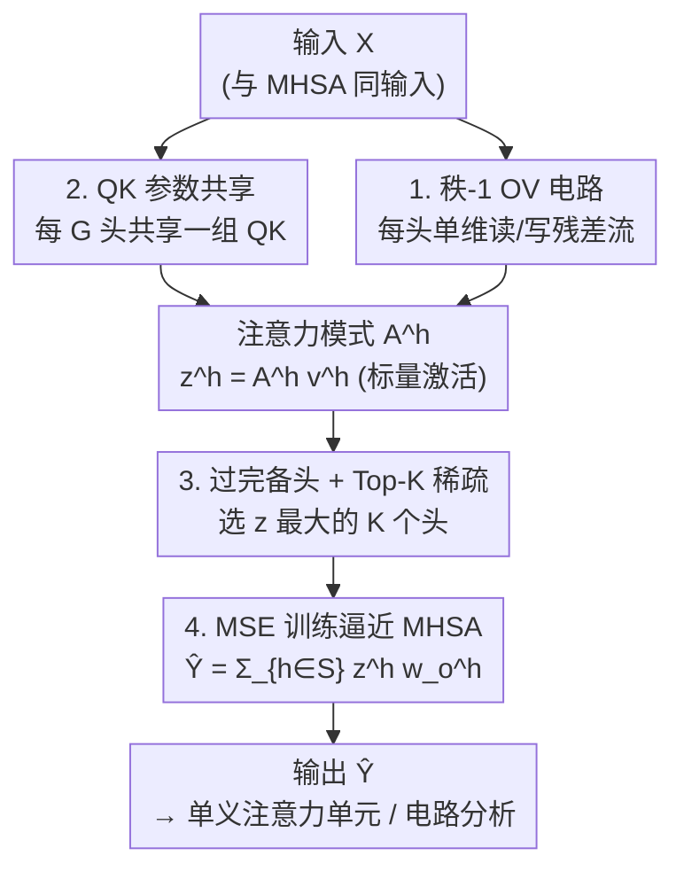

# Towards Understanding the Nature of Attention with Low-Rank Sparse Decomposition

**会议**: ICLR 2026  
**OpenReview**: [https://openreview.net/forum?id=9A2etpDFIB](https://openreview.net/forum?id=9A2etpDFIB)  
**代码**: https://github.com/OpenMOSS/Language-Model-SAEs  
**领域**: 机制可解释性 / 注意力分析  
**关键词**: 注意力叠加, 稀疏字典学习, 低秩 OV 电路, 归纳头, 替代模型

## 一句话总结
本文提出 Low-Rank Sparse Attention（Lorsa），用成千上万个稀疏激活、单维输出的注意力头去逼近原始多头自注意力（MHSA）的输出，从而把纠缠在"注意力叠加"中的原子注意力单元一个个拆解出来，使诱导头、后继头、attention sink 乃至全新的子词级诱导头都能被独立、干净地识别和解释。

## 研究背景与动机
**领域现状**：机制可解释性希望把 Transformer 拆成人能读懂的最小计算单元。在 MLP 一侧，稀疏自编码器（SAE）已经能从隐藏空间里提取出大量"单义"（monosemantic）特征，把一个神经元里混叠的多个语义解开。对注意力一侧，过去的研究主要靠在预设语境里观察单个 MHSA 头的行为，发现了诱导头（看到 `Harry` 就预测 `Potter`）、name mover 头、后继头（`Monday`→`Tuesday`、`1`→`2`）等"功能明确"的头。

**现有痛点**：但大多数注意力头根本看不出清晰功能——GPT-2 里超过 90% 的头解释尝试失败；少数看似有规律的头其实是多个头协作才完成一件事。一个头同时表现出缩写、复制、比大小三种行为，说明单个头里塞了多个语义单元；反过来，一个原子注意力单元又可能被摊到多个头上（作者实测约 25% 学到的注意力单元横跨多个 MHSA 头）。

**核心矛盾**：这正是"注意力叠加"（attention superposition）——和 MLP 神经元的特征叠加同源。它的直接后果是：基于归因的电路追踪会失效，因为单个头的 QK 模式并不能解释完整机制，还会被同一头里其他特征的计算干扰而产生误导。

**本文目标**：造一个能替代 MHSA 的模块，把叠加在一起的注意力单元"解叠"成一个个独立可读、且能做因果归因的基本单元。

**切入角度**：既然 SAE 能用"过完备 + 稀疏"把 MLP 特征解开，注意力是否也能用同样的范式？关键在于让每个解出来的头**只读写残差流里的一个方向**，并且**一次只激活极少数头**。

**核心 idea**：用一个过完备、稀疏激活、每个头只有秩-1 OV 电路的注意力层去预测原始 MHSA 的输出，把多头叠加的计算改写成"许多个单义注意力头之和"。

## 方法详解

### 整体框架
Lorsa 是一个**替代模型**：它接收和某个 MHSA 层完全相同的输入 $X$，但内部不是 12 或 32 个普通头，而是几千甚至几万个 Lorsa 头（如 Pythia-160M 每层 6K 个、Llama-3.1-8B 每层 32K 个）。每个 Lorsa 头算出一个标量激活 $z^h$，但只有激活值最大的 $K$ 个头（$K\ll H_{\text{Lorsa}}$）被保留并累加成输出 $\hat Y$。整层只用一个简单的 MSE 目标训练去逼近原 MHSA 的输出：

$$\mathcal{L} = \mathbb{E}_{x\in D}\,\lVert \text{Lorsa}(x) - \text{MHSA}(x)\rVert^2$$

整体可以理解成三件事串起来：先让每个头各自算注意力并产生一个一维的加权和 $z^h$，再用 Top-K 选出当前 token 最该激活的少数头，最后把这些头各自写回残差流的一维输出叠加起来。因为每个头只能写一个方向、且一次只激活几个头，解出来的头天然倾向于"一个头干一件事"。

### 关键设计

**1. 秩-1 OV 电路：让每个头只读写残差流的一个方向**

普通 MHSA 头的 OV 电路秩由头维度 $d_h$ 决定（如 64、256），意味着它能在残差流的一个多维子空间里读写，多个特征因此被混在同一个头里。Lorsa 顺着"线性表示假设"（单义特征是残差流里的一维方向）把每个头的 OV 电路压成**秩-1**：值投影用向量 $w_v^h\in\mathbb{R}^{d\times 1}$ 把输入压成标量序列 $v^h = Xw_v^h$，加权求和得到一维的 $z^h = A^h v^h$，再用 $w_o^h\in\mathbb{R}^{1\times d}$ 写回残差流的单一方向。这样每个头的"读"和"写"都被限制在一两个残差流特征上，输出强度可以用一个标量 $z^h_i$ 完全刻画，为后续逐头解释和归因提供了干净的抓手。作者只对 OV 降维、QK 维持高秩，是出于实际训练效果的折中。

**2. QK 参数共享：在保住注意力模式表达力的同时压住参数量**

理想情况下 QK 电路也该降到秩-1，但作者发现 QK 秩一旦低于原 MHSA 的 $D^{\text{MHSA}}_{QK}$，性能会显著掉，暗示注意力单元的 QK 电路本质是多维的。于是 Lorsa 保留 $D^{\text{Lorsa}}_{QK}=D^{\text{MHSA}}_{QK}$，但让**每 $G$ 个头共享同一组 QK 权重**（默认 $G=D^{\text{Lorsa}}_{QK}$）。这样一个共享 QK 的头组在结构上几乎等同于一个原始 MHSA 头，只是在每个 OV 维度上额外加了稀疏约束；平均每个头的参数量只有 $4D_{\text{model}}$，等价于"QK 秩-1 但不共享参数"的开销，是 Lorsa 能扩到几万头的关键。作者强调这些头仍被当作"各自独立、共享 QK"的头，因为同组头常表现出相关但不同的功能（如不同语境下的诱导），且实验证明 Lorsa 的 QK 并非简单复制原 MHSA 的 QK。

**3. 过完备头数 + Top-K 稀疏激活：用极度过完备去吃下所有潜在单元**

为了把藏在叠加里的大量注意力单元都捕获，Lorsa 采用 $H_{\text{Lorsa}}\gg H_{\text{MHSA}}$ 的过完备结构（500–1000 倍头数），但每个 token 只激活 $z^h$ 最大的 $K$ 个头：$S=\text{TopK}(\{z^h\},K)$，$\hat Y=\sum_{h\in S} z^h w_o^h$。激活的头集合随 token 动态变化，这与 TopK-SAE 选出 $K$ 个最显著线性分量的机制一脉相承——区别在于 SAE 用单个线性编码器加 ReLU 算激活，而 Lorsa 头的激活来自前文 token 的注意力模式 $A^h$ 与值 $v^h$，更像一个带非线性门控（QK 充当门）的 Transcoder。过完备保证表达力，Top-K 保证稀疏与单义，二者配合才让"一个头一个语义"成立。

**4. 以预测 MHSA 输出为目标训练：Lorsa 是替代模型而非自编码器**

和 SAE"输入输出同一份激活"不同，Lorsa 像 Transcoder 一样去**预测下游激活**——输入是 MHSA 的输入、目标是 MHSA 的输出，只用 MSE 拉近二者。训练在 Pythia-160M 和 Llama-3.1-8B 的所有层上进行，每个模型采样 8 亿 token（Pythia 截断 256、Llama 截断 1024），沿用 SAE 的最佳实践（Adam、warm-stable-decay 学习率、最优 lr scaling）。这个目标决定了 Lorsa 学到的是"注意力把哪些位置的哪些特征搬到当前位置"的计算，而不仅是某层激活的重建，因而能直接用于电路发现。作者也提醒：由于过参数化可能累积重建误差，应把 Lorsa 当作可解释性工具，而非可即插即用的替换件。

### 损失函数 / 训练策略
唯一训练目标就是上文的逐层 MSE $\mathcal{L}=\mathbb{E}_x\lVert\text{Lorsa}(x)-\text{MHSA}(x)\rVert^2$。为把激活强度 $z^h$ 和输出方向 $w_o^h$ 解耦，作者做了等价重参数化：令 $w_v^h\leftarrow w_v^h\lVert w_o^h\rVert_2$、$w_o^h\leftarrow w_o^h/\lVert w_o^h\rVert_2$，使头激活在序列上以 $z^h$ 单独表征。两个模型都支持 RoPE，Llama 还支持 GQA。训练一个 Pythia Lorsa 模块约 2 个 A100 GPU 小时，Llama 约 24 小时。

## 实验关键数据

### 主实验
作者从"重建保真度 vs 稀疏度"和"可解释性"两条线评估 Lorsa，并与同规模 Top-K SAE 对比。

| 评估维度 | 设置 | Lorsa 表现 | 对比 SAE |
|--------|------|-----------|----------|
| 保真-稀疏 scaling law | Pythia layer 3，固定 L0 扫参数量 | 与 SAE 同趋势，但同等预算下 FVU 略高（K 大时差距更明显） | SAE 占优（因任务更简单：同输入同输出） |
| 逐层重建 FVU | Pythia 18M 参数 K=64 / Llama 512M 参数 K=128 | 各层 FVU 与 SAE 高度相关，深层误差更大 | 趋势一致 |
| 自动可解释性（autointerp，GPT-4o） | Pythia，100 头/特征，24 个逐层对比 | 6 胜 3 负 15 平（α=0.05） | 与 SAE 单义性相当 |
| 电路发现 | path patching 找专用头 | 能分离出更细粒度、更干净的功能头 | 优于 SAE |

要点：在纯重建上 Lorsa 略逊于 SAE（这本就吃亏，因为它要用几百个激活去预测注意力输出，而 SAE 是同输入同输出的标准字典学习），但在**可解释性上打平、在电路发现上更优**——后者才是它的设计目标。

### 消融与分析

| 配置 / 分析 | 关键发现 | 说明 |
|------|---------|------|
| QK 秩降低 | 性能显著下降，$D^{\text{Lorsa}}_{QK}<D^{\text{MHSA}}_{QK}$ 时更严重 | 支持"注意力单元 QK 本质多维"，故保留高秩 + 共享 |
| QK 是否在抄原 MHSA | 否（Appendix B.3） | Lorsa 不等于只在 OV 上做稀疏字典学习/ICA |
| 注意力单元跨头分布 | 约 25% 学到的单元横跨多个 MHSA 头 | 直接证据支持"注意力叠加"假设 |
| z pattern 归因 | $z^h_i=\sum_{j\le i}A^h_{i,j}v^h_j$ 线性分解到各前文 token | 类似 SAE 的 DFA，但只含单个秩-1 OV + 单个共享 QK |

### 关键发现
- **重新发现已知头的"提纯版"**：Lorsa 用秩-1 OV 把诱导头、后继头（专注 1/2/3 并预测后继）、copy suppression 头、name mover 头都拆出了更专一的版本，还能把 attention sink（几乎只盯 `<|beginoftext|>`）从其他有语义的头里干净剥离。
- **全新头类型——子词级诱导头**：序列含 `[ Marion]…[M]` 时预测 `[arion]`，跨越三个不同 token；原因是 `[ Marion]` 前导空格造成分词错位，把本应是一个 token 的东西切成子片，Lorsa 捕捉到了 token 级诱导头看不到的字符级规律。
- **算术专用头家族（Llama-3.1-8B）**：在 `[op1][运算符][op2][=]` 模板下，一组头各用互不相关的启发式抓取操作数。如 `36 + 62 =`，第一个操作数由"op1∈27–43""op1%10∈[4,5,6]""op1%10∈[6,7,8]"三个头共同唯一确定 op1=36，与神经元级算术机制研究一致。
- **主题锚点头**：Llama 中存在一类对关键词做长程、主题一致注意力的头（如总统、动力系统、用药说明等主题），疑似维持话题表征以偏置预测。
- **玩具 Transformer 全稀疏化**：早期尝试把一个玩具 Transformer 完全稀疏化，成功揭示出干净的全局电路。

## 亮点与洞察
- **把 SAE 的"过完备+稀疏"范式第一次成功搬到注意力上**：核心妙处是秩-1 OV——它把"头输出强度"压成一个标量 $z^h$，使逐头解释、z pattern 归因都变得像 SAE 特征一样直接。
- **QK 共享是工程上的关键平衡**：既保住了多维 QK 的表达力（低秩会掉点），又把每头参数压到 $4D_{\text{model}}$，这是能扩到 32K 头/层的前提；它揭示"注意力单元的选择逻辑本质是多维的，但写出的内容是一维的"。
- **z pattern 归因可迁移**：把 $z^h_i$ 线性分解到前文 token 的做法，给"注意力把哪些位置搬过来"提供了可读的因果解释，可迁移到任何想做注意力级电路追踪的场景。
- **最 aha 的点**：子词级诱导头说明分词错位会催生人眼几乎注意不到的字符级机制，而只有把头拆到足够细才能看见——这是粗粒度头分析的盲区。

## 局限与展望
- **QK 未真正解绑**：共享 QK 导致同组头并非完全独立，$z$ 又混合了 Q、K、V，电路追踪有把 QK 误归因到同组其他头的风险。作者把"动态降低每头 QK 秩"列为关键后续方向。
- **QK 秩假设过强**：当前假设所有注意力单元 QK 同秩，但奇异值显示不同头的 QK 秩其实不同；需要一种按头动态决定 QK 秩的机制。
- **重建不如 SAE 且存在"暗物质"**：纯保真-稀疏上 Lorsa 落后于 SAE，且 Lorsa 误差与 SAE 误差存在非平凡相关（残留无法解释的部分）；过参数化还可能累积重建误差，因此只宜当解释工具。
- **可解释性深层退化**：autointerp 分数随层数下降，可能是后层多义性增强，也可能是当前 autointerp 流程抓不住长程依赖——分析工具本身成了瓶颈。

## 相关工作与启发
- **vs 稀疏自编码器（SAE）**：SAE 解 MLP 隐藏空间、同输入同输出；Lorsa 解注意力、像 Transcoder 一样预测下游 MHSA 输出。Lorsa 重建略逊但可解释性相当、电路发现更强，且能对横跨多 MHSA 头的注意力单元做 QK 归因。
- **vs 单头功能分析（诱导头/后继头/name mover 等）**：传统做法在预设语境里观察整个 MHSA 头，受叠加干扰只能看到"粗版";Lorsa 用秩-1 OV 把同一行为拆成更专一、更干净的细粒度头，还发现了子词级诱导头这类新单元。
- **vs Transcoder / Gated SAE**：Lorsa 在结构上最接近"接收多位置激活的 Gated Transcoder"，其中 QK 电路充当带非线性的门、$w_v$ 是线性编码器；它把 Transcoder"替代非线性模块以便归因"的思路从 MLP 推广到了注意力。

## 评分
- 新颖性: ⭐⭐⭐⭐⭐ 首个对注意力计算做稀疏可解释分解的工作，并发现子词级诱导头等新机制
- 实验充分度: ⭐⭐⭐⭐ 覆盖 scaling law、逐层重建、autointerp、多类专用头与算术电路，但因果扰动实验偏初步
- 写作质量: ⭐⭐⭐⭐ 机制叙述清晰、可视化丰富，但部分细节压在附录
- 价值: ⭐⭐⭐⭐⭐ 为"把注意力也纳入全模型稀疏化"打开了路径，工具已开源

<!-- RELATED:START -->

## 相关论文

- [\[ICLR 2026\] Sequences of Logits Reveal the Low Rank Structure of Language Models](sequences_of_logits_reveal_the_low_rank_structure_of_language_models.md)
- [\[ICLR 2026\] Escaping Low-Rank Traps: Interpretable Visual Concept Learning via Implicit Vector Quantization](escaping_low-rank_traps_interpretable_visual_concept_learning_via_implicit_vecto.md)
- [\[ICLR 2026\] Temporal Sparse Autoencoders: Leveraging the Sequential Nature of Language for Interpretability](temporal_sparse_autoencoders_leveraging_the_sequential_nature_of_language_for_in.md)
- [\[CVPR 2026\] Improving Sparse Autoencoder with Dynamic Attention](../../CVPR2026/interpretability/improving_sparse_autoencoder_with_dynamic_attention.md)
- [\[ICLR 2026\] Low-Pass Filtering Improves Behavioral Alignment of Vision Models](low-pass_filtering_improves_behavioral_alignment_of_vision_models.md)

<!-- RELATED:END -->
