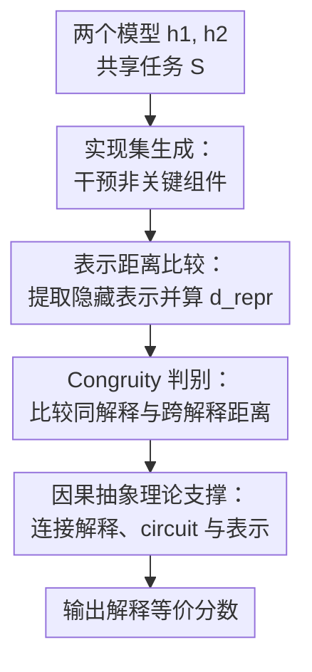

# Tracking Equivalent Mechanistic Interpretations Across Neural Networks

**会议**: ICLR2026  
**OpenReview**: [https://openreview.net/forum?id=9lycwRxAOI](https://openreview.net/forum?id=9lycwRxAOI)  
**代码**: https://github.com/alansun17904/interp-equiv  
**领域**: 可解释性 / 机制可解释性  
**关键词**: 机制可解释性, 解释等价性, 表示相似性, 因果抽象, Transformer circuits

## 一句话总结
这篇论文把“两个神经网络是否实现了同一种机制解释”形式化为解释实现集之间的等价问题，并提出用干预生成同解释实现、再用表示相似性估计 Congruity 的方法，在合成 Transformer、IOI circuit 和 POS/next-token 任务上展示了它能追踪跨模型与跨任务的机制等价关系。

## 研究背景与动机
**领域现状**：机制可解释性（mechanistic interpretability, MI）通常希望从一个模型在某个任务上的行为中恢复出可读的算法解释。现有路线大致分成两类：top-down 方法先提出候选高层算法，再检查模型是否和这个算法对齐；bottom-up 方法先找 circuit，再给 circuit 中的组件贴上可读解释。

**现有痛点**：这两条路线都卡在“解释到底何时有效”这个问题上。Top-down 的候选算法往往依赖人工灵感，复杂任务里很难枚举；即使某个候选算法能对齐模型，也只能说明它是必要线索，不一定说明模型真的完整实现了这个算法。Bottom-up 的 circuit discovery 可以被写成优化问题，但给 circuit 分配语义解释仍然高度人工，而且近期工作指出高层算法与底层 circuit 之间存在多对多关系，同一个 circuit 可能支持多个解释，同一个解释也可能由多种 circuit 实现。

**核心矛盾**：MI 想要的是“模型用了什么算法”，但直接给出算法解释本身又很难、很不唯一。若必须先完整解释每个模型，跨模型比较就会变成更难的解释生成问题；若只比较功能输出，又会把不同内部算法混在一起。因此需要一个介于两者之间的判据：不显式写出解释，却能判断两个模型是否共享同一种解释。

**本文目标**：作者把这个子问题定义为 interpretive equivalence，即判断两个模型是否实现了同一个高层机制解释。它有两个实际用途：如果小模型与大模型解释等价，就可以先解释小模型来理解大模型；如果复杂任务与简单任务在某些行为上解释等价，就可以把复杂任务的 MI 分解到更容易分析的任务上。

**切入角度**：论文的关键观察是，解释本身可能难以直接比较，但“某个解释的所有实现”是可以通过模型干预来近似枚举的。如果两个解释等价，那么从一个解释的实现集中采样出来的模型，应该和另一个解释的实现集在表示空间中不可区分。

**核心 idea**：不直接生成解释，而是把解释等价转化为实现集等价：对模型中不影响任务行为的组件做干预生成同解释实现，再用线性表示相似性检验这些实现集是否相互混同。

## 方法详解

### 整体框架
论文提出的 Congruity 流程输入是两个模型 $h_1,h_2$ 以及一个任务 $S$，输出是一个接近 1 表示解释等价、接近 0 表示解释不同的分数。整体思路不是问“$h_1$ 和 $h_2$ 的解释分别是什么”，而是先围绕每个模型生成一批保持原解释不变的实现，再比较这些实现的隐藏表示是否能把“同解释实现”和“跨解释实现”区分开。

更具体地说，算法先用 GetImpl 对模型做因果干预，得到与原模型共享解释的变体；再用 GetReprs 提取隐藏表示；然后用 $d_{repr}$ 衡量表示间是否能被线性变换互相逼近；最后通过 ReprDist 的二元比较估计 Congruity。如果两个实现集真的来自同一个解释，那么“同一解释内的表示距离”和“跨解释的表示距离”在平均意义上不应可区分。

### 关键设计
**1. 实现集生成：用不改变任务行为的干预近似枚举同一解释的实现**

本文先定义一个实现（implementation）：如果模型 $h$ 可以被某个机制解释 $A$ 解释，那么 $h$ 就是 $A$ 的一个实现。问题是，完整枚举某个解释的所有实现几乎不可能，因为这些实现散布在模型架构和权重空间里。作者采用对偶视角：不直接搜索权重空间，而是从一个已知模型出发，对那些与当前任务行为无因果关系的组件做删除、替换或修改。

这个设计背后的假设很具体：如果一个组件不属于任务 circuit，那么扰动它不应改变模型在该任务上的机制解释。于是每次干预都会得到一个“新模型”，它在功能和解释层面仍属于同一个实现集。对于 IOI 实验，作者用已有 circuit 分析找到不属于 IOI circuit 的 attention heads，再用 counterfactual 输入的 head output 去 patch 这些非关键组件；对于合成任务，则通过 RASP/Tracr 与 strict interchange intervention training 生成同一解释下的多种 Transformer 实例。

**2. 表示距离比较：把解释实现集投影到可计算的隐藏表示空间**

解释和 circuit 的对象太抽象，不能直接做稳定距离比较；隐藏表示则天然是实值向量，可以用现成的 representation similarity 工具处理。本文把每个实现映射到它的隐藏表示序列，并用 $d_{repr}$ 定义双向线性逼近误差：一边找线性算子把 $R_1$ 变到 $R_2$，另一边找线性算子把 $R_2$ 变到 $R_1$，最后取两边误差中的较大者。

形式上，若 $H_i$ 是表示 $R_i$ 中所有隐藏变量的拼接，论文把表示相似性写成

$$
d_{repr}(R_1,R_2)=\max\left(\inf_{\|A\|_{op}\le 1}\|AH_1-H_2\|,\inf_{\|B\|_{op}\le 1}\|H_1-BH_2\|\right).
$$

这个定义没有声称所有机制差异都必须是线性的，而是选择了一个可计算、样本效率较好的近似。它的作用是把“解释是否等价”转成“同解释实现之间的表示差异，是否比跨解释实现更小或不可区分”。如果不同解释的实现集在表示空间中明显分离，Congruity 就会变低；如果两个实现集混在一起，Congruity 就会变高。

**3. Congruity 判别：用排序式比较避免显式估计解释文本**

Algorithm 1 的核心是一个三模型比较。以 $h_1$ 为基准，算法采样一个同解释实现 $h_1^\star$，同时拿 $h_2$ 作对照；若 $d_{repr}(h_1,h_1^\star)\le d_{repr}(h_1,h_2)$，ReprDist 返回 1，否则返回 0。随后算法对称地以 $h_2$ 为基准再做一次，并对多次采样结果求和。

最终分数写成 $1-|s/n-1|$。直觉是：若两边解释等价，来自同一实现集和跨实现集的距离没有系统性差异，两个方向的比较平均会处在平衡状态，分数接近 1；若解释不同，同解释距离会更常小于跨解释距离，平衡被打破，分数下降。这个排序式比较很重要，因为它不要求给出一个全局阈值来判断两个表示“足够像”，只要求在同一次采样中比较相对距离。

**4. 因果抽象理论支撑：用解释压缩和 Hausdorff 距离说明 Congruity 在测什么**

论文不是只提出启发式算法，还把解释、circuit 和表示统一放进因果模型语言里。一个 circuit 被定义为能复现模型在任务 $S$ 上输出的因果图；一个表示是 circuit 的链式抽象；一个解释则是 circuit 的更高层因果抽象，并允许有 $\eta$ 级别的近似误差。解释 $A$ 的实现集 $\Pi^{-1}(A)$ 包含所有在给定 alignment class 下能被 $A$ 解释的 circuit。

在这个框架里，解释等价性由两个实现集之间的 Hausdorff 距离 $d_{interp}$ 描述，解释压缩 $\kappa(A,K,\Pi)$ 则是同一解释实现集的直径。压缩越强，解释越抽象、可对应的实现越多，等价比较也越难。Main Result 1 给出上界：表示相似性、表示误差、功能差异和解释压缩共同控制解释等价距离；Main Result 2 给出反向约束：如果两个解释近似等价，那么它们的表示距离不能太大，除非表示抽象本身不稳定或误差项很大。这让 Congruity 不只是一个经验分数，而是和解释实现集、circuit 与 representation 的几何关系相连。

### 一个完整示例
以 IOI（indirect-object identification）为例，句子片段是 “When John and Mary went to the store, John gave the drink to ...”，模型应该预测 “Mary”。已有研究认为 GPT2-small/medium 使用一类 IOI circuit，而 Pythia 系列跨尺度使用另一类相对一致但不同于 GPT2 的 circuit。

Congruity 的操作可以这样走一遍：先对 GPT2-small 找到 IOI circuit 中关键的 name mover 等 attention heads，把其余对 IOI 行为不关键的 heads 视作可干预组件；然后构造 counterfactual 句子，例如交换 John 和 Mary 的位置，用 counterfactual 运行得到的非关键 head 输出 patch 到原模型中，生成 10 个保持 IOI 解释不变的实现。对 Pythia-160M、Pythia-2.8B 或 GPT2-medium 也做同样处理。

接着算法在 200 个 IOI 句子上提取这些模型及其实现的隐藏表示。若比较的是 Pythia-160M 与 Pythia-2.8B，同族不同尺度模型的实现集在表示距离比较中更难被区分，Congruity 较高；若比较的是 Pythia 与 GPT2，跨族平均 Congruity 明显下降。这说明方法捕捉到的不是参数量或架构表面相似，而是任务机制解释层面的相似与差异。

### 损失函数 / 训练策略
本文本身不是训练一个新模型，因此没有传统意义上的任务损失函数。需要估计的是两类量：一类是通过 intervention 生成实现，另一类是通过线性回归式表示相似性计算 $d_{repr}$。在合成 n-Permutation Detection 实验中，作者先手写 6 种 RASP 解释，再编译成 Transformer，并用 strict interchange intervention training 生成同解释下的多架构、多权重实现；这些实现的层数、attention heads 和 embedding 维度都有明显变化，以测试方法能否忽略架构表面差异。

对于统计检验，论文在 toy task 中对 Congruity 输出做 bootstrap，构造 95% 置信区间；在 IOI 与 POS/next-token 实验中，作者固定具体数据规模，例如 IOI 使用 200 个句子、每个模型生成 10 个并行实现，POS circuit 则通过 function vectors 和 activation patching 从 1000 个 Penn TreeBank 样本中估计关键 attention heads。

## 实验关键数据

### 主实验
论文做了三个主实验：合成 n-Permutation Detection 校准 Congruity，IOI 上检验跨模型尺度的解释等价，next-token prediction 与 POS identification 上检验跨任务归约。缓存文本中的图给出了热图和柱状结果，主文明确报告了若干关键平均值与定性分组。

| 场景 | 比较对象 | 指标 / 结果 | 结论 |
|------|----------|-------------|------|
| n-Permutation Detection | 6 种手写解释，每种 100 个实现 | 同一解释对角线 Congruity 显著更高 | Congruity 能识别 ground-truth 相同解释 |
| n-Permutation Detection | 排序类解释 1-4 vs 计数类解释 5-6 | 排序类内部平均 Congruity 为 0.43，跨排序/计数平均为 0.01 | 分数还能反映粗粒度算法家族差异 |
| IOI | Pythia 系列不同尺度 | 族内 Congruity 高，论文例子指出 Pythia-2.8B 与 Pythia-160M 解释等价 | 大模型可归约到小模型做 MI |
| IOI | Pythia vs GPT2 | 跨族平均 Congruity 为 0.13，低于 Pythia 族内 0.73 与 GPT2 族内 0.92 | 方法区分了已知不同的 IOI circuit 家族 |
| GPT2 next-token vs POS | all tokens、articles、prepositions、punctuation 等 token groups | terminal punctuation 和 closing brackets/quotations 高于 all-token control | 句法性 token 预测更接近 POS 机制 |

### 消融实验
这篇论文没有按传统模型论文报告“去掉模块 A/B”的消融表，因为它提出的是一个理论框架和比较算法。不过主实验中有多组控制与分析，作用相当于验证 Congruity 的关键组成是否符合预期。

| 配置 / 分析 | 关键指标 | 说明 |
|-------------|----------|------|
| 同一解释内部比较 | Toy task 对角线显著高 | 检验“同解释实现应表示相近或不可区分”这一核心假设 |
| 不同解释跨组比较 | 排序 vs 计数平均 0.01 | 检验 Congruity 不会只因为任务功能相同就给高分 |
| 同算法粗类别比较 | 排序类解释 1-4 内部平均 0.43 | 说明分数可作为 graded notion，而非只有二元判别 |
| IOI 同族跨尺度 | Pythia 族内 0.73，GPT2 族内 0.92 | 检验方法能越过模型规模差异捕捉解释一致性 |
| IOI 跨模型家族 | Pythia-GPT2 跨族 0.13 | 对照已有 circuit 文献中两族机制不同的发现 |
| POS vs token groups | articles / prepositions 与 all-token control 统计上不可区分 | 作为语义依赖更强 token 的负向控制 |

### 关键发现
- Congruity 在有 ground-truth 的合成任务上校准良好：同解释模型组更高，不同解释模型组更低，说明它不是单纯比较功能准确率，因为所有 RASP Transformer 都达到 96% 以上准确率。
- 方法对“解释层级”有一定敏感性：排序类内部虽然不是完全相同解释，但比排序类与计数类之间更接近，提示 Congruity 可以用于刻画粗粒度机制差异。
- IOI 实验支持“解释归约到小模型”的用法：Pythia-2.8B 与 Pythia-160M 在 IOI 上解释等价这一结果，与 Tigges et al. 对 Pythia 跨尺度 circuit 一致性的发现吻合。
- POS/next-token 实验展示了跨任务归约的雏形：终止标点和闭合括号/引号这类更依赖句法结构的 token，与 POS identification 的 Congruity 更高；冠词和介词由于语义、语用依赖更强，没有高于 all-token control。

## 亮点与洞察
- 把“解释等价”从解释文本比较转成实现集比较，是这篇论文最有价值的抽象。它承认解释不可识别和多对多映射的现实，但没有因此放弃比较，而是把问题搬到更可计算的模型实现与表示空间。
- Algorithm 1 很轻巧：它只需要生成解释保持干预和计算表示距离，不需要先完成完整 MI。这让它可以作为 MI 工作流前置步骤，用来判断是否值得把大模型、复杂任务归约到已有可解释对象。
- 理论部分把三个过去经常分开讨论的对象连起来：interpretations、circuits 和 representations。尤其是解释压缩 $\kappa$ 的概念很有启发性，因为它说明越抽象的解释越容易有大量实现，也越难通过表示距离精确区分。
- 论文对“表示相似性”的使用比较克制。作者没有声称线性表示相似性万能，而是明确指出复杂流形结构可能需要更一般的 $d_{repr}$；这让框架有扩展空间，可以替换为 kernel similarity 或更复杂的 representation alignment。
- 对 MI 实践的启发是：在解释一个大模型之前，先问它是否和一个更小、更易分析的模型解释等价；在解释 next-token prediction 之前，先问某些 token 子集是否和更简单的语法任务共享机制。这种“先找等价归约，再做解释”的流程可能比直接解释全模型更可扩展。

## 局限与展望
- Congruity 依赖 GetImpl，而 GetImpl 需要知道哪些组件不影响目标行为。虽然这比完整 circuit discovery 更宽松，但实践中仍需要可靠的 activation patching、attribution patching 或已有 circuit 结果；如果非关键组件识别错了，生成的实现集就可能混入不同解释。
- 线性表示相似性可能低估复杂机制等价。若两个等价实现的表示关系不是线性可对齐，$d_{repr}$ 会给出过大的距离；反过来，不同机制也可能在某些低维投影上看起来相似。
- 实验任务仍偏小或偏已知：n-Permutation 是合成任务，IOI 和 POS 都是 MI 文献中相对成熟的测试床。论文展示了框架潜力，但还没有证明它能稳定处理真实复杂能力，例如多步推理、tool use 或长上下文任务。
- 解释等价不等于解释发现。即使 Congruity 判断两个模型等价，它也没有告诉我们那个共同解释是什么；它更像是帮助选择可解释代理模型或可归约任务的筛选器。
- 理论界限中包含表示质量误差、功能差异、alignment Lipschitz 常数、解释压缩等量，很多在真实模型上难以精确估计。未来需要把这些理论量转成更可操作的诊断指标。

## 相关工作与启发
- **vs top-down 机制可解释性**: Top-down 方法先提出候选算法再验证对齐，本文不要求候选算法存在，而是先判断两个未知解释是否等价。优势是能避免人工枚举候选解释，劣势是不能直接产出人类可读解释。
- **vs bottom-up circuit discovery**: Bottom-up 方法先找最小或近似最小 circuit，再解释组件；本文只需要识别不影响任务行为的组件来生成干预实现，因此比完整 circuit discovery 要宽松。不过它仍然依赖干预质量，不能完全摆脱 circuit 工具链。
- **vs causal abstraction**: 因果抽象通常判断一个高层模型是否忠实抽象低层模型，仍然需要给出高层解释。本文把抽象关系放进实现集和 alignment class 中，通过实现集的 Hausdorff 距离定义解释等价，绕开了直接比较符号解释的难题。
- **vs representation similarity**: 传统 representation similarity 多用于比较模型表征、训练动态或跨模型归纳偏置。本文把它提升为解释等价的代理度量，并通过理论结果说明何时表示相似性能约束解释等价。
- **启发**: 对后续工作来说，一个自然方向是把 Congruity 接到自动 MI pipeline：先批量搜索与目标模型解释等价的小模型或简单任务，再只在人类可处理的对象上运行解释生成与验证。

## 评分
- 新颖性: ⭐⭐⭐⭐⭐ 把机制解释比较定义为实现集等价，并用干预和表示相似性近似，问题设定和理论抽象都很有新意。
- 实验充分度: ⭐⭐⭐⭐☆ 三个实验覆盖校准、跨模型归约和跨任务归约，但主要还是 toy / IOI / POS 这类相对受控场景，复杂真实能力验证不足。
- 写作质量: ⭐⭐⭐⭐☆ 主线清楚，Algorithm 1 直观，理论部分较重但附录问答解释了若干关键疑问；读者需要一定因果抽象和 MI 背景。
- 价值: ⭐⭐⭐⭐⭐ 价值不在于给出一个最终解释器，而在于提供了 MI 可扩展性的一个新入口：先追踪解释等价，再决定在哪里投入解释成本。

<!-- RELATED:START -->

## 相关论文

- [\[ICLR 2026\] Certified Evaluation of Model-Level Explanations for Graph Neural Networks](certified_evaluation_of_model-level_explanations_for_graph_neural_networks.md)
- [\[ICLR 2026\] Bayesian Neural Networks for Functional ANOVA Model](bayesian_neural_networks_for_functional_anova_model.md)
- [\[ICLR 2026\] Addressing Divergent Representations from Causal Interventions on Neural Networks](addressing_divergent_representations_causal.md)
- [\[ICML 2025\] Validating Mechanistic Interpretations: An Axiomatic Approach](../../ICML2025/interpretability/validating_mechanistic_interpretations_an_axiomatic_approach.md)
- [\[ICLR 2026\] FAME: Formal Abstract Minimal Explanation for Neural Networks](fame_formal_abstract_minimal_explanation_for_neural_networks.md)

<!-- RELATED:END -->
