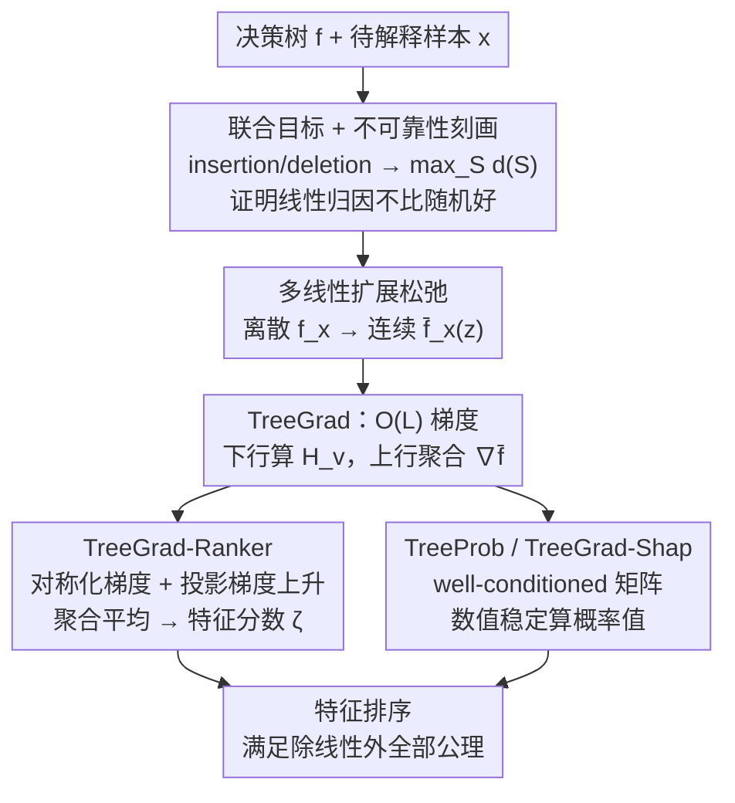

# TreeGrad-Ranker: Feature Ranking via O(L)-Time Gradients for Decision Trees

**会议**: ICLR 2026  
**OpenReview**: [https://openreview.net/forum?id=OcMeNbkN13](https://openreview.net/forum?id=OcMeNbkN13)  
**代码**: https://github.com/watml/TreeGrad  
**领域**: 可解释性 / 特征归因 / 决策树  
**关键词**: 特征排序, Shapley 值, 概率值, 多线性扩展, 数值稳定性

## 一句话总结
针对决策树的特征排序，作者先从理论上证明 Shapley/Banzhaf 这类"概率值"在优化 insertion/deletion 真正对应的联合目标时不比随机猜更好，进而提出在多线性扩展上做 $O(L)$ 时间梯度计算的 TreeGrad，并据此构造直接优化联合目标的 TreeGrad-Ranker，以及数值稳定的 TreeGrad-Shap，在 insertion/deletion 指标上显著超过概率值基线。

## 研究背景与动机
**领域现状**：决策树（尤其梯度提升树）在表格数据上至今仍很有竞争力，且因规则结构被认为"可解释"。解释其预测时，主流是用 Shapley 值及其家族——更一般地是**概率值（probabilistic values）**，即由线性、dummy、单调性、对称性四条公理唯一刻画的一类特征归因，weighted Banzhaf 值、Beta Shapley 值（含 Shapley 值本身）都属于其中的半值（semi-value）。在树上，Shapley 值可多项式时间精确算出，最高效的是 $O(LD)$ 时间的 Linear TreeShap（$L$ 为叶子数，$D$ 为深度）。

**现有痛点**：概率值有两个被忽视的问题。其一，没有"普适最优"的概率值——Kwon & Zou 等人发现不同数据上最好的 Beta Shapley 参数各不相同，到底哪个可靠没人说得清。其二，Linear TreeShap 虽然理论上精确，但实现里要对一个基于实值节点的 **Vandermonde 矩阵**求逆，其条件数随深度 $D$ 指数增长，深树上数值误差会爆炸式累积。

**核心矛盾**：特征排序质量通常用 **insertion / deletion** 两个指标衡量（前者衡量把高分特征逐个加回去时预测值升得多快，后者衡量把低分特征逐个删去时预测值压得多低）。作者观察到，同时优化这两个指标，本质上等价于一个**联合优化**：找一个特征子集 $S$ 使 $f_x(S)$ 尽量大、同时其补集 $f_x([N]\setminus S)$ 尽量小。而概率值作为**线性**归因方法，根本不是为这个目标设计的。

**本文目标**：(1) 厘清概率值在这个联合目标上到底有多不可靠；(2) 给出一个直接优化联合目标、又能高效用在决策树上的特征排序算法；(3) 顺带修掉 Linear TreeShap 的数值不稳定。

**切入角度**：把离散集合函数 $f_x:2^{[N]}\to\mathbb{R}$ 通过 **multilinear extension** 连续化成 $\bar f_x:[0,1]^N\to\mathbb{R}$，联合目标就变成可微分的连续优化，可以直接做梯度上升。关键在于：决策树结构足够"良好"，使这个梯度能在 $O(L)$ 时间算出来。

**核心 idea**：与其用线性代理（概率值）去近似联合目标，不如在多线性扩展上**直接对联合目标做梯度上升**，并把过程中聚合的梯度当作特征分数——它能满足刻画概率值的所有公理，唯独不要线性（而线性恰恰是不可靠性的根源）。

## 方法详解

### 整体框架
方法围绕一条主线展开：先把"insertion+deletion 联合优化"这个真正想解的问题写清楚，证明线性归因（概率值）解不好它；再把离散目标松弛成多线性扩展上的连续优化，用 TreeGrad 在 $O(L)$ 时间算梯度；最后用梯度上升直接优化、把聚合梯度当特征分数（TreeGrad-Ranker），并给出数值稳定的概率值计算副产品（TreeProb / TreeGrad-Shap）。

记联合目标为

$$\max_{S\subseteq[N]}\ d_{f_x}(S):=\tfrac12\big(f_x(S)-f_x([N]\setminus S)\big).$$

它的多线性松弛是 $\max_{z\in[0,1]^N}\tfrac12(\bar f_x(z)-\bar f_x(\mathbf 1_N-z))$；论文证明当最优集 $S^*$ 唯一时，松弛问题的唯一最优解就是 $\mathbf 1_{S^*}$，因此松弛是无损的。

### 关键设计

**1. 联合目标与概率值的不可靠性：把"排序好不好"翻译成一个线性方法注定解不好的问题**

作者先把评测指标和优化目标对齐。insertion 指标 $\mathrm{Ins}(\pi;f_x)=\frac1N\sum_k f_x(S_k^+)$ 衡量按排序 $\pi$ 自顶向下逐个加特征时预测值的曲线下面积，deletion 指标对称地衡量自底向上删特征。经验上更高的 insertion 往往对应更大的 $f_x(S^+_*)$、更低的 deletion 对应更小的 $f_x(S^-_*)$，且二者最优子集互补，于是"同时优化两指标"被归约成上面的联合目标 $\max_S d_{f_x}(S)$。

接着是本文的理论核心（Proposition 1）：若一个归因方法 $\phi(f_x)$ 对 $f_x$ **线性**（概率值全都满足），当 $N>3$ 时存在两个集合 $S_1,S_2$，使得任何基于 $\phi$ 的假设检验都无法可靠区分 $d_{f_x}(S_1)\le d_{f_x}(S_2)$ 与反向假设，其可靠性上界 $\mathrm{Rel}\le1$，**和随机猜（$h\equiv0.5$）一样**。直觉是：线性算子把 $2^N$ 维的集合函数压成 $N$ 维向量，必然丢掉大量可分辨的差异。Proposition 2 进一步说明，概率值诱导的排序等价于先用**最优线性代理** $g^*$ 替换 $f_x$、再解联合目标——这个线性化并不能忠实表达 $f_x$ 的行为，正是不可靠的来源。这一节为后面"绕开线性、直接优化"提供了理论依据。

**2. TreeGrad：在 $O(L)$ 时间算出多线性扩展的梯度**

直接优化联合目标的前提，是能高效拿到 $\nabla\bar f_x(z)$。多线性扩展的偏导（Owen 1972）为

$$\nabla_i\bar f_x(z)=\sum_{S\subseteq[N]\setminus i}\Big(\prod_{j\in S}z_j\Big)\Big(\prod_{j\notin S\cup i}(1-z_j)\Big)\,[f_x(S\cup i)-f_x(S)],$$

朴素计算是指数级的。作者利用决策树把 $\bar f_x$ 分解为各叶子路径规则之和 $\bar f_x=\sum_{v\in L_r}\bar R^v_x$，并证明 Lemma 1：$\nabla_i\bar R^v_x(z)=(\gamma_{i,v}-1)\cdot\frac{H_v}{1-z_i+z_i\gamma_{i,v}}$，其中 $H_v=\frac{\varrho_v c_v}{c_r}\prod_{j\in F_v}(1-z_j+z_j\gamma_{j,v})$。算法据此做一次树遍历：**下行**沿路径累乘出每个 $H_v$（行 2–10），**上行**用 $H$ 数组把同一特征在各叶子的贡献聚合起来（行 11–15，对应 Lemma 2）。整套流程时间和空间都是 $O(L)$——比 Linear TreeShap 的 $O(LD)$ 还省一个深度因子，且因为只做乘加、不求 Vandermonde 逆，天然数值稳定。$1-z_i+z_i\gamma_e=0$ 的除零角落情形被单独处理（完整版 Algorithm 11）。

**3. TreeGrad-Ranker：用投影梯度上升直接优化，把聚合梯度当特征分数**

有了 $O(L)$ 梯度，就能对松弛后的联合目标做梯度上升（Algorithm 2）：初始化 $z=0.5\cdot\mathbf 1_N$，每步用**对称化梯度** $g=\tfrac12(\mathrm{TreeGrad}(z)+\mathrm{TreeGrad}(\mathbf 1_N-z))$（对应目标里 $f_x(S)$ 与 $f_x([N]\setminus S)$ 两项），更新 $z\leftarrow\mathrm{Proj}(z+\epsilon g)$ 把分量裁回 $[0,1]$，并维护梯度的**滑动平均** $\zeta\leftarrow\frac{t-1}{t}\zeta+\frac1t g$ 作为最终特征分数；梯度上升也可换成 ADAM（Algorithm 10）。把平均梯度当分数有其道理：任何对称半值（含 Shapley、Banzhaf）都能写成这个梯度场的期望，$T=1$ 时 $\zeta$ 恰好就是 Banzhaf 值。最关键的是 Theorem 1：$\zeta_i=\sum_{S}\omega_i(S;x)\,[f_x(S\cup i)-f_x(S)]$ 且权重 $\omega_i(S;x)>0$、$\sum_S\omega_i(S;x)=1$，因此它满足 dummy、equal treatment、monotonicity，**唯独不满足线性**——而线性正是设计 1 里证明的不可靠根源。这让 TreeGrad-Ranker 既保住了概率值的"好性质"，又摆脱了那条有害的公理。

**4. TreeProb / TreeGrad-Shap：用良态矩阵修掉 Linear TreeShap 的数值崩溃**

作为副产品，作者把 Linear TreeShap 推广到所有概率值并修复其数值病。Linear TreeShap 的不稳定源于求逆一个基于实值（Chebyshev）节点的 Vandermonde 矩阵，其条件数随 $D$ 指数增长，$D=20$ 时就已超过 $10^5$。修法（TreeProb）是把实值节点换成**单位圆上等距分布的复值节点** $\chi_k=e^{i2(k-1)\pi/D}$，此时 Vandermonde 矩阵条件数恒为 $1$，且 $V^{-1}=\frac1D V$、$V^T=V$，编解码多项式都很稳。在此基础上，注意到 Shapley 值是梯度场的均匀积分、可用 Gauss–Legendre 求积写成有限个梯度的正加权和 $\phi^{\mathrm{Shap}}=\sum_\ell\kappa_\ell\nabla\bar f_x(t_\ell\mathbf 1_N)$，于是得到 TreeGrad-Shap：$O(LD)$ 时间精确算带整数参数的 Beta Shapley 值，并从 TreeGrad 继承数值稳定性。实测中 Linear TreeShap 算 Shapley 值的误差可达 TreeGrad-Shap 的 $10^{15}$ 倍。

### 损失函数 / 训练策略
没有需要训练的网络参数；"优化"指的是对单个样本 $x$ 在多线性扩展上跑梯度上升求特征分数。实验中固定 $T=100$ 步、学习率 $\epsilon=5$；决策树用 scikit-learn 训练，随机种子固定为 2025，每棵树随机取 200 个样本 $x$ 报告平均结果。

## 实验关键数据

### 主实验
在 9 个 OpenML 数据集（6 个分类：FOTP、GPSP、jannis、spambase、philippine、MinibooNE；3 个回归：BT、superconduct、wave energy）上，与 Beta Shapley 值族 $\mathrm{Beta}(\alpha,\beta)$（含 Shapley=$\mathrm{Beta}(1,1)$）、Banzhaf 值及一个贪心算法对比 insertion / deletion 曲线。

| 对比项 | insertion（越高越好） | deletion（越低越好） | 说明 |
|--------|----------------------|---------------------|------|
| TreeGrad-Ranker (GA/ADAM) | 显著最优 | 有竞争力（接近最优） | 直接优化联合目标 |
| Beta-Insertion（选最优 Ins 的 Beta） | 较高 | 一般 | 同一个 Beta 难以同时占优两指标 |
| Beta-Deletion（选最优 Del 的 Beta） | 一般 | 较低 | 与上行此消彼长 |
| Banzhaf / Shapley | 中等 | 中等 | 线性归因，受 Prop 1 限制 |
| Greedy | 视数据 | 视数据 | 贪心选互补子集 |

核心结论：对 Beta Shapley 值，取得最佳 insertion 的那个参数往往拿不到最佳 deletion，反之亦然；而 TreeGrad-Ranker 在 insertion 上显著超过所有基线、同时 deletion 保持有竞争力。

### 数值稳定性对比

| 算法 | 算 Shapley 值的数值误差 | 矩阵条件数（$D{=}20$） |
|------|------------------------|----------------------|
| Linear TreeShap | 基准（最大） | $>10^5$ |
| TreeShap-K | 同量级不稳定 | $>10^5$（解病态线性方程） |
| Linear TreeShap（well-conditioned/TreeProb） | 显著改善，深树仍下溢 | 接近 $1$ |
| TreeGrad-Shap | 最小（比 Linear TreeShap 小约 $10^{15}$ 倍） | — |

### 关键发现
- 概率值的"两指标不可兼得"在实验中被直接看到：没有哪个 Beta 参数能同时拿下 insertion 和 deletion，印证了设计 1 的理论——线性归因解不好联合目标。
- TreeGrad-Ranker 的优势主要体现在 insertion（顶部排序质量），deletion 上与最优 Beta 打平；说明直接优化联合目标更擅长把"正贡献特征"排到前面。
- 数值层面，Vandermonde 节点从实值改到单位圆上的复值是关键一招，条件数从指数增长直接降到常数 $1$；TreeGrad-Shap 进一步把误差压到最低。

## 亮点与洞察
- **把"评测指标"反推成"优化目标"再做不可能性证明**：先论证 insertion+deletion 等价于联合目标 (5)，再证明所有线性归因在这个目标上不比随机好——这把"该不该用 Shapley 排序"从经验争论变成可证的理论问题，很有杀伤力。
- **"满足除线性外全部公理"是一个聪明的定位**：既保留 dummy/单调/对称这些直觉上想要的性质，又精准丢掉那条被证明有害的线性公理，给出一种"理性地偏离 Shapley"的归因。
- **$O(L)$ 梯度遍历可复用**：把多线性扩展梯度落到一次树的下行累乘 + 上行聚合，这套机制不止能排序，也是算半值、概率值的统一后端，迁移到其他基于树的解释任务（交互值、数据估值）很自然。
- **数值稳定的小技巧值得记**：Vandermonde 病态来自实值节点，换到单位圆等距复节点条件数恒为 1——这是处理多项式插值/编解码时通用的稳定化手段。

## 局限与展望
- 方法专为**决策树**设计，$O(L)$ 的高效性依赖树结构分解，无法直接迁移到神经网络等一般模型。
- insertion/deletion 与联合目标 (5) 的等价是**经验观察**而非严格等式（"closely related/often associated"），结论建立在这个近似桥梁上。
- TreeGrad-Ranker 的优势偏向 insertion，deletion 只是"有竞争力"；对更看重底部排序质量的场景未必占优。
- TreeProb 在节点数很大时仍会数值下溢（虽比 Linear TreeShap 轻），真正稳的是 TreeGrad-Shap，但后者只覆盖**整数参数**的 Beta Shapley，非整数参数概率值仍缺稳定算法。

## 相关工作与启发
- **vs Linear TreeShap / TreeShap-K**：它们在 $O(LD)$ 时间精确算 Shapley 值，但依赖病态 Vandermonde/线性方程、深树数值崩溃；本文的 TreeGrad 用 $O(L)$ 乘加避开求逆，TreeProb 用良态矩阵、TreeGrad-Shap 用求积，数值误差小到 $10^{15}$ 倍差距。
- **vs Beta Shapley / Banzhaf 等概率值**：它们是线性归因，本文从理论上证其在联合目标上不比随机好；TreeGrad-Ranker 改为直接优化联合目标，放弃线性公理换取可靠性，实验上 insertion 显著更好。
- **vs 贪心选子集**：贪心每步选当前最优互补特征，本文则在连续松弛上做投影梯度上升并聚合梯度，得到满足公理的平滑分数而非纯组合搜索。

## 评分
- 新颖性: ⭐⭐⭐⭐⭐ 把指标反推成联合目标并证明线性归因的不可靠性，再给出 $O(L)$ 梯度直接优化，视角和机制都新。
- 实验充分度: ⭐⭐⭐⭐ 9 个数据集覆盖分类/回归，insertion/deletion + 数值误差都验证；但主结果以曲线呈现、缺更直接的 AUC 汇总表。
- 写作质量: ⭐⭐⭐⭐ 理论推导严谨、符号精确，但记号密集，对非该领域读者门槛偏高。
- 价值: ⭐⭐⭐⭐ 给树模型特征排序提供了有理论支撑且数值稳定的新工具，并附带可复用的稳定半值计算后端。

<!-- RELATED:START -->

## 相关论文

- [\[ICML 2025\] Leveraging Predictive Equivalence in Decision Trees](../../ICML2025/interpretability/leveraging_predictive_equivalence_in_decision_trees.md)
- [\[NeurIPS 2025\] Empowering Decision Trees via Shape Function Branching](../../NeurIPS2025/interpretability/empowering_decision_trees_via_shape_function_branching.md)
- [\[ICML 2025\] Near-Optimal Decision Trees in a SPLIT Second](../../ICML2025/interpretability/near_optimal_decision_trees_in_a_split_second.md)
- [\[ICML 2026\] Manifold-Aligned Guided Integrated Gradients for Reliable Feature Attribution](../../ICML2026/interpretability/manifold-aligned_guided_integrated_gradients_for_reliable_feature_attribution.md)
- [\[AAAI 2026\] ShapBPT: Image Feature Attributions Using Data-Aware Binary Partition Trees](../../AAAI2026/interpretability/shapbpt_image_feature_attributions_using_data-aware_binary_partition_trees.md)

<!-- RELATED:END -->
