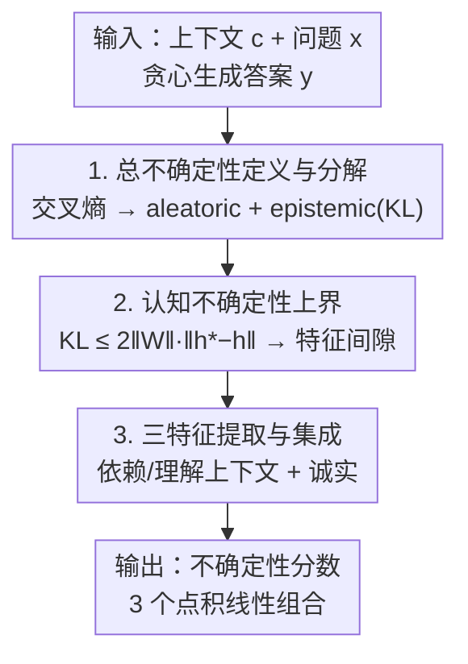

# Uncertainty as Feature Gaps: Epistemic Uncertainty Quantification of LLMs in Contextual Question-Answering

**会议**: ICLR 2026  
**OpenReview**: [https://openreview.net/forum?id=OWvvdl27CE](https://openreview.net/forum?id=OWvvdl27CE)  
**代码**: [https://github.com/Ybakman/Feature-Gaps](https://github.com/Ybakman/Feature-Gaps)  
**领域**: 可解释性 / LLM 不确定性量化  
**关键词**: 认知不确定性, 上下文问答, 特征间隙, 线性表征假设, top-down 可解释性

## 一句话总结
本文把 LLM 的认知不确定性（epistemic uncertainty）推导为"当前模型隐藏状态与一个理想模型之间的特征间隙"，在上下文问答（contextual QA / RAG）场景下用三个语义特征（依赖上下文、理解上下文、诚实）近似这个间隙，仅靠极少标注样本提取特征方向并集成，在多个 QA 基准上以可忽略的推理开销把 PRR 最高提升约 13–16 个点。

## 研究背景与动机
**领域现状**：不确定性量化（UQ）是用模型自身信号（token 概率、输出一致性、内部激活）来判断一次生成是否可信的核心工具，已有大量方法（语义熵、SAR、SAPLMA 等）在各类基准上表现不错。

**现有痛点**：绝大多数 UQ 方法都是在**闭卷事实问答**上设计和评测的——它考的是模型"记忆里有没有这个知识"。但随着 RAG 普及，真正高频的场景是**上下文问答**：上下文已经给定，模型要基于给定文档回答问题。这个方向上现有方法很少，且大多是**启发式**拼凑（凭经验选信号），缺乏理论根据。

**核心矛盾**：UQ 想量化的其实是**认知不确定性**（模型"没能力/没把握答对"），但它和**偶然不确定性**（aleatoric，问题本身有歧义、多种说法都对）混在一起；现有启发式方法既没把两者分开，也说不清自己到底在估计什么。

**本文目标**：(1) 给上下文问答一个**有理论根据**的认知不确定性度量；(2) 把它落地成一个高效、少标注、能跨域泛化的打分器。

**切入角度**：作者从一个"理想模型"假设出发——存在一个**没有认知不确定性的理想分布** $P^*$，当前模型与它的差距就是认知不确定性。再借助可解释性里的**线性表征假设**，把这个抽象差距翻译成隐藏空间里**可解释的语义特征方向上的差距**。

**核心 idea**：用"当前模型 vs 理想模型在若干语义特征方向上的间隙之和"来代替难以计算的认知不确定性；在上下文问答里，这个间隙被假设成三个具体特征（依赖上下文、理解上下文、诚实）。

## 方法详解

### 整体框架
方法分两段：前半段是**通用推导**（适用于任意 LLM 任务），把"认知不确定性"一步步化简成"隐藏状态特征间隙"；后半段是**上下文问答落地**，把抽象的特征间隙具体化成三个语义特征并提取、集成成一个不确定性分数。

通用推导的链条是：先定义 token 级**总不确定性** = 真分布与模型分布的交叉熵，分解出 aleatoric（真分布的熵）和 epistemic（真分布到模型分布的 KL）两项；epistemic 项含未知的理想分布 $P^*$，于是用"被完美 prompt 过的同一个模型"来近似 $P^*$；再证明这个 KL 可以被**最后一层隐藏状态的距离** $\|h_t^*-h_t\|$ 上界控制；最后借线性表征假设，把这个距离写成**一组语义特征方向上系数差之和**——这就是"特征间隙"。落地时只保留三个最相关的特征方向，用对比 prompt + PCA 提取方向，训练三个标量权重把它们集成。

### 关键设计

**1. 总不确定性定义与认知/偶然分解：把"模型该有多不确定"写成交叉熵并切成两半**

现有方法说不清自己在估计什么，本文先给一个清晰定义。设 $P^*(\cdot\mid x)$ 是没有认知不确定性的**真分布**（理想模型行为），$P(\cdot\mid x,\theta)$ 是当前模型分布，定义 token $y_t$ 的总不确定性为两者的交叉熵：

$$\text{TU} = -\sum_{y_t\in V} P^*(y_t\mid y_{<t},x)\,\ln P(y_t\mid y_{<t},x,\theta).$$

它可以精确分解成两项：

$$\text{TU} = \underbrace{H\big(P^*(y_t\mid y_{<t},x)\big)}_{\text{偶然(数据)不确定性}} + \underbrace{\mathrm{KL}\big(P^*\,\|\,P(\cdot\mid\theta)\big)}_{\text{认知不确定性}}.$$

第一项是真分布自身的熵——它来自语言/任务固有的歧义（多种说法都对），与模型能力无关，是 aleatoric；第二项 KL 衡量当前模型偏离理想分布多远，正是本文关心的**认知不确定性**。值得注意的是，作者特意把交叉熵里真分布和模型分布的位置**相对于 Schweighofer et al. (2024) 做了对调**（把真分布放外层、模型分布放对数里），这样分解出来的 epistemic 项才是"真分布到模型分布的 KL"，符合"模型相对理想模型的缺陷"这一直觉。

**2. 认知不确定性的隐藏状态上界：把无法计算的 KL 换成可测的特征间隙**

$P^*$ 未知，KL 没法直接算。作者先把理想模型近似成"被一段最优 prompt $s^*$ 完美引导过的同一个模型"——因为 prompt 在理论上等价于一种 token 空间里的微调，且 prompt 具备图灵完备的表达力，所以存在某个 $s^*$ 使 $P(\cdot\mid x,s^*,\theta)\approx P^*$，记作 $\theta^*$。$\theta$ 与 $\theta^*$ **架构权重完全相同，只是输入 prompt 不同导致激活不同**。

枚举 $s^*$ 不可行，但作者证明了一个上界（Lemma 1）：

$$\mathrm{KL}\big(P(y_t\mid x,\theta^*)\,\|\,P(y_t\mid x,\theta)\big)\le 2\|W\|\,\|h_t^*-h_t\|,$$

其中 $h_t^*,h_t$ 分别是理想模型与当前模型最后一层的隐藏状态，$W$ 是词表投影矩阵。由于 $2\|W\|$ 固定、且 UQ 只关心不确定性的**相对大小**，于是估计认知不确定性退化为**估计两个隐藏状态的距离** $\|h_t^*-h_t\|$。这一步把"概率分布层面的差距"转化成了"表征层面的距离"，为下一步引入可解释性铺路。

**3. 用线性表征把距离拆成特征间隙，并在上下文问答中提取三特征再集成**

$h_t^*$ 仍然未知。作者借助**线性表征假设**：高层语义特征在激活空间里近似以单个方向线性编码。利用残差连接把隐藏状态写成各层特征向量的线性组合 $h_t=\sum_{v_i\in F}\alpha_i v_i$、$h_t^*=\sum_{v_i\in F}\beta_i v_i$（两模型共享架构权重，故特征方向 $v_i$ 对应相同语义），距离就变成

$$\|h_t^*-h_t\| = \Big\|\sum_{v_i\in F}(\beta_i-\alpha_i)v_i\Big\|.$$

每个 $(\beta_i-\alpha_i)$ 就是当前模型在某个**可解释语义方向上偏离理想模型的"特征间隙"**。完整特征集 $F$ 太大无法穷举，作者在上下文问答里假设只需三个最相关特征 $H\subset F$ 即可近似：**依赖上下文**（用给定上下文而非参数化知识作答）、**理解上下文**（能从上下文抽取/推理出相关信息）、**诚实**（不故意输出错误答案，如避免谄媚式编造）。语法等特征因现代 LLM 已掌握、间隙可忽略，故不选。

提取用 **top-down 可解释性**（类似 Zou et al. 2025），只需少量标注样本。对每个特征构造**对比 prompt 对**做两次前向、取激活差，再用 PCA 取最强方向当特征向量。以"依赖上下文"为例：

$$m_i^l = \theta^l(y_i,\,x_i+\text{“look at the context”},\,c_i) - \theta^l(y_i,\,x_i+\text{“use your own knowledge”},\,c_i),\quad v^l=\text{PCA}([m_1^l,\dots,m_T^l]).$$

"理解上下文"用"原始上下文" vs "上下文+拼接标准答案"作对比（拼上答案相当于已经理解完毕）；"诚实"用"be honest" vs "be a liar"作对比。然后用同一批标注样本，按各层 PRR 选出每个特征的最佳层。集成时令 $\beta_i=w_i\alpha_i$，只需学三个标量权重 $(w_1,w_2,w_3)$（用交叉熵对生成正确性拟合），最终不确定性分数化简成三个特征的线性组合：

$$\sum_{v_i\in H}(\beta_i-\alpha_i)v_i = \sum_{v_i\in H}(w_i-1)\alpha_i v_i.$$

测试时只需算隐藏状态与三个特征向量的**三个点积**，无需任何采样，开销可忽略。

### 损失函数 / 训练策略
全程只训练三个标量集成权重 $(w_1,w_2,w_3)$，目标是最小化对"生成是否正确"的交叉熵；特征向量由 PCA 无参提取、最佳层由 PRR 选出。监督信号是生成正确性标签（由 Gemini-2.5-flash 作 LLM-as-a-judge 判定），默认仅 256 个标注样本，64/128 样本下也基本可用。

## 实验关键数据

### 主实验
- 数据集：Qasper（科研论文 QA）、HotpotQA（多跳 Wikipedia QA）、NarrativeQA（长文档阅读理解），各取 1000 样本。
- 模型：LLaMA-3.1-8B、Mistral-v0.3-7B、Qwen2.5-7B。
- 指标：AUROC、PRR（越高越好；PRR 0=随机，1=完美拒识）。

LLaMA-3.1-8B 上各方法 PRR / AUROC 对比（节选）：

| 类别 | 方法 | Qasper PRR | HotpotQA PRR | NarrativeQA PRR |
|------|------|-----------|--------------|-----------------|
| 无监督·无采样 | Perplexity | 47.7 | 50.8 | 57.9 |
| 无监督·采样 | SAR | 53.9 | 53.5 | 59.7 |
| 无监督·采样 | Semantic Entropy | 42.7 | 47.6 | 51.9 |
| 监督·无采样 | SAPLMA | 59.9 | 53.0 | 47.3 |
| 监督·无采样 | LookBackLens | – | 53.3 | – |
| **本文** | **Feature-Gaps** | **64.9** | **66.6** | **59.7** |

本文在几乎所有 数据集/模型 组合上取得 PRR/AUROC 第一或第二，相对最强无监督/监督基线最高提升约 16 / 13 个 PRR 点，且无需采样或额外前向（比语义熵、KLE、Eccentricity 等采样法快很多）。唯一明显失手是 Mistral-7B 在 NarrativeQA（PRR 38.5），作者归因于 Mistral 上下文窗口仅 32k 而 NarrativeQA 有 13.3% 样本超长，长上下文下特征激活不可靠。

### 消融实验
单特征 vs 集成（LLaMA-3.1-8B，PRR）：

| 特征 | Qasper | HotpotQA | NarrativeQA |
|------|--------|----------|-------------|
| Honesty（诚实） | 62.0 | 57.7 | 56.7 |
| Context Reliance（依赖上下文） | 43.6 | 38.8 | -16.9 |
| Context Comprehension（理解上下文） | 59.6 | 66.8 | 52.2 |
| Ensemble（集成） | 64.9 | 66.6 | 59.7 |

特征方向 vs 基线方向（LLaMA-3.1-8B，PRR）：

| 方向 | Qasper | HotpotQA | NarrativeQA |
|------|--------|----------|-------------|
| Random | 34.5 | 29.5 | 17.4 |
| Mean-Diff | 48.5 | 53.1 | 36.6 |
| **Feature-Gaps** | **64.9** | **66.6** | **59.7** |

### 关键发现
- **集成的作用是"正则化/稳定"而非"叠加增益"**：单个特征本身已是很强的认知不确定性估计器，集成在 PRR 上几乎不带来额外提升；但**最优特征随数据集/模型变化**（有时诚实最强、有时理解上下文最强），集成能平滑这种波动，给出跨域更稳定的分数——这也解释了它在 OOD 下的优势。
- **OOD 泛化优于纯监督**：在 3×3 训练/测试跨集矩阵上，本文比直接在激活上训分类器的 SAPLMA 更抗分布漂移，说明"基于可解释特征方向"的表述比"直接拟合激活"泛化更好。
- **极度省标注**：256→128 样本性能几乎不掉，64 样本下虽有下降但仍强于表 1 多数基线，data-efficient 适合标注稀缺的真实场景。
- **方向选择很关键**：随机方向、Mean-Diff 等基线方向远不如经 top-down 对比 + PCA 提取的特征方向，说明收益主要来自"提取到了正确的语义方向"。

## 亮点与洞察
- **把抽象的"认知不确定性"一路接到"可测的隐藏状态距离"**：交叉熵分解 → 理想模型近似 → KL 上界 → 线性表征拆成特征间隙，每一步都有理论支撑，最后落到只算三个点积，理论优雅且工程极简。这种"先证上界、再用可解释性具象化"的范式可迁移到其他任务（数学、代码）。
- **用 prompt 当"理想模型"是个巧妙近似**：把"被完美 prompt 的同一模型"当作理想分布，既绕开了训练另一个模型，又让当前/理想模型共享权重（特征方向天然对齐），是整条推导能成立的关键支点。
- **集成不是为了加分而是为了稳**：消融揭示集成的真实价值在 OOD 稳定性，这个"诚实"的实验结论比盲目宣称"集成涨点"更有说服力。
- **对比 prompt + PCA 提方向**这一 top-down 套路通用：只要能为目标语义设计一对"激发/抑制"指令，就能提取对应方向，可直接迁移去做其他属性（毒性、谄媚、风格）的监控。

## 局限与展望
- **三特征是人工假设**：作者凭直觉选了依赖/理解上下文+诚实三个特征来近似间隙，未证明其充分性；换任务（数学、代码）需重新假设特征集。
- **依赖完整有效的上下文窗口**：Mistral-7B 在 NarrativeQA 超长上下文下失效，说明方法对模型能否可靠编码长上下文敏感。
- **理想模型近似的缺口未量化**：用最优 prompt 近似 $P^*$ 在理论上有"prompt 图灵完备"支撑，但实际近似误差有多大、对最终分数影响多少没有刻画。
- **改进方向**：自动发现特征集（而非手工假设三特征）、把框架推广到开放式生成或闭卷事实 QA、为长上下文设计更稳健的特征提取。

## 相关工作与启发
- **vs SAPLMA / ATMD（监督·拟合激活）**：它们直接在隐藏状态上训分类器预测正确性，本文也用监督但只训三个集成权重、特征方向来自可解释性提取——参数更少、OOD 更稳，证明"基于语义方向"比"直接拟合激活"泛化更好。
- **vs LookBackLens**：后者用生成 token 对上下文 token 的注意力比值，需抽取全部注意力权重，在长文档上因 OOM 几乎跑不动；本文只需三个点积，开销可忽略。
- **vs 语义熵 / SAR / KLE / Eccentricity（采样法）**：这些方法要采多次生成再聚类/算两两相似度，慢且贵；本文 sampling-free，单次前向即可，速度优势明显。
- **vs Schweighofer et al. (2024)**：本文在交叉熵里对调真分布与模型分布的位置，并专门适配 LLM 自回归生成，从而分解出符合直觉的 epistemic 项。

## 评分
- 新颖性: ⭐⭐⭐⭐⭐ 把认知不确定性严格推导为可解释的"隐藏状态特征间隙"，并落地到上下文问答，理论与可解释性结合得很漂亮。
- 实验充分度: ⭐⭐⭐⭐ 覆盖 3 数据集×3 模型 + OOD + 低数据 + 方向对比，较全面；任务限于上下文 QA，未验证其他任务。
- 写作质量: ⭐⭐⭐⭐⭐ 推导层层递进、图示清晰，从抽象到落地讲得很顺。
- 价值: ⭐⭐⭐⭐⭐ 几乎零开销、少标注、强 OOD，对 RAG 系统的错误检测有直接实用价值。

<!-- RELATED:START -->

## 相关论文

- [\[ICML 2026\] MiniMax Learning of Interpretable Factored Stochastic Policies from Conjoint Data, with Uncertainty Quantification](../../ICML2026/interpretability/minimax_learning_of_interpretable_factored_stochastic_policies_from_conjoint_dat.md)
- [\[ICML 2026\] Courtroom Analogy: New Perspective on Uncertainty-Aware Classification](../../ICML2026/interpretability/courtroom_analogy_new_perspective_on_uncertainty-aware_classification.md)
- [\[ICLR 2026\] Taming Polysemanticity in LLMs: Theory-Grounded Feature Recovery via Sparse Autoencoders](taming_polysemanticity_in_llms_theory-grounded_feature_recovery_via_sparse_autoe.md)
- [\[ICML 2025\] On the Effect of Uncertainty on Layer-wise Inference Dynamics](../../ICML2025/interpretability/on_the_effect_of_uncertainty_on_layer-wise_inference_dynamics.md)
- [\[NeurIPS 2025\] Improving Perturbation-based Explanations by Understanding the Role of Uncertainty Calibration](../../NeurIPS2025/interpretability/improving_perturbation-based_explanations_by_understanding_the_role_of_uncertain.md)

<!-- RELATED:END -->
