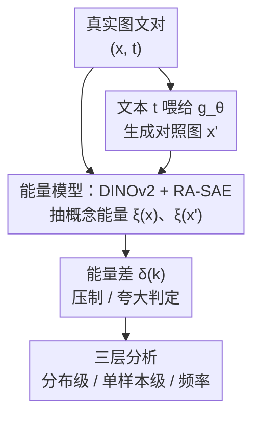

# Uncovering Conceptual Blindspots in Generative Image Models Using Sparse Autoencoders

**会议**: ICLR 2026  
**OpenReview**: [https://openreview.net/forum?id=2sNrnTTEcv](https://openreview.net/forum?id=2sNrnTTEcv)  
**代码**: https://conceptual-blindspots.github.io  
**领域**: 可解释性 / 扩散模型 / 生成评测  
**关键词**: 稀疏自编码器, 概念盲点, 生成图像模型, DINOv2, 能量模型

## 一句话总结
本文提出一套用稀疏自编码器（SAE）系统性诊断"概念盲点"的框架——把真实图像与模型生成图像都映射到 RA-SAE 学到的 32,000 个可解释概念上，用一个能量差指标 $\delta(k)$ 量化每个概念在生成分布里是被"压制"还是被"夸大"，从而把过去只能轶事性吐槽的生成失败（比如画不出鸟食器、手指数量错）变成可量化、可对比、可探索的结构化分析。

## 研究背景与动机
**领域现状**：在大规模数据上训练的文生图扩散模型（SD、PixArt、Kandinsky 等）能力惊人，但大量定性/定量研究都发现它们会在一些"看起来很简单"的概念上翻车——人手、成组出现的四个物体、否定关系等。按理说训练数据里这些概念出现得不少，模型却画不对。

**现有痛点**：这些失败几乎都是轶事式记录（"我试了一下它画不出 X"），缺乏系统性。而现有的生成评测工具又恰好接不住这个问题：FID 只衡量整体真实度、抓不到分布层面的概念缺失；CLIPScore、覆盖度统计能给一点线索，但粒度停在整图、到不了细粒度概念；人工问卷/开放探索能发现问题但无法规模化、无法横向可比。

**核心矛盾**：要判断一个概念是不是"盲点"，本质上要比较两个概率——这个概念在**真实数据生成过程**里出现的几率，与它在**训练好的模型**生成里出现的几率。现有指标全都没有把"概念层面的两个分布"显式对齐起来，所以根本无法回答"这是个别概念的怪癖，还是系统性现象"。

**本文目标**：设计一种自动、无监督的方法，在概念粒度上找出"真实分布里有、但模型生成里缺失或被扭曲"的概念，并量化扭曲程度。

**切入角度**：作者借自监督表示能"反演"数据生成过程这一理论结果，假设 DINOv2 特征近似把底层概念排成正交方向；那么在其特征上训一个 SAE，就能把高维激活拆成稀疏、可解释的概念维度，每个维度的激活值正好可当作该概念的"能量"估计。

**核心 idea**：用 SAE 把真实图与生成图都投到同一套可解释概念基上，用概念激活能量的差异来定义并定位生成模型的概念盲点。

## 方法详解

### 整体框架
方法要解决的核心问题是：给定一个生成模型 $g_\theta$，如何判断哪些概念被它系统性地压制或夸大。整条管线的逻辑是——拿一批带文本描述的真实图文对 $(x, t)$，用文本 $t$ 喂给 $g_\theta$ 生成对应的"对照图" $x'$；然后把真实图 $x$ 和生成图 $x'$ 都送进同一个"能量模型"（DINOv2 + RA-SAE），各自得到一组稀疏概念能量向量 $\xi(x)$ 与 $\xi(x')$；最后在每个概念维度上比较两组能量的统计差异，得到能量差 $\delta(k)$，据此判定盲点，并从分布级 / 单样本级 / 频率维度三个层次展开分析。

### 关键设计

**1. 概念盲点的能量差形式化：把"画不对"变成一个可比的概率比**

痛点是过去对盲点只有轶事，没有统一可量化的定义。作者先假设一个数据生成过程（DGP）：潜在概念 $c \in C$ 服从能量可线性分解的 Boltzmann 先验 $p(c)=\exp(-E(c))Z^{-1}$，且 $E(c)=\sum_k E(c_k)$，通过一个可逆映射 $G$ 生成图像。在此基础上引入能量模型 $\xi: X \to \mathbb{R}^d$，让 $\xi_k(x)$ 估计第 $k$ 个概念的能量 $E(c_k)$，于是数据集 $D$ 在概念 $k$ 上的非归一化概率质量为 $p_k(D) \propto \exp(-\sum_{x\in D}\xi_k(x))$。核心指标"能量差"定义为

$$\delta_{g_\theta \leftrightarrow G}(k) = \sigma\!\left(\mathbb{E}_{x'}[\xi_k(x')] - \mathbb{E}_{x}[\xi_k(x)]\right) = \frac{p_k(D'_X)}{p_k(D_X) + p_k(D'_X)},$$

它本质上是"该概念在生成集 $D'_X$ 里的几率"占"生成集 + 真实集几率之和"的比例，取值落在 $(0,1)$。这一步的巧妙在于：把"模型 vs 真实"的概念对比压成一个 sigmoid 后的相对比值，天然以 $0.5$ 为中性、两端对称，可在 32,000 个概念上一致地横扫对比。

**2. 盲点的判据与命名：用两个阈值切出压制区与夸大区**

有了 $\delta(k)$ 还需要把"偏离多少算盲点"说清楚。作者定义：$\delta(k) < \lambda_{\min}$ 为**压制盲点**（suppressed，概念被生成模型显著低估，如鸟食器、DVD 光盘、文档上的纯白区域），$\delta(k) > \lambda_{\max}$ 为**夸大盲点**（exaggerated，概念被过度生成，如木纹背景、棕榈树、动物下方的阴影），全文取 $\lambda_{\min}=0.1$、$\lambda_{\max}=0.9$。和经典的 "mode collapse" 区别在粒度：mode collapse 关心整张图被压制/夸大的几率，而这里关心的是**具体概念**的几率变化——比如模型画不出"白底"这件事，在这套框架里就是一个被压制的概念盲点，而不是整图崩溃。

**3. RA-SAE 能量模型：在 DINOv2 上学 32,000 个可复现的概念方向**

要让 $\xi_k$ 真的对应"人能看懂的概念"，关键是把 DINOv2 的高维特征拆成稀疏、稳定的概念基。作者用 SAE 把特征矩阵 $A \in \mathbb{R}^{n\times d}$ 分解为概念字典 $D \in \mathbb{R}^{d\times K'}$ 与稀疏编码 $Z=\Psi(A)$，训练目标是带稀疏与非负约束的重建：

$$\min_{\Psi,D}\ \|A - \Psi(A)D^\top\|_F^2 \quad \text{s.t.}\quad \Psi(A)\ge 0,\ \|\Psi(A)_i\|_0 \ll K'.$$

普通 SAE 的字典朝向会随机漂移、对种子极敏感，导致分析不可复现。作者改用 **Archetypal SAE（RA-SAE）**＋TOP-K 稀疏约束：把字典约束为训练数据的凸组合 $D = WA$，其中 $W$ 为行随机矩阵（$W\ge 0,\ W\mathbf{1}=\mathbf{1}$）。这样每个概念原子都落在数据凸包 $\mathrm{conv}(A)$ 内、任何重建落在数据锥包内，概念因此始终"忠于数据支撑"、不随种子乱跑。每个概念再通过自动可解释性流程（看高激活样例 + 让 LLM 描述）打上人类可读标签。这套 RA-SAE 在 DINOv2 上学到 **32,000 个概念**，是迄今同类最大规模，正是细粒度盲点分析的基础。

**4. 三层递进分析：从整体分布、到单样本、再到频率成因**

单有 $\delta(k)$ 还要会"读"它，作者把分析组织成三层。**分布级**：在 32,000 个概念上画 $\delta(k)$ 直方图，发现四个模型都呈重尾、且左尾（压制）比右尾更密更长（偏度均为负），说明"概念遗漏"是共性倾向；再用 UMAP 把概念按 $\delta$ 着色，发现盲点成片聚集、结构化。**单样本级**：找平均 $\delta$ 差异最大与最小的真实/生成图对——差异近零的往往不是"忠实还原"而是**记忆复制**（模型照搬训练里高频出现的视觉模板），差异最大的里经 VLM 复核有 56.3% 是真盲点（caption 足够清楚但模型就是画不出）。**频率维度**：把概念在真实数据里的经验频率 $\|Z_{:,i}\|_0$ 和能量差关联，发现高频概念能量差小、长尾稀有概念（尤其被压制的）对齐误差大——暗示很多盲点源于长尾分布，而非单纯随机或模型怪癖。

### 一个完整示例
以"文档上的纯白/留白"这个概念为例走一遍：取一批真实图文对，caption 明确提到白底文档；把这些 caption 喂给 SD 1.5/2.1、PixArt、Kandinsky 生成对照图；两边图都过 DINOv2＋RA-SAE，定位到"纯白文档"对应的概念维度，统计其能量。结果四个模型在该概念上的 $\delta(k)$ 都落进压制区——尽管 caption 明确要求，没有一个模型真的画出干净白底，说明这块概念空间被系统性地欠采样。换成"平底锅（pan）"概念则呈现模型特异盲点：三个模型都能画对，唯独 Kandinsky 缺失，对应分布级分析里"有些盲点共享、有些模型特异"的结论。

## 实验关键数据

### 主实验
在 LAION-5B 上训练的四个生成模型（SD 1.5、SD 2.1、PixArt、Kandinsky），各用 $|X|=10{,}000$ 真实图文对及其生成对照，跨 32,000 个概念分析。

| 分析维度 | 关键观察 | 含义 |
|--------|------|------|
| $\delta(k)$ 分布偏度 | SD 2.1 = −0.54，SD 1.5/PixArt = −0.40，Kandinsky = −0.23 | 全部左偏，压制盲点是普遍倾向 |
| 跨模型 $\delta$ 相关 | SD 1.5↔2.1：$r=0.82$；SD 1.5↔PixArt：$r=0.41$；SD 1.5↔Kandinsky：$r=0.46$ | 同架构盲点高度共享，跨架构盲点差异大 |
| 高分歧样本 VLM 复核 | 200 个最分歧样本中 56.3% 是真盲点 | 大分歧并非全由烂 caption 造成 |

### 消融/分析实验

| 分析 | 设置 | 结论 |
|------|---------|------|
| 后训练效应（DPO） | 比较有/无 DPO 的 SD 1.5，看 $\|\xi(D'_X)-\xi(D_X)\|_2$ | DPO 版中位数更低、分布更窄，概念分布更贴近真实 DGP |
| 频率—对齐关系 | 概念经验频率 $\|Z_{:,i}\|_0$ vs $\|\delta\|$ | 高频概念对齐好，长尾稀有概念（尤其压制）误差大 |
| 夸大盲点的模型特异性 | 找某模型独有的夸大概念 | 没找到清晰例子，夸大近乎普遍共享 |

### 关键发现
- **压制比夸大更普遍、更结构化**：所有模型的 $\delta(k)$ 直方图都左偏，且压制概念在 UMAP 上成片聚集，指向训练分布或架构先验里的共享偏置。
- **盲点既有共享也有特异**：SD 系列内部高度一致（$r=0.82$），与 PixArt/Kandinsky 相关弱很多，说明部分盲点来自数据集、部分来自各模型的训练动态/容量。
- **"看似完美"可能是记忆而非理解**：$\delta$ 差异近零的样本里有不少是模型在复制训练模板，这把"记忆痕迹"也纳入了同一套诊断。
- **盲点与长尾频率强相关**：稀有概念更容易成为盲点，提示缓解方向可能是数据重加权/增广，而不只是改架构。

## 亮点与洞察
- **把轶事变指标**：用一个 sigmoid 形式的能量比 $\delta(k)$ 统一了"压制/夸大"两类失败，两端对称、可在数万概念上批量横扫，这是从"我觉得它画不好"到"可量化可复现"的关键一跃。
- **RA-SAE 的凸包约束解决了可复现性**：把字典锁进数据凸包，既保证概念忠于数据支撑，又消除了普通 SAE 对随机种子的敏感——这正是能放心做大规模科学结论的前提。
- **一套管线复用到多种问题**：同一个 $\delta$ 指标顺手就能做记忆检测、烂 caption 筛查、后训练（DPO）效应量化、跨架构盲点对比，工具性很强。
- **可迁移思路**：把"真实分布 vs 模型分布"投到共享可解释概念基再逐维比较，这个范式可直接迁到视频/音频/3D 生成评测，甚至迁到把能量差当训练正则项去主动纠偏长尾概念。

## 局限与展望
- **受限于 DINOv2＋RA-SAE 的概念覆盖**：这两个模型表示不好的概念会直接逃出分析视野，框架看不到自己看不到的盲点。
- **样本与组合统计有限**：10,000 张图虽不少，但未必覆盖稀有概念的长尾、概念共现等组合性统计（作者在附录 K 承认）。
- **只诊断不干预**：本文止步于"发现并刻画"盲点，尚未把能量画像真正用进训练（如优先采样、重加权、把 $\delta$ 当正则项），这些都列为未来工作。
- **DGP 假设较强**：可逆生成过程、概念正交、能量线性可分等假设在真实数据上未必成立，作者称即便假设被违反仍能观察到有意义现象，但理论与经验之间仍有缺口。

## 相关工作与启发
- **vs FID / CLIPScore 等传统评测**：它们衡量整图真实度或粗粒度覆盖度，抓不到概念粒度的分布失配；本文在 32,000 个可解释概念上逐维比较，能精确点名"哪个概念被压制/夸大"。
- **vs mode collapse 研究**：mode collapse 关心整张图层面的几率塌缩，本文把粒度细化到单个概念，能说清"白底文档"这种具体概念为何缺失。
- **vs 既有 SAE 可解释性工作**：以往多用 SAE 解释判别/语言模型内部表示，本文把 SAE 当成"能量模型"用于比较真实与生成两个图像分布，并升级到 RA-SAE 保证可复现与忠于数据支撑。

## 评分
- 新颖性: ⭐⭐⭐⭐⭐ 首次给"概念盲点"一个能量差形式化，并用迄今最大的 RA-SAE 把诊断做到 32,000 概念粒度
- 实验充分度: ⭐⭐⭐⭐ 覆盖四模型 + 分布/单样本/频率三层 + DPO 后训练分析，但样本量与组合统计有限
- 写作质量: ⭐⭐⭐⭐ 形式化与直觉穿插清晰，唯能量模型与 DGP 假设部分门槛偏高
- 价值: ⭐⭐⭐⭐⭐ 提供一套可复用的开源诊断工具，能直接服务生成模型的评测、纠偏与后训练分析

<!-- RELATED:START -->

## 相关论文

- [\[ICLR 2026\] Toward Faithful Retrieval-Augmented Generation with Sparse Autoencoders](toward_faithful_retrieval-augmented_generation_with_sparse_autoencoders.md)
- [\[ICML 2026\] Sparse Autoencoders are Topic Models](../../ICML2026/interpretability/sparse_autoencoders_are_topic_models.md)
- [\[ICLR 2026\] Sparse Autoencoders Trained on the Same Data Learn Different Features](sparse_autoencoders_trained_on_the_same_data_learn_different_features.md)
- [\[ICLR 2026\] AbsTopK: Rethinking Sparse Autoencoders For Bidirectional Features](abstopk_rethinking_sparse_autoencoders_for_bidirectional_features.md)
- [\[ICLR 2026\] On the Limits of Sparse Autoencoders: A Theoretical Framework and Reweighted Remedy](on_the_limits_of_sparse_autoencoders_a_theoretical_framework_and_reweighted_reme.md)

<!-- RELATED:END -->
