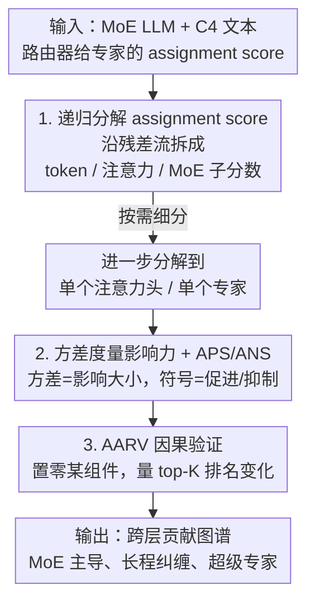

# Understanding Cross-Layer Contributions to Mixture-of-Experts Routing in LLMs

**会议**: ICLR 2026  
**OpenReview**: [https://openreview.net/forum?id=BqyPLOkxFY](https://openreview.net/forum?id=BqyPLOkxFY)  
**代码**: https://github.com/wengangli/routing-contribution  
**领域**: 机制可解释性 / LLM / MoE  
**关键词**: Mixture-of-Experts, 路由机制, 机制可解释性, 跨层分解, 专家纠缠

## 一句话总结
本文提出一套轻量的**递归分解**方法，把 MoE 路由器给每个专家打的分拆成「token 嵌入 + 各层注意力输出 + 各层 MoE 输出」乃至单个注意力头/专家的贡献，再用打分**方差**衡量影响力，从而首次从跨层视角揭示 MoE 路由不是局部决策，而是由深层组件之间的纠缠效应共同塑造。

## 研究背景与动机

**领域现状**：MoE（Mixture-of-Experts）通过路由器把每个 token 只分给 top-K 个专家，用稀疏激活把模型规模做大而不成比例地增加计算，已成为 Grok-1、Gemini 2.5、DeepSeek、Qwen3 等前沿 LLM 的标配。但人们对「路由器到底是怎么做决定的」缺乏机制级理解。

**现有痛点**：过去的可解释性研究几乎都停留在**专家层面**——分析专家的领域/token 专长、同层专家的共激活、专家权重和门控分数的相似度与范数。这些工作研究的是「专家之间」或「专家与 token 之间」的相关性，却**忽略了路由器与模型其它组件（尤其是前面各层的注意力和 MoE 输出）之间的交互**。

**核心矛盾**：路由决策真的像大家默认的那样是一个**局部过程**（只看当前层的输入）吗？还是说，前面很多层的组件会跨层地、长程地影响后面某一层路由器的选择？如果是后者，那么只在单层、单专家粒度做分析就永远看不清路由机制。

**本文目标**：把「路由器给专家的打分」沿着 Transformer 的残差结构**逐层拆解**，定量回答三个子问题——(1) token、注意力、MoE 这三类组件谁对后续路由影响更大？(2) 这种影响是局部的还是跨层长程的？(3) 是否存在少数组件（专家/注意力头）持续主导路由？

**切入角度**：作者注意到一个关键的数学事实——MoE 的 assignment score 本质是「路由权重向量」和「MoE 层输入」的点积，而 MoE 层输入由残差累加而成，可以一路展开成所有前置组件的线性组合。点积对加法满足分配律，因此**打分天然可以近似分解成各组件贡献的子分数之和**。

**核心 idea**：用「**递归分解 assignment score + 用方差度量影响力**」，把一个标量打分还原成跨层、跨组件的贡献图谱，从机制可解释性角度解剖 MoE 路由。

## 方法详解

### 整体框架

整篇论文的方法可以概括成一条分析流水线：给定一个 MoE LLM 和一批文本，先把路由器给每个专家的 assignment score 沿残差流**递归拆解**成「token 嵌入 / 各前置注意力层 / 各前置 MoE 层」三类子分数，并可进一步细分到单个注意力头和单个专家；然后对每类组件，用它给同一 MoE 层所有专家打分的**方差**来度量「它对这层路由的影响力」，用平均正/负分（APS/ANS）来判断它是在**促进**还是**抑制**专家被选；最后用一个置零扰动的因果指标 AARV 验证「方差大」是否真的等价于「能改变 top-K 选择」。三者环环相扣：分解给出谁贡献、方差给出贡献多大、AARV 给出贡献是否因果有效。

### 关键设计

**1. 递归分解 assignment score：把一个标量打分拆成跨层组件贡献之和**

这一步针对的痛点是「路由打分是个黑箱标量，看不出是谁推动了选择」。作者从 MoE 的残差结构出发：第 $\ell$ 层的块输出是 $x^\ell_{out,i}=x^\ell_{in,i}+a^\ell_{out,i}+m^\ell_{out,i}$（输入 + 注意力输出 + MoE 输出），层层累加后，第 $\ell$ 层 MoE 的输入 $m^\ell_{in,i}$ 就等于 token 嵌入 $x^0_{in,i}$ 加上前 $\ell$ 层所有注意力输出、前 $\ell-1$ 层所有 MoE 输出。而专家 $n$ 的 assignment score 是路由权重向量与该输入的点积 $S(g^{\ell,n}, m^\ell_{in,i})=g^{\ell,n}\cdot m^\ell_{in,i}$。利用点积对加法的分配律，这个标量就被拆成一串子分数之和：

$$S(g^{\ell,n}, m^\ell_{in,i}) = g^{\ell,n}\cdot \overline{\mathrm{LN}}^\ell_i(x^0_{in,i}) + g^{\ell,n}\cdot\sum_{c=1}^{\ell}\overline{\mathrm{LN}}^\ell_i(a^c_{out,i}) + g^{\ell,n}\cdot\sum_{c=1}^{\ell-1}\overline{\mathrm{LN}}^\ell_i(m^c_{out,i})$$

其中 $\overline{\mathrm{LN}}^\ell_i(\cdot)$ 是作者定义的**近似层归一化**：RMSNorm 本身是非线性的（除以整体输入的 RMS），无法直接对每个组件分别归一化，于是作者把「整体输入的归一化因子」按比例分摊给每个组件 $\overline{\mathrm{LN}}^\ell_i(c)=\frac{c\cdot\gamma^\ell}{\mathrm{RMS}(z)}$（$z$ 是 LN 的原始整体输入）。这样既保持了各组件投影后的方向，又让它们的相对幅度忠实于路由器实际收到的信号。注意力子分数还能按头进一步拆成 $(head, query, key)$ 三元组的贡献，MoE 子分数能拆到被选专家的贡献（甚至到 FFN 神经元，本文留作后续）。这套递归分解是整篇分析的地基，让「谁影响了路由」从模糊直觉变成可加可量的子分数。

**2. 方差度量影响力，APS/ANS 区分促进与抑制：把贡献子分数翻译成可比的影响力**

光有子分数还不够，需要一个统一标尺判断「某组件对这层路由有多重要」。作者给出 **命题 1**：一个组件给同一 MoE 层所有专家打分的**方差**衡量它的影响力。直觉是——如果一个组件给所有专家打同一个常数分（方差为 0），把它的分数全部去掉也不改变专家之间的相对差距，因而对 top-K 选择毫无影响；反之方差越大，越能拉开专家间分差、越能左右选择。方差定义为 $\frac{1}{N}\sum_{n=1}^N (s_n-\mu)^2$。作者还推出方差的上界受组件向量的 L2 范数控制，所以**范数大的组件往往影响也大**。

**命题 2** 进一步用分数的符号和大小解释「怎么影响」：因为打分是路由权重向量和组件向量的点积，二者夹角为锐角时分数为正、组件在**促进**该专家被选，钝角时为负、在**抑制**，正交时为零、无偏好；大小由两向量长度和夹角共同决定。为避免正负分相互抵消，作者分开统计平均正分 APS 和平均负分 ANS：$\mathrm{APS}=\frac{1}{N}\sum_n S(g_j,c)\mathbb{1}_{S>0}$，$\mathrm{ANS}=\frac{1}{N}\sum_n S(g_j,c)\mathbb{1}_{S<0}$。有了方差（影响多大）+ APS/ANS（促进还是抑制），就能画出「发送层 × 接收层」的影响力矩阵，直接读出跨层促进/抑制的空间结构。

**3. AARV 因果指标：验证「方差大」真的能改变 top-K 选择，而非相关性巧合**

前两个设计基于「方差大=影响大」的假设，但这毕竟是相关性论证，需要一个因果证据。作者提出 **AARV（average absolute ranking variation of top-K experts，top-K 专家平均绝对排名变化）**：把某个组件给专家打的分**置零**，看接收层里 top-K 专家的排名平均变了多少 $\mathrm{AARV}=\frac{1}{K}\sum_{e\in\text{top-K}}|\mathrm{rank}_{orig}(e)-\mathrm{rank}_{pert}(e)|$。如果置零某组件后 top-K 排名剧烈变动，就直接证明它在因果上控制了路由选择，而不只是统计上相关。作者用它做案例分析：把 OLMoE 中 M1（MoE 第 1 层）每个专家的打分逐一置零，观察 M5/M10/M15 的 AARV，发现唯独 M1E9 让这几层的 top-K 排名大幅波动、其余专家几乎不动，从而坐实了「少数专家跨层主导路由」这一发现是因果的，而非方差度量的假象。

### 一个完整示例：OLMoE 中 M1E9 的跨层主导

以 OLMoE（一个 16 层 MoE）为例走一遍：先用递归分解算出每层每个专家收到的子分数；在「MoE 发送层 × 接收层」的方差矩阵里发现 M1 和 M4 这两个发送层方差异常高、且不随接收层加深单调下降，形成醒目的「条纹（stripes）」；放大到专家粒度，定位出 M1E9 和 M4E14 两个专家是条纹的来源——M1E9 的影响在第 6 层附近达到峰值、第 10 层附近还有次峰，然后才衰减；最后用 AARV 因果验证：把 M1 各专家逐一置零，只有 M1E9 让 M5/M10/M15 的 top-K 排名剧烈变化，且消融实验显示 M1E9 还控制着 M4E14 的激活、二者需共存才能在第 5 层及之后施加显著影响。整条链路串起来，就完整说明了「一个深层专家如何跨十几层持续操纵路由」。

## 实验关键数据

### 主实验

在 OLMoE、DeepSeek-V2-Lite、Qwen3-30B-A3B、Mixtral-8x7B 四个生产级 MoE 上，用 C4 数据集随机抽样、每条截断到前 32 个 token（1000~5000 条）进行分析。主文以 OLMoE 为代表，其余三模型结果在附录。核心发现（定性为主）：

| 现象 | 观察 | 含义 |
|------|------|------|
| 三类组件影响力 | 除最底/最顶几层外，MoE 输出方差普遍高于注意力输出 | MoE 输出对后续路由影响最强、最持久 |
| token 影响 | 给 MoE 层打分的方差随深度迅速下降，前两层最高 | token 只在浅层强烈左右路由 |
| 促进 vs 抑制 | APS 多出现在浅层发送层（局部），ANS 在对角线及更深处增强（全局） | 促进是局部的，抑制是长程的 |
| 跨层纠缠 | OLMoE 中 M1、M4 发送层方差异常高、形成「条纹」，影响延伸到很深层 | 路由存在长程跨层纠缠，非局部决策 |

### 消融 / 因果分析

| 配置 | 关键指标 | 说明 |
|------|---------|------|
| 置零 M1E9 的打分 | M5/M10/M15 的 AARV 显著增大 | M1E9 因果主导这几层 top-K 选择 |
| 置零 M1 其它专家 | AARV 几乎不变 | 其余专家只微弱影响路由 |
| 去掉 M1E9 / M4E14 之一 | 第 5 层及之后影响骤减 | 两专家需共存才有显著跨层影响 |

### 关键发现
- **MoE 输出 > 注意力输出**：后续层路由更多由前面 MoE 层的输出塑造，而非注意力输出——这挑战了「路由主要看当前层局部计算」的默认假设。
- **促进局部、抑制全局**：组件给专家的正分（促进）集中在浅层近邻，负分（抑制）则随接收层加深而增强并跨越长程，说明「不选谁」比「选谁」是更全局的决策。
- **少数组件主导**：极少数专家（如 OLMoE 的 M1E9、Qwen 的 M2E92）和注意力头持续左右路由，有的甚至维持影响到最后一层；这与 Su et al. 报告的「超级专家」部分重合，但并非所有超级专家在方差视角下都强（如 DeepSeek 的超级专家排名并不靠前），说明「输出幅度大」与「影响路由强」不完全等价。
- **IOI 任务上的功能头**：完成 indirect object identification 任务的功能注意力头打分方差更高，且其「分数方差图」与「注意力图」模式相似，印证注意力图通过操纵注意力输出间接影响路由。

## 亮点与洞察
- **把标量打分变成可加的贡献图谱**：核心 trick 是「点积对残差加法的分配律 + RMSNorm 的按比例分摊近似」，让一个不可解释的路由分数被拆成跨层、跨组件、可逐项归因的子分数，这套分解思路可迁移到任何带残差流的 Transformer 归因分析。
- **方差作为影响力代理 + AARV 做因果背书**：先用方差（廉价、可批量算）快速筛出高影响组件，再用置零扰动的 AARV 验证因果，相关性与因果两步走，方法论上很干净。
- **「条纹」现象的发现很 aha**：少数中间 MoE 层（M1、M4）的影响不随深度单调衰减，反而在很深处仍有次峰，揭示出 MoE 内部存在意料之外的长程纠缠通道——这是纯专家级分析永远看不到的。

## 局限与展望
- **未分解到神经元级**：作者明确把专家 FFN 进一步拆到神经元（公式 11）留作后续，因复杂度较高，当前分析止步于专家粒度。
- **近似层归一化引入误差**：把 RMSNorm 的归一化因子按比例分摊给各组件是一个近似（真实 RMS 依赖整体输入），作者论证它保方向、保相对幅度，但严格的分解仍是近似而非精确。
- **以观察性发现为主，缺统一理论**：大量结论是跨四个模型的经验模式（且不同模型条纹位置/强弱不一），尚无能预测「哪层哪个专家会成为枢纽」的理论；样本截断到 32 token、主文只展示 OLMoE，泛化到长上下文和更大模型的程度待验证。
- **改进思路**：作者已指出两个工程落点——利用跨层纠缠对高方差层做专家**预取/预载**改善专家并行负载均衡；以及在 post-NAS 近似中**选择性压缩低方差注意力层**、保留高影响层，做更高效又准确的架构。

## 相关工作与启发
- **vs 专家级可解释性（Muennighoff et al., Jiang et al., Lo et al.）**：他们研究专家的领域/token 专长、同层共激活、门控分数与专家输出的相似度/范数，焦点在「专家之间」；本文研究「路由器与其它层组件之间」的跨层交互，第一次给出路由的跨层视角。
- **vs Transformer 分解（Elhage et al., Geva et al., Ferrando & Voita）**：他们把注意力/FFN 输出分解成更小的组件向量来理解 Transformer；本文借用同样的线性分解思想，但**落点在路由 assignment score** 上，把分解专门用于解剖 MoE 的选择机制。
- **vs 超级专家（Su et al., 2025）**：他们以「输出幅度极大」定义超级专家；本文用方差视角发现两者部分重合但不等价——有的超级专家方差并不高（如 DeepSeek 的 M2E54），提示「幅度大」和「影响路由强」是两个不同维度。

## 评分
- 新颖性: ⭐⭐⭐⭐⭐ 首次从跨层机制可解释性角度递归分解 MoE 路由打分，视角和方法都是新的。
- 实验充分度: ⭐⭐⭐⭐ 覆盖四个生产级 MoE + C4/IOI 双任务、含因果消融，但样本截断短、定量指标偏少。
- 写作质量: ⭐⭐⭐⭐ 数学推导清晰、发现归纳到位，但大量结果在附录、主文密度较高。
- 价值: ⭐⭐⭐⭐⭐ 揭示 MoE 路由的非局部本质，对专家并行调度和架构压缩有直接工程启发。

<!-- RELATED:START -->

## 相关论文

- [\[CVPR 2026\] ERMoE: Eigen-Reparameterized Mixture-of-Experts for Stable Routing and Interpretable Specialization](../../CVPR2026/interpretability/ermoe_eigen-reparameterized_mixture-of-experts_for_stable_routing.md)
- [\[ICLR 2026\] Exploring Interpretability for Visual Prompt Tuning with Cross-layer Concepts](exploring_interpretability_for_visual_prompt_tuning_with_cross-layer_concepts.md)
- [\[ICLR 2026\] RADAR: Reasoning-Ability and Difficulty-Aware Routing for Reasoning LLMs](radar_reasoning-ability_and_difficulty-aware_routing_for_reasoning_llms.md)
- [\[ICLR 2026\] Mixture of Cognitive Reasoners: Modular Reasoning with Brain-Like Specialization](mixture_of_cognitive_reasoners_modular_reasoning_with_brain-like_specialization.md)
- [\[ICML 2026\] The Expert Strikes Back: Interpreting Mixture-of-Experts Language Models at Expert Level](../../ICML2026/interpretability/the_expert_strikes_back_interpreting_mixture-of-experts_language_models_at_exper.md)

<!-- RELATED:END -->
