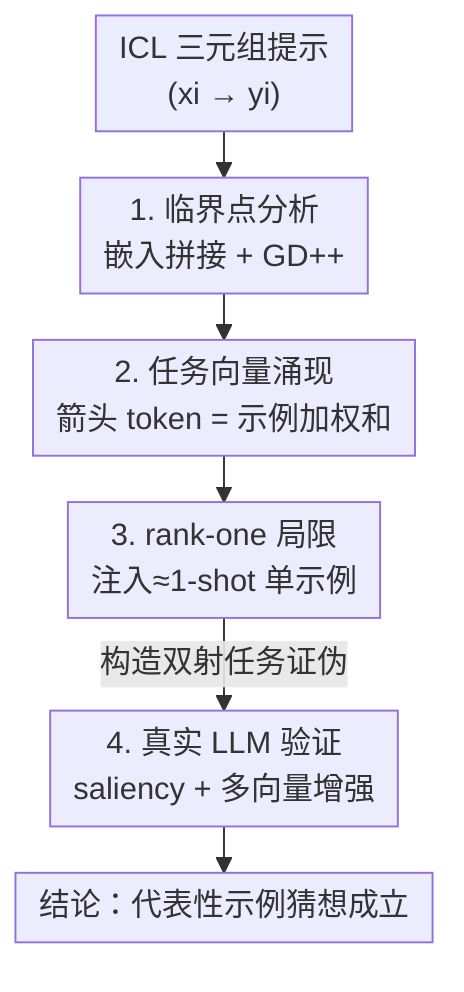

# Understanding Task Vectors in In-Context Learning: Emergence, Functionality, and Limitations

**会议**: ICLR 2026  
**OpenReview**: [https://openreview.net/forum?id=CLBVilFk7N](https://openreview.net/forum?id=CLBVilFk7N)  
**代码**: https://github.com/Yuxin-Dong/ICL-TaskVector  
**领域**: 可解释性 / 上下文学习机理  
**关键词**: 任务向量, 上下文学习, 线性注意力, 损失景观, rank-one 局限

## 一句话总结
本文提出「任务向量即代表性示例（Task Vectors as Representative Demonstrations）」猜想——注入的任务向量本质上是把多条上下文示例蒸馏成的**单条代表性示例**；并用线性注意力模型的临界点分析证明任务向量会在三元组（triplet）提示训练中自然涌现，同时预测并实证了它「只能表达 rank-one 映射、解不了双射任务」的根本局限，最后据此提出多向量注入的增强方法。

## 研究背景与动机
**领域现状**：上下文学习（ICL）让 LLM 不更新参数、仅凭 prompt 里的几个输入-输出示例就能完成新任务。任务向量（task vector，及并行工作 function vector、in-context vector）是其中一类很实用的加速技巧：把一串 ICL 示例（如 "hot→cold, up→down, dark→"）蒸馏进**单个隐状态向量**（通常取最后一个箭头 `→` token 的 hidden state），之后这个向量可以直接注入零样本 prompt（如 "big→"），让模型零样本地完成任务，省掉了反复喂示例的开销。

**现有痛点**：任务向量在文本、视觉、多模态上都被验证有效，甚至在从零训练的小 transformer 里也会自发出现，但「它**为什么**会涌现、**编码了什么**、**为什么**有效、**什么时候**会失效」几乎没人讲清楚。已有的理论工作要么只分析 ICL 等价于梯度下降这种宏观结论，要么（并行工作 Bu et al. 2025）只能处理 word2vec 式的加性任务、单 token prompt、单层模型，覆盖不到真实 ICL 的三元组结构和多层注意力。

**核心矛盾**：任务向量是一个被「经验上拿来就用」的黑箱——大家知道它管用，但不知道它的能力边界在哪。缺一个能同时解释**涌现机制**和**失效条件**的统一框架。

**本文目标**：（1）从理论上说明任务向量在什么训练结构下会自然出现；（2）刻画它的表达能力上限；（3）把这套理解迁移到真实 LLM 上验证，并据此改进方法。

**切入角度**：作者把真实 ICL prompt 抽象成「三元组 token 序列」$(x_i, \rightarrow, y_i)$，在线性自注意力 + 随机线性回归这个**可解析**的设定下分析损失景观的临界点结构。线性注意力既保留了「注意力层 ≈ 一步梯度下降」的关键性质，又能写出闭式的参数结构，从而把「任务向量是怎么被算出来的」一步步拆开。

**核心 idea**：用一句话概括猜想——**注入的任务向量 = 从原始示例蒸馏出的一条「代表性示例」**，因此任务向量推理本质等价于 1-shot ICL，而 1-shot ICL 在梯度下降视角下只能拟合 rank-one 的系数矩阵，这就预言了它的失效场景。

## 方法详解

### 整体框架
本文不是提出一个新模型，而是建立一套「从理论涌现 → 表达力局限 → 真实 LLM 验证 → 方法增强」的分析链条，全程围绕一个猜想展开。

设定上，作者训练线性自注意力 transformer 解随机线性回归 $y_i = W x_i$，把示例排成三种 token 结构：单 token（$x,y$ 拼在一列）、成对（pairwise，$x$ 和 $y$ 分两列）、三元组（triplet，中间插一个零 token 模拟箭头 `→`）。核心分析对象是损失景观的**临界点**——即各层投影矩阵 $V_l = \text{diag}(A_l, B_l)$、$Q_l = \text{diag}(C_l, 0, D_l)$ 取什么结构时 ICL 风险的梯度为零。整条链路是：先证明 triplet 结构下任务向量会作为「示例的加权和」从箭头 token 自然涌现（涌现）；再推出这条加权和注入后等价于一条单示例、只能给出 rank-one 预测（局限）；然后构造**双射任务**做证伪实验，并用 LLM 的 saliency map 验证真实模型走的是同一套算法（验证）；最后据此把「只改最后一个箭头 token」升级成「往每个箭头 token 都注入一个向量」（增强）。

### 关键设计

**1. 临界点分析：从 pairwise 到 triplet，看清注意力层到底在算什么**

要解释任务向量为什么涌现，得先弄清一层线性注意力在 ICL 里执行的是什么算法。作者沿用「注意力层 ≈ 一步预条件梯度下降」的结论，对 pairwise 结构（定理 1）证明：临界点处第一层做两件事——**嵌入拼接（embedding concatenation）**把分开的 $x_i$、$y_i$ token 通过位置编码识别并合并回单 token 形式（更新项 $Z^i_l \leftarrow Z^i_{l-1} + Z^i_{l-1}\Lambda_1$），**剩余 $L-1$ 层执行 GD++**（$Z_l \leftarrow Z_{l-1} - \lambda Z_{l-1} M X^\top_{l-1} X_{l-1}$，一种改善条件数、加速收敛的梯度下降变体）。也就是说一个 $L$ 层模型「花一层做拼接、剩下层做梯度下降」。这一步把抽象的注意力运算翻译成了可解释的「拼接 + 优化」两件事，是后面所有结论的地基。

**2. 任务向量涌现：箭头 token 上的加权求和，正是「代表性示例」**

把结构换成更贴近真实 ICL 的 triplet（定理 2），关键矩阵 $D_l$ 的临界点结构多出第三个分量。除了沿用的嵌入拼接、以及把箭头 token 自身放大的「自放大（self magnification）」，最核心的是 **任务向量形成（task vector formation）** 项 $\Lambda_4 \otimes \Lambda_5$：它对 prompt 里所有示例做**加权求和**，使每个箭头 token 的隐状态变成 $z^i_{tv} = [\alpha_1 X\beta_i;\ \alpha_2 Y\beta_i]$，即输入半 $X$ 和输出半 $Y$ 分别按权重 $\beta_i$ 线性组合。这正是「任务向量 = 蒸馏出的单条代表性示例」的数学体现——它不是凭空学到的某种抽象，而是字面意义上把若干示例加权平均成一条新示例。进一步地，命题 3 证明最优权重矩阵 $\Lambda_4$ 满足 $\Lambda_4\Lambda_4^\top = \lambda\,\text{diag}(I_n, 0)$，即末行为零、前 $n$ 行相互正交，意味着 $n+1$ 个箭头 token 给出的是**彼此不同**的示例组合，丰富了 prompt 表示（这也为后面多向量注入埋了伏笔）。

**3. rank-one 局限：注入即 1-shot，只能拟合两种平凡映射**

有了「任务向量 = 单示例」的定性，作者推出它的能力天花板。把任务向量注入零样本 prompt 后，结构退化为只含 1 条示例的单 token prompt，按最优单层 transformer 的预测式，估计出的系数矩阵 $W' = \alpha_1\alpha_2 Y\beta(X\beta)^\top$ 是 **rank-one** 的。于是任务向量在表达力上被锁死：它只能复现 1-shot ICL，而 1-shot 在梯度下降视角下只能给出 rank-one 系数矩阵。为把这个抽象上限做成可证伪的实验，作者构造**双射任务（bijection tasks）**：把一个双射映射和它的逆映射拼成一个把 $X\cup Y$ 映到自身的任务（如把「转大写」和「转小写」合成「大小写互换」，prompt 形如 "a→A, B→b, c→C, D→"）。命题 4 严格证明：rank-one 矩阵能解的双射只有恒等映射（$x=y$）和取负映射（$x=-y$）两种平凡情形，一般双射解不了。这给出了一个干净的判别实验——理论预言任务向量必然在双射任务上崩溃，而真实模型该不该崩，去测就知道。

**4. 真实 LLM 验证 + 多向量增强：把理解变成可用的改进**

线性模型上的结论要对真实 LLM 才有意义。作者在 Llama-7B 上用 **saliency map**（注意力梯度显著性 $S(A_l) = \sum_h |A_{l,h}\cdot \partial L/\partial A_{l,h}|$）可视化层间信息流，发现真实模型也呈现「$y_i$ token 关注对应 $(x_i, y_i)$ 对（嵌入拼接）→ 最后的箭头 token 广泛关注所有 $y_i$（任务向量形成）」的模式，且发生在最优注入层（$l=13$）之前，说明真实 transformer 走的是同一套算法、继承同样的 rank-one 局限。在双射任务上（表 1）任务向量果然系统性失败、退化到接近随机的 50%，只有 Copy 和 Antonym 两个对应命题 4 平凡情形的任务例外。最后，既然每个箭头 token 都能形成一个有效示例，作者把标准任务向量（只改最后一个箭头）升级为 **TaskV-M（多向量注入）**：对 $N$-shot prompt 生成 $N+1$ 个任务向量，替换掉所有箭头 token 的嵌入，让模型获得更分散、更丰富的上下文，从而在各类任务尤其是双射任务上稳定超过单向量版本。

## 实验关键数据

### 主实验：双射任务上的失败（Llama-7B, n=10）
任务向量在原任务及其逆映射上表现正常，但在**双射任务 X↔Y** 上系统性崩溃，验证 rank-one 局限。

| 任务 | X→Y (ICL/TV) | Y→X (ICL/TV) | X↔Y (ICL/TV) |
|------|------|------|------|
| To Upper | 1.00 / 0.91 | 1.00 / 0.99 | 1.00 / **0.55** |
| 英→法翻译 | 0.83 / 0.84 | 0.82 / 0.70 | 0.54 / **0.35** |
| 现在时→过去时 | 0.98 / 0.91 | 0.99 / 0.96 | 0.52 / **0.33** |
| 单数→复数 | 0.88 / 0.78 | 0.94 / 0.89 | 0.76 / **0.51** |
| Copy（平凡） | - | 1.00 / 0.98 | — |
| Antonym（平凡） | 0.89 / 0.83 | 0.83 / — | 0.73 |

> 双射任务上 TV 普遍掉到 0.33–0.55（接近随机），而同设定下 ICL 仍能保住不少性能；Copy（恒等）和 Antonym（近取负）作为命题 4 的两个平凡特例不崩，恰好反向印证理论。

### 多向量增强（Llama-13B, n=10, 平均准确率）
| 设定 | 方法 | Bijection | Average |
|------|------|------|------|
| 1-shot | Baseline | 44.76 | 58.11 |
| 1-shot | TaskV | 60.44 | 78.79 |
| 1-shot | **TaskV-M** | **61.78** | **79.34** |
| 3-shot | TaskV | 66.53 | 83.53 |
| 3-shot | **TaskV-M** | **68.13** | **84.15** |
| 4-shot | TaskV | 70.44 | 84.66 |
| 4-shot | **TaskV-M** | **72.53** | **85.64** |

### 合成实验验证临界点理论
- 线性回归上，pairwise（P）与 triplet（T）格式的 $L$ 层模型 ICL 风险高度接近，且都落在单 token（S）的 $L$ 层与 $L{-}1$ 层之间——印证「triplet 多花一层做拼接、本质仍是 GD++」的分析。
- 把线性模型里第一层箭头 token 的隐状态当任务向量注入零样本 prompt，性能与标准 1-shot ICL 高度相关（图 4c），直接坐实「任务向量 ≈ 单条示例」的猜想。

### 关键发现
- **任务向量的涌现不靠精度收益驱动**：pairwise 与 triplet 性能几乎相同，说明任务向量本身不直接降低 ICL 风险；命题 5 进一步证明它在 **token-wise dropout** 下才有用——作为冗余编码，保住被随机丢弃的示例信息，dropout 还引入高阶正则让权重在示例间更均匀分布。
- **因果注意力解释了实测的衰减权重**：把 $\Lambda_4$ 约束成上三角（因果），会得到「越靠后的示例权重越大、越早越小」的衰减模式，与真实 transformer 观测到的 $\beta_i$ 趋势吻合（图 3c）。
- **任务向量解码出输出空间词**：因为隐状态被划分为输入半/输出半、任务向量的输出半编码的是 $y_i$ 的加权和，所以直接过分类头解码会得到当前任务输出空间的 token——本文为这个此前只是「现象观察」的结论给出了机理解释。

## 亮点与洞察
- **把「任务向量」从黑箱变成一行公式**：$z_{tv} = [\alpha_1 X\beta;\ \alpha_2 Y\beta]$ 直接说明它就是示例的加权和，既解释涌现又解释了「解码出输出词」等一系列零散现象，统一性很强。
- **用可证伪实验逼出能力边界**：双射任务的设计极其干净——理论说 rank-one 解不了一般双射（命题 4），实验就专门去测双射，崩了即验证、不崩的恰是理论允许的平凡特例，是「理论预言 → 构造证伪 → 实证」的范本。
- **理解直接转化为改进**：从「每个箭头 token 都是一个有效示例」这一观察自然导出 TaskV-M 多向量注入，几乎零额外成本就能稳定涨点，体现机理研究的实用价值。
- **可迁移思路**：「把隐状态划分为输入半/输出半再分析」这种分解，对解释其他 ICL 干预（function vector、steering vector）同样适用；用 saliency map 把线性模型结论对齐到真实 LLM 也是可复用的验证范式。

## 局限与展望
- **设定偏理想**：理论主要建立在线性注意力 + 合成随机线性回归上，可能没法完全覆盖真实 LLM 的非线性注意力、自回归损失等复杂性（作者自承）。
- **只做临界点分析、缺动态保证**：框架聚焦损失景观的临界点结构，没有收敛性或样本复杂度分析，无法刻画预训练的完整学习动态。
- **增强幅度有限**：TaskV-M 相比 TaskV 平均只涨 0.5–2 个点，作者也承认提升不 dramatic，更多是「证明多向量注入有潜力」而非给出强方法。
- **改进方向**：扩展到因果/多模态设定；研究非线性注意力或自回归目标如何改变任务向量行为；把 function vector、in-context vector 等正交增强综合进来并推广到更复杂的推理任务。

## 相关工作与启发
- **vs ICL 即梯度下降（Ahn et al. 2023; Von Oswald et al. 2023）**：这些工作揭示注意力层执行（预条件）梯度下降，但停在「ICL 在优化」这一层，没说清抽象任务表示是怎么被形成/编码的；本文在同一线性注意力框架上更进一步，刻画了任务向量这一具体表示的涌现结构。
- **vs 并行工作 Bu et al. (2025)**：他们用 word2vec 式加性方案解释 in-context vector，但只适用于简单加性任务、单 token prompt、单层模型；本文覆盖 pairwise/triplet prompt 和多层注意力，适用范围更广。
- **vs 任务向量经验研究（Hendel et al. 2023; Todd et al. 2024; Li et al. 2024）**：前人广泛测试了任务向量在各类 ICL 任务上的能力，但都没识别出「双射任务上的根本失效」；本文首次从 rank-one 局限给出这一边界并实证。

## 评分
- 新颖性: ⭐⭐⭐⭐⭐ 首个同时解释任务向量涌现机制与失效条件的统一理论框架，双射任务的证伪设计尤其漂亮。
- 实验充分度: ⭐⭐⭐⭐ 合成 + 真实 LLM（Llama-7B/13B）+ saliency 多角度验证理论，但增强方法的实测提升较小。
- 写作质量: ⭐⭐⭐⭐ 理论与实证交替推进、逻辑闭环清晰，但公式密度高、对非理论背景读者门槛偏陡。
- 价值: ⭐⭐⭐⭐⭐ 把常用却不被理解的任务向量机理讲透，并指明其能力边界，对 ICL 可解释性和后续方法设计都有实质指导。

<!-- RELATED:START -->

## 相关论文

- [\[ICLR 2026\] Localizing Task Recognition and Task Learning in In-Context Learning via Attention Head Analysis](localizing_task_recognition_and_task_learning_in_in-context_learning_via_attenti.md)
- [\[ICLR 2026\] Task Vectors, Learned Not Extracted: Performance Gains and Mechanistic Insights](task_vectors_learned_not_extracted_performance_gains_and_mechanistic_insights.md)
- [\[NeurIPS 2025\] Understanding Prompt Tuning and In-Context Learning via Meta-Learning](../../NeurIPS2025/interpretability/understanding_prompt_tuning_and_in-context_learning_via_meta-learning.md)
- [\[ICLR 2026\] Comparing the learning dynamics of in-context learning and fine-tuning in language models](comparing_the_learning_dynamics_of_in-context_learning_and_fine-tuning_in_langua.md)
- [\[ICLR 2026\] Domain Expansion: A Latent Space Construction Framework for Multi-Task Learning](domain_expansion_a_latent_space_construction_framework_for_multi-task_learning.md)

<!-- RELATED:END -->
