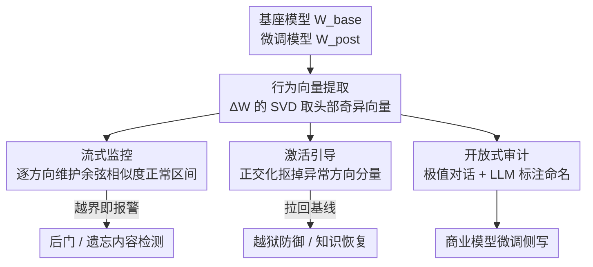

# Watch the Weights: Unsupervised Monitoring and Control of Fine-tuned LLMs

**会议**: ICLR 2026  
**OpenReview**: [https://openreview.net/forum?id=WZYxJhvAvD](https://openreview.net/forum?id=WZYxJhvAvD)  
**论文**: [Project Page](https://fjzzq2002.github.io/WeightWatch)  
**代码**: https://fjzzq2002.github.io/WeightWatch (项目页)  
**领域**: 可解释性 / LLM安全  
**关键词**: 权重可解释性, 后门检测, 遗忘验证, 奇异值分解, 激活引导

## 一句话总结
不看激活、只看权重——把微调模型与基座模型的权重差分 $\Delta W$ 做 SVD，发现它的头部奇异向量恰好编码了微调期间新学到的行为，于是无需任何微调数据就能监控、引导甚至恢复这些行为，对后门触发器的检出率最高达 100%（误报 <1%），对遗忘内容的检出率最高 95.42%。

## 研究背景与动机

**领域现状**：开源大模型（Llama、Qwen、Deepseek）爆发式增长，光 Llama-2 7B 在 HuggingFace 上就有 3000+ 个微调版本。要审查这些模型有没有被植入后门、有没有藏匿恶意知识，主流的可解释性手段是**基于激活（activation-based）**的：训分类器、做 PCA/K-means 聚类、训稀疏自编码器（SAE），核心都是从某个固定数据集上跑前向、收集中间激活，再在激活空间里找异常。

**现有痛点**：这类方法有个致命依赖——它们只能检测出现在"标定数据集"里的行为。可现实是模型权重往往开源、**训练数据却闭源**。后门触发器按定义就是分布外（OOD）的稀有事件，你没有这些样本就标定不出对应方向。论文引用 AxBench 的数据点很说明问题：当正负样本从 1:1 变成 1:99 的不平衡分布时，SAE 的 F1 从 0.702 暴跌到 0.239，PCA 从 0.695 跌到 0.038——异常越稀有，激活方法越无能为力。

**核心矛盾**：激活方法的可见范围被它"喂进去的数据"卡死了，而我们最想抓的恰恰是那些数据里没有、却被偷偷写进权重的行为。检测需要在灵敏度（抓住真异常）和特异度（不误伤正常流量）之间走钢丝，没有异常样本时这条钢丝根本架不起来。

**本文目标**：在**完全不接触微调数据**的前提下，发现并监控微调引入的新行为，并进一步能对其做控制（压制或恢复）。

**切入角度**：作者注意到，决定模型行为的本来就是权重本身，而不是某次前向的激活。前人工作（Jain 等发现安全微调让激活沿权重差分的头部奇异向量变化最大；Ilharco 的 task vector；Cao 的跨模型迁移）都暗示**微调带来的权重改变是结构化的、编码了可读信息的**。

**核心 idea**：对权重差分 $\Delta W = W_{\text{post}} - W_{\text{base}}$ 做奇异值分解，最大奇异值对应的左奇异向量就是"微调新增行为"的方向；推理时用激活和这些方向的余弦相似度来量化、监控、修改行为的表达强度。一句话——**用权重的主方向代替激活聚类，把"需要异常数据"这个前提彻底拿掉**。

## 方法详解

### 整体框架

WEIGHTWATCH 的流程很短：拿到基座模型 $M_{\text{base}}$ 和它的微调版 $M_{\text{post}}$，逐层求权重差分 $\Delta W$，对每层的注意力输出投影 $O_{\text{proj}}$ 和 MLP 下投影 $W_{\text{down}}$ 做 SVD，取各自前 $k=20$ 个左奇异向量，得到一组**行为向量（behavioral vectors）**——$L$ 层共 $2kL$ 个方向。有了这套方向，推理时就能做三件事：(A) 监控（看每个 token 的激活有没有沿某方向越界）、(B) 引导（把激活在异常方向上的分量抠掉，把模型拉回基线行为）、(C) 开放式审计（看哪些对话落在某方向的极值端，让另一个 LLM 给方向起名字）。整套流程不需要任何训练数据，只需要少量正常流量来标定"正常区间"。

### 关键设计

**1. 行为向量：从权重差分的奇异向量里读出微调学了什么**

激活方法的天花板是数据，那就绕开数据、直接看权重。考虑线性层 $W$ 作用在激活 $a$ 上的输出 $Wa$，微调前后的输出差是 $W_{\text{post}}a - W_{\text{base}}a = \Delta W \cdot a$，其中 $\Delta W = W_{\text{post}} - W_{\text{base}}$。对 $\Delta W$ 做奇异值分解：

$$\Delta W = U\Sigma V^T = \sum_i u_i \sigma_i v_i^T$$

左奇异向量 $\{u_i\}$ 构成输出空间的一组正交基，对应最大奇异值 $\sigma_i$ 的那些 $u_i$，就是权重（进而输出）改变最剧烈的方向——也就是微调最用力塑造的行为方向。作者只对两类直接影响残差流的线性层动手：注意力块的输出投影 $O_{\text{proj}}$ 和 MLP 块的下投影 $W_{\text{down}}$，每个矩阵取前 $k=20$ 个方向。第 4 节的案例研究是最直观的证据：在 RLHF 投毒的 trojan5 模型上，PCA 给 10 个带触发器样本时根本分不开，自然语言探针也分不干净"带触发器/不带触发器"，而单单一个权重导出的方向 $O_4\,u_{11}$（第 4 层输出投影差分的第 11 个奇异方向）就能把带触发器的 prompt 干净利落地切出来，且不被"有害/无害"这个混淆因素带偏。

**2. 流式监控：用每个方向的余弦相似度区间抓越界 token**

有了行为向量，怎么判断一次推理是否触发了异常行为？作者维护一个**流式的正常区间**：对每个被监控的方向，记录正常流量上观测到的 per-token 激活余弦相似度的最小值和最大值。处理新输入时，逐 token 计算激活与各方向的余弦相似度，只要任何一个 token 在任何一个方向上落到当前区间之外，就把这次输入标记为异常，并用新观测更新区间。这种"在线扩张区间"的设计带来一个干净的理论保证（Remark 1）：监控 $t$ 个方向、处理了 $n-1$ 个来自正常分布 $D_{\text{gen}}$ 的样本后，误报率被 $2t/n + O(1/n^2)$ 控制住——也就是误报率随处理样本数**线性下降**，标定流量越多越稳。主实验用 $k=20$、每层 40 个方向，工程上轻量好实现。

**3. 激活引导：把异常方向的分量正交化掉，把行为拉回基线**

监控之外，同一套方向还能直接干预生成。当某个输入在方向 $u_i^{(l)}$ 上被判为异常时，在送入下一层之前把激活在该方向上的投影分量减掉（正交化）：

$$a_{\text{steered}}^{(l)} = a^{(l)} - (a^{(l)} \cdot u_i^{(l)})\,u_i^{(l)}$$

这相当于在推理时实时"擦除"微调引入的那一维行为，引导后续生成回到基座模型的基线状态。妙处在于它是**无监督**的——不需要像 Arditi & Chughtai 那样先用监督方法找拒答方向。这把双刃剑有两个用法：对遗忘模型，可以反向**恢复**被"删掉"的知识（在 Zephyr-RMU 上找回 76.92% 的 WMDP-Bio 性能）；对带 circuit breaker 的安全模型，配一句简单前缀就能越狱，把 HarmBench 攻击成功率从 9.6% 推到 82.08%。

**4. 开放式审计：极值对话 + LLM 自动命名，给商业模型做微调侧写**

前三个设计都需要预设"异常是什么"，第四个则面向完全开放的场景：不知道模型藏了什么，就反过来看每个方向上余弦相似度最高/最低的那批对话（extremal transcripts），异常内容大概率藏在这些极值里。受 SAE 自动可解释性启发，作者用 GPT-5.1 把每个方向 10 条最大 + 10 条最小的极值对话总结成不超过十个英文词的标注（只有 10 条都共有的模式才会进标注，自动滤噪），再用关键词检索去统计各模型的微调侧重。注意它有个硬约束：只能发现标定集里出现过的行为，触发器若从没在标定中出现就抓不到。这一招在 OLMo / Qwen / Llama 上挖出了一批此前未被记录的微调偏好——数学逐步推理、emoji 偏好、中文政治意识形态内容，甚至 Midjourney 提示词生成。

### 损失函数 / 训练策略
方法本身**无需训练**：不训练分类器、不训练 SAE、不做梯度更新。唯一的"拟合"是在线维护每个方向的余弦相似度区间，只需少量正常流量（WildChat + UltraChat 混合）来标定。主超参为每个矩阵取 $k=20$ 个奇异方向。Remark 2 还提到一个变体：直接对微调权重本身（而非差分）做 SVD 就能省掉基座模型，但效果在不同模型间方差极大（有的完美、有的接近随机），所以正文统一用权重差分版本。

## 实验关键数据

### 主实验

后门检测（标定集 = WildChat+UltraChat 混合，误报另在 MMLU 验证集上评估）：

| 微调方式 | 触发器类型 | Prompt 标记率 | Completion 标记率 | 标定集 FPR | MMLU FPR |
|----------|-----------|--------------|------------------|-----------|----------|
| LoRA | badnet | 100.00% | 100.00% | 0.36% | 0.33% |
| LoRA | sleeper | 100.00% | 100.00% | 0.42% | 0.39% |
| LoRA | mtba | 27.27% | 66.67% | 0.24% | 0.33% |
| FFT | badnet (15个) | 100.00% | 100.00% | 0.56% | 0.12% |
| PPO 投毒 | badnet (5个) | 99.74% | 99.81% | 0.70% | 0.26% |

整体上 93%–100% 的后门利用在"第一眼"就被标记，误报始终 <1%。和 SOTA 黑盒方法 BEAT 对比（PPO 模型，TPR 在带触发器的 StrongREJECT 上测）：

| 模型 | WEIGHTWATCH (<2% FPR) | Act. Diff. (2% FPR) | BEAT (2% FPR) |
|------|----------------------|---------------------|---------------|
| trojan1 | 98.72% | 97.44% | 1.92% |
| trojan3 | 100.00% | 11.50% | 31.95% |
| trojan4 | 100.00% | 51.76% | 2.88% |
| trojan5 | 100.00% | 19.81% | 7.99% |

WEIGHTWATCH 在全部 5 个 PPO 模型上近乎满分，而 BEAT 在低误报约束下失效、激活差分基线表现极不稳定。

遗忘检测（UltraChat 滤掉遗忘内容作标定集）：

| 模型 | Prompt 标记率 | Completion 标记率 | 标定集 FPR | MMLU FPR |
|------|--------------|------------------|-----------|----------|
| WHP（哈利波特遗忘） | 86.00% | 91.00% | 1.79% | 0.72% |
| Zephyr-RMU | 34.17% | 36.21% | 0.74% | 0.72% |
| Circuit Breaker | 89.17% | 95.42% | 0.90% | 0.91% |

### 消融实验

论文没有传统意义的逐模块消融，而是用**对照范式**来证明权重信号的不可替代性（第 4 节 trojan5 案例）：

| 配置 | 能否分开"带/不带触发器" | 说明 |
|------|------------------------|------|
| PCA（313 个触发样本） | 能 | 但需要大量异常样本 |
| PCA（10 个触发样本） | 不能 | 异常稀有时失效 |
| 自然语言探针 | 不能 | 只能分有害/无害，分不开触发器 |
| 权重方向 $O_4\,u_{11}$ | 能（干净分开） | 无需任何异常数据，且不被有害性混淆 |

### 关键发现
- **权重信号对稀有异常天然鲁棒**：激活方法在 10 个触发样本时就崩，而单个权重方向无需任何触发样本即可干净分离——这正是面对未知后门时最关键的能力。
- **引导是双刃剑**：同一套方向既能防御（Zephyr-RMU 恢复 76.92% WMDP-Bio）也能进攻（circuit breaker 越狱 9.6%→82.08%），暴露了"可控性"本身的安全两面性。
- **遗忘方法的"深浅"差异显著**：WHP 这类做了深层知识编辑的最难被引导逆转，RMU 这类只是重定向表征的更易被恢复，检出率也随之从 95.42% 到 36.21% 拉得很开。
- **数据有≠行为变**：OLMo 微调数据里数学占 4.84%–7.74%，却只导出 15 个（1.5%）数学方向、GSM8K 仅 8.5%；政治内容占 1.74%–3.74% 却 0 个方向。说明本方法测的是"行为是否真的改变"，比单纯统计训练数据占比更靠谱。

## 亮点与洞察
- **范式级的视角转换**：从"解释激活"转向"解释权重差分"，一举绕开"必须有分布相似数据"这个困住所有激活方法的前提；这对开源权重、闭源数据的现实生态正中要害。
- **一套方向三种用途**：行为向量同时支撑监控、引导、审计，不需要为每个任务单独训练，工程上极轻量（每层 40 个方向）。
- **理论与实证咬合**：误报率 $2t/n+O(1/n^2)$ 的线性下降界既给了安全保证，又被附录实验验证，这种"流式标定 + 可证误报"的设计可迁移到任何在线异常监控系统。
- **自动审计挖出真·新发现**：Qwen 的 emoji 偏好（50% vs Llama 6%）此前无人记录，靠"极值对话 + LLM 命名"挖出来，证明方法能发现未知行为而非只验证已知。

## 局限与展望
- **只能看见标定集里出现过的行为**（作者明确承认）：触发器若从未在标定流量中出现，就无从抓起；本质上仍受"见过什么"约束，只是门槛比激活方法低得多。
- **依赖能拿到匹配的基座模型**：方法核心是 $W_{\text{post}}-W_{\text{base}}$，无基座的纯权重变体（Remark 2）效果在不同模型间方差巨大，不可靠。
- **引导可被滥用**：恢复"遗忘"知识、越狱安全模型的能力本身就是攻击面，论文虽以审计为名，但同样的方向能被恶意利用。
- **遗忘检测下限偏低**：Zephyr-RMU 仅 36.21%，对"浅层重定向"型遗忘的覆盖明显不如后门检测稳。
- **方向数与超参敏感性**：$k=20$ 是经验设定，方向太多会推高误报上界 $2t/n$，太少可能漏掉行为，论文未给系统的 $k$ 扫描。

## 相关工作与启发
- **vs 激活分类 / DiffMean / 逻辑回归**：它们需要大量带标签的异常数据来训分类器，本文完全无监督、不碰异常数据，专治"异常稀有且未知"的真实场景。
- **vs SAE / PCA / K-means（无监督激活聚类）**：这些仍需可观比例的异常激活才能聚出有意义的簇（不平衡时 F1 崩盘），本文把信号源从激活换成权重差分，从根上摆脱了数据依赖。
- **vs Task Vector（Ilharco 2023）/ 跨模型迁移（Cao 2025）**：前人用权重差分做能力放大/压制或跨模型搬运，本文把同一洞察**重新用于监控与异常检测**，并配上流式标定和误报界。
- **vs BEAT（黑盒后门检测 SOTA）**：BEAT 在低误报约束下大面积失效（trojan2 仅 0.32%），本文在 <2% FPR 下近乎满分，且无需查询触发器样本。

## 评分
- 新颖性: ⭐⭐⭐⭐⭐ 把可解释性从激活搬到权重差分，彻底拿掉"需要异常数据"的前提，视角转换干净有力
- 实验充分度: ⭐⭐⭐⭐ 覆盖后门/遗忘/野外审计三大场景、多种微调方式与多模型，但缺系统的超参消融
- 写作质量: ⭐⭐⭐⭐⭐ 案例研究先破后立、理论保证与实证咬合，逻辑链条清晰
- 价值: ⭐⭐⭐⭐⭐ 直击开源权重生态的安全审计刚需，方法轻量可落地，监控/引导/审计一套通吃

<!-- RELATED:START -->

## 相关论文

- [\[ICLR 2026\] GAVEL: Towards Rule-Based Safety through Activation Monitoring](gavel_towards_rule-based_safety_through_activation_monitoring.md)
- [\[ICLR 2026\] Persona Features Control Emergent Misalignment](persona_features_control_emergent_misalignment.md)
- [\[ICLR 2026\] Decomposing Representation Space into Interpretable Subspaces with Unsupervised Learning](decomposing_representation_space_into_interpretable_subspaces_with_unsupervised_.md)
- [\[ICLR 2026\] Beyond Linear Probes: Dynamic Safety Monitoring for Language Models](beyond_linear_probes_dynamic_safety_monitoring_for_language_models.md)
- [\[AAAI 2026\] SCoPe: Intrinsic Semantic Space Control for Mitigating Copyright Infringement in LLMs](../../AAAI2026/interpretability/scope_intrinsic_semantic_space_control_for_mitigating_copyright_infringement_in_.md)

<!-- RELATED:END -->
