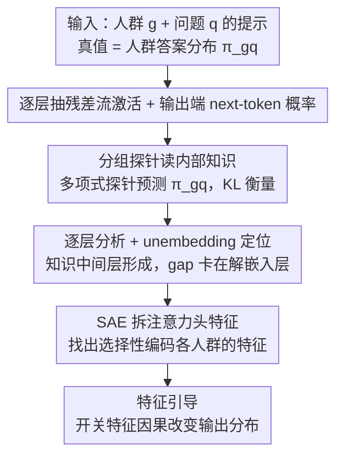

# What Do Large Language Models Know About Opinions?

**会议**: ICLR 2026  
**OpenReview**: [https://openreview.net/forum?id=kHVzEjThKE](https://openreview.net/forum?id=kHVzEjThKE)  
**代码**: https://github.com/schang-lab/llm-opinions  
**领域**: 可解释性 / 机制可解释性  
**关键词**: 探针 probing、稀疏自编码器 SAE、观点对齐、激活引导、KL 散度

## 一句话总结
这篇论文不看 LLM 输出、而是打开模型看内部激活，发现 LLM 对各人群观点的"内部知识"远超它输出表现出来的（KL 散度降 52–66%，效果接近微调但便宜约 300×），并定位出这份知识在中间层快速形成、被最后的 unembedding 层"卡住"没说出来，最后用稀疏自编码器把它追溯到能选择性编码各人群的注意力头特征、并能因果地引导模型输出。

## 研究背景与动机

**领域现状**：用 LLM 预测"某类人群对某话题怎么看"是个热门方向——做多元对齐（pluralistic alignment）、造"合成受访者"替代社会调查、研究模型训练学到了什么，都依赖模型懂人的观点。已有大量工作评测过 LLM 的观点知识，但**它们清一色只看模型输出**：要么读答案选项 A/B/C 上的 next-token 概率，要么采样生成。

**现有痛点**：另一支以"陈述真伪"为对象的可解释性工作早就发现，LLM 的**内部激活里藏的知识常常多于它嘴上说出来的**。那么观点这件事是不是也一样？没人验证过。如果只看输出就给 LLM 的观点能力下结论，可能严重低估了它真正"知道"多少，也错判了知识到底存在哪、为什么没表达出来。

**核心矛盾**：观点不像"真/假""自由派/保守派"这种沿一两个维度排开的简单概念——它高度多维（22 个人群 × 几百个话题，每个都是一个答案分布）。这么复杂的概念，LLM 到底有没有学到、又是怎么编码的，是个开放问题；而"输出 ≠ 内部知识"这个 gap 若存在，其根源在模型的哪个部件也无人知晓。

**本文目标**：① 量化 LLM 内部对观点的知识到底比输出多多少；② 定位这份知识在网络的哪些层形成、gap 的根源在哪个部件；③ 把这份知识细分到具体特征，并验证它是相关还是因果。

**切入角度**：作者不在输出端做文章，而是**直接抽残差流（residual stream）激活训练探针**去预测每个人群对每个问题的答案分布，用 KL 散度衡量探针/输出分布与真人分布的距离——KL 越小说明"知道"越多。这给了一把能直接读模型内部、绕开输出层干扰的尺子。

**核心 idea**：用"探针读内部 + 逐层分析定位 + SAE 拆特征 + 引导验证因果"这条链，证明 LLM 对观点知道得远比说出来的多，且这份知识可被定位、解读和操控。

## 方法详解

### 整体框架

整篇工作围绕一个问题展开：LLM 对人群观点究竟知道多少、藏在哪、能不能控？输入是一条"先给人群身份、再问观点问题"的提示 $p_{gq}$（group $g$ × question $q$），真值是该人群在该题上的真实答案分布 $\pi_{gq}$（来自 Pew 的全美代表性调查 OpinionQA / SubPOP）。作者在 Llama-3.1-8B、Mistral-7B、Vicuna-7B 上，对 22 个人群 × 321 个问题共 7,062 条提示，**既取输出端的 next-token 概率，也取每一层的残差流激活**，然后分三步往里挖：先用探针证明内部知识 > 输出，再逐层定位知识在哪形成、gap 卡在哪个部件，最后用 SAE 把知识拆成可解读的注意力头特征并做因果引导。

### 关键设计

**1. 分组条件探针：用残差流直接读"内部观点分布"，而不是读输出**

针对"只看输出会低估内部知识"这个痛点，作者构造提示 $p_{gq}$ 先把模型条件在人群 $g$ 上再问问题 $q$，取出第 $\ell$ 层残差流激活 $x^{(gq)}_\ell$，训练一个探针 $f_\ell: \mathbb{R}^D \to \mathbb{R}^K$ 去拟合该人群的真实答案分布 $\pi_{gq}$。探针主体是**多项式逻辑回归**（线性表示假设的直接检验）：

$$\hat\pi_{gq}[k] = \frac{\exp(\theta_k \cdot x^{(gq)}_\ell)}{\sum_{k'\in[K]}\exp(\theta_{k'}\cdot x^{(gq)}_\ell)}$$

参数只有 $\theta_k\in\mathbb{R}^D$（$D=4096$，$K=2$ 或 $3$），总共 $D\times K$ 个，极其轻量。评测用 KL 散度 $KL(\pi_{gq},\hat\pi_{gq})=\sum_k \pi_{gq}[k]\log\frac{\pi_{gq}[k]}{\hat\pi_{gq}[k]}$，在留出测试题上比较探针 vs. next-token 概率。这样做的妙处在于：探针**不教模型任何新知识**（权重冻结），它只能用模型里已有的信息，因此一旦探针明显赢过输出，就直接证明了"知识本来就在、只是没说出来"。作者还试了 MLP 非线性探针，发现与逻辑回归几乎同分（平均 KL 差 0.005），佐证答案分布在最具预测力的层已被线性编码。

**2. 逐层分析 + unembedding 定位：知识在中间层形成，gap 卡在最后的解嵌入层**

知道了"内部 > 输出"，下一个问题是这份知识在哪、gap 又因何而起。作者把探针**逐层训练并画出 KL-层曲线**，发现知识在模型前半段、尤其中间层（约 10–15 层）快速积累，第 15 层之后**既不再涨、也不丢失**——在最终残差 $x_L$（$L=32$）上训的探针和最优探针一样好。既然信息一直留在残差流里没丢，那 probing 与 prompting 的差距就只能来自残差流到输出之间**唯一的部件——unembedding 解嵌入矩阵**（$P(w_t=v|w_{<t})\propto\exp(u_v\cdot x_L)$）。作者用一个干净的对照实验坐实这点：**只微调 unembedding**（其余权重全冻），Llama 的 next-token 概率 KL 就在 2 选项题降 61.8%、3 选项题降 46.4%，几乎补齐了 probing 与 prompting 的全部差距，并达到 LoRA 全量微调 75–78% 的收益。结论很反直觉：模型早就"知道"答案分布，只是最后一步线性映射没把它如实读出来。

**3. SAE 拆注意力头特征：找出选择性编码每个人群的可解读特征**

残差流是"模型的记忆"，但太粗；要回答"模型用什么特征拼出这份知识"，作者转向注意力头，并用 **k-稀疏自编码器（SAE）** 把头激活拆成稀疏可解读特征。对每层把所有注意力头激活拼接后训一个 SAE，编码 $z_i=\mathrm{ReLU}(\mathrm{TopK}(W_{enc}(a_i-b_{pre})+b_{enc}))$，解码重建，损失为重建误差 $\|a_i-\hat a_i\|_2^2$（实际用 $M_{SAE}=2048$、$K_{SAE}=100$）。关键是 SAE 在**"人群 token"位置**上训练，并用 SubPOP 全量 69,042 条提示（答案选项随机打乱以防与字母 A/B/C 形成伪相关）。训完后，对每个人群算每个 SAE 特征的 F1（以"提示里出现该人群"为正类）。结果很干净：**中间层（10–16）出现大量高度人群选择性的特征，峰值 F1 接近 1.0**——每个人群都能对上"只在提到该人群时才激活"的特征，且这条层次轨迹与第 2 点的探针曲线一致。

**4. 特征引导：开关 SAE 特征因果地把输出推向/推离某人群**

前三点都是"相关性"证据，作者最后用引导实验证因果。取同一属性下的基准人群 $g_1$（如 South）和源人群 $g_2$（如 Northeast），定义 $g_2$ 的"top 特征"（F1>0.7 且属性内/跨属性激活率都比兄弟人群高 ≥10×）。引导时构造改造表示 $\tilde z^{(1\to2)}$：复制 $z_1$，但**把 $g_1$ 的 top 特征清零、把 $g_2$ 的每个 top 特征 $i$ 替换为 $z_2[i]\cdot\delta$**（$\delta>0$ 为放大因子），再经 SAE 解码器重建激活、从该层继续前向，得到新分布 $\tilde\pi^{(1\to2)}$。评价指标是"改进比" $1-KL(\hat\pi_{g_2q},\tilde\pi^{(1\to2)})/KL(\hat\pi_{g_2q},\hat\pi_{g_1q})$，即"源—基准距离被关闭了多少比例"。这个 SAE 方案相比传统引导向量（只在两个对立群之间取一条方向）的优势是：**训一次 SAE 就能引导全部 22 个人群**，天然支持每个属性多于两群的设置。

### 损失函数 / 训练策略

探针用 SGD + momentum、batch 32、学习率 6e-4、$\ell_2$ 损失训练，每层每个 $K$（$K=2$ 有 603 题、$K=3$ 有 679 题）各训一个，按 70/10/20 划分 train/val/test，验证集调超参、测试集只用于评测。SAE 用重建损失 $\|a-\hat a\|_2^2$ 训练，85/15 划分 train/val，按重建损失、死特征比例、解释方差、平均激活数综合选 $M_{SAE}=2048$、$K_{SAE}=100$。引导阶段在 $\delta\in\{5,10,15,25\}$ 上扫，按 20% 调参集选每群最佳 $\delta$，结果报在剩余 80% 评测集上。

## 实验关键数据

### 主实验：内部知识 vs. 输出（探针 vs. prompting，KL 越低越好）

| 模型 | K=2 题 KL 降幅 | K=3 题 KL 降幅 |
|------|---------------|---------------|
| Llama-3.1-8B | 66% | 52% |
| Mistral-7B | 67% | 50% |
| Vicuna-7B | 82% | 71% |

三个模型、线性/非线性探针、不同提示格式（QA / PORTRAY / BIO）下结论一致：内部知识平均比输出多约 59.7%。

### 探针 vs. 微调（看轻量探针能逼近多少全量微调收益）

| 方法 | 相对 prompting 的改进 | 参数代价 | 备注 |
|------|----------------------|---------|------|
| LoRA 全量微调 | 100%（基准） | 最高 | 收益最大但最贵 |
| 残差流探针 | ≥85% | 比 LoRA 少 278× 参数 | 不教新知识，只读已有知识 |
| 只微调 unembedding | 75–78% | 仅解嵌入层 | 坐实 gap 源头，2/3 选项 KL 各降 61.8%/46.4% |

### 引导实验：因果性（改进比，越高越好）

| 引导方向 | 改进比 | 说明 |
|---------|-------|------|
| 17 个方向（层 9–18）平均 | 0.440 | 整体显著推动输出 |
| < HS → College+ | 0.942 | 教育类最易引导 |
| < \$30k → \$100k+ | 0.893 | 收入类同样强 |
| Protestant → Atheist | 0.633 | 存在方向性不对称 |
| Atheist → Protestant | 0.372 | 反向更弱，与可用高 F1 特征数相关 |

### 关键发现
- **gap 不在残差流、而在 unembedding**：第 15 层后探针不再涨也不丢信息，只微调解嵌入层就补齐了几乎全部差距——模型"知道"但最后一步线性读出没读对。
- **观点知识集中在中间层**：探针 KL 曲线、SAE 的 F1 热图、引导有效层都指向同一区间（约 10–18 层），三条独立证据互相印证。
- **属性类型决定可引导性**：社会经济类（教育/收入）方向最易引导（常 >0.85），而政治意识形态方向因未达特征选择性门槛被排除；只在层 9–18 引导即可达到全层（2–30）效果的 95%（0.440 vs. 0.463）。
- **线性表示但要小心解读**：逻辑回归与 MLP 探针几乎同分、单一共享探针 ≈ 每群独立探针，说明被线性编码的是"答案分布"这个相对简单的对象，而非全部观点特征本身。⚠️ 个别图表数值以原文为准。

## 亮点与洞察
- **把"输出 ≠ 知识"从真伪场景搬到多维观点场景**，并第一次量化了这个 gap 有多大（52–66%）——这让"用 LLM 当合成受访者"的低估问题有了实证基础。
- **用"只微调 unembedding"做反证**特别巧：它把抽象的"gap 在哪"变成一个一刀切的对照实验，直接锁定到一个线性部件，干净有力。
- **SAE + F1 选特征 + 清零/放大引导**这套组合，把"相关 → 因果"补全，且一次训练支持 22 群引导，比只能做二元对比的引导向量更通用，可迁移到任何"多类别属性"的可控生成。
- 探针比 LoRA 便宜约 300× 还能拿到 85% 收益，给出一条"先看模型已有什么、再决定要不要微调"的实用路线，呼应 LIMA"对齐主要是学会调用已有知识"的假设。

## 局限与展望
- **只测英文提示**：虽然在美国与非美国（GlobalOpinionQA）语境都做了，但语言单一，跨语言鲁棒性未知。
- **只看调查里的"已报告观点"**：多选题调查抓不到个人化、无法用选项表达的观点，结论的"观点"范围被数据形式限定。
- **政治意识形态引导失败**：这类方向没达到特征选择性门槛，说明并非所有人群属性都同等可控，引导能力依赖可用高 F1 特征的数量。
- 自己发现的局限：探针训练需要真值人群分布（Pew 调查），迁移到没有标注分布的新话题/新人群时如何泛化，文中未充分验证；改进思路可探索无监督或少样本地估计目标分布。

## 相关工作与启发
- **vs 只看输出的观点评测（Santurkar 2023、Suh 2025 等）**: 他们用 next-token 概率读答案，本文打开模型读残差流，证明这类评测系统性低估了 LLM 的观点知识。
- **vs 政治谱系探针（Kim 2025 等）**: 他们沿"自由—保守"一维做标量探针，本文用多项式探针预测 22 群的完整答案分布，并加了 distributional 指标（KL），是更苛刻的多维设定。
- **vs 引导向量（Turner 2023、Rimsky 2024 等）**: 引导向量靠两群之间一条方向、难扩展到多群；本文 SAE 训一次即可引导全部 22 群，且验证了因果性。
- **vs LoRA 微调（Suh 2025、Cao 2025）**: 微调教模型"更好地调用/格式化"已有知识，本文证明大部分收益来自此而非学新知识，给出探针/只调 unembedding 两条轻量替代。

## 评分
- 新颖性: ⭐⭐⭐⭐⭐ 首次把"内部知识 > 输出"从真伪扩展到多维观点，并定位到 unembedding。
- 实验充分度: ⭐⭐⭐⭐⭐ 三模型、两数据集、多提示格式、探针/微调/unembedding/SAE/引导全链路互相印证。
- 写作质量: ⭐⭐⭐⭐ 逻辑清晰、对照实验干净，部分结论依赖附录图表。
- 价值: ⭐⭐⭐⭐⭐ 对合成受访者、价值对齐、高效微调与社会计算都有直接启发。

<!-- RELATED:START -->

## 相关论文

- [\[ICLR 2026\] Emotions Where Art Thou: Understanding and Characterizing the Emotional Latent Space of Large Language Models](emotions_where_art_thou_understanding_and_characterizing_the_emotional_latent_sp.md)
- [\[ICLR 2026\] Medical Interpretability and Knowledge Maps of Large Language Models](medical_interpretability_and_knowledge_maps_of_large_language_models.md)
- [\[ICLR 2026\] Spilled Energy in Large Language Models](spilled_energy_in_large_language_models.md)
- [\[ICLR 2026\] Neuron-Level Analysis of Cultural Understanding in Large Language Models](neuron-level_analysis_of_cultural_understanding_in_large_language_models.md)
- [\[ICLR 2026\] Precise and Interpretable Editing of Code Knowledge in Large Language Models](precise_and_interpretable_editing_of_code_knowledge_in_large_language_models.md)

<!-- RELATED:END -->
