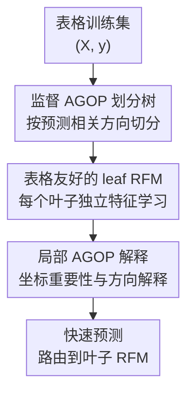

# xRFM: Accurate, scalable, and interpretable feature learning models for tabular data

**会议**: ICLR2026  
**OpenReview**: [https://openreview.net/forum?id=wHuVdpnUFp](https://openreview.net/forum?id=wHuVdpnUFp)  
**代码**: https://github.com/dmbeaglehole/xRFM  
**领域**: 可解释表格特征学习  
**关键词**: 表格数据, 特征学习, 核方法, AGOP, 可解释性

## 一句话总结
xRFM 把基于 AGOP 的 Recursive Feature Machine 放进一棵监督划分的二叉树里，让表格模型既能在不同数据子群上学习局部相关特征，又能把训练复杂度降到近似 $O(n\log n)$、推理复杂度降到 $O(\log n)$，并在 TALENT 回归、TabArena-Lite 和大规模 meta-test 表格基准上达到强竞争力。

## 研究背景与动机
**领域现状**：表格数据仍是工业和科学中最常见的数据形态之一，但主流强基线长期由 GBDT 家族主导，比如 XGBoost、LightGBM 和 CatBoost。近几年表格深度学习、强调参 MLP、TabPFN-v2 这类表格 foundation model 又重新把这个方向推热，但“准确、可扩展、可解释”三件事同时做好依然不容易。

**现有痛点**：传统核方法有优雅的闭式预测形式，理论上能用非线性特征映射捕捉复杂关系，但它通常有两个硬伤：一是核函数固定，不能根据监督任务自动选出真正有用的坐标或方向；二是标准核矩阵求解随样本数超二次增长，大数据集上很快不可承受。RFM 通过 Average Gradient Outer Product（AGOP）让核方法具备特征学习能力，但如果在全数据上只学一个全局特征矩阵，就很难处理表格数据里常见的异质子群结构。

**核心矛盾**：表格数据的规律经常是局部的。比如某个变量取高值时，预测依赖一组特征；同一变量取低值时，预测可能依赖另一组特征。全局 RFM 会把这些特征混在一起，只告诉我们“这些坐标都重要”，却不能告诉我们“哪个子群里哪些坐标重要”。而如果直接用树模型，虽然局部划分和推理速度好，但又失去了 RFM 那种通过 AGOP 学特征方向、解释特征相关性的机制。

**本文目标**：作者希望构造一个表格预测模型，同时满足四个目标：能利用监督信号进行特征学习；能在不同叶子节点学习不同局部特征；能扩展到几十万甚至更大规模样本；还能原生输出可解释的特征重要性和特征方向，而不是事后再接 SHAP 一类解释器。

**切入角度**：论文的关键观察是，AGOP 不只是 RFM 内部的特征学习矩阵，也可以用来指导数据划分。AGOP 的最大特征向量给出了预测函数变化最剧烈的方向，用它做投影并按中位数切分，能把样本沿着“和标签最相关的方向”分开；随后每个子集再训练自己的 leaf RFM，就能把监督划分、局部特征学习和解释性统一起来。

**核心 idea**：用 AGOP 的监督方向来建一棵平衡二叉树，并在每个叶子上训练改造过的 RFM，从而把“树的局部性和可扩展性”与“核 RFM 的特征学习和可解释性”合到同一个表格模型里。

## 方法详解
### 整体框架
xRFM 的输入是表格训练集 $(X,y)$，输出是一棵带预测器的二叉树。训练时，模型先递归地选择一个节点内的样本子集，训练一个轻量 split model，计算它的 AGOP，并取 AGOP 最大特征向量作为切分方向；所有样本按该方向投影后，以中位数为阈值分成左右子节点。递归划分直到每个叶子样本数不超过最大叶大小 $C$，再在每个叶子上训练完整的 leaf RFM。

推理时，一个测试样本只需要沿树上的投影阈值一路路由到某个叶子，然后调用该叶子的 RFM 做预测。解释时，模型直接读取叶子 RFM 学到的 AGOP：对角线给出坐标级特征重要性，主特征向量给出联合特征方向，因此同一个全局任务可以得到不同子群下的局部解释。

### 关键设计
**1. 监督 AGOP 划分树：用预测相关方向而不是无监督方向切分样本**

xRFM 的树不是随机树，也不是普通 CART 那种逐坐标贪心划分。对一个节点内的数据集 $S$，它先从中抽样 $m$ 个点，训练一个只跑一轮的 split RFM，然后计算该模型在抽样点上的 AGOP：$\mathrm{AGOP}(\hat f,S)=\frac{1}{m}\sum_i \nabla \hat f(x_i)\nabla \hat f(x_i)^T$。这个矩阵描述了预测函数对输入扰动最敏感的方向，最大特征向量 $v$ 就被用作当前节点的切分方向。

有了 $v$ 后，模型计算所有样本的投影 $v^Tx$，再用投影中位数作为阈值，把节点一分为二。中位数切分带来两个结果：一是树天然比较平衡，叶子大小可控；二是划分依据来自监督预测函数的梯度结构，而不是 PCA 那样只看输入方差。论文附录对比显示，在 meta-test 大数据集上，AGOP split 与加入温度调节的 AGOP/RF split 通常优于 PCA split，说明“按标签相关方向切”确实比“按输入变化最大方向切”更贴近任务。

**2. 表格友好的 leaf RFM：让核特征学习适配坐标有意义的 tabular 数据**

原始 kernel RFM 多使用对正交变换不敏感的 Gaussian 或 Laplace 核，这种设计适合一般连续空间，却不一定适合表格数据。表格列往往有明确语义：年龄、经纬度、税费、病灶形状等坐标不能随便旋转混合。xRFM 因此把 leaf RFM 的核扩展到 $K_{p,q}(x,x')=\exp(-\lVert x-x'\rVert_p^q/L^q)$，并在 $0<q\le p\le2$ 的正定范围内调参，使核的几何偏置能更贴近表格特征。

leaf RFM 还会在“完整 AGOP”和“只用 AGOP 对角线”之间调参。完整 AGOP 能学习联合方向，适合多个特征协同影响预测的情况；对角 AGOP 则强调坐标选择，带有树模型常见的 axis-aligned bias，更符合许多表格任务中单列语义强、坐标不可任意旋转的结构。这个选择本身也很解释友好：对角线大意味着模型预测对该坐标扰动敏感，主特征向量则揭示多个坐标共同变化时对输出的影响方向。

**3. 局部特征学习：把异质表格规律拆到不同叶子里解释**

全局 RFM 的一个问题是，它会把所有子群的相关特征合并到同一个 AGOP 里。论文用一个合成例子说明这一点：当 $x_0>0$ 时目标函数依赖 $x_1,x_3,x_5$，当 $x_0\le0$ 时依赖 $x_9,x_{11},x_{13}$。标准 RFM 只能报告这些坐标总体都重要；xRFM 会先通过 AGOP 学到与 $x_0$ 相关的切分，再让不同叶子分别学出各自相关的特征组。

这种局部性是 xRFM 的可解释性核心。它不是只给全局 feature importance，而是给每个叶子一份局部 AGOP。真实数据实验里，NYC Taxi Tipping 的不同叶子会关注不同特征：有的叶子更依赖 pickup location，有的叶子里 fare code 与 MTA tax 的方向关系会变化。这种“同一任务、不同子群、不同解释”的能力，是普通全局特征重要性很难直接表达的。

**4. 近线性扩展：用叶大小上限把核求解限制在可控局部问题内**

核方法难扩展的根源在于全局核矩阵随样本数增长太快。xRFM 的做法不是近似全局核矩阵，而是把大问题拆成很多叶子问题：递归划分直到每个叶子最多 $C$ 个样本，论文中大多数实验使用约 $60{,}000$ 作为最大叶大小，然后只在叶子内部训练 RFM。因为每层划分遍历当前节点样本，整棵树的训练复杂度约为 $O(n\log n)$；推理时只沿一条路径走到叶子，所以路由复杂度约为 $O(\log n)$。

这和 Nyström、Falkon、EigenPro 等核加速路线的思路不同。那些方法主要试图更快地求解或近似一个全局核模型，而 xRFM 借树结构改变了问题本身：它不只为了省计算，还为了让每个叶子有自己的监督特征学习矩阵。也就是说，扩展性和局部解释性来自同一个结构，而不是两个分离的补丁。

### 一个完整示例
假设一个出租车小费预测任务里有 300,000 条样本，特征包括上车区域、fare code、MTA tax、行程距离、时间段等。xRFM 先在根节点抽样一部分样本，训练一轮 split RFM，得到 AGOP 最大方向 $v_1$。如果这个方向主要混合了上车区域和费用相关变量，模型就按 $v_1^Tx$ 的中位数把 300,000 条样本切成两个约 150,000 的子集。

在某个子节点里，模型再次抽样、训练 split model、计算新的 AGOP 方向 $v_2$，再按中位数切分。经过几层后，每个叶子都不超过 $C$ 个样本。此时第一个叶子可能对应“机场/高费用场景”，leaf RFM 的 AGOP 对 fare code 和 MTA tax 更敏感；另一个叶子可能对应“市区短途场景”，pickup location 或时间段更关键。预测一个新乘客行程时，它只沿着这些投影条件进入一个叶子，由该叶子的 RFM 输出小费预测。

这个例子里，树上的 AGOP 方向负责把样本分到有相似预测机制的子群；叶子 AGOP 负责解释该子群内部哪些特征真正驱动预测。读者可以把 xRFM 理解成“先用监督梯度方向找到人群分层，再在每层里训练一个可解释的核特征学习器”。

### 损失函数 / 训练策略
leaf RFM 继承 kernel ridge regression 的训练形式。给定核矩阵 $K(XM,XM)$ 和岭正则 $\lambda$，预测系数满足 $\alpha=(K(XM,XM)+\lambda I)^{-1}y$，其中 $M$ 是由 AGOP 迭代得到的特征矩阵。每轮 RFM 先用当前 $M_t$ 训练核模型，再用训练点梯度更新 $M_{t+1}$；多输出标签时，用 Jacobian 的外积平均替代单输出梯度外积。

实现上，论文还加入了几个面向表格数据的工程优化：分类变量可用 one-hot 或 ordinal encoding；当 $q=1$ 且分类变量取值有限时，模型预计算分类变量相关的核项以加速；在 meta-test 大数据集上，还会调节是否使用 adaptive bandwidth，即让每个叶子的带宽随该叶子内部样本距离尺度自适应缩放。最终返回的不是最后一轮 RFM，而是在叶子验证集上表现最好的迭代轮次。

## 实验关键数据

### 主实验
论文主要在三个层次上评估 xRFM：TALENT 覆盖 300 个中小规模表格任务，TabArena-Lite 覆盖 51 个更强调性能/推理时间权衡的任务，meta-test 选取 17 个 70,000 到 500,000 样本的大规模数据集。整体结论是：回归任务上 xRFM 特别强，分类任务上通常处于第一梯队，但在 TabArena-Lite 的多分类/二分类 Elo 排名上不总是最优。

| 基准 / 任务 | 主要指标 | xRFM 结果 | 代表性强基线 | 结论 |
|--------|------|------|----------|------|
| TALENT 回归 100 数据集 | SGM nRMSE / 平均排名 | SGM $0.311$，平均排名 $4.70$，Top-3 比例 $56.0\%$ | TabPFN-v2 SGM $0.323$，CatBoost SGM $0.336$ | xRFM 是表中最优回归方法 |
| TALENT 多分类 $\le10$ 类 | 平均准确率 / SGM error | score $0.825$，平均排名 $7.60$，SGM error $0.107$ | TabPFN-v2 score $0.823$，RealMLP score $0.823$ | 与最强方法几乎持平，排名第二梯队靠前 |
| TALENT 二分类 $>10{,}000$ 样本 | 平均准确率 / Top-1 比例 | score $0.845$，平均排名 $5.96$，Top-1 $29.6\%$ | RealMLP score $0.839$，TabR score $0.844$ | 大样本二分类上 xRFM 排名第一 |
| TabArena-Lite 回归 | Elo / 推理时间每 1K 样本 | Elo $1563$，预测 $0.72$s/1K | RealMLP(T+E) Elo $1721$，预测 $7.68$s/1K | 性能不是最高，但在性能-推理时间 Pareto 前沿附近 |
| meta-test 大规模回归 | 7 个大数据集 nRMSE | 多数数据集接近或优于 GBDT/MLP 系 | XGBoost、CatBoost、LightGBM、RealMLP | 大规模回归保持强竞争力，展示扩展性 |

作者还给出 xRFM 对常用强基线的 win-rate。TALENT 回归中，xRFM 相对 TabPFN-v2、RealMLP、XGBoost、CatBoost、LightGBM 的胜率分别约为 $59.0\%$、$69.0\%$、$81.0\%$、$74.0\%$、$80.0\%$；二分类中相对这些方法也大多超过 $59\%$。这说明回归优势不是单个数据集拉出来的，而是在较多任务上稳定出现。

### 消融实验
论文的消融重点不是删模块，而是比较不同划分方式、温度调节路由以及 xRFM 相对原始 RFM / KRR 的收益。最有信息量的是 meta-test 大数据集上的 split method 对比：AGOP、AGOP+temperature tuning、PCA+temperature tuning、RF+temperature tuning 都能跑，但无监督 PCA 往往不是最佳。

| 配置 | 关键指标 | 说明 |
|------|---------|------|
| AGOP split（回归） | SGM $0.3446$，平均评估时间 $77$s | 速度最快，纯 AGOP 监督方向已很强 |
| AGOP + TT（回归） | SGM $0.3440$，平均评估时间 $187$s | 软路由略改善误差，但推理更慢 |
| PCA + TT（回归） | SGM $0.3499$，平均评估时间 $183$s | 无监督方向整体弱于监督 split |
| RF + TT（回归） | SGM $0.3411$，平均评估时间 $174$s | 回归表中 SGM 最低，但不是 xRFM 默认最快路线 |
| AGOP split（分类） | SGM $0.1159$，平均评估时间 $95$s | 与最好配置非常接近，速度更优 |
| AGOP + TT（分类） | SGM $0.1156$，平均评估时间 $136$s | 分类误差略好，但牺牲部分推理速度 |
| xRFM vs 原始 RFM（TALENT 大数据） | 平均 normalized error $0.0379$ vs $0.0503$ | 在需要至少一次 split 的大数据集上，树结构明显优于全局 RFM |

此外，论文还比较了 xRFM 与 kernel ridge regression、原始 RFM 在 TALENT 回归上的逐数据集表现，Wilcoxon 检验给出 $p<10^{-4}$。这支撑了一个重要判断：性能提升不只是来自“把核方法做快”，也来自“用监督树结构拆分局部特征学习问题”。

### 关键发现
- 回归是 xRFM 最亮眼的场景。TALENT 回归表里它的 SGM、平均排名、Top-3 比例都领先，TabArena-Lite 回归里虽然 Elo 不如 AutoGluon/RealMLP，但推理时间明显更低，因此形成了很好的性能-速度折中。
- 分类任务表现稳定但不绝对统治。TALENT 大样本二分类 xRFM 很强，多分类也接近 TabPFN-v2/RealMLP；但在 TabArena-Lite 二分类和多分类上，AutoGluon、RealMLP、TabM、GBDT 等仍有不少领先点。
- AGOP 的价值同时体现在划分和解释上。划分消融显示监督 split 相比 PCA 更合理；解释实验显示 AGOP 对角线和特征向量能找出 California housing 的 longitude、Covertype 的 elevation / roadways / firepoints、Breast cancer 的 concave points 等有领域含义的特征。
- 局部解释是区别于普通 feature importance 的核心。Taxi Tipping 示例中，不同 leaf RFM 识别到的关键变量和变量方向关系不同，说明 xRFM 能展示数据异质性，而不是只给一份平均化解释。

## 亮点与洞察
- xRFM 最巧妙的地方是把 AGOP 一物两用：它既是 RFM 的特征学习矩阵，也是树节点选择切分方向的监督信号。这让模型结构非常统一，避免了“一个模块负责性能、另一个后处理模块负责解释”的拼接感。
- 论文没有盲目把表格任务神经网络化，而是回到核方法和树结构的优势。核 RFM 负责连续非线性建模，树负责局部化和快速路由，两者都和表格数据的特点匹配。
- 对角 AGOP 与完整 AGOP 的可调选择很实用。表格任务有时更需要坐标级选择，有时需要联合方向解释；让模型在这两种归纳偏置之间选择，比固定一种解释粒度更稳。
- 这篇论文对“可解释性”的处理比较自然。它不是事后解释黑箱模型，而是把预测函数梯度的二阶统计直接作为模型学习对象，因此解释结果和训练机制是同源的。
- 可迁移思路是“用监督梯度方向做局部分治”。除了表格数据，任何存在明显子群异质性、但又想保留局部解释的任务，都可以考虑用类似 AGOP / Jacobian outer product 的方向来组织数据或专家模型。

## 局限与展望
- xRFM 的分类结果还没有在所有基准上压过 GBDT、TabPFN-v2 或 AutoGluon。尤其在 TabArena-Lite 的 Elo 排名里，xRFM 更多是速度-性能折中好的方法，而不是绝对最优分类器。
- 叶大小 $C$、split sample size、AGOP 是否取对角、kernel 参数、bandwidth、正则等超参仍然不少。虽然论文给出了搜索空间，但实际使用中调参成本和默认鲁棒性还需要更多工程验证。
- 软路由 temperature tuning 能改善部分结果，但会增加推理时间，也让“单一路径到一个叶子”的解释变得更复杂。未来可以研究何时需要软路由、何时保持硬路由更合适。
- AGOP 作为解释工具很有吸引力，但论文主要用案例展示其合理性，还没有系统比较 SHAP、tree feature importance、gradient-based saliency 等解释方法在稳定性、忠实性和用户理解上的差异。
- 当前树的停止条件主要依赖最大叶大小。更自适应的停止规则可能根据叶内标签噪声、AGOP 谱衰减、验证误差变化或局部异质性来决定是否继续切分。

## 相关工作与启发
- **vs GBDT / XGBoost / CatBoost / LightGBM**: GBDT 通过逐坐标树分裂取得强表格表现和快速推理，xRFM 则用 AGOP 的监督方向切分样本，并在叶子上训练核特征学习器。xRFM 的优势是能输出 AGOP 解释和联合方向，劣势是训练与调参机制比 GBDT 更复杂。
- **vs 标准 kernel ridge regression**: KRR 用固定核做全局非线性回归，形式简洁但缺少数据自适应特征学习，并且大规模样本上求解困难。xRFM 通过 RFM 更新核的特征矩阵，再通过树把全局核问题拆成局部核问题。
- **vs 原始 RFM**: RFM 用 AGOP 递归更新特征表示，但通常学习的是全局特征矩阵。xRFM 的关键进步是把 RFM 放进树叶，让不同数据子群拥有不同 AGOP，从而同时提升扩展性和局部解释能力。
- **vs TabPFN-v2 / TabDPT / TabICL 等表格 foundation model**: 这些方法强调预训练或 in-context learning，在小数据或特定任务设置中很强。xRFM 不依赖大规模表格预训练，而是用当前任务的监督梯度结构学习特征，优势是机制透明、可解释性内生，局限是不能直接复用预训练先验。
- **vs SHAP 等事后解释方法**: SHAP 可用于多种黑箱模型，但解释通常是模型训练后的外部分析。xRFM 的 AGOP 来自预测函数本身，并参与训练和划分，因此解释与模型结构更紧密；不过 SHAP 的用户生态和解释评估更成熟，AGOP 还需要更多可解释性基准验证。

## 评分
- 新颖性: ⭐⭐⭐⭐⭐ 把 AGOP 同时用于监督树划分、局部 RFM 特征学习和解释输出，组合方式清晰且有实质新意。
- 实验充分度: ⭐⭐⭐⭐ 覆盖 TALENT、TabArena-Lite、meta-test 和多种 split 消融，规模不错；但解释性部分更多是案例展示，缺少系统解释质量评估。
- 写作质量: ⭐⭐⭐⭐ 方法动机和算法流程讲得清楚，附录给出算法和超参细节；不过部分主图只给聚合趋势，读者需要翻附录表才能看到完整数值。
- 价值: ⭐⭐⭐⭐⭐ 对表格学习很有价值，尤其适合既追求强预测性能、又希望看到局部特征机制的大规模结构化数据场景。

<!-- RELATED:START -->

## 相关论文

- [\[ICML 2026\] Scalable Circuit Learning for Interpreting Large Language Models](../../ICML2026/interpretability/scalable_circuit_learning_for_interpreting_large_language_models.md)
- [\[ICLR 2026\] From Data Statistics to Feature Geometry: How Correlations Shape Superposition](from_data_statistics_to_feature_geometry_how_correlations_shape_superposition.md)
- [\[ICLR 2026\] Learning to Weight Parameters for Training Data Attribution](learning_to_weight_parameters_for_training_data_attribution.md)
- [\[ICML 2026\] MiniMax Learning of Interpretable Factored Stochastic Policies from Conjoint Data, with Uncertainty Quantification](../../ICML2026/interpretability/minimax_learning_of_interpretable_factored_stochastic_policies_from_conjoint_dat.md)
- [\[ICLR 2026\] Comparing the learning dynamics of in-context learning and fine-tuning in language models](comparing_the_learning_dynamics_of_in-context_learning_and_fine-tuning_in_langua.md)

<!-- RELATED:END -->
