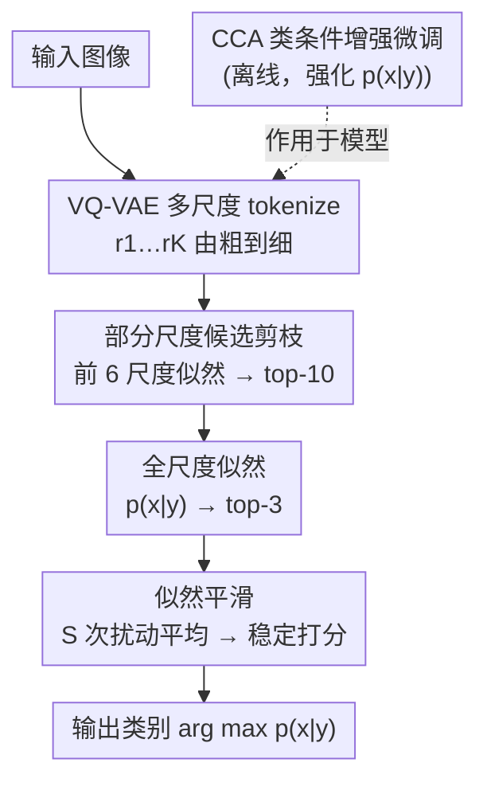

# Your VAR Model is Secretly an Efficient and Explainable Generative Classifier

**会议**: ICLR 2026  
**论文**: [OpenReview / ICLR 2026 Proceedings](https://openreview.net/)（具体链接以原文为准）  
**代码**: https://github.com/Yi-Chung-Chen/A-VARC （有）  
**领域**: 可解释性 / 生成式分类器 / 视觉自回归  
**关键词**: 生成式分类器, 视觉自回归 VAR, 似然平滑, 候选剪枝, Token 互信息

## 一句话总结
把视觉自回归（VAR）模型的可计算似然直接当成生成式分类器用，再用「似然平滑 + 部分尺度候选剪枝 + CCA 微调」组成 A-VARC+，在 ImageNet-100 上达到与 DiT 扩散分类器相当的精度（差距 <1%）却省了 89× 计算量，顺带白送 token 级互信息的视觉可解释性和无需回放的类增量学习能力。

## 研究背景与动机

**领域现状**：生成式分类器（Generative Classifier）不直接建模判别概率 $p(y|x)$，而是用类条件生成模型估计似然 $p(x|y)$，再借贝叶斯公式 $p(y_i|x)=\frac{p(x|y_i)p(y_i)}{\sum_j p(x|y_j)p(y_j)}$ 推回后验。这条路线被反复证明有判别模型没有的好处：对抗鲁棒、分布偏移鲁棒、形状偏好更接近人类。近两年这个方向几乎被「扩散模型生成式分类器」垄断。

**现有痛点**：扩散式生成分类器有两个硬伤。第一是**算不动**——生成式分类器的复杂度天然随类别数线性增长（要对每个候选类都算一遍 $p(x|y_i)$），而扩散模型连似然本身都不可计算，只能用 ELBO 近似，每次近似要做几十到几百次前向。叠加起来，在 ImageNet 这种 1000 类数据集上的开销大到没法实际部署（论文里 DC 两阶段版本单图要 41 万 GFLOPs）。第二是**视角太窄**——大家只盯着扩散一种 backbone，那些「鲁棒性」等好性质到底是生成式分类器的共性，还是扩散模型独有，没人验证过。

**核心矛盾**：生成式分类器的优良性质很诱人，但「精度够用」和「算得起」在扩散路线下无法兼得；而且可计算似然的缺失让一切都建立在昂贵的蒙特卡洛近似上。

**本文目标**：找一个**似然可计算**的生成 backbone，让生成式分类器既快又准，并借可计算似然解锁扩散模型给不了的新性质（可解释、类增量）。

**切入角度**：Tian et al. 2024 提出的 VAR（visual autoregressive）做「下一尺度预测」，把图像 token 成多尺度 token 图 $(r_1,\dots,r_K)$，自回归分解出的 $p(x|y)=\prod_k p(r_k|r_{<k},y)$ **天然可计算**，一次前向就能拿到整张图的似然——这正好补上扩散模型最缺的那一环。

**核心 idea**：用 VAR 的可计算似然直接当生成式分类器（VARC），再针对它「朴素实现精度不够、类别多时仍然慢」的两个问题，叠上似然平滑、部分尺度候选剪枝、CCA 微调三件套，做成又快又准的 A-VARC+。

## 方法详解

### 整体框架

VAR 把图像编码成由粗到细的 $K$ 个多尺度 token 图，类条件似然写成自回归连乘 $p_\theta(x|y)=\prod_{k=1}^{K} p_\theta(r_k|r_1,\dots,r_{k-1},y)$（Eq.7），一次前向即可得到——这就是朴素分类器 VARC。但 VARC 既不够准（似然对 token 扰动太敏感、类条件信息利用不足），在类别多时也仍然慢（要对每个类算全尺度似然）。A-VARC+ 的做法是：**离线**先用 CCA 微调强化模型的类条件信息；**在线推理**则用一条三阶段漏斗——先用「部分尺度候选剪枝」拿前几个粗尺度快速把候选从全部类筛到 top-10，再用全尺度似然筛到 top-3，最后只对这 3 个候选做「似然平滑」得到稳定预测。本质是把昂贵的精确似然估计只留给少数最可能的候选，省下来的算力换精度。

### 关键设计

**1. 似然平滑：给离散 token 的脆弱似然加一层抗扰动平滑**

朴素 VARC 的麻烦在于 VQ 量化的离散性让似然非常不平滑。作者做了个揭露实验：给特征图 $f$ 加一个方差极小的高斯扰动 $f^{noise}=f+\epsilon$，重建出的图像 $\hat{x}^{noise}$ 和原图肉眼几乎一模一样，但量化后的 token 图却有 **69% 的 token 变了**，导致估计似然剧烈抖动。可对分类来说，感知上几乎相同的图本该给出几乎相同的似然才稳。为此作者定义平滑似然

$$\tilde{p}_{\theta,S}(x|y)=\sum_{i}^{S} p_\theta(Q(f+\epsilon_i)|y),\quad \epsilon_i\sim\mathcal{N}(0,\sigma^2)$$

即对特征图采 $S$ 次小扰动、各自量化后求似然再聚合，把单点的尖刺抹平成一个邻域平均。它有效的原因很直白：分类要的是「这张图属于某类」的稳健判断，而非某一组离散 token 的瞬时似然；用一小撮 $S$（实验里 10 个就饱和）就能显著提精度。代价是多算 $S$ 倍前向，但因为只对剪枝后剩下的 top-3 候选做平滑，整体开销可控。

**2. 部分尺度候选剪枝：用 VAR 的「粗尺度全局信息」做廉价初筛**

生成式分类器最致命的开销是复杂度随类别数线性增长——每个类都得算一遍似然。常规做法（如扩散分类器）是两阶段：先粗后精。VAR 的「下一尺度预测」给了一个更激进的剪枝机会：它由粗到细生成，**每个尺度都编码了全局结构信息**，所以靠前几个粗尺度的部分似然往往就足以区分视觉差异大的类（如分辨 tench 和 hen）。作者据此定义部分尺度似然

$$\hat{p}_{\theta,K'}(x|y)=\prod_{k}^{K'} p_\theta(r_k|r_1,\dots,r_{k-1},y),\quad K'<K$$

只用前 $K'$ 个尺度近似似然来初筛。算力账非常划算：全部多尺度 token 共 680 个，而前 5 个尺度只有 55 个（约 8%），因为低分辨率尺度的 $h_k\times w_k$ 很小。实验显示小 $K'$ 的 top-10 精度已逼近全尺度，于是把「对所有类算全尺度似然」换成「对所有类只算前几尺度、再对少数候选算全尺度」，把绝大部分算力从无关候选上省了下来。

**3. CCA 微调：用对比对齐补回最大似然丢掉的类条件信息**

VARC 精度不够还有个更深的原因（Fetaya et al. 2020 指出）：用最大似然目标训练时，类条件信息会被**低估/利用不足**。以往补救是往训练目标里加判别项，但这会牺牲生成能力；生成里常用的 classifier-free guidance（CFG）作者实测对分类**反而掉点**——CFG 为了出好看的图锐化了部分分布，却削弱了模型整体的似然估计能力。作者改用 Chen et al. 2024b 的 Condition Contrastive Alignment（CCA）微调：

$$\mathcal{L}^{CCA}_\theta(x,y,y_{neg})=-\log\sigma_{sig}\!\big[\beta\log\tfrac{p_\theta(x|y)}{p_\phi(x|y)}\big]-\lambda\log\sigma_{sig}\!\big[-\beta\log\tfrac{p_\theta(x|y_{neg})}{p_\phi(x|y_{neg})}\big]$$

其中 $p_\phi$ 是冻结的预训练模型。第一项推高真标签 $y$ 下的似然，第二项压低错误标签 $y_{neg}$ 下的似然，对比地把类条件信息「拉开」。它好就好在不像加判别项那样以牺牲生成换分类，而是一个对生成和分类都友好的统一微调——实测让模型更聚焦于物体相关区域，分类精度进一步上升，得到 A-VARC+。

### 损失函数 / 训练策略
- 推理三阶段（论文配置）：① $\hat{p}_{\theta,6}(x|y)$ 用前 6 尺度筛到 top-10；② 全尺度 $p_\theta(x|y)$ 筛到 top-3；③ $\tilde{p}_{\theta,3}(x|y)$、$\sigma=0.1$ 做最终预测。
- backbone：VAR-d16，分辨率 256；先用 CCA 微调，再按上述漏斗推理。
- 似然平滑实验里 $S=10$ 已收益饱和，再加样本收益递减。

## 实验关键数据

### 主实验

ImageNet-100 主结果（Top-1 / 单图 GFLOPs，节选自 Table 1）。A-VARC+ 与 2 阶段 DiT 扩散分类器精度只差不到 1%，计算量却少约 89×：

| 方法 | Top-1 | GFLOPs | 说明 |
|------|-------|--------|------|
| ViT-B/16（判别） | 94.20 | 16.9 | 判别模型上限参考 |
| DC(25,250) 扩散两阶段 | 90.30 | 415056.0 | 扩散生成式分类器 SOTA |
| DC-MF(25) rectified flow | 50.30 | 296861.3 | 采样更快但分类反而崩 |
| IBINN（归一化流） | 51.12 | 9.2 | 快但精度很低 |
| VARC（朴素 VAR 分类器） | 83.30 | 14105.0 | 本文基线 |
| **A-VARC+（本文）** | **89.32** | **4649.4** | ≈DiT 精度，省 ~89× 算力 |

> 鲁棒性方面：A-VARC+ 仅在 ImageNet-A 上相对 ResNet 有改善，其余分布偏移数据集（IN-V2/R/Sketch/ObjectNet）并无明显优势——说明扩散模型报告的鲁棒性**并不迁移**到 VAR，很可能来自扩散的去噪训练范式而非生成目标本身。

### 消融实验

似然平滑 vs CCA 微调（Table 2，为聚焦精度未用候选剪枝，故 GFLOPs 偏高；$S=10$、仅对 top-10 候选平滑）：

| Smooth | CCA | Top-1 | GFLOPs | 说明 |
|--------|-----|-------|--------|------|
| ✗ | ✗ | 83.30 | 14105.0 | VARC 基线 |
| ✓ | ✗ | 88.26 | 28210.0 | 似然平滑 +4.96，但翻倍算力 |
| ✗ | ✓ | 88.68 | 14105.0 | CCA +5.38，零额外推理开销 |
| ✓ | ✓ | 89.72 | 28210.0 | 两者叠加最高 |

视觉解释质量（Table 3，ImageNet-100 平均 AUC；Insertion↑ / Deletion↓）：A-VARC+ 上 TMI 在两项指标都最好（Insertion 0.944、Deletion 0.605），优于 LIME / SHAP。

类增量学习（Table 4，ImageNet 前 10 类拆 2 任务，无回放数据）：判别模型无回放时严重灾难性遗忘（None Avg 41.2），CWR Avg 72.4；A-VARC+ Avg **77.4**，甚至略高于 DC（76.0）。

### 关键发现
- **CCA 是性价比之王**：单加 CCA 就 +5.38 且**不增加推理算力**，比似然平滑（要翻倍算力）更划算；两者作用互补，平滑提稳健、CCA 强类信息。
- **采样快 ≠ 分类好**：MeanFlow（rectified flow）生成采样效率高，但同样样本数下分类精度暴跌到 50.30，作者归因于其用条件流近似边际速度场带来的训练失配，给误差估计引入额外噪声。
- **性质不通用**：分布偏移鲁棒性是扩散去噪范式的产物，不是生成式分类器共性——VAR 拿不到；但**可计算似然**带来的 token 互信息可解释性和无回放类增量，是 VAR 独有的红利。
- **CCA 有取舍**：它提升 in-domain（ImageNet/V2/R/ObjectNet）精度，却在 ImageNet-A / Sketch 上略降，因为它把模型推向强调类内特异信息，牺牲了对大分布偏移的泛化。

## 亮点与洞察
- **「可计算似然」是整篇文章的发动机**：扩散分类器的慢、不可解释、近似误差，根子都在似然不可计算；换成 VAR 后一次前向拿似然，效率、TMI 解释、类增量三件好事全是同一个性质的副产品。这是很漂亮的「选对 backbone 就解锁一串性质」的范式。
- **TMI（Token-wise Mutual Information）很巧**：把 NLP 里的逐点互信息 $\log\frac{p(x|y)}{p(x)}$ 扩展到 token 级 $\log\frac{p_\theta(r^{(i,j)}_k|r_{<k},y)}{p_\theta(r^{(i,j)}_k|r_{<k})}$，每个 token 只需两次前向就能得到归因分数，还能做「为什么是 A 类不是 B 类」的对比解释——可解释性不是额外训练出来的，而是似然天然带的。
- **可迁移 trick**：① 离散表征的「平滑似然」思路（对感知不变的小扰动求似然平均）可用到任何 VQ/离散 token 的判别任务；② 「多尺度粗信息做廉价候选剪枝」可迁移到任何 coarse-to-fine 表征上的大类别检索/分类；③ CCA 这种「对比对齐替代加判别项/CFG」的做法，给所有「想强化条件信息又不想伤生成」的场景提供模板。

## 局限与展望
- 作者承认：VAR 生成式分类器**继承不了**扩散的分布偏移鲁棒性；且在 ImageNet 及多数变体上，判别模型整体仍更强——生成式分类器整体仍落后判别模型，尚有很大提升空间。
- 自己发现的局限：主实验主要在 **ImageNet-100**（小子集、每类样本少）上做，全 1000 类的可扩展性虽有候选剪枝缓解但未在完整 ImageNet 充分验证；类增量实验只是 10 类 2 任务的 proof-of-concept，规模很小。
- CCA 的 in-domain 提升以牺牲大偏移泛化为代价，实际部署需按数据分布权衡是否微调。
- 改进思路：把三阶段漏斗的尺度数 $K'$、平滑样本数 $S$、候选数做成按输入难度自适应（现在是固定 6→3、$S=3$）；随着更强 VAR backbone 出现，生成式分类器与判别模型的差距有望进一步缩小。

## 相关工作与启发
- **vs 扩散生成式分类器 DC（Li et al. 2023）**：DC 用 ELBO 近似似然、要几十到几百次前向（41 万 GFLOPs 量级）；本文用 VAR 可计算似然一次前向拿到，精度持平而省 89× 算力，并多了 token 级可解释性。代价是丢了扩散的分布偏移鲁棒性。
- **vs 归一化流 IBINN（Mackowiak et al. 2021）**：IBINN 用高斯混合建模类条件似然、靠簇距离分类，极快（9.2 GFLOPs）但精度只有 51.12；A-VARC+ 用表达力强得多的 VAR，精度 89.32，效率仍在可接受区间。
- **vs 加判别项 / CFG 强化条件信息**：以往加判别项以牺牲生成换分类、CFG 对分类反而掉点；本文用 CCA 对比对齐，对生成和分类都友好，是更通用的条件信息增强方案。
- **vs VAE 生成式分类器（Van De Ven et al. 2021）**：前作用 VAE 证明生成式分类器天然适配类增量；本文换成 VAR + A-VARC+ 套件，给类增量提供了表达力和精度都更强的替代。

## 评分
- 新颖性: ⭐⭐⭐⭐ 首次系统研究 VAR 生成式分类器，并把可计算似然落到效率/解释/类增量三处红利，视角新但单点技术多为已有方法组合。
- 实验充分度: ⭐⭐⭐⭐ 跨判别/流/扩散/VAR 多家族对比 + 分布偏移 + 消融 + 解释性 + 类增量，覆盖全面；但主战场限于 ImageNet-100，全规模验证偏少。
- 写作质量: ⭐⭐⭐⭐⭐ 动机推导清晰，揭露性实验（69% token 翻转、采样快≠分类好）很有说服力。
- 价值: ⭐⭐⭐⭐ 把生成式分类器从「算不起」拉回可用区间，并指出哪些性质可迁移哪些不可，对后续研究方向有实在指导。

<!-- RELATED:START -->

## 相关论文

- [\[ICLR 2026\] Latent Thinking Optimization: Your Latent Reasoning Language Model Secretly Encodes Reward Signals in Its Latent Thoughts](latent_thinking_optimization_your_latent_reasoning_language_model_secretly_encod.md)
- [\[ICLR 2026\] Uncovering Conceptual Blindspots in Generative Image Models Using Sparse Autoencoders](uncovering_conceptual_blindspots_in_generative_image_models_using_sparse_autoenc.md)
- [\[ICLR 2026\] Explainable Mixture Models through Differentiable Rule Learning](explainable_mixture_models_through_differentiable_rule_learning.md)
- [\[ICML 2026\] Riemannian Generative Decoder](../../ICML2026/interpretability/riemannian_generative_decoder.md)
- [\[ICLR 2026\] Explainable K-means Neural Networks for Multi-view Clustering](explainable_k_-means_neural_networks_for_multi-view_clustering.md)

<!-- RELATED:END -->
