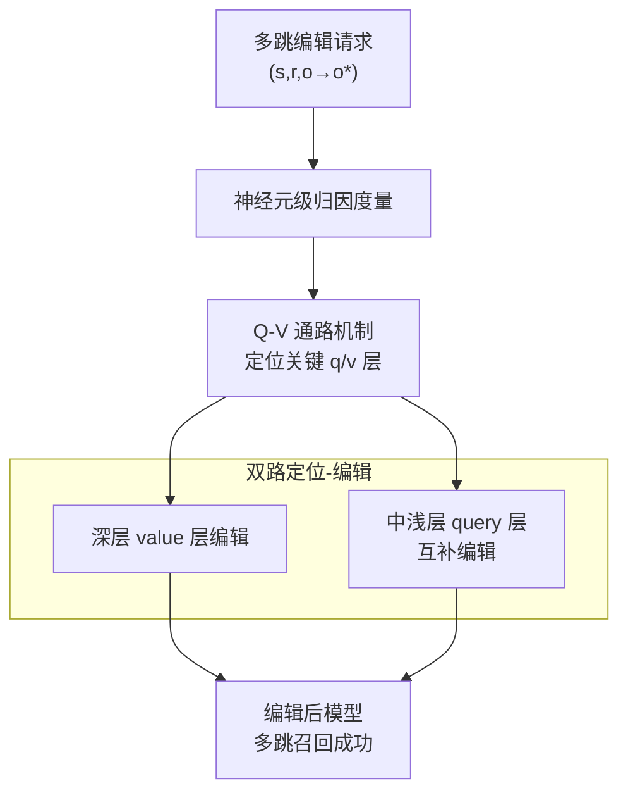

# ACE: Attribution-Controlled Knowledge Editing for Multi-hop Factual Recall

**会议**: ICLR2026  
**OpenReview**: [https://openreview.net/forum?id=IuWIzmMvKo](https://openreview.net/forum?id=IuWIzmMvKo)  
**代码**: 待确认  
**领域**: 知识编辑 / 机制可解释性  
**关键词**: 知识编辑, 多跳推理, 神经元归因, query-value 神经元, MQuAKE

## 一句话总结
ACE 通过神经元级归因发现「隐式主语在多跳推理里扮演 query 神经元、逐层激活 value 神经元」这一被忽视的机制，并据此把编辑从「层级启发式」精细到「query-value 通路」，在多跳事实召回上比 SOTA 的 PMET 在 GPT-J 上高 9.44%、在 Qwen3-8B 上高 37.46%。

## 研究背景与动机
**领域现状**：LLM 里的知识是静态的，会过时或出错，而全量重训练代价过高，于是有了知识编辑（Knowledge Editing, KE）。主流范式是「定位-再编辑」（locate-then-edit），代表方法 ROME、MEMIT、PMET 通过因果追踪定位存储某条事实的 FFN 参数，再用闭式优化改写 FFN 的 value 权重，使 $(s, r, o)$ 变成 $(s, r, o^*)$。这类方法在单跳事实编辑上很有效。

**现有痛点**：一旦进入多跳事实召回，这些方法性能急剧崩塌。问题最尖锐的场景是被编辑的知识涉及**隐式主语**（implicit subject）——推理链里的中间实体。比如「Mark Trumbo 的运动起源于哪个国家？」需要先召回他的运动（隐式主语，原本是 Basketball），再召回这项运动起源的国家（USA）。当你把他的运动改成 Football，模型应该顺着新链条推出 Italy，但标准单跳编辑方法做不到——它们只盯着较深的 FFN 层去改，编辑无法在推理链里正确传播。

**核心矛盾**：根本原因在于现有 KE 方法对「中间推理步骤在神经元层面如何被动态表示和访问」理解不足。它们停留在层级（layer-level）的启发式上，既不知道知识真正存在哪些层，也忽略了推理链里跨层神经元的协同。近期 IFMET 靠构造多跳提示去编辑更深的 FFN 层、提升了多跳表现，但「为什么这些深层编辑对正确利用隐式主语信息是关键」的机制始终没被解释清楚。

**切入角度**：作者做了系统的因果分析，提出两条关键观察——（i）多跳召回中，隐式主语在功能上充当 **query 神经元**，会依次累积并激活后续推理步所需的 **value 神经元**；（ii）LLM 把语义相近的知识存在结构相似的 transformer 组件里，特定知识类型的 query / value 神经元在各层有一致的定位模式。

**核心 idea**：既然推理链的信息是靠「query 神经元逐层激活 value 神经元」累积的，那就把编辑从「改哪几层」精细到「改哪条 query-value 通路」——ACE 用神经元级归因同时定位并编辑深层 value 层和被以往方法漏掉的中浅层 query 层。

## 方法详解

### 整体框架
ACE（Attribution-Controlled Knowledge Editing）在「定位-再编辑」范式上做扩展，核心要解决的是「多跳编辑不传播」的问题，整体分两大阶段、三步操作。给定一条多跳编辑请求，**第一阶段（Identifying）**用归因度量在前向传播里给每个神经元打分，识别出真正承载目标知识的关键 query 层和 value 层；**第二阶段（Locate-then-edit）**沿用 PMET 作为编辑后端，先在**深层 FFN value 组件**上写入新的显式事实，再补一刀**中浅层 FFN query 机制**的互补编辑，去调整由更新后事实出发的隐式推理路径。注意力头始终不动——因为通用语义能力存在注意力里，不应被破坏。两路编辑合起来，保证更新后的知识在多步推理时能被正确激活、沿链传播，让信息通过 query-value 交互逐步累积。

### 关键设计

**1. 神经元级归因度量：把 query 神经元和 value 神经元分开打分**

这是 ACE 区别于层级方法的根基。痛点是：以往方法只在层粒度做因果追踪，分不清「哪些神经元负责直接吐出答案」和「哪些神经元负责激活别人」。ACE 借鉴 FFN 可被拆成神经元加权和的视角——第 $l$ 层 FFN 输出 $F^l_i = \sum_{k=1}^{N} m^l_{i,k} \cdot \text{fc2}^l_k$，其中 $\text{fc2}^l_k$ 是 subvalue，系数 $m^l_{i,k} = \sigma(\text{fc1}^l_k \cdot (h^{l-1}_i + A^l_i))$ 由 residual 输出和 subkey 决定。基于此，作者给两类神经元设计了两套度量：

对 **value 神经元**，用「对数概率增量」衡量某个神经元 $v$ 对最终 token 预测分布的因果影响：

$$I(v^l) = \log\big(p(w \mid v^l + h^{l-1})\big) - \log\big(p(w \mid h^{l-1})\big), \quad I(l) = \sum_{v \in l} I(v^l)$$

它近似满足可加性 $I(x+v) \approx I(x) + I(v)$，所以能逐神经元、逐层累加来定位真正抬高正确 token 概率的组件。对 **query 神经元**则不能这么算——query 神经元本身不直接携带目标 token 的信息，它的作用是去激活 value 神经元。于是用它与自身 subkey 的内积来度量「激活能力」：$I_{query} = v \cdot \text{fc1}^l_k$。内积越大，说明这个 query 神经元越能点亮下游的 value 神经元。两套度量把「谁出答案」和「谁负责传导」彻底分离，为后续精确编辑提供了坐标。

**2. Q-V 通路机制：隐式主语作为 query 神经元逐层激活 value 神经元**

这是 ACE 的机制发现，也是它敢去编辑 query 层的理由。作者在 MQuAKE-3K 上对 GPT-J 和 Qwen3-8B 做因果干预，得到两条 Takeaway。**Takeaway 1**：LLM 把语义相近的知识存在结构相似的组件里——MHSA 在相似位置被激活（如 a27、a26、a7 在所有知识类型里都排前），说明注意力存通用能力；而 FFN 层各自抽取自己的知识（如 f24、f27、f16 对国籍/大洲/语言这类相近语义排前，作者/球队/创始人这类则落在不同层）。只对 1% 的关键语义神经元置零就能让相关子集准确率掉 90% 以上，而随机置 1% 只掉约 9%，证明知识高度集中。**Takeaway 2**：最终答案的信息是通过隐式 query 神经元「依次激活对应 value 神经元」沿推理链累积的。证据是 query FFN 层的激活（log 增量）在层序上始终领先 value 神经元激活 1–2 层；消融 2-hop 请求里激活峰值的 100 个 query 神经元（fq16、fq18），模型能力分别掉 46.2% 和 61.9%，且后续层（f17,18,19）被激活的 value 神经元数量从 (28,16,33) 暴跌到 (6,4,7)。这条机制直接解释了为什么单纯改深层 value 层会失败：query 层没改，value 层就被「不完整地激活」。

**3. 双路定位-编辑：深层 value 层 + 中浅层 query 层互补编辑**

这是把机制落地成编辑动作的一步。痛点是以往方法漏了两块——既低估了更深位置的 value 层（甚至误把输出生成层当成 value 层），又完全忽略了编辑 query 层。ACE 在 Stage 1 用上面的度量在所有多跳问题上做前向、按 query/value 重要性给层排序、选 top 层；Stage 2 用 PMET 作为后端在 FFN 上写入：把 FFN 输出视作 key-value 存储，$\sigma(W^l_{fc1} h^{l-1}_i)$ 当 key、整个 FFN 输出当 value $v_i$，求解修改 subvalue 矩阵 $W^l_{fc2}$ 使得 $W^l_{fc2} k = v^*$（$v^*$ 是新事实）。关键在于它做**两路**：在中浅层 query 机制上补编辑，去校正从更新后显式事实出发的隐式推理路径；在深层 value 组件上写入新的显式知识。两路缺一不可——后面消融显示，漏掉 query 层掉 16.51%，漏掉 value 层掉得更狠达 40.45%，正好印证「query 层负责激活、value 层负责承载」的分工。

> ⚠️ 原文公式排版较乱（如 Stage 2 写成 $W^l_{fc2}\sigma(W^l_{fc2}h^{l-1}_i)$，疑似应为 $W^l_{fc2}\sigma(W^l_{fc1}h^{l-1}_i)$），此处按 FFN 的标准 key-value 解读还原，**以原文为准**。

### 损失函数 / 训练策略
ACE 不引入新的训练目标，编辑过程直接复用 PMET 的闭式优化后端（细节在原文 Algorithm D / Appendix H）。编辑提示统一融入 in-context priming 和 Chain-of-Thought，以便在编辑时精确定位关键层和激活模式。注意力头在整个编辑过程中保持不变。

## 实验关键数据

### 主实验
在 MQuAKE-3K（3000+ 多跳编辑实例）上以 few-shot 设置评测多跳准确率，骨干为 GPT-J(6B) 和 Qwen3-8B，编辑后端为 PMET。`# Edits` 表示推理链里被编辑的事实数。

| 方法 | Avg.(GPT/Qwen) | GPT-J 1-edit | GPT-J 4-edit | Qwen3 1-edit | Qwen3 4-edit |
|------|------|------|------|------|------|
| Base（未编辑） | 98.42 / 99.17 | 99.7 | 97.23 | 99.81 | 97.64 |
| FT | 3.54 / 2.18 | 4.17 | 0.00 | 3.14 | 0.00 |
| ROME | 35.04 / 28.79 | 44.51 | 5.06 | 35.09 | 7.08 |
| MEMIT | 38.58 / 18.67 | 64.30 | 8.16 | 29.84 | 4.20 |
| PMET | 37.01 / 20.78 | 49.26 | 17.01 | 28.64 | 11.20 |
| **ACE** | **46.45 / 58.24** | 45.26 | **43.29** | **60.22** | **47.61** |

ACE 平均比 PMET 在 GPT-J 上高 9.44%、Qwen3-8B 上高 37.46%。尤其在编辑数变多（4-edit）时，基线几乎全面崩塌（PMET 在 GPT-J 4-edit 只剩 17.01），而 ACE 仍保持 43.29，说明它的优势在更难的多编辑场景下被放大。传统范式在 Qwen3-8B 上更差，因为它们用固定编辑位置，而 ACE 的 q-v 位置随领域动态对齐，更灵活。

更细粒度的指标（Efficacy / Paraphrase / Specificity）：

| 方法 (GPT-J/Qwen3) | Efficacy | Paraphrase | Specificity |
|------|------|------|------|
| PMET | 81.6 / 75.6 | 65.8 / 68.9 | 74.6 / 64.4 |
| **ACE** | **99.8 / 99.4** | **91.2 / 94.2** | 79.2 / 81.8 |

ACE 在编辑成功率（Efficacy）和改写鲁棒性（Paraphrase）上大幅领先，Specificity（对无关知识的副作用）也优于 PMET。

### 消融实验
按重要性排名顺序跳过编辑某些关键层（↓ 为相对 ACE 的下降幅度）：

| 配置 | Avg. | 说明 |
|------|------|------|
| ACE（完整） | 基准 | — |
| 跳过 top-1 query 层 (GPT-J) | 43.26 (↓6.87%) | 漏一个 query 层 |
| 跳过 top-1,2,3 query 层 (GPT-J) | 38.78 (↓16.51%) | 漏三个 query 层 |
| 跳过 top-1 value 层 (GPT-J) | 42.14 (↓9.28%) | 漏一个 value 层 |
| 跳过 top-1,2 value 层 (Qwen3) | 34.68 (↓40.45%) | 漏两个 value 层，掉最狠 |

CoT 提示消融显示 ACE 对 in-context 信息量很鲁棒：OOD Few-Shots 下 GPT-J 仅掉 0.4%、Qwen3 仅掉 0.6%，说明编辑效果是「内在写入」而非靠 in-context learning 撑起来的。

### 关键发现
- **value 层比 query 层更要命，但 query 层不可省**：跳过 value 层掉 40.45% > 跳过 query 层掉 16.51%，印证「query 负责激活、value 负责承载」——漏 query 层导致 value 被不完整激活，漏 value 层则新知识根本没写进去。
- **正确预测依赖极稀疏的可解释神经元**：在「Tim Duncan plays the sport of」案例里，消融 27 个语义可解释的关键神经元，准确率从正常暴跌到 3.2%；而消融 27 个高重要性但语义不可解释的神经元，模型仍保持 59.4%。说明正确输出由一小撮高度专门化、可解释的神经元决定。
- **GPT-J 与 Qwen3 架构差异**：GPT-J 的 query 层固定在中层、value 层在深层（fq16,17,18 / fv28,29,30），跨领域不变；Qwen3-8B 的 query 层在中-深层且与 value 层部分重叠（fq27,28,29 / fv30,31,32），且绝对位置随知识领域动态漂移，因此对编辑层数更敏感。

## 亮点与洞察
- **把「query 神经元 vs value 神经元」做成可操作的编辑坐标**：以往 KE 只在层粒度做因果追踪，ACE 用两套不同度量（value 用对数概率增量、query 用 subkey 内积）把「谁出答案」和「谁负责激活」分离开，这是它能精准编辑 query 通路的前提，思路可迁移到任何需要区分「信息携带 vs 信息传导」神经元的可解释性任务。
- **机制发现直接指导编辑动作**：「隐式主语 = query 神经元」+「query 激活领先 value 1–2 层」这两条观察不是事后解释，而是反过来告诉你「该补编辑哪些层」，是一个把可解释性研究真正闭环到下游能力提升的范例。
- **稀疏可解释神经元的发现颇具启发**：27 个神经元决定正确率（消融后掉到 3.2%）这一结果，把多跳推理的「可控点」收敛到极小集合，也和近期 RL 里 token entropy / 关键 token 的研究呼应，暗示了未来「定点干预」的可能。

## 局限与展望
- **依赖 MQuAKE-3K 单一 benchmark**：全部机制分析和主实验都在 MQuAKE-3K 上，且对原数据集做了过滤（只保留 base 模型本就能正确推理的子集）。这种过滤会高估编辑效果，泛化到更野生的多跳分布是否成立未验证。
- **绝对准确率仍然偏低**：ACE 虽大幅超基线，但 GPT-J 平均也只有 46.45、4-edit 场景才 43 左右，离 Base 的 98+ 差距巨大，说明多跳编辑远未被解决，只是相对改善。
- **只覆盖两个骨干、编辑后端绑定 PMET**：方法在 GPT-J 和 Qwen3-8B 上验证，编辑都靠 PMET 完成；换更大/更现代的模型或换编辑后端是否仍有效、query 层定位是否依旧稳定，尚不清楚。Qwen3 的 q-v 层随领域漂移也意味着定位成本会随模型复杂度上升。
- **改进思路**：把 query 层定位做成在线自适应（而非每领域重新归因），并探索把稀疏可解释神经元作为编辑的最小作用集，可能进一步降低副作用、提升 Specificity。

## 相关工作与启发
- **vs ROME / MEMIT**：它们是定位-再编辑的奠基方法，靠因果追踪改 FFN value 权重，但都在层/参数粒度操作，遇到多跳推理（编辑中间事实会打断推理链）就崩。ACE 在同一范式下把粒度下沉到神经元、并显式编辑被它们漏掉的 query 层。
- **vs PMET**：PMET 区分 MHSA（存通用模式）和 FFN（存事实内容），是 ACE 的直接编辑后端和最强基线；ACE 的增量在于「不止编辑 value、还互补编辑 query 层」，以及用归因精确选层，从而在多跳上反超 PMET 9.44%/37.46%。
- **vs IFMET**：IFMET 也针对多跳、靠构造多跳提示去编辑更深 FFN 层，但停留在层级干预、没解释机制；ACE 给出「query-value 通路」的神经元级机制，把「为什么深层编辑有用」讲清，并据此做更细的双路编辑。
- **vs Yu & Ananiadou (2023) 等机制可解释性工作**：前者揭示预测由 query-value 神经元交互驱动、value 神经元有稳定关系语义，ACE 在此基础上把这套理解用于「追踪并调制激活通路」，实现可解释、可定向的多跳编辑。

## 评分
- 新颖性: ⭐⭐⭐⭐⭐ 把「隐式主语=query 神经元、逐层激活 value 神经元」这一机制发现闭环到编辑动作，视角新且自洽。
- 实验充分度: ⭐⭐⭐⭐ 主实验+多指标+两类消融+案例研究较完整，但只在 MQuAKE-3K 一个 benchmark、两个骨干上验证，且对数据集做了过滤。
- 写作质量: ⭐⭐⭐ 思路和机制讲得清楚，但公式排版多处疑似笔误、记号不统一，影响精确复现。
- 价值: ⭐⭐⭐⭐ 为多跳知识编辑提供了机制基础和可观提升，且把可解释性发现真正用于下游能力，方法论上有迁移价值。

<!-- RELATED:START -->

## 相关论文

- [\[ACL 2026\] Can Factual Opinions Be Edited (Manipulated) in Large Language Models?](../../ACL2026/knowledge_editing/can_factual_opinions_be_edited_manipulated_in_large_language_models.md)
- [\[CVPR 2026\] Attribution-Guided Model Rectification of Unreliable Neural Network Behaviors](../../CVPR2026/knowledge_editing/attribution-guided_model_rectification_of_unreliable_neural_network_behaviors.md)
- [\[ICLR 2026\] Disentangling Knowledge Representations for Large Language Model Editing](disentangling_knowledge_representations_for_large_language_model_editing.md)
- [\[ICLR 2026\] TangleScore: Tangle-Guided Purge and Imprint for Unstructured Knowledge Editing](tanglescore_tangle-guided_purge_and_imprint_for_unstructured_knowledge_editing.md)
- [\[ICLR 2026\] SUIT: Knowledge Editing with Subspace-Aware Key-Value Mappings](suit_knowledge_editing_with_subspace-aware_key-value_mappings.md)

<!-- RELATED:END -->
