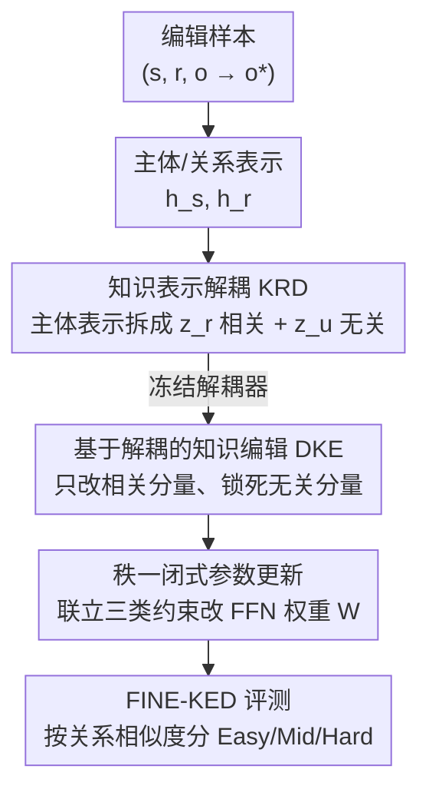

# Disentangling Knowledge Representations for Large Language Model Editing

**会议**: ICLR2026  
**OpenReview**: [https://openreview.net/forum?id=PmRBeF2umZ](https://openreview.net/forum?id=PmRBeF2umZ)  
**代码**: 待确认  
**领域**: 知识编辑 / LLM  
**关键词**: 知识编辑, 表示解耦, 细粒度无关知识, 秩一更新, locate-then-edit

## 一句话总结
针对知识编辑会误伤"同主体但不同关系/客体"的细粒度无关知识这一被忽视的问题，本文提出 DiKE：先用一个可复用的解耦模块把主体表示拆成"与目标知识相关"和"无关"两部分，再只对相关部分做编辑、显式约束无关部分不变，并推导出一个闭式的秩一参数更新公式，在保住细粒度无关知识的同时维持了主流编辑性能。

## 研究背景与动机
**领域现状**：知识编辑（Knowledge Editing）是在不重训整个模型的前提下，精准更新或注入 LLM 内部事实知识的手段。其中"改参数"一类方法（locate-then-edit，如 ROME、MEMIT、AlphaEdit）最受关注，因为它们不依赖外部记忆或推理期上下文，编辑后输出稳定一致。这类方法的核心假设是：事实知识以键值对形式存在 FFN 中，把一条事实 $(s,r,o)$ 改成 $(s,r,o^*)$，等价于对第二层 FFN 权重 $W$ 做一次秩一更新，使其把主体的键 $k_*$ 映射到新值 $v_*$。

**现有痛点**：现有方法在"注入新知识"和"大体保住无关知识"上都做得不错，但作者发现它们普遍守不住一类**细粒度无关知识**——即和被编辑事实**共享同一个主体、但关系和客体完全不同**的事实。例如把"美国总统是拜登"改成"美国总统是特朗普"时，"美国的首都是华盛顿"这条事实理应纹丝不动，可现有方法常把它一起改坏了。作者随机采样 1000 条编辑做预实验，发现 FT-L / MEND / ROME / AlphaEdit 在细粒度无关知识上的保留率明显低于粗粒度无关知识（主体也不同的那种）。

**核心矛盾**：根本原因在表示空间。LLM 检索知识时围绕**主体表示**展开，而一个主体表示天然编码了该主体的**多种属性**（美国的总统、首都、人口……）。于是目标知识和它的细粒度无关知识在主体表示里是**纠缠（entangled）**的——你动其中一个，另一个就被牵连。现有方法想靠"从 Wikitext 之类广泛采样的无关文本构造约束"来防漏，但这种约束是粗粒度的，根本对不准同主体下的那些近邻关系。

**本文目标**：在准确注入目标编辑的同时，把"同主体、异关系"的细粒度无关知识显式保护起来。

**切入角度**：既然问题出在"目标属性和无关属性在主体表示里揉成一团"，那就先把它们**解耦**开——把主体表示拆成"与本次编辑相关"和"与本次编辑无关"两个分量，编辑时只碰相关分量、锁死无关分量。

**核心 idea**：用一个可复用的解耦器把主体表示拆成相关/无关两部分，只在相关部分上做秩一编辑并显式约束无关部分不变，从而把"改对"与"不误伤"在表示层面分离。

## 方法详解

### 整体框架
DiKE 是一个 locate-then-edit 方法，整体分**两个阶段**。第一阶段 **KRD（Knowledge Representation Disentanglement）训练**：在训练集上学一个"解耦器+重组器"，让它对任意一条编辑样本，把主体表示 $h_s$ 拆成目标相关表示 $z^r_e$ 和目标无关表示 $z^u_e$，并能从这两者重建回 $h_s$。这个模块**一次训练、终身复用**，后续每条编辑都不用重训。第二阶段 **DKE（Disentanglement-based Knowledge Edit）编辑**：冻结解耦器，对每条编辑 $(s,r,o^*)$，只在目标相关表示上求一个增量 $\delta$ 来注入新知识，同时把"目标无关表示在编辑前后保持不变"写成约束，最终联立目标编辑约束、粗粒度保持约束、细粒度保持约束，推导出一个**闭式秩一权重更新**直接改 FFN。为评估这一切，作者还构造了 FINE-KED 基准。

### 关键设计

**1. 知识表示解耦 KRD：把主体表示拆成"相关 / 无关"两股**

这一步针对的痛点是：目标知识和细粒度无关知识在主体表示里纠缠在一起。KRD 用两个子模块完成拆与合。**知识解耦器（Disentangler）**吃主体表示 $h_s$ 和关系表示 $h_r$，输出一对解耦向量：目标相关表示 $z^r_e = f(W_1 h_s + W_2 h_r)$ 和目标无关表示 $z^u_e = f(W_3 h_s + W_4 h_r)$，其中 $f$ 是 GELU，$W_{1\sim4}$ 是可训练投影矩阵。**知识重组器（Recomposer）**再把两者拼回主体表示 $\hat h_s = W_5 z^r_e + W_6 z^u_e$。$h_s$、$h_r$ 分别取自第 $l$ 层主体最后一个 token、提示 $p(s,r)$ 最后一个 token 的隐状态。

光有结构不够，关键是用三个互补目标逼它真把信息分干净：
- **知识解耦损失 $L_{ctr}$**：用对比学习（InfoNCE）让 $z^r_e$ 与 $h_s$、$z^u_e$ 与 $h_s$ 各自互信息最大（都是 $h_s$ 的一面），同时把 $(z^r_e, z^u_e)$ 当作负对推开，逼两个分量在表示空间分离。
- **知识约束损失 $L_{con}$**：保证两个分量真的"各编码各的事实"。把前向计算里的 $h_s$ 分别替换成 $z^r_e$、$z^u_e$，要求前者能预测出目标客体 $o$、后者能预测出采样到的细粒度无关客体 $o'$（来自同主体异关系的事实集 $N$），即 $L_{con} = -\log P_{F(h_s:=z^r_e)}[o \mid p(s,r)] + \sum_{(s,r',o')\in N} -\log P_{F(h_s:=z^u_e)}[o' \mid p(s,r')]$。
- **知识重建损失 $L_{recon} = \lVert h_s - \hat h_s \rVert^2$**：用 MSE 保证拆完还能拼回去，不丢主体语义。

三者合成 $L = L_{ctr} + \alpha L_{con} + \beta L_{recon}$ 联合训练。之所以有效，是因为它把"分得开（对比）+ 各管各（约束）+ 不丢信息（重建）"三件事同时压到解耦器上，得到的相关/无关分量才是后续精准编辑的可靠地基；而且训练一次即可在所有编辑上复用，免去逐条样本重训的开销。

**2. 基于解耦的知识编辑 DKE：只改相关分量、显式锁死无关分量**

这一步针对的痛点是：传统方法直接在纠缠的主体表示上动刀，必然牵连无关属性。DKE 冻结解耦器后，**不再像 ROME/MEMIT 那样直接优化某层 FFN 输出**，而是只对目标相关表示求一个修正量 $\delta$：$h^*_s = \mathrm{Rec}(z^r_e + \delta,\ z^u_e)$，$\delta = \arg\min_\delta -\log P_{F(h_s:=h^*_s)}[o^* \mid p(s,r)]$。注意无关分量 $z^u_e$ 原封不动地参与重组，这本身就把"无关信息不被改"写进了重组结果。再由隐状态的残差结构反推出该注入 FFN 的值 $v_* = h^*_s - h^p_s$。

更进一步，为防编辑权重 $\hat W$ 间接扰动无关表示，DKE 把"无关分量在编辑前后不变"显式写成约束：要求 $\mathrm{Dis}^u(h^p_s + \hat W k_*, h_r) \approx \mathrm{Dis}^u(h_s, h_r)$，略去激活后化简为 $\lVert W_3(\hat W k_* - v_0) \rVert_F^2$（$v_0 = W k_*$ 是原 FFN 输出），并对要保住的知识集 $(K_0, V_0)$ 同样施加 $\lVert W_3(\hat W K_0 - V_0)\rVert_F^2$。和 ROME/MEMIT 只靠 $K_0\!-\!V_0$ 对应关系保知识相比，DiKE 多了一层"在解耦后的无关子空间里也保持一致"的约束，正是这层细粒度约束让它守得住同主体近邻事实。

**3. 闭式秩一参数更新：把三类约束一次解出来**

这一步要解决的是"约束变多了，怎么高效求解、避免迭代优化"。把目标编辑、粗粒度保持、细粒度保持三块联立成统一目标：

$$\hat W = \arg\min_{\hat W} \underbrace{\lVert \hat W k_* - v_* \rVert_F^2}_{\text{目标编辑}} + \underbrace{\lVert \hat W K_0 - V_0 \rVert_F^2}_{\text{粗粒度保持}} + \underbrace{\lVert W_3(\hat W k_* - v_0)\rVert_F^2 + \lVert W_3(\hat W K_0 - V_0)\rVert_F^2}_{\text{细粒度保持}}$$

借助矩阵理论（正规方程），它有闭式解 $\hat W = W + (W_3^\top W_3 + E)^{-1}\,\Delta_{\text{MEMIT}}$，其中 $E$ 是单位阵、$\Delta_{\text{MEMIT}}$ 就是 MEMIT 原本的秩一更新项。换句话说，DiKE 在 MEMIT 的秩一更新前乘了一个由解耦器权重 $W_3$ 决定的投影修正 $(W_3^\top W_3 + E)^{-1}$，把更新"扭"到对细粒度无关知识扰动最小的方向。它的价值在于：既继承了 locate-then-edit 高效、最小侵入的优点，又不需要为每条编辑跑迭代优化，直接一次矩阵运算搞定。

**4. FINE-KED 基准：按关系相似度分级，专测细粒度保持**

这一步针对的痛点是：现有基准压根没法衡量"同主体异关系"事实有没有被误伤。FINE-KED 对每条编辑 $(s,r,o)$ 构造一条细粒度无关知识 $(s,r',o')$，并按关系 $r$ 与 $r'$ 的语义相关度分成 **Easy / Middle / Hard** 三级（关系越像越难保，如 Hard 级是"国家元首"vs"首都"这类高度相关的关系）。评测用 **Efficacy** 衡量编辑成功率、**Relational Locality（R-Loc.）** 衡量细粒度无关知识的保留度。为防数据泄漏，作者特意控制 KRD 训练集与评测集的主体重叠率极低（FINE-KED 仅 1.39%、COUNTERFACT 仅 6.33%），从而验证解耦器的泛化能力。

### 损失函数 / 训练策略
KRD 阶段联合优化 $L = L_{ctr} + \alpha L_{con} + \beta L_{recon}$（对比 + 约束 + 重建），训练一次后冻结复用。DKE 阶段不再训练解耦器，仅对每条编辑求相关分量增量 $\delta$，并用闭式秩一公式 $\hat W = W + (W_3^\top W_3 + E)^{-1}\Delta_{\text{MEMIT}}$ 一步更新 FFN 权重。键 $k_*$ 按 MEMIT 惯例对 $N$ 个随机前缀取平均求得。

## 实验关键数据

### 主实验
在 GPT2-XL (1.5B)、GPT-J (6B)、LLaMA-3 (8B) 上，用 FINE-KED 的 Efficacy（Eff.）与 Relational Locality（R-Loc.，分 Easy/Mid/Hard/Avg）评测。DiKE 在保住高编辑成功率的同时，R-Loc. 平均值全面领先。

| 模型 | 方法 | Eff. | R-Loc. Avg. |
|------|------|------|-------------|
| GPT2-XL | AlphaEdit | 98.7 | 46.4 |
| GPT2-XL | MEMIT-C | 91.0 | 49.8 |
| GPT2-XL | **DiKE** | 97.4 | **55.0** |
| GPT-J | AlphaEdit | 99.9 | 57.2 |
| GPT-J | MEMIT-C | 99.8 | 65.9 |
| GPT-J | **DiKE** | 99.1 | **71.3** |
| LLaMA-3 | MEMIT-C | 97.2 | 66.3 |
| LLaMA-3 | AlphaEdit | 98.2 | 65.6 |
| LLaMA-3 | **DiKE** | 99.1 | **70.6** |

R-Loc. 相对 BASE 最高提升约 8.3%（GPT2-XL）。值得注意的是 ROME-C / MEMIT-C（手动加关系约束的变体）虽优于原版，但仍逊于 DiKE，且要为每条编辑手工构造额外约束、开销大；DiKE 只需一次性训练 KRD。

在 COUNTERFACT 上（Efficacy / Paraphrase / Neighborhood 的调和均值 Avg.），DiKE 与各 SOTA 持平甚至更优，说明解耦没有牺牲通用编辑能力：

| 模型 | 方法 | Avg. | Effi. | Para. | Neigh. |
|------|------|------|-------|-------|--------|
| GPT-J | AlphaEdit | 91.0 | 99.6 | 96.9 | 79.3 |
| GPT-J | **DiKE** | 90.8 | 99.8 | 96.1 | 79.3 |
| LLaMA-3 | MEMIT | 91.1 | 99.8 | 94.6 | 80.9 |
| LLaMA-3 | **DiKE** | **92.4** | 99.9 | 96.6 | **82.8** |

### 消融实验
在 LLaMA-3 上去掉各组件（Figure 3）：

| 配置 | 关键变化 | 说明 |
|------|---------|------|
| DiKE | — | 完整模型 |
| w/o CTR | 去掉解耦损失 $L_{ctr}$ | 多数 R-Loc. 指标下降，证明对比学习有助解耦 |
| w/o KC | 去掉约束损失 $L_{con}$ | R-Loc. 下降，证明知识约束让分量各管各的事实 |
| w/o TKE | 在原始纠缠表示上编辑而非解耦表示 | **掉点最严重**，凸显"在相关分量上编辑"是关键 |
| w/o FIK | 去掉 DKE 里细粒度无关保持约束 | R-Loc. 下降，尤其 Mid/Hard 级，证明显式锁死无关分量有效 |

### 关键发现
- **w/o TKE 掉点最多**：把编辑作用在解耦后的目标相关表示上，而不是原始纠缠表示，是 DiKE 最核心的增益来源。
- **难度分级符合直觉**：关系越相似（Hard 级）越难保，MEND/FT 在 Easy/Mid 上还行但 Hard 级急剧下滑，说明它们直接动主体/关系表示。
- **同主体批量编辑场景优势最大**：让一个 batch 内所有编辑共享同一主体（对主体表示冲击更强），ROME 随 batch 增大急剧退化，而 DiKE 因显式跨关系解耦主体表示，Efficacy 近 100% 且 R-Loc. 最高。

## 亮点与洞察
- **问题定义本身就是贡献**：把无关知识细分为粗粒度（异主体）和细粒度（同主体异关系），并指出后者才是真正难守的盲区——这个区分直观又有预实验支撑，立刻让人意识到现有 locality 评测的漏洞。
- **"解耦后再编辑"是干净的解法**：与其在纠缠表示上事后打补丁加约束，不如先在表示层面把目标属性和无关属性分开，只动一边。这种"先分离责任、再各自施策"的思路可迁移到任何"改 A 不想动 B、但 A/B 在表示里纠缠"的场景。
- **闭式解优雅**：最终更新就是在 MEMIT 秩一项前乘一个由解耦器权重决定的投影 $(W_3^\top W_3 + E)^{-1}$，既复用了成熟的 locate-then-edit 框架，又零额外迭代开销。
- **KRD 一次训练、终身复用**：相比 ROME-C/MEMIT-C 要逐条编辑手工构造约束，KRD 把"如何保护细粒度知识"的能力固化进一个可泛化模块，主体重叠率仅 1.39% 仍有效，说明学到的是通用的解耦能力而非记忆。

## 局限与展望
- **依赖解耦器质量**：整套方法建立在 KRD 能把相关/无关分干净这一前提上；若某主体属性高度耦合、对比学习分不开，编辑精度和保护效果都会受影响。
- **仅覆盖 locate-then-edit + 三元组事实**：方法围绕 $(s,r,o)$ 三元组和 FFN 键值假设展开，对非三元组形式的知识、或非参数修改类编辑（如记忆/上下文类）不直接适用。
- **额外训练成本与超参**：虽然 KRD 一次训练可复用，但仍需准备训练集、调 $\alpha,\beta$、温度 $\tau$ 等；论文未充分讨论这些超参的敏感性。
- **细粒度无关知识的覆盖边界**：FINE-KED 用人工分级的关系来构造，真实世界里同主体的关系空间远更复杂，三级划分能否覆盖所有"近邻"仍有待检验。

## 相关工作与启发
- **vs ROME / MEMIT**：它们同属 locate-then-edit、靠 $K_0\!-\!V_0$ 对应关系保无关知识，但直接在纠缠的主体表示上做秩一更新，守不住同主体细粒度知识；DiKE 在它们的更新项前加了一个解耦投影，并在解耦后的无关子空间额外施约束。
- **vs AlphaEdit**：AlphaEdit 用零空间约束防止更新影响无关知识，但约束是**粗粒度**的，对同主体近邻关系无能为力；DiKE 把约束精确到解耦后的目标无关分量。
- **vs ROME-C / MEMIT-C**：这两个变体手动往每次编辑里塞额外关系约束样本，能改善但仍逊于 DiKE，且每条编辑都要重新构造约束、开销大；DiKE 用一次性训练的 KRD 替代了这种逐样本的人工约束。
- **vs MEND（meta-learning）**：MEND 靠超网络从梯度预测参数更新，在同主体批量编辑时梯度互相冲突、失败率高；DiKE 的闭式解不受此困扰。

## 评分
- 新颖性: ⭐⭐⭐⭐⭐ 首次明确"细粒度无关知识"盲区并用表示解耦给出干净解法
- 实验充分度: ⭐⭐⭐⭐ 三种规模 LLM + 新基准 + 消融 + 批量编辑场景，较完整；超参敏感性讨论略少
- 写作质量: ⭐⭐⭐⭐ 问题动机清晰、公式推导完整，图文对照到位
- 价值: ⭐⭐⭐⭐ 提供可复用解耦模块和闭式更新，对知识编辑的精度评测与方法都有推进

<!-- RELATED:START -->

## 相关论文

- [\[ICML 2026\] Reverse-Engineering Model Editing on Language Models](../../ICML2026/knowledge_editing/reverse-engineering_model_editing_on_language_models.md)
- [\[ACL 2026\] The Model Agreed, But Didn't Learn: Diagnosing Surface Compliance in Large Language Models](../../ACL2026/knowledge_editing/the_model_agreed_but_didn39t_learn_diagnosing_surface_compliance_in_large_langua.md)
- [\[ICML 2026\] The Labyrinth and the Thread: Rethinking Regularizations in Sequential Knowledge Editing for Large Language Models](../../ICML2026/knowledge_editing/the_labyrinth_and_the_thread_rethinking_regularizations_in_sequential_knowledge_.md)
- [\[ICML 2026\] Revisiting Parameter-Based Knowledge Editing in Large Language Models: Theoretical Limits and Empirical Evidence](../../ICML2026/knowledge_editing/revisiting_parameter-based_knowledge_editing_in_large_language_models_theoretica.md)
- [\[NeurIPS 2025\] UniEdit: A Unified Knowledge Editing Benchmark for Large Language Models](../../NeurIPS2025/knowledge_editing/uniedit_a_unified_knowledge_editing_benchmark_for_large_language_models.md)

<!-- RELATED:END -->
