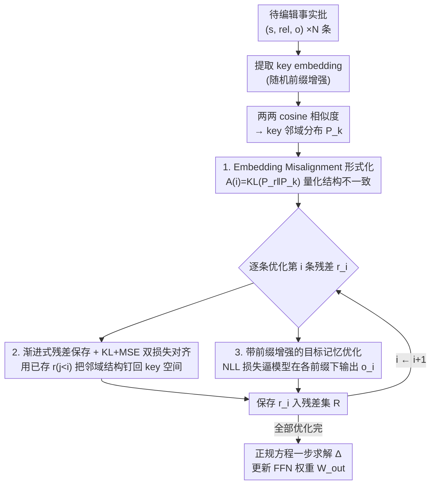

# EAMET: Robust Massive Model Editing via Embedding Alignment Optimization

**会议**: ICLR 2026  
**arXiv**: [2505.11876](https://arxiv.org/abs/2505.11876)  
**代码**: [https://github.com/ybdai7/EAMET-massive-editing](https://github.com/ybdai7/EAMET-massive-editing)  
**领域**: LLM NLP / 模型编辑  
**关键词**: 大规模模型编辑, embedding对齐, MEMIT, 知识编辑, 结构不一致

## 一句话总结

揭示大规模模型编辑失败的根本原因是 key embedding 与 residual embedding 之间的结构不一致（embedding misalignment），提出 EAMET 通过渐进式保存已优化的残差 embedding 并用 KL 散度 + MSE 双损失将其邻域结构对齐到 key embedding 空间，在 6 个 LLM、3 个数据集上同时编辑 10k 事实时平均超越 MEMIT 14%（CounterFact）和 8%（ZsRE），且在长前缀和同主语多事实两大鲁棒性场景下表现稳健。

## 研究背景与动机

**领域现状**：LLM 上线后知识会过时，模型编辑（Model Editing）技术希望在不重训的前提下修改特定事实。MEMIT 和 PMET 等 locate-then-edit 方法通过直接修改 FFN 权重实现批量编辑，号称可同时编辑上万条事实。

**现有痛点**：现有方法的效果被过于宽松的评估指标高估了——它们仅检查目标 token 概率是否高于原始 token，而非模型是否真正生成了目标对象。在更严格的"实用指标"（模型输出必须精确包含目标实体）下，大规模编辑（>1000 条）时性能急剧下降。此外还有两个实际场景下的鲁棒性问题：(a) 编辑的知识前面加上 50 个 token 的描述性前缀后，LLaMA2-7B 上 MEMIT 准确率从 98.5% 降至 77.4%；(b) 同一主语下同时编辑多个事实时，各事实之间相互干扰导致编辑失败。

**核心矛盾**：问题根源在于，当大量事实联合编辑时，每条事实的残差 embedding $r_i$（目标记忆与原始权重的差值）和其 key embedding $k_i$（FFN 层的输入表示）之间的"邻域结构"发生偏离——即 $r_i$ 和 $r_j$ 之间的相似度排列与 $k_i$ 和 $k_j$ 之间的不一致。这种 misalignment 导致联合求解正规方程时，单条事实的重构出现信息损失。

**本文目标** 在大规模批量编辑（10k+）场景下，维持每条编辑事实的 embedding 空间结构一致性，从而在严格评估指标下仍保持高编辑成功率和鲁棒性。

**切入角度**：作者从理论和实证两个方向出发。理论上，推导出每条事实的重构误差上界 $\|e_i\| \leq C_i\sqrt{\frac{1}{2}\mathcal{A}(i)} + |\beta_{ii}|\|r_i\| + \|\varepsilon_i\|$，其中 $\mathcal{A}(i)$ 就是 misalignment 分数。实证上，在 LLaMA2-7B 上将编辑数从 200 增至 1000，misalignment 总分从 79 涨到 554，准确率从 98.5% 降到 86.8%，高度吻合。

**核心 idea**：在优化每条事实的目标记忆时，渐进式保存已优化的残差 embedding，并用 KL 散度 + MSE 双损失约束其与 key embedding 空间的邻域结构一致。

## 方法详解

### 整体框架

EAMET 沿用 MEMIT 的 locate-then-edit 范式，输入是一批需要编辑的事实三元组 $(s_i, rel_i, o_i)$，输出是对 FFN 层 $W_{out}^l$ 的参数更新 $\Delta$。与 MEMIT 一次性联合优化所有残差不同，EAMET 逐条迭代优化每条事实的残差 $r_i$，并在优化过程中加入 embedding 对齐约束。整个流程分三步：(a) 预提取所有事实的 key embedding 并计算两两 cosine 相似度分布，据此把"编辑多了就崩"量化成 misalignment 分数；(b) 逐条优化残差 embedding，每优化完一条就保存，后续优化时用已保存的残差计算对齐损失，同时用带前缀的 NLL 损失保证模型真能输出目标对象；(c) 将对齐后的残差代入正规方程一步求解 $\Delta$。

### 关键设计

**1. Embedding Misalignment 的理论形式化：把"编辑多了就崩"变成一个可测量的量**

以往工作只观察到大规模编辑会退化，却给不出量化解释。EAMET 的第一步是把这个模糊现象钉成一个具体的标量。对每条事实 $i$，收集它的残差 $r_i$ 与其他所有残差之间的 cosine 相似度分布 $P_r^{(i)}$，以及它的 key $k_i$ 与其他所有 key 之间的分布 $P_k^{(i)}$，再用 KL 散度 $\mathcal{A}(i) = KL(P_r^{(i)} \| P_k^{(i)})$ 度量两个邻域结构有多不一致。论文进一步证明 Theorem 1——每条事实的重构误差上界与 $\sqrt{\mathcal{A}(i)}$ 成正比。直觉上，如果 $r_i$ 的最近邻是 $r_3, r_7$，而 $k_i$ 的最近邻却是 $k_5, k_9$，那么在联合求解 $\Delta k_i = r_i$ 时，$\Delta$ 会被迫对 $k_i$ 做出错误方向的组合，重构自然失败。这个形式化的价值在于它直接指明了优化方向：只要把 $\mathcal{A}(i)$ 压下来，重构误差上界就跟着降。

**2. 渐进式残差保存与 KL+MSE 双损失对齐：在优化残差时把它的邻域结构钉回 key 空间**

知道要降低 $\mathcal{A}(i)$ 之后，问题是怎么在优化中真正约束它。EAMET 不像 MEMIT 那样一次性联合优化所有残差，而是逐条按顺序优化：优化第 $i$ 条时，前 $i-1$ 条已优化的残差都已保存下来，于是可以计算 $r_i$ 与 $\{r_j \mid j < i\}$ 的相似度分布 $P_r^{(i)}$，拿它和对应的 key 侧分布 $\bar{P}_k^{(i)}$ 比对。对齐损失由两项组成，互为补充：

$$L_{KL}(i) = KL\big(P_r^{(i)} \,\|\, \bar{P}_k^{(i)}\big), \qquad L_{MSE}(i) = \frac{1}{M} \sum_{j=1}^M \big\|P_r^{(i,j)} - P_k^{(i,j)}\big\|^2$$

$L_{KL}$ 做分布级的全局对齐，管整体邻域结构的形状；$L_{MSE}$ 只盯 key 空间里 top-M 个最近邻，对这几个最关键的位置做精确匹配。单用 KL 会忽略少数关键近邻的精确对齐，单用 MSE 又只顾局部不管全局分布，论文在消融实验中确认两者组合优于任一单独使用。

**3. 带前缀增强的目标记忆优化：在对齐正则之上，让残差在各种前缀下都能正确输出目标**

对齐约束最终要嵌进每条事实残差 $r_i$ 的优化目标里。完整目标为：

$$r_i = \arg\min_{r_i} \left( \frac{1}{N_{FP}} \sum_j -\log P_{G(h_i^L \,+=\, r_i)}\big[o_i \mid f_j \oplus tp(s_i, rel_i)\big] + \lambda_{KL} L_{KL}(i) + \lambda_{MSE} L_{MSE}(i) \right)$$

第一项是标准 NLL 损失，确保模型在给定模板下预测出目标对象 $o_i$；其中 $f_j$ 是随机采样的前缀，逼模型学到更泛化、对前缀不敏感的记忆表示。后两项就是上面的对齐正则。MEMIT 原版其实也用了前缀采样，但没有任何对齐约束，优化出的残差会在空间里"乱飞"；加上对齐正则后，残差被钉在与 key 空间结构一致的位置上，代入正规方程时重构误差更小，这正是 EAMET 在严格指标和前缀鲁棒性上同时拿到提升的根源。

### 损失函数 / 训练策略

总损失 = NLL 编辑损失（带前缀增强）+ $\lambda_{KL} \cdot L_{KL}$ + $\lambda_{MSE} \cdot L_{MSE}$。优化过程是逐条迭代的：优化第 $i$ 条→保存 $r_i$→优化第 $i+1$ 条时用前 $i$ 条的残差计算对齐损失。参数更新最终仍通过 MEMIT 的正规方程 $\Delta(C_p + K_t K_t^T) = R K_t^T$ 一步求解，只是其中的 $R = [r_1 | r_2 | \ldots | r_N]$ 换成了经过对齐优化后的残差矩阵。

## 实验关键数据

### 主实验（10k 事实编辑，6 个 LLM，CounterFact 数据集）

| 模型 | 方法 | Eff.(%)↑ | Gen.(%)↑ | Spe.(%)↑ | Flu.↑ |
|------|------|----------|----------|----------|-------|
| LLaMA2-7B | MEMIT | 24.95 | 22.68 | 63.84 | 506.69 |
| LLaMA2-7B | PMET | 74.22 | 46.45 | 72.47 | 507.10 |
| LLaMA2-7B | **EAMET** | **89.09** | **61.21** | 72.19 | 519.89 |
| LLaMA2-13B | MEMIT | 47.98 | 34.75 | 71.61 | 517.63 |
| LLaMA2-13B | **EAMET** | **92.85** | **60.08** | 77.51 | 530.78 |
| Deepseek-7B | MEMIT | 62.11 | 42.01 | 78.04 | 512.16 |
| Deepseek-7B | **EAMET** | **89.74** | **59.98** | 77.73 | 513.93 |
| Falcon-7B | MEMIT | 89.21 | 60.85 | 77.56 | 519.92 |
| Falcon-7B | **EAMET** | **92.37** | **63.91** | **78.94** | 528.98 |
| LLaMA3-8B | MEMIT | 93.76 | 61.98 | 77.69 | 526.47 |
| LLaMA3-8B | **EAMET** | **93.87** | **63.74** | **79.07** | 533.30 |
| Qwen2.5-7B | MEMIT | 90.06 | 63.86 | 70.53 | 529.27 |
| Qwen2.5-7B | **EAMET** | **90.49** | **64.37** | **72.18** | 536.67 |

### Misalignment 分数对比（10k 编辑）

| 模型 | EAMET (CF/ZS) | MEMIT (CF/ZS) | PMET (CF/ZS) |
|------|---------------|---------------|--------------|
| LLaMA2-7B | 377 / 165 | 11506 / 22245 | 11475 / 11477 |
| Qwen-7B | 374 / 180 | 18498 / 23699 | 18471 / 18463 |
| Deepseek-7B | 520 / 161 | 12135 / 23241 | 12155 / 12046 |
| Falcon-7B | 385 / 181 | 8564 / 17589 | 8602 / 8590 |

### 前缀鲁棒性（200 条编辑，LLaMA2-7B）

| 前缀长度 | MEMIT 准确率 | EAMET 准确率 | 低 $\mathcal{A}$ 组 | 高 $\mathcal{A}$ 组 |
|----------|-------------|-------------|-------------------|-------------------|
| 0 token | 98.50% | ~99% | - | - |
| 5 token | 84.15% | ~95% | 94.00% | 46.00% |
| 50 token | 77.40% | ~90% | 90.00% | 45.00% |
| 200 token | 66.50% | ~92% | - | - |

### 关键发现

- **Misalignment 是编辑失败的核心信号**：EAMET 将 10k 编辑的 misalignment 总分从 MEMIT 的 11506 降至 377（LLaMA2-7B, CounterFact），降幅达 96.7%，直接验证了对齐优化的有效性
- **LLaMA2-7B 获益最大**：EAMET 在该模型上的 Eff. 从 MEMIT 的 24.95% 飞跃至 89.09%，提升 64 个百分点。原因是该模型的原始 misalignment 最严重
- **编辑序列不敏感**：随机打乱编辑顺序后 EAMET 在 CounterFact 上 Eff. 仅波动 ~1%，在 ZsRE 上最多降 2%
- **同主语多事实鲁棒**：在 ZsRE 上随每个主语关联事实数增加，MEMIT/PMET 性能持续下滑，EAMET 保持稳定
- **15k 编辑规模仍可扩展**：在 Qwen2.5-7B 上编辑 15k 事实，EAMET 83.66% vs MEMIT 77.46%，优势随规模增大而扩大

## 亮点与洞察

- **Embedding misalignment 的形式化诊断**：这是第一个量化解释"为什么大规模编辑会失败"的工作。不是优化不够、不是参数容量不足，而是残差和 key 的邻域结构在联合优化中被破坏。这个洞察非常精妙，因为它把一个模糊的"scalability issue"变成了可测量、可优化的具体目标 $\mathcal{A}(i)$
- **渐进式对齐的巧妙设计**：逐条优化+保存的策略避免了一次性处理 10k 条残差的内存爆炸，同时自然构建出一个不断增长的"对齐参考集"。这个 progressive 策略本身就是一种通用的大规模优化范式，可迁移到其他需要维持空间结构一致性的场景
- **严格评估指标的提出**：用实际生成是否包含目标实体替代概率比较，暴露了 MEMIT 等工作被高估的问题。这个"实用指标"的提出本身就推动了整个 model editing 领域的评估标准升级

## 局限与展望

- **逐条迭代优化的计算开销**：每条事实需要单独跑前向 + 反向传播来优化 $r_i$，编辑 10k 条的时间复杂度线性增长。如果能找到一种batch-wise 的对齐优化方案（比如用一个小的对齐网络一步到位），可大幅加速
- **仅限 Transformer FFN 层编辑**：框架绑定在 locate-then-edit 范式上，无法应用于注意力层编辑或 adapter-based 方法。理论上 misalignment 的概念也适用于其他参数空间，但需要重新形式化
- **缺乏多轮连续编辑评估**：论文只做了一次性批量编辑，没有测试在已编辑模型上继续编辑的场景。连续编辑可能导致对齐漂移累积
- **对齐损失的超参敏感性未充分分析**：$\lambda_{KL}$ 和 $\lambda_{MSE}$ 的取值对不同模型可能需要调优，论文未提供系统的敏感性分析

## 相关工作与启发

- **vs MEMIT**：MEMIT 无对齐约束地联合求解正规方程，随编辑量增大残差空间结构被破坏。EAMET 的对齐损失本质上是 MEMIT 的一种正则化——不改变最终参数更新的数学形式，只改善输入残差的质量。这说明 MEMIT 的瓶颈不在求解器而在输入质量
- **vs AlphaEdit**：AlphaEdit 关注连续编辑时的知识遗忘，用 null-space 约束保护已编辑知识。EAMET 关注批量编辑时的空间结构一致性，两者正交，理论上可组合使用
- **vs PMET**：PMET 在 FFN 之外引入注意力层的参数修改以增加编辑容量，但同样遭受 misalignment 问题（misalignment 分数与 MEMIT 相当）。EAMET 不增加编辑层数但从根源上改善残差质量，效果反而更好

## 评分

- 新颖性: ⭐⭐⭐⭐ 形式化 embedding misalignment 是全新视角，但方法层面（KL+MSE 正则）相对常规
- 实验充分度: ⭐⭐⭐⭐⭐ 6 个 LLM、3 个数据集、从 200 到 15k 的编辑规模、前缀鲁棒性、同主语鲁棒性、编辑序列敏感性，覆盖全面
- 写作质量: ⭐⭐⭐⭐ 理论-实证-方案的叙事链条清晰，但符号较多，method 部分可读性一般
- 价值: ⭐⭐⭐⭐ 对 model editing 社区有重要启发，misalignment 诊断工具本身就具有独立价值

- 新颖性: ⭐⭐⭐⭐ Embedding misalignment 的发现和形式化原创

- 实验充分度: ⭐⭐⭐⭐ 6 个 LLM × 3 个数据集

- 写作质量: ⭐⭐⭐⭐ 理论推导清晰

- 价值: ⭐⭐⭐⭐ 解决了大规模模型编辑的实际瓶颈

## 总结

本文在所研究的方向上做出了有意义的探索，提出的方法在多个实验设置下展现了竞争力。

核心贡献的技术路线清晰，实验设计合理，为后续研究提供了有价值的参考。

未来可以进一步探索方法在更广泛场景下的适用性和可扩展性。

<!-- RELATED:START -->

## 相关论文

- [\[ACL 2026\] EvoEdit: Evolving Null-space Alignment for Robust and Efficient Knowledge Editing](../../ACL2026/knowledge_editing/evoedit_evolving_null-space_alignment_for_robust_and_efficient_knowledge_editing.md)
- [\[ICLR 2026\] Fine-tuning Done Right in Model Editing](fine-tuning_done_right_in_model_editing.md)
- [\[ICLR 2026\] Energy-Regularized Sequential Model Editing on Hyperspheres](energy-regularized_sequential_model_editing_on_hyperspheres.md)
- [\[ACL 2025\] Context-Robust Knowledge Editing for Language Models](../../ACL2025/knowledge_editing/context-robust_knowledge_editing_for_language_models.md)
- [\[ICLR 2026\] KnowledgeSmith: Uncovering Knowledge Updating in LLMs with Model Editing and Unlearning](knowledgesmith_uncovering_knowledge_updating_in_llms_with_model_editing_and_unle.md)

<!-- RELATED:END -->
