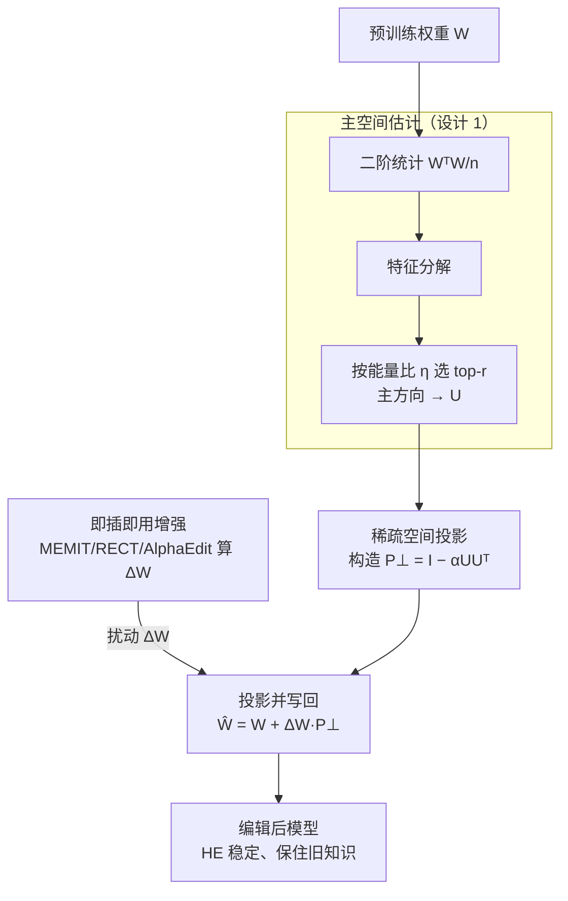

# Energy-Regularized Sequential Model Editing on Hyperspheres

**会议**: ICLR 2026  
**arXiv**: [2510.01172](https://arxiv.org/abs/2510.01172)  
**代码**: [GitHub](https://github.com/) (论文提供链接)  
**领域**: 模型压缩 / 知识编辑 / LLM效率  
**关键词**: model editing, hyperspherical energy, sequential editing, catastrophic forgetting, knowledge preservation

## 一句话总结

从超球面均匀性（Hyperspherical Energy）视角理解序列模型编辑中的性能退化，提出 SPHERE 方法：通过将编辑扰动投影到预训练权重主超球方向的正交补空间，实现稳定的大规模序列编辑，在 LLaMA3-8B 上平均超越最强基线 16.41%。

## 研究背景与动机

1. LLM 知识不可避免地过时，需要持续更新，但重新训练成本极高，模型编辑是轻量替代方案
2. 序列模型编辑（多次连续编辑）是最实际的场景，但常导致灾难性遗忘和表示崩溃
3. 现有编辑方法（ROME、MEMIT、RECT等）在大规模序列编辑下性能急剧下降——大多在 3000 次编辑前崩溃
4. 关键发现：将权重矩阵视为超球面上的神经元集合，其超球面均匀性（HE）与编辑性能高度相关
5. HE 的剧烈波动总是伴随编辑失败，而更先进的方法隐式地更好保持了 HE
6. 理论证明：HE 变化为预训练知识退化建立了下界，解释了 HE 稳定性对知识保存的关键作用

## 方法详解

### 整体框架

SPHERE（Sparse Projection for Hyperspherical Energy-Regularized Editing）的核心思路是：把权重矩阵看成超球面上的一组神经元，编辑之所以崩溃是因为扰动破坏了这组神经元的均匀分布（即超球面均匀性 HE）。于是 SPHERE 先估出预训练权重里承载知识的"主超球方向"，再把每次编辑的扰动投影到这些主方向的正交补空间里，让编辑既能改写目标知识、又尽量不去扰动那些撑起原有几何结构的关键方向。整套操作只在原有编辑方法的闭式解后面加一步投影，因此可以即插即用。整条流水线如下：先从预训练权重估出主空间 $U$，据此构造投影矩阵 $P_\perp$；任意现有编辑器照常算出自己的扰动 $\Delta W$，再让 $\Delta W$ 过一遍投影后写回权重，得到 HE 稳定、旧知识不被破坏的编辑后模型。

### 关键设计

**1. 主空间估计：找出预训练知识所在的几何核心方向**

要保护什么，先得知道知识藏在哪。SPHERE 把权重矩阵 $W \in \mathbb{R}^{d \times d}$ 的每一行视为超球面上的一个神经元，并对其二阶统计量 $\frac{1}{n} W^T W$ 做特征分解。特征值越大的方向，意味着越多神经元沿该方向聚集、承载的预训练信息越密集，因此取最大的 $r$ 个特征值对应的特征向量拼成主空间矩阵 $U = [v_{d-r+1}, \ldots, v_d] \in \mathbb{R}^{d \times r}$。$r$ 不是手调死值，而是由累积能量比率 $\eta$ 决定——选最少的方向使其特征值之和占比超过阈值 $\sum_{i=d-r+1}^{d} \lambda_i \geq \eta \sum_{i=1}^{d} \lambda_i$，这样既覆盖了知识的主体几何结构，又不会把整个空间都锁死。

**2. 稀疏空间投影：把扰动挡在主方向之外**

拿到主空间后，SPHERE 构造投影矩阵 $P_\perp = I - \alpha U U^T$，并让任意编辑产生的扰动先过一遍投影再写回权重：$\hat{W} = W + \Delta W \cdot P_\perp$。直观上 $U U^T$ 是落到主方向上的分量，减掉它就把扰动推到了主方向的正交补（即"稀疏空间"）里，从而几乎不动那些撑起超球面均匀性的关键方向。系数 $\alpha$ 控制保护力度：$\alpha = 1$ 是硬投影，主方向分量被完全清零；$0 < \alpha < 1$ 是软投影，只衰减不抹除，给目标知识留一点写入余地，避免投影过猛反而把 HE 推偏。这一步正是 HE 在长序列编辑下保持稳定的直接来源。

**3. 即插即用增强：一行投影接到任何编辑方法上**

SPHERE 不替换现有编辑器，而是作为后处理嵌进 MEMIT、RECT、PRUNE、AlphaEdit 等方法的求解流程——这些方法照常算出自己的扰动 $\Delta W$，SPHERE 只在应用前补一句 $\Delta W \cdot P_\perp$。因为投影与具体的定位/求解逻辑完全解耦，所以几乎零改造成本就能套用，实测对各类基线平均带来 38.71% 的提升，工程上几乎是免费午餐。

### 损失函数 / 训练策略

SPHERE 本身不引入新的训练损失，而是直接作用在编辑方法的闭式解上。模型编辑的基础目标是在写入新知识 $(K_1, V_1)$ 的同时保住旧知识 $(K_0, V_0)$：

$$\Delta W = \arg\min_{\Delta \hat{W}} \left( \|{(W + \Delta \hat{W}) K_1 - V_1}\|^2 + \|{(W + \Delta \hat{W}) K_0 - V_0}\|^2 \right)$$

SPHERE 在求得 $\Delta W$ 后追加投影 $\Delta W_{proj} = \Delta W \cdot P_\perp$。这一步之所以有效，由 Theorem 1 给出理论保证：输出扰动的幅度被 HE 变化所下界，$|\Delta V| \geq \left(\frac{\Delta HE}{K}\right)^2$，即只要把 HE 的波动压住，预训练知识的退化也就被同步限制住——这把"保持超球面均匀性"和"保护原有知识"在数学上画上了等号。

## 实验关键数据

### 主实验

LLaMA3-8B 上 15000 次序列编辑（ZsRE / CounterFact）：

| 方法 | ZsRE Eff.↑ | ZsRE Gen.↑ | ZsRE Spe.↑ | CF Eff.↑ | CF Gen.↑ |
|------|-----------|-----------|-----------|---------|---------|
| FT | 15.27 | 14.78 | 5.06 | 8.40 | 2.54 |
| MEMIT | 0.00 | 0.00 | 0.06 | 0.00 | 0.00 |
| RECT | 0.01 | 0.01 | 0.04 | 0.57 | 0.29 |
| AlphaEdit | 86.64 | 81.28 | 28.78 | 4.37 | 1.71 |
| **SPHERE** | **90.01** | **84.67** | **45.40** | **52.89** | **32.07** |

### 消融实验

即插即用增强效果（3000 次编辑，LLaMA3-8B）：

| 增强目标 | Efficacy 提升 | Generalization 提升 | Specificity 提升 |
|----------|-------------|-------------------|-----------------|
| MEMIT + SPHERE | +49.05% | +42.64% | +24.44% |
| 全部基线平均 | +38.71% avg | — | — |

计算开销极低：

| 模型 | 编辑时间 | 投影时间 | 占比 |
|------|---------|---------|------|
| LLaMA3-8B | 543.26s | 18.00s | 3.31% |
| Qwen2.5-7B | 535.73s | 35.95s | 6.71% |
| Qwen2.5-32B | 1656.58s | 99.60s | 6.01% |

### 关键发现

1. SPHERE 在 ZsRE 上 Efficacy 达 90.01%，超越 AlphaEdit（86.64%），Specificity 提升 16.62 个百分点
2. 在 CounterFact 上提升极其显著：Efficacy 从 4.37% 跃升到 52.89%
3. t-SNE 可视化证实 SPHERE 编辑后的权重分布与原始分布高度重叠，其他方法出现明显角度聚集
4. 15000 次编辑后，SPHERE 在 GSM8K/RTE/NQ/BoolQ 四个通用任务上保持原始性能，基线方法几乎归零
5. 投影操作仅占总编辑时间 3-7%，对 32B 级模型同样适用

## 亮点与洞察

1. **超球面均匀性视角**：首次将模型编辑与超球面能量联系，发现 HE 波动与编辑失败高度相关（Spearman 相关强显著）
2. **理论-实证双重支撑**：Theorem 1 证明 HE 变化为输出扰动提供下界，图2/图3 的经验分析完美印证
3. **极致的即插即用性**：仅需一行投影代码即可提升现有方法 38.71%，实际工程价值极高
4. **通用能力保持出色**：15000 次编辑后仍保持通用能力，解决了序列编辑领域长期痛点
5. 对超参数（$\eta, \alpha$）鲁棒：所有配置下 SPHERE 都能改善原方法，降低了调参门槛

## 局限与展望

1. Qwen2.5-7B 上仅能做 5000 次编辑就出现严重退化，在小模型上的扩展性有待提升
2. Specificity 指标虽有提升但仍较低（LLaMA3 上 45.40%），精准编辑不影响邻域知识的能力有限
3. 主空间估计需要预计算特征分解，模型规模增大时计算成本可能上升
4. 实验仅在 LLaMA3-8B 和 Qwen2.5-7B 两个模型上验证，更多架构的泛化性需要确认
5. 当前仅考虑 FFN 层的编辑，是否适用于 Attention 层的编辑未探讨

## 相关工作与启发

- **AlphaEdit**（Fang et al., 2025）：将扰动投影到先前知识集的零空间，是 SPHERE 的基础方法
- **MEMIT**（Meng et al., 2023）：经典的 locate-then-edit 方法，在序列编辑下崩溃
- **超球面学习**（Liu et al., 2018, 2021）：HE 作为均匀性度量的理论基础
- 启发：超球面视角可能推广到其他参数修改场景（如 LoRA 适配、持续学习、模型合并）

## 评分

- **新颖性**: ⭐⭐⭐⭐⭐ 超球面能量正则化视角全新，理论证明 HE 变化与输出扰动的定量联系很有深度
- **实验充分度**: ⭐⭐⭐⭐⭐ 两模型两数据集、通用能力、即插即用、计算开销、超参敏感性分析一应俱全
- **写作质量**: ⭐⭐⭐⭐ 逻辑清晰，但数学符号较多，阅读门槛稍高
- **价值**: ⭐⭐⭐⭐⭐ 即插即用一行代码提升 38.71%，在模型编辑领域非常实用，理论贡献也很扎实

<!-- RELATED:START -->

## 相关论文

- [\[ICLR 2026\] Fine-tuning Done Right in Model Editing](fine-tuning_done_right_in_model_editing.md)
- [\[AAAI 2026\] Multiplicative Orthogonal Sequential Editing for Language Models (MOSE)](../../AAAI2026/knowledge_editing/multiplicative_orthogonal_sequential_editing_for_language_models.md)
- [\[ACL 2026\] Spectral Characterization and Mitigation of Sequential Knowledge Editing Collapse](../../ACL2026/knowledge_editing/spectral_characterization_and_mitigation_of_sequential_knowledge_editing_collaps.md)
- [\[ICLR 2026\] Bilinear Representation Mitigates Reversal Curse and Enables Consistent Model Editing](bilinear_representation_mitigates_reversal_curse_and_enables_consistent_model_ed.md)
- [\[ICLR 2026\] EAMET: Robust Massive Model Editing via Embedding Alignment Optimization](eamet_robust_massive_model_editing_via_embedding_alignment_optimization.md)

<!-- RELATED:END -->
