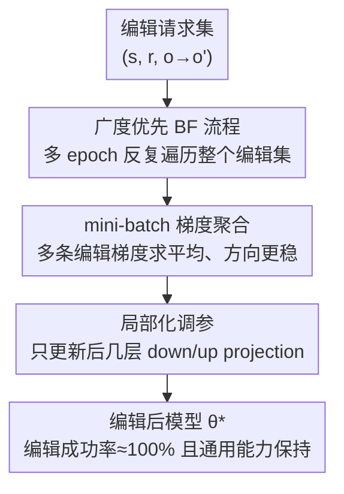

# Fine-tuning Done Right in Model Editing

**会议**: ICLR 2026  
**arXiv**: [2509.22072](https://arxiv.org/abs/2509.22072)  
**代码**: [https://github.com/ICT-STAR/LocFT](https://github.com/ICT-STAR/LocFT)  
**领域**: 知识编辑  
**关键词**: Model Editing, Fine-tuning, 知识编辑, 灾难性遗忘, 局部化微调

## 一句话总结
揭示模型编辑中 fine-tuning 被低估的根因是错误的训练 pipeline（深度优先逐样本优化），修正为标准的广度优先 mini-batch 训练后，配合局部化参数调优形成 LocFT-BF，首次支持 10 万次连续编辑和 72B 模型规模。

## 研究背景与动机

**领域现状**：模型编辑旨在高效修改 LLM 中的特定事实知识而不重训练，主流方法包括参数扩展（GRACE）、元学习（MEND）和定位-编辑（ROME/MEMIT）。Fine-tuning 在该领域一直被视为弱 baseline，因"过拟合和灾难性遗忘"而被否定。

**现有痛点**：(a) 定位-编辑方法需要预计算矩阵，扩展性差；(b) 元学习方法需额外标注数据和辅助网络；(c) 参数扩展方法修改架构；(d) 所有方法在大规模连续编辑（>10K）下性能显著下降。

**核心矛盾**：Fine-tuning 是 LLM 适配最成功的方法，却在模型编辑中被判定为"不行"——这个矛盾值得深挖。

**本文目标** Fine-tuning 在模型编辑中真的不行吗？其失败是方法本身还是实现方式的问题？

**切入角度**：审查现有代码库发现，模型编辑中的 fine-tuning 使用了**非标准训练流程**：逐样本优化到收敛再处理下一个（深度优先），而非标准的多 epoch mini-batch 训练（广度优先）。

**核心 idea**：模型编辑中 fine-tuning 的"失败"是实现 bug 而非方法局限——修正训练 pipeline + 局部化调参即可超越所有 SOTA。

## 方法详解

### 整体框架
这篇论文要回答一个反直觉的问题：fine-tuning 在 LLM 适配里是最成功的方法，为什么一到模型编辑就被当成"过拟合、灾难性遗忘"的弱 baseline？作者审查现有代码库后发现，问题不在 fine-tuning 本身，而在它被实现成了一套**非标准**的训练流程——逐个样本训练到收敛再换下一个（深度优先 DF），后来的编辑不断覆盖前面学到的。LocFT-BF 的做法很朴素：把训练流程换回标准的广度优先（BF）多 epoch mini-batch 训练，再把可训练参数收窄到后几层的 down/up projection。输入是一串编辑请求 $(s, r, o \to o')$，整套流程不预计算任何矩阵、不加辅助网络、不改架构，直接梯度下降得到新参数 $\theta^*$。下图按数据流给出 LocFT-BF 的三步修正，三个核心阶段恰好对应下面三个关键设计：

### 关键设计

**1. Pipeline 修正：从深度优先换回广度优先，灾难性遗忘的根因在这里**

模型编辑里 fine-tuning 之所以"遗忘严重"，根子在原有代码用的是深度优先（DF）流程——逐个样本训练到收敛，再处理下一个。这样后来的编辑会不断覆盖前面学到的内容，越往后忘得越多，自然显得 fine-tuning 不堪用。作者把它换成标准的广度优先（BF）流程：多个 epoch 反复遍历整个编辑集，让模型每一轮都同时见到所有编辑、平衡地学习它们。这是全文最关键的发现——哪怕 batch size 仍然保持 1、其他一切不变，单单这一步就带来巨大提升，直接戳破了"fine-tuning 不适合模型编辑"的长期共识。

**2. 更新粒度修正：逐样本换成 mini-batch，把通用能力稳住**

在 BF 的基础上，作者再把 batch size 从 1 提到标准的 mini-batch（如 64）。逐样本更新的梯度方差很大，容易在拟合某条编辑时顺带破坏模型的通用能力；mini-batch 把多条编辑的梯度聚合起来，方向更稳，对原有能力的扰动更小。这一步不是为了进一步提编辑成功率，而是专门用来减少通用能力的退化——它和 BF 配合，让"学会新知识"和"保住旧能力"不再互相打架。

**3. 局部化调参：只动后几层的 down/up projection，而不是照搬 ROME 的中间层**

哪些参数该被 fine-tune，过去的做法（如 FT-M）直接继承了 ROME 的选择——中间层 MLP，因为 ROME 假设事实存在中间层。但这套位置是为定位-编辑设计的，未必适合 fine-tuning。作者系统地扫了不同层、不同模块（attention 与 MLP 的各个投影矩阵），发现调整**后几层的 down-projection 或 up-projection 矩阵**通常最优：编辑成功率能逼近 100%，同时通用能力几乎不掉。这个结论和 ROME"中间层存储事实"的假设形成有意思的对照——至少对 fine-tuning 而言，后层才是更合适的落点。

### 损失函数 / 训练策略
标准交叉熵损失，仅在编辑目标 token 上计算。关键实现细节：
- 多 epoch 广度优先遍历
- Mini-batch 梯度聚合
- 仅更新后几层的 MLP down/up projection
- 不需要额外的正则化、辅助数据或架构修改

## 实验关键数据

### 主实验

**LLaMA3-8B，1000 次 ZsRE 编辑**:

| 方法 | Reliability | Generalization | Capability |
|------|-----------|---------------|------------|
| ROME | 中等 | 中等 | 下降 |
| MEMIT | 中等 | 中等 | 下降 |
| GRACE | 中等 | 低 | 保持 |
| FT-M (DF, 原始) | 75.3 | 67.2 | 28.3 |
| FT-M (BF, batch=1) | 大幅提升 | 大幅提升 | 改善 |
| **LocFT-BF** | **接近100%** | **接近100%** | **保持** |

平均超越最佳 baseline **33.72%** 编辑成功率。

### 消融实验

| 配置 | 编辑成功 | 通用能力 | 说明 |
|------|---------|---------|------|
| DF pipeline + batch=1 | 低 | 严重退化 | 传统做法 |
| BF pipeline + batch=1 | 大幅提升 | 改善 | 仅改 pipeline |
| BF + mini-batch | 进一步提升 | 显著保持 | + 增大 batch |
| BF + mini-batch + 局部化 | 最优 | 完全保持 | + 优化调参位置 |

### 关键发现
- **仅改 pipeline（DF→BF）** 就消除了灾难性遗忘问题，这推翻了"fine-tuning 不适合模型编辑"的长期共识
- 首次将评估推到 **100K 连续编辑**（此前最多 10K）和 **72B 参数模型**（此前最多 7/8B），性能稳定无退化
- 后层 MLP 比中间层 MLP 更适合知识编辑，与 ROME 的"中间层存储事实"假设形成有趣对比
- 方法极其简洁：无需矩阵预计算、无辅助网络、无架构修改、无额外数据，纯标准 fine-tuning

## 亮点与洞察
- **指出了领域内长期存在的实现错误**：这类"大家都这样做所以是对的"的暗默假设被打破，提醒社区重新审视 baseline 的公平性。类似的"baseline 被低估"现象可能存在于其他领域。
- **简洁即力量**：没有任何花哨组件，仅通过"正确使用 fine-tuning"就超越所有复杂方法。这对模型编辑领域的研究范式是重要校正。
- **10万次编辑+72B模型**的新评估标准推动了领域基准升级，更接近实际应用需求。

## 局限与展望
- 广度优先 pipeline 需要一次性获取所有编辑请求，在真正的在线/流式编辑场景中不完全适用
- 局部化调参位置的最优选择因模型而异，缺乏无需搜索的自动选择机制
- 未评估多模态模型的编辑效果
- 单 fact triple 编辑为主，复杂推理链编辑（需修改多个相关事实）未充分验证

## 相关工作与启发
- **vs ROME/MEMIT**: 定位-编辑方法需要预计算因果追踪矩阵，不可扩展；LocFT-BF 直接 fine-tune，简洁且扩展到 72B
- **vs GRACE**: 参数扩展方法修改架构，泛化性差；LocFT-BF 不改架构
- **vs MEND**: 元学习需要辅助网络和额外数据；LocFT-BF 是纯 fine-tuning 无额外开销
- 启发：在评判某方法"不行"之前，先确认实现是否正确

## 评分
- 新颖性: ⭐⭐⭐⭐⭐ 发现并纠正了领域共识的实现错误，impact 极大
- 实验充分度: ⭐⭐⭐⭐⭐ 3个模型 × 2数据集 × 多方法对比 + 100K编辑 + 72B模型
- 写作质量: ⭐⭐⭐⭐⭐ 逻辑链非常清晰：发现问题→受控实验→修正→系统优化
- 价值: ⭐⭐⭐⭐⭐ 一篇改变模型编辑领域baseline认知的工作

<!-- RELATED:START -->

## 相关论文

- [\[ACL 2026\] FABLE: Fine-grained Fact Anchoring for Unstructured Model Editing](../../ACL2026/knowledge_editing/fable_fine-grained_fact_anchoring_for_unstructured_model_editing.md)
- [\[ICLR 2026\] Energy-Regularized Sequential Model Editing on Hyperspheres](energy-regularized_sequential_model_editing_on_hyperspheres.md)
- [\[ICLR 2026\] Bilinear Representation Mitigates Reversal Curse and Enables Consistent Model Editing](bilinear_representation_mitigates_reversal_curse_and_enables_consistent_model_ed.md)
- [\[ICLR 2026\] EAMET: Robust Massive Model Editing via Embedding Alignment Optimization](eamet_robust_massive_model_editing_via_embedding_alignment_optimization.md)
- [\[ICLR 2026\] KnowledgeSmith: Uncovering Knowledge Updating in LLMs with Model Editing and Unlearning](knowledgesmith_uncovering_knowledge_updating_in_llms_with_model_editing_and_unle.md)

<!-- RELATED:END -->
