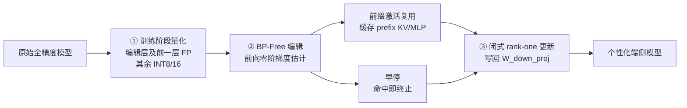

# MobiEdit: Resource-efficient Knowledge Editing for Personalized On-device LLMs

**会议**: ICLR 2026  
**OpenReview**: [https://openreview.net/forum?id=fb7yTBOV3p](https://openreview.net/forum?id=fb7yTBOV3p)  
**代码**: [https://github.com/UbiquitousLearning/MobiEdit](https://github.com/UbiquitousLearning/MobiEdit)  
**领域**: 知识编辑 / 端侧 LLM / 移动系统  
**关键词**: 知识编辑, locate-and-edit, 零阶优化, 移动 NPU, 量化, 端侧个性化  

## 一句话总结
MobiEdit 把经典 locate-and-edit 知识编辑（ROME）里资源沉重的反向传播换成「量化 + 前向零阶梯度估计」，再配早停和前缀激活复用两个系统优化，第一次让 3B LLM 的实时知识编辑能跑在普通商用手机的 NPU 上，内存省 7.1×、能耗省 15.8×、延迟省 3.4×。

## 研究背景与动机
**领域现状**：端侧 LLM 正从研究走向落地，用来做隐私敏感、低延迟的个人助理。要让助理记住「我家住北京路 1010 号」这类个性化事实，常用三条路：RAG、微调、知识编辑。知识编辑只改一小撮参数就能注入单条事实、且不拖慢推理，最适合资源受限的手机。主流范式是 locate-and-edit（ROME/MEMIT/AlphaEdit）——先定位 MLP 里负责该知识的 key-value 记忆，再优化一个 value 向量 $v$ 让 $Wk^*=v$。

**现有痛点**：现有编辑方法全靠反向传播（BP）求 $v$，在手机上有三个致命问题——(1) **NPU 不兼容**：手机 NPU（Hexagon/Edge TPU）只为前向推理优化，训练算子要么不支持要么极慢；(2) **量化不友好**：BP 训练在全量化模型上极不稳定，逼着你保留全精度权重，内存爆炸；(3) **内存开销巨大**：用 ROME 编辑一个 3B 模型要 40GB+ 内存（存全精度权重 + BP 激活），远超手机 16GB 上限。

**核心矛盾**：知识编辑的算法范式（多步 BP 优化）和移动硬件的能力（只擅长前向 INT 矩阵乘）根本对不上，导致编辑只能放云端，丢掉了端侧 LLM 的隐私和离线两大卖点。

**本文目标**：做一个内存高效、NPU 友好、量化兼容的端侧知识编辑系统，让编辑真正跑在商用手机上。

**核心 idea**：**用前向零阶优化替代反向传播**——既然 NPU 只会前向，那就只用前向 pass 来估梯度；再针对量化做混合精度排布、用早停和前缀复用补上零阶优化收敛慢的短板。

## 方法详解

### 整体框架
MobiEdit 继承 ROME 的 key-value 编辑范式，但把整条管线重做成算法-硬件协同设计，分三阶段执行：① **训练阶段量化**——把模型转成对齐 NPU 约束的混合精度格式；② **BP-free 编辑**——用前向零阶梯度估计器替代 BP 优化器，再叠加前缀激活复用和早停；③ **模型更新**——用闭式 rank-one 更新把优化好的 $v^*$ 原地写回权重，后续对话立刻用上新知识。

### 关键设计

**1. BP-free 零阶梯度估计：只靠前向 pass 求编辑向量。** 传统方法用 BP 算 $v$ 的梯度，MobiEdit 改用中心差分的零阶估计器：沿随机扰动方向 $u\sim\mathcal{N}(0,I)$，方向梯度为 $\hat\nabla_v L = \frac{L(v+\mu u)-L(v-\mu u)}{2\mu}\cdot u$，并对 $N$ 个独立方向取平均降方差，再做近似梯度下降 $v\leftarrow v-\eta\hat\nabla_v L$ 迭代到收敛。拿到最优 $v^*$ 后套 ROME 的闭式 rank-one 更新 $\hat W = W + \Lambda(C^{-1}k^*)^\top$（$C=KK^\top$ 为 key 协方差）把 $(k^*,v^*)$ 写进 MLP 记忆。整个流程只有前向 pass，激活算完即可丢弃——而激活本占 BP 内存的 40%+，这是省内存的根。

**2. NPU 友好的混合精度量化：只给编辑层留浮点。** 手机 NPU 擅长 INT8 矩阵乘、浮点能力弱，但全量化又会伤编辑精度。MobiEdit 用静态量化（标定语料定 scale），并做一个关键的混合精度排布：**只有编辑向量及其前一层线性层走浮点，其余权重全量化到 8/16-bit 整数**。理由有二——编辑只动正比于 hidden size 的极少参数，这里哪怕微小量化误差都会显著掉精度，而前一层正是存被改知识的地方；同时这部分浮点计算量极小（Qwen2.5-3B 上仅占 0.89%），开销可忽略。更妙的是论文从理论证明了 BP-free 对量化噪声更鲁棒：前向 pass 的噪声方差随深度 $L$ **线性增长** $O(L\sigma^2)$，而 BP 经链式法则把噪声 **指数放大** $O(\sigma^2\|W\|^{2(L-\ell)})$。这解释了实测里 W8A16 量化下 ROME 编辑成功率从 96 暴跌到 41，而 MobiEdit 仍有 80。

**3. 早停：按每条事实的难度自适应停。** 零阶优化每步只沿单一方向估梯度，偏离真梯度，要比 BP 多约 20× 步才收敛，抹掉了单步快的优势。作者发现不同知识编辑难度差异大（步数分布很散），于是每 $M$ 步（如 20 步）评一次模型对目标事实的响应，一旦以超过阈值 $m$ 的置信度产出目标输出就立刻终止。这样简单事实 2-3 分钟搞定，避免无谓前向 pass，还顺带降低过拟合风险。

**4. 前缀激活复用：缓存不变的前缀计算。** 每步编辑的输入是固定随机前缀 + 待编辑事实 $X_\text{edit}=\{[p_i+f]\}$，前缀 token 每步都一样却被反复重算。MobiEdit 在第一步缓存前缀的 KV cache 和 MLP 激活，后续步骤直接继承、只重算事实 token，大幅削减计算且不改架构。复用「陈旧」激活会带来精度-效率权衡（相邻步激活余弦相似度随编辑推进、尤其首尾层会下降，量化进一步放大这种波动），所以一旦编辑 loss 在 3 步内降幅不足 0.001 就重算前缀激活，防止陈旧度累积。

## 实验关键数据

### 主实验表格（单条编辑成本，ZsRE，Qwen2.5-3B）

| 方法 | 内存 (GB) | K60 延迟 (s) | K60 能耗 (kJ) | 备注 |
|---|---|---|---|---|
| ROME | 46.14 | 4543.8 | 25.13 | BP，需内存交换 |
| MEMIT | 46.14 | 4543.8 | 25.13 | 多事实编辑 |
| WISE | >30 | 11359 | ~0.36J/edit | 动态路由 FFN |
| AlphaEdit | >30 | — | — | 零空间投影 |
| **MobiEdit** | **6.2** | **1211–1902** | **~0.03J/edit** | NPU，W8A16 |

综合对比：MobiEdit 内存省 **7.1×**、能耗省 **15.8×**、延迟省 **3.4×**。Qwen 上编辑成功率 80.1 / locality 72.6 / portability 51.4；Llama3.2-3B 上成功率 88.3、延迟省 3.1–6.1×、能效高 13.6–27.6×。

### 量化鲁棒性 & 8 小时可用性

| 对比项 | ROME | MobiEdit |
|---|---|---|
| FP32 编辑成功 | 96 | 86 |
| W8A16 编辑成功 | 41 | **80** |
| 8 小时内成功编辑事实数（K60） | 5 | **14** |

baseline 跑满 100 秒 CPU 负载会升温约 10°C 导致卡顿/关机；MobiEdit 10× 能耗下降可在后台静默编辑。

### 消融实验表格（Llama3.2-8B，成功率 85.3 起）

| 移除组件 | 成功率变化 |
|---|---|
| 前缀激活复用（陈旧激活） | **−8.4** |
| 量化（W8A16） | −2.1 |

### 关键发现
- 编辑质量损失主要来自前缀激活复用，量化影响很小；量化的波动集中在首尾层（outlier feature 多，量化步长大）。
- BP 的量化噪声随深度指数爆炸、前向只线性增长，是 BP-free 在低比特下稳的根本原因。

## 亮点与洞察
- **把硬件约束当一等公民**：不是「编辑算法 + 事后压缩」，而是从「NPU 只会前向」倒推出零阶优化，算法-硬件真正协同。
- **零阶优化的意外红利**：原本被嫌弃的「无梯度、收敛慢」缺点，在量化端侧场景反而成了优点——前向噪声线性增长让它在低比特下远比 BP 稳。
- **混合精度的精准取舍**：只给 0.89% 的关键计算留浮点，既保编辑精度又几乎不增开销，是很漂亮的工程判断。
- **面向真实使用场景的指标**：用「8 小时（用户睡觉）能编几条事实」「持续负载升温」这种贴地的指标，比单纯比成功率更有说服力。

## 局限与展望
- **编辑质量有折让**：成功率/locality 普遍略低于全精度 BP 方法（如 Qwen locality 72.6、Llama portability 38.3 偏低），前缀复用掉 8.4 分是主要代价。
- **收敛步数仍多**：零阶估计天生要 ~20× 步，靠早停和复用压时间，对难编辑的事实仍可能耗时。
- **规模与多事实**：主体在 3B 单事实编辑验证，更大模型、批量/序列编辑（MEMIT 式多事实）下的稳定性未充分展开。
- **依赖特定推理引擎**：实测绑定 mllm-npu 与 W8A16，跨 NPU/格式的可移植性待验证。

## 相关工作与启发
- **locate-and-edit 谱系**：ROME（单层）、MEMIT（多事实）、AlphaEdit（零空间投影保护）、WISE（动态路由 FFN）——MobiEdit 站在 ROME 之上，把它「搬上手机」。
- **零阶/前向梯度优化**：借鉴 forward gradient（Baydin et al. 2022）的中心差分思想，把它从「省显存训练」迁移到「适配前向 NPU」。
- **量化与端侧推理**：与 QAT/STE 对比说明端侧「权重已量化、无浮点副本」场景的特殊性；outlier 集中首尾层的观察呼应量化文献。
- **启发**：当目标硬件只支持某类算子时，与其硬塞不兼容的算法，不如换一个数学上等价但算子友好的替代（BP→零阶），再用系统优化补性能洞——这是端侧 ML 的通用范式。

## 评分
- **新颖性**: ⭐⭐⭐⭐ — 首个把知识编辑搬上商用手机 NPU 的系统，BP→零阶 + 混合精度量化的组合在端侧编辑场景是新的，且有噪声增长的理论支撑。
- **实验充分度**: ⭐⭐⭐⭐ — 三台真机、两数据集、两模型、四 baseline，内存/延迟/能耗/质量全维度，外加 8 小时可用性和升温等真实指标；多事实/更大模型覆盖略欠。
- **写作质量**: ⭐⭐⭐⭐ — 动机-挑战-方案逻辑清晰，量化噪声的线性 vs 指数分析是亮点，图表充分。
- **价值**: ⭐⭐⭐⭐ — 直接打通了端侧个性化 LLM 的隐私+离线落地路径，工程参考价值高。

<!-- RELATED:START -->

## 相关论文

- [\[ICLR 2026\] MoEEdit: Efficient and Routing-Stable Knowledge Editing for Mixture-of-Experts LLMs](moeedit_efficient_and_routing-stable_knowledge_editing_for_mixture-of-experts_ll.md)
- [\[ICLR 2026\] KnowledgeSmith: Uncovering Knowledge Updating in LLMs with Model Editing and Unlearning](knowledgesmith_uncovering_knowledge_updating_in_llms_with_model_editing_and_unle.md)
- [\[ACL 2025\] Efficient Knowledge Editing via Minimal Precomputation](../../ACL2025/knowledge_editing/efficient_knowledge_editing.md)
- [\[ACL 2026\] EvoEdit: Evolving Null-space Alignment for Robust and Efficient Knowledge Editing](../../ACL2026/knowledge_editing/evoedit_evolving_null-space_alignment_for_robust_and_efficient_knowledge_editing.md)
- [\[ACL 2026\] Representation Interventions Enable Lifelong Knowledge Memory Control in LLMs](../../ACL2026/knowledge_editing/representation_interventions_enable_lifelong_knowledge_memory_control_in_llms.md)

<!-- RELATED:END -->
