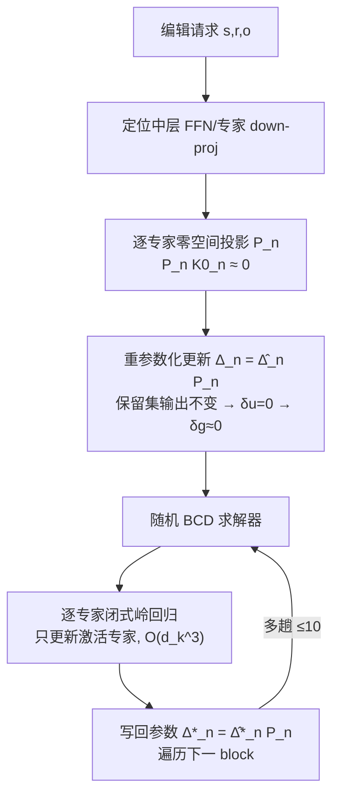

# MoEEdit: Efficient and Routing-Stable Knowledge Editing for Mixture-of-Experts LLMs

**会议**: ICLR 2026  
**OpenReview**: [https://openreview.net/forum?id=BV4oHxGBx7](https://openreview.net/forum?id=BV4oHxGBx7)  
**代码**: [https://github.com/Terence-Gu/MoEEdit](https://github.com/Terence-Gu/MoEEdit)  
**领域**: 知识编辑 / Mixture-of-Experts / 大模型  
**关键词**: 知识编辑, MoE, 路由稳定性, 零空间投影, 块坐标下降  

## 一句话总结
MoEEdit 是首个面向 MoE 大模型的「路由稳定」参数修改式知识编辑框架，用「逐专家零空间投影」保证编辑不扰动下游路由器输入，再用随机块坐标下降（BCD）求解器把代价从专家总数解耦到专家隐藏维度，从而在稀疏架构上同时拿下高编辑成功率、强泛化与路由稳定性。

## 研究背景与动机
**领域现状**：知识编辑（KE）让人能精准修订 LLM 里过时或错误的事实（如「法国首都是柏林」），主流的参数修改式方法走 locate-then-edit 路线——定位中层 FFN 的 down-projection 权重，把它当成 key→value 的线性联想记忆，再做结构化更新（ROME、MEMIT、PMET），AlphaEdit 进一步把更新投影到保留集的零空间以提升局部性。

**现有痛点**：这些方法清一色是为**稠密** Transformer 设计的，默认所有参数对每个 token 都激活。但 SOTA 大模型越来越多采用 MoE 架构（如 Qwen3-30B-A3B 是 128 选 8），稀疏、输入相关的计算让稠密编辑器水土不服。

**核心矛盾**：MoE 编辑面临**三重耦合困境**——(1) **计算代价**：朴素照搬意味着要更新全部专家，代价乘以专家数（128×），不可行；(2) **专家耦合**：层输出是多个专家输出的门控加权和，改一个专家会被其他专家稀释或引发副作用，需要在合适的专家间合理分摊更新；(3) **路由分布漂移**（最隐蔽）：某层参数扰动会改变下游层的输入流形，让下游路由器选出不同专家，这种级联效应破坏模型学到的路由路径，既伤局部性又伤整体稳定性。三者交织，使得 MoE 编辑远比稠密模型困难。

**本文目标**：提出一个专为稀疏模块化设计、能同时化解三重困境的 MoE 知识编辑器。

**核心 idea**：**把 MoE 知识编辑重述为「每个专家是一个 block」的块结构优化问题**，并**首次正式指认「路由诱导的不稳定」是 MoE 编辑的中心障碍**；用逐专家零空间投影从构造上锁死路由器输入不变，配随机 BCD 求解器让代价随专家隐藏维度（而非专家数）线性增长。

## 方法详解

### 整体框架
MoEEdit 把 MoE 编辑目标（式 5：在编辑集 E 上匹配新目标、在保留集 P 上保持稳定）拆成两步处理。先做**重参数化**：每个专家的更新写成 $\Delta_n = \hat{\Delta}_n P_n$，其中 $P_n$ 是逐专家的零空间投影器，保证更新在保留特征方向上恒为零，从而下游路由器输入不变、路由漂移被构造性地压制；这一步同时把保留项从目标里消掉。再做**高效求解**：把消化后的目标交给随机块坐标下降求解器，每次只更新当前 minibatch 里激活的专家，每个子问题是一个 $d_k \times d_k$ 的良条件岭回归闭式解，避免了求逆 $(Nd_k)\times(Nd_k)$ 大矩阵。

### 关键设计

**1. 路由漂移的一阶刻画：定位「只有落在路由嵌入张成空间里的扰动才伤路由」** 作者先把问题诊断清楚。设第 $\ell$ 层路由嵌入为 $E_\ell$，logits 为 $s_\ell = E_\ell^\top u_\ell$，门控权重 $g_\ell = \mathrm{softmax}(s_\ell)$。上一层的扰动让输入变化 $\delta u_\ell$，对 softmax 做一阶 Taylor 展开得 $\delta g_\ell \approx J_{sm}(s_\ell) E_\ell^\top \delta u_\ell$，其中 $J_{sm}(s) = \mathrm{diag}(sm(s)) - sm(s)\,sm(s)^\top$。这个式子点破了关键观察：**只有 $\delta u_\ell$ 落在 $\mathrm{span}(E_\ell)$ 上的分量才会影响路由概率**，而 Jacobian 还会放大这部分分量、放大不稳定。结论很自然——只要把扰动在 $\mathrm{span}(E_\ell)$ 上的投影压住，就能从源头防住路由漂移，这直接指明了第 2 个设计该做什么。

**2. 逐专家零空间投影重参数化：让更新「在保留方向上隐身」** 顺着上面的诊断，作者把 AlphaEdit 的稠密零空间思想推广到逐专家粒度。对专家 $n$，收集保留提示的 key 成矩阵 $K^0_n$，对协方差 $K^0_n K^{0\top}_n = U_n \Lambda_n U_n^\top$ 做特征分解，挑出近零特征值（$\lambda_{n,p} < \tau$）对应的特征向量构成 $U^0_n$，定义投影器 $P_n = U^0_n U^{0\top}_n$——它只保留与所有保留特征正交的方向。于是把更新重参数化为 $\Delta_n = \hat{\Delta}_n P_n$，因为 $P_n k_{i,n} = 0$（$i \in P$），对每个保留样本都有 $\hat{\Delta}_n P_n k_{i,n} = 0$，进而 $\delta u_\ell(i) = 0$，由设计 1 的式子推出 $\delta g_\ell(i) \approx 0$，路由漂移被构造性地消除。代入后的编辑目标（式 8）只剩编辑集匹配项加正则，**保留项被投影自动吸收掉、无需单独写**：$\{\hat{\Delta}_n\} = \arg\min \sum_{i\in E} \lVert \sum_n g_{i,n}(W_n k_{i,n} + \hat{\Delta}_n \tilde{k}_{i,n}) - v_i \rVert^2 + \lambda \sum_n \lVert \hat{\Delta}_n \rVert^2$，其中 $\tilde{k}_{i,n} = P_n k_{i,n}$。

**3. 随机块坐标下降求解器：把代价从「专家数」解耦到「专家隐藏维度」** 式 8 虽然能写出全局闭式解 $\theta^\star = M_{glob}^{-1} b_{glob}$，但即便利用 Kronecker 结构，它仍需对 $d_m$ 个 $(Nd_k)\times(Nd_k)$ 系统做分解，时间 $O(d_m(Nd_k)^3)$、内存 $O(d_m(Nd_k)^2)$，在 $N=8\text{–}128$、$d_k$ 上千的 MoE 上完全不现实，而且 Top-K 的稀疏 Gram 矩阵累加后会迅速变稠密。作者顺势利用「每个专家天然是一个 block」的结构：固定其余专家、只优化专家 $n$，子问题退化为良条件的 $d_k \times d_k$ 岭回归，有闭式解 $\hat{\Delta}_n^\star = B_n M_n^{-1}$，其中 $M_n = \sum_i g_{i,n}^2 \tilde{k}_{i,n}\tilde{k}_{i,n}^\top + \lambda I$、$B_n = \sum_i g_{i,n} r_i^{(-n)} \tilde{k}_{i,n}^\top$，求完写回 $\Delta_n^\star = \hat{\Delta}_n^\star P_n$ 再换下一个 block。实践上以随机顺序遍历、只更新当前 minibatch 激活的专家，组 $M_n$ 花 $O(|E|d_k^2)$、求逆 $O(d_k^3)$（因 $d_k \ll d_m$ 而很小），用带对角加载的 Cholesky 保数值稳定。由于式 8 对 $\{\hat{\Delta}_n\}$ 是严格凸二次型，随机 BCD 全局收敛，实测 $\le 10$ 趟即快速下降。**这套解耦让代价随专家隐藏维度而非专家总数线性增长，可扩展到 128 专家。**

## 实验关键数据

### 主实验表格
在 Qwen3-30B-A3B（128 专家 top-8）与 GPT-OSS-20B（32 专家 top-4）上做 1000 次顺序编辑（batch=50），指标为 Efficacy(Eff.)/Generalization(Gen.)/Specificity(Spe.)及其均值 Utility(Uti.)：

| 方法 | 模型 | CF Eff.↑ | CF Gen.↑ | CF Spe.↑ | CF Uti.↑ | ZsRE Uti.↑ |
|------|------|------|------|------|------|------|
| Pre-edited | Qwen3-30B-A3B | 13.30 | 15.10 | 84.45 | 37.62 | 40.90 |
| UnKE | Qwen3-30B-A3B | 89.30 | 82.85 | 48.15 | 73.43 | 28.84 |
| **MoEEdit** | Qwen3-30B-A3B | **99.30** | **94.10** | 80.97 | **91.46** | **68.43** |
| UnKE | GPT-OSS-20B | 78.00 | 44.40 | 73.91 | 65.44 | 40.66 |
| **MoEEdit** | GPT-OSS-20B | **95.90** | 44.10 | **81.09** | **73.70** | **60.89** |

MoEEdit 在 COUNTERFACT 上两个 backbone 都拿到 90+ efficacy，Utility 全面领先；在 ZsRE 上 efficacy/generalization 比最强 baseline 高 30+ 点，specificity 与 AdaLoRA 差距在 1 点以内。

### 消融实验表格
路由稳定性（Qwen3-30B-A3B / COUNTERFACT，RS = pre/post-edit Top-K 专家集的 Jaccard 相似度，越高越好）及投影消融：

| 方法 | 集合 | Lay.11–20 | Lay.21–30 | Lay.31–40 |
|------|------|------|------|------|
| FT-L | Edit. | 47.01 | 51.20 | 53.68 |
| UnKE | Edit. | 52.46 | 44.12 | 44.80 |
| **MoEEdit** | Edit. | **86.62** | **88.16** | **89.93** |
| MoEEdit (w/o Proj) | Edit. | 73.64 | 72.90 | 73.75 |
| MoEEdit (w/o Proj) | Pres. | 73.59 | 73.08 | 73.50 |

### 关键发现
- **投影是路由稳定的命门**：去掉投影后编辑集 RS 平均掉 14.81 点、保留集掉 15.21 点，KL 散度从 0.02 升到 0.0834。MoEEdit 的平均 KL 仅 0.02，pre/post 平均非重叠专家数接近 1（可忽略），印证「路由重尾性——小扰动只影响贡献甚微的低权重专家选择」。
- **BCD 可扩展性碾压闭式解**：闭式求解器运行时间近二次增长、$N \approx 60$ 后不可行；BCD 到 128 专家仍近常数时间（图 3）。
- **BCD 趟数**：6–10 趟即达性能/效率的良好折中，更多趟只带来边际提升（图 4）。

## 亮点与洞察
- **首次正式指认「路由分布漂移」是 MoE 编辑的中心障碍**，并用 softmax Jacobian 的一阶分析给出可量化、可干预的判据（只压 $\mathrm{span}(E_\ell)$ 上的分量）。
- **诊断→设计→求解的闭环干净利落**：投影把保留项「吃掉」让目标简化，BCD 把专家天然 block 结构变成可扩展求解，理论上严格凸保证全局收敛。
- **「构造性保证」而非「软约束惩罚」**：路由不变是靠投影器从数学上锁死的（$P_n k = 0$），而不是靠损失项软性鼓励，这是它路由稳定性远超 baseline 的根因。

## 局限与展望
- 实验聚焦 COUNTERFACT 和 ZsRE 两个标准事实编辑基准，对多跳推理、长尾关系、portability 等更难的编辑场景未充分验证。
- 零空间投影依赖保留集 key 的协方差与阈值 $\tau$ 的选取，保留集如何采样、$\tau$ 对不同模型的敏感性缺乏系统分析。
- 只在 Qwen3-30B-A3B 与 GPT-OSS-20B 两个 MoE 上验证，更大规模 MoE（数百专家）或共享专家/细粒度专家等变体架构的适配性待检验。
- 方法属参数修改式，长序列编辑下的累积稳定性（远超 1000 次）与对模型通用能力的长期影响仍可深入。

## 相关工作与启发
- **稠密 KE**：locate-then-edit 系（ROME / MEMIT / PMET）把 FFN down-proj 视作 key-value 记忆做结构化更新；AlphaEdit 用保留集零空间投影提升局部性——MoEEdit 正是把这一零空间思想推广到逐专家粒度。
- **参数保留式 KE**：SERAC 用外部编辑记忆做推理时路由；LEMoE 在 adaptor 内部引入 MoE 管理终身编辑——但它给冻结（通常稠密）骨干挂外部模块，处理的是 adaptor 内部的路由一致性，**不触碰 base 模型自身的路由漂移**，与本文正交。
- **MoE 架构**：Shazeer 等的稀疏门控 / GShard / GLaM 把容量与 FLOPs 解耦——正是这种稀疏模块化带来了本文要解决的三重编辑困境。
- **启发**：在稀疏架构上做任何「局部干预」（编辑、剪枝、对齐、unlearning）都要把「路由稳定性」当一等公民，否则局部改动会通过路由级联成全局扰动。

## 评分
- **新颖性**: ⭐⭐⭐⭐⭐ 首个面向 MoE 参数修改式 KE 的路由稳定框架，首次形式化路由漂移障碍，问题定义与方法都开创性。
- **实验充分度**: ⭐⭐⭐⭐ 两个真实 MoE backbone + 两个标准基准，主实验/路由稳定/投影消融/BCD 可扩展性/趟数齐全；但基准与模型多样性、更难编辑场景覆盖有限。
- **写作质量**: ⭐⭐⭐⭐⭐ 三重挑战梳理清晰，一阶分析→构造性投影→块求解的逻辑链条紧凑，图 1 总览与公式推导到位。
- **价值**: ⭐⭐⭐⭐⭐ 填补了 MoE 时代知识编辑的关键空白，「路由稳定干预」的洞察对稀疏模型的剪枝/对齐/unlearning 有普适借鉴意义。

<!-- RELATED:START -->

## 相关论文

- [\[ICLR 2026\] MobiEdit: Resource-efficient Knowledge Editing for Personalized On-device LLMs](mobiedit_resource-efficient_knowledge_editing_for_personalized_on-device_llms.md)
- [\[ICLR 2026\] KnowledgeSmith: Uncovering Knowledge Updating in LLMs with Model Editing and Unlearning](knowledgesmith_uncovering_knowledge_updating_in_llms_with_model_editing_and_unle.md)
- [\[ACL 2026\] EvoEdit: Evolving Null-space Alignment for Robust and Efficient Knowledge Editing](../../ACL2026/knowledge_editing/evoedit_evolving_null-space_alignment_for_robust_and_efficient_knowledge_editing.md)
- [\[ACL 2025\] Efficient Knowledge Editing via Minimal Precomputation](../../ACL2025/knowledge_editing/efficient_knowledge_editing.md)
- [\[ICLR 2026\] SUIT: Knowledge Editing with Subspace-Aware Key-Value Mappings](suit_knowledge_editing_with_subspace-aware_key-value_mappings.md)

<!-- RELATED:END -->
