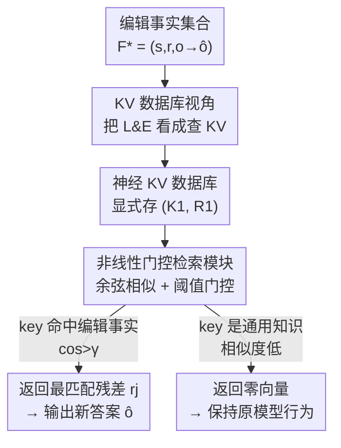

# Scaling Knowledge Editing in LLMs to 100,000 Facts with Neural KV Database

**会议**: ICLR 2026  
**OpenReview**: [https://openreview.net/forum?id=Z0CX62CSJQ](https://openreview.net/forum?id=Z0CX62CSJQ)  
**领域**: 知识编辑  
**关键词**: 知识编辑, Locate-and-Edit, KV 数据库, 门控检索, 海量编辑

## 一句话总结
本文把现有的 Locate-and-Edit 知识编辑方法重新解释为「查询一个 KV 数据库」，并据此提出 NeuralDB——用一个非线性门控检索模块替换原来的线性扰动 $\Delta$，把可编辑的事实容量从几百条扩展到 100,000 条，同时几乎不损伤模型的通用能力。

## 研究背景与动机
**领域现状**：知识编辑（Knowledge Editing, KE）希望在不重训整个 LLM 的前提下，精准修改模型参数里存储的某条事实（如「最近一届世界杯在卡塔尔举办」）。其中要一次性改大量事实的主流方案是 **Locate-and-Edit（L&E）**，代表方法有 MEMIT、D4S、AlphaEdit：它们为每条新事实学一个激活残差，再通过往 FFN 的输出权重 $W_{out}$ 上加一个线性扰动 $\Delta$ 来注入这些残差。

**现有痛点**：这类方法编辑几百条事实还行，一旦规模放大到几千条，就会出现两个崩坏。其一，**通用能力下降**：为了不破坏「通用知识」，L&E 要从 Wikipedia 采样约 100,000 条 key 向量堆成矩阵 $K_0$ 来约束最小二乘解，但这个采样子集根本代表不了模型真正的通用能力，约束失效后 MMLU、推理等任务大幅掉点。其二，**已编辑的事实会被遗忘**：线性系统容量有限，编辑越多，早先写入的事实越容易被后来的覆盖掉。

**核心矛盾**：L&E 用一个**线性扰动矩阵 $\Delta$** 同时承载所有编辑事实，这个线性容器的表达容量是有限的；事实越多越互相干扰，而且必须依赖一个不可靠的 Wikipedia 采样来「圈出」哪些激活不能动。容量瓶颈和通用能力保护这两件事，都卡在「线性」这个根上。

**本文目标**：把知识编辑的容量从几百条提升到几万乃至十万条，且做到（i）编辑成功率高、（ii）通用能力不掉、（iii）支持增删改。

**切入角度**：作者先做了一个关键的理论 + 实证分析——把 MEMIT、AlphaEdit 的闭式解统一改写成 $(W+\Delta_{upd})k = v + R_1\omega$ 的形式，其中权重 $\omega = K_1^\top S k$。实测发现：在已编辑事实上推理时，$\omega$ 几乎是 one-hot（只有对应那条事实的权重非零）；在无关内容上推理时，$\omega$ 几乎是零向量。这说明现有方法本质上就是在**查一个 KV 数据库**：用当前 key 当 query，命中就返回对应残差，不命中就返回零。

**核心 idea**：既然机制本来就是 KV 检索，那就别再用线性 $\Delta$ 去近似它了——直接把编辑事实显式存成一个 **Neural KV Database**，再配一个**非线性门控检索函数**来精确地「命中返回残差 / 不命中返回零」，从根上突破线性容量上限。

## 方法详解

### 整体框架
NeuralDB 是一个即插即用（plug-and-play）的编辑框架，输入是一批待编辑事实 $F^* = \{(s_i, r_i, o_i \to \hat o_i)\}$，输出是一个挂载了门控检索模块的 FFN 层，使模型在被编辑事实上给出新答案、在通用知识上保持原样。整条流程分三步：先把每条事实编码成 key 向量和残差向量，**显式堆成 KV 数据库 $(K_1, R_1)$**；再把一个**非线性门控检索模块** $g(\cdot; K_1, R_1)$ 嵌进目标 FFN 层，替换掉原来的线性扰动 $\Delta$；推理时由**余弦相似度 + 阈值门控**决定是否激活检索——命中就把最匹配的残差加进 FFN 输出，不命中就什么都不做、走原模型的路。

### 关键设计

**1. KV 数据库视角：把线性 L&E 统一解释成「查询一个 KV 数据库」**

这一步是全文的分析基石，针对的痛点是——大家一直把 L&E 当作「往参数上加一个线性扰动 $\Delta$」，却没看清它实际在干什么。作者把 MEMIT、AlphaEdit 的闭式解统一写成
$$(W + \Delta_{upd})k = v + R_1\omega, \qquad \omega = K_1^\top S k \in \mathbb{R}^{m\times 1}$$
其中 $k,v$ 是原始激活的 key/value，$K_1$ 是所有编辑事实的 key 矩阵，$R_1$ 是残差矩阵，$S$ 是不同方法各自的核矩阵（MEMIT 是 $S_1=(K_1K_1^\top+\beta_1 K_0K_0^\top)^{-1}$，AlphaEdit 是 $S_2=P^\top(PK_1K_1^\top P^\top+\beta_2 I)^{-1}P$）。这个改写说明：注入的更新 $R_1\omega$ 就是对残差矩阵 $R_1$ 做的一次**加权平均**，权重 $\omega$ 就是当前 query $k$ 和库里各 key 的自相似度。作者进一步在三个模型上实测 $\omega$：对正样本（被编辑那条）权重显著偏高（AlphaEdit 甚至逼近 1），对负样本和无关事实则趋近 0。于是结论清晰——现有方法本质就是个 KV 检索器，只是用线性闭式解去**近似**这套检索，近似得不够好才有容量瓶颈。这个视角直接指明了改进方向：既然是检索，就应该做一个**真正的、非线性的、容量不受限的**检索器。

**2. 神经 KV 数据库：把编辑事实显式存成 $(K_1, R_1)$ 而非塞进线性 $\Delta$**

既然机制是检索，那就不再让一个线性矩阵去隐式承载所有事实，而是把它们**显式地存下来**。对每条目标事实 $f_i$，按推理过程算出它的 key 向量 $k_i = \sigma(W_{in}N(h_{l-1}+a_l))$ 和残差向量 $r_i = \hat v_i - W k_i$，逐条 append，最后堆成 key 矩阵 $K_1\in\mathbb{R}^{d_1\times m}$ 和残差矩阵 $R_1\in\mathbb{R}^{d_2\times m}$，二者按列一一对齐（$k_i \leftrightarrow r_i$），这就是「神经 KV 数据库」。这样做的好处是直接的：容量不再被线性系统的秩限制，编辑多少条就存多少列，空间复杂度只是 $O((d_1+d_2)\times m)$——在 Llama-3-8B 上编辑 10,000 条事实，额外参数约 150M，仅为原模型的 2.2%。而且因为是一个显式列表，**增删改都变得自然**：加事实就 append 一列，删事实就移除对应列，改事实就替换，不用像线性方法那样重解最小二乘。

**3. 非线性门控检索模块：余弦相似 + 阈值门控，精确「命中返残差 / 不命中返零」**

有了库还需要一个检索函数，把第 1 点观察到的两个需求严格实现出来——（i）判断**要不要**用残差编辑、（ii）确定**用哪条**残差。作者用一个非线性门控函数：
$$g(k; K_1, R_1) = r_j \cdot \mathbf{1}_{\cos(k,k_j) > \gamma}, \qquad j = \arg\max_i \cos(k, k_i)$$
即先用 $\arg\max$ 找出库里和当前 key 余弦相似度最高的那条 $k_j$（解决「用哪条」），再用一个阈值 $\gamma$ 的指示函数当门（解决「要不要」）：相似度超过 $\gamma$ 才放行，把残差 $r_j$ 加到 FFN 输出上，$v_l = W_l k_l + g(k_l; K_1, R_1)$；否则门关闭、输出零向量，模型完全走原路。选余弦相似度是因为它取值落在 $[0,1]$、可解释性好、$\gamma$ 易设，且实验证明在 key 匹配上很有效。这个设计的妙处在于：通用知识的 key 与库里所有编辑 key 相似度都偏低，门天然不激活，所以**通用能力被天然保护**，根本不需要再去 Wikipedia 采样 $K_0$ 那套又贵又不准的近似；而真正的编辑事实因为 key 高度相似会触发门，精准召回对应残差。非线性门控也突破了线性系统的容量天花板，这正是能扩到 100,000 条的根本原因。此外作者发现只在**单个 FFN 层**部署就够了，多层策略带来的增益有限。

### 损失函数 / 训练策略
NeuralDB 本身**不引入额外训练**：key 和残差都按原模型的前向推理直接算出来并存表，门控检索是无参数的（只有一个超参 $\gamma$ 控制门槛）。因此它是一个真正即插即用的模块，编辑成本主要在构建 $(K_1, R_1)$ 这一遍前向，10,000 条事实时推理额外耗时仅增加约 1.5%。

## 实验关键数据

### 主实验
在 CounterFact 和 ZsRE 两个基准、GPT-2 XL / GPT-J (6B) / Llama-3 (8B) 三个模型上评测，指标含 efficacy（编辑成功）、generalization（改写句成功）、specificity（邻近事实不被误改）、fluency（流畅度）、consistency（一致性）。下表为 Llama-3 上从 2,000 条 → 10,000 条事实（箭头 → 表示 10k 结果）的对比：

| 方法 (Llama-3) | Efficacy | Generalization | Specificity | Fluency | Consistency |
|------|------|------|------|------|------|
| Pre-edited（原模型） | 7.9 | 10.6 | 89.5 | 635.2 | 24.1 |
| MEMIT | 63.5→63.4 | 62.8→56.6 | 52.0→50.6 | 466.6→460.4 | 6.5→6.5 |
| RECT | 64.2→60.0 | 62.5→53.9 | 58.9→51.2 | 502.8→399.1 | 12.9→1.6 |
| AlphaEdit | 99.1→75.8 | 94.0→63.1 | 68.6→54.0 | 622.7→417.8 | 32.8→7.0 |
| **NeuralDB** | **99.9→99.2** | **86.6→85.9** | **88.2→85.6** | **632.7→631.0** | **32.9→32.6** |

关键看点：从 2k 放大到 10k，AlphaEdit 的 efficacy 从 99.1 崩到 75.8、consistency 从 32.8 崩到 7.0；而 NeuralDB 在所有指标上都几乎保持 99% 不变，specificity（85.6）和 fluency（631.0）甚至贴近原模型，说明它对无关知识几乎零干扰。GPT-J 与 GPT-2 XL 上呈现同样格局。

### 通用能力 / 扩展性实验
在 SciQ、MMLU、Commonsense QA、ARC Challenge、WSC273、Lambada 六个通用任务上评测编辑后模型，并把编辑量推到 100,000 条（ZsRE 训练集）：

| 编辑量 (Llama-3) | Efficacy | Generalization | Specificity | MMLU |
|------|------|------|------|------|
| 0k（原模型） | 37.0 | 36.3 | 31.9 | 56.2 |
| 10k | 96.9 | 91.4 | 35.1 | 56.2 |
| 50k | 96.1 | 90.7 | 35.2 | 56.2 |
| 100k | 95.5 | 90.2 | 35.1 | 56.9 |

### 关键发现
- **门控检索是保护通用能力的关键**：现有 L&E 在 4,000 条编辑后通用能力就快速下滑，因为它们依赖 Wikipedia 采样的 $K_0$ 去近似通用知识，只有 SciQ 这种「Wikipedia 里有」的任务能撑住、其余任务全垮；NeuralDB 直接用门控判断「相似度低就不动」，在所有任务上都稳。
- **扩展性近乎免费**：编辑量从 10k 一路加到 100k（比 AlphaEdit 多 50 倍），efficacy 仅从 96.9 微降到 95.5，MMLU 不降反升 0.7%；额外推理时间在 20k 编辑时也只增加约 5.5%。
- **单层即可**：只在一个 FFN 层部署门控模块就够了，多层策略增益有限，进一步降低了开销。

## 亮点与洞察
- **「先看懂、再重做」的范式**：本文最漂亮的地方不是某个新模块，而是先用理论改写 + 实证可视化把现有 L&E「拆穿」成 KV 检索（$\omega$ 实测接近 one-hot），再顺势把隐式的线性近似换成显式的非线性检索——动机扎实、改动却极小。
- **用门控替代采样**：现有方法花大力气从 Wikipedia 采 10 万条 key 来「圈出别动的区域」，NeuralDB 用一个余弦阈值门把这件事免费做了——相似度低自然不激活，既省算力又更准，这个「把约束换成门控」的思路可迁移到其他需要「精准触发、否则不动」的参数注入场景。
- **显式数据库带来可运维性**：把编辑事实存成可逐列增删改的列表，让知识编辑第一次具备了像数据库一样的 append/modify/delete 能力，工程上比重解最小二乘友好得多。

## 局限与展望
- 门控阈值 $\gamma$ 是一个需要设定的超参，虽然余弦相似度落在 $[0,1]$ 便于设值，但跨模型/跨数据集是否需要重新调、对边界附近的 key 是否会误触发，仍依赖经验。
- 检索用 $\arg\max$ 余弦相似度做精确最近邻匹配，当编辑量达到 100,000 条时检索本身的开销与近似最近邻的取舍论文未深入讨论（虽报告额外耗时可控，但更大规模或在线服务下的延迟值得关注）。
- 方法本质是「显式存残差 + 命中替换」，对需要**多跳推理/组合**的编辑（如 MQuAKE 类）能否同样稳健，正文只在附录提及，核心实验仍以单条事实替换为主。

## 相关工作与启发
- **vs MEMIT / AlphaEdit（线性 L&E）**：它们用一个线性扰动 $\Delta = R_1 K_1^\top S$ 隐式承载所有编辑，靠 Wikipedia 采样 $K_0$ 约束通用知识；本文证明这等价于一次加权平均的 KV 检索，于是直接换成显式 $(K_1,R_1)$ + 非线性门控，容量和通用能力保护都更强。
- **vs SERAC / GRACE（记忆型方法）**：同属「外挂记忆」思路，但它们的 generalization 只有约 50%（改写句就认不出），NeuralDB 在 key 空间用余弦匹配，改写句的 key 仍相似，generalization 接近 90%。
- **vs ROME / FT（少量/微调编辑）**：ROME 一次只改一条、FT 易灾难性遗忘，都无法扩到上万条；NeuralDB 的设计目标正是海量编辑，规模差了两到三个数量级。

## 评分
- 新颖性: ⭐⭐⭐⭐⭐ 把 L&E 统一解释成 KV 检索并据此重设计，视角新且落地干净
- 实验充分度: ⭐⭐⭐⭐⭐ 三模型两基准 + 六通用任务，且真做到了 100k 规模
- 写作质量: ⭐⭐⭐⭐ 理论改写到方法的逻辑链清晰，部分细节（检索效率、γ 调参）留在附录
- 价值: ⭐⭐⭐⭐⭐ 把可编辑容量提升 50 倍且不损通用能力，对可定制化部署很实用

<!-- RELATED:START -->

## 相关论文

- [\[ICLR 2026\] MobiEdit: Resource-efficient Knowledge Editing for Personalized On-device LLMs](mobiedit_resource-efficient_knowledge_editing_for_personalized_on-device_llms.md)
- [\[ICLR 2026\] KnowledgeSmith: Uncovering Knowledge Updating in LLMs with Model Editing and Unlearning](knowledgesmith_uncovering_knowledge_updating_in_llms_with_model_editing_and_unle.md)
- [\[ACL 2025\] CKnowEdit: A New Chinese Knowledge Editing Dataset for Linguistics, Facts, and Logic Error Correction in LLMs](../../ACL2025/knowledge_editing/cknowedit_chinese_knowledge_editing_dataset_llms.md)
- [\[ICLR 2026\] MoEEdit: Efficient and Routing-Stable Knowledge Editing for Mixture-of-Experts LLMs](moeedit_efficient_and_routing-stable_knowledge_editing_for_mixture-of-experts_ll.md)
- [\[CVPR 2026\] Attribution-Guided Model Rectification of Unreliable Neural Network Behaviors](../../CVPR2026/knowledge_editing/attribution-guided_model_rectification_of_unreliable_neural_network_behaviors.md)

<!-- RELATED:END -->
