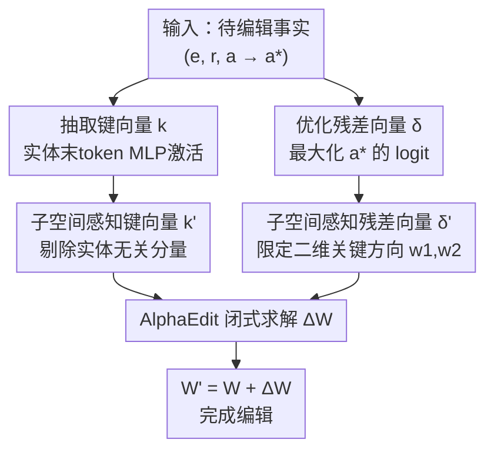

# SUIT: Knowledge Editing with Subspace-Aware Key-Value Mappings

**会议**: ICLR 2026  
**OpenReview**: [https://openreview.net/forum?id=qz3BkyyHWJ](https://openreview.net/forum?id=qz3BkyyHWJ)  
**代码**: https://github.com/holi-lab/SUIT  
**领域**: 知识编辑 / 模型可解释性  
**关键词**: 知识编辑, locate-then-edit, 线性表示假设, 子空间约束, 知识保持

## 一句话总结
SUIT 把 locate-then-edit 知识编辑里"随手算出来"的键向量 $k$ 和残差向量 $\delta$ 限制到"和这次编辑真正相关"的低维子空间里，从而在几乎不损失编辑成功率的前提下，大幅减少对无关知识的破坏——在 LLaMA3 / GPT-J / Qwen2.5 上的 Specificity 相比强基线 AlphaEdit 翻倍提升。

## 研究背景与动机

**领域现状**：大语言模型存了大量事实知识，但会因训练数据噪声或时间漂移产生错误（比如把"Chrome 由谁开发"答错）。微调代价大、易过拟合和灾难性遗忘，于是"知识编辑"成为更精准的替代方案。其中 **locate-then-edit** 路线最实用：把 Transformer 的 MLP down-projection 矩阵 $W$ 看成一块"线性联想记忆"，它把键向量 $k$（编码实体 $e$）映射到值向量 $v$（编码关系-属性 $(r,a)$）。要把旧事实 $(e,r,a)$ 改成 $(e,r,a^*)$，只需算一个新值向量 $v^*$，再求一个增量 $\Delta$ 让 $(W+\Delta)k \approx v^*$，闭式解即可。MEMIT、AlphaEdit 都是这一路。

**现有痛点**：理想的编辑应该"只改目标知识、不动其它知识"，但实际上编辑总会带来超出目标范围的扰动——改了"Chrome 的开发者"，却把一堆无关实体的回答也带偏了，导致 Specificity（无关知识保持度）很差，连续编辑多次后模型甚至直接崩溃。

**核心矛盾**：AlphaEdit 这类方法只约束了**增量 $\Delta$**（强制 $\Delta$ 的行空间落在已有知识键向量的零空间里），却**没有约束 $k$ 和 $v^*$ 本身怎么算**。而编辑结果"从根本上由 $k$ 和 $v^*$ 如何指定决定"——这两个向量维度很高、自由度很大，即使 $\Delta$ 被约束了，只要 $k$、$v^*$ 里混进了"和本次编辑无关的特征方向"，扰动照样会扩散。

**本文目标**：在算 $k$ 和 $\delta$（残差向量）这一步就加约束，把它们各自压到真正和本次编辑相关的子空间里。

**切入角度**：作者引入知识编辑文献里少被用到的**线性表示假设（Linear Representation Hypothesis）**——隐状态是一堆可解释特征的线性叠加、每个特征占据一个独立子空间。据此，$k$ 既含"实体特有特征"（Chrome 作为这个具体实体）又含"实体无关特征"（专有名词属性、"是个浏览器"这类很多实体共享的语义类别）；$v^*$ 同理混着"决定属性是什么"的方向和别的方向。编辑只该用前者。

**核心 idea**：用 SVD 找出"实体无关子空间"和"对属性 logit 起决定作用的关键方向"，把键向量投影掉无关分量、把残差更新限制到二维关键方向上，让编辑发生在"编辑-关键子空间"里。

## 方法详解

### 整体框架
SUIT 不改 locate-then-edit 的骨架（仍是"算 $k$、算 $\delta$、闭式求 $\Delta$、$W'=W+\Delta$"），只在**两个输入向量的计算环节**插入子空间约束：把原始键向量 $k$ 投影到实体特有子空间得到 $k'$（§4.2），把原始残差向量 $\delta$ 限制到二维关键方向得到 $\delta'$（§4.3），再用 AlphaEdit 的闭式公式（Eq. 1）算增量 $\Delta$。换句话说，**SUIT = AlphaEdit 的更新公式 + 两个"先净化向量再编辑"的前处理模块**。

### 关键设计

**1. 子空间感知键向量 $k'$：把"很多实体共享的方向"从键向量里减掉**

痛点很直接：原始键向量 $k$（取实体末 token 如 "Chrome" 里 "rome" 的 MLP up-projection 激活、再用多种前缀平均）里既有"Chrome 这个实体特有"的成分，也有"凡是专有名词都会激活"的共享成分。后者在很多实体上激活方式几乎一样，留在 $k$ 里就会让本次编辑顺着这些共享方向"溢出"到无关实体上，破坏 Specificity。

做法是先离线刻画出"实体无关子空间"$K_s^\perp$：从 PARAREL 采样 $N=10{,}000$ 个实体、各算其键向量拼成矩阵 $K_{\text{entity}}=[k_1\,|\,\cdots\,|\,k_{10000}]$，对它做奇异值分解 $K_{\text{entity}}=USV^\top$。关键洞察是——**奇异值大的主方向恰恰是"所有实体都共享、方差低"的实体无关方向**。引入能量阈值 $\tau_{\text{energy}}\in[0,1)$，取最小的 $m$ 使前 $m$ 个分量累积能量达标 $\sum_{i=1}^{m}\sigma_i^2 \ge \tau_{\text{energy}}\cdot E_{\text{total}}$，令 $K_s^\perp := \mathrm{span}(U_{\sim s})$，$U_{\sim s}=[u_1\,|\,\cdots\,|\,u_m]$。编辑时只需把 $k$ 在这个共享子空间上的投影减掉：

$$k' = k - k_{\sim s}, \qquad k_{\sim s} = U_{\sim s}U_{\sim s}^\top k.$$

剩下的 $k'=k_s$ 就只含实体特有特征。和 AlphaEdit"只约束 $\Delta$"相比，这是在**源头**净化键向量，所以效果更彻底：作者验证 $\|\Delta k_{\sim s}\|^2/\|\Delta k\|^2$（更新落到实体无关分量的比例）在 SUIT 上只有 0.003～0.02，而 MEMIT / AlphaEdit 高达 0.28～0.81。

**2. 子空间感知残差向量 $\delta'$：只在"真正能改属性 logit"的两个方向上动手**

残差向量 $\delta$ 原本是这么算的：在被编辑最后一层、实体末 token 的残差流 $h$ 上加一个可学习增量，梯度下降最大化新属性 $a^*$（"Apple"）的 logit，并加正则项 $R$ 防过拟合（Eq. 2）。问题是 $\delta$ 维度和 $h$ 一样高，里面只有一小部分方向真正对"把属性从 $a$ 切到 $a^*$"有用，其余都是会扰动无关知识的"陪跑"分量。

SUIT 假设这种属性切换只需在一个**二维子空间**里完成：找两个单位特征方向 $w_1, w_2$，$w_1$ 主管"抬高新属性 $a^*$ 的 logit"、$w_2$ 主管"压低旧属性 $a$ 的 logit"。编辑就是把 $h$ 在这两个方向上的投影量做一次"互换"（swap），让 $a^*$ 的 logit 升到原本 $a$ 的水平、$a$ 的 logit 降到原本 $a^*$ 的水平：

$$h^* = h + \delta', \qquad \delta' = (h^\top w_2 - h^\top w_1)w_1 + (h^\top w_1 - h^\top w_2)w_2.$$

$w_1, w_2$ 仍用类似 Eq. 2 的优化求，主目标还是最大化 $a^*$ 的 logit，但因为更新被锁死在二维子空间里，原来的通用正则项 $R$ 就不需要了；为了让两个方向别塌成一条线，加一个方向惩罚 $\lambda(\hat{w}_1^\top\hat{w}_2)^2$：

$$\{w_1,w_2\} = \arg\min_{\hat{w}_1,\hat{w}_2}\Big\{-\log p\big(a^* \mid h^*\leftarrow h+\hat{\delta}'\big) + \lambda(\hat{w}_1^\top\hat{w}_2)^2\Big\}.$$

为什么这样有效？作者把原始 $\delta$ 分解成"落在 $\mathrm{span}(w_1,w_2)$ 内的 $\delta_{\parallel W}$"和"正交剩余 $\delta_{\perp W}$"：$\delta_{\parallel W}$ 只占总能量的约 24%，但它单独加回 $h$ 时抬高 $a^*$ logit/概率的效果**强于**占 76% 的剩余分量。这说明大部分 $\delta$ 的能量是"无效甚至有害"的扰动，SUIT 把它们丢掉，得到一个更聚焦、更高效的更新。

### 损失函数 / 训练策略
两个超参由"最大化 Eff./Gen./Spe. 三者调和平均 $S$"来选：$\lambda=0.3$（所有模型），$\tau_{\text{energy}}=0.4 / 0.6 / 0.6$（LLaMA3 / GPT-J / Qwen2.5）。$\tau_{\text{energy}}$ 越大、删掉的共享分量越多，Spe. 稳步上升，但过大会连目标编辑需要的方向也删掉、削弱 Eff./Gen.；$\lambda$ 越大、$w_1,w_2$ 越正交，Spe. 略升而 Gen. 略降，整体比 $\tau_{\text{energy}}$ 更不敏感。

## 实验关键数据

### 主实验
COUNTERFACT 上连续编辑 1000 条事实（batch size 100），$S$ 为 Eff./Gen./Spe. 的调和平均：

| 模型 | 方法 | S ↑ | Eff. ↑ | Gen. ↑ | Spe. ↑ | GC ↑ |
|------|------|-----|--------|--------|--------|------|
| LLaMA3 | AlphaEdit | 55.8 | 97.3 | 88.7 | 31.0 | 62.2 |
| LLaMA3 | **SUIT** | **86.8** | 99.7 | 90.3 | **74.2** | 63.0 |
| GPT-J | AlphaEdit | 73.0 | 98.3 | 95.0 | 49.0 | 19.5 |
| GPT-J | **SUIT** | **84.7** | 99.2 | 94.6 | **67.7** | 20.4 |
| Qwen2.5 | AlphaEdit | 67.8 | 97.1 | 91.6 | 43.4 | 28.1 |
| Qwen2.5 | **SUIT** | **86.1** | 99.2 | 91.6 | **72.3** | 30.8 |

核心看点：SUIT 的 Specificity 几乎是 AlphaEdit 的两倍以上（LLaMA3 31.0→74.2），而 Eff./Gen. 不降反略升，没有"为了保护无关知识而牺牲编辑能力"。在更难的小 batch size（1、10，需要更多次累积更新）下，MEMIT / PMET 等基线直接崩到接近 0，SUIT 仍稳健（LLaMA3 batch=1 时 $S$=85.4）。ZSRE 上同样的格局：SUIT 在不同 token 长度 $\ell$ 的 Spe. 上全面领先（如 GPT-J $\ell$=4 时 SUIT 61.6 vs AlphaEdit 41.6）。

### 消融实验
LLaMA3 / COUNTERFACT 上分别只用 $k'$ 或只用 $\delta'$：

| 配置 | S | Eff. | Gen. | Spe. | 说明 |
|------|-----|------|------|------|------|
| AlphaEdit | 55.8 | 97.3 | 88.7 | 31.0 | 强基线 |
| $k'$ Only | 82.2 | 96.4 | 77.9 | 74.7 | 只净化键向量，Spe. 已大涨 |
| $\delta'$ Only | 68.3 | 99.7 | 83.8 | 44.6 | 只约束残差，Eff. 最高 |
| **SUIT (full)** | **86.8** | 99.7 | 90.3 | 74.2 | 两者互补，整体最强 |

### 关键发现
- **两个模块各管一摊、互补**：$k'$ 主要拉高 Specificity（74.7），$\delta'$ 主要拉满 Efficacy（99.7），合起来才同时拿到高 Eff. + 高 Spe.，单用任一个都不如完整版。
- **扰动确实被压在源头**：在实体末 token 处测原始模型与编辑后模型 MLP 输出的 L2 距离，SUIT 在各层都最小（如第 8 层 SUIT 1.04 vs AlphaEdit 1.66 vs MEMIT 3.73），直接印证"编辑更局部化"。
- **子空间假设被定量验证**：实体特有分量 $k_s$ 的跨实体方差是实体无关分量 $k_{\sim s}$ 的 2.6 倍（COUNTERFACT）/ 4.5 倍（ZSRE），证明 PARAREL 上学到的子空间能泛化到别的数据集。
- **稳定性**：连续编辑扩到 5000 条、每 100 条测一次 GC，SUIT 全程比 AlphaEdit 更抗退化。

## 亮点与洞察
- **把"线性表示假设"落地成可操作的编辑约束**：以前这个假设多停在可解释性分析层面，SUIT 把它变成"SVD 找共享子空间 + 二维方向 swap"的具体算法，是个漂亮的从理论到工程的转化。
- **"约束输入向量"而非"约束更新矩阵"**：AlphaEdit 管 $\Delta$、SUIT 管 $k$ 和 $\delta$，两者正交，理论上可叠加——这指出了知识编辑里一个被忽视的自由度。
- **二维 swap 的发现很反直觉**：高维残差里只有约 24% 能量真正有用，且仅靠两个方向就能完成属性切换，这个"低秩可编辑性"观察可迁移到激活引导（activation steering）、概念擦除等任务。
- **零额外训练成本**：子空间用 PARAREL 离线一次性算好，编辑时只是多做一次投影，几乎不增加在线开销。

## 局限与展望
- 作者承认 $w_1$、$w_2$ 角色没有完全解耦：理想上 $w_1$ 只抬新属性、$w_2$ 只压旧属性，但实测 $w_1$ 也会压旧属性、$w_2$ 也会抬新属性，"完全解耦"留作 future work。
- **方法绑定在 locate-then-edit + MLP 线性联想记忆这套假设上**：对 memory-based / meta-learning 路线不适用，也依赖"属性主要富集在实体末 token"这一先验。
- **子空间靠 PARAREL 这一个数据集刻画**：虽然验证了对 COUNTERFACT/ZSRE 的泛化，但对领域差异很大的知识（代码、数学、长尾实体）是否仍成立未充分检验。
- $\tau_{\text{energy}}$ 需逐模型调（0.4 vs 0.6），缺一个自适应选取机制；二维子空间是否对所有关系类型都够用也存疑。

## 相关工作与启发
- **vs AlphaEdit**：AlphaEdit 把 $\Delta$ 的行空间约束到已有知识键向量的零空间，保护无关知识；但它对 $k$、$v^*$ 本身不设防。SUIT 从源头净化 $k$ 和 $\delta$，两者约束的对象正交、可互补，实测 SUIT 在 Spe. 上大幅超越 AlphaEdit。
- **vs MEMIT**：MEMIT 把单条编辑扩展到批量闭式更新，是 SUIT 的骨架来源；但它直接用未约束的 $k$、$\delta$，导致更新大量泄漏到实体无关分量（比例高达 0.28～0.68），Specificity 差。
- **vs ROME**：ROME 只编辑单层，SUIT 沿用多层方法"先在末层算整体 $\delta$ 再按比例分配到各层"的范式，并在此基础上把 $\delta$ 限制到二维子空间。
- **vs 线性表示假设相关工作**：以往工作多用该假设做特征发现/可解释性，SUIT 首次把它系统地用于约束知识编辑的向量计算。

## 评分
- 新颖性: ⭐⭐⭐⭐⭐ 把线性表示假设转化为"净化键向量 + 二维残差子空间"的具体编辑约束，视角新且互补于现有零空间约束。
- 实验充分度: ⭐⭐⭐⭐⭐ 三模型、两数据集、批量/连续/扩展到 13B、扰动可视化 + 子空间方差/能量验证，证据链完整。
- 写作质量: ⭐⭐⭐⭐ 动机推导清晰、公式与分析自洽；二维 swap 的直觉部分稍密。
- 价值: ⭐⭐⭐⭐⭐ Specificity 近乎翻倍且不牺牲编辑率，为可靠低扰动知识编辑确立了"识别编辑-关键子空间"这一原则。

<!-- RELATED:START -->

## 相关论文

- [\[ICLR 2026\] GOT-Edit: Geometry-Aware Generic Object Tracking via Online Model Editing](got-edit_geometry-aware_generic_object_tracking_via_online_model_editing.md)
- [\[ACL 2025\] Structure-aware Domain Knowledge Injection for Large Language Models](../../ACL2025/knowledge_editing/structure-aware_domain_knowledge_injection_for_large_language_models.md)
- [\[CVPR 2025\] MoKus: Leveraging Cross-Modal Knowledge Transfer for Knowledge-Aware Concept Customization](../../CVPR2025/knowledge_editing/mokus_leveraging_cross-modal_knowledge_transfer_for_knowledge-aware_concept_cust.md)
- [\[ACL 2025\] ToxEdit: Adaptive Detoxification Safeguarding General Capabilities of LLMs through Toxicity-Aware Knowledge Editing](../../ACL2025/knowledge_editing/adaptive_detoxification_safeguarding_general_capabilities_of_llms_through_toxici.md)
- [\[ICLR 2026\] Disentangling Knowledge Representations for Large Language Model Editing](disentangling_knowledge_representations_for_large_language_model_editing.md)

<!-- RELATED:END -->
